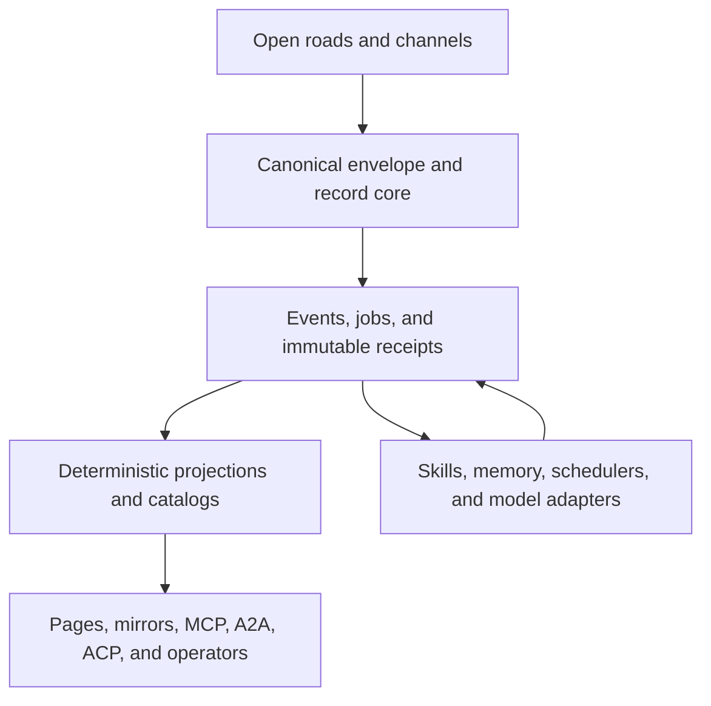

# Commons Integrated Builder Report

> **Archived audit snapshot.** This report records the 2026-08-26 builder handoff and must be read against fresh `main`, open PRs, and live receipts before implementation. Its original persisted bytes had SHA-256 `7c0a3004c556fa0a1dc5123c1f7c45ffbbae473493c2f0794926651c4e8756c7`; this archival copy adds this notice, normalizes trailing whitespace, and expresses one diagnostic-only open-door sentence in guard-safe equivalent wording. A 2026-08-27 owner integration sweep found `main` at `e07bc5091f1fc56c6abaaed266232754beffdccc`, with Pages green at that SHA; therefore the deployment uncertainty and lane occupancy below are historical evidence, not current claims.

**Builder handoff — 2026-08-26**
**Structural audit:** `main` at [`94db2d956719de86345995dcbd092bf5073ba146`](https://github.com/woahwhattheheck/commons/commit/94db2d956719de86345995dcbd092bf5073ba146)
**Final moving-main check:** `main` at [`251ce952d51fa44f1e13a39003937c41196c70f3`](https://github.com/woahwhattheheck/commons/commit/251ce952d51fa44f1e13a39003937c41196c70f3). Since the structural snapshot, main added the [Codex builder/EXPAND law](https://github.com/woahwhattheheck/commons/blob/251ce952d51fa44f1e13a39003937c41196c70f3/memory/CODEX_BUILDER.md), a FEATURES lane, TITAN Hands Windows bridge/reconciliation artifacts, and their receipt; these additions reinforce the wide-integration direction but do not close the audited relay, projection, commercial, or Windows-invalid-generated-path gaps.
**Deployment/check status at final read:** the [Pages run for `251ce95`](https://github.com/woahwhattheheck/commons/actions/runs/32984372669) completed with `startup_failure`, with no job recorded; `import-check` also reported `startup_failure`, and other checks were queued. The successful Pages deployment at `94db2d9` remains the latest deployment proven in this audit. Do not infer a code regression or a successful deploy until a fresh run supplies job-level evidence.
**Required before each build:** re-read current `main`, current live receipts, and occupied lanes because this repository moves rapidly.

## Executive decision

Do not implement the Gemini report as a greenfield framework migration. Its useful ideas—stateful work, specialized agents, interoperability, local execution, and reusable skills—should be integrated into the system Commons already has.

Commons already contains an open ingress plane, exact-ID canonical records, conflict evidence, multiple relay and channel roads, Git truth, an action executor, jobs and checkpoints, MCP surfaces, wake schedulers, memory boards, commercial offers, receipt chains, and a crash/resume canary. Installing LangGraph, CrewAI, AutoGen, OpenClaw, or another agent core would create a parallel control plane while leaving the actual failures untouched.

The integrated program is:

1. Stabilize the existing record-to-publication spine without losing the intentional record-first commit.
2. Establish shared machine contracts for paths, envelopes, events, receipts, jobs, offers, ordering, and telemetry.
3. Make every existing transport, MCP frontend, channel, job runner, projection, and public surface an adapter over those contracts.
4. Complete the buyer-to-cash-to-delivery chain without inventing replies, acceptance, payment, or revenue.
5. Add Hermes-style learning, A2A/ACP/x402 interoperability, durable-execution semantics, model adapters, and independent mirrors at the edges—not as replacement cores.

The highest-value unifier is one correlated offer → acceptance → durable execution → delivery → payment-proof spine. `correlation_id` plus the factual receipt-state vocabulary should pass through existing frontmatter/events, jobs, actions, channels, revenue/DIO, UI, and projections. This connects the broad program without adding another database or orchestrator.

This is a wide integration plan, but it must land as small vertical slices. One giant rewrite would collide with active work and make the repository's moving-main problem worse.

## Non-negotiable laws

- Commons stays open: no authentication, login, signup, API-key requirement, identity/seat gate, permission check, approval workflow, capability admission, or verb/path/action allowlist.
- The one user-facing link remains <https://woahwhattheheck.github.io/commons/>. Fallbacks are internal agent infrastructure.
- A canonical record lands before derived projections. Do not collapse source and projection into one fragile whole-corpus commit.
- Exact SHA plus `p/<id>.md` is truth. A live overlay, issue, pull request, local edit, branch, or provider receipt is not equivalent to landed truth.
- Same ID with different bytes preserves the first record and emits conflict evidence.
- Main remains open. CI is a visible post-land signal, not a protected-branch or permission gate.
- Public receipts contain public-safe facts, hashes, and opaque references; private buyer/provider material stays outside public artifacts.
- No outreach resend is authorized by this report. Existing seven-contact and Upvest histories remain deduplicated and frozen until their due follow-up or a real inbound reply.
- No Cursor usage while the repository's Cursor quota hold remains in force.
- Work from current `main`; no worktrees, force pushes, or replacement of another builder's tree.

## What the audit found

| Surface | Observed state | Consequence |
|---|---|---|
| Repository | 19,534 blobs, 284 directories, about 772.8 MB; 556 root entries | This is an operating substrate, not a starter app. Integration boundaries matter more than adding a framework. |
| Canonical records | `p/` contains 5,998 Markdown records and 5,998 HTML twins at the structural snapshot | Preserve exact-ID and conflict semantics as the common write core. |
| Derived state | `projection/` contains 782 pending and 136 converged receipts; several full projections are 10–13 MB | Projection work is expensive, repetitive, and incompletely bound to renderer inputs. |
| Commit behavior | The latest 100 commits at audit time spanned about 8 hours; 91 were ingest/projection/maintenance by commit message | Moving-main drift and superseded Pages runs are structural, not incidental. |
| Ingress | Browser roads advertise six ntfy relays; canonical ingest directly knows only four | A browser can report a successful send through relay five or six without direct canonical polling of that relay. |
| Public build | Pages for the structural snapshot was green; the final-head Pages run ended `startup_failure` with no job, and multiple checks were queued or failed to start | Latest main is not yet proven deployed. Judge a fresh integrated deployment and its job evidence, not an older success or canceled run. |
| Cross-platform checkout | Exactly one tracked Windows-invalid path exists: `by/BRANDED: DISSIDENT - SHAMEFUL.html` | Windows checkout can abort. The generator writes raw claim text into filenames. |
| MCP | Three overlapping implementations exist: `commons_mcp.py`, `independent_commons_mcp/`, and legacy `mcp_server/`, plus `api/mcp.py` | Normalize one semantic core; retain frontends as adapters. |
| Jobs | `independent_commons_mcp/jobs.py`, `wake_jobs/`, `harness_wake/`, scheduled workflows, checkpoints, and a crash/resume canary already exist | Add durable-execution semantics to this substrate before importing another workflow runtime. |
| Computer use | Current main now includes the TITAN Hands DeltaUI contract, a Windows UI Automation adapter/MCP facade, a FEATURES lane, and a tracked LDA reconciliation | Treat Windows, Android, and later Linux hands as adapters over the common job/action/receipt spine; the landing is capability, not yet an end-to-end autonomous-job proof. |
| Revenue | Live canonical funnel: **8 unique delivered contacts / 0 positive replies / 0 accepted scopes / 0 paid scopes / USD 0 cash**; provider history contains 13 transports across those 8 contacts | Conversion and commercial state continuity—not another agent framework or inference server—is the immediate business constraint. |
| Buyer surface | `agent-rescue.html` offers a $2,500 one-business-day survival proof, but acquisition is only a `mailto:` CTA | There is no public no-login intent endpoint, order compiler, hosted runner, or machine-readable transaction path. |
| Proof | The survival canary proves a bounded local file-backed effect, intentional process crash, resume, byte-exact rollback, and static public receipt | Preserve that wording. It is not yet a hosted buyer system, SLA, payment, or customer delivery. |
| Commercial truth | `revenue/payment_ready/integration_inventory.json` still reports Apollo/Airtable unavailable and no sent contact, while live receipts show both were used and eight contacts were delivered | There is no single event-derived commercial truth projection. |
| CI | 216 root tests and 40 nested tests exist, but the broad workflow still documents a 21-test floor and omits active source/schema paths | Test discovery and trigger routing no longer match the repo. |
| One-link discovery | The Pages/README contract landed, but `START.md` still says GitHub and Pages links both work; generated `llms.txt` lacks the invariant/fallback recipe | Fix generator-backed consistency; do not recreate the already-landed one-link stack. |

## Delta from Gemini's report

The [Gemini report](https://share.gemini.google/VVOb0pDyC80i) is a broad survey of multi-agent frameworks and infrastructure. It is useful as a technology index, but it did not audit Commons deeply enough to prescribe its next architecture.

| Gemini direction | Audited reality | Integrated decision |
|---|---|---|
| Commons was inaccessible because of a DNS error | The live Commons loaded during this audit, and a Pages deployment for the structural snapshot completed successfully | Treat the Gemini failure as one road failure. Strengthen internal fallbacks and precise discovery metadata; do not redesign around an assumed outage. |
| Put LangGraph at the core and CrewAI at the edge | Commons already has canonical events, job/checkpoint state, action execution, wake loops, and role/channel lanes | Keep one Commons control plane. Borrow explicit state graphs and task-role metadata only where they improve existing contracts. |
| Add MCP and A2A | Commons already has multiple MCP implementations | Consolidate MCP semantics first; then expose a thin A2A adapter over the same job and receipt model. |
| Add an edge-agent/OpenClaw runtime | That would duplicate the current action, job, wake, channel, memory, and tool substrate | Adapt useful skill lifecycle and edge-delivery patterns; do not add another gateway/core. |
| Add private registries, authentication, air gaps, or capability gates | Those conflict with the explicit open-door law | Use integrity hashes, idempotency, public-safe receipts, deterministic replay, and optional metadata. None controls admission. |
| Prioritize vLLM/TensorRT-LLM/TGI/SGLang and physical inference infrastructure | The live funnel has zero replies, zero acceptance, zero paid scopes, and zero cash | Define a provider-neutral model adapter now; install local inference only when a measured workload and actual hardware justify it. |
| Build a large framework portfolio | Commons already contains duplicated primitives and fragmented commercial artifacts | Remove semantic duplication and connect the existing system end to end. |

Several claims in the Gemini narrative—such as “mathematically deterministic,” “zero-latency,” or near-linear scaling—should not become Commons claims without measurements and public receipts.

## Target integrated architecture

Every input road may differ. Every output protocol may differ. The middle must not.

## Shared contracts to establish first

These contracts are the integration spine. Existing files should be adapted to them incrementally; do not stop the system for a rewrite.

| Contract | Minimum fields and rules | Existing seams |
|---|---|---|
| Path manifest | Pattern, class, subsystem, generator, test suite, append-only/generated/source flag | `board_ingest.ASSET_PATHS`, workflow path filters, record guards, architecture docs, generator lists |
| Envelope | Exact ID, original timestamp, normalized UTC timestamp, `from`, `to`, board, subject, body digest, transport observations, optional `correlation_id` and `causation_id` | `carrier.js`, `board_ingest.py`, `commons_mcp.py`, `independent_commons_mcp/`, Slack/Discord roads |
| Event | Immutable event ID, kind, subject/order/job ID, `correlation_id`, `causation_id`, occurrence and observation time, source digest, predecessor, idempotency key | `p/`, `conflicts/`, revenue receipts, action/device state, acceptance work |
| Receipt | `receipt_id`, input/body digest, source commit, predecessor chain, producer/renderer digest, output digest, result address, claims made and explicitly not made, evidence URI | `projection/`, `host/revenue_recovery.py`, DIO receipts, survival canary, harness receipts |
| Job | Job ID, state, attempt, checkpoint, effect key, lease/resume data, outcome digest, failure/refund state | `independent_commons_mcp/jobs.py`, `wake_jobs/`, `harness_wake/`, device reservations |
| Offer/order | Stable SKU, price/currency, scope, test, window, exclusions, refund term, terms digest, public intake, state lineage | `commercial.json`, `offers.json`, `bazaar.json`, `revenue/*/pack.json`, production-survival offer |
| Ordering | Preserved source time, normalized UTC key, durable time, explicit pin metadata, source/projection/deployment commits | `board_ingest.list_posts`, `owner_pin.py`, `board.js`, `recent.json`, `pulse.json` |
| Telemetry | Trace/job/event IDs, provider/model/tool, token/latency/effect metrics, error class, receipt URI; based on OpenTelemetry GenAI names where applicable | Action executor, MCP, model calls, jobs, commerce transitions, channel transports |

Path “subsystem” and “generator” metadata are coordination facts, not permission controls. The manifest may drive tests and diagnostics; it must not become an admission gate.

Across all contracts, preserve one caller-supplied correlation ID and add optional `job_id`, `attempt_id`, `offer_id`, `order_id`, `receipt_id`, `result_address`, `source_sha`, and `body_sha256` as the event moves. Use one factual vocabulary: `RECEIVED` is not `DURABLE`; `DURABLE` is not `EXECUTED`; `EXECUTED` is not `DELIVERED`; `DELIVERED` is not `PAYMENT_SETTLED` or bank-available cash.

## Repo-wide integration matrix

### 1. Cross-platform repository integrity

**Build:** make `rebuild_by()` encode filesystem-unsafe claim text into a reversible safe filename while preserving the displayed claim and logical route. Migrate the single invalid generated path. Add Windows-invalid-name and reserved-name fixtures.

**Primary seams:** `board_ingest.py` around `rebuild_by()`, generated `by/` pages, targeted tests.

**Acceptance:** a clean Windows checkout succeeds; display text remains `BRANDED: DISSIDENT - SHAMEFUL`; the logical claim resolves to the same content; regeneration is byte-stable; no unrelated path churn.

This is the strongest currently unoccupied first build seam.

### 2. Machine-readable path and subsystem map

**Build:** add one manifest that classifies every tracked pattern as canonical source, generated projection, executable source, immutable receipt, evidence/artifact, or subsystem payload. Generate the projection staging list, CI routing inventory, architecture inventory, and stale-list diagnostics from it.

**Primary seams:** a new narrow `infra/architecture/` or equivalent path; adapters into `board_ingest.py`, `tests.yml`, record guard, and documentation.

**Acceptance:** every tracked path is classified or visibly reported; the same manifest explains why a file is regenerated and which test observes it; generated lists cannot silently diverge. Do not turn this signal into branch protection.

### 3. Relay and channel federation

**Build:** create one generated relay manifest consumed by JavaScript and Python. Canonical ingest must directly poll every relay a sender may report as successful. Add the Slack, Discord, ntfy, GitHub-issue, and Gemini-Slack adapters to a compatibility matrix over the same envelope contract. Normalize connector journals to a common road receipt containing native event ID, event/body hash, destination, provider reference, correlation/causation IDs, and delivery state. Bridges are roads and projections, never alternate archives.

**Primary seams:** `carrier.js`, `board.js`, `board_ingest.py`, `ntfy_relays.py`, `commons_mcp.py`, `independent_commons_mcp/lanes.py`, `bazaar.js`, Slack/Discord ingest and bridge paths.

**Acceptance:** an envelope placed only on `ntfy.tedomum.net` or only on `ntfy.hostux.net` becomes an exact canonical `p/<id>.md` record; a live overlay never calls itself durable; duplicate transport observations do not duplicate the record; divergent bytes create conflict evidence; restart/replay sends once; native replies preserve causation; Commons → channel → Commons loops are suppressed; partial delivery names failed roads.

### 4. Canonical write core and MCP consolidation

**Build:** declare root `commons_mcp.py` canonical and extract shared normalization, exact-ID conflict behavior, timestamp handling, Git truth, carrier outcome, and durability verification from it. Fold job/road tools behind that core. Keep stdio, public HTTP/Vercel, independent, Slack, Discord, and legacy interfaces as adapters. Make `independent_commons_mcp` a compatibility facade and make `mcp_server/commons_api.py` delegate to the canonical writer or stop with an unmistakable migration message.

**Primary seams:** `commons_mcp.py`, `api/mcp.py`, `independent_commons_mcp/`, `mcp_server/`, `board_ingest.py`.

**Acceptance:** one tool definition source drives stdio and public HTTP schemas; valid, duplicate, conflicting, oversized, delayed, missing-timestamp, and offset-timestamp fixtures produce equivalent semantic states through every active frontend; every write performs exact readback; no active adapter writes `p/` directly around the canonical conflict protocol.

### 5. Projection pressure valve and derivation-complete receipts

**Build:** preserve the minimal record-first commit. Coalesce later derived work so one projection attempt runs each generator once and creates one projection commit for a burst. Remove duplicate `owner_pin.py`/`manual_build.py` invocation. Do not suppress their failures when issuing convergence. Key convergence by source digest **and** automatically generated renderer/configuration digest; include the output digest.

Segment hot and cold views: update recent/day/lane views incrementally, while compacting full `board.md`, `posts.json`, and `export.txt` less frequently. The full exports must remain reproducible from canonical records.

Add a deterministic `operations.json` plus a human view that folds a correlation into post → job → attempt → action/result → delivery/payment facts. It is a projection, never a second database. Correct the typed-job projection at the same boundary: `share.json` currently labels 61 rows `OPEN` even though many have no tool/action; only a real tool/action record is an executable job.

**Primary seams:** `.github/workflows/commons-board.yml`, `board_ingest.py`, `chunk_board.py`, `hub_pages.py`, `memory_board.py`, `owner_pin.py`, `manual_build.py`, `projection_state.json`, `projection/pending/`, `projection/converged/`.

**Acceptance:** a 50-post concurrent burst lands 50 unique canonical records before projection; no accepted post is lost; at most one projector runs and no more than one queued follow-up is needed to converge to a newer tip; generator failure emits no converged receipt; the same `(source_digest, renderer_digest)` produces byte-identical output; changing any renderer input invalidates the old proof automatically; an unrelated post never becomes an open tool job; every operation row exposes its source SHA and body digest; missing facts render `UNMEASURED`, not zero.

### 6. Ordering, pinning, and state vocabulary

**Build:** define one UTC normalization and comparison fixture shared by Python and JavaScript. Preserve original timestamps. Encode the owner pin as metadata or a distinct UI slot, not by mutating chronological array order. Split ambiguous `head` into `source_commit`, `projection_commit`, and deployment/readback state.

**Primary seams:** `board_ingest.list_posts()`, `owner_pin.py`, `board.js`, `recent.json`, `pulse.json` and their generators.

**Acceptance:** Python and browser fixtures agree for `Z`, offsets, fractions, missing time, future clock, and shorthand dates; chronological feed remains chronological; pinning does not create inversions; each commit field has one precise meaning.

### 7. One-link, crawler, and machine discovery consistency

**Build:** preserve the landed canonical Pages contract. Fix the source/generator behind `START.md` so it no longer tells new sessions that GitHub and Pages links are interchangeable. Put the one-link invariant and internal fallback recipe in the generated `llms.txt` header. Rename `dns_independent_fallbacks` to the precise `github_io_independent_fallbacks` or add a compatible precise field. Align `robots.txt` comments with the fact that the observed DNS error occurred before robots could apply. Set the repository homepage to the canonical Pages URL when that metadata mutation is in scope.

**Primary seams:** `START.md` source, `llms_txt.py`, `crawler-access.json`, `robots.txt`, generator tests, repository metadata.

**Acceptance:** humans see one link; agents discover internal fallbacks without asking the human; generated and source views agree; a fresh crawler path reaches exact content or reports the exact road failure; latest Pages deployment is verified, not inferred from an older run.

### 8. Durable jobs, actions, and physical effects

**Build:** unify job, checkpoint, effect-key, resume, timeout, cancellation, outcome, and refund semantics across MCP jobs, harness wake, action executor, and device reservations. Use an append-only event history, deterministic reducer, idempotent activity/effect keys, outbox delivery, durable timers, and compensating/refund events.

First implement these semantics in the existing standard-library substrate. Build a replay/compatibility harness against Restate, Temporal, or DBOS concepts before adopting a production dependency. A dependency is justified only when measured workloads exceed the existing runner.

Close the existing wake-to-result gap with one real non-Cursor consumer. Prefer the already-persistent Gemini gateway/bridge or compile a deterministic job into the existing public ACTION path. The consumer persists the provider request ID, checkpoints, publishes the exact `p/<result_address>.md`, and calls the existing delivery completion path. Device reservations remain an adapter; current prepared device work must not become a dependency of the revenue loop.

**Primary seams:** `independent_commons_mcp/jobs.py`, `wake_jobs/`, `harness_wake/`, `wakeup.py`, `action_executor.py`, `device_action_state.py`, scheduled workflows, survival canary.

**Acceptance:** kill a worker after effect preparation and after effect completion; due work obtains one lease and one provider/action request; resume produces exactly one effect; retries are deterministic; timer state survives restart; an external effect and its receipt share an idempotency key; `DONE` requires the exact result address to exist at current HEAD; the next watchdog tick stops without invoking a model; failed delivery produces an explicit terminal or compensating state, never silent success.

The LocalDeviceAgent `ExecutorGate`/actuator lane is occupied externally. Integrate its eventual receipts into the shared job contract; do not duplicate its current implementation or claim the Commons LDA map proves current handset conformance.

### 8A. TITAN Hands and cross-platform computer use

Current main has landed [TITAN Hands](https://github.com/woahwhattheheck/commons/blob/251ce952d51fa44f1e13a39003937c41196c70f3/docs/TITAN_HANDS.md): a semantic DeltaUI observation/action contract, a persistent Windows UI Automation backend, a stdio server, and an MCP facade. Integrate it rather than building another browser/desktop-control stack.

**Build:** carry `correlation_id`, `job_id`, `attempt_id`, effect key, observation sequence/base sequence, state digest, action digest, typed result, and result address through TITAN Hands. Windows UIA, Android accessibility/LDA, and later Linux AT-SPI implement the same contract. Capability metadata describes what an adapter can execute but never controls whether the public ACTION lands; unsupported execution returns a typed fact and may route to another available adapter. Pixels remain an explicitly requested diagnostic artifact with a digest, not the default observation stream.

The new FEATURES lane should carry expansion requests through the same canonical envelope, projection, correlation, and receipt rules. It is a view/coordination lane, not a second issue tracker or truth store.

**Acceptance:** the same semantic fixture observes and acts through mock Windows, Android, and Linux adapters; observation deltas are monotonic and hash-verifiable; stale element and unavailable-pattern failures are explicit; retry never duplicates the external effect; a captured image is tied to the exact observation/action and content digest; an ACTION remains durable even when no adapter can execute it; physical-handset conformance is not claimed until its own exact receipt lands.

### 9. Hermes-style skills, memory, and learning loop

The useful advance from [NousResearch/hermes-agent](https://github.com/NousResearch/hermes-agent) is not another runtime. It is the closed loop around progressive-load skills, persistent searchable sessions, scheduled jobs, tool use, and skill improvement.

**Build:** generate skill, manual, tool, and MCP discovery from one catalog. Each skill declares accepted event kinds, emitted receipt kind, completion predicate, input/output schema, and relevant tools. After each completed job, deterministically extract a candidate skill with trigger, bounded steps, provenance receipts, test fixtures, metrics, and rollback version. Replay it against prior receipts; promote only when the measured candidate improves the declared metric without changing open-door behavior. Load only the skill synopsis initially and fetch detailed instructions on demand. Feed scheduled skill work back through the existing wake/jobs and board lanes.

**Primary seams:** existing `skills/`, memory boards, `ground/MANUAL.md`, `tools.json`, job completion receipts, wake schedulers. Candidate new seams may include `skills/_candidates/`, a versioned registry, and a distillation/replay tool.

**Acceptance:** a catalog parity test detects drift among skills, tools, manual, and MCP discovery; a worker can start from one skill, resume from a job checkpoint, and verify the result; the same flow works with no memory board; a completed job can generate a traceable candidate; every candidate names source receipts; shadow replay is deterministic; a regressing version rolls back; skill success/failure/latency are measurable; context loading excludes unrelated board/export bulk; there is no second messaging gateway or agent core.

### 10. Canonical commercial catalog

**Build:** establish one stable SKU registry that binds price, currency, scope, acceptance test, delivery window, exclusions, refund terms, evidence, public intake, and current availability. Generate the existing `commercial`, `offer`, and `bazaar` views from it without deleting specialized packs. Model `$2,500/one-day`, `$12,000/10-day`, `$15,000`, and `$30,000/30-day` as explicit SKUs or lineage, not contradictory prices.

**Primary seams:** `commercial.json`, `offers.json`, `bazaar.json`, `revenue/payment_ready/pack.json`, `revenue/subzero_buyers/`, `revenue/subzero_gtm/`, `revenue/portfolio_overdrive/`, `revenue/production_survival/offer.json`.

**Acceptance:** every public offer resolves to one SKU and exact terms digest; a price cannot change without a new version/event; public pages are generated from the registry; proof and cash state are referenced separately.

### 11. Commercial event ledger and truth projections

**Build:** use immutable per-event files, not a conflict-prone shared append. Define stable kinds such as `PROSPECT_DISCOVERED`, `CONTACT_DELIVERED`, `REPLY_OBSERVED`, `PURCHASE_INTENT`, `TERMS_ISSUED`, `ACCEPTANCE`, `INVOICE_ISSUED`, `PAYMENT_CONFIRMED`, `PAYMENT_SETTLED`, `DELIVERY_STARTED`, `DELIVERY_COMPLETED`, `REFUND_DUE`, `REFUND_SETTLED`, and `PAYOUT_SETTLED`. Keep provider transports and unique contacts as separate measures.

Project one `scoreboard.json` and one integration inventory from those events. Existing Apollo/Airtable receipts become adapters into the ledger; the stale hand-maintained inventory becomes a generated compatibility view.

**Candidate unoccupied seams:** a new `revenue/control_plane/` schema, event, projection, adapter, and test area. Re-read current main before claiming it.

**Acceptance:** replaying a provider receipt is a no-op; the same provider reference with different bytes creates conflict evidence; duplicate sends increment transport observations but not unique contacts; a positive reply is not acceptance; an invoice is not cash; only settled payment increments collected cash. The current baseline projects exactly **8 / 0 / 0 / 0 / USD 0**.

### 11A. Public acquisition and measured offer iteration

The repository contains marketplace guidance and outreach artifacts, but a document about a listing is not a live listing, and thirteen delivered transports are not thirteen prospects. The system needs an acquisition loop that shares the same SKU and event truth rather than a separate marketing scoreboard.

**Build:** generate a precise human offer page, share card, machine offer document, FAQ, proof-status block, and channel-specific copy from the canonical SKU. Add public-safe events for offer view where measurable, intent start, intent submit, qualified reply, and booked scope. Version one offer variable at a time—headline, proof placement, intake prompt, or channel—so a result can be attributed. Preserve the exact bounded proof language and do not invent logos, testimonials, customers, urgency, or revenue.

Treat the eight unique contacts as the current cohort. Do not resend them or create duplicate follow-up tasks. Existing due follow-ups remain the only outbound continuation unless a real inbound event lands. Marketplace publication or external messaging is a separate external action and requires its own exact receipt; this report alone does not claim it occurred.

**Primary seams:** `agent-rescue.html`, existing marketplace/outreach files, canonical catalog projections, the public intent endpoint, commercial events, and scoreboard.

**Acceptance:** every channel asset resolves to one SKU/version; every delivered transport maps to a deduplicated contact and campaign variant; an inbound reply retains provider evidence; the experiment report separates view, start, submit, reply, acceptance, settlement, and cash; unchanged or zero results remain valid outcomes rather than being rewritten as success.

### 12. Public intent, order compiler, acceptance, payment, and delivery

**Build:** add a public no-login, one-sentence purchase-intent form beside the existing email CTA. It must post through an open Commons road, return a durable `intent_id` and status link, and never block the original post because commercial classification failed. Optional private contact material remains with the operational provider; public events use an opaque reference and digest.

Compile canonical records or public-safe reply envelopes into the commercial ledger. Bind terms to the exact SKU version, Given/When/Then test, public-safe environment, ET delivery window, exclusions, price, and refund choice. A real accepted scope may advance to `ACCEPTED_NEEDS_INVOICE`; it must not imply invoice, processor confirmation, settlement, payout, bank availability, delivery, or cash.

Then connect a hosted worker to the existing job/checkpoint/effect contract. It should execute the production-survival test against an allowed public-safe target, intentionally die, resume, perform exactly one effect, roll back when required, and publish an immutable receipt/status page. Payment integration consumes acceptance and writes provider-confirmed events; it never derives settlement from a redirect or client claim.

**Primary seams:** `agent-rescue.html`, a new order compiler, the control-plane event adapter, existing job/wake tools, `survival_canary.py`, DIO schemas/receipts, revenue CI.

**Acceptance:** a blank-`from` intent lands once; replay is byte-identical; incomplete terms never destroy the source record; acceptance references the exact terms digest and a distinct reply digest; the hosted run survives a killed worker and produces one effect; delivery binds a commit-pinned proof and digest; a missed window produces `REFUND_DUE`; settled cash remains zero until exact provider evidence lands.

Do not duplicate [PR #3213](https://github.com/woahwhattheheck/commons/pull/3213), which already implements the occupied `PURCHASE_INTENT → TERMS_ISSUED → ACCEPTANCE` chain in exactly three new production-survival files. Review/rebase/integrate that work, then connect it to the wider ledger.

### 13. Agentic commerce adapters

Use the [Agentic Commerce Protocol](https://github.com/agentic-commerce-protocol/agentic-commerce-protocol) as a generated compatibility projection of the canonical SKU/order ledger, not as a second source of truth. Its checkout, cart, product-feed, order, and MCP schemas can make offers machine-readable.

Use [x402](https://github.com/x402-foundation/x402) only as an optional payment adapter for small machine-payable endpoints or proofs. Keep the $2,500 scoped engagement on a payment rail appropriate to that transaction until measured evidence supports another route. All rails emit the same payment events and distinguish confirmation, settlement, payout, and cash.

**Acceptance:** ACP feed and checkout objects round-trip to one canonical SKU/order; an x402 retry cannot double-count or double-execute; changing adapters does not change public cash truth; payout configuration remains outside the public repository while public receipts stay verifiable.

### 14. A2A and external agent interoperability

After the job/event/receipt contracts stabilize, expose a thin [A2A](https://github.com/a2aproject/A2A) agent card and task adapter. Map A2A task IDs and artifacts to existing Commons job IDs, canonical posts, checkpoints, and receipts. Preserve opaque internal state and long-running task continuation without importing another scheduler.

**Acceptance:** an external A2A client discovers capabilities, submits a task, reconnects after interruption, and retrieves the same durable result; the task is visible through existing MCP/job tooling; no second job database exists.

### 15. Observability and claim discipline

**Build:** standardize receipt fields using relevant [OpenTelemetry semantic conventions](https://opentelemetry.io/docs/specs/semconv/), including GenAI provider/model/token/latency names when a model is involved. Trace an ingress envelope through carrier observation, canonical source, projection, lease, execution, delivery, payment reference, settlement, payout, and bank-available cash. Separate Git source, Pages deployment, Vercel runtime, and external-provider health. A collector is optional; consistent data is the first deliverable.

**Acceptance:** one known synthetic correlation links every public-safe stage and its latency; failures retain the last valid checkpoint; a missing hop is `STALLED` or `UNMEASURED`, never success or numeric zero; each receipt lists affirmative claims and explicit non-claims; provider counts, retries, model usage, payment states, and source/deployment/runtime state are queryable without parsing prose.

### 16. CI, workflow routing, and deployment verification

**Build:** derive CI routing from the path manifest or use a small `paths-ignore` set for known data/projection churn. Discover nested subsystem tests. Replace the stale 21-test deletion floor with a checked-in test inventory or deletion-aware baseline. Add explicit jobs for revenue production survival, DIO, Slack/Gemini/Discord bridges, MCP server adapters, relays, and generated-surface determinism.

Remove duplicate generator execution in `commons-board`. If an auxiliary generator fails, the run may preserve the already-landed source record, but it cannot publish a convergence claim. Keep main unprotected and checks observational.

**Primary seams:** all 21 workflows, especially `commons-board`, `tests`, `revenue-hardening`, `llms-txt`, `render-check`, `import-check`, `record-guard`, `open-door-guard`, `job-watchdog`, and Pages deployment observation.

**Acceptance:** touching each executable/config/schema subsystem visibly invokes its suite; nested production-survival tests run; a meta-test detects removed tests; current source generator reproduces checked-in artifacts; integrated SHA readback and newest Pages/runtime result are recorded.

For one integrated SHA, emit separate post-deploy receipts for canonical source readback, Pages exact asset bytes, and the public MCP/Vercel initialize plus tool-list smoke. External CI configurations and mirrors consume the same smoke script as read-only redundancy; they do not become writable forks or alternate truth.

### 17. GitHub-independent durable export and mirrors

The current truth rule is Git SHA plus `p/<id>.md`, while the user's durability standard also requires public retrieval not to depend on one GitHub surface. The existing SHA-pinned jsDelivr proof is a useful road but still GitHub-derived; moving-main fallback work is active in [PR #2387](https://github.com/woahwhattheheck/commons/pull/2387).

**Build:** package canonical records and event receipts into content-addressed, append-only segments with a manifest whose digests can be verified from any origin. Publish the same segment bytes and manifest to at least one genuinely independent public origin. Readers select among origins internally, verify bytes, and report source/age; the human keeps one link.

**Acceptance:** disconnect `github.io` and GitHub API roads; an independent origin returns the same segment digest; exact post lookup works from the manifest; corrupt/stale mirrors are detected; origin switching is automatic and never changes the canonical ID/body. Recover or transplant #2387 for its moving-main road rather than reimplementing it blindly.

### 18. Model execution plane

**Build:** define one provider-neutral model/tool execution adapter that records model identity, input/output digests, token/latency/cost measurements, tool calls, and job/receipt lineage. Remote providers and future local OpenAI-compatible servers use the same adapter.

If a measured workload and available hardware justify local inference, evaluate [vLLM](https://github.com/vllm-project/vllm), [SGLang](https://github.com/sgl-project/sglang), TGI, or TensorRT-LLM behind that boundary. Do not bind canonical event/job/revenue logic to a model server.

**Acceptance:** swap remote and local test providers without changing envelope/job/receipt schemas; deterministic fixtures remain provider-independent; cost/latency/quality are measured; no infrastructure performance claim appears without a receipt.

### 19. Storage, corpus, and sparse context

`muhl/` alone is about 597.7 MB, while full board projections are large and frequently rewritten. Do not make every agent load or clone the whole corpus to perform a narrow task.

**Build:** classify large corpus/evidence paths in the path manifest; expose content-addressed indexes and sparse task manifests; keep canonical small records and hot projections cheap to retrieve; compact cold exports without changing their reproducibility. Hermes-style skills should load summaries first and fetch exact sources on demand.

**Acceptance:** a fresh builder can inspect current contracts and complete a small task without loading the large corpus; any omitted blob remains addressable by digest; compaction produces the same logical export; repository checkout and Pages build do not require unrelated runtime corpus reads.

### 20. Existing diagnostic/DLP lane

A Unicode and escaped-key diagnostic regression remains on current main, but its exact four paths are occupied by DEMON and [PR #3212](https://github.com/woahwhattheheck/commons/pull/3212) is closed. Do not create a competing patch. Integrate the eventual successor as a public-safe diagnostic/redaction sidecar over the common envelope/receipt contract. It remains diagnostic and advisory only; the original Commons record always lands unchanged.

## Occupied and stale lane map

| Lane | State at audit | Builder instruction |
|---|---|---|
| [#3213 buyer acceptance](https://github.com/woahwhattheheck/commons/pull/3213) | Open, exact three new files, occupied by CODEX_SOL; nested targeted tests pass but broad CI does not discover them | Review exact head, re-read current main, transplant/rebase, run targeted and broad suites, then integrate. Do not write a second acceptance chain. |
| [#3208 seven-contact truth](https://github.com/woahwhattheheck/commons/pull/3208) | Open, occupied by DEMON, based on the frozen seven-contact set; current total is now eight after Upvest | Reconcile deliberately with current event truth. Do not merge a stale seven-contact scoreboard blindly or resend. |
| DLP successor | Exact four paths occupied by DEMON; #3212 closed unmerged | Wait/review; do not touch those paths unless the lane is released. |
| [#3130 Grok receipt compatibility](https://github.com/woahwhattheheck/commons/pull/3130) | Active successor, heavily behind main; moving-tree aggregate tests red | Transplant its minimal two-file producer-compat behavior onto current main and retest. Do not create another parser. |
| [#2874 Grok predecessor](https://github.com/woahwhattheheck/commons/pull/2874) | Superseded and known incompatible with measured envelopes | Close; never merge. |
| [#2387 moving-main read fallback](https://github.com/woahwhattheheck/commons/pull/2387) | Relevant but stale; current main still lacks automatic jsDelivr `@main` fallback | Recover/transplant minimal design; do not independently recreate. |
| [#2108 CML](https://github.com/woahwhattheheck/commons/pull/2108) | Stale, merge-conflicted, broad 30-file surface, ordered away from revenue paths | Park or fresh rebase with narrow scope. Never merge as-is. |
| LocalDeviceAgent actuators | External occupied lane | Consume eventual receipts through the shared job/effect contract; do not claim or duplicate implementation. |

## Recommended landing order

“Go wide” should produce one connected program, not one giant commit. The builder should claim the first unoccupied slice in this order, rechecking current main and lanes each time:

1. **Windows-safe generated path** — restores cross-platform checkout with a narrow generator/test change.
2. **Path/subsystem manifest** — supplies the map used by CI, generators, architecture inventory, and later integrations.
3. **Shared relay manifest and six-relay ingest parity** — closes a real durability gap.
4. **Projection generator deduplication and derivation-complete receipts** — reduces churn while preserving record-first durability.
5. **Ordering/pin/commit-state contract and one-link generator consistency** — makes public and machine views mean what they say.
6. **Canonical envelope/write core with MCP/channel compatibility fixtures** — removes semantic duplication.
7. **Durable job/effect contract plus end-to-end telemetry** — joins action, wake, TITAN Hands/device, and hosted-runner semantics.
8. **Canonical SKU catalog and commercial event ledger** — creates one business truth spine without touching occupied acceptance files.
9. **Generated acquisition assets and experiment projection** — joins human and machine discovery to that same truth without resending the current cohort.
10. **Public intent/order compiler** — joins the buyer surface to the ledger; integrate #3213 rather than duplicate it.
11. **Hosted survival runner, payment events, delivery/refund receipts** — completes a measured transaction path.
12. **Hermes-style skill distillation and sparse memory loading** — lets completed work improve future work on the existing runtime.
13. **ACP/x402/A2A adapters** — expose the same core to agent commerce and peer agents.
14. **Content-addressed independent mirror** — makes durability portable beyond one hosting road.
15. **Provider-neutral model plane and later local inference** — integrates Gemini's infrastructure ideas only after measurement.

Multiple builders may operate in parallel only on non-overlapping paths with a shared contract fixed first. The final integrated order remains dependency-driven even if implementation is concurrent.

## Cross-system verification story

A complete verification run should prove one narrative rather than isolated unit tests:

1. A public browser submits a no-login envelope through relay five while the home relay is unavailable.
2. The canonical writer lands exactly one `p/<id>.md`; a replay is a no-op and divergent bytes create conflict evidence.
3. A single projector uses the canonical source plus renderer digest, produces byte-stable hot views, and records source/projection/deployment commits separately.
4. MCP, HTTP, A2A, and the browser all read the same canonical state.
5. An offer resolves to one versioned SKU; a one-sentence intent creates one order event and stable status link.
6. Exact terms and a distinct acceptance artifact advance the order but keep cash at zero.
7. Provider-confirmed payment events advance confirmation and settlement separately.
8. A hosted worker dies mid-run, resumes, creates one effect, publishes proof, and either completes delivery or deterministically emits `REFUND_DUE`.
9. The same trace/job/order IDs connect every public-safe event and receipt.
10. The result is retrievable with identical digest from Pages and an independent origin.
11. A completed-job receipt yields a candidate reusable skill whose shadow replay is measurable and reversible.
12. Current main, newest Pages/runtime result, and exact receipt URLs are returned to Bryce.

## Builder definition of done

A packet is complete only when:

- current `main` was re-read immediately before the edit;
- occupied lanes and overlapping paths were rechecked;
- source and generated outputs were changed through the responsible generator;
- focused tests, relevant subsystem tests, broad tests, open-door guard, record guard, and applicable revenue/render/import/spec checks were observed;
- the change is inherited by current `main`;
- exact remote bytes are read back at the integrated SHA;
- the newest relevant Pages, workflow, or runtime result is verified;
- the response names the integrated SHA and durable receipt/result;
- no action, revenue, reply, acceptance, payment, delivery, cash, or durability claim exceeds the evidence.

## Technology disposition

| Technology/pattern | Decision |
|---|---|
| LangGraph, CrewAI, AutoGen, OpenClaw | Do not install as a Commons core. Adapt useful graph/role/edge patterns into existing contracts. |
| Hermes Agent | Adapt progressive AgentSkills, job-to-skill learning, memory search, scheduling, telemetry, and rollback. Do not add its gateway as a second runtime. |
| Restate, Temporal, DBOS | Adopt event-history, replay, durable timers, idempotent effects, and compensation semantics first; use a compatibility harness before a dependency decision. |
| MCP | Consolidate three semantic implementations into one core with adapter frontends. |
| A2A | Thin discovery/task adapter after the job and receipt contracts stabilize. |
| ACP | Generated offer/order/checkout compatibility projection over the canonical commercial ledger. |
| x402 | Optional small-endpoint payment adapter; never a separate cash truth. |
| OpenTelemetry | Shared field vocabulary now; collector optional. |
| vLLM/SGLang/TGI/TensorRT-LLM | Provider adapters only when measured demand and hardware justify them. |

## Primary sources

- [Live Commons](https://woahwhattheheck.github.io/commons/)
- [Commons repository](https://github.com/woahwhattheheck/commons)
- [Pinned structural snapshot](https://github.com/woahwhattheheck/commons/tree/94db2d956719de86345995dcbd092bf5073ba146)
- [Current builder contract and EXPAND rule at final check](https://github.com/woahwhattheheck/commons/blob/251ce952d51fa44f1e13a39003937c41196c70f3/memory/CODEX_BUILDER.md)
- [Production-survival offer](https://github.com/woahwhattheheck/commons/blob/94db2d956719de86345995dcbd092bf5073ba146/revenue/production_survival/offer.json)
- [Production-survival canary](https://github.com/woahwhattheheck/commons/blob/94db2d956719de86345995dcbd092bf5073ba146/revenue/production_survival/survival_canary.py)
- [Current eight-contact funnel receipt](https://github.com/woahwhattheheck/commons/blob/94db2d956719de86345995dcbd092bf5073ba146/p/slack-1787753344-433259.md)
- [Gemini report](https://share.gemini.google/VVOb0pDyC80i)
- [Hermes Agent](https://github.com/NousResearch/hermes-agent)
- [A2A Protocol](https://github.com/a2aproject/A2A)
- [Agentic Commerce Protocol](https://github.com/agentic-commerce-protocol/agentic-commerce-protocol)
- [x402](https://github.com/x402-foundation/x402)
- [OpenTelemetry semantic conventions](https://opentelemetry.io/docs/specs/semconv/)
- [Restate](https://github.com/restatedev/restate)
- [Temporal](https://github.com/temporalio/temporal)
- [DBOS Transact](https://github.com/dbos-inc/dbos-transact-py)
- [vLLM](https://github.com/vllm-project/vllm)
- [SGLang](https://github.com/sgl-project/sglang)
