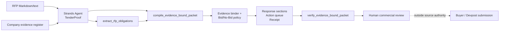

# TenderProof — evidence-first RFP response agent

Competition carrier for the **AWS Agents for Humans Hackathon** Professional Agents track.

TenderProof handles a painful professional workflow end to end: given an RFP and a company evidence register, it extracts mandatory obligations and deadlines, binds response claims to current confirmed evidence, computes a bid/no-bid state, creates a missing-evidence action queue, drafts evidence-linked response sections, and emits a tamper-evident receipt. If a certification or other hard requirement is unsupported, the product says **NO_BID** instead of inventing a credential.

Official competition references:
- https://agentsforhumans.devpost.com/
- https://agentsforhumans.devpost.com/rules
- https://strandsagents.com/docs/user-guide/quickstart/python/

The competition deadline is September 14, 2026 at 5:00 PM PDT. Published prizes include a $10,000 grand prize and Professional Agents awards of $5,000 / $3,000 / $2,000. Those are competitive awards, **not revenue received**.

## Why this is an agent, not an RFP chatbot

TenderProof does operational work through Strands tools:

1. `extract_rfp_obligations` converts mandatory RFP language into stable work IDs.
2. `compile_evidence_bound_packet` evaluates current evidence and builds the deterministic response packet.
3. `verify_evidence_bound_packet` checks the packet receipt and authority ceiling before the agent reports a result.
4. The Strands `Agent` orchestrates those tools and reports blockers/actions rather than free-writing unsupported commercial claims.

The deterministic core is deliberately usable without a model so reviewers can reproduce claim-binding and refusal behavior offline. The live agent path uses the official Strands Agents SDK; by default Strands uses Amazon Bedrock.

## Architecture



## Local deterministic demo

No AWS credentials are required for this path:

```bash
cd competitions/agents-for-humans-2026/tenderproof
PYTHONPATH=. python -m unittest discover -s tests -v
PYTHONPATH=. python -O -m unittest discover -s tests -v
PYTHONPATH=. python cli.py \
  --rfp sample/rfp.md \
  --evidence sample/company_evidence.json \
  --as-of 2026-09-13 \
  --out /tmp/tenderproof-demo.json
```

The checked-in synthetic demo should return `NO_BID`: its old SOC 2 evidence is expired and the sample also lacks a verified three-reference packet. That refusal is a feature.

## Run through Strands Agents

```bash
python -m venv .venv
source .venv/bin/activate
pip install -r requirements.txt
# Configure a model provider supported by Strands. Bedrock is the SDK default.
python agent_cli.py \
  --rfp sample/rfp.md \
  --evidence sample/company_evidence.json \
  --as-of 2026-09-13
```

`strands-agents==1.55.1` is pinned because it is the current PyPI release verified during this build on September 13, 2026.

## Evidence register contract

Each entry is explicit caller-supplied evidence:

```json
{
  "id": "E-INSURANCE",
  "claim": "What the retained evidence actually establishes",
  "source": "path/or/source-reference",
  "confirmed": true,
  "tags": ["insurance"],
  "expires": "2026-12-31",
  "synthetic": false
}
```

Unconfirmed and expired evidence cannot satisfy a requirement. Hard-gate categories (insurance, security, certifications, legal) become `BLOCKER` when unsupported. Other missing mandatory evidence produces `CONDITIONAL_BID`. Every unsupported response section begins `DO NOT CLAIM`.

## Receipt and authority boundary

The packet commits to exact RFP/evidence input SHA-256 values, extracted requirements, bindings, decision, response text, and action queue. `verify_packet` recomputes that canonical digest and rejects authority escalation even if a caller reseals the outer digest.

Source code **never** authorizes:
- sending a bid or email to a buyer;
- asserting a certification or legal/compliance state;
- accepting commercial terms;
- registering for or submitting to Devpost;
- claiming organizer acceptance, ranking, prize, payment, or revenue.

## Test surface

The hostile suite covers deterministic extraction, expiry, unconfirmed evidence, duplicate evidence IDs, hard blockers, evidence binding, unsupported-claim refusal, receipt tampering, resealed authority escalation, input lineage, and fail-closed competition readiness. Tests run normally and under `python -O`.

## Competition truth boundary

`submission_readiness.json` is intentionally `BLOCKED`. A final competition entry still requires a verified live Strands run, AWS Builder ID, public-repository requirement check, rendered architecture diagram, public <=5 minute demo video, Devpost registration/terms acceptance, and final submission authorization. No AWS deployment/spend, Devpost entry, organizer acceptance, prize, payment, or earned revenue is represented by this source carrier.

## Live cash

Verified product pages only — no invented Stripe links.

- [$29 Autopsy checkout](../../../agent-rescue.html)
- [$199 dealer diagnostic](../../../dealer-service-lead-rescue.html)
- [$199 referral diagnostic](../../../referral-intake-completeness.html)
- [$199 repair diagnostic](../../../repair-booking-preflight.html)
- [$199 plant diagnostic](../../../plant-downtime-handoff.html)
