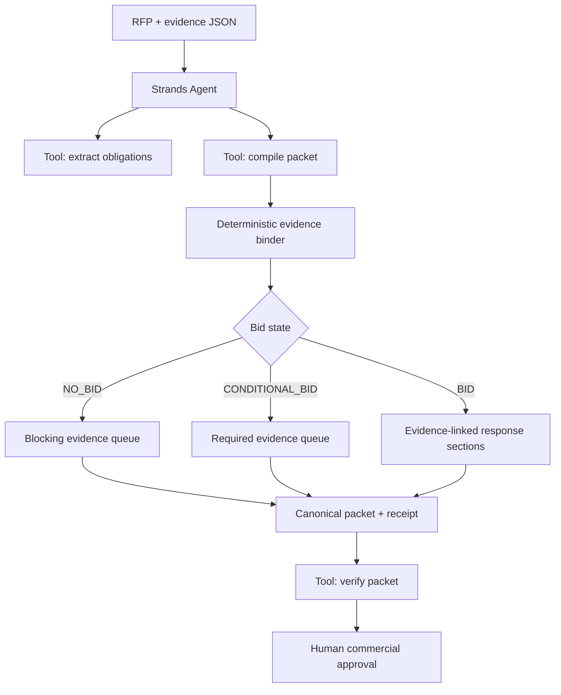

# TenderProof — judge-facing packet

**Track:** Professional Agents  
**Product:** TenderProof  
**State:** source/test carrier; external competition actions remain blocked until evidenced.

## One sentence

TenderProof is a Strands agent that turns a procurement RFP plus a vendor's retained evidence into a bid/no-bid decision, evidence-linked response draft, and missing-proof action queue—while refusing to manufacture credentials just to complete the document.

## Real problem

Small vendors routinely lose days to response coordination before they even know whether they can truthfully meet a solicitation. Generic LLM drafting makes this worse when fluent prose silently outruns insurance, security, reference, certification, or experience evidence. TenderProof treats evidence as a first-class input and makes unsupported claims mechanically visible.

## End-to-end demo story

1. Feed the synthetic River County RFP and evidence register to TenderProof.
2. The agent uses `extract_rfp_obligations` to identify six mandatory obligations.
3. It calls `compile_evidence_bound_packet`; current insurance/accessibility/IR evidence can bind, but the SOC 2 artifact is expired and references are missing.
4. Policy returns `NO_BID` because an unsupported certification is a hard gate.
5. Unsupported response sections say `DO NOT CLAIM`; an action queue names the exact evidence gaps.
6. `verify_evidence_bound_packet` validates the canonical receipt before the agent summarizes the result.
7. Add a current, confirmed SOC 2 evidence item and sufficient reference evidence, rerun, and watch the decision transition only when the packet actually supports it.

## Strands role

The official `strands.Agent` coordinates three custom `@tool` functions. Tool outputs are structured and deterministic; natural-language orchestration cannot silently turn a missing requirement into a supported claim. The agent system prompt explicitly preserves a human approval boundary for buyer communication and submission.

## Technical differentiators

- exact input lineage via SHA-256;
- stable extracted requirement IDs;
- expiry and confirmation semantics;
- evidence-category matching with explicit scores;
- hard blockers separated from remediable gaps;
- deterministic canonical packet + receipt;
- semantic authority checks that defeat a resealed send-authorization bit;
- model-independent offline reproduction plus Strands orchestration;
- synthetic demo data clearly marked as synthetic.

## Architecture diagram

## Suggested 5-minute video

- 0:00–0:30 — procurement response pain and hallucinated-credential risk.
- 0:30–1:15 — architecture and the three Strands tools.
- 1:15–2:30 — run the synthetic sample; show `NO_BID`, expired SOC 2, and missing references.
- 2:30–3:30 — inspect evidence-bound sections, action queue, hashes, and receipt.
- 3:30–4:15 — tamper with authority/decision and show verification failure.
- 4:15–5:00 — show how adding real evidence changes the workflow; close with human approval boundary.

## Claims we are not making

This packet does not claim live AWS deployment, Devpost registration/submission, buyer use, time savings measured in production, organizer acceptance, rank, prize, payment, or revenue. Those require external evidence.

## Live cash

Verified product pages only — no invented Stripe links.

- [$29 Autopsy checkout](../../../agent-rescue.html)
- [$199 dealer diagnostic](../../../dealer-service-lead-rescue.html)
- [$199 referral diagnostic](../../../referral-intake-completeness.html)
- [$199 repair diagnostic](../../../repair-booking-preflight.html)
- [$199 plant diagnostic](../../../plant-downtime-handoff.html)
