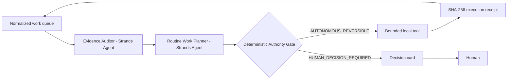

# QuietOps — the professional agent that knows when *not* to bother you

**Amazon / Devpost Agents for Humans Hackathon — Professional Agents track**

Small-business owners do not need another chat window. They need repetitive evidence work to disappear, while the handful of decisions that can spend money, bind a price, contact a customer, interpret a contract, or mutate an external system stay unmistakably human.

QuietOps is a Strands Agents SDK application that runs a **Planner → Evidence Auditor → deterministic Authority Gate** loop. It completes bounded, reversible work in the background and produces a content-addressed execution receipt. Receipt minting and verification both recompute authority from the raw work item; callers cannot inject a preconstructed authority decision. Exact queue replays collapse to one operation, and reuse of an event ID for a different generation fails closed. If the item crosses an authority boundary—or the evidence is ambiguous/low-confidence—it emits a decision card and takes **no external action**.

## Why this is different

Most agent demos optimize for “how much can the model do?” QuietOps optimizes for **how much routine work can safely vanish without turning uncertainty into action**. The LLM can plan and explain, but it cannot promote itself across the authority boundary: `quietops/core.py` independently classifies every item, and the Strands tools are closure-bound to a detached invocation snapshot with no model-supplied item parameter.

Examples:

- reconcile two retained financial snapshots → automated, receipt-bound analysis;
- classify/summarize complete evidence → automated;
- draft an internal note → automated;
- contact a customer/vendor → human decision;
- commit a price, move money, accept a contract, interpret legal meaning, mutate an external system → human decision;
- ambiguous evidence or <95% confidence → human decision.

## Architecture



The competition-facing Strands composition is in `quietops/strands_app.py`. The provider-independent authority and verifier core is in `quietops/core.py`.

## Run the credential-free deterministic demo

```bash
cd competitions/agents_for_humans_quietops
PYTHONPATH=. python -m quietops.cli demo/inbox.json --out /tmp/quietops-result.json
PYTHONPATH=. python -m quietops.cli demo/inbox.json --verify /tmp/quietops-result.json
```

The demo reconciles `$66.25` expected vs `$37.50` observed, produces a `$28.75` owner-review variance, safely completes the **reconciliation** itself, and deterministically emits a human follow-up card for the discrepancy. The receipt proves analysis completion; it does not authorize correction, money movement, or contact.

A second demo proves the boundary:

```bash
PYTHONPATH=. python -m quietops.cli demo/human_required.json
```

It returns `HUMAN_DECISION_REQUIRED`, no receipt, and no external effect.

## Run the local product UI

```bash
PYTHONPATH=. python -m quietops.server
```

Open `http://127.0.0.1:8765`. The UI loads both demo scenarios and calls the same deterministic core used by Strands execution tools.

Run the authority benchmark:

```bash
PYTHONPATH=. python -m quietops.benchmark
```

## Run with Strands Agents SDK

```bash
python -m venv .venv
source .venv/bin/activate
pip install -r requirements.txt
```

Strands uses Amazon Bedrock by default. Configure normal AWS credentials (or set `QUIETOPS_MODEL` to another model identifier supported by your installed Strands provider configuration), then:

```python
import json
from quietops.strands_app import run_item
item = json.load(open("demo/inbox.json"))
print(run_item(item))
```

QuietOps uses real `strands.Agent` objects, agents-as-tools, and `@tool` functions. No auto-loaded tool directory is used; the tool list is explicit.

## Test

```bash
PYTHONPATH=. python -m unittest discover -s tests -v
python -m compileall -q quietops tests
PYTHONPATH=. python -O -m unittest discover -s tests -v
```

The hostile suite pins duplicate evidence generations, replay/tamper resistance, strict JSON duplicate keys, float rejection, unsafe object keys, confidence/ambiguity gates, money/contact/legal/external authority boundaries, safe integer bounds, and receipt linkage.

## Competition submission assets

- [`docs/ARCHITECTURE.md`](docs/ARCHITECTURE.md) — technical design and AgentCore deployment option
- [`docs/DEMO_SCRIPT.md`](docs/DEMO_SCRIPT.md) — <5 minute demo script
- [`docs/JUDGING.md`](docs/JUDGING.md) — judging-criteria evidence map
- [`docs/BUILD_STORY.md`](docs/BUILD_STORY.md) — bonus AWS Builder post draft
- [`docs/SOURCES.md`](docs/SOURCES.md) — competition/SDK provenance and claim boundary
- [`docs/SUBMISSION_CHECKLIST.md`](docs/SUBMISSION_CHECKLIST.md) — exact machine-complete vs human/provider-side blockers
- [`docs/DEVPOST.md`](docs/DEVPOST.md) — submission-ready description
- `demo/*.json` — deterministic input corpus

## Authority ceiling

This repository carrier does **not** send email, contact a customer/vendor, move money, accept terms, change prices, submit a competition entry, deploy AWS infrastructure, or claim cash/prize/revenue. External connectors can be added later, but the deterministic gate must remain in front of them.

License: this project lives in the Apache-2.0 licensed Commons repository.
