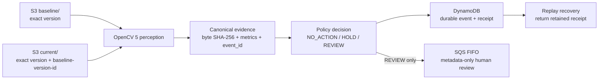

# ProofLens — judge-facing submission packet

**Track fit:** Agentic Vision + OpenCV 5 + AWS.  
**State:** source carrier only; no competition submission, deployment, benchmark result, prize, or payment is claimed by this document.

## 1. Product in one sentence

ProofLens turns a version-bound baseline/current image pair into reproducible OpenCV 5 change evidence and then makes one bounded operational decision: ignore ordinary/no-change evidence, abstain when perception quality is weak, or enqueue a human review request when declared thresholds are crossed.

The useful action is not “describe an image.” OpenCV output directly changes the next system step, while the system preserves a machine-verifiable boundary between perception evidence and human authority.

## 2. Problem

Visual inspection automations often jump from a noisy model result to a consequential workflow action. That makes three failures hard to diagnose:

1. **camera/view drift masquerades as scene change;**
2. **the decision cannot be reproduced from the exact input bytes and policy;**
3. **retries create duplicate notifications or actions.**

ProofLens is designed around those failure modes. It is intentionally narrower than an object-recognition platform: it answers whether a retained view changed enough, with enough image quality, to deserve human inspection under a declared policy.

## 3. Architecture

### OpenCV 5 role

`opencv_perception.py` performs the material perception work:

- strict image decode and dimension/aspect validation;
- bounded-size processing;
- ORB keypoint/descriptor extraction;
- ratio-filtered feature matching;
- RANSAC homography alignment;
- blur/exposure quality evidence;
- Gaussian-smoothed absolute difference;
- morphology-stabilized changed-pixel fraction;
- Canny edge-map delta;
- mean absolute intensity delta.

The OpenCV major version is bound into evidence, and the competition path rejects version 4 evidence even if a caller reseals all hashes.

### AWS role

AWS is part of the runtime control plane, not decorative hosting:

- **S3 Versioning** preserves exact current/baseline object generations.
- The current object binds `baseline-version-id`; an unversioned S3 event is rejected.
- **Lambda** runs perception + policy on each versioned `current/` object event.
- **DynamoDB** is the durable event/replay fence and retains canonical evidence/decision receipts.
- **SQS FIFO** receives only human-review metadata when the policy says review is warranted; the deterministic event ID is the FIFO deduplication ID.

No public HTTP ingestion endpoint is required for the core demo.

## 4. Agentic state machine

| State | Trigger | Next step | Authority ceiling |
|---|---|---|---|
| `NO_ACTION` | quality adequate; all change metrics below policy | record receipt | no external action |
| `HOLD_LOW_QUALITY` | frame quality below policy | record abstention | no review/action inference |
| `REQUEST_HUMAN_REVIEW` | quality adequate; one or more declared thresholds crossed | record + enqueue metadata-only review | asks a human to inspect; does not decide outcome |
| replay | exact event already retained | return retained receipt / repair pending queue delivery | no duplicate business action |

Every receipt sets `external_action_authorized=false`. The verifier recompiles the policy from the evidence; a caller cannot mint a different allowed decision, recompute the receipt hash, and pass verification.

## 5. Evidence and replay contract

A perception event commits to:

- exact baseline/current byte SHA-256;
- exact version-bound S3 source reference;
- original image dimensions;
- changed fraction, edge delta, mean delta;
- frame quality and alignment confidence;
- OpenCV version + algorithm version;
- canonical event ID over the entire semantic packet.

The decision receipt commits to the event, exact policy generation, decision, reason codes, and a fixed false external-authority flag.

This makes the event reproducible without claiming that SHA-256 proves who captured the image, whether the scene is safe, or whether a human action is correct.

## 6. Evaluation protocol

The final entry should publish held-out measurements, not hand-selected screenshots. Use right-cleared data partitioned before threshold selection.

### Required slices

1. unchanged scene / repeated same bytes;
2. 1–10 px translation and modest camera jitter;
3. illumination/exposure variation;
4. blur, obstruction, under/overexposure — expected abstention/HOLD;
5. localized changes at several area fractions;
6. near-threshold positive/negative pairs;
7. visually busy texture where ORB has many matches;
8. low-feature scenes where alignment must fail visibly;
9. exact event replay and concurrent duplicate invocation.

### Reported metrics

- review-request precision / recall against human-labeled **review-needed** labels;
- false-review rate on no-change + camera-motion slices;
- HOLD/abstention rate and error rate conditional on non-HOLD;
- alignment-success rate by slice;
- duplicate review-message rate under replay/concurrency testing;
- Lambda warm/cold latency;
- S3/Lambda/DynamoDB/SQS request counts and estimated per-1,000-event cost.

Never relabel these as “safety accuracy,” hazard detection, compliance accuracy, or autonomous decision quality.

## 7. Failure-mode demonstrations

The demo should visibly show at least four failures being handled rather than hiding them:

- malformed/non-image bytes → fail closed;
- OpenCV 4 evidence → rejected by source contract;
- weak image quality + large raw difference → `HOLD_LOW_QUALITY`, not review escalation;
- modified evidence after event ID creation → rejected;
- resealed wrong decision receipt → verifier rejects after semantic recompilation;
- S3 event without current `versionId` → rejected;
- repeated exact event → retained result / deduplicated review path.

## 8. Five-minute demo storyboard

**0:00–0:35 — thesis.** Show baseline/current pair, then the three bounded outcomes. State clearly that this is evidence-to-decision-to-human-review, not a vision chatbot.

**0:35–1:35 — OpenCV evidence.** Run unchanged and changed synthetic/right-cleared examples. Display alignment confidence, changed fraction, edge delta, mean delta, quality, byte hashes, and deterministic event ID.

**1:35–2:25 — agentic action.** Show a changed pair producing `REQUEST_HUMAN_REVIEW`, then display the metadata-only SQS body and false external-action authority.

**2:25–3:10 — failure handling.** Feed low-quality evidence and a tampered/resealed receipt. Show HOLD and verifier failure.

**3:10–3:50 — AWS/replay.** Show exact current/baseline S3 versions, DynamoDB event row, queue delivery state, and replay returning the retained result rather than manufacturing another business event.

**3:50–4:35 — evaluation.** Present held-out slice table, review precision/recall, abstention, jitter false-review rate, latency and estimated cost. Only populate with actual measured values.

**4:35–5:00 — limits and next step.** State that ProofLens detects bounded visual change; humans retain outcome authority. Show the release gate and public source commit.

## 9. Submission evidence checklist

The source is not ready for owner submission until all are independently true:

- [ ] deployed AWS stack receipt + exact source commit retained;
- [ ] OpenCV 5 runtime version captured from deployment;
- [ ] held-out evaluation run from frozen data manifest and code commit;
- [ ] architecture diagram and technical report reconciled to deployed behavior;
- [ ] <=5-minute public demo video complete and replayable;
- [ ] team bio/eligibility facts confirmed by the human entrant;
- [ ] Devpost/OpenCV rules and terms accepted through the entrant account;
- [ ] final source/archive accessible as required;
- [ ] owner explicitly authorizes submission;
- [ ] final artifact hashes recorded before upload.

`submission_readiness.json` intentionally says those external gates are unresolved now.

## 10. Truth boundary / non-claims

This packet does not establish or claim:

- any AWS deployment or account spend;
- a live production endpoint;
- measured performance on a real held-out dataset;
- ownership/rights for any future camera dataset;
- face/person/object recognition capability;
- safety, compliance, fault, intent, or liability conclusions;
- Devpost registration, rule acceptance or submission;
- organizer validation, rank, prize, payment, or revenue.

Those statements may be upgraded only from retained external evidence, not from this source tree.