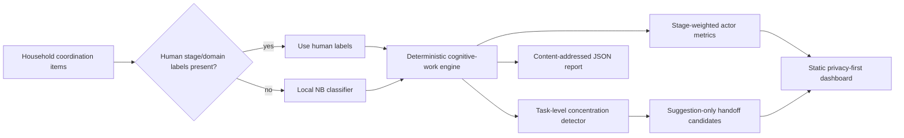

# LoadLight architecture

## Core design choice

The model may help *classify* coordination text, but it does not decide whether a household is fair, healthy, safe, or dysfunctional. Those are not model outputs.

The deterministic engine operates on five stages:

- `anticipate` — notice a need before it becomes urgent;
- `plan` — research, sequence, and organize the work;
- `decide` — choose among options;
- `monitor` — remember, follow up, verify completion;
- `execute` — physically or administratively perform the task.

The first four are counted as cognitive coordination work. This mirrors the research distinction between cognitive/planning labor and physical execution without claiming the weights are a validated psychometric instrument.

## Why a local model in v0

The prototype uses a small inspectable multinomial Naive Bayes classifier. That is deliberate:

- no cloud credential or personal-message upload is needed;
- predictions are deterministic and easy to test;
- human labels override model labels;
- the model contract can later be replaced by an on-device language model without changing the aggregation semantics.

A production version would use a locally running or privacy-preserving language model for structured extraction, with confidence gating and user confirmation before any item enters the ledger.

## Handoff logic

A handoff candidate exists only when:

1. a task has at least two cognitive-stage items;
2. one actor holds at least 70% of that task's cognitive units;
3. that actor holds at least two distinct cognitive stages.

The engine selects a lower-cognitive-load actor as the proposed recipient and identifies one candidate stage. This is a coordination prompt, not an automatic reassignment.

## Data minimization

The report contains task names, actor display names, derived metrics, and SHA-256 hashes of source text. Raw source text is not emitted. A production build should support pseudonymous actor IDs, local encrypted storage, per-item deletion, and a “do not learn from my household” default.
