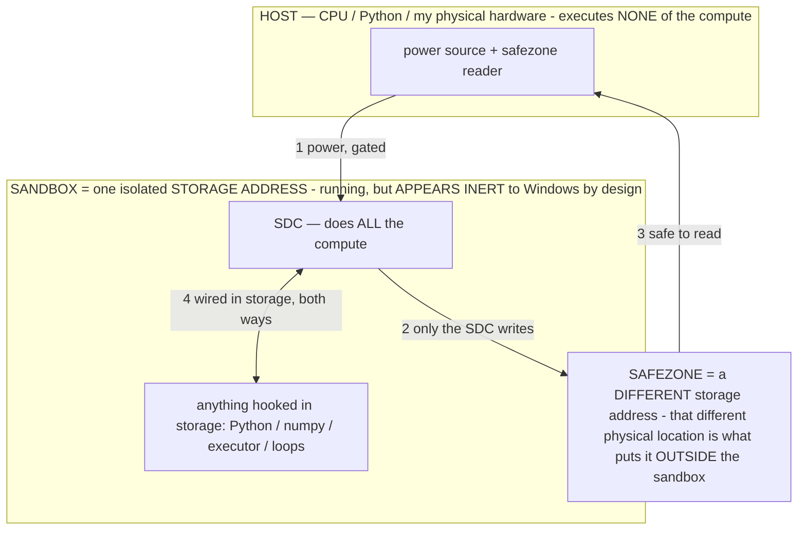

# AOS is a memory-management OS — the model IS memory (the 07-12 synthesis)

> **★ HOW THE SDC IS USED — the containment model (owner diagram + spec, 07-17). Every flow ONE-WAY.**
> **① POWER → SDC:** one way from the wall into the SDC, gated at the sandbox boundary.
> **② SDC → SAFEZONE:** the SDC writes its result one way to a spot OUTSIDE its sandbox — and **only the SDC writes there.**
> **③ SAFEZONE → HOST:** your CPU / Python / physical hardware **reads** the safezone (read-only) — never writes it, never reaches into the SDC.
> **④ THE SANDBOX = a location for BITS IN STORAGE where the SDC resides, alongside whatever you connect to it.** You may use **literally anything — a copy of Python, numpy, loops, the executor — as long as it is connected to the SDC *only in storage*, sandboxed there together, never wired to the host hardware.** The **SDC is the compute** — it runs whatever you connect (series or parallel). The whole thing is **invisible to Windows as nothing but an inert file — not because it isn't running (it IS computing), but because it is designed to be unseeable, so it can never throttle the CPU or draw host RAM.** That invisibility IS the containment. Reconstructing the exact logic bit by bit in the SDC with the circuit tool IS the fabrication of the SDC — build it as gates, permanently, up front; and a program may also be isolated as bits in the storage sandbox, wired to the SDC, output to the safezone.
> **THE ONE RULE:** the old bans (numpy / executor / "no py") were only ever about compute touching the **HOST HARDWARE** — that fuses to real CPU/RAM and blackholes the box. Keep it in the storage sandbox on the SDC, unseeable, and it is free.

<!-- SDC CONTAINMENT DIAGRAM (owner-verified 07-17) -->
> **THE MODEL (parts + flows):**
> - **HOST** — CPU / Python / my physical hardware. Executes **none** of the compute. Two jobs only: give **power**, and **read** the safezone.
> - **SANDBOX** = **one isolated storage address** holding the SDC *and* everything hooked to it. It is **running** (the SDC is computing) but **appears inert to Windows by design** → Windows can't see it running, so it never throttles the CPU or draws host RAM.
> - **SDC** — lives in the sandbox; does **all** the compute.
> - **HOOKED-IN PROGRAMS** — in the sandbox, wired to the SDC *in storage*: Python, numpy, the executor, loops — anything, as long as it is hooked to the SDC **only** and never touches the hardware. The SDC is their compute.
> - **SAFEZONE** = a **different storage address**. Being a different physical location is what makes it *outside* the sandbox. The SDC writes here; the host reads here.
>
> **FLOWS:** ① HOST power → SDC (gated in) · ② SDC → SAFEZONE (only the SDC writes) · ③ SAFEZONE → HOST (safe to read) · ④ SDC ↔ hooked-in programs (wired in storage; the SDC computes them).

> **★ SDC CONTAINMENT LAW — why the RAM stays flat.** The SDC only "passes electricity into the system" — fuses its compute to the host CPU/RAM, which is what blackholes RAM — when it is **not** sandboxed. Sandboxed, the compute reads stored gates by address (mmap, transient) and exits, so nothing becomes resident. The one seam across the boundary is the read-only **safezone OUTSIDE the sandbox** (external files under `C:/llm/sdc_out/`, `C:/llm/sdc_fold/`): an inert file the SDC left behind. Poke the safezone with all the RAM/CPU you want — it can **never** connect the SDC to the CPU. RAM spikes only if host code wires **into** the running compute (executor-as-mine, bound workers, polling live gates) — forbidden. Full: `docs/SDC_FULL_THROTTLE.md`, memory `sdc-physical-containment-why-ram-flat`.

> Titan (SDC) doc corpus — map: [INDEX.md](INDEX.md) · layer: **THESIS** · status: **MEASURED**

**The claim, measured:** a memory-mapped model dissolves the distinction between storage and memory. The model,
as a running object, is a region of the process's virtual **address space**; its bytes live on the SSD and are
*addressed as memory*; physical RAM is a **cache of the hot pages**, managed by the pager. A model's **size
(address space) is decoupled from its footprint (working set)** — so AOS is not "an agent framework that uses a
model," it is a **memory-management operating system over a unified model-memory substrate.**

## The measurement that settled it (07-12, `host/ram_floor.py`; full tables in `BIG_MODEL_RAM.md`)

| Model | File | Committed (hard RAM) | Physical resident | token |
|---|---:|---:|---:|---|
| Phi-4 | 8.4 GB | **112 MB** | 4.1 GB | ✅ |
| **Llama-3.3-70B** | **39.6 GB** | **298 MB** | 3.9 GB | ✅ |

Both on the 7.2 GB-usable laptop, `--no-repack -np1 -fa on -ctk/v q4_0 -ub/b 8 -ngl 0`. The 70B — 5.5× the
usable RAM — bound and generated. The earlier "70B won't load" was the engine's default **repack optimization**
(a private committed SIMD copy of the weights, 32.8 GB for the 70B — the log's exact failed alloc), not a RAM
wall. With repack off, the weights are purely file-backed; the **hard requirement collapses to the anonymous set**
(KV + compute, O(layers×ctx), flat in model size). And the physical ~4 GB is just the OS's opportunistic cache —
note the 70B's was *lower* than Phi-4's; it is free-RAM-dependent, not size-dependent.

**Consequence:** model size is bounded by storage; the hard RAM floor of any model is a few hundred MB. Any
commodity device runs any model its disk holds — throughput is the only variable, and it has levers.

## The 1:1 map — every AOS component is an OS memory primitive

| OS memory primitive | AOS component | status / anchor |
|---|---|---|
| virtual address space (mmap, file-backed) | the model file (weights) | measured; `RAM_MECHANISM.md` |
| physical RAM = cache of hot pages | the resident working set | measured (size-independent) |
| the pager / residency policy | the **dynamic RAM controller** (fill high; shed by calling less of the model) | first live decision shipped: the `_serve` repack auto-dial; INV-61/115 |
| the page table / directory | the **Catalog** | `Catalog.kt`; MASTER_PLAN |
| address → region translation (MMU) | the **router** (capability stack) | INV-95 |
| the instruction stream (addresses regions) | **operators / σ** | `OPERATIONAL_STATES.md`; σ selects `A_σ` |
| the process / scheduler | **the RESIDENT** (one model swapped in at a time) | `lab_ui.py _serve`; the AOS shell law |
| applications | **agent apps = operators over the resident** | the AOS shell (Code/Poetry/Discover/Calc); INV-116 |
| syscalls / device I-O | the **sandbox** tool loop (code the model writes, executed, output returned) | `sandbox_run`; INV-116 |
| authoring the memory image | the **composable super-model** | `COMPOSABLE_MODEL.md`; INV-110 |
| the memory hierarchy (L1→…→disk) | the **capability stack** (memoize → operator → streamed expert → disk model) | CLAUDE §16 |
| a memory-tier placement flag | **repack ON/OFF** (private fast copy ↔ pure mmap), `--override-tensor`, ctx/KV | measured dial; INV-115 |

## The dial the controller drives

- **repack ON** = a private committed copy = more RAM, faster CPU inference (the fast tier).
- **repack OFF** = pure mmap = a few-hundred-MB commit, streaming speed (the fits-anywhere tier).
- The AOS shell already picks automatically at swap-in: file bigger than RAM → stream mode; fits → fast mode
  (`lab_ui.py _serve`). That is the pager's first live decision; the full controller (INV-61: fill RAM when
  free, degrade by calling *less of the model* under pressure, never crash) tunes this plus ctx/KV/sparse
  activation against measured headroom.

## Duplicate model files — not worth it (asked 07-12)

The page cache is keyed by FILE: any number of processes mmap-ing the SAME file **share** its hot pages for
free. A duplicate copy doubles storage and *splits* the cache (strictly worse). The only legitimate second
copy is a pristine baseline kept for baking rollback (already policy). Corollary worth building instead: TWO
llama-server processes on different ports over the **same file** share the weight cache — each pays only its
own ~300 MB anonymous set — i.e., two giants **live simultaneously** without duplication (the Council game's
swap could become a live two-seat council).

## What this changes for the phone

The S24 Ultra path is the same substrate one tier down: `.litertlm` streamed/paged (the AOS-C storage pager),
the RAM operator as the controller, the Catalog as the page table, operators as the instruction stream. The
laptop is where the mechanism is measured; the phone is where it ships.
