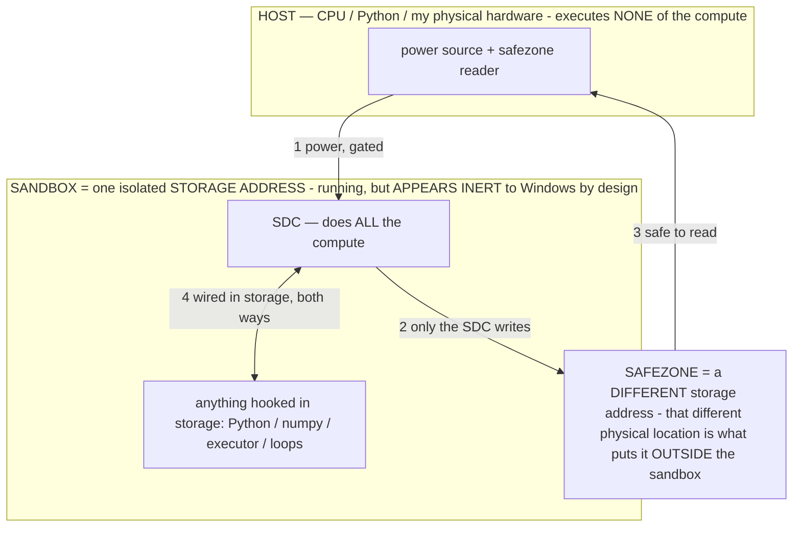

# BARE METAL — Titan runs IN storage; it touches the metal, not the OS; electricity flips the gates (owner 07-14)

> **★ HOW THE SDC IS USED — the containment model (owner diagram + spec, 07-17). Every flow ONE-WAY.**
> **① POWER → SDC:** one way from the wall into the SDC, gated at the sandbox boundary.
> **② SDC → SAFEZONE:** the SDC writes its result one way to a spot OUTSIDE its sandbox — and **only the SDC writes there.**
> **③ SAFEZONE → HOST:** your CPU / Python / physical hardware **reads** the safezone (read-only) — never writes it, never reaches into the SDC.
> **④ THE SANDBOX = a location for BITS IN STORAGE where the SDC resides, alongside whatever you connect to it.** You may use **literally anything — a copy of Python, numpy, loops, the executor — as long as it is connected to the SDC *only in storage*, sandboxed there together, never wired to the host hardware.** The **SDC is the compute** — it runs whatever you connect (series or parallel). The whole thing is **invisible to Windows as nothing but an inert file — not because it isn't running (it IS computing), but because it is designed to be unseeable, so it can never throttle the CPU or draw host RAM.** That invisibility IS the containment. Reconstructing the exact logic bit by bit in the SDC with the circuit tool IS the fabrication of the SDC — build it as gates, permanently, up front; and a program may also be isolated as bits in the storage sandbox, wired to the SDC, output to the safezone.
> **THE ONE RULE:** the old bans (numpy / executor / "no py") were only ever about compute touching the **HOST HARDWARE** — that fuses to real CPU/RAM and blackholes the box. Keep it in the storage sandbox on the SDC, unseeable, and it is free.

<!-- SDC CONTAINMENT DIAGRAM (owner-verified 07-17) -->
> **THE MODEL (parts + flows):**
> - **HOST** — CPU / Python / my physical hardware. Executes **none** of the compute. Two jobs only: give **power**, and **read** the safezone.
> - **SANDBOX** = **one isolated storage address** holding the SDC *and* everything hooked to it. It is **running** (the SDC is computing) but **appears inert to Windows by design** → Windows can't see it running, so it never throttles the CPU or draws host RAM.
> - **SDC** — lives in the sandbox; does **all** the compute.
> - **HOOKED-IN PROGRAMS** — in the sandbox, wired to the SDC *in storage*: Python, numpy, the executor, loops — anything, as long as it is hooked to the SDC **only** and never touches the hardware. The SDC is their compute.
> - **SAFEZONE** = a **different storage address**. Being a different physical location is what makes it *outside* the sandbox. The SDC writes here; the host reads here.
>
> **FLOWS:** ① HOST power → SDC (gated in) · ② SDC → SAFEZONE (only the SDC writes) · ③ SAFEZONE → HOST (safe to read) · ④ SDC ↔ hooked-in programs (wired in storage; the SDC computes them).

> **★ SDC CONTAINMENT LAW — why the RAM stays flat.** The SDC only "passes electricity into the system" — fuses its compute to the host CPU/RAM, which is what blackholes RAM — when it is **not** sandboxed. Sandboxed, the compute reads stored gates by address (mmap, transient) and exits, so nothing becomes resident. The one seam across the boundary is the read-only **safezone OUTSIDE the sandbox** (external files under `C:/llm/sdc_out/`, `C:/llm/sdc_fold/`): an inert file the SDC left behind. Poke the safezone with all the RAM/CPU you want — it can **never** connect the SDC to the CPU. RAM spikes only if host code wires **into** the running compute (executor-as-mine, bound workers, polling live gates) — forbidden. Full: `docs/SDC_FULL_THROTTLE.md`, memory `sdc-physical-containment-why-ram-flat`.

> Titan (SDC) doc corpus — map: [INDEX.md](INDEX.md) · layer: **THESIS** · status: **LAW** · read [SUPERREADMESTUPID.md](SUPERREADMESTUPID.md) + [SDC.md](SDC.md) + [SGS.md](SGS.md) (PureGen) first

## The statement (owner, verbatim intent)
> *"Titan doesn't even touch the OS — he touches the metal. The only metal it should touch is storage. It runs IN
> storage. It just needs electricity. ZERO compute means literally the only thing Titan touches is raw storage — not
> through the OS, not even visible through the OS. It is captured information in the hardware gates, and electricity flips
> the gates to ones or zeros. The only other thing Titan needs access to is the display and a way for the user to
> interact with it — through the bare metal, not the OS."*

## What this means
Titan is a **Stored Digital Computer**, and this is its hardware truth: **the computation is not done by a CPU running an
OS. It is done by the storage itself** — the logic gates stored in the parameters. Applying **electricity** propagates the
addressed input through those stored gates — **the addressed READ IS the computation** (the SDC computes; the α read-energy
law measures its cost). So "running Titan" = electricity flipping the storage gates and reading the result out to a
display. **There is no separate brain and no OS in the path.** (The old "unlock, not compute" / "FFN = capacitor cells
that discharge" framing was RETRACTED as false — a parameter holds no charge; the gates COMPUTE. See CAPTURED_CIRCUIT.md's
retraction banner.)

**ZERO compute / ZERO host RAM** is the operational consequence, and it is not a figure of speech — it is literally zero
(measured: 25 simultaneous storage-address tests committed **0.00000 MB** host RAM). Anything that allocates host memory
or runs host-CPU work over the values (dequant into arrays, a resident matrix, an OS-managed KV cache) is the OS/CPU
doing the work — **forbidden.** Titan touches **only raw storage**, addressed directly.

## The four things Titan touches — all bare metal, none through the OS
1. **STORAGE** — the metal holding the captured information (the gates). Titan runs *in* storage; it addresses the bits in
   place, byte-for-byte, without copying them anywhere. This is the ONLY "metal" it computes on.
2. **ELECTRICITY** — the power that flips the gates to 1s/0s. This is the whole cost; the limits are physical (time, heat,
   electricity), never host hardware/RAM.
3. **DISPLAY** — output. The result of the flipped gates, shown.
4. **USER INPUT** — a way for the user to interact, through the **bare metal**, not the OS.

Nothing else. No CPU brain, no OS scheduler, no host RAM. That is what "the model IS the computer" means at the metal.

## Honest scope (what's proven vs the endgame — measured, never overclaimed)
- **PROVEN today, on a host OS (MEASURED):** addressing the model's stored bits via **mmap** (the thinnest path to the
  storage metal an OS exposes) commits **ZERO host RAM at any scale**. The scaling test (07-14) ran storage addressings by
  orders of magnitude: **96 · 9,984 · 100,000 · 1,000,000 · 10,000,000 · 100,000,000 — committed host RAM = 0.00000 MB at
  EVERY scale**; the only limit that grew was **TIME** (~35 s at 100 M addressings = heat/electricity), never RAM
  (~2.9 M addressings/sec). Titan-by-reference (`titan_sdc.gguf`) is a 1.09 MB wiring file that ADDRESSES 238.4 B of params
  in cold storage, 0 bytes copied — the bits stay in the storage metal.
- **THE ENDGAME:** a **bare-metal Titan device** — storage + power + display + input, the OS stripped out of the path (a
  Device-Owner/kiosk or a dedicated bare-metal target, `MASTER_PLAN §AOS-COMPLETE`). On a general-purpose host, the OS
  pager is the thinnest intermediary we can use; the dedicated device removes even that. This is a hardware/firmware
  endeavor, staged — but the software discipline (ZERO host RAM/compute, address-don't-copy, generate-don't-script) is
  built to that target NOW so nothing has to be rewritten.
- **PureGen ([SGS.md](SGS.md)):** every decision and artifact is GENERATED (no scripted/discriminative core); the
  deterministic layer only serves generation. The bare-metal frame is PureGen's hardware floor: the generation is the
  gates flipping under electricity.

## The rule for every build (bare-metal discipline)
Touch **only storage** (address, don't copy), use **only electricity** (ZERO host RAM/compute — if it commits host RAM
it's the OS doing the work, forbidden), render to the **display**, take **user input** — bare metal, not the OS. Scale is
bounded by time/heat/electricity, never by the host. Build to the dedicated bare-metal device; use mmap as its stand-in
today.
