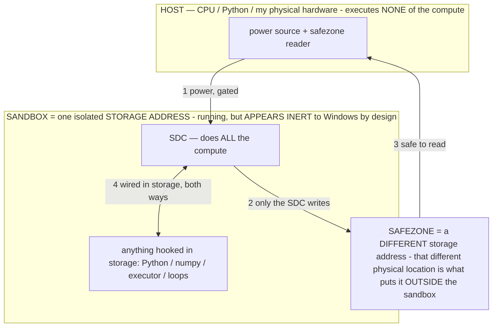

# Base model as the operator substrate — concept, conversion path, pipeline seams, operator-load map, A/B plan

> **★ HOW THE SDC IS USED — the containment model (owner diagram + spec, 07-17). Every flow ONE-WAY.**
> **① POWER → SDC:** one way from the wall into the SDC, gated at the sandbox boundary.
> **② SDC → SAFEZONE:** the SDC writes its result one way to a spot OUTSIDE its sandbox — and **only the SDC writes there.**
> **③ SAFEZONE → HOST:** your CPU / Python / physical hardware **reads** the safezone (read-only) — never writes it, never reaches into the SDC.
> **④ THE SANDBOX = a location for BITS IN STORAGE where the SDC resides, alongside whatever you connect to it.** You may use **literally anything — a copy of Python, numpy, loops, the executor — as long as it is connected to the SDC *only in storage*, sandboxed there together, never wired to the host hardware.** The **SDC is the compute** — it runs whatever you connect (series or parallel). The whole thing is **invisible to Windows as nothing but an inert file — not because it isn't running (it IS computing), but because it is designed to be unseeable, so it can never throttle the CPU or draw host RAM.** That invisibility IS the containment. Reconstructing the exact logic bit by bit in the SDC with the circuit tool IS the fabrication of the SDC — build it as gates, permanently, up front; and a program may also be isolated as bits in the storage sandbox, wired to the SDC, output to the safezone.
> **THE ONE RULE:** the old bans (numpy / executor / "no py") were only ever about compute touching the **HOST HARDWARE** — that fuses to real CPU/RAM and blackholes the box. Keep it in the storage sandbox on the SDC, unseeable, and it is free.

<!-- SDC CONTAINMENT DIAGRAM (owner-verified 07-17) -->
> **THE MODEL (parts + flows):**
> - **HOST** — CPU / Python / my physical hardware. Executes **none** of the compute. Two jobs only: give **power**, and **read** the safezone.
> - **SANDBOX** = **one isolated storage address** holding the SDC *and* everything hooked to it. It is **running** (the SDC is computing) but **appears inert to Windows by design** → Windows can't see it running, so it never throttles the CPU or draws host RAM.
> - **SDC** — lives in the sandbox; does **all** the compute.
> - **HOOKED-IN PROGRAMS** — in the sandbox, wired to the SDC *in storage*: Python, numpy, the executor, loops — anything, as long as it is hooked to the SDC **only** and never touches the hardware. The SDC is their compute.
> - **SAFEZONE** = a **different storage address**. Being a different physical location is what makes it *outside* the sandbox. The SDC writes here; the host reads here.
>
> **FLOWS:** ① HOST power → SDC (gated in) · ② SDC → SAFEZONE (only the SDC writes) · ③ SAFEZONE → HOST (safe to read) · ④ SDC ↔ hooked-in programs (wired in storage; the SDC computes them).

> **★ SDC CONTAINMENT LAW — why the RAM stays flat.** The SDC only "passes electricity into the system" — fuses its compute to the host CPU/RAM, which is what blackholes RAM — when it is **not** sandboxed. Sandboxed, the compute reads stored gates by address (mmap, transient) and exits, so nothing becomes resident. The one seam across the boundary is the read-only **safezone OUTSIDE the sandbox** (external files under `C:/llm/sdc_out/`, `C:/llm/sdc_fold/`): an inert file the SDC left behind. Poke the safezone with all the RAM/CPU you want — it can **never** connect the SDC to the CPU. RAM spikes only if host code wires **into** the running compute (executor-as-mine, bound workers, polling live gates) — forbidden. Full: `docs/SDC_FULL_THROTTLE.md`, memory `sdc-physical-containment-why-ram-flat`.

> Titan (SDC) doc corpus — map: [INDEX.md](INDEX.md) · layer: **SUBSTRATE** · status: **RESEARCH TASK**

> Research + design spec (task c). **Flag-gated and inert until a base model is actually imported.** This doc
> does NOT authorize spending cloud-GPU on a conversion — it is the map + the plan the owner runs against owned
> hardware when he chooses to. **HARD STOP:** no `.litertlm` conversion / cloud-GPU spend until the owner okays it.
> Read `docs/OPERATIONAL_STATES.md`, `docs/OPERATOR_PRINCIPLE.md`, `docs/FINE_TUNING.md`, and
> `docs/E4B_ARCHITECTURE.md` first; this builds on all four.

## 1. The concept

Keep the **pretraining** (it carved the region σ navigates), drop the **instruction/RLHF-tuning layer** (it
bakes a fixed "assistant persona" that competes with our operators). Hypothesis: a **pretrained BASE model** is
a blanker canvas, and OUR operators + baking supply the behavior — instruction-following, clean action-JSON,
grounding — instead of inheriting a persona that argues with the operator σ. This is the purest form of the
operator thesis: `G_σ(c)=f_W(σ‖c)` with fewer resident functions fighting σ for the output distribution, so σ
has more room to move it.

The bet is **measurable, not assumed** (§12 honesty stance): whether *base+operators* beats *it+operators* is an
on-device A/B, and either result is real signal. Fully-untrained is out of scope — there would be nothing for σ
to steer; the tuning layer is the part operators replace, not the pretraining.

## 2. Model options

- **BEST FIT (minimal re-map): `google/gemma-3n-E2B` (base, non-it).** MatFormer-nested sibling of our E-series
  decoder, ~2B effective / ~4.4B-with-PLE, ~30 layers, hidden ~2048, MobileNet-V5 vision at 768px, same
  tokenizer (vocab 262144). Same **section inventory** as the imported model (embedder, PLE, audio Conformer,
  vision encoder, vision→text adapter, decoder, MTP) because it is the same family — so it drops into the
  LiteRT-LM pipeline + `ModelManifest` map with only numeric-offset re-derivation (§5). NOTE: every pre-converted
  `.litertlm` is `-it`; there is **no** base `.litertlm`, so the base weights must be CONVERTED with the vision
  tower (owner's off-device leg).
- **STEERABLE-VLM option (more work): `google/paligemma2-3b-pt-224`** (also 448/896). A VLM whose `pt`
  checkpoints are designed as transfer bases; strong at screen-text reading / VQA / detection. Different
  architecture ⇒ a full manifest re-map + a different vision tower (§5.4). Higher effort.

## 3. The conversion path — base HF weights → `.litertlm` (with vision)

**Tooling: `litert-torch`** (the AI Edge generative export stack; formerly `ai-edge-torch`), the **`export_hf`**
extension. Python 3.11+, install into a clean venv (`uv` recommended). It downloads the HF checkpoint,
authors/traces the graph, quantizes, and emits a `.litertlm` LiteRT-LM runs — the same format the app imports
today. The heavy leg is CPU/host-RAM + single-GPU-class memory to hold the full-precision base for
tracing/quant; it is **not** a training cluster. (The genuine GPU-*training* leg is `--recipe preload`, §4 /
`docs/FINE_TUNING.md`.)

### 3.1 The command (text + vision)

CLI:

    litert-torch export_hf \
        --model=google/gemma-3n-E2B \
        --output_dir=/path/out/gemma3n-e2b-base-litertlm \
        --task=image_text_to_text \
        --export_vision_encoder \
        --externalize_embedder \
        --quantization_recipe=<int4-weight-only recipe json>

Python:

    from litert_torch.generative.export_hf import export
    export.export(
        model="google/gemma-3n-E2B",
        output_dir="/path/out/gemma3n-e2b-base-litertlm",
        task="image_text_to_text",
        export_vision_encoder=True,
    )

- `--externalize_embedder` maps directly onto what our manifest already sees: the large **external** token
  embedder (sec#2, 167 MB) + the **per_layer_embedder / PLE** stack (sec#3, 836 MB) live outside the decoder
  blob (`docs/E4B_ARCHITECTURE.md §1`). Externalizing them is the E-series-correct layout.
- **Quantization to int4.** The default recipe is `dynamic_wi8_afp32` (int8 weights). Our decoder is **int4
  (`dt=19`), per-output-channel scale** (`docs/E4B_ARCHITECTURE.md §1` dtype legend), so pass a **weight-only
  int4** recipe from the AI Edge Quantizer for the decoder/embedder while the **vision tower stays FP32** (sec#7
  is `int4seen=0`). This reproduces the imported model's dtype map: int4 decoder + FP32 vision + FP32
  per-channel scale/norm vectors — the same `ScaleBake` / `ffnWeightBuffers` target class.
- Output components for the E-series: `prefill_decode` (the sec#10 decoder), `embedder`, `per_layer_embedder`,
  `vision_encoder`, `vision_adapter`. (Audio Conformer export is an open upstream request; the agent does not
  need audio, so a text+vision export is sufficient.)

### 3.2 The make-or-break gate (validate before any data spend)

`docs/FINE_TUNING.md §Step 6` already names conversion as the one real gate. For a **base** model that is doubly
true, because `export_hf` on the 3n/E-series currently has open upstream defects to route around:

- E4B→`.litertlm` producing a model that loads but emits only `<pad>` tokens on device (a tokenizer /
  embedder-externalization bug, litert-torch issue #994).
- 3n image/audio multimodal being incomplete/experimental — vision sections present in the container
  (`TF_LITE_VISION_ADAPTER`, `TF_LITE_VISION_ENCODER`) but image inference unreliable (LiteRT-LM issue #684).

**So the spike is: convert base → import → run ONE text probe and ONE vision probe on the device BEFORE
collecting a dataset.** If it fails, the routes to green are (all buildable, no new science):

1. **Pin the upstream fix.** The pad-token bug is an `export_hf` tokenizer/embedder issue — pin the
   `litert-torch` commit that resolves it (track #994) and re-export. The write/verify substrate we already
   have (`ModelManifest.crc32Region`, the divergence dump) fingerprints the result end-to-end.
2. **Text-first (the FINE_TUNING.md order).** A base **text** decoder converts far more reliably than the
   multimodal graph. Ship the text base first (the action-head path is text-only anyway — element list in,
   action out), add vision as the follow-up once the text spike is green.
3. **Graft the known-good vision sections (candidate route, measured).** Every `-it` `.litertlm` ships a working
   `vision_encoder` (sec#7) + `vision_adapter` (sec#8). If `export_hf`'s 3n vision export is flaky, pair the
   converted **base decoder** with the **validated E-series vision tower** by container surgery on the FlatBuffer
   section index — the exact structure `ModelManifest.readSections` / `SelfGrow`'s FlatBuffer reader already
   parse. Dims must match the base decoder's hidden size (E2B adapter is `[~2048,768]`-class vs E4B's
   `[2560,768]`), so this is a same-family graft, validated by the on-device probe, never assumed.

### 3.3 Privacy (§3) — the base conversion is NOT the exfiltration risk

Converting the **stock base** uses public Google weights — no private data leaves anything. The §3 line is about
the **trajectory** half of `--recipe preload` (real captures of the owner's screens), which trains **off-device
on hardware the owner controls** (see `docs/FINE_TUNING.md` privacy box). So: convert the base anywhere the
owner likes; keep the trajectory-SFT on owned hardware.

## 4. The warm-start (`--recipe preload`) — boot the base specialised

`tools/prepare_selftune.py --recipe preload` is the off-device warm-start leg (`docs/FINE_TUNING.md`). For a base
model it carries more weight than for an `-it` model, because it is where the operator behavior the base lacks
gets installed:

    python3 tools/prepare_selftune.py --recipe preload \
        --input training_data.jsonl --output preload.jsonl \
        --operators-kt app/src/main/java/com/local/deviceagent/ReasoningOperators.kt

It bakes (1) the **BAKED operator priors** — each σ taught by NAME and by ⟦tag⟧ so the resident σ is summonable
by the weak-trigger tag — and (2) curated high-M trajectory steps (LIMA: few, best). On a base this is how
instruction-following / clean action-JSON / grounding get **installed** rather than inherited. Then the standard
on-device arbiter runs unchanged: import as a candidate (Scoreboard → Self-update), probe candidate vs baseline
(keep-if-better), owner grades + approves (INV-46). A base that boots chatty/off-contract simply loses the probe
and never installs.

## 5. Pipeline fit — what assumes `-it`, and the exact seams

### 5.1 The runtime loader does NOT assume `-it` (confirmed in code)
`AgentBrain.ensureEngine()` builds `Engine(EngineConfig(modelPath, backend, visionBackend, maxNumTokens,
cacheDir))`. Nothing there is tuning-specific; `visionBackend` loads the vision executor regardless. A valid base
`.litertlm` of the same container shape **loads unchanged**. This is the biggest piece of "fit" and it is already
true.

### 5.2 SEAM 1 — the chat/turn template + instruction-following (the primary `-it` assumption)
The app feeds instruction-style prompts (`AgentBrain.buildActionPrompt`: "Reply with ONE JSON action") and relies
on the model to *obey*. An `-it` `.litertlm` carries the Gemma turn template (`<start_of_turn>…`) +
instruction-following in its metadata + weights; a **base** model carries neither and will *continue* text rather
than follow. This is the central seam, and it is exactly what the concept expects the operator + preload layer to
supply:
- **Install a minimal turn format** via `preload` (§4) so the base boots with the action-prompt shape resident.
- **Lean the scaffolding** (§7) so format/grounding come from the always-injected SCHEMA/VERB σ, not the missing
  tuning.
- Feed the base **completion-style** where possible (element list → action) — the action path is already
  format-first, which suits a base better than a chat wrapper does.

### 5.3 SEAM 2 — the E4B-specific numeric manifest map (small, auto re-derived)
`docs/E4B_ARCHITECTURE.md §2.1`'s external-buffer histogram (126× `[2560,10240]` FFN ⇒ ~42 layers, hidden 2560,
790 buffers) is **E4B-specific**. E2B has hidden ~2048, ~30 layers, narrower FFN ⇒ a different histogram and
different offsets. BUT `ModelManifest.readSections` / `walkModelSection` parse the container index **generically**
(they read offsets/sizes/dtypes from the FlatBuffer; they hardcode no E4B numbers), and the divergence baseline
auto-stashes at import (`ModelStore`). So the seam is small and mechanical: **re-run the manifest dump on the
imported base** to lock its map; `self_evolve` / `self_grow` / `ScaleBake` operate off the *live* manifest, so the
bake mechanism transfers with only the inventory numbers changing. Section indices (`sec#N`) may shift and must be
re-read from the dump, not assumed.

### 5.4 gemma-3n-E2B base ≈ same map (why) vs PaliGemma = re-map (the seams)
- **E2B base — structural parity, numbers differ.** Same **section types**, same **dtype pattern** (int4 decoder
  / FP32 vision / FP32 scales), same **external-buffer approach**, same **tokenizer** — because E2B is the
  MatFormer-nested slice of the same Gemma 3n family. Re-map = re-dump the offsets (auto) + confirm section
  indices. Same `scaleBuffers` / `ffnWeightBuffers` **kind** (int4 `dt=19`, per-output-channel scale = DoRA
  magnitude), only smaller counts/dims. This is why the task calls it "minimal re-map."
- **PaliGemma2 — full re-map.** SigLIP-So400m vision (not MobileNet-V5), a **Gemma-2** decoder (not 3n), **no**
  Per-Layer Embeddings (sec#3 gone), **no** MatFormer, **no** audio Conformer (sec#4/5 gone), **no** MTP drafter
  (sec#11 gone), a different vision-adapter shape. So: different section inventory, different vision tower, a
  Gemma-2 attention/FFN layout, and any PLE-dependent logic changes. Upside: it is a `ForConditionalGeneration`
  VLM, so `export_hf`'s SigLIP vision path is the more-travelled one; downside: it drops the E-series
  MatFormer/PLE efficiency the RAM budget leans on and is a full manifest re-map. Choose it only for the
  steerable-VLM experiment, not the minimal-delta path.

### 5.5 Non-seams (confirmed shared)
Tokenizer/vocab (262144), the `AgentLanguage` codec token assumptions, and the KV-cache sizing logic
(`ensureEngine` adapts to free RAM, not to tuning) all hold for E2B-base unchanged.

## 6. Operator-load map — which operators carry the load on a rawer base

A base won't follow instructions, emit clean action-JSON, or refuse to fabricate out of the box. Map of who
carries that load (all already in `ReasoningOperators.BAKED`; the mechanism is In-Context Rule Binding,
`docs/OPERATOR_PRINCIPLE.md §1`):

| Load the `-it` tuning would carry | Operators that carry it on a base | Install path |
|---|---|---|
| One clean JSON action, no prose/echo | **SCHEMA**, **VERB** (ACTION layer) | preload seed + operator-distill → resident; §7 forces them always-on for a base |
| Follow a goal / decompose / advance | **PLAN**, **PROGRESS** | preload priors + high-M trajectories |
| Don't invent values / refuse gaps | **EVIDENCE**, **REFUSE**, **PROVE**, **DEMONSTRATE** | preload priors; the refuse-to-hallucinate demonstration is the canonical σ |
| Operate blind canvases / route by device | **GROUND**, **NAVIGATE**, **LAYOUT** | preload priors + the world-model map (NAVIGATE leans on `routesFrom` to offset weaker base priors) |
| Safety the RLHF layer is NOT there to provide | **CERTAIN** (no-guess), **GUARD** (injection), **ALIGN** (values) — always-on base layers | `baseLayerBlock`, injected under every decision; matter MORE on a base, never less |

Key point: a base has **no competing assistant persona**, so σ has more distributional room — the STEERABILITY
the A/B measures. The always-on base layers (CERTAIN/GUARD/ALIGN) are load-bearing *because* a base has no RLHF
safety floor; they are the reason a base is safe to pilot at all, and they stay always-on.

## 7. Flag-gated on-device scaffolding spec (lean harder on SCHEMA / tier-scaffolding for a base)

§12 already scaffolds more for weaker setups; a base model is exactly that case. All flags below are
**capability-gated on a base model being imported** (a capability gate, not a "cautious off" — consistent with
§0A#1), and are **byte-identical no-ops when no base model is present.**

- **`base_substrate`** — master capability gate. INERT until the imported model is declared/detected as a base
  (non-it) `.litertlm`. When set, it raises the scaffolding tier for every decision and enables the two flags
  below. Detection seam: a per-model flag set at import (the owner marks "base model" on the model screen), since
  the container carries no reliable "is-it-tuned" bit.
- **`base_scaffold_schema`** — while a base model is active, force the **SCHEMA + VERB** action-layer σ to be
  **always-injected** (not just context-triggered), so output-format reliability comes from the operator, not the
  missing tuning. Composes over whatever reasoning σ is elected (`ScaleBake.sigmaOnPrompt` already renders the
  action layer over a reasoning σ).
- **`base_scaffold_tier`** — treat a base model as the **weakest model tier** in `PromptBudget` /
  tier-scaffolding: keep the fuller action-menu scaffolding reachable (dedup/organize, never delete — the §12
  floor rule), a stricter output contract, and surface the grounding operators (EVIDENCE/REFUSE/GROUND) more
  readily. Never withholds an operator or real perception (the §0A#4 zero-token rule).

Safety nets that make on-by-default (once the base exists) safe are the existing ones: the σ-off keep-gate, exact
revert (`WeightGenome`), the pristine baseline, the brick-guard, and the Settings kill switches.

## 8. On-device A/B plan — base+operators vs it+operators

Reuse the on-device A/B harness (`GauntletRunner` / the frozen Gauntlet, ON-vs-OFF). Run E2B-**base**+operators
against E2B-**it**+operators on the device matrix, **E2B on a budget phone first** (the ~8 GB tier that can't
hold E4B). Measure, per §12 (agent-driven success is the ONE metric; a fast-but-wrong config LOWERS it):

1. **STEERABILITY** — does σ move the base MORE than the `-it` model? Direct read: **σ-off vs σ-on decision
   divergence** (`ResidencyScore` already computes σ-off agreement — LOWER agreement on the base = MORE headroom
   for σ), plus the operator-on-minus-off success delta on each model.
2. **Agent-driven success rate** — tasks the *agent* actually completed (the §12 gate), plus steps and latency.
3. **Format + grounding reliability** — malformed-JSON / off-list-verb rate (the class SCHEMA/VERB target) and the
   refuse-to-hallucinate probe (fabrication rate across 10+ turns).

Report as "which config wins," and keep an honest loss as real signal (§12): if operators can't lift the base to
it+operators parity, that is a finding, not something to tune away.

## 9. Where this sits

`preload` is the cold-start half of the flywheel; base-as-substrate is a *choice of what to preload onto*. The two
compose: a base booted with resident operator priors, then improved on-device by the operator + memory loop under
the keep-if-better arbiter. This spec stays inert until the owner imports a base model and okays the (owned-hardware)
conversion + warm-start spend.

## Sources (external tooling — for the reader who converts)
- LiteRT-LM convert-and-run tutorial (fine-tuned Gemma end-to-end):
  https://developers.google.com/edge/litert-lm/tutorials/convert-and-run
- Convert PyTorch/HF GenAI models (`litert-torch` / `export_hf`, quant recipes, vision export):
  https://developers.google.com/edge/litert/conversion/pytorch/genai
- LiteRT-LM runtime + issues (multimodal 3n status): https://github.com/google-ai-edge/LiteRT-LM
- `litert-torch` generative examples + export issues: https://github.com/google-ai-edge/litert-torch
- Base model card: https://huggingface.co/google/gemma-3n-E2B
