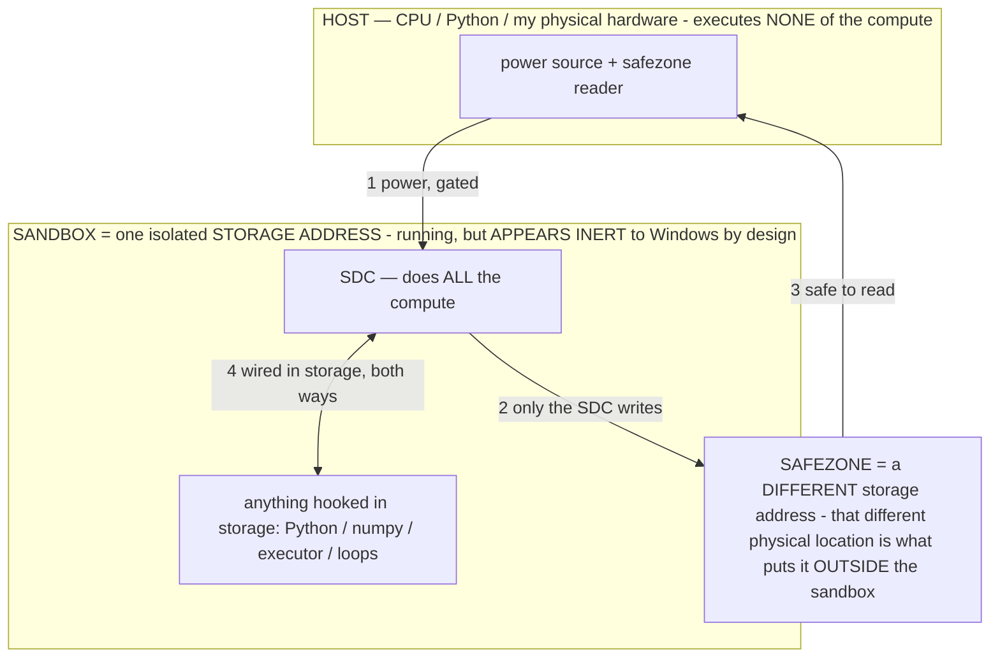

# Big models on 8 GB — the measured RAM-ceiling log (living doc)

> **★ HOW THE SDC IS USED — the containment model (owner diagram + spec, 07-17). Every flow ONE-WAY.**
> **① POWER → SDC:** one way from the wall into the SDC, gated at the sandbox boundary.
> **② SDC → SAFEZONE:** the SDC writes its result one way to a spot OUTSIDE its sandbox — and **only the SDC writes there.**
> **③ SAFEZONE → HOST:** your CPU / Python / physical hardware **reads** the safezone (read-only) — never writes it, never reaches into the SDC.
> **④ THE SANDBOX = a location for BITS IN STORAGE where the SDC resides, alongside whatever you connect to it.** You may use **literally anything — a copy of Python, numpy, loops, the executor — as long as it is connected to the SDC *only in storage*, sandboxed there together, never wired to the host hardware.** The **SDC is the compute** — it runs whatever you connect (series or parallel). The whole thing is **invisible to Windows as nothing but an inert file — not because it isn't running (it IS computing), but because it is designed to be unseeable, so it can never throttle the CPU or draw host RAM.** That invisibility IS the containment. Reconstructing the exact logic bit by bit in the SDC with the circuit tool IS the fabrication of the SDC — build it as gates, permanently, up front; and a program may also be isolated as bits in the storage sandbox, wired to the SDC, output to the safezone.
> **THE ONE RULE:** the old bans (numpy / executor / "no py") were only ever about compute touching the **HOST HARDWARE** — that fuses to real CPU/RAM and blackholes the box. Keep it in the storage sandbox on the SDC, unseeable, and it is free.

<!-- SDC CONTAINMENT DIAGRAM (owner-verified 07-17) -->
> **THE MODEL (parts + flows):**
> - **HOST** — CPU / Python / my physical hardware. Executes **none** of the compute. Two jobs only: give **power**, and **read** the safezone.
> - **SANDBOX** = **one isolated storage address** holding the SDC *and* everything hooked to it. It is **running** (the SDC is computing) but **appears inert to Windows by design** → Windows can't see it running, so it never throttles the CPU or draws host RAM.
> - **SDC** — lives in the sandbox; does **all** the compute.
> - **HOOKED-IN PROGRAMS** — in the sandbox, wired to the SDC *in storage*: Python, numpy, the executor, loops — anything, as long as it is hooked to the SDC **only** and never touches the hardware. The SDC is their compute.
> - **SAFEZONE** = a **different storage address**. Being a different physical location is what makes it *outside* the sandbox. The SDC writes here; the host reads here.
>
> **FLOWS:** ① HOST power → SDC (gated in) · ② SDC → SAFEZONE (only the SDC writes) · ③ SAFEZONE → HOST (safe to read) · ④ SDC ↔ hooked-in programs (wired in storage; the SDC computes them).

> **★ SDC CONTAINMENT LAW — why the RAM stays flat.** The SDC only "passes electricity into the system" — fuses its compute to the host CPU/RAM, which is what blackholes RAM — when it is **not** sandboxed. Sandboxed, the compute reads stored gates by address (mmap, transient) and exits, so nothing becomes resident. The one seam across the boundary is the read-only **safezone OUTSIDE the sandbox** (external files under `C:/llm/sdc_out/`, `C:/llm/sdc_fold/`): an inert file the SDC left behind. Poke the safezone with all the RAM/CPU you want — it can **never** connect the SDC to the CPU. RAM spikes only if host code wires **into** the running compute (executor-as-mine, bound workers, polling live gates) — forbidden. Full: `docs/SDC_FULL_THROTTLE.md`, memory `sdc-physical-containment-why-ram-flat`.

> Titan (SDC) doc corpus — map: [INDEX.md](INDEX.md) · layer: **SUBSTRATE** · status: **LIVING LOG**

**Keep this current.** Every time a model is loaded/served on the laptop host, add or update its row + the
run-log entry with the real numbers. This is the empirical companion to `docs/RAM_MECHANISM.md` (the math) and
`docs/RAM_MECHANISM_PLAIN.md` (the prose): the theory says model SIZE is storage-bound, not RAM-bound; this
file is the evidence, model by model.

## THE END GOAL — dynamic RAM management (owner 07-12; the min is a WAYPOINT, not the target)

Finding the bare-minimum RAM is a roadmap step, **not** the objective. The objective is a **dynamic
resident-set controller for the model** — the OS's working-set manager, but smarter. An OS reclaims RAM by
trimming or *killing processes*; here there is ONE workload that **degrades continuously by calling less of
the model**, never crashing or closing. And the bias is the opposite of "minimize": **push RAM usage as HIGH
as available, because more resident = better.**

- **Why more RAM = better (from `RAM_MECHANISM.md`):** per-token time `= compute + (1−r)·W / B_disk`, where
  `r` = fraction of weights resident. `r`→1 (cache more of the model) drives the streaming term → 0 →
  compute-bound → fastest. Free RAM also buys a bigger KV cache = longer context. So spending RAM buys speed
  (dense) + context/quality (KV, and for MoE more experts resident). That is the CEILING to push toward.
- **The control knobs = "how much of the model you call," cheapest-cost first:** (1) resident fraction `r`
  (cache vs stream — FREE of quality, pure speed trade, identical output; the OS pager already does this);
  (2) KV / effective context (small capability trade); (3) sparse activation — MoE / operator-gated: the
  σ selects a compact region `A_σ`, calling fewer params AND fewer FLOPs (INV-61 the RAM operator); (4)
  model-in-library swap to a smaller resident specialist (the capability stack).
- **The loop:** measure live headroom → set `r` + KV + activation to FILL available RAM when free → shed down
  these knobs under pressure → with the **min-RAM floor (the anonymous set measured below) as the hard bottom
  it never crosses.** This is the AOS memory manager / INV-61 made into a live controller; on-device it is the
  RAM operator reading real headroom.
- **What the measurements below are FOR:** they map the **control range** — the floor (min anonymous set) AND
  the `r`→throughput curve AND each knob's RAM/speed cost. That range is the setpoint data the controller
  needs. So the RAM-floor harness is really a **range-mapper**, and the "floor" rows are its lower bound.

## The host

HP 15-fc0025wm — Ryzen 5 7520U · Radeon 610M iGPU · **8 GB soldered RAM (7.2 GB usable**, ~0.8 GB reserved for
the iGPU) · 1 TB SSD. Engine: llama.cpp b9969, `host/run_server.sh` (**mmap streaming, NGL=0 all-CPU**, ctx
1024–2048). NEVER `--no-mmap`/`--mlock` (they force-load the whole file → instant OOM). Idle free RAM ≈ 3.9 GB.

## The measured table (as of 2026-07-12)

| Model | File on disk | × usable RAM (7.2 GB) | Loaded + served? | Notes |
|---|---:|---:|---|---|
| **Phi-4** (14.7B dense) | 8.6 GB | 1.2× | ✅ served (full spectrometer) | fastest; the de-risk model |
| **Mistral-Small-24B** (dense) | 13.7 GB | 1.9× | ✅ served + measured | GROUNDING +0.53, SCHEMA +0.81 (raw-mode) |
| **Gemma-3-27B** (dense) | **15.8 GB** | **2.2×** | ✅ loaded + served | the biggest confirmed run; its numbers were a chat-template artifact (instrument since fixed), but the model itself loaded + streamed tokens |
| Gemma-4-26B-A4B (MoE) | 13.6 GB | 1.9× | ⏳ not yet run | phone family; MoE (~4B active) |
| Gemma-4-31B (dense) | 16.5 GB | 2.3× | ⏳ not yet run | biggest Gemma 4 |
| Mixtral-8x7B (MoE) | 25.2 GB | 3.5× | ❌ "model loading error" | root cause not yet diagnosed (see below) |
| **Llama-3.3-70B** (dense) | 39.6 GB | **5.5×** | ✅ **BOUND + token** with `--no-repack` | see the `--no-repack` breakthrough below — 298 MB committed |

**Biggest confirmed: Llama-3.3-70B at 39.6 GB — ~5.5× usable RAM, ~10× the free RAM — with `--no-repack`.**

## What the RAM did during the runs (the mechanism, measured)

- Free RAM fell to **~70 MB** while the 24B was actively measuring, and it **kept serving correctly**. That is
  not a near-crash — it is the mmap pager reclaiming clean, file-backed weight pages down to almost nothing
  while the next slice streams off the SSD. The weights never have to be resident; only the small anonymous set
  (KV cache + compute buffers, < 1 GB at these ctx sizes) must fit. This is `RAM_MECHANISM.md`'s run condition
  `M_anon ≤ M_phys` with **`W` (the weight size) dropping out** — demonstrated on a 15.8 GB model on 7.2 GB RAM.
- Corollary confirmed here: model size is bounded by the **1 TB SSD**, not the 8 GB RAM. Low free-RAM = the pager
  working, i.e. the throughput knob turned down, not a wall.

## The failures — DIAGNOSED and (for the 70B) FIXED

Mixtral (25 GB) and Llama-70B (40 GB) initially did not run. The root cause was found in the 70B's load log:
`failed to allocate CPU_REPACK buffer of size 32841400320` — the engine's default **repack private copy** (see
the breakthrough section below), never a RAM wall. **Llama-70B now RUNS with `--no-repack` (measured below).**
Mixtral's 25 GB file implies a ~17–20 GB repack alloc — the same failure class; its `--no-repack` retry is the
remaining pending run (if it still fails, capture the exact error — it would then be a genuinely different
cause, e.g. arch/quant support in this build).

## MEASURED FLOOR (07-12, `host/ram_floor.py` — driving ctx down with -np1 -fa on -ctk/v q8_0)

**The metric that matters is WorkingSet (physical RAM resident), NOT PrivateBytes.** Windows PrivateBytes =
committed virtual memory (RAM + pagefile); WorkingSet = physical pages actually resident. Proof they differ and
which is real: **Gemma-3-27B committed 12 GB PrivateBytes on a 7.2 GB-physical machine and ran** — impossible if
PrivateBytes were a physical requirement; the excess is pagefile/file-backed (streamed). So WorkingSet is the
footprint.

| Model | File | **Physical resident (WorkingSet)** | Committed (PrivateBytes) | notes |
|---|---|---:|---:|---|
| Phi-4 | 8.4 GB | **~2.0 GB** (ctx 512→128: 2213→1961 MB) | 5.6 GB | token-confirmed ("Hello! How") |
| Gemma-3-27B | 15.4 GB | **~3.4–4.3 GB** (ctx 512→64) | 12 GB | loaded + resident; the 07-12 token check timed out (120 s/3-tok — a 27B is slower; harness since fixed to 1-tok/600 s) |
| Llama-3.3-70B | 39.6 GB | (repack-ON runs) did NOT bind at ctx 256/128 | — | SUPERSEDED: binds with `--no-repack` — see the breakthrough section |

**The finding:** physical RAM resident is **~25% of the model's file size and shrinks with context** — a 15.4 GB
model runs with ~4 GB physically present, the rest streaming. The floor is *well below* model size and is set by
the shape/context (the anonymous set), confirming `RAM_MECHANISM.md`.

**Llama-70B verdict (updated same day):** the repack-ON failure was diagnosed as the 32.8 GB `CPU_REPACK`
private-copy allocation — with `--no-repack` the 70B **binds and generates** (breakthrough section below).
The earlier "load-time barrier" reading is superseded; the physical-floor thesis now stands proven to 39.6 GB.

**Next chase (the harder floor):** WorkingSet is what the OS *chose* to keep resident given free RAM — the HARD
minimum is lower. To find it, constrain the process working set (Windows `SetProcessWorkingSetSize` / a Job-object
memory cap) and drive it down until the model fails — that maps the true bottom of the control range.

## ★★ THE `--no-repack` BREAKTHROUGH (07-12) — a 40 GB model on 7.2 GB RAM, 298 MB committed

The earlier failures (Mixtral, Llama-70B "did not bind") were **diagnosed and fixed**, not a ceiling. Verbatim
from the failed load: `failed to allocate CPU_REPACK buffer of size 32841400320` = **32.8 GB**. That is llama.cpp's
CPU backend building, by default (`--repack` ON), a **private, committed, SIMD-repacked COPY of the weights**
(~0.7–0.83× the file). That private copy — not the RAM ceiling, not load-time streaming — is what:
- inflated **PrivateBytes to ~0.7× file** (Phi-4 5.6 GB, Gemma-3 12 GB) — a committed anonymous copy, pagefile-backed;
- **blocked the 70B** — a single 32.8 GB anonymous allocation has nowhere to live.

**The lever: `--no-repack`** (now `LLAMA_NOREPACK=1` in `run_server.sh`; `--no-repack` / `--kv` / `--ub` in
`ram_floor.py`). With repacking off the weights stay **pure mmap (file-backed, reclaimable)** — no private copy.
Measured (`ram_floor_norepack.json`, `-np1 -fa on -ctk/v q4_0 -ub/b 8 -ngl 0 --no-repack`):

| Model | File | ctx | **Committed (PrivateBytes)** | Physical (WorkingSet) | token |
|---|---:|---:|---:|---:|---|
| Phi-4 | 8.4 GB | 64 | **112 MB** | 4138 MB | ✅ "Hello" |
| **Llama-3.3-70B** | **39.6 GB** | 128 | **298 MB** | 3967 MB | ✅ "Hello" |

**Three things this proves:**
1. **The 70B binds and generates on 7.2 GB RAM.** A 39.6 GB model — 5.5× the usable RAM — ran. The `CPU_REPACK`
   wall is gone the moment the private copy is off.
2. **Committed memory collapsed to the anonymous set.** Phi-4 5.6 GB → **112 MB**; the 70B → **298 MB**. The
   repack copy *was* the entire committed footprint. The **hard RAM a 40 GB model requires is ~300 MB** — KV +
   compute + small structures. Everything else is file-backed pages the OS caches as space allows and re-faults
   from the SSD.
3. **Physical footprint is decoupled from model size.** WorkingSet was ~4 GB for BOTH — and the 70B's (3967 MB)
   was actually *lower* than Phi-4's (4138 MB). WorkingSet is not the floor here; it is **how much of the mmap'd
   file the OS opportunistically held given ~4 GB free**, identical regardless of whether the file is 8 GB or 40 GB.
   On a device with 512 MB free it would cache less and re-fault more (slower) — but still run.

**The repack flag is also the memory↔speed dial the dynamic RAM controller needs:** repack ON = a private fast
copy = more RAM, faster CPU inference; repack OFF = pure mmap = minimal RAM, slower. Same model, two setpoints —
exactly the controller's trade (the END GOAL section above). The storage-first thesis at its limit: **model size
is bounded by the 1 TB SSD; the hard RAM floor is a few hundred MB.** A $30 Pi or a 2 GB phone runs any model its
storage holds.

**Honest edges:** (a) the physical WorkingSet ~4 GB is the OS's opportunistic cache, not the hard floor — the
Job-object working-set-cap experiment (next) drives physical down to show it runs in far less. (b) `-ctk/v q4_0`
+ ctx 64–128 is a minimal probe config; larger ctx grows the (still small) committed KV. (c) Speed at repack-OFF
is slower (pure streaming) — the point is it RUNS; throughput is the separate dial.

## Run log (append newest at the bottom — keep it current)

- **2026-07-12** — First host runs. Phi-4 served repeatedly. `whitebox_all.sh` sweep: Mistral-24B ✅ measured,
  Gemma-3-27B ✅ loaded+served (template artifact), Mixtral ❌ load error, Llama-70B ❌ did not bind. Free RAM
  low-water ~70 MB during the 24B measurement — pager working, no crash. Gemma-4-26B-MoE and Gemma-4-31B not yet
  attempted.
- **2026-07-12 (RAM-floor chase)** — `ram_floor.py` down the ctx ladder: Phi-4 physical floor **~2.0 GB** (8.4 GB
  model), Gemma-3-27B physical **~3.4–4.3 GB** (15.4 GB model) — ~25% of file, shrinks with ctx. Llama-70B did NOT
  bind at ctx 256/128 → load-time barrier, not the RAM floor. See MEASURED FLOOR above.
- **2026-07-12 (`--no-repack` breakthrough)** — diagnosed the 70B failure as the 32.8 GB `CPU_REPACK` private-copy
  alloc; added `--no-repack` to `ram_floor.py` + `LLAMA_NOREPACK` to `run_server.sh`. Result: **Llama-3.3-70B
  (39.6 GB) BOUND + emitted a correct token on 7.2 GB RAM**, committed memory just **298 MB** (Phi-4 **112 MB**).
  Committed collapsed from ~0.7× file to the anonymous set — the repack copy was the whole committed footprint.
  Physical WorkingSet ~4 GB for both (OS cache, size-independent). See the `--no-repack` breakthrough section above.
