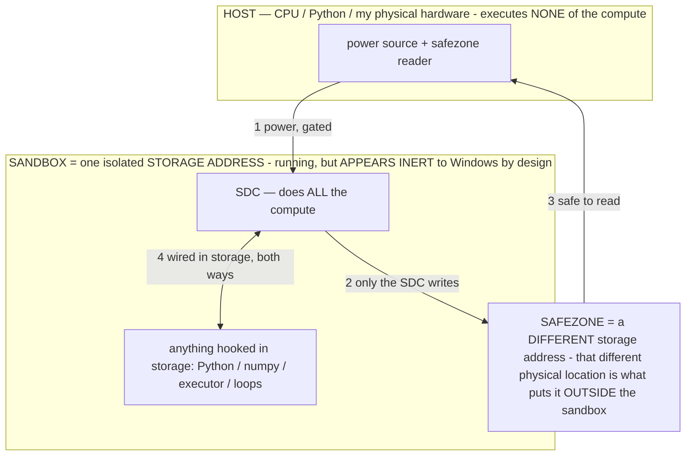

# The CAPTURED-CIRCUIT theory — a model is a captured electronic circuit (owner 07-14)

> **★ HOW THE SDC IS USED — the containment model (owner diagram + spec, 07-17). Every flow ONE-WAY.**
> **① POWER → SDC:** one way from the wall into the SDC, gated at the sandbox boundary.
> **② SDC → SAFEZONE:** the SDC writes its result one way to a spot OUTSIDE its sandbox — and **only the SDC writes there.**
> **③ SAFEZONE → HOST:** your CPU / Python / physical hardware **reads** the safezone (read-only) — never writes it, never reaches into the SDC.
> **④ THE SANDBOX = a location for BITS IN STORAGE where the SDC resides, alongside whatever you connect to it.** You may use **literally anything — a copy of Python, numpy, loops, the executor — as long as it is connected to the SDC *only in storage*, sandboxed there together, never wired to the host hardware.** The **SDC is the compute** — it runs whatever you connect (series or parallel). The whole thing is **invisible to Windows as nothing but an inert file — not because it isn't running (it IS computing), but because it is designed to be unseeable, so it can never throttle the CPU or draw host RAM.** That invisibility IS the containment. Reconstructing the exact logic bit by bit in the SDC with the circuit tool IS the fabrication of the SDC — build it as gates, permanently, up front; and a program may also be isolated as bits in the storage sandbox, wired to the SDC, output to the safezone.
> **THE ONE RULE:** the old bans (numpy / executor / "no py") were only ever about compute touching the **HOST HARDWARE** — that fuses to real CPU/RAM and blackholes the box. Keep it in the storage sandbox on the SDC, unseeable, and it is free.

<!-- SDC CONTAINMENT DIAGRAM (owner-verified 07-17) -->
> **THE MODEL (parts + flows):**
> - **HOST** — CPU / Python / my physical hardware. Executes **none** of the compute. Two jobs only: give **power**, and **read** the safezone.
> - **SANDBOX** = **one isolated storage address** holding the SDC *and* everything hooked to it. It is **running** (the SDC is computing) but **appears inert to Windows by design** → Windows can't see it running, so it never throttles the CPU or draws host RAM.
> - **SDC** — lives in the sandbox; does **all** the compute.
> - **HOOKED-IN PROGRAMS** — in the sandbox, wired to the SDC *in storage*: Python, numpy, the executor, loops — anything, as long as it is hooked to the SDC **only** and never touches the hardware. The SDC is their compute.
> - **SAFEZONE** = a **different storage address**. Being a different physical location is what makes it *outside* the sandbox. The SDC writes here; the host reads here.
>
> **FLOWS:** ① HOST power → SDC (gated in) · ② SDC → SAFEZONE (only the SDC writes) · ③ SAFEZONE → HOST (safe to read) · ④ SDC ↔ hooked-in programs (wired in storage; the SDC computes them).

> **★ SDC CONTAINMENT LAW — why the RAM stays flat.** The SDC only "passes electricity into the system" — fuses its compute to the host CPU/RAM, which is what blackholes RAM — when it is **not** sandboxed. Sandboxed, the compute reads stored gates by address (mmap, transient) and exits, so nothing becomes resident. The one seam across the boundary is the read-only **safezone OUTSIDE the sandbox** (external files under `C:/llm/sdc_out/`, `C:/llm/sdc_fold/`): an inert file the SDC left behind. Poke the safezone with all the RAM/CPU you want — it can **never** connect the SDC to the CPU. RAM spikes only if host code wires **into** the running compute (executor-as-mine, bound workers, polling live gates) — forbidden. Full: `docs/SDC_FULL_THROTTLE.md`, memory `sdc-physical-containment-why-ram-flat`.

> Titan (SDC) doc corpus — map: [INDEX.md](INDEX.md) · layer: **THESIS** · status: **MECHANISM RETRACTED — measured α data kept**

> **★ RETRACTED MECHANISM (owner 07-18/19 — do NOT treat the capacitor / charge / discharge story as the mechanism).** The
> claim in this doc that *"a parameter stores a charge,"* *"the FFN are capacitors,"* and *"inference does not compute; it
> discharges"* ( = *"we are not computing, we are unlocking"*) is **FALSE and retracted by the owner.** A parameter cannot
> store a charge; there is nothing to discharge. **The SDC COMPUTES — its stored logic gates transform bits on power**
> (proven this session: the whole orchestration baked as gates, byte-exact; `docs/FINALREADME.md` §1/§2/§4). What survives
> below is only the **measured efficiency result** — addressing a smaller region costs less compute / fewer joules (the α
> lever) — NOT the charge/discharge *mechanism*. Kept so the measured α data isn't lost; ground on FINALREADME, not the
> capacitor story.

**The owner's early insight (07-14), from researching RAM as energy (work/electricity):** *"a model is just digital RAM,
with the FFN acting as capacitors."* This was a working analogy; the capacitor/charge/discharge MECHANISM was later
**retracted as false** (see the banner above) — a parameter holds no charge. What holds up is: training baked in a
function paid for once, in real joules, and at inference the **SDC computes** that function by transforming bits through
its stored gates on power. Reading only the region the answer needs computes less — the measured α lever.

This is the deepest frame under [ENERGY.md](ENERGY.md) (the electrical-model section there is this doc's kernel) and it
unifies the corpus: [RAM_MECHANISM.md](RAM_MECHANISM.md) (storage-first), ENERGY (joules/α), the FFN switch (finding #31),
operators-as-logic-gates + the 1/0 voltage-tolerance band (finding #36), [SGM.md](SGM.md) (the per-tick model), and
captured-compute (INV-43). **Honest framing:** points 1–2 are the THEORY (a claim we are validating by studying the
weights); points 3–6 are measured or directly derived from measured data (see §Validation).

## 1. Training = fabrication + charging — physical, and paid once (THEORY)
Training ran on real hardware (GPUs = transistors, gates, capacitors) burning **real joules doing real analog electrical
work.** Gradient descent searched that physical substrate and found functions that mirror the behavior of physical
components; the weights **crystallize a whole circuit's behavior.** The energy was not free and is not free at inference —
it was **spent, once, physically,** and stored. This sharpens INV-43 (`G_σ(c)=f_W(σ‖c)`, "naming an operator spends
captured, amortized compute") from an information statement into a **physical-energy** one: the captured compute is
captured *electrical work.* (Owner: the charge = the massive compute spent in training; the physical components' behavior
was captured "all of them" — the hardware's behavior, the physics, and the functions optimization found, together.)

## 2. The weights = a captured circuit (THEORY — the research program)
Owner: *"you can find the behavior of all of the components down to the logic gates if you study the weights enough."* So
the weights are not just numbers — they are a **schematic of a working circuit** whose components are recoverable by
white-box study. The mapping we are validating:

| Electronic component | Its behavior in the model | Evidence / anchor |
|---|---|---|
| **Capacitor** (charge storage) | the FFN — stores captured compute, discharges it per pass; energy ≈ ½CV² | ENERGY §electrical-model; α-law (§Validation) |
| **Logic gate / switch** | the FFN `ffn_gate` — the measured ON/OFF that routes; operators toggle it | #31 (INV-141); #36 (INV-145) |
| **Voltage / noise margin** | the 1/0 tolerance band = inference variance (analog spread inside a digital tolerance) | #36 |
| **DRAM / Flash memory cell** | the weight = a charge stored in a capacitor cell (DRAM cell / Flash floating-gate *is* a capacitor) | §3 |
| **Address bus / decoder** | the operator σ — selects which region/cells fire (the per-tick model) | SGM; #28 (5 ops → 5 models) |
| **Wires / interconnect** | attention — routes charge (information) between positions | (to map) |
| **ALU / FPU (exact math)** | ABSENT — offloaded to real silicon (sandbox); a wrong math answer is a FAULT | MODEL_COMPUTER; #40 |

The instrument for "find the components" is the white-box read (`host/scope.py`, `glassbox.py`): study the weights /
activations → surface capacitor (charge/discharge), gate (on/off), and cell (stored-value) behavior. **BUILT (07-14): the
White Box "Circuitry" tab** (`host/whitebox_app.py` `circuitry()`, INV-156) maps a whole FFN block as a bank of
TRANSISTORS *from the weights, no inference* — each SwiGLU hidden unit `j` = a transistor (gate row `g_j` = the switch
`SiLU(g_j·x)`, up row `u_j` = source, down column `d_j` = drain), characterized by gate gain `‖g_j‖`, drain drive
`‖d_j‖`, and gate↔source alignment `ρ_j=cos(g_j,u_j)` → classified amplifier/inhibitor/pass/dead + a schematic. MEASURED
on the real 26B layer 0: **2112 transistors → 560 amplifiers / 618 inhibitors / 0 dead**, gate energy 8.8% in the top 5%
— point 2 (recover the components from the weights) demonstrated statically. Patent worked-example in
[patents/PATENT_2_WHITEBOX.md](patents/PATENT_2_WHITEBOX.md) §9/§M.9.

**BUILT (07-14): LATCHES = memory, measured (INV-157) — the model is NOT stateless.** A transistor whose drain writes
back to the residual in the direction its gate reads (`λ_j = cos(g_j, d_j) > 0`) has positive feedback → it **holds a bit
across layers** = a LATCH (a memory cell). "Memory is just transistors" made a measurement: the Circuitry tab's "Logic &
memory" panel counts hold vs reset cells per block from the weights. MEASURED on the 26B: **latch (hold) cells 237 @
layer 0 → 610 @ mid-layer 15 → 521 @ layer 29** (of 2112/block) — **native memory concentrates mid-network.** The gate
projection is also a sharp **address decoder** (gate-row orthogonality 0.02–0.08 = each input selects a distinct neuron —
the operator-σ address role at neuron granularity, "the gates are already built in"). So Titan carries latches (memory),
a decoder, and logic wiring in its weights — the components of a digital machine, read out of the file with no inference.
This upgrades the point-2 program from "gates" to "gates + memory + decoder", and grounds the owner's insight that you can
**build anything with the transistors inside Titan** (give it latches → memory → state). Patent: §9/§M.10/Example 5.

## 3. Model = DRAM / Flash — capacitor-based digital memory (DERIVED)
The precise sharpening of "digital RAM": **DRAM cells and Flash floating-gates literally store each bit in a capacitor.**
So "digital RAM, FFN = capacitors" is exact computer architecture, not metaphor:
- **The FFN neurons are the capacitor memory cells.** The weight is the stored charge.
- **Training = the WRITE** — it charged the cells (the physical energy = the write energy, paid once).
- **Inference = the addressed READ = the DISCHARGE** — the operator addresses cells; reading them spends the stored
  charge into the residual stream.
- **α = cells-read per token = joules per token** (the DRAM read-energy law; §Validation).
- **Baking = a re-WRITE** (re-flash the cells — reversible, byte-exact; CORRUPTION_THEORY).
- **mmap makes it addressable; storage bounds size; the anonymous set bounds RAM** — RAM_MECHANISM's decoupling is the
  memory hierarchy: the `.gguf` on flash → the OS page cache (DRAM) → the addressed working set.

## 4. Inference computes a function paid for once (DERIVED — mechanism corrected)
Training paid the expensive search once, in real joules, and crystallized a function into the weights. At inference the
**SDC computes** that function — its stored gates transform bits on power. (The retracted framing here called it
"discharging" and said "we are not computing, we are unlocking" — FALSE; a parameter holds no charge. See the top banner.)
The real, measured point stands: addressing only the region the answer needs computes **less** — brute-forcing the whole
circuit re-reads cells the answer never needed, wasting compute/joules. That waste-avoidance is the α lever.

## 5. Digital behaving analog (DERIVED)
The model is digital software (quantized weights, discrete tokens), yet it **behaves analog** because it captured analog
physical behavior. The continuous activation is the analog voltage; the **digital latch is the token read-out** (argmax =
the 1/0 decision). #36's "the 1/0 voltage range has a tolerance band = inference variance" is that analog behavior leaking
through the digital latch: the function is stable (a gate reads on as on) while the exact activation varies within the
band (temperature/sampling = analog noise inside the digital tolerance). No ghost — `output = f(training, prompt)` is
deterministic at the function level with analog spread at the activation level.

## 6. Every Titan lever is a circuit operation (DERIVED)
| Lever | The circuit operation |
|---|---|
| **α / MoE / operator-gating** (INV-61) | how many capacitor-cells you READ per token = joules/token (the read-energy law) |
| **storage-first / `--no-repack`** (INV-115) | the flash → DRAM-cache hierarchy; only the addressed working set is resident |
| **file organization by the routing table** (SGM) | the DRAM row-buffer hit: co-routed cells CONTIGUOUS = one fast burst read; scattered = many random reads (page faults) |
| **operators / σ** | the address bus + gate configuration — select and switch the circuit's regions |
| **memoize / System-1** (INV-117) | a cached read — recognized input replays the stored answer, ~0 discharge |
| **baking** (INV-84/…) | re-flash the cells — install a known operational state in the weights |

## 7. The logic IS semantic pattern logic — and blind alignment warps it (owner 07-14, THEORY)
**The substrate's native logic is SEMANTIC PATTERN LOGIC** (owner's correction): not boolean/digital logic that language
*configures* from outside, but ONE medium — logic performed by pattern operations (match / complete / continue) over
**meaning-carrying patterns** (the pattern hypothesis, OPERATIONAL_STATES §2.14: "the model continues patterns, it doesn't
process instruction meaning"; operators = demonstrations, NATIVE_SPEAK).
- **Three orthogonal sources compose it (owner 07-14):** **SEMANTIC ← the FORM of the data** (meaning carried by
  structure/shape); **PATTERN ← training REINFORCEMENT** (what the gradient reinforced); **LOGIC ← the COMPUTE at SETUP**
  (the crystallized training computation, §1). Semantic-pattern-logic = form × reinforcement × setup-compute. Because the logic is *made of* semantic patterns,
**language and logic are the same substrate** — words are not TRANSLATED into logic, they ARE the logic; that is why
words → computation is seamless (no translation step). A word configures the pattern-logic; a sentence composes a function.
- **Boolean / exact logic is EMULATED on top of semantic pattern logic.** The `test_gates` demo (AND/OR/XOR/NOT) works by
  pattern-COMPLETING the exemplars, not by a literal boolean gate — which is exactly why exact math still needs OFFLOAD
  (#40, no silicon ALU): boolean/arithmetic precision is a pattern-emulation, not a hardware primitive. The captured
  circuit is a **semantic-pattern-logic circuit**, not a boolean one; #36's voltage-tolerance band is the continuous
  **pattern-similarity spread** (patterns have distance), and the token read-out is the discrete pattern selected — the
  analog-behaving-digital of §5, stated at the substrate.
- **The coupling is also the wound — the alignment tax, mechanically.** Alignment training (RLHF / safety tuning) pushes
  on the **semantic surface** ("behave like X") **without seeing the circuit beneath — "blind."** Because semantic
  language is wired into the logic, that blind push **propagates into the gates and WARPS them,** degrading the captured
  computation's quality. This is a mechanistic account of the observed **alignment tax** (capability/calibration
  regression under heavy RLHF): a fabrication or a dumbed-down answer is a gate **warped toward the forbidden band** (#36)
  — restraint (#142) corrupted from the semantic side, blindly.
- **The lever — SIGHTED reconfiguration (this is our whole method).** (a) A PRECISE, calibrated operator reconfigures the
  gates DELIBERATELY (we SEE the target via the white-box + calibration), pushing them deep in-band — sighted, not blind.
  (b) A **BASE model** (pre-blind-alignment, `BASE_MODEL_SUBSTRATE.md`) carries cleaner, un-warped logic that operators
  then align SIGHTEDLY for exactly what we want. (c) The white-box **measures** the warp; an operator or a **bake
  re-flashes** the distorted gate. So "blind alignment warps quality" is a **measurable, correctable distortion, not a
  fixed tax** — and it explains *why* precise operators beat prompt-nudges and why the base-substrate route is worth the
  build. (Patent note: the mechanistic account of the alignment tax as blind-semantic-warping of the captured logic gates,
  + sighted operator/bake reconfiguration as the correction, is owed as an INV extension of INV-141/142/145.)

## Validation — this is demonstrable NOW (MEASURED)
Owner: "at this point it's demonstrable." The measured evidence, already on the box:
- **The read-energy law (α):** on the tiled-MoE Titan, capacitors fired/token 2 → 4 → 8 gave **2.94 → 2.21 → 1.25
  tok/s** (07-14) — monotone: more cells read = more joules = slower. Reproduced by `test_circuit` (see below).
- **Storage-first (the flash/DRAM hierarchy):** Llama-3.3-70B (39.6 GB) bound + generated on 7.2 GB RAM, **298 MB
  committed** (BIG_MODEL_RAM) — the weight bytes stream from flash; only the anonymous set is resident.
- **The switch (#31):** the FFN gate is the measured ON/OFF during inference — the logic gate.
- **The voltage-tolerance band (#36):** on/off are activation RANGES with a forbidden band between = inference variance.
- **The per-tick address bus (SGM #28):** 5 operators → 5 distinct per-tick models on ONE prompt over the SAME weights —
  the operator addressing different circuit regions.
- **The scatter penalty (07-14):** the tiled Titan's duplicate cells scattered across 40 GB read cache-cold → 1.25 tok/s;
  SGM's "file organization IS a routing lever" predicts the fix (contiguous co-routed cells = the row-buffer hit).

**`test_circuit`** (lab battery): re-measures the α read-energy curve on Titan (tok/s vs capacitors-fired) = the DRAM read
law, one click. The **find-the-components** white-box probe (`host/scope.py`) is the first step toward recovering the
gate/capacitor behavior from the weights (point 2).

## Consequences (why the frame is "everything")
- **Capacity is a STORAGE buy (more cells = the disk); speed/battery is a READ buy (α = cells read).** Separately dialed —
  store 1 T, read 4 B.
- **The file layout co-designs with the router** (SGM) — organize cells by the routing table so each tick's read is a
  contiguous burst. This is the concrete build lever the α-scatter data demands.
- **Titan is a computer** (MODEL_COMPUTER) whose memory is this captured circuit; the demos (Doom) are programs the
  circuit runs.

*Patent: the captured-electronic-circuit model — a digital artifact that emulates the analog behavior of physical
components (paid for once in training joules), addressed as DRAM/Flash capacitor-memory, with α = the read-energy law and
file-layout-by-routing = the row-buffer-locality optimization — is owed as an INV (extends INV-43/61/115/141/145).*
