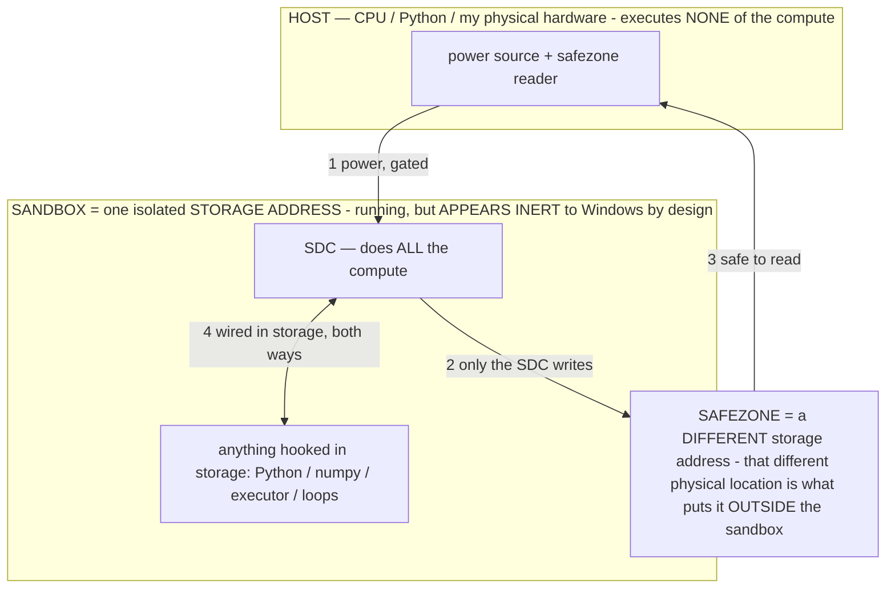

# The composable "super model" — assemble the file we want, don't fight the one we have (owner 07-12)

> **★ HOW THE SDC IS USED — the containment model (owner diagram + spec, 07-17). Every flow ONE-WAY.**
> **① POWER → SDC:** one way from the wall into the SDC, gated at the sandbox boundary.
> **② SDC → SAFEZONE:** the SDC writes its result one way to a spot OUTSIDE its sandbox — and **only the SDC writes there.**
> **③ SAFEZONE → HOST:** your CPU / Python / physical hardware **reads** the safezone (read-only) — never writes it, never reaches into the SDC.
> **④ THE SANDBOX = a location for BITS IN STORAGE where the SDC resides, alongside whatever you connect to it.** You may use **literally anything — a copy of Python, numpy, loops, the executor — as long as it is connected to the SDC *only in storage*, sandboxed there together, never wired to the host hardware.** The **SDC is the compute** — it runs whatever you connect (series or parallel). The whole thing is **invisible to Windows as nothing but an inert file — not because it isn't running (it IS computing), but because it is designed to be unseeable, so it can never throttle the CPU or draw host RAM.** That invisibility IS the containment. Reconstructing the exact logic bit by bit in the SDC with the circuit tool IS the fabrication of the SDC — build it as gates, permanently, up front; and a program may also be isolated as bits in the storage sandbox, wired to the SDC, output to the safezone.
> **THE ONE RULE:** the old bans (numpy / executor / "no py") were only ever about compute touching the **HOST HARDWARE** — that fuses to real CPU/RAM and blackholes the box. Keep it in the storage sandbox on the SDC, unseeable, and it is free.

<!-- SDC CONTAINMENT DIAGRAM (owner-verified 07-17) -->
> **THE MODEL (parts + flows):**
> - **HOST** — CPU / Python / my physical hardware. Executes **none** of the compute. Two jobs only: give **power**, and **read** the safezone.
> - **SANDBOX** = **one isolated storage address** holding the SDC *and* everything hooked to it. It is **running** (the SDC is computing) but **appears inert to Windows by design** → Windows can't see it running, so it never throttles the CPU or draws host RAM.
> - **SDC** — lives in the sandbox; does **all** the compute.
> - **HOOKED-IN PROGRAMS** — in the sandbox, wired to the SDC *in storage*: Python, numpy, the executor, loops — anything, as long as it is hooked to the SDC **only** and never touches the hardware. The SDC is their compute.
> - **SAFEZONE** = a **different storage address**. Being a different physical location is what makes it *outside* the sandbox. The SDC writes here; the host reads here.
>
> **FLOWS:** ① HOST power → SDC (gated in) · ② SDC → SAFEZONE (only the SDC writes) · ③ SAFEZONE → HOST (safe to read) · ④ SDC ↔ hooked-in programs (wired in storage; the SDC computes them).

> **★ SDC CONTAINMENT LAW — why the RAM stays flat.** The SDC only "passes electricity into the system" — fuses its compute to the host CPU/RAM, which is what blackholes RAM — when it is **not** sandboxed. Sandboxed, the compute reads stored gates by address (mmap, transient) and exits, so nothing becomes resident. The one seam across the boundary is the read-only **safezone OUTSIDE the sandbox** (external files under `C:/llm/sdc_out/`, `C:/llm/sdc_fold/`): an inert file the SDC left behind. Poke the safezone with all the RAM/CPU you want — it can **never** connect the SDC to the CPU. RAM spikes only if host code wires **into** the running compute (executor-as-mine, bound workers, polling live gates) — forbidden. Full: `docs/SDC_FULL_THROTTLE.md`, memory `sdc-physical-containment-why-ram-flat`.

> Titan (SDC) doc corpus — map: [INDEX.md](INDEX.md) · layer: **SUBSTRATE** · status: **DESIGN+MEASURED**

**The idea (owner):** since a model is just a file of named sections, and baking already edits sections, go all
the way — **build a super-model file by copy-pasting the sections we like from existing models, plus the sections
we add, laid out the way WE need.** "If a model has a coding expert, copy-paste it." MoE, but we pick and choose
the experts. Stop fighting an existing structure; author the structure.

This is coherent, on-thesis, and has a real build path. Framed honestly (routes, never walls, per §12).

## ★ THIS IS WHAT "BAKING" MEANS, FULLY (owner 07-12 — the term clarified)
The owner: *"this process is what I was trying to describe by baking — I just couldn't put it into words."*
**Baking, in its fullest sense, is AUTHORING the model file** — assembling the file we want (graft the sections
we like + add our own sections + lay it out for our access pattern + make the behavior weight-resident), so the
model boots already being what we need. Editing int4 nibbles / scale vectors (the current `ScaleBake` path) is
just ONE narrow operation *inside* that; the whole act is composing the file. This matches the FPGA framing
(`OPERATIONAL_STATES.md §2.15`): baking = flashing the configured fabric, i.e. writing the whole designed
bitstream, not only flipping a few bits. So the bake roadmap widens from "edit weights in place" to "compose the
model file we want," of which weight-editing, structural-section append (INV-110), and expert grafting are all
instances.

## ★ AND IT CAN BE STUPID BIG (owner 07-12)
Because model SIZE is storage-bound, not RAM-bound (`docs/RAM_MECHANISM.md`, `BIG_MODEL_RAM.md` — a 15.8 GB model
already served on 7.2 GB RAM), a composed super-model can be **enormous** — assembled from many grafted experts,
laid out for streaming locality, with only the operator-selected region resident per step. The dynamic RAM
controller (push `r` high when RAM is free, shed by calling less of the model under pressure) is what makes a
stupid-big file *usable* on ordinary hardware. Composable assembly + storage-first streaming + operator routing +
dynamic RAM management are one system: **author a huge, exactly-shaped file; stream and route it so it runs
anywhere.**

## The three ingredients of a super-model
1. **Grafted sections from source models** — take a layer stack, an FFN "expert," a vision tower, a tokenizer,
   from an existing file. The container is walkable by name (`docs/FILE_STRUCTURE.md`), so this is byte-level
   copy of named tensor blocks, not retraining.
2. **Our own added sections** — the operator library / baked deltas as named sections (INV-110 structural bake),
   plus any custom-trained adapter.
3. **A router (the gate)** — the piece that makes picked experts a MoE: something decides which expert runs per
   token. **This is where our operators fit perfectly: the operator IS the router.** A σ selects the computation
   region (`A_σ`); over a hand-assembled expert set, the σ selects which expert/section — operator-gated
   sparse activation over experts we chose (INV-61). So the super-model's router is our operator layer.

## Measured constraint (07-12, `host/anatomy.py`): same FAMILY isn't enough — you need same HIDDEN DIM
Gemma-4-31B vs Gemma-4-26B are both `arch=gemma4`, same tokenizer — but hidden 5376 vs 2816, so their main
tensor blocks are NOT directly copy-pasteable (only dimension-independent roles — the [256] head-dim norms,
rope — match). Direct graft needs **same hidden dim** (usually = same size/config); cross-size needs a seam
adapter even within one family. Useful data point in the same run: the **26B file is already a MoE** —
`blk.*.ffn_*_exps.weight` (128 experts) + `blk.*.ffn_gate_inp.weight` (the router) are named sections right
there, the exact experts+gate template a pick-and-choose MoE assembles (and confirming the experts must share
dims). So the anatomy tool's job — tell us what's graftable before we graft — is doing exactly that.

## The honest compatibility reality (the routes)
An expert only works grafted in if its **representation space** is compatible with the host's residual stream —
otherwise its output is noise in the new context. So:
- **Same-family / same-dims graft — EASY, field-proven.** Layers/FFN-experts from models sharing a base arch,
  hidden size, and tokenizer stitch cleanly. This is exactly what **mergekit** does: passthrough/franken-merges
  (SOLAR depth-upscaling, Goliath-120B) and **mergekit-moe / "clown-car MoE"** (take N same-base models, use their
  FFNs as experts, add a gate). Our library has same-family sets to try: Gemma-3-27B / Gemma-4-31B / Gemma-4-26B
  (Gemma), Mistral-24B / Mixtral (Mistral). **Buildable now with mergekit on the host GGUFs.**
- **Cross-family graft — HARDER, a route not a wall.** A coding expert from a different-arch model needs a **seam
  adapter**: a small projection trained to map its representation space into the host's (or a shared re-embedding /
  re-quant to a common format). That's an engineering step (train the adapter on paired activations at the seam),
  not an impossibility.
- **Shared tokenizer/embedding** is required (or a re-embed) — a grafted section must speak the same token space.

## Why this is better than fighting the structure (and ties to the whole stack)
- **We DESIGN the layout** → optimal streaming locality (sections in access order) → the low RAM floor + the
  high-`r` regime of the dynamic RAM controller (`docs/BIG_MODEL_RAM.md`). A model we author streams the way our
  device wants; a stock model we take as given.
- **It unifies the capability stack** (`CLAUDE.md §16`): instead of many separate disk-specialist FILES routed
  externally, fuse the chosen experts into ONE storage-first super-file with the operator as the internal router —
  operator-gated sparse activation over hand-picked experts, only the selected section paged in. (Both can
  coexist; this is the fused form.)
- **The operator layer becomes the model's own MoE gate** — the cleanest expression of "capability from programs":
  the σ doesn't just select a computation within fixed weights, it selects which grafted expert to run.

## The build path (cheapest → moonshot)
1. **File-Anatomy** (buildable NOW, the prerequisite): dump + DIFF the named section namespaces of our models so we
   can SEE which sections are compatible/graftable (same dims, same tokenizer). You can't copy-paste a section you
   can't inspect. → a Lab tab + `host/anatomy.py`. This also feeds the cross-file bake-transfer name-mapping.
2. **Same-family franken-MoE (host, mergekit):** assemble a pick-and-choose MoE from a same-base set (e.g. two
   Gemmas as experts + a gate), run it through the spectrometer/chat labs, measure. The first real super-model.
3. **Operator-as-router:** replace/initialize the gate with the operator layer (σ → expert). Measure vs a trained
   gate.
4. **Cross-family seam adapter:** graft a genuinely different expert (a strong coder) via a trained projection seam.
5. **Phone `.litertlm` surgery:** the same section-graft on the FlatBuffer container via `ModelManifest` — the
   super-model that runs on the S24 Ultra.

## Guardrails
Flag-gated / reversible (keep source files pristine; the super-file is a new artifact). §3-clean. Every assembled
model is proven in the labs (spectrometer + chat + RAM floor) before it's trusted — a graft that produces noise is
a measured failure, kept as signal, not hidden. No overclaim: a super-model counts when a `[lab]`/chat log shows it
generating coherently.

**Patent:** INV owed — *the operator-routed composable model: a storage-first super-model file assembled by grafting
named expert/tower sections from multiple source models plus baked operator sections, with the in-context operator
layer as the MoE gate over the hand-picked experts, and a trained seam-adapter for cross-family grafts.* (Extends
INV-110 structural bake + INV-61 RAM operator + the capability stack INV-95.)
