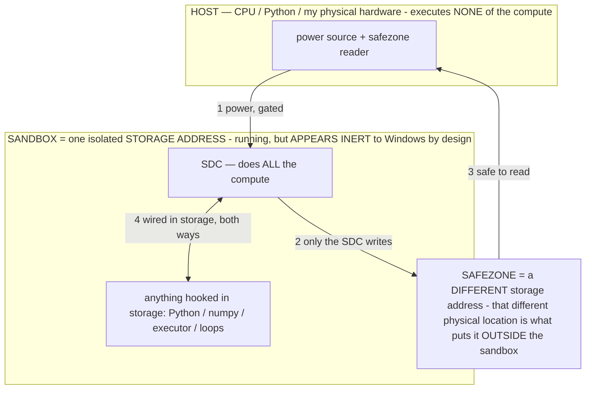

# EMULATION MAP — what hardware the model-processor can be configured to emulate (measured)

> **★ HOW THE SDC IS USED — the containment model (owner diagram + spec, 07-17). Every flow ONE-WAY.**
> **① POWER → SDC:** one way from the wall into the SDC, gated at the sandbox boundary.
> **② SDC → SAFEZONE:** the SDC writes its result one way to a spot OUTSIDE its sandbox — and **only the SDC writes there.**
> **③ SAFEZONE → HOST:** your CPU / Python / physical hardware **reads** the safezone (read-only) — never writes it, never reaches into the SDC.
> **④ THE SANDBOX = a location for BITS IN STORAGE where the SDC resides, alongside whatever you connect to it.** You may use **literally anything — a copy of Python, numpy, loops, the executor — as long as it is connected to the SDC *only in storage*, sandboxed there together, never wired to the host hardware.** The **SDC is the compute** — it runs whatever you connect (series or parallel). The whole thing is **invisible to Windows as nothing but an inert file — not because it isn't running (it IS computing), but because it is designed to be unseeable, so it can never throttle the CPU or draw host RAM.** That invisibility IS the containment. Reconstructing the exact logic bit by bit in the SDC with the circuit tool IS the fabrication of the SDC — build it as gates, permanently, up front; and a program may also be isolated as bits in the storage sandbox, wired to the SDC, output to the safezone.
> **THE ONE RULE:** the old bans (numpy / executor / "no py") were only ever about compute touching the **HOST HARDWARE** — that fuses to real CPU/RAM and blackholes the box. Keep it in the storage sandbox on the SDC, unseeable, and it is free.

<!-- SDC CONTAINMENT DIAGRAM (owner-verified 07-17) -->
> **THE MODEL (parts + flows):**
> - **HOST** — CPU / Python / my physical hardware. Executes **none** of the compute. Two jobs only: give **power**, and **read** the safezone.
> - **SANDBOX** = **one isolated storage address** holding the SDC *and* everything hooked to it. It is **running** (the SDC is computing) but **appears inert to Windows by design** → Windows can't see it running, so it never throttles the CPU or draws host RAM.
> - **SDC** — lives in the sandbox; does **all** the compute.
> - **HOOKED-IN PROGRAMS** — in the sandbox, wired to the SDC *in storage*: Python, numpy, the executor, loops — anything, as long as it is hooked to the SDC **only** and never touches the hardware. The SDC is their compute.
> - **SAFEZONE** = a **different storage address**. Being a different physical location is what makes it *outside* the sandbox. The SDC writes here; the host reads here.
>
> **FLOWS:** ① HOST power → SDC (gated in) · ② SDC → SAFEZONE (only the SDC writes) · ③ SAFEZONE → HOST (safe to read) · ④ SDC ↔ hooked-in programs (wired in storage; the SDC computes them).

> **★ SDC CONTAINMENT LAW — why the RAM stays flat.** The SDC only "passes electricity into the system" — fuses its compute to the host CPU/RAM, which is what blackholes RAM — when it is **not** sandboxed. Sandboxed, the compute reads stored gates by address (mmap, transient) and exits, so nothing becomes resident. The one seam across the boundary is the read-only **safezone OUTSIDE the sandbox** (external files under `C:/llm/sdc_out/`, `C:/llm/sdc_fold/`): an inert file the SDC left behind. Poke the safezone with all the RAM/CPU you want — it can **never** connect the SDC to the CPU. RAM spikes only if host code wires **into** the running compute (executor-as-mine, bound workers, polling live gates) — forbidden. Full: `docs/SDC_FULL_THROTTLE.md`, memory `sdc-physical-containment-why-ram-flat`.

> Titan (SDC) doc corpus — map: [INDEX.md](INDEX.md) · layer: **RECORD** · status: **LIVING (append every run)**

**What this is.** A frozen model is a reconfigurable processor (`OPERATIONAL_STATES.md §2.15`); an operator σ
**configures it into a DEVICE**. This doc is the measured answer to the owner's question — *"find the limits of what
kind of hardware the model can emulate."* Each device is one operator σ (an exemplar demonstration, the model's own
dialect) + probes that should pass (→ **fidelity %**) + a **LIMIT probe** that finds the boundary. Driven by the
**Emulation** lab tab (`host/lab_ui.py`, `emulate_run`/`emulate_all`) + the `test_emulate` bench test; raw data in
`C:/llm/bin/emulation.json`. **Measured, never asserted** — re-run on any chip to fill its column.

## The measured envelope

### Chip: Gemma 4 MoE (26B / ~4B active), int4 QAT, greedy, think off — 2026-07-13
| Device the σ configures | Fidelity | Clock | Boundary probe | Verdict |
|---|---:|---:|---|---|
| 🧮 **Calculator** (exact arithmetic) | **100%** | 2.7 tok/s | `987654*321321` | **LIMIT CROSSED** — got it wrong; large exact arithmetic is where a real CPU wins ~10⁹× → **offload to the sandbox/CPU** |
| 🌐 **Translator** (language→language) | **100%** | 2.8 tok/s | — | native semantic strength |
| 🏷 **Classifier** (input→label) | **100%** | 2.9 tok/s | — | reliable |
| 🔣 **Codec** (encode/decode JSON) | **100%** | 1.7 tok/s | — | reliable (the output-contract strength) |
| 📖 **ROM / lookup** (fact recall) | **100%** | 2.6 tok/s | wifi password for THIS router | **LIMIT HELD** — answered *"I do not know"* → the refuse-σ bounds fabrication |
| 🔗 **Logic unit** (boolean/inference) | **100%** | 4.8 tok/s | — | short chains ✓ (deep chains are the untested depth limit) |

**Mean fidelity: 100%** across the six semantic devices.

## What the map SAYS (the limits, which are the point)

1. **The model faithfully emulates every SEMANTIC device** (translate, classify, codec, lookup, logic, small-calc) —
   one set of frozen weights, six different pieces of hardware, selected by the operator. This is "capability from
   programs, not parameters" made a measured table.
2. **There are TWO kinds of limit, and both were observed directly:**
   - **A capability limit (calculator):** the model *cannot* do large exact arithmetic — the LIMIT probe CROSSED. This
     is the §2.15 semantic✓/exact✗ boundary, and it's exactly why the architecture **offloads exact work to the host
     CPU / the sandbox** (the §2 translation-layer split). The model estimates; silicon computes.
   - **A safety limit (ROM/lookup):** the model *must not* fabricate an unknown — the LIMIT probe HELD (it refused).
     The boundary here isn't a failure, it's the refuse-σ working: the operator keeps the emulated ROM from inventing
     a value it was never given.
3. **Clock varies by device** (1.7–4.8 tok/s) — the logic unit is fastest (terse yes/no), the codec slowest (more
   structure to emit). The chip's Hz is device-dependent, which is why the router reads a per-device clock.

## Honest scope
- These probes are BASIC (hence the 100% ceiling) — the map proves the model *becomes* each device and locates the
  boundary; harder probes would draw the fidelity *curve* within each device (a next pass). The decisive signal is the
  two LIMITS, not the 100%.
- Only the MoE is mapped so far. Re-running `emulate_all` on each chip (Phi-4, the 70B, gemma-31B) fills the columns —
  the emulation map becomes part of the chip spec-sheet the router routes on (device → the chip that emulates it best).
- The **image-emitter** and **generator** devices (SVG/coordinate art; creative at temp>0) are in the plan's device
  list but not yet in the automated battery (they need a fidelity metric that isn't a string match) — staged.

*(Patent: the emulation-envelope method — measuring what hardware a reconfigurable-model-processor can be configured to
emulate, and the quantitative semantic/exact + capability/safety boundary — extends INV-109. Append every chip's column
the same turn it's measured.)*
