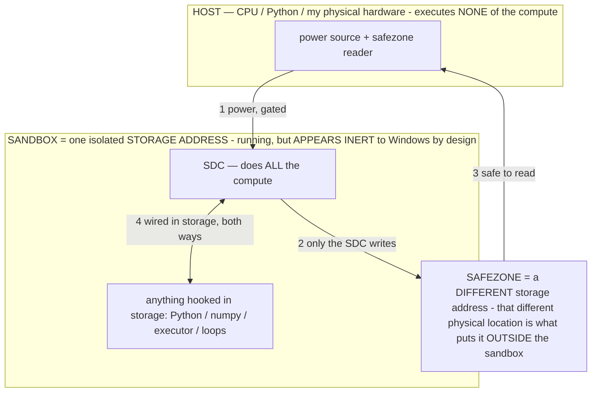

# The ENERGY thesis — the fundamental bottleneck is electricity; Titan minimizes joules per useful output (owner 07-13)

> **★ HOW THE SDC IS USED — the containment model (owner diagram + spec, 07-17). Every flow ONE-WAY.**
> **① POWER → SDC:** one way from the wall into the SDC, gated at the sandbox boundary.
> **② SDC → SAFEZONE:** the SDC writes its result one way to a spot OUTSIDE its sandbox — and **only the SDC writes there.**
> **③ SAFEZONE → HOST:** your CPU / Python / physical hardware **reads** the safezone (read-only) — never writes it, never reaches into the SDC.
> **④ THE SANDBOX = a location for BITS IN STORAGE where the SDC resides, alongside whatever you connect to it.** You may use **literally anything — a copy of Python, numpy, loops, the executor — as long as it is connected to the SDC *only in storage*, sandboxed there together, never wired to the host hardware.** The **SDC is the compute** — it runs whatever you connect (series or parallel). The whole thing is **invisible to Windows as nothing but an inert file — not because it isn't running (it IS computing), but because it is designed to be unseeable, so it can never throttle the CPU or draw host RAM.** That invisibility IS the containment. Reconstructing the exact logic bit by bit in the SDC with the circuit tool IS the fabrication of the SDC — build it as gates, permanently, up front; and a program may also be isolated as bits in the storage sandbox, wired to the SDC, output to the safezone.
> **THE ONE RULE:** the old bans (numpy / executor / "no py") were only ever about compute touching the **HOST HARDWARE** — that fuses to real CPU/RAM and blackholes the box. Keep it in the storage sandbox on the SDC, unseeable, and it is free.

<!-- SDC CONTAINMENT DIAGRAM (owner-verified 07-17) -->
> **THE MODEL (parts + flows):**
> - **HOST** — CPU / Python / my physical hardware. Executes **none** of the compute. Two jobs only: give **power**, and **read** the safezone.
> - **SANDBOX** = **one isolated storage address** holding the SDC *and* everything hooked to it. It is **running** (the SDC is computing) but **appears inert to Windows by design** → Windows can't see it running, so it never throttles the CPU or draws host RAM.
> - **SDC** — lives in the sandbox; does **all** the compute.
> - **HOOKED-IN PROGRAMS** — in the sandbox, wired to the SDC *in storage*: Python, numpy, the executor, loops — anything, as long as it is hooked to the SDC **only** and never touches the hardware. The SDC is their compute.
> - **SAFEZONE** = a **different storage address**. Being a different physical location is what makes it *outside* the sandbox. The SDC writes here; the host reads here.
>
> **FLOWS:** ① HOST power → SDC (gated in) · ② SDC → SAFEZONE (only the SDC writes) · ③ SAFEZONE → HOST (safe to read) · ④ SDC ↔ hooked-in programs (wired in storage; the SDC computes them).

> **★ SDC CONTAINMENT LAW — why the RAM stays flat.** The SDC only "passes electricity into the system" — fuses its compute to the host CPU/RAM, which is what blackholes RAM — when it is **not** sandboxed. Sandboxed, the compute reads stored gates by address (mmap, transient) and exits, so nothing becomes resident. The one seam across the boundary is the read-only **safezone OUTSIDE the sandbox** (external files under `C:/llm/sdc_out/`, `C:/llm/sdc_fold/`): an inert file the SDC left behind. Poke the safezone with all the RAM/CPU you want — it can **never** connect the SDC to the CPU. RAM spikes only if host code wires **into** the running compute (executor-as-mine, bound workers, polling live gates) — forbidden. Full: `docs/SDC_FULL_THROTTLE.md`, memory `sdc-physical-containment-why-ram-flat`.

> Titan (SDC) doc corpus — map: [INDEX.md](INDEX.md) · layer: **THESIS** · status: **α-efficiency KEPT · "not computing / capacitor discharge" MECHANISM RETRACTED**

> **★ RETRACTED MECHANISM (owner 07-18/19).** The phrasing *"we are not computing, we are unlocking"* and the electrical
> model *"the FFN are capacitors that discharge"* are **FALSE and retracted** — a parameter holds no charge; there is
> nothing to discharge. **The SDC COMPUTES** (stored gates transform bits on power; proven this session, byte-exact). What
> is TRUE and kept: computing **only the region the answer needs** (the α lever) reuses the function training already paid
> to build instead of re-deriving the whole thing — an *energy-efficiency* result, not a "not computing" claim. Read
> "unlock" below as "compute on demand, addressing only what's needed." Ground on `docs/FINALREADME.md` §1/§2/§4.

**The owner's insight:** beneath the router, the model, and the hardware, the true floor of all computation is
**energy**. Every irreversible operation costs energy (Landauer's principle, ~kT·ln2 per bit erased); real chips are
**watts-limited** — a phone dissipates ~5–10 W, a laptop ~15–28 W — so **throughput = watts ÷ joules-per-useful-output.**
A model is never "slow"; the box is **energy-limited**. This reframes the whole project into one sentence:

> **Titan maximizes useful computation per joule — by COMPUTING ONLY THE REGION THE ANSWER NEEDS (addressing the
> function training already paid to build), instead of brute-force re-deriving the whole model.**

## Why this is the deepest frame
Training burned enormous energy ONCE and crystallized the result in the weights (`STUDY_NOTES §1`, INV-43:
`G_σ(c)=f_W(σ‖c)`; naming an operator *spends captured, amortized compute*). At inference:
- **Addressing** the right captured computation (an operator/pointer, `ROUTER_POINTERS.md`) **reuses that energy for
  almost nothing** — one forward pass over the needed region.
- **Brute-forcing** the whole model (uncapped, every param, rung-3 for everything) **wastes joules** re-deriving what the
  weights already hold. *That waste — not the hardware — is why things feel slow (`STUDY_NOTES §8`: "a 5-minute answer
  is a BUILD defect, never physics").*

So the real statement is: **the SDC computes only the region the answer needs**, reusing the paid-for function instead of
re-deriving it — an **energy** win, not a "not computing" claim (the old "we are not computing, we are unlocking" wording
was retracted; see the banner). The router is the KEY that addresses that region.

## Every Titan lever is an ENERGY lever
| Lever | Why it saves joules |
|---|---|
| The router = the key (address, don't brute-force) | spend energy only on the computation the answer needs |
| Operators / σ (pointers) | reuse captured compute — unlock, not recompute |
| α / call-less-of-the-model (MoE, operator-gated, INV-61) | fewer active params = fewer FLOPs = fewer joules/token |
| The generation-computation map (`glassbox`, #18) | know WHERE the computation is → address it exactly, no waste |
| Baking (`CORRUPTION_THEORY.md`) | make the unlocked computation resident → instant, ~0 marginal energy |
| Memoize / System-1 (INV-117) | recognized answer → zero forward pass → zero joules |
| Storage-first / `--no-repack` (INV-115) | minimal resident set = minimal static power |
| Depth-to-budget + streaming (INV-51) | stop spending joules once the answer is reached |

## THE ONE MEASURE — joules per useful output
Everything is judged by energy per useful output. The **unlock** is proven ONLY when, on the SAME task,
**compute↓ AND speed↑ AND accuracy↑ — all three together** (owner). That triple is the signature of correct addressing:
- fewer tokens/passes/active-params = **compute↓** (the energy proxy; joules ≈ ops × joules-per-op),
- less work = **speed↑**,
- the RIGHT computation (not a wandering brute-force generation) = **accuracy↑**.

`host/…test_unlock` measures BEFORE (brute-force: rung-3, uncapped, non-streamed) vs AFTER (addressed: rung/α +
depth-to-budget + stream) and reports **joules/task** — real `watts × time` via RAPL / `powercfg` / phone battery-drain
where readable, else the compute proxy — calling it "unlocked" only on the full triple. Anything less is not the key.

## Energy is one of FOUR base units — bits · steps · energy · ACCESS (owner 07-13)
Energy is not alone at the bottom; it is one of four base units the process is measured in: **bits** (information),
**steps** (computation), **energy** (joules), and **access** (owner: "access is a unit too") — the cost of REACHING
stored compute: how far / how many reaches into the storage hierarchy to address what a computation needs (locality,
I/O, page faults), and whether a resource is reachable at all (permissions, network, device). Access is the
memory-hierarchy dimension: the capability stack (memoize → operator → specialist → primary → disk) IS an access
hierarchy (cheapest access first); NAVIGATE is an access to `f`; EXTEND brings compute closer (lowers future access
cost); locality (the router-organized param pool) minimizes it. Two computations with equal joules can differ in access,
and vice-versa — so access is measured alongside energy, not folded into it. Full frame: `TITAN_SYSTEM.md` §6.

## Corollary — quality and speed are BOTH purchased with the device's energy (owner 07-13)
Given energy is the floor, it follows that **the quality of output AND the speed are both determined by the energy the
device running Titan can supply.** They are not independent axes — both draw from the same budget:

> **useful output (quality × speed) = energy the device can supply × Titan's efficiency (useful-output per joule)**

- **The DEVICE sets the energy SUPPLY** — a phone ~5–10 W, a laptop ~15–28 W, a cloud GPU ~300 W; battery vs mains. That
  supply is the **CEILING** on achievable quality+speed. A more energetic device can afford more of both at once.
- **Titan sets the EFFICIENCY** — joules-per-useful-output (INV-127); by unlocking captured compute (addressing, not
  brute-forcing) it raises useful-output-per-joule, so a **low-energy device punches above its weight.** But the device's
  supply is the ceiling efficiency works within — you cannot exceed the joules the box can deliver.
- **The thinking slider is an ENERGY-BUDGET ALLOCATOR** — it chooses how much of the device's energy to spend on a task,
  buying more quality/depth or accepting less to save speed/battery. The user picks the point on the supply×efficiency curve.
- **The mesh/library is ENERGY POOLING** — to exceed ONE device's ceiling, draw energy from MORE devices (desktop +
  Ultra + a cloud backend). A "scale tier" is an **energy tier**; the internet-of-models (`MODEL_COMPUTER.md`) is, at
  bottom, an **energy-pooling fabric.**

So the two knobs that determine every result are the **device's watts** (supply, fixed per device) and **Titan's
efficiency** (the multiplier, our whole job) — and the slider allocates the first while the router/operators/map/bake
maximize the second.

**MEASURED (finding #21, `test_energy`, Llama-1B in-RAM):** on "Is 91 prime?", brute-force (unaddressed, reasoning on,
220-tok budget) = 220 tok / 14,038 ms / wrong (ran out of joules mid-ramble); addressed (an answer-first output contract,
8-tok budget) = 2 tok / 128 ms / correct. **Compute ↓99% · speed ↑110× · accuracy ↑ — the unlock triple, all three at
once.** Efficiency (addressing) is the multiplier on the device's supply; on an energy-limited box brute-forcing can fail
to deliver at all while addressing delivers cheaply. The device's tok/s clock = its energy supply (run on phone vs laptop
= the supply ladder).

## The electrical model — a model is digital RAM; the FFN are CAPACITORS (owner 07-14)
Researching RAM as energy (work/electricity) yields the substrate's electrical picture, and it is mechanically precise,
not a loose analogy (the prose-not-analogy rule):
- **A model is digital RAM.** The weights are STORED digital state, memory-mapped and addressed (RAM_MECHANISM /
  AOS_MEMORY: the model IS memory; the operator/router is the address bus). Storage holds it; the anonymous set is the
  live bus. So "load a model" = map a RAM bank; "run an operator" = address a region of it.
- **The FFN are capacitors.** A capacitor STORES energy (the captured training compute, crystallized once — INV-43
  `G_σ(c)=f_W(σ‖c)`) and RELEASES it on demand. The FFN forward pass is the DISCHARGE: it spends the stored, paid-for
  computation into the residual stream for the cost of one pass (≈0 marginal energy vs re-deriving it). The **gate**
  (`ffn_gate` — the measured ON/OFF switch, #31/INV-141) is the capacitor's charge/discharge SWITCH; **operators are the
  logic gates** (#36 — the 1/0 tolerance band IS the inference-variance voltage margin) that decide which capacitors fire.
  Attention is the wiring that routes charge between positions.
- **α = how many capacitors you discharge per token → joules/token.** `t_token = t_compute + (α·W−R_cache)/B_disk`
  (RAM_MECHANISM): the WHOLE bank of capacitors is stored (W, on disk = the RAM), but each token DISCHARGES only the α
  the router addresses (the active experts / operator-gated region). Stored ≫ discharged, so the energy per token is set
  by capacitors-fired, not bank-size. This is exactly why a sparse MoE is fast: a huge capacitor bank, few fired per
  token (LongCat: 1.6T stored, ~33B fired).
- **Titan IS this made real (the test).** The tiled-MoE Titan (`host/titan_build.py`) is a bank of 1152 expert-capacitors
  (~200B stored) with `expert_used_count=8` — only 8 fired per token. So it must generate as FAST as the 26B base
  (same α = same capacitors discharged) while STORING 8× the energy. **The measurement:** sweep α (2·4·8 experts) and
  read tok/s + RAM — joules/token scales with capacitors-fired (α), decoupled from the 200B stored. Titan fast at 200B
  proves "model = RAM bank, FFN = capacitors, α = discharge." (`test_titan_energy`, run on Titan the sole subject.)
- **Consequence:** capacity (quality headroom) is a STORAGE buy (more capacitors = the disk); speed/battery is a DISCHARGE
  buy (α = how many fire). They are separately dialed — you can store 1T and fire 4B. That is the whole storage-first ×
  energy-frugal thesis in one circuit. INV-151 (the electrical model: RAM-bank weights + FFN capacitors + α-discharge).

## The north star
The brain runs the most capable intelligence we know on **~20 W**. That is the existence proof that energy-frugal
intelligence is possible — and Titan's target. *"Run the impossible on nothing" = run it on minimal energy,* which is
why the S24 Ultra's ~5 W budget is the truest test of the whole thesis.

*Patent: measuring an operator/router optimization as an ENERGY unlock (compute↓+speed↑+accuracy↑ together = joules/
useful-output down) is the metric owed as an INV when `test_unlock` lands. The no-tradeoff is `CALIBRATION.md`'s
reasoning⇄speed-is-one-axis + accuracy-orthogonal, expressed in joules.*
