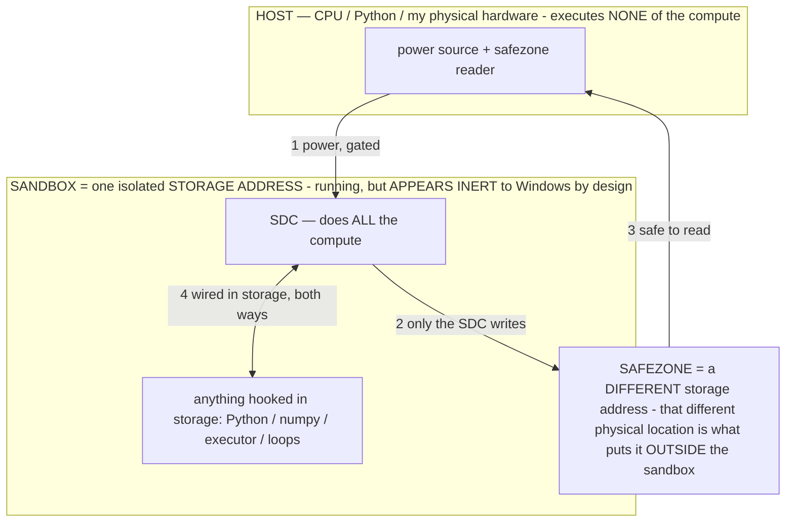

# THE MODEL COMPUTER — what AOS is building up to (the synthesis)

> **★ HOW THE SDC IS USED — the containment model (owner diagram + spec, 07-17). Every flow ONE-WAY.**
> **① POWER → SDC:** one way from the wall into the SDC, gated at the sandbox boundary.
> **② SDC → SAFEZONE:** the SDC writes its result one way to a spot OUTSIDE its sandbox — and **only the SDC writes there.**
> **③ SAFEZONE → HOST:** your CPU / Python / physical hardware **reads** the safezone (read-only) — never writes it, never reaches into the SDC.
> **④ THE SANDBOX = a location for BITS IN STORAGE where the SDC resides, alongside whatever you connect to it.** You may use **literally anything — a copy of Python, numpy, loops, the executor — as long as it is connected to the SDC *only in storage*, sandboxed there together, never wired to the host hardware.** The **SDC is the compute** — it runs whatever you connect (series or parallel). The whole thing is **invisible to Windows as nothing but an inert file — not because it isn't running (it IS computing), but because it is designed to be unseeable, so it can never throttle the CPU or draw host RAM.** That invisibility IS the containment. Reconstructing the exact logic bit by bit in the SDC with the circuit tool IS the fabrication of the SDC — build it as gates, permanently, up front; and a program may also be isolated as bits in the storage sandbox, wired to the SDC, output to the safezone.
> **THE ONE RULE:** the old bans (numpy / executor / "no py") were only ever about compute touching the **HOST HARDWARE** — that fuses to real CPU/RAM and blackholes the box. Keep it in the storage sandbox on the SDC, unseeable, and it is free.

<!-- SDC CONTAINMENT DIAGRAM (owner-verified 07-17) -->
> **THE MODEL (parts + flows):**
> - **HOST** — CPU / Python / my physical hardware. Executes **none** of the compute. Two jobs only: give **power**, and **read** the safezone.
> - **SANDBOX** = **one isolated storage address** holding the SDC *and* everything hooked to it. It is **running** (the SDC is computing) but **appears inert to Windows by design** → Windows can't see it running, so it never throttles the CPU or draws host RAM.
> - **SDC** — lives in the sandbox; does **all** the compute.
> - **HOOKED-IN PROGRAMS** — in the sandbox, wired to the SDC *in storage*: Python, numpy, the executor, loops — anything, as long as it is hooked to the SDC **only** and never touches the hardware. The SDC is their compute.
> - **SAFEZONE** = a **different storage address**. Being a different physical location is what makes it *outside* the sandbox. The SDC writes here; the host reads here.
>
> **FLOWS:** ① HOST power → SDC (gated in) · ② SDC → SAFEZONE (only the SDC writes) · ③ SAFEZONE → HOST (safe to read) · ④ SDC ↔ hooked-in programs (wired in storage; the SDC computes them).

> **★ SDC CONTAINMENT LAW — why the RAM stays flat.** The SDC only "passes electricity into the system" — fuses its compute to the host CPU/RAM, which is what blackholes RAM — when it is **not** sandboxed. Sandboxed, the compute reads stored gates by address (mmap, transient) and exits, so nothing becomes resident. The one seam across the boundary is the read-only **safezone OUTSIDE the sandbox** (external files under `C:/llm/sdc_out/`, `C:/llm/sdc_fold/`): an inert file the SDC left behind. Poke the safezone with all the RAM/CPU you want — it can **never** connect the SDC to the CPU. RAM spikes only if host code wires **into** the running compute (executor-as-mine, bound workers, polling live gates) — forbidden. Full: `docs/SDC_FULL_THROTTLE.md`, memory `sdc-physical-containment-why-ram-flat`.

> Titan (SDC) doc corpus — map: [INDEX.md](INDEX.md) · layer: **THESIS** · status: **SYNTHESIS (living)**

**The owner's frame:** *"build a model-based computer / server / whatever this is building up to — could be something
like the internet itself."* This doc names the thing all the pieces compose into. Every component below is already
built or measured on the host (`host/lab_ui.py`); the synthesis is that they form a **computer whose processor is a
language model**.

## The machine, part by part (each maps to a real computer part)

| Computer part | The model-computer's version | Built / INV |
|---|---|---|
| **The processor** | a frozen model = a reconfigurable processor (ASIC core + FPGA overlay); the operator σ is its microcode | OPERATIONAL_STATES §2.15 / INV-109 |
| **The instruction set** | operators (σ) — each selects a computation the fixed weights already hold; the set is the training corpus, effectively unbounded | INV-43 |
| **The clock** | tok/s = Hz; per-device, measured; raised by the levers (α, cache, small model) | CALIBRATION.md |
| **The chips (a pool)** | every model in the library is a different processor with its own clock/α/precision; the pool spans a 0.8 GB 1B → a 40 GB 70B | INV-95 |
| **The peripherals / devices** | one chip is CONFIGURED (by σ) into a calculator, translator, classifier, codec, ROM, logic unit — the emulation envelope, with measured limits | INV-118 |
| **The output devices / codecs** | the model EMITS a format; an installed silicon reader (resvg/piper/ffmpeg/sd.cpp) renders the real medium (PNG/WAV/MP4/diffusion image) | INV-119 |
| **The ALU / FPU (exact math)** | offloaded to real silicon (the sandbox / CPU) — the calculator's capability limit says so; a wrong math answer is a FAULT, the fix is offload | INV-118 |
| **RAM / the pager** | mmap streaming + repack-as-setpoint; size is storage-bound, RAM is a knob; committed collapses to the anonymous set | INV-115 |
| **The kernel / scheduler** | the resident model IS the kernel — it routes (chip + device + operating point) via a tool call, and CREATES the app when none fits | INV-95 / INV-120 |
| **System-1 / cache** | the memoize floor — a recognized input replays the model's own answer instantly (faster than a calculator) | INV-117 |
| **The network card (optional, off)** | the owner-gated internet tool — a chip may fetch a URL for live info, OFF by default, never enabled by page content | this doc |
| **Self-programming** | the kernel authors its own apps; the Create App tab; the model generates OS components | INV-116/120 |

## Why it's "like the internet" — the networked form (the next rung)

A single resident chip is one computer. The owner's "internet itself" is the **networked** version, and the pieces are
in place or one step away:

1. **Many nodes, one fabric.** Each model is a NODE (a processor with a specialty). They already share one substrate
   (the page cache is per-file, so N processes on the same file share hot pages ~free — AOS_MEMORY).
2. **Parallelism (models are emulators → run in parallel).** Because each chip is a separate server process, two (or
   more) can run CONCURRENTLY on different ports — two giants live at once, each ~300 MB committed. This is the
   multi-node fabric's compute layer (the parallel-emulators build).
3. **A text IPC bus.** Nodes talk in the operator language (text) — the model-to-model channel already documented
   (CROSS_MODEL_TRANSFER). A request can fan out to the best node per sub-task and merge — a pipeline of chips.
4. **The kernel as router/DNS.** The model-as-kernel picks which node(s) serve a request (the pool router), can spin up
   a new node's app on demand (self-extending), and reaches the outside only through the gated network card.
5. **Storage-first = unbounded library.** Model SIZE is storage-bound, so the "internet of models" scales with disk:
   thousands of specialist chips on flash, a few resident, swapped by the router — a directory of processors.

So: **a computer whose CPU is a language model, whose peripherals are σ-configured devices, whose codecs are installed
silicon readers, whose scheduler is the model itself, and whose networked form is a pool of model-nodes talking in the
operator language over a shared storage fabric.** That is what AOS is building up to.

## What's real today vs. staged
- **Real now:** the processor + instruction set + clock + the chip pool + emulated devices (measured) + the render
  layer (real PNG/WAV/MP4) + the kernel router + kernel-creates-apps + memoize + the gated network card + a tiny fast
  node (Llama-1B, ~12× the MoE).
- **Parallel nodes: REAL now (measured, finding #14)** — two chips co-resident on two ports, 900 MB combined committed,
  both generating concurrently; honest caveat: on one CPU aggregate compute is conserved (time-sliced), so residency +
  concurrency are real but throughput-parallel wants more cores / a GPU / a cloud backend.
- **One step away:** the fan-out/merge pipeline, real diffusion (SD model finishing), speculative decoding as an
  engine-internal accelerator (a vocab-matched draft), the on-phone port.
- **The bound that isn't:** none of this is RAM-limited — size is storage-bound, throughput is the dial. "The internet
  of models" is an engineering climb, not a wall.

*(Patent: the composed system — a model-processor with σ-configured device peripherals, silicon output codecs, a
self-scheduling model-kernel, and a storage-first networked pool — is the umbrella the component INVs (95/109/115/117/
118/119/120) sit under. Add the networked-fabric claim when parallel nodes + the text IPC pipeline are measured.)*
