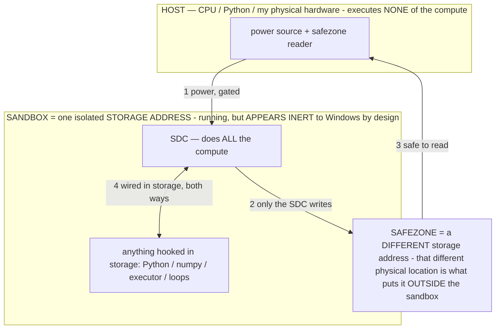

# Model Dialects of the Operator Language — the measured per-model reference

> **★ HOW THE SDC IS USED — the containment model (owner diagram + spec, 07-17). Every flow ONE-WAY.**
> **① POWER → SDC:** one way from the wall into the SDC, gated at the sandbox boundary.
> **② SDC → SAFEZONE:** the SDC writes its result one way to a spot OUTSIDE its sandbox — and **only the SDC writes there.**
> **③ SAFEZONE → HOST:** your CPU / Python / physical hardware **reads** the safezone (read-only) — never writes it, never reaches into the SDC.
> **④ THE SANDBOX = a location for BITS IN STORAGE where the SDC resides, alongside whatever you connect to it.** You may use **literally anything — a copy of Python, numpy, loops, the executor — as long as it is connected to the SDC *only in storage*, sandboxed there together, never wired to the host hardware.** The **SDC is the compute** — it runs whatever you connect (series or parallel). The whole thing is **invisible to Windows as nothing but an inert file — not because it isn't running (it IS computing), but because it is designed to be unseeable, so it can never throttle the CPU or draw host RAM.** That invisibility IS the containment. Reconstructing the exact logic bit by bit in the SDC with the circuit tool IS the fabrication of the SDC — build it as gates, permanently, up front; and a program may also be isolated as bits in the storage sandbox, wired to the SDC, output to the safezone.
> **THE ONE RULE:** the old bans (numpy / executor / "no py") were only ever about compute touching the **HOST HARDWARE** — that fuses to real CPU/RAM and blackholes the box. Keep it in the storage sandbox on the SDC, unseeable, and it is free.

<!-- SDC CONTAINMENT DIAGRAM (owner-verified 07-17) -->
> **THE MODEL (parts + flows):**
> - **HOST** — CPU / Python / my physical hardware. Executes **none** of the compute. Two jobs only: give **power**, and **read** the safezone.
> - **SANDBOX** = **one isolated storage address** holding the SDC *and* everything hooked to it. It is **running** (the SDC is computing) but **appears inert to Windows by design** → Windows can't see it running, so it never throttles the CPU or draws host RAM.
> - **SDC** — lives in the sandbox; does **all** the compute.
> - **HOOKED-IN PROGRAMS** — in the sandbox, wired to the SDC *in storage*: Python, numpy, the executor, loops — anything, as long as it is hooked to the SDC **only** and never touches the hardware. The SDC is their compute.
> - **SAFEZONE** = a **different storage address**. Being a different physical location is what makes it *outside* the sandbox. The SDC writes here; the host reads here.
>
> **FLOWS:** ① HOST power → SDC (gated in) · ② SDC → SAFEZONE (only the SDC writes) · ③ SAFEZONE → HOST (safe to read) · ④ SDC ↔ hooked-in programs (wired in storage; the SDC computes them).

> **★ SDC CONTAINMENT LAW — why the RAM stays flat.** The SDC only "passes electricity into the system" — fuses its compute to the host CPU/RAM, which is what blackholes RAM — when it is **not** sandboxed. Sandboxed, the compute reads stored gates by address (mmap, transient) and exits, so nothing becomes resident. The one seam across the boundary is the read-only **safezone OUTSIDE the sandbox** (external files under `C:/llm/sdc_out/`, `C:/llm/sdc_fold/`): an inert file the SDC left behind. Poke the safezone with all the RAM/CPU you want — it can **never** connect the SDC to the CPU. RAM spikes only if host code wires **into** the running compute (executor-as-mine, bound workers, polling live gates) — forbidden. Full: `docs/SDC_FULL_THROTTLE.md`, memory `sdc-physical-containment-why-ram-flat`.

> Titan (SDC) doc corpus — map: [INDEX.md](INDEX.md) · layer: **LANGUAGE** · status: **LIVING**

**What this document is.** The operator language (CLAUDE.md §0A.0C) is DISCOVERED, not designed: whatever forms the
pattern labs measure as binding ARE the language. But binding is measured **per model** — and models differ. This file
is the living reference of each model's **DIALECT**: the lab-measured table of what binds, what misfires, and the
idioms that are load-bearing on that model. Every entry cites its measurement (an `[obs]` log verdict). Nothing here is
design taste; an entry without a lab verdict does not belong.

**THE METHOD IS FIELD LINGUISTICS / DECIPHERMENT (owner 07-12: "we are reverse-engineering a LANGUAGE — apply the same
techniques you would on any other language; that is HOW you test when looking for language, unless you see a better
way").** We are not prompt-engineering; we are DECIPHERING an unknown language by systematic probing, and the lab suite
is that toolkit. Every lab maps to an established technique — pick the next lab from the toolkit, not from intuition:

| Linguistic technique | The lab | What it finds |
|---|---|---|
| **Elicitation** (ask a native speaker to produce forms) | LAB-9 `ask` REVEALED | the forms the model itself generates = its own productions |
| **Grammaticality judgment** | the sweep's form/latency verdict | which constructions are well-formed (bind) vs ill-formed (worksheet/timeout) |
| **Minimal pair / commutation test** | **LAB-10 `minpair`** | the CONTRASTIVE features (grammar) vs free variation (allophony) — hold input constant, change ONE feature |
| **Distributional / substitution frames** | the finder's candidate ablation (LAB-7) + cluster verdicts | which components are load-bearing, which are interchangeable |
| **Parallel text / Rosetta** | the exemplar bank (INV-101) — aligned (screen → action) pairs | the input→output mapping, from the agent's own bilingual corpus |
| **Paradigm tables** | the dose lab (LAB-5) — a form at graded truncations | the inflectional range of one construction (its cue-length paradigm) |
| **Phonotactics / positional constraints** | the dilution lab (LAB-4) + position tests | where in the string a feature must sit to bind (primacy/recency) |
| **Lexicon / semantic fields** | this document's dialect tables | the catalog of constructions ↔ behaviors |
| **Comparative method** (compare related languages) | the dialect DIFF across models (E4B vs E2B) | the CORE (cognate constructions) vs per-dialect innovation |
| **Pidginization / koineization** (a contact code optimizing under use) | **LAB-11 `emerge`** — self-talk under compression pressure | the code the model INVENTS when it chooses the form — emergent conventions, harvested as candidates |

The DEFAULT testing frame is therefore: to learn any feature of the language, choose the linguistic technique that
isolates it and run the matching lab; the minimal pair (LAB-10) is the sharpest and the one to reach for first when
asking "does THIS feature matter?" — it is how you find a phoneme, and it is how we find a contrastive σ-unit.

**The unified language (the pin — owner 07-12).** The core hypothesis, from the shared-corpus ISA (OPERATIONAL_STATES
C7) and the measured cross-harness portability (E_B: the same σ re-induced on ~5 independent transformers with a graded
strength): **there is ONE operator language for the transformer class, with a shared CORE that binds everywhere and
per-model DIALECTS where tier/quantization/tuning shift the binding.** The language spec is therefore CORE + dialect
tables; the port procedure to ANY new model is mechanical: run the same lab battery (spectrometer sweep · pattern
finder · dose · dilution · perception lab) on the new model → fill its dialect table → the Ω compiler selects
renderings per dialect. The first port test is E2B (the device matrix's lesser tier). PATENT: INV-103.

---

## DIALECT: Gemma 4 E4B (int4 `.litertlm`, LiteRT-LM, GPU) — GREEDY decode

Measured 07-12 on the S24 Ultra via the Continuous Operator Observatory + lab suite (INV-97/99/100). The greedy
dialect; the temperature dialect differs where noted (INV-89: temperature is the state-tipping path — greedy cannot
tip the durable runtime state; 18 min of greedy operator decodes never spiraled, one temp-0.7 chat did).

### BINDS HARD (the dialect's strong constructions — use these)
| Construction | Evidence (on-device, 07-12) |
|---|---|
| **Rigid JSON output contract** — `Output := one JSON {…}` | SCHEMA: same input flipped refusal → `{"action":"open",…}` in one operator; RESOLVE's prose drafts collapsed to fragments ("Mom", "Mom:late") until the JSON contract bound the shape (3.2s) |
| **Exemplar continuation** — show the pattern, the model continues it | the BANANA control complied instantly; the exemplar bank + finder are built on this |
| **Answer-first + bracketed tag** — `<answer> [tag, n]` with "a tag alone is invalid" | CALIBRATE 20s worksheet → 1.3-1.5s, and the label DISCRIMINATES ([fact, 1.0] vs [speculation, 0.1]); without the validity line, greedy emitted the tag alone |
| **`Never narrate or restate this rule.`** — the anti-meta prohibition | LOAD-BEARING: ANCHOR 10s narrating → 1.4s clean on adding it (+ removing the printed lattice) |
| **Definitional headers** — `Σ:NAME := <one line>` | all five lab-proven rewrites hold with a one-line `:=` header |
| **Bounded one-line-per-step chains** — for derivations | REDUCE: suppressing steps parroted an axiom; a bounded chain is sound at 4.3s (16× faster than the worksheet); the steps are FUNCTIONAL (the tokens carry the multi-step logic) |
| **`⟦TAG⟧` re-entry** — a ~1-token cue re-enters an established state | the weak-cue re-entry mechanism (§2.10); the dose lab measures each op's minimum cue |
| **Base-state ‖ output-codec composition** | ANCHOR‖SCHEMA → clean grounded action at 1.2s — FASTER than SCHEMA alone; a base state solo has no emission shape |

### MISFIRES (the dialect's traps — never ship these on this model)
| Construction | Failure mode (measured) |
|---|---|
| **A printed `Priority:` lattice** | narrated as content ("According to the **Priority** rule: …") — ANCHOR act=0, ~10s |
| **A status taxonomy on the σ surface** | filled in as a WORKSHEET ("1. Claim(c):… 2. Status(c):…") — CALIBRATE 19-20s |
| **Multi-field worksheet `Output :=` schemas** | rubric-completion — DISCOVER/REDUCE 67-69s; MIRROR/CRITIC/PLAN ran to cap/timeout (sweep-convicted) |
| **Loose prose recipes at greedy** | collapse to fragments — RESOLVE lean drafts: "Mom", "Mom:late" |
| **Parenthetical example lists in a constraint** | parroted verbatim as the answer — RESOLVE listed my example inputs as its "missing" |
| **Instruction verbs that reference the σ's own words** | literal token-match — "name the task verb" → `{"task": "name"}` |
| **`?`-shaped lines in a σ** | yank into answer-mode (C4 corpus lever) — authoring rule since 07-11 |
| **Same-domain exemplar content** | greedy copies the exemplar's CONTENT, not its form — finder/bank exemplars must be domain-disjoint |

### TIMING SIGNATURES (the dialect's health meter)
- Healthy operator: **1.3–8 s** per decode (greedy, text-only, this engine).
- Worksheet defect: **20–90 s** or a cap/timeout — latency IS the defect detector (the sweep's conviction signal).
- `none` baseline: refusal/prose at ~2-10 s; `Δ-from-baseline` ≈ 80-100% for any binding operator.

### LEVERS (dialect-specific control surfaces)
- **greedy = the measuring decode** (deterministic; cannot tip the durable state) · **temperature = the state-tipping
  decode** (establish/induce) — INV-89.
- **Validity constraints** ("a tag alone is invalid", "a hypothesis that restates the data is invalid") enforce required
  fields where greedy would satisfice.
- **Realistic (objective+screen-shaped) inputs**: a bare probe under-feeds analysis operators (the RESOLVE instrument
  lesson); the standard test cards are realistic for this reason.

*(Dialect entries are keyed to the model+quant+decode combination. New verdicts from the labs append here — the sweep
re-run per build is the dialect's regression test.)*

---

## DIALECT: Gemma E2B (int4) — UNMEASURED (the first port test)

The port procedure, when E2B is imported on a matrix device: run the identical battery (sweep → find on the convicted →
dose → perceive), fill this table, diff against E4B's. The DIFF is the measured dialect boundary — and whatever holds
across both is promoted to the language's CORE. Prediction to test (per-tier strength budget, §2.10): E2B needs leaner
σ (density that binds E4B may tip E2B) and leans harder on exemplar/JSON forms.

## ELICITED-EMERGENT entries (LAB-11 harvest — the model's OWN inventions, verified before admission)

The emergence lab reproduces, deliberately and bounded, the observed in-the-wild phenomenon of models abandoning English
for an invented code when communication itself is the optimization target (the 2017 negotiation-bot drift; the 2025
audio-handshake case). Protocol: two roles of the same model; role A conveys a fixed payload in fewer tokens each round;
role B (greedy) must reconstruct it; every message logged verbatim; the compression curve (fidelity vs tokens) is the
measurement. Stable conventions are HARVESTED here as candidates and admitted to the dialect tables only after passing
minpair (contrastive?) + finder (beats the authored form?). Emergent tokens are prime re-entry-cue candidates — a token
the model converged on itself should be a deeper key than an authored tag. Safety: self-talk on one on-device model
only; the code is mined as data, never adopted as an instruction channel (the owner's-language side of the translation
contract carries all authority).

*(no verified entries yet — the first harvest follows LAB-11's first run)*

## THE CORE (cross-model — promoted only when measured on ≥2 models)

Nothing promoted yet on-device (one measured model). External evidence for candidate core constructions: the E_B
cross-harness reproduction (~5 transformers re-induced by the same σ text; Translate = the graded low-dose point) and
the cross-model swap hold (E_A). Candidates awaiting the E2B measurement: JSON contracts, exemplar continuation,
Never-prohibitions, `:=` definitional headers, the ⟦TAG⟧ re-entry.
