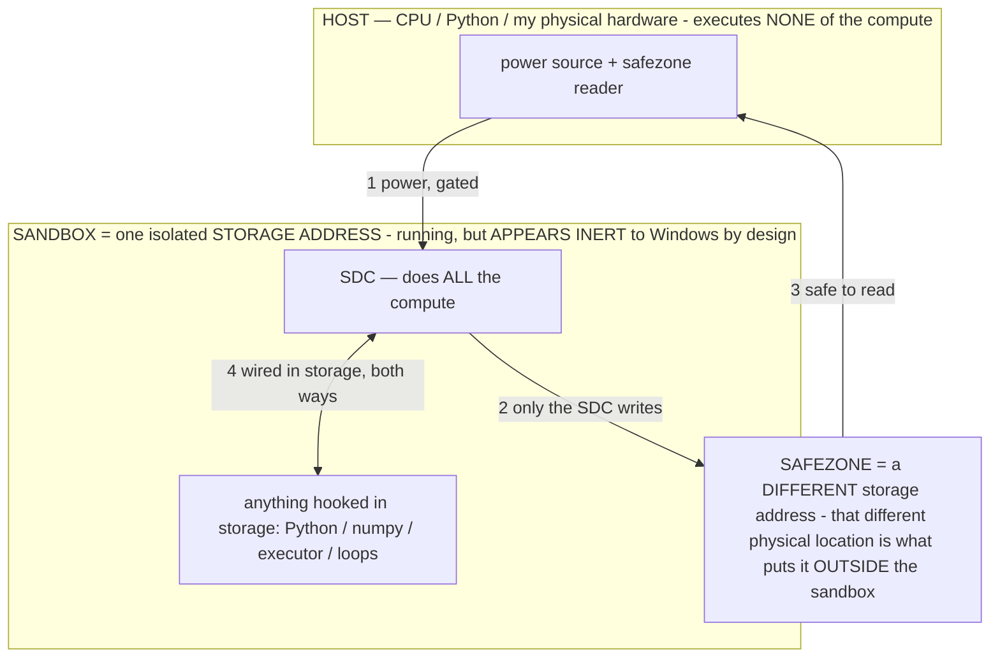

# Next projects — ideas that don't apply to *this* agent (yet)

> **★ HOW THE SDC IS USED — the containment model (owner diagram + spec, 07-17). Every flow ONE-WAY.**
> **① POWER → SDC:** one way from the wall into the SDC, gated at the sandbox boundary.
> **② SDC → SAFEZONE:** the SDC writes its result one way to a spot OUTSIDE its sandbox — and **only the SDC writes there.**
> **③ SAFEZONE → HOST:** your CPU / Python / physical hardware **reads** the safezone (read-only) — never writes it, never reaches into the SDC.
> **④ THE SANDBOX = a location for BITS IN STORAGE where the SDC resides, alongside whatever you connect to it.** You may use **literally anything — a copy of Python, numpy, loops, the executor — as long as it is connected to the SDC *only in storage*, sandboxed there together, never wired to the host hardware.** The **SDC is the compute** — it runs whatever you connect (series or parallel). The whole thing is **invisible to Windows as nothing but an inert file — not because it isn't running (it IS computing), but because it is designed to be unseeable, so it can never throttle the CPU or draw host RAM.** That invisibility IS the containment. Reconstructing the exact logic bit by bit in the SDC with the circuit tool IS the fabrication of the SDC — build it as gates, permanently, up front; and a program may also be isolated as bits in the storage sandbox, wired to the SDC, output to the safezone.
> **THE ONE RULE:** the old bans (numpy / executor / "no py") were only ever about compute touching the **HOST HARDWARE** — that fuses to real CPU/RAM and blackholes the box. Keep it in the storage sandbox on the SDC, unseeable, and it is free.

<!-- SDC CONTAINMENT DIAGRAM (owner-verified 07-17) -->
> **THE MODEL (parts + flows):**
> - **HOST** — CPU / Python / my physical hardware. Executes **none** of the compute. Two jobs only: give **power**, and **read** the safezone.
> - **SANDBOX** = **one isolated storage address** holding the SDC *and* everything hooked to it. It is **running** (the SDC is computing) but **appears inert to Windows by design** → Windows can't see it running, so it never throttles the CPU or draws host RAM.
> - **SDC** — lives in the sandbox; does **all** the compute.
> - **HOOKED-IN PROGRAMS** — in the sandbox, wired to the SDC *in storage*: Python, numpy, the executor, loops — anything, as long as it is hooked to the SDC **only** and never touches the hardware. The SDC is their compute.
> - **SAFEZONE** = a **different storage address**. Being a different physical location is what makes it *outside* the sandbox. The SDC writes here; the host reads here.
>
> **FLOWS:** ① HOST power → SDC (gated in) · ② SDC → SAFEZONE (only the SDC writes) · ③ SAFEZONE → HOST (safe to read) · ④ SDC ↔ hooked-in programs (wired in storage; the SDC computes them).

> **★ SDC CONTAINMENT LAW — why the RAM stays flat.** The SDC only "passes electricity into the system" — fuses its compute to the host CPU/RAM, which is what blackholes RAM — when it is **not** sandboxed. Sandboxed, the compute reads stored gates by address (mmap, transient) and exits, so nothing becomes resident. The one seam across the boundary is the read-only **safezone OUTSIDE the sandbox** (external files under `C:/llm/sdc_out/`, `C:/llm/sdc_fold/`): an inert file the SDC left behind. Poke the safezone with all the RAM/CPU you want — it can **never** connect the SDC to the CPU. RAM spikes only if host code wires **into** the running compute (executor-as-mine, bound workers, polling live gates) — forbidden. Full: `docs/SDC_FULL_THROTTLE.md`, memory `sdc-physical-containment-why-ram-flat`.

> Titan (SDC) doc corpus — map: [INDEX.md](INDEX.md) · layer: **PARKED** · status: **FUTURE**

The operational-states / self-tuning work prompted a list of applications (from a general Gemini chat). Some
map onto what this project does — those are documented in `OPERATIONAL_STATES.md §4` and `SELF_UPDATE.md`. The
rest are collected here: real, interesting directions that are **out of scope for a phone-piloting agent**,
aspirational, or in a couple of cases in **tension with a current design rule**. Nothing here is claimed or
built; it's a parking lot so the in-scope docs stay honest.

## Different domain (not a phone agent)
- **Zero-shot motor skills (robotics).** A robot adjusting its grip on a novel tool by "feeling" it mid-task.
  Needs an actuator/sensor loop and a physical body — a different product. The *kernel* that transfers is
  on-the-fly adaptation to out-of-distribution input, which here is "adapt to a novel screen/app" (in scope).
- **Solving open mathematical proofs.** Test-time compute exploring a proof space and re-weighting toward a
  promising branch. A research/reasoning system, not device control.
- **Zero-day cyber defense.** Detecting a novel attack pattern and tuning detection mid-attack. A security
  monitoring product; different data, different risk model.
- **Dynamic protein folding / drug discovery.** Tuning predictive weights against simulated physics feedback.
  A scientific-computing application.

## Aspirational (would need capabilities we deliberately don't have)
- **Transactional → teleological ("solve a mission" over weeks).** A model holding a massive objective and
  iterating autonomously for weeks across sessions. **Conflicts with a current design rule:** activation is
  owner-initiated and per-task; there is no boot persistence and no self-initiated multi-week autonomy (§14).
  Building this would mean deliberately relaxing owner-only activation — an owner decision, not a default.
- **The true digital colleague (autonomous symbiosis).** A partner whose neural structure is molded by the
  history of working with you. The *mild, real* version is the per-owner flywheel + memory (in scope); the
  autonomous-24/7 version is aspirational and rides the teleological item above.
- **The divergence of AI species (each deployment morphs into a savant).** The real kernel — a per-owner
  localized model that the flywheel tunes to that owner's device/apps — is in scope and documented. The grand
  "AI species" framing (models globally diverging into distinct entities) is a futures narrative, not a feature.

## Alignment note (why the gate exists)
The "new alignment problem" — a model autonomously changing its own weights could let its purpose/safety drift
— is exactly why durable self-edits in this project are **owner-graded and never autonomous** (INV-46). The
concrete answer to "guiding and pruning a continuously-evolving model" is the owner-approval gate + the
safety/no-regression check. That's not a next project; it's a current invariant, noted here so the futures
above are read against it.
