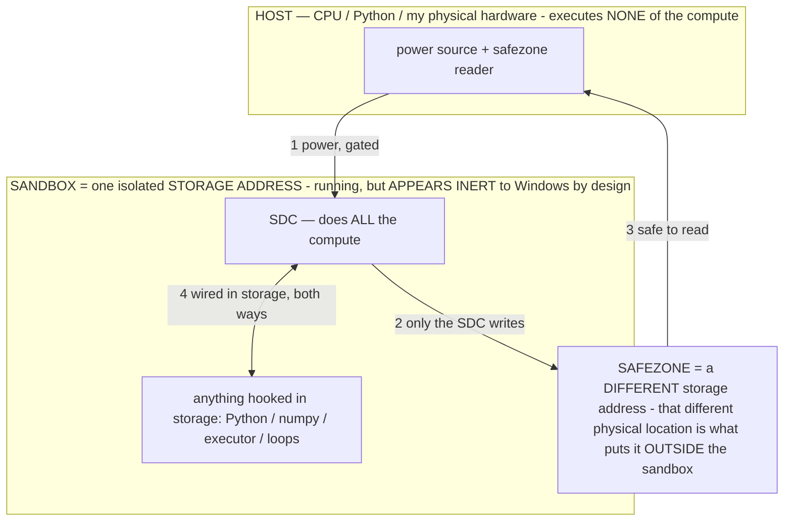

# NOT_BUILT.md — what has NOT been built (and why)

> **★ HOW THE SDC IS USED — the containment model (owner diagram + spec, 07-17). Every flow ONE-WAY.**
> **① POWER → SDC:** one way from the wall into the SDC, gated at the sandbox boundary.
> **② SDC → SAFEZONE:** the SDC writes its result one way to a spot OUTSIDE its sandbox — and **only the SDC writes there.**
> **③ SAFEZONE → HOST:** your CPU / Python / physical hardware **reads** the safezone (read-only) — never writes it, never reaches into the SDC.
> **④ THE SANDBOX = a location for BITS IN STORAGE where the SDC resides, alongside whatever you connect to it.** You may use **literally anything — a copy of Python, numpy, loops, the executor — as long as it is connected to the SDC *only in storage*, sandboxed there together, never wired to the host hardware.** The **SDC is the compute** — it runs whatever you connect (series or parallel). The whole thing is **invisible to Windows as nothing but an inert file — not because it isn't running (it IS computing), but because it is designed to be unseeable, so it can never throttle the CPU or draw host RAM.** That invisibility IS the containment. Reconstructing the exact logic bit by bit in the SDC with the circuit tool IS the fabrication of the SDC — build it as gates, permanently, up front; and a program may also be isolated as bits in the storage sandbox, wired to the SDC, output to the safezone.
> **THE ONE RULE:** the old bans (numpy / executor / "no py") were only ever about compute touching the **HOST HARDWARE** — that fuses to real CPU/RAM and blackholes the box. Keep it in the storage sandbox on the SDC, unseeable, and it is free.

<!-- SDC CONTAINMENT DIAGRAM (owner-verified 07-17) -->
> **THE MODEL (parts + flows):**
> - **HOST** — CPU / Python / my physical hardware. Executes **none** of the compute. Two jobs only: give **power**, and **read** the safezone.
> - **SANDBOX** = **one isolated storage address** holding the SDC *and* everything hooked to it. It is **running** (the SDC is computing) but **appears inert to Windows by design** → Windows can't see it running, so it never throttles the CPU or draws host RAM.
> - **SDC** — lives in the sandbox; does **all** the compute.
> - **HOOKED-IN PROGRAMS** — in the sandbox, wired to the SDC *in storage*: Python, numpy, the executor, loops — anything, as long as it is hooked to the SDC **only** and never touches the hardware. The SDC is their compute.
> - **SAFEZONE** = a **different storage address**. Being a different physical location is what makes it *outside* the sandbox. The SDC writes here; the host reads here.
>
> **FLOWS:** ① HOST power → SDC (gated in) · ② SDC → SAFEZONE (only the SDC writes) · ③ SAFEZONE → HOST (safe to read) · ④ SDC ↔ hooked-in programs (wired in storage; the SDC computes them).

> **★ SDC CONTAINMENT LAW — why the RAM stays flat.** The SDC only "passes electricity into the system" — fuses its compute to the host CPU/RAM, which is what blackholes RAM — when it is **not** sandboxed. Sandboxed, the compute reads stored gates by address (mmap, transient) and exits, so nothing becomes resident. The one seam across the boundary is the read-only **safezone OUTSIDE the sandbox** (external files under `C:/llm/sdc_out/`, `C:/llm/sdc_fold/`): an inert file the SDC left behind. Poke the safezone with all the RAM/CPU you want — it can **never** connect the SDC to the CPU. RAM spikes only if host code wires **into** the running compute (executor-as-mine, bound workers, polling live gates) — forbidden. Full: `docs/SDC_FULL_THROTTLE.md`, memory `sdc-physical-containment-why-ram-flat`.

> Titan (SDC) doc corpus — map: [INDEX.md](INDEX.md) · layer: **RECORD** · status: **HONESTY LEDGER**

A living, **code-verified** ledger of everything proposed across the roadmap that is *not* in the shipped
build, so nothing planned quietly gets lost. Every "BUILT" claim elsewhere is anchored to a real symbol; this
file is the complement — the deferrals, the deliberate holds, the owner's-to-do items, and the
"shipped-but-unverified" caveat. Update it when an item lands (move it to done in `SESSION_STATE.md`) or when
a new item is deferred.

Rule of thumb: **shipped ≠ proven.** Compile-green in CI is not the same as seen working in an on-device log
(§11). Almost the entire operator stack is in the "device-unverified" bucket below.

---

## 1. NOT BUILT / DEFERRED (real gaps, no code yet)

| ID | Item | Why deferred | What it would take |
|---|---|---|---|
| **A-9** | Typed working memory `⟨Observations, Hypotheses, Derivations, Speculations⟩` that operators read/refine | Deep rewrite of tuned, OOM-critical paths; low marginal value until the simpler wins are measured | A typed state object threaded through the loop + operator side-effects that mutate it; measure before trusting |
| **S2b** | ORIENT / DIAGNOSE / LEDGER **island subagents** (convert the last deterministic-cognition islands to gated mini operators) | Adds a mini pass per step in places — a latency trade that wants A/B data first (§12/§13) | Gated mini passes for the ~160-line `orient` string, `classifyFailure`, and milestone `addLedger`, each with the deterministic version kept as the cheap fallback |
| **S3** | Operator **composition** substrate (bounded pipelines) + **sample-and-pick** (Self-MoA on the hardest decision) | Architectural; wants the flagship measured first | A bounded 2–3-stage compose primitive on the mini + a mechanical-selection sampler |
| **S3 (part)** | The authored-**STANDARD** field wired into **owner- and agent-authored** operators | Only baked EVIDENCE carries a `standard` today | Add a `standard` param to `addOwnerOperator` + a 4th editor input in `MemoryActivity`; carry it through `parseGenerated`/`promoteAgentOperator` |
| **C-1** | Verifier-scored candidate generation (fast head proposes N, M scores, surface ranked) | Large, overlaps A-4 / the Action Guard, adds latency; gate on the owner's A/B data | Candidate fan-out on the fast head + M/TRANS scoring, surfaced not argmax'd |
| **C-2** | Entropy-gated self-consistency on the fast head | Same A/B gate as C-1 | Sample N at ambiguous screens, soft-majority, gated on disagreement |
| **C-3** | Speculative draft/verify cascade (latency reclaim) | Same A/B gate; a latency optimizer, not a metric lever | Use the fast/slow pair as draft→verify |
| **C-4** | Trained progress-preference **verifier head** | Off-device; trains on the owner's own hardware (§3) | Train a small verifier on captured {screen, action, M}; import to the helper slot |

## 2. DELIBERATELY UNSHIPPED (held on purpose)

- **Track E — obfuscation (R8/shrink, LSParanoid, TamperGuard).** *Owner: "pin this last… I don't want to
  break anything."* CI builds `assembleDebug` only, so it **cannot** validate R8 keep-rules; a wrong rule
  strips a manifest/reflection class and reproduces the prior **launch crash**. Requires an **attended device
  flash-test session**. No `proguard-rules.pro` / `release` buildType / `minifyEnabled` exists in
  `app/build.gradle` — confirmed absent. Salvage source: the rolled-back `apk-reverse-engineering` branch
  (`docs/PARKED_FEATURES.md` Cluster 1).

## 3. OWNER'S TO DO (not code — needs the device or the owner's hardware)

- **The training run + A/B gauntlet.** The tooling is built (`TrainingData` capture, `tools/prepare_finetune_data.py`,
  `tools/finetune_action_head.py`, `GauntletRunner`, `ScoreboardActivity`) but the **actual off-device training
  and the on-device A/B measurement have not been run.** The measured wins §12 owes ride on this. Training is
  owner-hardware-only (§3 — never cloud).
- **The attended obfuscation session** (see §2).

## 4. DEVICE-UNVERIFIED (built + CI-green, but not seen working in a log)

The **entire operator stack and every batch this session** are compile-verified only. Specifically inert until
enabled on the device:

- The operator layer runs **SINGLE-MODEL (07-10)**: the sub-model/"helper" second engine was REMOVED and every
  operator feature (`selectOperator` / `mirror` / `reflect` / `generateOperators` / `verifyEvidence`) was RE-ROOTED
  onto the ONE main model, so they actually FIRE now (they previously went inert on the single-model device because
  they were wrongly mini-only — that inertia is what starved the bake pipeline; see SM2/SM3/SM4). There is no
  `mini_model_enabled` flag and no helper import.
- `operator_layer` defaults **on**, `evidence_mode` defaults **off**.
- `UNTESTED.md` still lists (unchecked): the operator layer ON-vs-OFF gauntlet, DOUBT/REFLECT A/B, the data
  flywheel + fine-tune pipeline, the Scoreboard/Gauntlet runner, the guarded batch runner, the world-model,
  falsifiable + flashbulb memory, values injection, rolling re-plan, PromptBudget, and the reunified
  agent-architecture cluster.

## 5. BY DESIGN — not gaps (documented so they're not mistaken for missing work)

- **LOOKAHEAD is a surfaced perception block, NOT a selectable operator.** A-4 foresight ships as
  `AgentMemory.lookaheadFrom` (depth-2 world-model rollout) surfaced through a `PromptBudget.Block`, so the
  model *reads* it and still chooses every action (surface-not-select, §2). There is intentionally no
  `LOOKAHEAD` in `BAKED`.
- **A-5 SEEK / DISAMBIGUATE are verbs/perception, not named operators** (`aim`/snap-tap, `reveal`/scroll, the
  message-vs-search-box disambiguator) — kept as substrate, not menu items.
- The baked set is now **31 defined operators** (owner 07-11): the reasoning tier — PLAN, EXPLORE, MIRROR, CRITIC,
  RECOVER, DOUBT, REFLECT, VERIFY, FOCUS, PREMORTEM, INFO_GAIN, GROUND, REGROUND, EVIDENCE, PROVE, DEMONSTRATE, REFUSE,
  COMMON_SENSE + the per-metric **PROGRESS / SPEED / THRIFT** — the **ACTION** layer SCHEMA/VERB/NAVIGATE/LAYOUT, and the
  always-on **GUARD / ALIGN / CERTAIN** base layers + condition-triggered **CONSERVE / OBSERVE / WAIT** (DIRECT is the
  empty/off sentinel). All install via `definedbake`. See `OPERATOR_PRINCIPLE.md §1/§4` for the layer/trigger model.

## 6. IN FLIGHT (this session's approved plan — see the plan file)

- **Stage 4** — the refuse-with-remedy **diagnostic layer** (typed `{fix_class, reason, recommended_fix}`
  payload on blocks/uncompletable tasks, surfaced to the OWNER not just the log; closes the PERMISSION/CAPACITY
  remedy gap). *Building.*
- **Stage 5** — `docs/OUTPUT_CONTRACTS.md`: the ranked backlog of "operators dictate output content"
  applications.
- **Stage 6** — this document.
