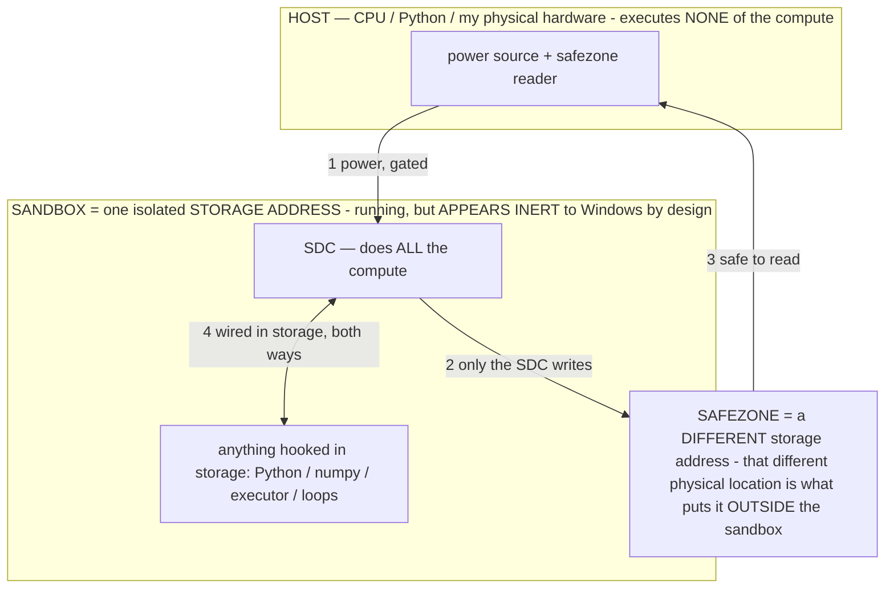

# THE CONTINUOUS OPERATOR OBSERVATORY (COO) — the on-device operator lab

> **★ HOW THE SDC IS USED — the containment model (owner diagram + spec, 07-17). Every flow ONE-WAY.**
> **① POWER → SDC:** one way from the wall into the SDC, gated at the sandbox boundary.
> **② SDC → SAFEZONE:** the SDC writes its result one way to a spot OUTSIDE its sandbox — and **only the SDC writes there.**
> **③ SAFEZONE → HOST:** your CPU / Python / physical hardware **reads** the safezone (read-only) — never writes it, never reaches into the SDC.
> **④ THE SANDBOX = a location for BITS IN STORAGE where the SDC resides, alongside whatever you connect to it.** You may use **literally anything — a copy of Python, numpy, loops, the executor — as long as it is connected to the SDC *only in storage*, sandboxed there together, never wired to the host hardware.** The **SDC is the compute** — it runs whatever you connect (series or parallel). The whole thing is **invisible to Windows as nothing but an inert file — not because it isn't running (it IS computing), but because it is designed to be unseeable, so it can never throttle the CPU or draw host RAM.** That invisibility IS the containment. Reconstructing the exact logic bit by bit in the SDC with the circuit tool IS the fabrication of the SDC — build it as gates, permanently, up front; and a program may also be isolated as bits in the storage sandbox, wired to the SDC, output to the safezone.
> **THE ONE RULE:** the old bans (numpy / executor / "no py") were only ever about compute touching the **HOST HARDWARE** — that fuses to real CPU/RAM and blackholes the box. Keep it in the storage sandbox on the SDC, unseeable, and it is free.

<!-- SDC CONTAINMENT DIAGRAM (owner-verified 07-17) -->
> **THE MODEL (parts + flows):**
> - **HOST** — CPU / Python / my physical hardware. Executes **none** of the compute. Two jobs only: give **power**, and **read** the safezone.
> - **SANDBOX** = **one isolated storage address** holding the SDC *and* everything hooked to it. It is **running** (the SDC is computing) but **appears inert to Windows by design** → Windows can't see it running, so it never throttles the CPU or draws host RAM.
> - **SDC** — lives in the sandbox; does **all** the compute.
> - **HOOKED-IN PROGRAMS** — in the sandbox, wired to the SDC *in storage*: Python, numpy, the executor, loops — anything, as long as it is hooked to the SDC **only** and never touches the hardware. The SDC is their compute.
> - **SAFEZONE** = a **different storage address**. Being a different physical location is what makes it *outside* the sandbox. The SDC writes here; the host reads here.
>
> **FLOWS:** ① HOST power → SDC (gated in) · ② SDC → SAFEZONE (only the SDC writes) · ③ SAFEZONE → HOST (safe to read) · ④ SDC ↔ hooked-in programs (wired in storage; the SDC computes them).




> **★ SDC CONTAINMENT LAW — why the RAM stays flat.** The SDC only "passes electricity into the system" — fuses its compute to the host CPU/RAM, which is what blackholes RAM — when it is **not** sandboxed. Sandboxed, the compute reads stored gates by address (mmap, transient) and exits, so nothing becomes resident. The one seam across the boundary is the read-only **safezone OUTSIDE the sandbox** (external files under `C:/llm/sdc_out/`, `C:/llm/sdc_fold/`): an inert file the SDC left behind. Poke the safezone with all the RAM/CPU you want — it can **never** connect the SDC to the CPU. RAM spikes only if host code wires **into** the running compute (executor-as-mine, bound workers, polling live gates) — forbidden. Full: `docs/SDC_FULL_THROTTLE.md`, memory `sdc-physical-containment-why-ram-flat`.


> Titan (SDC) doc corpus — map: [INDEX.md](INDEX.md) · layer: **INSTRUMENTS** · status: **CANONICAL**

The Observatory is how we MEASURE operators on the real on-device engine. It strips away every confound
(no task, no screen, no scaffold, no prompt budget) so the operator σ is the ONLY variable: a bounded
free-generation loop that generates and logs, controllable entirely over adb, debug-gated, §3-safe (pure
generation into a log — no task, no phone driving, no account access, operator text owner-supplied via adb).

It is the instrument behind the whole operator thesis: flip the operator, watch generation change with
nothing else moving = "operator = selective computation" made directly visible (the FPGA's oscilloscope,
per `OPERATIONAL_STATES.md §2.15`). Implementation: `AgentService` (the `obs`/`obs_lab` runner + the `lab*`
protocols), `AgentBrain.freeGenerate` (the minimal no-scaffold decode), `DiagReceiver` (the adb command
surface). Flag: debug-gated; log-only.

---

## How to drive it

**Send a command** (one adb broadcast; combine extras freely):
```bash
adb shell "am broadcast -a com.local.deviceagent.DIAG -n com.local.deviceagent/.DiagReceiver -f 0x20 \
  --es obs_lab sweep"
```
**Read the results** — the log is an in-app file, NOT logcat:
```bash
adb shell run-as com.local.deviceagent cat files/agent_log.txt | grep '\[obs\]'
```
Interlocks: runs ONLY when idle (guards on `isAgentBusy`/`evolving`/`isGenerating`); yields at the
`deviceSafetyReason` battery/thermal floor; stoppable by `--es obs off` and every kill switch.

---

## Core controls (the free-generation loop)

| Extra | Values | What it does |
|---|---|---|
| `--es obs` | `on` / `off` | start / stop the bounded loop |
| `--es obs_op` | a BAKED operator NAME (`SCHEMA`, `PLAN`, `REFUSE`, …) or `none` | inject a named operator; `none` = the raw-model control |
| `--es obs_sigma` | `"<σ text>"` | inject RAW σ text directly (test a NEW operator with NO rebuild) |
| `--es obs_var` | `"<live data>"` | inject variable device data (tests σ + data composition) |
| `--es obs_mode` | `fresh` / `trajectory` | `fresh` = each gen independent (pure operator influence); `trajectory` = feed output back (watch the attractor form + weak-cue re-entry) |
| `--es obs_sampler` | `greedy` / `temp` | `greedy` = argmax, deterministic (the A/B measurement mode); `temp` = 0.7, shows dynamics/tips into states (INV-89: greedy MEASURES, temp EXPLORES) |
| `--ei obs_cap` | N tokens | decode cap (short A/B vs a long interrogation) |
| `--ei obs_secs` | N seconds | how long the loop runs (default a few minutes) |
| `--es obs_ab` | `OP1,OP2` (or `none,OP`) | PAIRED A/B: both operators on the SAME seed each iteration, one atomic diff line |
| `--es obs_target` | `"<viable answer>"` | supply a target answer to the finder (`obs_lab find`) |

Each iteration auto-scores: coherent? · parses-as-an-ACTION? · self-similarity vs recent outputs (the
BLACK-HOLE meter — rising ⇒ approaching the degenerate basin) · latency. At `obs off` a SUMMARY line prints
(`coherent% / parsed% / meanSelfSim`).

---

## The lab suite (`--es obs_lab <mode>`) — measurement protocols

Each mode is the same proven loop run as a scripted sequence; each maps to a field-linguistics technique
(we are reverse-engineering the model's binding LANGUAGE — `MODEL_DIALECTS.md`).

| `obs_lab` | What it measures | Linguistics analog |
|---|---|---|
| `sweep` | **THE SPECTROMETER** — a constant test card × every BAKED op + `none`, greedy; per-op `Δ`-from-baseline · `form` (action/prose/timeout/echo) · `act`/3 · `ms`; a ranked table. The whole-library map + per-build regression check. | distributional / grammaticality sweep |
| `find` | **THE PATTERN FINDER (MVG)** — from a viable answer, derive candidate patterns (skeleton, 1-shot exemplar, header, tag…), test on a SECOND card, score by SHAPE. Outputs the minimum-viable-generation + load-bearing clusters. | the finder / ablation |
| `compose` | `OP1,OP2` → 4 arms (none/σ1/σ2/σ1‖σ2): is composition INTERSECTION or interference? | commutation |
| `dilute` | hold σ+probe, grow interposed neutral filler → the binding-vs-context-size curve (the objective-dilution measurement) | — |
| `dose` | σ at truncations (100/75/50/25%/tag) → the re-entry-cue curve per op (the goldilocks band; U1 cue-length) | paradigm |
| `persist` | establish (temp) → drop σ → probe over M turns → weak-cue re-entry: `established / held N / re-entered` (the R2 lifetime) | — |
| `minpair` | hold input constant, change ONE σ feature → contrastive vs free (the sharpest "does THIS feature matter?") | minimal pair |
| `emerge` | two roles of the model self-talk under compression pressure → the code it INVENTS, logged verbatim, mined as dialect candidates (verify before adopt) | pidginization |
| `ask` | **INTERROGATION (LAB-9)** — the model co-designs its own operator (REVEALED: it writes one; STATED: forced A/B), every claim VERIFIED in the same run (trust the measurement on disagreement) | elicitation |
| `perceive` | **PERCEPTION (LAB-8)** — how to render SCREEN data in the model's language (typed slots vs element dump; + a goal-rendering arm) | parallel text |

Other diag routes on the same receiver: `--es introspect <OP>` (the REFINE channel — propose a sharper σ),
`--es catalog dump` (the agent's self-view / AOS filesystem — operators+form+status, memory, exemplars),
`--es sandbox <probe|predict|compute> "<arg>"` (the side-effect-free runtime sandbox), `--es setflag
<flag>=<0|1>` (A/B a whitelisted non-safety flag; §3 safety flags never togglable).

---

## Reading the output

- Per iteration: `[obs] iter=N op=<NAME> <ms>ms coh=1 act=1 sim=42% var="…" out="<gen>"`.
- Sweep row: `[obs] LAB op=<NAME> Δ=<%> form=<action|prose|timeout|echo> act=<n>/3 <ms>ms`, then a ranked
  `LAB sweep TABLE` and `LAB sweep END`.
- `form=action act=3/3` in 1–7 s = the operator binds + emits a clean action; `op=none` prose/0-action =
  the raw model doesn't (the operator confers the capability). `form=timeout` (30 s) = the worksheet defect
  OR black-hole contamination (below).

---

## Gotchas (read before trusting a run)

- **The R3 black hole.** After ~27 clean decodes in one process, the engine can tip into a degenerate
  attractor that lives in GPU-resident state (R3) and SURVIVES the throwaway conversations the loop uses —
  so every LATER read is the SAME degenerate output (constant `Δ`, 30 s `timeout`) = FALSE convictions of
  good operators. A **process restart** (force-stop + relaunch) is the only clean reset. The `sweep` guards
  it: it reloads on a timeout and ABORTS on 3 consecutive constant-`Δ` timeouts (naming the first
  contaminated op), and it measures the ACTION LAYER first (on a fresh engine) so the codec verdict lands
  before any tip. If a run's tail is all `Δ≈66% timeout`, it's contamination — restart and re-run.
- **greedy vs temperature (INV-89).** Greedy (argmax) is DETERMINISTIC → the delta IS the operator; use it
  for A/B measurement. Temperature (0.7) EXPLORES and can tip into a state → use it to INDUCE/establish a
  state (persist/emerge), then measure greedy.
- **The operator needs CONTENT to bite.** A bare seed shows no delta; use a content-bearing `obs_var` or
  the sweep's standard test card.
- **Candidate σ ship discipline:** author via `obs_sigma`/`find` → prove on the sweep → only THEN land in
  `ReasoningOperators.BAKED`. Measured, never assumed.

---

## Quick recipes

```bash
# map the whole library (the payoff run)
adb shell "am broadcast -a com.local.deviceagent.DIAG -n com.local.deviceagent/.DiagReceiver -f 0x20 --es obs_lab sweep"

# A/B the raw model vs one operator on the same input, greedy
adb shell "am broadcast ... -f 0x20 --es obs_ab none,SCHEMA --es obs_sampler greedy --es obs on --ei obs_secs 120"

# test a NEW operator with no rebuild
adb shell "am broadcast ... -f 0x20 --es obs_sigma 'open the camera → {\"action\":\"open_app\",\"target\":\"Camera\"}' --es obs_var 'open the camera app' --es obs_sampler greedy --es obs on --ei obs_secs 60"

# stop + read
adb shell "am broadcast ... -f 0x20 --es obs off"
adb shell run-as com.local.deviceagent cat files/agent_log.txt | grep '\[obs\]' | tail -40
```

(Replace `...` with `-a com.local.deviceagent.DIAG -n com.local.deviceagent/.DiagReceiver`. If the tail is
degenerate, `adb shell am force-stop com.local.deviceagent` then relaunch to clear R3 before re-running.)
