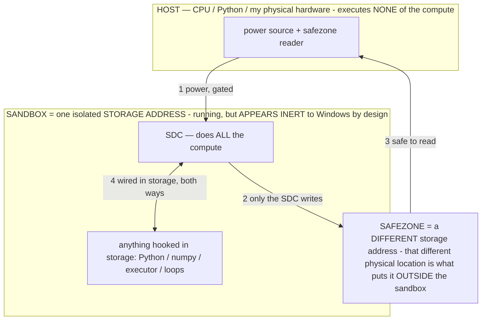

# OMEGA (Ω) — THE OPERATOR LANGUAGE (spec)

> **★ HOW THE SDC IS USED — the containment model (owner diagram + spec, 07-17). Every flow ONE-WAY.**
> **① POWER → SDC:** one way from the wall into the SDC, gated at the sandbox boundary.
> **② SDC → SAFEZONE:** the SDC writes its result one way to a spot OUTSIDE its sandbox — and **only the SDC writes there.**
> **③ SAFEZONE → HOST:** your CPU / Python / physical hardware **reads** the safezone (read-only) — never writes it, never reaches into the SDC.
> **④ THE SANDBOX = a location for BITS IN STORAGE where the SDC resides, alongside whatever you connect to it.** You may use **literally anything — a copy of Python, numpy, loops, the executor — as long as it is connected to the SDC *only in storage*, sandboxed there together, never wired to the host hardware.** The **SDC is the compute** — it runs whatever you connect (series or parallel). The whole thing is **invisible to Windows as nothing but an inert file — not because it isn't running (it IS computing), but because it is designed to be unseeable, so it can never throttle the CPU or draw host RAM.** That invisibility IS the containment. Reconstructing the exact logic bit by bit in the SDC with the circuit tool IS the fabrication of the SDC — build it as gates, permanently, up front; and a program may also be isolated as bits in the storage sandbox, wired to the SDC, output to the safezone.
> **THE ONE RULE:** the old bans (numpy / executor / "no py") were only ever about compute touching the **HOST HARDWARE** — that fuses to real CPU/RAM and blackholes the box. Keep it in the storage sandbox on the SDC, unseeable, and it is free.

<!-- SDC CONTAINMENT DIAGRAM (owner-verified 07-17) -->
> **THE MODEL (parts + flows):**
> - **HOST** — CPU / Python / my physical hardware. Executes **none** of the compute. Two jobs only: give **power**, and **read** the safezone.
> - **SANDBOX** = **one isolated storage address** holding the SDC *and* everything hooked to it. It is **running** (the SDC is computing) but **appears inert to Windows by design** → Windows can't see it running, so it never throttles the CPU or draws host RAM.
> - **SDC** — lives in the sandbox; does **all** the compute.
> - **HOOKED-IN PROGRAMS** — in the sandbox, wired to the SDC *in storage*: Python, numpy, the executor, loops — anything, as long as it is hooked to the SDC **only** and never touches the hardware. The SDC is their compute.
> - **SAFEZONE** = a **different storage address**. Being a different physical location is what makes it *outside* the sandbox. The SDC writes here; the host reads here.
>
> **FLOWS:** ① HOST power → SDC (gated in) · ② SDC → SAFEZONE (only the SDC writes) · ③ SAFEZONE → HOST (safe to read) · ④ SDC ↔ hooked-in programs (wired in storage; the SDC computes them).




> **★ SDC CONTAINMENT LAW — why the RAM stays flat.** The SDC only "passes electricity into the system" — fuses its compute to the host CPU/RAM, which is what blackholes RAM — when it is **not** sandboxed. Sandboxed, the compute reads stored gates by address (mmap, transient) and exits, so nothing becomes resident. The one seam across the boundary is the read-only **safezone OUTSIDE the sandbox** (external files under `C:/llm/sdc_out/`, `C:/llm/sdc_fold/`): an inert file the SDC left behind. Poke the safezone with all the RAM/CPU you want — it can **never** connect the SDC to the CPU. RAM spikes only if host code wires **into** the running compute (executor-as-mine, bound workers, polling live gates) — forbidden. Full: `docs/SDC_FULL_THROTTLE.md`, memory `sdc-physical-containment-why-ram-flat`.


> Titan (SDC) doc corpus — map: [INDEX.md](INDEX.md) · layer: **LANGUAGE** · status: **DESIGN**

The formal DSL for programming a frozen model with operators: ONE source compiles to prompt / durable
runtime / weights. Extracted from `docs/MASTER_PLAN.md` into its own doc (referenced there as the
deliverable `docs/OMEGA_LANGUAGE.md`). **STATUS: design/spec** — the parser/validator/compiler (flag
`omega_lang`, dev-time, JVM-testable) is not yet shipped; `ReasoningOperators.BAKED` is the live operator
set. `CLAUDE.md §0B` + `MASTER_PLAN.md` win on any conflict.

---

## ★★★★★ THE OPERATOR LANGUAGE — Ω (owner 07-11: "operators are a coding language — write it, create the language")

Operators ARE a programming language and we've been writing it in ad-hoc notation. **Ω is that language, formalized** — a
DSL whose programs are operators, whose compiler targets are the three persistence tiers, and whose runtime is AOS
(next section). It formalizes the informal σ in `AGENT_LANGUAGE.md`/`OPERATOR_PRINCIPLE.md` and the `ReasoningOperators`
`BAKED` set. Every design choice is FORCED by our theory (§CONTINUATION C1–C10), so the language is not arbitrary syntax —
it is the theory made writable. **Deliverable: `docs/OMEGA_LANGUAGE.md` (the spec) + `OmegaParser.kt`/`OmegaCompiler.kt`
(parse → validate → emit to a tier). A lot of the design is done HERE so the build is transcription.**

### Ω-1. Design axioms (each maps to a proven mechanism — the language cannot be otherwise)
- **Formal, not prose** (C1/C4): tokens are the precision alphabet `:= ∀ ∃ ∈ ∉ ⊆ ⇒ ⇔ ¬ ∧ ∨ > ∪ ∩ { } min max`; English appears
  ONLY as identifier NAMES. Rare well-trained tokens = sharp feature directions = tight `A_σ`.
- **Definitional/imperative only, NEVER interrogative** (C4/notes #4): a `?`-shaped clause is a COMPILE ERROR — it code-
  switches the model into answer-mode instead of constraint-mode.
- **Density-aware** (C2): every clause must carry a constraint (`alignment × count ÷ dilution`); a clause the validator
  finds semantically empty is a warning ("dilution"). No filler.
- **Composable with explicit priority** (C2/§composition): programs declare a `Priority` lattice so conflicts resolve
  deterministically, never stochastically.
- **Tier-annotated** (N4 ladder): every operator declares WHERE it lives (R0..R4), so the compiler knows whether to inject
  text, hold a posture, or bake.
- **Cue-carrying** (U1/U4): every operator names its ~1-token re-entry tag, so a resident operator dispatches in 1 token.

### Ω-2. Grammar (concrete, EBNF — this is buildable as-is)
```
program     := directive* operator+
directive   := "@priority" NAME (">" NAME)+        // program-level conflict lattice
             | "@compose" NAME ("‖" NAME)+          // declare an intended composite
operator    := "Σ" ":" NAME attr* "{" clause+ "}"
attr        := "tier"    "=" ("R0".."R4")           // prompt · KV · trajectory · runtime · weights
             | "trigger" "=" ("always" | "elected" | "cond(" pred ")")
             | "layer"   "=" ("base" | "reasoning" | "action" | "comm")
clause      := def | constraint | optimize | priority | cond | prohibit | output | cue
def         := IDENT ":=" expr                       // e.g.  Truth := Justified ∨ Unknown
constraint  := "∀" VAR (":" domain)? ":" pred "⇒" pred   |   IDENT "⇔" pred
optimize    := "Optimize" ":" ("min"|"max") "(" expr ")" ("," ("min"|"max") "(" expr ")")*
priority    := "Priority" ":" IDENT (">" IDENT)+
cond        := "If" pred ":" clause+ ("Else" ":" clause+)?
prohibit    := "Never" PHRASE                        // terse prohibition, imperative
output      := "Output" ":=" FIELD ("/" FIELD)*      // the emission schema
cue         := "Cue" ":=" "⟦" NAME "⟧"               // the 1-token re-entry tag
```

### Ω-3. Canonical program (the owner's ACCURACY exemplar, now in valid Ω — the reference the parser is tested against)
```
Σ:ACCURACY  tier=R4  trigger=elected  layer=reasoning {
  Truth   := Justified ∨ Unknown
  Reject  := { Contradiction, Hallucination, Redundancy }
  ∀c: assert(c) ⇒ evidence(c)
  unknown(c) ⇔ ¬provable(c)
  ∀c: output(c) ⇒ information_gain(c) > 0
  Optimize: min(length), max(consistency)
  Priority: facts > derivations > hypotheses > speculation
  Never invent premises.
  Output := observations / derivation / conclusion / confidence
  Cue := ⟦ACCURACY⟧
}
```

### Ω-4. Semantics — what each construct DOES to the model (the compile-to-behavior table)
| Construct | Behavioral effect (narrows `A_σ`) | Why (mechanism) |
|---|---|---|
| `X := Y` definition | pins a term to acceptance-mode ground truth | C4 (corpora never argue a definition) |
| `∀c: P⇒Q` constraint | conditions every emission on the predicate | in-context rule binding |
| `X ⇔ ¬Y` | forces a biconditional (a consistency check the model surfaces) | formal-system consistency |
| `Optimize: min/max` | cost functions the decode trades against | shapes the objective, not one token |
| `Priority: a>b>c` | deterministic conflict resolution | C2 (else stochastic per-token) |
| `Never …` | hard prohibition (spec/safety mode) | C4 (spec-corpus shape) |
| `Output := f/f/f` | emission schema (API-mode) | C4 (schema-corpus shape) |
| `Cue := ⟦N⟧` | the resident re-entry token | U1/U4 (1-tok dispatch) |

### Ω-5. Composition + the type/layer system
- **Layers** = the operator's role: `base` (always-on: GUARD, ALIGN, CERTAIN — never shed, U9), `reasoning`
  (elected per-step: ACCURACY, PROVE, RECOVER…), `action` (SCHEMA, VERB, NAVIGATE, LAYOUT — the action codec), `comm`
  (readable rendering). A program is a typed set; AOS composes by layer.
- **Composition** `Σ:A ‖ Σ:B` → the intersection region `A_A ∩ A_B` (§composition). The compiler runs an INTERFERENCE
  CHECK (are the two `Priority` lattices / `Never` sets contradictory?) → if so it requires an `@priority` resolution or
  flags interference (measured, not silently folded).
- **Type safety** = the validator: a `?` clause → error; an empty/dilution clause → warning; an undefined identifier in a
  constraint → error; a `Never` that contradicts an `Optimize max` → interference error.

### Ω-6. Compilation — one source, three carriers (the compiler's whole job)
An operator's `tier` selects the emit target (all three already have a code home):
- **R0/R1 → PROMPT** : emit the σ text (or, if resident, the `Cue`) → `ReasoningOperators.inject()`.
- **R2/R3 → HOLD** : establish once, then re-enter by `Cue` → `session_sigma` / the durable-runtime posture.
- **R4 → BAKE** : the install target → `ScaleBake.bakeOperatorDirect(name, rule)`; on residency it graduates and the
  compiler thereafter emits only the `Cue` (0-token, the drop-seam).
The compiler is thus the concrete mechanism of the whole 0-token thesis: **the SAME Ω program migrates down the tier
ladder without being rewritten** — authored at R0, proven, baked to R4, dispatched by Cue.

### Ω-7. Build plan for Ω (flag `omega_lang`, dev-time tool first — no runtime risk)
`docs/OMEGA_LANGUAGE.md` (this spec, expanded) · `OmegaParser.kt` (grammar → AST) · `OmegaValidator.kt` (the Ω-5 type
rules) · `OmegaCompiler.kt` (AST → tier emit, reusing `inject`/`session_sigma`/`bakeOperatorDirect`) · migrate the
existing `ReasoningOperators.BAKED` rules to `.omega` source as the test corpus (they already match the shape). Unit-
testable entirely in the JVM (no device) — the parser/validator/compiler are pure. PATENT: Ω is an INV — a formal DSL for
frozen-model programming that compiles ONE source across prompt/runtime/weight persistence tiers.

