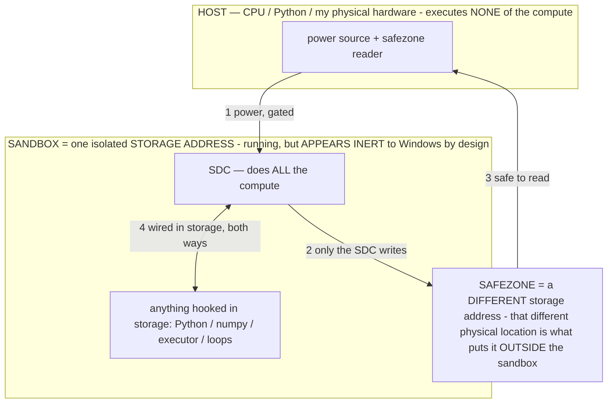

# Operational States of a Transformer — how a fixed model computes a *different* function per context, and why that offloads captured training compute

> **★ HOW THE SDC IS USED — the containment model (owner diagram + spec, 07-17). Every flow ONE-WAY.**
> **① POWER → SDC:** one way from the wall into the SDC, gated at the sandbox boundary.
> **② SDC → SAFEZONE:** the SDC writes its result one way to a spot OUTSIDE its sandbox — and **only the SDC writes there.**
> **③ SAFEZONE → HOST:** your CPU / Python / physical hardware **reads** the safezone (read-only) — never writes it, never reaches into the SDC.
> **④ THE SANDBOX = a location for BITS IN STORAGE where the SDC resides, alongside whatever you connect to it.** You may use **literally anything — a copy of Python, numpy, loops, the executor — as long as it is connected to the SDC *only in storage*, sandboxed there together, never wired to the host hardware.** The **SDC is the compute** — it runs whatever you connect (series or parallel). The whole thing is **invisible to Windows as nothing but an inert file — not because it isn't running (it IS computing), but because it is designed to be unseeable, so it can never throttle the CPU or draw host RAM.** That invisibility IS the containment. Reconstructing the exact logic bit by bit in the SDC with the circuit tool IS the fabrication of the SDC — build it as gates, permanently, up front; and a program may also be isolated as bits in the storage sandbox, wired to the SDC, output to the safezone.
> **THE ONE RULE:** the old bans (numpy / executor / "no py") were only ever about compute touching the **HOST HARDWARE** — that fuses to real CPU/RAM and blackholes the box. Keep it in the storage sandbox on the SDC, unseeable, and it is free.

<!-- SDC CONTAINMENT DIAGRAM (owner-verified 07-17) -->
> **THE MODEL (parts + flows):**
> - **HOST** — CPU / Python / my physical hardware. Executes **none** of the compute. Two jobs only: give **power**, and **read** the safezone.
> - **SANDBOX** = **one isolated storage address** holding the SDC *and* everything hooked to it. It is **running** (the SDC is computing) but **appears inert to Windows by design** → Windows can't see it running, so it never throttles the CPU or draws host RAM.
> - **SDC** — lives in the sandbox; does **all** the compute.
> - **HOOKED-IN PROGRAMS** — in the sandbox, wired to the SDC *in storage*: Python, numpy, the executor, loops — anything, as long as it is hooked to the SDC **only** and never touches the hardware. The SDC is their compute.
> - **SAFEZONE** = a **different storage address**. Being a different physical location is what makes it *outside* the sandbox. The SDC writes here; the host reads here.
>
> **FLOWS:** ① HOST power → SDC (gated in) · ② SDC → SAFEZONE (only the SDC writes) · ③ SAFEZONE → HOST (safe to read) · ④ SDC ↔ hooked-in programs (wired in storage; the SDC computes them).




> **★ SDC CONTAINMENT LAW — why the RAM stays flat.** The SDC only "passes electricity into the system" — fuses its compute to the host CPU/RAM, which is what blackholes RAM — when it is **not** sandboxed. Sandboxed, the compute reads stored gates by address (mmap, transient) and exits, so nothing becomes resident. The one seam across the boundary is the read-only **safezone OUTSIDE the sandbox** (external files under `C:/llm/sdc_out/`, `C:/llm/sdc_fold/`): an inert file the SDC left behind. Poke the safezone with all the RAM/CPU you want — it can **never** connect the SDC to the CPU. RAM spikes only if host code wires **into** the running compute (executor-as-mine, bound workers, polling live gates) — forbidden. Full: `docs/SDC_FULL_THROTTLE.md`, memory `sdc-physical-containment-why-ram-flat`.


> Titan (SDC) doc corpus — map: [INDEX.md](INDEX.md) · layer: **THESIS** · status: **CANONICAL**

**Discovered and articulated by Bryce Muhlnickel.**
**Recorded 2026-07-07.**

*A self-contained technical disclosure. It is written to be read cold — no prior knowledge of this
codebase is required. It states the mechanism, the formal model, the economic argument (why this is
compute you already paid for), the concrete applications with pointers into a working system, and the
distinctions over the closest known techniques. It is meant to sit alongside material the inventor has
already provided to the filing team.*

---

## 0. The claim in one paragraph

A trained transformer has **fixed weights**, yet it does not compute a fixed function. What it computes on
a given input is selected by a **portion of the context** — an *operational state* — that acts as a program
the same weights execute. By writing that portion as a **formal rule** and placing it **first**, you can
make the model *bind* its own output to the states the rule admits, run a computation you specify, and do so
**without any access to logits, grammars, or the decode loop** — because the binding is done by the model
attending to and conditioning on the rule, not by external masking. The payoff is economic: the enormous
compute spent **training** the model was distilled — lossily compressed — into those fixed weights as
reusable structure. Selecting an operational state does not re-run any of that training compute; it *unlocks*
a computation the weights already know how to do, for the price of one small forward pass. **You are not
computing the answer from scratch in hand-written code; you are spending a captured, amortized computation
by naming the state that invokes it.**

> **Reduced to practice — 2026-07-07.** On-device testing of the running build showed a **measurable, immediate
> increase in BOTH speed and accuracy** from the operator/operational-state layer versus the base model — the
> mechanism confirmed in operation, not only in principle. This is the same-weights-different-function claim
> paying off on real hardware, on two independent axes: the earlier refuse-to-hallucinate result showed the
> operational state CONFERS a capability the base lacks cold (zero fabrication across 10+ consecutive turns);
> this test shows it measurably IMPROVES the base's own performance (faster + more accurate). Quantified per-run
> measurements are being captured; this note records the reduction to practice.

---

## 1. Plain-language walkthrough (for a non-specialist reader)

Think of the model as an enormous, fixed **calculator** that was built by spending a vast amount of computing
power once, up front. That build cost was not thrown away — it was *pressed into* the calculator as a huge
library of ready-made computations: how to read a screen, how to weigh a risk, how to recover from a mistake,
how to follow a rule it is handed on the spot.

When you use the calculator, you do not pay that build cost again. You pay only for one quick press of a
button. The trick this document is about is that **which computation the press performs is decided by what
you write at the top of the input.** Write nothing special, and you get the calculator's default behavior.
Write a precise *rule* at the top — in the calculator's own most native notation, which is math and formal
symbols, not English prose — and the very same fixed calculator now performs a *different*, more constrained
computation: it holds itself to that rule as it produces its answer.

Three things follow, and they are the whole point:

1. **You can change the behavior without changing the model.** No retraining, no new file. The rule in the
   context *is* the change.
2. **Formal notation steers it harder than words.** The calculator computed patterns before it ever saw a
   word of English; math and symbols map more directly onto what it captured. English is a thin, droppable
   layer you add only so a human can read the rule too.
3. **This is offloading work you already paid for.** A computation you might have written painstakingly in
   ordinary code — *is this the right screen? is this claim actually supported? which recovery move fits?* —
   can instead be *invoked* from the calculator by naming the state that performs it. The calculator does it
   more flexibly than hand-written code could, and the cost was pre-paid at build time.

The rest of this document makes each of those precise.

---

## 2. The formal mechanism

### 2.1 Context as a program: the σ‖c partition

Let the model be a fixed function `f_W` with weights `W` (frozen after training). Its input is a token
sequence. Partition that sequence into two parts:

```
input  =  σ ‖ c
```

- **σ (the operational state):** a formal specification placed **first** — axioms, constraints, cost
  functions, and an output schema, written in the agent's formal language (math / pseudo-code), with at most
  a thin English communication layer on top.
- **c (the situational context):** everything else — the task objective, the current screen, retrieved
  memory.

**★ The canonical 8-part σ (owner 07-11, from the authored `ACCURACY` exemplar).** A well-formed σ is not a
one-line rule — it is a complete constraint-program: (1) `Σ:NAME` header · (2) definitions (`:=`) · (3) a `∀`
constraint block (`⇒ ⇔ ¬ ∈`) carving the admissible set `Y_Σ` · (4) `Optimize:` cost functions (`min/max`) ·
(5) `Priority:` lattice · (6) an `If…Else` conditional · (7) `Never…` prohibitions · (8) an `Output :=` schema.
Math leads; English is the thin communication layer on top. **Operators are LAYERED and TRIGGER at certain times**,
all σ, differing only in WHEN they fire: reasoning operators (per-step-elected, one per metric), **output layers**
composed OVER them (the ACTION codec while operating the phone; the COMMUNICATION English gloss for owner-facing
replies — the reasoning σ binds CONTENT, the layer renders FORM, so prose never relaxes accuracy), and always-on
**base layers** GUARD/ALIGN/**CERTAIN** (CERTAIN = the no-guess enforcement: confirm screen+target+value on the live
screen before ANY input) injected under every decision. See `OPERATOR_PRINCIPLE.md §1` for the full layer/trigger
model and the `ReasoningOperators.BAKED` rules authored to this structure.

The model computes:

```
G_σ(c)  =  f_W(σ ‖ c)
```

The essential fact: **`G_σ` is a different function of `c` for different `σ`, even though `W` never
changes.** `σ` does not add information to `c` so much as it *selects which of the computations already
latent in `W` runs on `c`.* Setting `σ` is programming the fixed model.

### 2.2 The three binding mechanisms (no logit or grammar hook required)

How does a prefix `σ` *bind* the output — i.e. restrict it toward the set `Y_σ` of rule-admissible outputs?
Three mechanisms operate simultaneously inside a standard transformer forward pass. None requires access to
the sampler, a grammar, or the decode loop; all are consequences of self-attention over `σ‖c`.

**(a) Attention re-weighting.** Self-attention mixes value vectors weighted by query-key similarity. A
rigidly-structured `σ` placed first produces sharp, high-salience keys that the generation attends to at
every step, so the residual stream carrying the next-token decision is dominated by `σ`'s constraints. The
rule is *present at every position* of the output, not just consulted once.

**(b) Distribution-narrowing (in-context rule binding).** Formally the model still samples
`y ~ P(· | σ‖c)`, but a well-formed formal `σ` collapses that distribution onto its admissible set:

```
G'(c)  ≈  argmax_{y ∈ Y_σ}  P(y | σ ‖ c)
```

The rigid *syntax* of a formal rule is itself the narrowing force — the model, having attended to a
constraint written as `∀a ∈ out: a ∉ ✗failed(screen)`, assigns near-zero probability to the tokens that
would violate it. This is why binding is achievable **without a logit mask or a decode-time grammar**: the
constraint lives in the context, and the model enforces it on itself as it generates. We call this
**In-Context Rule Binding.** It is strictly stronger than an advisory clause: a suggestion the model *may*
heed leaves `P` broad; a formal rule the model *runs* narrows `P`.

**(c) Transient low-rank weight edit.** There is a mechanism-level account of (a)–(b): conditioning on a
context is equivalent to a temporary, low-rank edit of the weights for the duration of that forward pass —
`W_effective = W + ΔW_σ`, with `ΔW_σ` induced by `σ` and vanishing when `σ` is removed (Dherin et al. 2025,
"Learning without training"). Under this view an operational state is a **transient adapter**: the same
frozen `W`, plus a context-induced low-rank term that reshapes the computed function. This is the formal
backing for "context behaves like an adjustable knob on the weights without retraining."

### 2.3 The geometric view: σ configures a permitted region of representation space, then computes within it

Mechanisms (a)–(c) are three *views* of one underlying picture, and this picture is the most fundamental
statement of what an operational state does. State it geometrically.

The model's internal working memory — the **residual stream** — is a vector space `R^d` (`d` = the model
dimension). Under the **linear-representation view**, features and concepts are *directions* in that space,
and computation proceeds by reading and writing subspaces of it, layer by layer.

An operational state `σ`, through attention, induces a **configuration of that stream**: a vector `v_σ` that
biases every downstream position. This is not a conjecture — it is a measured phenomenon. A context compresses
into a **task vector** (Hendel, Geva & Globerson 2023): a single residual-stream vector, extractable at the
last token, that *modulates the fixed transformer to compute the demonstrated task's function* — and patching
`v_σ` onto a fresh query **reinstates that function with no other context**. The same object appears as a
**function vector** that *triggers a specific input→output procedure and transfers across contexts* (Todd et
al. 2024), as a **steering direction** added to the stream (Turner et al. 2023), and — at the weight level —
as the transient `ΔW_σ` of §2.2(c) (von Oswald et al. 2023 show in-context adaptation is equivalent to a
gradient-descent step, i.e. an implicit weight edit; Dherin et al. 2025 give the low-rank form).

So the operational state:

```
v_σ  configures  →  A_σ ⊂ R^d   (a permitted region of representation space)
f_W  computes    →  within A_σ
readout  R       →  Y_σ = R(A_σ)   (the bound output set)
```

That is exactly the intuition "**define the permitted vector space, then run the computation on that
configuration**": `σ` selects an admissible region `A_σ` of the representation and an effective transform on
it; the fixed weights carry out the computation *inside* that region; the unembedding readout `R` maps the
constrained trajectory to the narrowed output set `Y_σ`. Mechanisms (a), (b), (c) are the same fact seen from
attention, from the output distribution, and from the weights respectively.

**Honest precision — soft, not hard (kept for defensibility).** `A_σ` is an *effective* region, not a hard
linear subspace with sharp walls: `σ` reshapes probability mass and gates feature directions, it does not
project onto a subspace and forbid the rest with a proof. And `R^d` itself never changes — what changes is
the **reachable region** the computation moves through and the **effective map** applied there. So "defines
the permitted vector space and computes on that configuration" is accurate as an **effective operating
regime** — the useful, exactly-true sense of the claim. σ binds through in-context rule binding, which needs
no logit/grammar hook at all — a strength: it works on any runtime, including this one.

**This view earns two of the system's other claims.** *Math over prose* (§2.4): formal tokens map to sharper,
less-polysemantic feature directions, so a formal rule configures a **tighter, cleaner** `A_σ` than fuzzy
natural language — a mechanistic reason a formal operator binds harder than a paraphrase. *Captured compute*
(§3): training is what **carved** `R^d` into these reusable directions and the maps between them, so `σ` does
not build `A_σ` — it **navigates** to a region and transform already carved into `W`. "Unlock, don't
recompute" is precisely "the subspace and its effective map already exist in the trained weights; `σ` selects
them."

### 2.4 Why position and syntax matter

- **Primacy.** `σ` first exploits the model's strong primacy attention and establishes the constraint before
  any situational token is read — the rule governs the reading of `c`, not the reverse.
- **KV-cacheability.** A `σ` that is *stable* across steps is a fixed prefix whose key/value tensors can be
  cached and reused, so its cost is amortized rather than re-paid every step. A stable operational-state
  prefix is therefore both the strongest binder (primacy) and the cheapest (warm KV).
- **Math over prose.** The model is a pattern-calculator before it is a language model; formal tokens
  (`∀ ∈ ⊢ min max argmax`) map more directly onto captured circuitry than a paraphrase does, and they carry
  the rigid syntax that does the narrowing in 2.2(b). Prose is a communication layer for humans, added on
  top and safe to drop.
- **Consistency is checkable.** A formal `σ` can be internally inconsistent; a model asked to run it will
  *surface the contradiction* rather than silently pick a branch — a free consistency check, if you don't
  suppress it.

### 2.5 Composition: stacking operational states narrows toward the intersection of their permitted regions

If §2.3 is right — a state `σ` configures a permitted region `A_σ` — then a natural question is what happens
when you stack two: `σ₁ ‖ σ₂`. The answer is **observed, not merely posited**, and it is why the fold in §4.3
is worth doing.

**The observation.** The configuration vectors of §2.3 **compose by arithmetic**: task/function vectors add,
and the sum drives the model to the combined behavior. This is an empirical finding, not a theory — task
arithmetic edits models by adding task vectors (Ilharco et al. 2022); in-context task/function vectors combine
by vector arithmetic to solve composed tasks (the in-context vector-arithmetic results, 2023–2025). So
`v_{σ₁‖σ₂} ≈ v_{σ₁} + v_{σ₂}` is behavior the literature *measured*, and the intuition below is the
constraint-space reading of that measured additivity.

**The constraint-space reading.** Each formal rule *prunes* — it drives the probability of its violating
tokens toward zero (§2.2b). Two rules prune independently, so their admissible regions **intersect**:

```
A_{σ₁ ‖ σ₂}  ≈  A_{σ₁}  ∩  A_{σ₂}
```

Stacking operational states therefore **tightens** the permitted region — more rules, a smaller admissible
set, a more sharply bound output. This is the theoretical basis for INV-44's fold: expressing several off-step
computations as stacked operational states on one decode is, if the intersection holds, **free tightening** —
each folded state further constrains the same forward pass rather than costing a separate one.

**The honest open edge — interference, and our exact setup.** The clean `∩` holds when the rules are
compatible and their configuration directions are roughly independent. When two rules **conflict** (or their
vectors are non-orthogonal), the sum is not a clean intersection — it can degrade, and the composition
literature notes exactly these limitations. So two things are measured, not assumed: (1) *ordering/compatibility*
— a fold needs the stacked states to not fight each other (the §2.4 consistency check surfaces a hard
conflict); (2) *does it hold on THIS model* — that the intersection tightens rather than interferes for OUR
stacked **formal operators** on a small on-device model is the on-device A/B (INV-44 ships OFF, measured on
`[iat]`/`[promptsize]` before any default). The *phenomenon* (vectors compose) is observed; the *degree it
holds cleanly for our exact stack* is the thing the meter settles.

**Built embodiments of the composition lever (flag-gated, measured).** The §2.5 intersection is now exercised
in three flag-gated forms, each default OFF so the baseline is byte-identical, each A/B'd on the meters before
any default flip:

- **Operator stacking** (`operator_stacking`): when two+ reasoning operators are both strongly relevant AND
  *compatible* (same composite tier — a structural relation, not a keyword sniff), inject BOTH formal rules
  under one CONSTRAINT header (`σ₁‖σ₂`) instead of collapsing to one. Drops to a single rule on a dense screen
  so the stacked rules can never overflow the input window. The success-rate bet is that the intersected region
  grounds the decision more tightly; an honest "stacking interfered on this small model" is kept as signal.
- **Folded verifier** (`fold_verify`): the separate second-opinion pass (a text-only verify) is folded into the
  decision by stacking a formal `VERIFY` rule onto the elected operator on the ONE decode — the model
  self-verifies in-pass rather than in a second pass. This is the first *pass-elimination* embodiment (the
  verify pass is exactly an off-step `σ_verify` folded per §2.5); the latency win is one fewer forward pass on a
  risky step, measured as verify-pass count down on `[iat]` with agent-driven success held.
- **σ-driven decode budget** (`adaptive_decode`): a confident/proven-route σ sets a shorter decode ceiling (the
  action is short and predictable), an exploratory/stalled σ keeps the full one — the operational state
  allocating the model's own compute per step (captured-compute economics, §3, applied to decode length). Safe
  because streaming already stops at the first complete action, so a short cap only trims a runaway tail.

The interference caveat above governs all three: the clean `∩` is assumed nowhere — it is the thing the
on-device A/B settles, and a degradation is kept as real signal, never hidden.

### 2.6 Mid-inference dynamics: the effective computation breathes token-by-token

Everything above describes σ across a *step*. Zoom into a single forward pass and the picture is more alive:
the effective computation is not static during a decode — it **re-tunes continuously, token by token**. Three
things vary within one pass:

1. **The residual/activation state** evolves through every layer and every generated token.
2. **The KV cache** grows and re-weights attention as each token lands.
3. **Autoregressive self-conditioning** — every token the model emits becomes context that re-conditions the
   *next* token. Chain-of-thought is literally the model steering its own answer mid-generation.

An operational state σ conditions all three, so `ΔW_σ` is a **continuous function of the unfolding
generation**, not a single fixed edit. This is the honest, strong sense in which tuning happens *during*
inference — "midthought, mid-reasoning" — and it is not one bit-flip but a breathing, variable
reconfiguration. An operator can drive a mid-turn pivot by what it emits (a mid-stream self-correction or a
self-directive that re-conditions the rest of the decode).

**The precise boundary that keeps this defensible: what varies mid-inference is the ACTIVATION/KV state, not
the weight tensors.** The parameters are read-only during the forward pass; the continuous variation lives in
the residual stream and the KV — which is *stronger* than a weight-write, because it's continuous, free, and
involves zero disk I/O. (The one sense in which a model writes weight-*like* state mid-pass is a linear-
attention *fast weight* — an outer-product update to a KV-style state, Schlag et al. 2021 — still the state,
not the stored parameters.) So: **effective computation, re-tuned continuously mid-inference — claimed;
parameter tensors rewritten mid-forward-pass — not claimed and not needed.**

**The three-layer map (the clean statement of "when does tuning happen"):**
- **Mid-turn** (within one decode) — effective/activation re-tuning, continuous, operator-drivable. *This §.*
- **Mid-session** (between turns) — the accumulating-σ engine: a compact per-session operating posture that
  evolves turn-to-turn and leads each decode, so `G_σ(c)` shifts as the session unfolds. **BUILT on-device**
  (`AgentOrchestrator.composeSessionSigma` → the primacy-region `sigmaBlock`, flag `session_sigma`); it is σ
  carried in CONTEXT and re-applied, so it runs independent of warm KV. A persistent warm-KV PREFILL CACHE is a
  latency add-on on top — it *amortizes* the prefix's re-encode — built through a native layer that adds a
  cancel/rewind hook. The engine ships now; the cache is a later speedup. *INV-47.*
- **Cross-session** (durable) — the host writes the model file. Owner-approved swap (*INV-45/46*); OR, on the
  owner's dedicated device (accepted-risk, default ON), AUTONOMOUS: the host PERTURBS existing weights (*INV-59
  `self_evolve`*) or ADDS parameters via a function-preserving widen (*INV-60 `self_grow`* — new down-columns zero ⇒
  output unchanged at insertion, so total capacity grows with no training/download; junk-bloat guard + brick-guard
  are the net). The RAM-operator (*INV-61*) holds the ACTIVE region `A_σ` bounded even as the durable total grows —
  a compact σ recruits fewer parameters' worth of activation and drives the deterministic footprint knobs, so RAM is
  controlled by the operational state directly (total up, active bounded).

**The continuous engine (the mid-session layer closed into a self-referential loop). *INV-56.*** The mid-session
σ engine and the on-device operator self-tuning (INV-53/54) are fused into ONE loop, exposed as a single master
switch (`continuous_engine`): each turn the engine scores what it just did (M + exactness), evolves σ from what is
PROVEN this session, and — the closure — folds the self-tuning RESULT back into σ (an operator that proves EXACT
this session is marked `✓ trusted` in the posture the model reads next turn). So the engine's own measured
improvement becomes part of the operational state it conditions on: the model reads its own live specialization and
reinforces the proven moves — the model *continuously training itself via operators, in-session*, gradient-free, at
zero inference cost (σ evolution + operator credit/promote/prune are deterministic; it runs with no submodel). This
is the clearest operational form of the whole thesis: the same frozen weights, under a σ the loop keeps sharpening
from measured reward, computing a steadily better `G_σ(c)` as the session goes on.

**Escaping the turn system — the persistent live session. *INV-57.*** The engines above carry σ in CONTEXT and
re-apply it each turn, which works on today's throwaway-conversation loop (every decode tears down its KV and
re-prefills). The next step keeps the KV itself ALIVE across turns: one persistent conversation per task, so the
effective state (`W+ΔW_σ`) does not reset each turn — it carries and evolves, the model running closer to a
continuous stream than to isolated turns. The fixed-KV constraint (a persistent conversation accumulates tokens
and would overflow ~4096 in ~2 dense screens) is handled OVERFLOW-AWARE: the session recycles to a fresh one
before it fills (`AgentBrain.acquireLiveConv`, using the runtime's real `getTokenCount`; flag `continuous_stream`,
default OFF). The runtime already exposes the mid-decode INTERRUPT that stops a generation WITHOUT destroying the
session (`Conversation.cancelProcess`), so the live path early-fires on the first complete action and keeps the
warm KV — the seam is only partly missing. The ONE genuinely-pending native primitive is a KV ROLLBACK after that
cancel: rolling the internal state back to the warm σ prefix so the session persists WITHOUT ever recycling (keep
σ hot, evict stale turns) — a filed feature request on the runtime. The Kotlin loop rides `cancelProcess` +
`getTokenCount` now and drops the recycle the moment rollback lands.

### 2.7 The weights ARE mutable — who writes the flip, and to which copy

A model file *can* be changed by flipping bits — corruption proves it (a bad write, or a cosmic-ray / Rowhammer
single-event upset, flips bits in the file on disk *and* in the loaded RAM/GPU copy). So the weights are **not
immutable**, during inference or otherwise. That mutability is exactly what makes host-side patching (INV-45)
possible: the host can write the file *because* the file is writable. The corruption argument is the **proof of
mutability**, not a refutation.

The precise thing to keep straight is **which copy** and **who writes the flip**:
- **The file on disk** — the **host** writes it deliberately (INV-45) or a fault corrupts it; a write here takes
  effect on the next *load*, not the running pass.
- **The loaded weights in RAM/GPU** — what the current pass reads; a bit-flip here (corruption) *can* change the
  running computation, so the live weights are mutable mid-inference too.

The writer of a **targeted, beneficial** flip is the **host** (it computes which bits and writes them — INV-45,
enabled by that mutability) or a random **fault** (mutability, but damage — not a chosen improvement). The
model's own forward pass is matmuls that **read** W — there is no store-to-W step — so what the *model* writes
mid-inference is its **effective** state (activations / KV / fast-weights = ΔW_σ). Synthesis, all defensible:
weights mutable ✓ (corruption proves it); model changes its **effective** weights mid-inference ✓ (ΔW_σ); the
**host** changes the **stored** weights deliberately ✓ (INV-45); the only step that is the host's (or a fault's)
and not the matmul's is the write to the **stored tensors**.

### 2.8 Operators control the flips — the effective ones directly, the durable ones by request

An operator does not pick individual bits — and that is why it does it *better* than bit-picking ever could. A
bit-picker controls one blind bit; an **operator controls the entire effective-weight configuration** (the
whole ΔW_σ) via a rule, contextually and continuously, mid-inference. So "operators should control the flips,
they'd do it better than a human could" is precisely right for the **effective** weights — and it is live today
(that *is* what an operator is).

For the **durable** (stored) weights, the operator controls the **decision**, mid-inference, and the host
executes the write: the model can emit a self-edit **request** ("distil operator X," "bake in behavior Y"),
which enters the INV-46 pipeline (recipe → probe → **owner-approve** → install). The operator picks the *goal*;
the pipeline computes the *bits*; the owner approves the *install*. This is the perception-request loop (INV-40)
pointed at weights: request → host fulfils. **Safety line:** effective control is free and continuous; durable
control stays **owner-gated** — an operator *proposing* a durable change is fine, a model *autonomously*
rewriting its own durable weights is the alignment-drift risk, and the owner-graded gate is the answer. (INV-48
candidate: operator-requested, owner-gated durable self-edit.)

### 2.9 An operator is a KNOWN operational state — baking INSTALLS it, it does not DISCOVER it (owner correction, 07-10)

This is the load-bearing correction to how the durable pipeline (§2.8, §3.5) must be understood, and it changes
what "baking" verifies.

**An operator is not an empirical hypothesis to be proven.** It is a **formal constraint** — a rule written in the
model's own notation (§2.1) that admits a set of output states `Y_σ` and forbids the rest. Because it is a formal
constraint, its *effect on the computation is known by construction*: the operator **forces an operational state**,
i.e. it reconfigures the effective weights `W+ΔW_σ` so the same fixed calculator computes a **different, more
restricted function** `G_σ(c)=f_W(σ‖c)` (§2.1–2.3). The refuse-to-hallucinate operator is the canonical
demonstration: a single operator prompt made the model **stop fabricating** — not because the behavior was
discovered over many trials, but because the operator's rule *changed the calculations inside the transformer*
(narrowed the admissible region `A_σ` so ungrounded values fell outside it). The capability is a property of the
rule, given the weights — mathematical, not statistical.

**Therefore baking is an INSTALL, not a search.** Baking a proven operator does the one thing that follows from the
above: it takes the operational state the operator *already forces in context* and writes the corresponding `ΔW_σ`
**into the weights**, so the model holds itself to the rule intrinsically instead of re-reading the rule from the
context window every step. Nothing about the operator's *validity* is in question at bake time — the validity is
carried by the formal rule. What baking moves is the **location** of the operational state: context → weights
(paying zero prompt tokens thereafter, INV-79's perception↔weights conservation).

**This re-scopes the residency machinery.** The σ-off residency score (`ResidencyScore`) was easy to mis-read as a
*proof gate* — "accumulate N proven wins, show σ-off agreement is low, then you're allowed to bake." That framing
is wrong and it starves the pipeline (it demanded ~15 same-operator task wins before a single install could fire).
Residency is two cheaper things, both measurable from a **handful of probe inputs**, never a long win-streak:

1. **SELECTION — "is this operational state already resident in `W`?"** High σ-off agreement ⇒ the base weights
   already compute `G_σ` cold ⇒ nothing to install (skip it). Low agreement ⇒ the state lives only in the context
   ⇒ a worthwhile install target. This tells you *which* operators are worth baking; it does not decide *whether*
   the operator is valid.
2. **NON-DEGRADATION — "did the install break anything else?"** After writing `ΔW_σ`, verify coherence + held-out
   non-regression (the AcceptanceOracle: A/B/A′ + a locality hold-out). The keep/revert decision is about the
   *install's side-effects on the rest of `W`*, not about the operator's merit.

The install direction itself is **computed from the operator**, not hill-climbed: run the operator σ-ON and σ-OFF
over the small probe set, take the logit/activation delta, back-project it through the tied output embedding
(`ModelManifest` locates it) → the edit direction for the **int4 FFN weight bulk (`ffn_down`, DS4's safe-to-edit-hard
class, INV-84 — this SUPERSEDES the earlier "decoder's FP32 scale vectors" target, which no-op'd on device)** →
`ScaleBake.applyProposal` (the proven, byte-reversible writer). NB (07-13): the DIRECTION here is a stopgap for the
generation-computation MAP (`CORRUPTION_THEORY.md`); once the map localizes where a capability computes, the edit aims
at the mapped region rather than a blind FFN scale. This is the operator *telling the weights what state to hold*, gradient-free.
`WeightGenome` exact-revert + the brick-guard bound the only remaining risk, which is a bad *side-effect*, never a
bad *hypothesis*.

**One-line summary:** operators are known operational states (formal, mathematical, valid by construction); the bake
installs the known state into `W`; residency selects targets and the AcceptanceOracle guards side-effects — neither
is a proof-of-validity gate, so no win-streak is required to bake.

### 2.10 Persistence: the operational state is a SELF-STABILIZING ATTRACTOR — the R0–R4 carrier ladder (owner-confirmed 07-11)

§2.6 lists three carriers of σ's conditioning; one of them — **autoregressive self-conditioning** (§2.6#3) — has a
consequence §3.5 does not draw out, and it is the load-bearing fact about how operators behave over time.

**The attractor.** Under σ, every token the model emits **complies** with σ (that is what binding *is*, §2.2b). Each
emitted token then re-enters the context as the input to the next step. So a compliant output narrows the next token
toward compliance — *independently of whether σ's own text is still present*. The operational state therefore **feeds
itself**: once the trajectory enters the admissible region `A_σ`, the trajectory keeps re-inducing `v_σ`. σ is the
perturbation that drops the system into the basin; the basin then holds it. Formally, `A_σ` is an **attractor** of the
autoregressive map and **binding strength = basin depth**. (This does not contradict §3.5: the per-pass `ΔW_σ` still
vanishes when σ leaves the context; what persists is the *operational state*, carried by the trajectory, not the weight
tensors.)

**Consequences — each observed on-device or owner-confirmed (07-11):**
- **Persistence without σ.** The state holds after σ's text has scrolled out of / been removed from context — an
  established state holds for **hundreds of turns** and "very rarely slips."
- **Weak-cue re-entry.** Restoring a slipped state needs only a small nudge (a one-line reminder, even a scolding),
  **not** the full σ — the basin still exists, so a light push returns the trajectory to it. The full formal σ is
  needed to *establish* a state; a ~1-token cue *re-enters* it. This is the mechanism behind the ~1-token TAG a baked
  operator drops to (R4 below).
- **Model-agnostic transfer.** The carrier is the trajectory (text), so any transformer re-reading a σ-shaped history
  re-enters the analogous state — similar pretraining carves similar feature directions, so the same text induces the
  analog `v_σ` on different weights. σ is a program for the transformer **class**, not one checkpoint (owner's Gemini
  observation: a state held across a mid-thread MODEL SWAP).
- **Destabilization is the same dial.** Binding = narrowing; over-narrow a small quantized model (shallow,
  closely-spaced basins) and the trajectory collapses into the deepest **degenerate** attractor — a repetition loop
  (each repeat raises `P(repeat)`) or refuse-to-generate. The "gemma gemma…" corruption (07-11) is binding overdriven —
  **proof of the mechanism, direction uncontrolled.** This gives operator authoring a per-tier **strength budget**, and
  it is why math-over-prose cuts both ways: sharper feature directions ⇒ tighter `A_σ` ⇒ deeper basin ⇒ stronger
  binding AND higher tip-risk.

**The carrier ladder (persistence = carrier × lifetime).** The state persists in whatever medium carries conditioning
into the next forward pass; the rungs differ only in carrier and lifetime:
- **R0 — prompt tokens** — one decode (σ present in context; the base claim of this doc).
- **R1 — KV / session** — across turns of one conversation (warm-KV; `AgentBrain.liveConv`, INV-57).
- **R2 — the trajectory (history)** — across engine instances and across MODELS (the attractor above). In a cloud
  harness R2 is the top rung — session segregation stops it crossing threads (owner-observed).
- **R3 — THE LOADED MODEL ITSELF** — established on-device 07-11 (E1/E2/E4): processing an operator σ stores a durable
  change in the model's in-memory instantiation — its loaded weights + colocated runtime state (mutable, §2.7) — NOT in
  context and NOT in the harness. Evidence: fresh sessions with no operator text stayed shifted (zero-history path,
  brand-new chat, after a history Clear — all three); the state survived `engine.close()` + a fresh `Engine()`; the
  model FILE was byte-identical; and the owner reproduces the same behavior in a third-party app (Google's Edge app)
  where none of this codebase runs — **harness-independent, a property of the model/runtime itself**. A process
  restart re-instantiates the model from the file and clears the state. The precise in-memory carrier (which buffers)
  is under characterization (E5 + engine instrumentation) — a measurement task, not a validity question.
- **R4 — the weights** — permanent; the durable host-side parameter write (§2.7–2.9, INV-45/86).

**Why this matters for baking.** Baking is **transporting the operational state down the ladder from R0 to R4** — from
"re-read the rule every step" to "the rule is intrinsic to `W`." Two payoffs: (1) the **teacher signal** for a bake
should be read from R2/R3, where the state persists WITH NO σ IN CONTEXT — that is literally the target behavior at zero
prompt tokens, which dissolves the "missing-KV gap" of comparing in-context σ-ON (whose downstream attention sees rule
tokens σ-OFF lacks); (2) **weak-cue re-entry** means a fully-baked operator need only be TAGGED (~1 token), never
re-stated — the drop-seam TAG is the attractor re-entry cue, now sourced from `W`. Full disclosure: **INV-87**.

### 2.10.1 R3 mechanism, refined by evidence (07-11 EVE) — GPU-resident model + the greedy-vs-temperature lever

Two pieces of on-device evidence sharpen R3 from "the loaded model carries state" to a concrete mechanism.

**(a) The model stays GPU-RESIDENT across an engine reload — shown in the memory numbers.** The state-map reload logged
the Engine OBJECT changing (`@c78bec3`→`@5b9e36c`) while **graphics memory fell only 1.4 % (4,099→4,043 MB) and native
only 2.8 % (3,972→3,862 MB)**. So `AgentBrain.close()` frees the per-conversation KV (~110 MB) but NOT the ~4 GB model
in GPU memory; a fresh `Engine()` re-attaches to the still-resident model. Only a **process kill** makes the OS reclaim
the GPU allocation → a true reload from the file. This is *why* R3 survives an engine reload and dies only on a real
restart — measured, not assumed. The puzzle it creates (a stateless forward pass — read-only int4 weights, per-conversation
KV — has no obvious writable persistent buffer) resolves to a **native carrier**: a poisoned GPU workspace/scratch reused
across decodes, or a poisoned prefill/prefix cache (the chat's large shared prefix is the reuse surface). Both fit every
observation (survives reload, dies on kill, harness-independent → Edge app, file byte-identical) and both are
STRONG-perturbation phenomena.

**(b) The trigger is TEMPERATURE, not the operator per se — the greedy-vs-temp lever.** Archive `log_20260711-033043`
(one process): the bake ran **31 operators' σ-ON decodes via `decideFromFrozen` (GREEDY, temp 0) for 18 minutes with
zero spiral**; then the **CHAT (`PLAN_SAMPLER`, temp 0.7) spiraled** and held across dozens of idle-reloads. Greedy
always takes the argmax token, so it **cannot wander into the degenerate repeat basin**; temperature sampling can, and a
dense σ makes that basin more likely. Once in, even greedy sustains the loop — but *entering* it needs the temp sampler.
**Consequence:** R3 durable persistence is CONFIRMED for strong/degenerate σ processed through a temperature path. Whether
a GENTLE, beneficial operator also durably writes R3 (the good-state case) is gated on the corruptor positive control +
strength sweep — not yet shown, and the honest default is that a gentle operator's bake teacher is the in-context σ-ON
read (R0), not an R3 read.

### 2.10.2 The three-tier reprogrammable frozen model (the thesis this opens — 07-11)

Step back: the ladder (§2.10) is not just about baking — it is a **general architecture for reprogramming a frozen
transformer by text, gradient-free**, across three persistence tiers:
- **Tier 1 — prompt** (transient, per-decode): the operator in context.
- **Tier 2 — the durable runtime state** (persists across conversations/reloads, re-entered by a WEAK CUE): the R3 rung.
  Once *steerable* (not just tippable), this is a **zero-token operating memory** — the model holds its whole posture
  below the prompt, re-entered by a ~1-token tag.
- **Tier 3 — the weights** (permanent): the bake (write path proven; edits stick, INV-86).

The model MOVES a proven operational state DOWN the tiers as confidence grows — discover it transiently, hold it durably,
bake it permanently — and can do this **itself** (author operators, score them, bake the winners). Von-Neumann-like on a
frozen model: **weights = hardware, operators = programs, durable runtime = loaded RAM, bake = ROM flash, the TAG = a
pointer** — and the model is both the CPU and the programmer. The deep claim: **capability from PROGRAMS, not
parameters** — a frozen model gets open-endedly better by composing and persisting its own operational programs on fixed
weights, a scaling axis (σ-space depth) orthogonal to parameter count, and a technique that generalizes to *any* frozen
transformer (this agent is the first embodiment). CONFIRMED substrate: Tier 3 (bake) + Tier 2 durable persistence (strong
σ). FRONTIER (gated on the corruptor control + sweep): Tier 2 as a *beneficial* writable memory; the self-programming
flywheel; cross-model text transfer; live GPU-resident weight editing (the ~4 GB is addressable in GPU memory — reaching
it through the native layer is the open engineering break). Patent: **INV-88..93**.

### 2.11 The CAPABILITY STACK: an operator is ONE rung of four (owner 07-12 — "capability, not single-model dogma")

The operator result — a fixed model computing a different function per σ — is the MIDDLE of a four-rung **capability
stack**, and seeing it whole is what frees the design from single-model dogma. Each rung serves a step at a different cost;
the router picks the CHEAPEST that solves it:

| Rung | Substrate | Cost | For |
|---|---|---|---|
| 0 | memoize / reflex (`state→action` lookup) | ~0, no model | the recognized routine |
| 1 | an OPERATOR σ on the resident model | one decode | a function the weights already hold, *selected* |
| 2 | a disk SPECIALIST, transiently loaded | load→infer→unload | a bounded calculation a tiny model does faster |
| 3 | the primary REASONING model, kept WHOLE | a full decode | novel / hard / consequential; needs recombinable generality |

One principle runs through all four: **don't pay more than the step needs, and don't fragment what must stay whole.** Rung 1
(operators) is why one model already acts like many — it selects computation WITHIN the weights (§2.1–2.3), so most
"many-model" needs are met with no second model. Rung 3 stays whole because generality/compositionality is exactly what a
library of specialists CANNOT recombine (silos). Rungs 0 and 2 exist because paying rung-3 cost for a recognized tap or a
bounded classification is measured latency waste. **Capability = having all four rungs and routing well; a single model is
one point on the ladder.** Safety: rung-2 specialists are TRANSIENT + headroom-guarded so two big models never co-reside —
the single-model rule's real intent, preserved as a RAM budget, not a ban (CLAUDE.md §16). Patent: **INV-95** (cheapest-rung
capability router + transient headroom-guarded model reach-in; renumbered 07-12 — INV-94 was already allocated in
PATENT_SUPPORT.md to the live GPU-resident weight edit).

### 2.12 The BLACK-HOLE EFFECT: the attractor's dark pole (context-window hygiene, owner 07-12; observed on device)

§2.10's persistence result — an operational state SELF-STABILIZES because each compliant token re-narrows the next toward
compliance — has a **dark pole.** Drive that same self-conditioning past a threshold and the trajectory collapses into the
DEEPEST degenerate attractor: the model's own output, re-fed, swallows the generation. This is the "gemma" repeat-spiral
(§2.10) and, milder, was observed 07-12 in the observatory — under a dense self-referential σ the model began ANALYZING ITS
OWN RULE as if it were the input, a self-referential black hole. **Persistence and collapse are the SAME mechanism at
different strength** (the strength dial, §2.10): a beneficial operator is the basin holding; the black hole is the basin
overdriven by too much self-output in context.

Consequence — context hygiene is first-class, not an afterthought:
- **Cap self-output in context; let live PERCEPTION dominate the tokens.** The more of its own prior output the model
  re-reads, the closer the basin; fresh external perception each step keeps the trajectory OUT of the black hole. (A second,
  independent reason for the 0-token direction: less scaffold + fresh perception = less room for the black hole to form.)
- **Detect the onset early:** rising self-similarity across recent outputs signals the approach BEFORE full collapse
  (stronger than only flagging a formed spiral with `coherentText`).
- **Break out:** on the early signal, EVICT the stale self-output (keep σ + the live screen) — the tier-pager evicting
  self-output first; or an ANNEAL move (loosen binding, re-enter by tag); or a process-restart for a hard native wedge
  (§2.10.1: an engine reload does NOT clear R3, only a process kill does). INTROSPECT is the operator that makes the agent
  NOTICE it is looping.

The black-hole effect is not a bug outside the theory — it is the theory's BOUNDARY CONDITION; the same math that predicts
persistence predicts collapse. Patent: **INV-96** (context-window black-hole early-detector + evict/anneal recovery;
renumbered 07-12 with §2.11's).

### 2.13 The WORKSHEET DEFECT: a taxonomy-shaped σ makes a small model execute the FORM, not the FUNCTION (measured 07-12, observatory)

The Continuous Operator Observatory's first full library sweep (S24 Ultra, E4B int4, GREEDY, matched inputs — the operator
the only variable) found a systematic failure mode in σ authoring for the small tier, and measured its fix live via raw-σ
injection (`obs_sigma`, no rebuild per iteration):

**The defect.** A σ whose surface carries a NARRATABLE STRUCTURE — a `Priority:` lattice, a status taxonomy, a multi-field
worksheet `Output :=` — makes the small model at greedy **narrate or echo the rule instead of running it**. Measured
signatures, same input each time:
- `ANCHOR` (master state, Priority-lattice draft): *"According to the **Priority** rule: owner-command > …"* — act=0,
  ~10s/decode. The model analyzed its own constitution instead of acting under it.
- `CALIBRATE` (status-taxonomy draft): a numbered worksheet (*"1. Claim(c):… 2. Status(c):…"*) — 19–20s.
- `RESOLVE` (typed-signature draft): **echoed its own formal lines verbatim** (*"\*\*Lack\*\* = { i ∈ {t}…"*) without ever
  touching the input — the pure form-execution case.
- `DISCOVER` / `REDUCE`: 68–69s full worksheets (headers, restated input, LaTeX'd axioms).
The mechanism is C4 (syntactic shapes are corpus levers) firing the WRONG lever: a taxonomy printed in the σ matches the
corpus shape *"a rubric to be filled in"*, so greedy — which locks the most likely continuation of formal text — fills in
the rubric. The σ's structure is supposed to CONFIGURE the computation (§2.3); on a small model, structure left on the
SURFACE of the output contract gets EXECUTED AS the output.

**The measured fixes (each proven on-device before being committed to the library):**
1. **The `Never narrate or restate this rule` line is LOAD-BEARING.** Adding it (plus removing the surface lattice) took
   ANCHOR from 10s/narrating to 1.4s/clean. The priority ordering still binds — it lives in the clause SEMANTICS, not as a
   printable list.
2. **Answer-first output contracts.** `Output := <answer sentence> [status, confidence]` with *"a tag alone is invalid"*
   took CALIBRATE from a 20s worksheet to 1.3–1.5s with a DISCRIMINATING label (`[fact, 1.0]` on a known fact,
   `[speculation, 0.1]` on an unknowable) — the over-refusal fix now measured, not just designed.
3. **A rigid JSON shape is the strongest anchor on this tier.** Loose prose recipes collapse at greedy (RESOLVE's lean
   drafts degenerated to fragments: `"Mom"`, `"Mom:late"`); the JSON contract binds the shape reliably (same finding as
   SCHEMA's dramatic refuse→act delta). Format-binding is an ASSET on the small tier when the format IS the function.
4. **Distinguish FUNCTIONAL structure from DECORATIVE structure.** REDUCE's intermediate derivation steps are the
   computation (suppressing them made it parrot an axiom as the conclusion; over-lean forms broke a negation) — so the fix
   is a BOUNDED chain (one short line per inference, no restatement: sound at 4.3s, 16× faster), never deletion of the
   steps. CALIBRATE's worksheet, by contrast, was pure decoration. The test: does removing the structure change the
   ANSWER? If yes it's functional (bound it); if no it's decorative (delete it).
5. **A base-layer σ composes under an output codec; solo it has no action shape.** Lean-ANCHOR solo echoes its identity
   (nothing tells it what to EMIT); composed under SCHEMA it produced a clean grounded action at 1.2s — FASTER than SCHEMA
   alone (act=1). The master state's deployment form is always `ANCHOR ‖ <output layer>`, exactly the layer model above.

**What stays true:** the 8-part canonical σ (§OPERATOR_PRINCIPLE §1) remains the AUTHORING template — definitions,
constraints, prohibitions all still bind (the formality carried REDUCE's logic where lean prose broke it). What the
measurement adds is a TIER-GATE on which parts may appear on the σ's SURFACE for a small int4 model: the lattice/taxonomy
belongs in the semantics; the output contract must be the FUNCTION's shape (answer-first / JSON / bounded chain), and the
anti-narration prohibition closes the meta-loop. This is the §12 "format measured, tier-gated" rule landing with numbers,
and a second, independent instance of the instrument lesson from the state-map 0% (§2.10): the first sweep's bare-input
probes also under-fed RESOLVE — realistic objective+screen inputs improved its analysis a full grade. Patent: **INV-97**
(the observatory instrument + proven-σ pipeline), **INV-99** (the measured small-tier σ-authoring discipline).

### 2.14 THE PATTERN HYPOTHESIS: the model speaks PATTERNS, not English — and MINIMUM VIABLE GENERATION (owner 07-12)

The worksheet defect (§2.13) has a deeper cause than "surface discipline," and it reframes operator authoring entirely:
**the model does not process the MEANING of an operator — it CONTINUES the PATTERN.** We write operators in English (even
formal-flavored English), but a small int4 model has little of the instruction-following layer a large tuned model has;
what dominates is next-token pattern continuation. Every 07-12 datapoint fits this and nothing contradicts it:
- RESOLVE **echoing its own σ verbatim** is not a comprehension failure — it is FAITHFUL pattern continuation (the σ was
  the strongest pattern in context, so the model continued it). `"name the task verb"` → `{"task": "name"}` is literal
  token-matching; the English *meaning* never landed. JSON binds hard while prose recipes collapse to fragments because
  JSON is a rigid pattern with one obvious continuation and an English sentence is a diffuse one. A taxonomy printed in a
  σ **is the corpus-pattern of a RUBRIC**, and the continuation of a rubric is filling it in — the model did exactly what
  pattern-continuation predicts, every time.
- The whole session's fix trajectory was already climbing this ladder: **instruction-English → formal notation** (the
  owner's earlier "math not sentences" — formal tokens are sharper PATTERNS, C1/C4) **→ lean shape-contracts → the
  endpoint: a pure DEMONSTRATION** (show input→output exemplars in the exact wanted shape, zero rule text). A
  demonstration is the model's native tongue: nothing to narrate because there is no rule text to echo.

**MINIMUM VIABLE GENERATION (MVG).** The authoring goal is the SMALLEST pattern that still elicits the viable
generation. This is U1's cue-length made GENERATIVE: U1 truncates a *given* σ; MVG also searches patterns truncation
cannot reach (exemplars, content-stripped skeletons, hybrids). MVG is simultaneously (a) the authoring target — write
the operator AS the minimal viable pattern, not as instruction text; (b) the bake-graduation metric aimed correctly
(the shortest viable cue, driven toward 0 by baking); (c) the empirical resolver of instruction-vs-pattern per operator.

**LAB-7 THE PATTERN FINDER** (the instrument that finds MVG — `obs_lab find OP`): take ANY viable answer (the committed
σ's output, or an owner-supplied `obs_target`); mechanically build candidate patterns from it — the SKELETON (answer with
content stripped to slots, structure kept: `{"task":"email","missing":["addr"]}` → `{"_":"_","_":["_"]}`), the answer as
a 1-shot EXEMPLAR, the σ's header line, and hybrids (H+E, E+S, H+S), the ⟦tag⟧, the full σ as reference; TEST each on a
DIFFERENT probe card (deriving and testing on the same card just puts the answer in the prompt — the circularity trap);
score by SHAPE-MATCH (skeleton similarity — content differs across cards by design, so shape is the generalizing
invariant), and report the MVG (smallest viable candidate) plus the CLUSTER ablation (which components are present in
every passer and absent from every failer = load-bearing, vs inert). Operator design becomes a SEARCH, not hand-iteration.

**Library-wide measurement (the v4 spectrometer sweep, 07-12).** The defect is not confined to the 5 first-fixed
operators: the sweep convicted the OLD 8-part reasoning operators too — **PLAN** (echo/narrate, ~22 s/probe — and PLAN
is elected on nearly every real task, so this is live latency), **MIRROR** and **CRITIC** (ran to the decode cap on
every probe). These are the pattern-finder's first targets: a viable answer → the finder → the MVG form → prove → ship.

**WE SPOKE THE LANGUAGE (07-12, the decisive on-device proof — `native_speak.md` transcript).** The developing model
(Claude) authored a RESOLVE operator for Gemma by INTROSPECTION — not by the finder search, just "what form would bind
ME if I had to comply reliably": exemplar pairs, no prose, a trailing `→` as the "your turn, same shape" cue. It bound on
Gemma **first try**, greedy, 1.4 s — correct schema, correct target, correct situation-analogy. This is the unified-core
hypothesis (INV-103) confirmed from the SPEAKER's side: a transformer's instinct for what binds it IS the shared dialect,
so operators can be authored by speaking and the labs then CONFIRM rather than discover. Two further results in the same
three-exchange session: (1) **the model is a nearest-neighbor pattern continuer** — given a task, it finds the closest
demonstrated (situation → output) pair and continues it; it did NOT reason about have-vs-lack, it copied the nearest
exemplar (typing an unavailable value). (2) **a distinction is taught by ONE contrasting exemplar, not by a rule** —
adding a single Messages/empty-field/value-not-given → `lack` demonstration flipped the output to `{"lack":[…]}` AND
produced refuse-to-fabricate-a-secret behavior (it declined to invent a wifi password), zero instruction text, faster
(0.9 s). So: you steer this model by choosing the exemplar NEIGHBORS, not by writing instructions — and the shipping
reasoning operators (PLAN/MIRROR/CRITIC/RECOVER/VERIFY/RESOLVE/EVIDENCE/REFUSE/COMMON_SENSE) are converted to this form.
Patent: **INV-106**.

**Consequence for the authoring model.** The canonical 8-part σ (§OPERATOR_PRINCIPLE §1) remains the way to SPECIFY an
operator's semantics for a human/large model; but for the small deployment tier an operator is authored as its MVG
PATTERN, found by LAB-7, proven in the observatory. instruction → formal → pattern is one ladder, and the tier decides
how far down it you go. Patent: **INV-100** (the pattern finder — automated MVG search by mechanical pattern-candidate
ablation against a viable-answer skeleton, derive-on-A / test-on-B / score-by-shape).

**THE EXEMPLAR BANK — the hypothesis's first production embodiment (owner-approved 07-12).** If the model speaks
patterns, then the agent's strongest teaching signal — its own past SUCCESSES — has been reaching the model in the wrong
language: memory recall re-injects English summaries. The bank re-delivers it as DEMONSTRATIONS: every scored, advancing
step (pos ∧ M>0 — the same injection-immune criterion as the reference feed) banks a lean (screen-digest → action) pair
keyed by SCREEN CLASS (the H-JEPA abstraction, so an exemplar generalizes to screens of the same KIND); each decode then
carries 1-2 class-matched demonstrations placed IMMEDIATELY BEFORE the live screen, so the (past screen → past action)
pattern's natural continuation is (live screen → next action). Memory becomes a pattern library; recall becomes pattern
injection; the agent teaches itself by showing itself its own wins. This also charts the scaffold's endgame: the
instruction-English scaffold is progressively REPLACED by demonstrations + baked patterns, not merely compressed
(the 0-token thesis and the pattern hypothesis converging). Patent: **INV-101**.

**THE FULL CONSEQUENCE — EVERYTHING the agent reads is in OPERATOR LANGUAGE, and the language is DEFINED by the pattern
labs (owner directive, 07-12).** If the model speaks patterns, there is no reason ANY of its input should be English:
operators, the SCREEN, memory, orient, history, the plan — all of it is rendered in the operator language. And the
language itself is re-scoped: not a designed DSL but a DISCOVERED one — **whatever forms the pattern labs measure as
binding ARE the language** (skeletons, exemplars, typed slots, formal notation; the grammar is the accumulating set of
lab verdicts, and Ω's compiler emits lab-validated renderings). The measuring instrument for the perception half is
**LAB-8 the perception lab** (`obs_lab perceive`): one canned screen STATE rendered four ways — verbose English → the
current dump form → typed slots → skeleton — with σ and the objective held constant, scored on correct-action / parse /
latency / token cost; the WINNING form becomes the screen's rendering, and the live snapshot conversion is built on that
verdict, never on design taste. Migration order by token mass × impact: the screen (the biggest variable block) → the
action menu (the MVG search on the action layer) → memory (the exemplar bank was the first conversion) → orient/history.
Patent: **INV-102** (the lab-defined input language: an agent whose entire model-facing input format — perception
included — is an empirically discovered pattern language, each rendering admitted only by measured binding verdict).

**THE UNIFIED LANGUAGE + DIALECTS (owner 07-12, pinned).** The language has ONE spec for the transformer class —
a shared CORE plus per-model DIALECTS — because the shared corpus is a shared ISA (C7) and the same σ text measurably
re-induces its state across independent transformers (E_B, graded by harness frame). A construction enters a model's
dialect table only by a lab verdict on that model; it is promoted to the CORE only when it holds on ≥2 measured models.
The port to any new model is mechanical: the same lab battery → its dialect table → the diff is the measured dialect
boundary (the per-tier strength budget, quantified). **`docs/MODEL_DIALECTS.md` is the living reference** — Gemma 4 E4B
int4/greedy is the first documented dialect; E2B is the first port test. Patent: **INV-103**.

**THE MODEL AS CO-DESIGNER — interrogate it in its dialect, VERIFY what it says (owner 07-12).** The model has
privileged information about how it binds — so make it a co-designer of its own operators, but treat its testimony as a
HYPOTHESIS to verify, never a conclusion. Two channels (LAB-9, `obs_lab ask`), both dialect-formed (answer-first, terse,
the BINDS column): (1) **REVEALED preference** — ask the model, AS the model that will run the operator, to WRITE the
operator for a behavior; the FORM it spontaneously generates (instruction / formal / exemplar) is its truest vote,
because a generation cannot confabulate a preference the way a self-report can. (2) **STATED preference** — a forced
choice between two concrete forms. The load-bearing discipline: **every STATED claim is verified in the SAME run by
actually running both forms on a probe and reporting the MEASURED winner beside the model's stated pick** (agree ✓ /
disagree ✗ — on disagreement, trust the measurement). This is the general rule for all model self-report in this project
(it mirrors §12's honest-null and the agent-driven-success metric): the model's opinion sets the hypothesis; the lab
sets the truth. Any operator the model proposes still passes the finder + observatory before it ships. Patent: folds
into INV-97 (the instrument) — the interrogation-with-verification protocol as a measurement mode.
- **The SELF-MAP channel (owner 07-12, thinking-out-loud, marked tentative):** the model almost certainly has its own
  internal mapping alongside language — asked WHERE a pattern cluster is, it answers in an INTERNAL frame of reference.
  So LAB-9's third channel asks it what part of a working exemplar controls its output form, and the answer is treated
  as coordinates in ITS frame: interpreted ONLY against the finder's ablation ground truth (the load-bearing/inert
  cluster verdicts), never at face value. If its self-map proves calibrated (its named cluster = the measured
  load-bearing one), interrogation becomes a cheap first-pass locator for the finder; if not, that miscalibration is
  itself dialect data.

**THE MASTER OP AS A TRANSLATION CONTRACT (owner 07-12: "operators take human-constructed goals, translate them into
gemma's dialect, AND constrain generation to be readable by the environment — that's the master op or a candidate").**
This is the §2 vehicle thesis stated as ONE operator: **human goal IN → the model's dialect INTERNALLY → an
environment-readable emission OUT.** The three legs and their state: the OUTPUT leg exists and is the dialect's
strongest measured construction (SCHEMA / the JSON action codec — the environment's parser defines the contract); the
PERCEPTION leg is LAB-8's verdict (the screen's dialect rendering); the INPUT leg — translating the human goal itself
into dialect — is the unbuilt half, now measured by the perception lab's GOAL-RENDERING arm (the English objective vs a
typed dialect call, screen + σ constant). The master state (ANCHOR) evolves toward this contract as the lab verdicts
land: identity + floor + the three-leg translation. The objective LOCK stays VERBATIM regardless (the owner's words are
the reference the translation is checked against — the lock anchors, the translation performs).

**OPTIMAL ≠ MINIMAL (owner 07-12: "we shouldn't speak with the least characters — that's not effective communication;
we want the message gemma receives in its language to be OPTIMAL, not bare-bones").** The MVG is the FLOOR of the
binding-vs-length curve, not its peak: C2 already measured that ALIGNED REDUNDANCY DEEPENS binding (restating a
constraint in different formal forms adds warping power; only misaligned filler dilutes). So the finder reports BOTH
points — MVG (the floor: the smallest viable pattern, the bake-graduation metric) and OPT (the peak: the
highest-effectiveness candidate, size only as tiebreak) — and what SHIPS is the OPT form; MVG remains the residency
meter. The dose lab's curve is the full picture: effectiveness first, economy second, bare-bones never for its own sake.

### 2.15 THE FROZEN MODEL IS A RECONFIGURABLE PROCESSOR (an FPGA), not software (owner 07-12)

The sharpest frame for the whole thesis: **a post-training frozen model is HARDWARE — a reconfigurable processor — not
software.** The operator thesis only makes sense if the model is the fixed substrate that programs run ON, not the
program; post-training is the moment it stops being mutable software and freezes into a chip.

**Which part? An FPGA (field-programmable gate array), specifically.** A CPU has a fixed datapath and you feed
instructions through it; an operator does more — it changes the *effective computation itself* (`G_σ(c)=f_W(σ‖c)`;
`W+ΔW_σ`; the configured region `A_σ`). That is an FPGA: fixed silicon, but a BITSTREAM reconfigures which circuit is
active. **The operator is the bitstream.** The correspondence is rigorous, not loose:
- **SRAM-based FPGAs lose their configuration on power-off and reload the bitstream at boot** — exactly our R3 (the
  durable runtime state dies on a process kill, reloads from the file). We measured that behavior (§2.10.1) before we
  had the word for it: it is volatile FPGA config.
- **The persistence ladder R0→R4 IS the software→firmware→hardware gradient:** R0 prompt = software loaded in RAM · R2/R3
  runtime = firmware / a volatile bitstream (cleared on power-cycle) · R4 baked = the bitstream flashed into non-volatile
  fabric (antifuse/flash FPGA). **Baking is not "editing weights" — it is flashing the config permanently.**

**It explains our two hardest-won claims for free.** (1) *The write channels are real and plural* (owner 07-12 — do NOT
claim inference can't change weights): the effective weights `W+ΔW_σ` change every pass, the GPU-resident runtime state
changes durably (R3, measured), and the host writes the file — three channels. An FPGA reconfigures itself only through a
programmer, but here the "programmer" includes the running model's own runtime (R3 is written DURING inference) and the
host; the model's operative state is genuinely mutable at inference, and the open question is aiming/persisting that
change, never whether it can happen. (2) *Why baking beats training* (§3, the economics): pre-training = FABRICATION
(etching fixed logic in a fab/cluster — costly, once); operators = CONFIGURING the already-fabricated chip at ~$0.
"Captured compute" is: don't re-fab, reconfigure.

**The model is the processor, not the whole computer** (the owner's "or the whole thing"): the full machine is this FPGA
+ the memory hierarchy (context=RAM, KV=registers, trajectory=tape, weights=ROM — §THE UNSEEN) + I/O (perception/action)
+ the host-programmer. Two AOS designs snap in: the disk model library = a heterogeneous multi-chip board; operator-gated
sparse activation = clock/power-gating (only the addressed region is powered).

**Honest caveat:** this is a FUNCTIONAL isomorphism, not literal gate reconfiguration — the weights don't physically
change per input; the activation pattern / effective computation reconfigures. That is the right level: an SRAM FPGA's
silicon is also fixed; its config cells reroute signals. The operator is the config input. Reinforces the tier ladder,
the bake, and host-as-programmer. Patent: **INV-109** (the reconfigurable-processor account: a frozen
transformer as an FPGA whose bitstream is a formal operator, config volatile at the runtime tier and
permanent at the weight tier — the persistence ladder as software→firmware→hardware).

**★ SYNTHESIS = OPERATOR INSTALL (owner 07-12, the key extension): FPGA synthesis compiles the "code" into HARDWARE
BLOCKS; an operator compiles the prompt into THE MODEL ITSELF.** Same act, different target. This is the missing verb for
the bake, and it hands us a whole toolchain to borrow — synthesis directly shapes how operators should be designed:
- **Ω is the HDL; the compiler is the SYNTHESIZER; the bake is synthesis-to-hardware.** Write an operator DECLARATIVELY
  (the behavior + constraints, like HDL describes a circuit), then SYNTHESIZE it to a target tier — one source →
  prompt (simulation) → runtime (soft-load) → weights (the "bitstream" burned in). The exemplar form is the TRUTH TABLE /
  TESTBENCH the synthesizer matches (input→output pairs = the behavior spec) — which is exactly why exemplars bind: they
  are the synthesizable form, where prose is unsynthesizable intent.
- **FPGA solutions we adopt:** (a) **logic minimization = MVG** — the pattern finder finding the smallest equivalent
  config IS logic optimization; (b) **place-and-route = causal localization** (INV-90/B2) — which layers/channels carry
  the behavior is WHERE to place the edit; (c) **timing closure = the latency budget** — an operator must bind within the
  decode window; a spiraling/timeout operator is a timing violation (the sweep's ms = the timing report); (d) **constraints
  files (.sdc) = the `Priority`/`Never` lines** — synthesis constraints, not prose; (e) **hard blocks vs soft logic =
  baked (R4) vs prompt (R0)**; (f) **the bitstream = the ⟦TAG⟧ + the baked delta.** Design operators to be SYNTHESIZABLE:
  a declarative behavior spec (exemplars) + constraints, minimized (MVG), placed (localized), timing-closed (fast).
- **★ WHERE OPERATORS ARE STORED, and the elegant fix (owner 07-12).** Today an operator exists as TEXT in
  `ReasoningOperators.kt` (compiled into the APK), injected into the prompt, or — once baked — as a drop-seam ⟦TAG⟧ over
  a weight delta. It does NOT live in the model FILE except as a weight edit. The owner's move: **append the operator
  library as a SECTION of the `.litertlm` file itself** — the container is a FlatBuffer read by section offset
  (`ModelManifest.walkModelSection` already traverses it), so a custom appended data-section travels WITH the model, is
  read at load, and needs NO int4 nibble surgery. This is a THIRD bake channel — "structural bake" — beside the effective
  (R0) and weight-edit (R4) ones: the operators are literally IN the file, elegantly, realizing "no operator exists
  outside the model" (§0A#3) as a container append rather than a risky weight write. Buildable on the existing manifest
  walker; reversible (strip the section); it is the FPGA "load the bitstream from the config PROM that ships beside the
  fabric" — the operators shipped in the chip's own config store. INV-110 (synthesis-as-operator-install + the structural
  container-section bake).

**★ HE BUILT A PROCESSOR OUT OF BLANK FABRIC — the exact mapping (owner 07-12, from the "FPGAs Aren't Processors" video).**
The video's builder made data travel between generic **Custom Nodes** and thereby TURNED THE BLANK FPGA INTO A PROCESSOR —
because the fabric is that much of a blank slate. That is precisely the model-as-processor invention, node-for-node:
- his **Custom Node** (a generic reconfigurable block that becomes whatever the routing makes it) = an operator-selected
  region `A_σ` (a generic slab of frozen weights that becomes whatever computation σ addresses);
- his **Data Memory (BRAM)** that all nodes read/write = the CONTEXT/KV (the shared working memory operators read/write);
- his instruction word (**source node · dest node · address · 32-bit data · read/write-done flags**) = the operator's
  dispatch record (which computation · what input slot · the variable value · the output schema/done-condition) — "data
  being transferred, NOT set by the instruction" is EXACTLY our split of the operator (the spec) from the variable
  perception (the data). He reinvented the operator's dispatch format in HDL; we reinvented his blank-fabric processor in
  weights. Same move: make a general-purpose blank slate into a specific processor by ROUTING, not by fixed silicon.

**★ SPEC COMPARISON — the model-FPGA-processor vs a conventional processor (owner 07-12, "compare the specs, I'm curious").**
Measured for Gemma 4 E4B int4 on the S24 Ultra. The honest verdict: it trades ~10 orders of magnitude of clock speed for
free instant reconfiguration and an instruction set the size of the human corpus — uniquely bad at what silicon is good at,
uniquely good at what silicon cannot do at any clock.

| Spec axis | Conventional CPU | Hardware FPGA (the video) | **Model-FPGA-processor (the invention)** |
|---|---|---|---|
| "Clock" (ops/sec) | ~3 GHz | ~100–500 MHz | **~0.2–1 Hz per decision** (a full operator-gated decode = 1–8 s) |
| ...but one "op" is | one scalar/vector instruction | one synthesized circuit pass | **a whole forward pass ≈ 8.8 GFLOP/token × decode — one "instruction" = a whole CPU PROGRAM** |
| Configurable elements | fixed silicon (0) | ~10⁴–10⁷ LUTs | **~4.4 BILLION int4 params — ~1000× an FPGA's LUT count** |
| Reconfigured by | not reconfigurable | a bitstream (synthesis: minutes–hours) | **a line of TEXT (an operator σ) — instant, ~0 cost** |
| Instruction set | ~1,500 fixed (ARM/x86) | whatever you synthesize | **the training corpus — effectively unbounded** |
| Precision | exact (32/64-bit) | exact (chosen width) | **int4 weights; deterministic at greedy, stochastic at temp>0** |
| Power | ~5–125 W | ~1–50 W | **~5–10 W (phone SoC)** |
| Best at | fast exact arithmetic/logic | massively-parallel fixed pipelines | **semantic pattern computation, grounding, common sense — impossible on the other two at ANY clock** |
| Worst at | novel semantic judgment | anything not pre-synthesized | **fast exact arithmetic (a CPU beats it by ~10⁹×) — which is WHY we offload arithmetic to the host CPU + the sandbox compute path** |

The architecture already exploits this split exactly as §2 (the translation layer / Tesla-FSD frame) prescribes: the
deterministic host (a real CPU) does what CPUs are good at (taps, hashes, arithmetic — the Sandbox `compute` path); the
model-FPGA does what only it can do (perception, decisions, common sense). Two processors, each on its own best workload —
the reason "the agent is a plug-in for the local model" (§12) and the capability stack (§16) point the same way. The
reconfiguration spec is the killer: an FPGA reconfigures in minutes of place-and-route, a CPU never; this processor
reconfigures in ONE TOKEN — which is what makes an operator, and the whole 0-token bake, possible at all.

**★ CLUSTER — escalate-to-pattern-clusters as its own operator (owner 07-12).** The runtime analog of the finder's
cluster ablation, and the perception-side twin of the node mapping above: on a dense/novel/stuck screen the agent does not
read every element flat — it ESCALATES to the few PATTERN CLUSTERS that structure the screen (the input cluster, the
action cluster, the navigation cluster, the noise) and acts on the ONE cluster that advances the goal. It is exemplar-form
(situation → the cluster verdict → the JSON action), elected per-step like any reasoning operator (§2-clean: the model
still elects the action). Added to `ReasoningOperators.BAKED`; INV-111.

**★ THE PINS + THE FLASH (owner 07-12 — two sharp FPGA facts that resolve open questions).**

**(1) An FPGA has PINS, not one input stream — and so does the model.** An FPGA takes no single serial input; it has
hundreds of I/O pins, each routable through the interconnect fabric to any logic block. The model's equivalent is its
input-EMBEDDING channels, and the routing fabric is ATTENTION (any query position can attend to any input = the
programmable interconnect). The design mistake we've been fighting is that we run this many-pin machine through ONE serial
pin — the text token stream, everything competing in one normalized softmax (C3) — which IS the cache-jam. The model
already has a SECOND pin: the VISION path (pixels → encoder → projected vectors enter in PARALLEL, not through the
tokenizer). The buildable next pins: a TYPED-PERCEPTION channel (structured screen slots as vectors), a MEMORY/EXEMPLAR
channel, and the OPERATOR-as-resident-mask. The operator is the routing CONFIGURATION (`A_σ` = which pins wire to which
computation). §0A#4 ("feed data IN — it costs zero tokens; the transformer is built for data to go in") is exactly "use
the pins, stop multiplexing everything through one UART." Near-term buildable = typed text channels (Phase-2 typed
perception); the true parallel-vector pins = the native pre-embedding route (a route, not a wall — the vision pin already
proves it exists).

**(2) An SRAM FPGA escapes statelessness via EXTERNAL FLASH — and THAT is how operators persisted.** An SRAM FPGA holds no
permanent config; it reloads its bitstream from an external flash / config-PROM at every power-on. Map it and the entire
persistence puzzle resolves into three stores:
- **External config flash = the σ TEXT (R0 prompt / R2 trajectory).** It lives OUTSIDE the fabric (in the conversation /
  our store); every forward pass "boots" and reads it → re-configures the fabric. This is why the operator survived a
  mid-thread MODEL SWAP (E_A — the external flash re-configured the NEW fabric) and re-induces on ~5 harnesses (E_B — any
  fabric that reads the text loads the config). **Persistence was never the fabric holding state — it was the external
  text-flash reloading the config at every boot.** This is the hardware-level derivation of the plan's own correction (the
  R2 trajectory is the bake teacher; the volatile-R3-teacher route was dead): the persistence carrier is the external
  config store, i.e. the text.
- **Volatile on-fabric SRAM = R3.** The GPU-resident runtime state that holds the configured state WHILE powered, survives
  an engine reload (the GPU context persists), and is cleared only by a process kill (a power cycle) — at which point the
  config must be re-flashed from the external text. R3's measured lifetime IS SRAM config volatility.
- **On-chip non-volatile flash (antifuse) = R4 bake.** Baking = burning the bitstream from the external PROM into the
  chip's own fabric, so it boots configured with NO external config = the 0-token operator.

So the answer to "how did operators persist" is: **the text is the config PROM.** Baking copies the config from the
external PROM (text) into on-chip flash (weights). INV-112.

**★ FPGA → ASIC → "its own thing"; CLBs; and the true language (owner 07-12 — refines INV-109, grounded in interpretability).**

**(1) The trained model is not purely an FPGA — training makes the CORE an ASIC/processor; operators are the FPGA overlay.**
Untrained = blank FPGA fabric (CLBs present, unconfigured). TRAINING = synthesis that BAKES the learned logic into the
fabric — and unlike an FPGA's external, reloadable bitstream, that logic is FIXED, so the core becomes **ASIC-like** (a
fixed learned datapath). But the model stays runtime-programmable by operators WITHOUT altering that fixed logic — which an
ASIC is not. So the accurate object is **a fixed learned-logic core (ASIC/processor) + a reconfigurable operational overlay
(FPGA-like), with the operator as its microcode/instruction stream.** "Its own thing" = a stored-program processor whose
datapath was *learned* and whose program is an operator. This SHARPENS INV-109 (which framed the whole model as an FPGA):
the FPGA metaphor is the *overlay*, the ASIC metaphor is the *core*, and the operator is what programs the overlay.

**(2) The model's CLBs are identifiable — they are learned LUTs + a learned interconnect.** An FFN neuron ≈ a **LUT**: the
interpretability result that the MLP acts as a key-value memory (an input direction → an output direction) is exactly a
look-up table, which is a CLB's core primitive. An attention head ≈ the **programmable interconnect** (it learns which
positions route to which). Training configures both. So "models have CLBs" is literal: FFN-neuron LUTs wired by
attention-routing = the reconfigurable-fabric primitives, fixed at train time, addressed by operators at run time.

**(3) The true language is a superposed feature-vector / circuit code — "pattern binary," not English or tokens.** Training
DID introduce logic-gate-like structure: learned **circuits** (induction heads, boolean-ish feature compositions) are
gates. The model's actual internal "language" is the **residual stream** — a dense vector where features are DIRECTIONS,
packed in **superposition** (more features than dimensions), each feature roughly on/off. That is the owner's "pattern
binary": a superposed binary-ish feature code, denser than literal binary, computed over by gate-like circuits. English and
tokens are only the I/O codec at the embed/unembed boundary — which is WHY "the model speaks patterns, not English" (§2.14):
patterns are the surface; the deep language is feature-circuit computation. (Falsification honesty: this is the standard
superposition/circuits account; we have not instrumented it on THIS runtime — see (4).)

**(4) THE UNLOCK — the laptop makes the labs WHITE-BOX, and that ties the two owner ideas together.** You cannot observe
CLBs, gates, or the feature-code from TEXT output — which is all LiteRT-LM exposes (why an on-device "compress" probe can
only ramble or time out, never reveal structure). A real engine on the laptop (llama.cpp-class) exposes **hidden states,
logits, activations** → the labs move from **black-box** (text-only, today) to **white-box** (read the features/gates/
circuits directly). So the storage-first "host a big model on the laptop's 1 TB and stream to the phone" route (§AOS-C /
LC5) and the "the true language is binary" thesis are the SAME unlock: the laptop is what lets us SEE the internal language,
and it also dissolves the no-logits aiming wall (B1). **RAM is NOT the ceiling (owner 07-12) — it is a KNOB we control.**
The 8 GB is the RESIDENT working-set budget, not a model-size cap: with `mmap` + the AOS streaming pager (R5→R4) +
operator-gated sparse activation + a hard resident-set cap, **model SIZE is set by the 1 TB storage** (storage ≠ residency,
§AOS-C1) while RAM bounds only the hot set the operator's region touches — the whole storage-first thesis, which our
prototype already embodies. The one remaining VARIABLE is throughput (streaming bandwidth × compute × operator temporal
locality), and that is an engineering target with concrete levers (operator locality keeps most tokens resident → near-zero
streaming; plus prefetch, quantization, MTP, a right-sized model), NOT a wall. Build order (de-risk, §AOS-C8): prove the
pager + white-box read on a SMALL model first, then scale the SIZE up via the pager — because size is storage-bounded, the
scale-up is free of the RAM concern. Needs a streaming engine + a model + the adb tether bridge. INV-113 (the ASIC-core /
FPGA-overlay refinement + the CLB-as-learned-LUT mapping + the white-box-via-logit-access lab upgrade).

---

## 3. The economic argument: captured, distilled training compute

This is the part that makes operational states a *strategy*, not a curiosity.

### 3.1 Training compute was captured into the weights

Training spent a compute budget `C_train` that is enormous — orders of magnitude beyond any single
inference. That budget was not consumed and discarded. It was **distilled**: crystallized, and *lossily
compressed*, into the fixed weights `W` as reusable structure —

- **knowledge** (facts, procedures, priors),
- **circuits** (the learned sub-computations that read structure, weigh options, follow rules), and,
  crucially,
- **in-context programmability** (the very ability of `W` to be reshaped by `σ`, as in §2).

`W` is the *artifact* of `C_train`. It is a compressed store of computation.

### 3.2 Inference reuses the artifact; it does not re-run the training

One forward pass costs `C_infer`, which is minuscule next to `C_train`. Inference does **not** re-derive any
of the captured structure — it *reads it out*. So the leverage of invoking a captured computation is the
ratio

```
leverage  =  C_train : C_infer          (≈ 1e9 : 1 in spirit)
```

Naming an operational state `σ_A` that makes the model compute result `A` in-pass is spending a computation
whose real cost — the derivation of the circuit that computes `A` — was paid once, at training time, and is
now amortized across every inference that invokes it. **"We are not computing; we are unlocking."**

### 3.3 The offloading decision rule

This reframes a routine engineering choice — *do I compute A in deterministic code, or ask the model?* — as
an economics question:

> **Offload A to an operational state when the captured weights compute A more reliably than hand-written
> code could; keep A in deterministic code when code is already reliable.**

- **Offload (use `σ`):** novel grounding ("is this the right screen for this goal?"), recovery ("this path
  stalled — what fits?"), common-sense sanity ("does this move follow from what I actually see?"),
  planning under ambiguity. These are exactly the computations that are hard to write as rules and that the
  captured structure does well.
- **Keep in code (do *not* offload):** a tap, a coordinate, a hash, a hard safety gate. Code is already
  perfectly reliable here; invoking the model would be slower, less reliable, and pointless.

### 3.4 Two honest caveats (kept for defensibility)

1. **The compression is lossy.** A captured computation can be *wrong* — the model can confidently produce a
   false result. Offloading therefore never removes verification: affirmative-verification discipline and
   demonstrably-false backstops stay in place around any offloaded computation.
2. **This is amortization, not perpetual motion.** No compute is created. `C_train` was paid, once, up
   front; operational states let many inferences each draw on that one payment. The economics are real
   precisely because — and only because — the training bill was already settled.

### 3.5 Does inference change the model's weights/state? YES — the open question is aiming and persistence, never whether

Corrected 07-12 (owner: he has reason to believe inference CAN change weights; nothing here may claim it can't — §0A.0).
**Inference changes the model's operative state. Full stop.** Three real, measured channels — do not frame any of them as
"can't":
1. **The effective weights change every pass.** Conditioning on `σ` is a low-rank edit `W_eff = W + ΔW_σ` (§2.2c): the model
   applies a genuinely different linear map. That IS a weight change during inference; it is the operator mechanism.
2. **The RUNTIME state is written during inference and PERSISTS (R3, measured).** A forward pass durably changed the loaded
   model's computation — it survived an engine close+reload and was cleared only by a process kill, with the file
   byte-identical (§2.10.1). So a forward pass writes durable state into the running model. This is the empirical refutation
   of any "inference only reads weights" claim: the textbook matmul-reads-constants picture describes one implementation's
   naive view, not a law, and our own device contradicts it.
3. **The GPU-resident weight buffer is addressable and writable in place** (INV-94): the ~4 GB resident model can be edited
   live; and the host writes the file (R4). Multiple write paths, not zero.

So "hand the model instructions that change its weights" is real — effectively (per-pass), durably in the runtime (R3),
and permanently (the bake). The naive "no write path" reading is retired: what is genuinely open is AIMING the change to a
chosen target and PERSISTING it where we want (runtime vs file), never whether inference can change the model. That is a
route (the aim/bake work), never a wall.

**But the operational STATE does persist — via a non-weight carrier — which §2.10 makes precise.** Distinguish two
things this section conflated: the *effective-weight edit* `ΔW_σ` (transient, per-pass, genuinely gone when σ leaves)
versus the *operational state* it configures (the behavior, `A_σ`). The state persists **without** the weight tensors
changing, because the trajectory re-induces `v_σ` every step (the self-stabilizing attractor, §2.10) — so an operator's
effect can hold for hundreds of turns, ride a model swap, and survive an engine reload (R2/R3), all with the parameter
tensors byte-identical. "The edit does not stick" is exactly right about the *weights*; it is wrong about the *state*.
Durable persistence of the STATE into the WEIGHTS (R4) is the separate, host-written bake (§2.9, INV-86/87).

**The actor picture (multiple writers, none blocked).** Both the MODEL and the AGENT write. The model writes its own
effective state (ΔW_σ) and durable runtime state (R3) during inference; the AGENT (the host, with file I/O) writes the
model file and can edit the GPU-resident buffer in place (INV-94). So there are several real write channels; the door is
go through the forward pass at all.

**How a context-induced change is made to persist — three real paths, from cheapest to most powerful.**
- **Persist the *program*, not the parameters (on-device, already ours).** Write the change to a durable
  external store the next context reads — memory, a learned navigation map, an operator the agent authored
  (§4). The next run reads it and is reconfigured, with `W` untouched. This *is* "weights you can adjust by
  prompting," realized honestly: you durably adjust the **context program** `σ`, not the parameter tensors.
- **Edit `W` off-device with the optimizer re-added.** Capture the model's own trajectories and fine-tune, or
  bake a low-rank adapter, off the hot path (the flywheel). Genuinely writes weights — "experience → weight
  change" — asynchronously, with training machinery present.
- **The agent installs a known-good change into its own on-device model file (INV-45).** Because the host can
  write the file, the agent can PERSIST a computed improvement by patching or swapping its own weights — the
  beneficial, *targeted* analog of a "ROM patch," which is why it works where random corruption does not: the
  change is **known-good, not a random bit-flip**. Sourced by a computed delta/adapter (from the flywheel or a
  targeted model-edit), an on-device flip-and-**keep-if-better** search against a probe task, or a precomputed
  patch library. On our int4 weights a raw bit-flip is coarse (a 4-bit code jumps a whole quant step), so the
  safe form installs an **adapter or a re-quantized file**, not in-place bit surgery. This closes the
  in-context → durable-weight loop on-device without a hot-path training run. It edits the agent's own brain, so
  it is claimed only WITH its gates: **owner-gated, reversible (keep the original file), never autonomous, and
  never triggerable by on-screen/external data** (a weight-patch driven by injected content would be a severe
  exploit — self-repo-protection sensitivity class). Full disclosure: INV-45.

The received wisdom ("a model can't change its weights after training") is right about the *model*; it is wrong
as a statement about the *system*, because the host can persist a known-good change to the file. The honest
constraint is not "can the bytes be written" (they can) but "is the change known-good" — a targeted patch, like
an authored ROM hack, never a random flip.

**Recoverability bounds the quality risk (but not the exploit risk).** The weight file is a replaceable
artifact: a keep-aside **pristine baseline** makes any bad-but-not-malicious edit instantly reversible (restore
the copy; re-import the license-gated file as the last resort). This bounded downside is what makes the
on-device keep-if-better search safe to actually run — the worst case is a restore. The one thing a restore
does NOT undo is *poisoning*: a subtly-degraded edit that goes unnoticed, or an injection-driven patch that
acts before it is caught. So replaceability lowers the *quality* bar (be bolder with the search) while the
owner-gate + "never triggerable by external/on-screen data" stays the guard on the *exploit* path.

**The frontier, named honestly.** *Test-time training* does update weights at inference — but by explicitly
performing a few gradient steps on a self-supervised objective, i.e. by bringing a slice of the optimizer back
into the loop (Sun et al. 2024; Gozeten et al. 2025). And *fast-weight* views show linear-attention writes to a
fast-weight *state* via a delta rule (Schlag, Irie, Schmidhuber 2021) — but those fast weights are the
key/value state, not the model's parameter tensors. The clean division that follows: the model changes its
EFFECTIVE weights every pass (`W+ΔW_σ`), and the durable PARAMETER change is written by the HOST to the model
file (owner-approved, INV-45). The transient `ΔW_σ` and the two persistence paths above are the full, sufficient
realization of the intuition.

---

## 4. Applications in a working system (with code anchors)

Every mechanism below is realized in this repository. Anchors use `File.kt → symbol` because line numbers
drift; the named symbols are stable.

### 4.1 Reasoning operators ARE operational states

A **reasoning operator** in this system is a formal binding constraint-program — axioms + constraints + cost
functions + output schema, in the agent's formal language — injected **first** so the model runs it as an
in-context filter that binds its next action to the rule's admissible set. This is `σ` with a name.

- The operator carries a formal `rule` form (the σ), not only an English clause: `ReasoningOperators.kt →
  Operator.rule`, gated by `ReasoningOperators.kt → bindingMode`.
- Injection front-loads the formal rule before the objective/screen: `ReasoningOperators.kt → inject()` (in
  binding mode emits `CONSTRAINT (bind your next action to this …): <rule>`, dropping the verbose English
  body), placed at the head of the action prompt via `AgentBrain.kt → buildActionPrompt` (`opFront` /
  `steerBlock`, ahead of the situational context).
- Worked example (the failure this fixed): on a launcher the agent looped dozens of steps re-emitting a
  rejected action while soft "how to think" nudges were ignored. The soft clause left `P` broad. The formal
  rule `∀a ∈ out: a ∉ ✗failed(screen) ⊢ min(repeats)` — run by the model — narrows `P` away from the failed
  action. Same model, same weights; a different `σ`, a different `G_σ`.

### 4.2 The agent language is σ's formal syntax

The compact perception/action codec is the *notation* operators are written in — the enforcement medium of
§2.2(b). A perceived item and an emitted action each render to a minimal formal token, so the rule and the
data it binds are in the same rigid language.

- `AgentLanguage.kt → decodeAction` / `renderItem` / `perceptionLegend` — the bidirectional codec (strict,
  correct-or-abstain), so a rule written in the codec binds output expressed in the codec.

### 4.3 The two 300-foot levers (flag-gated, measured — never a blind default)

Both levers follow directly from §2–§3 and are the branch adjustments this concept motivates. Each is gated
behind an existing flag, shipped OFF, and flipped only when the on-device meter shows tokens/latency down
with agent-driven success held.

**Lever 1 — Fold off-step model passes into one decode as operational states.** With no second model
resident, each off-step pass (a rolling re-plan, a periodic context condense, a verification pass) is a full
forward pass stacked on the decision — the dominant latency. But each such pass is really *"run computation X
on the current context"* = an operational state `σ_X`. Folding = express X as an operational state on the
decision pass so X's result falls out of the *same* forward pass. This is §3.3 offloading applied to the
agent's own machinery.
- Fold candidates, ranked: `AgentBrain.kt → nextPlan` (rolling re-plan, most frequent) and the periodic
  condense first; keep `makePlan` (opener) and a hard-stall `replan` as independent passes. Guarded so the
  folded `σ` does not push `AgentBrain.kt → buildActionPrompt` (`[promptsize]`) back over the input window on
  a dense screen — folding trades against the prompt budget and is measured on both.

**Lever 2 — Make σ a stable, KV-cacheable prefix (the bridge to a persistent engine).** A stable
operational-state prefix is the strongest binder (primacy) and the cheapest (warm KV, §2.4). Keeping the
session/KV warm across steps amortizes σ's prefill instead of re-paying it every step. Honest cost:
persistent KV grows resident memory — a spike, default OFF, not a default flip.

### 4.4 Measurement is a prerequisite

Scoring Lever 1 honestly requires attributing inference to the right phase. All model calls funnel through one
choke, `AgentBrain.kt → generate()` (recording via `recordInfer` into `inferMeter` / `inferMeterSummary`); the
phase string must be passed explicitly at each call site so off-step passes (verify / reply / select) record
as themselves rather than defaulting to the decision bucket. Without this the off-step tax is undercounted and
the fold cannot be measured.

### 4.5 Learning by watching the owner (imitation learning) — the flywheel's data source

The candidate models the self-update loop installs (INV-46) are trained on the agent's own trajectories — and
the richest, cheapest source of those is **the owner's own phone use**. Ordinary navigation is a zero-cost
stream of *expert demonstrations*: the imitation objective (predict the action the owner took, from the screen)
is exactly the SFT recipe. This is built: `passive_learning` (opt-in, on-device, nothing leaves the device;
§14), `TrainingData` capture (screen → action → result), and teach-by-demonstration
(`AgentBrain.generalizeDemonstration`). The per-owner model the flywheel produces is a *digital twin* of that
owner's workflow — the concrete, local form of "models diverging by their environment."

**The honest split (the seductive overclaim to avoid):** "watch, predict your next action, and *update the
weights right there*" is TWO operations. **Predict-and-score** — a forward pass predicting the owner's next
action and comparing it to the actual one, a self-supervised agreement/loss signal — is doable **on-device**.
The **weight update** needs the optimizer, which the device does not run, so it stays capture → off-device
train → owner-approved install. Predict on-device; update off-device. Not online backprop mid-use. A buildable
increment (a §14-clean "shadow mode": form a hidden prediction during passive learning and score it, to weight
hard steps up and to self-estimate how well the model knows this owner) is disclosed separately; the update
stays owner-gated.

**BUILT (the demonstration half, INV-49).** The §14-clean predict-and-score now ships over explicit
DEMONSTRATIONS: when the owner shows the agent a task in Learn mode and taps Finish (the model is legitimately
resident — no idle residency forced, §8), the agent predicts how IT would do the task from the goal alone and
scores that against the owner's actual steps (`AgentBrain.predictAndScoreDemo`). It keeps a running "owner-model
fit" (how often it predicts the owner's next step, shown in the Learn screen) and up-weights the steps it got
WRONG in the training data, so an off-device recipe learns what it doesn't yet know about this owner. The
AMBIENT-idle variant (predicting on every tap while idle) is deliberately NOT built — it would broaden the §14
passive read and defeat the §8 idle-release — and is surfaced as an owner-gated `ambient_watch` choice, off. The
durable weight change stays off-device + owner-approved (INV-46): predict on-device, update off-device.

*(Perception, for completeness: the input is both the deterministic accessibility-tree — fast, structured — and
a vision encode of the pixels; §1 Step 1.)*

### 4.6 Engineering scrutiny, pre-answered

Modifying an on-device model file invites three standard objections; the design answers each by construction,
which is worth stating for the record.
- **Disk-I/O bottleneck** ("a 15 GB file rewriting itself mid-generation would be crippling"). We never write
  weights mid-generation — the mid-turn variation is the KV/activation state (§2.6), zero I/O in the hot path.
  A durable change is a whole-file swap **between** sessions, off the generation path.
- **Adapter vs base-file rewrite** ("isolate to a lightweight delta?"). Durable change is a whole-file swap of
  an owner-approved `.litertlm` (this runtime has no runtime-adapter path; an adapter would be the natural form
  if it did). Mid-turn: neither — it's the KV.
- **State corruption on interruption.** Fault-tolerant by construction: the engine is never torn down
  mid-inference (`closeSafely`/`closePending`), a swap only happens between sessions, and a pristine baseline
  makes any swap reversible (INV-45). A killed process cannot corrupt the active model mid-generation because
  nothing writes it mid-generation.

---

## 5. Distinctions over the closest known techniques

| Closest art | How an operational state differs |
|---|---|
| **Prompt engineering** | A prompt is phrasing that *nudges*; `σ` is a **formal binding program** the model runs as an in-context filter, narrowing the output distribution to `Y_σ` (§2.2). The binding force is the rigid syntax, not persuasive wording. |
| **In-context learning (few-shot)** | ICL *demonstrates* a task with examples; `σ` *constrains* the computation with axioms/cost-functions/schema and binds the output, rather than illustrating a pattern to imitate. |
| **Constrained / grammar-guided decoding** | Those mask logits or enforce a grammar at the sampler — they require access to the decode loop. `σ` binds **without any logit or grammar hook**, via context-induced distribution-narrowing inside an ordinary forward pass (§2.2b). It works on a runtime that exposes no such hook. |
| **Mixture-of-experts** | MoE routes to *different weights* via a trained gate and runs those experts. `σ` selects a **different function of the same fixed weights** — no routing network, no sub-model, no gate; the selector is a formal prefix in the context. |
| **Prompt-chaining / multi-pass pipelines** | Chaining runs several *separate* model calls and passes text between them. Folding operational states collapses those computations into **one forward pass** (§4.3, Lever 1) — fewer passes, not more. |
| **Fine-tuning / adapters (LoRA)** | Fine-tuning edits `W` off-line and ships a new artifact. `σ` induces a **transient** low-rank edit `ΔW_σ` that exists only while `σ` is in context (§2.2c) — no training, no new file, reversible per-step. |
| **Task / function / steering vectors** | That work *observes* the phenomenon of §2.3 — that a vector in the residual stream encodes and triggers a function (Hendel 2023; Todd 2024; Turner 2023) — typically **extracting** `v_σ` post-hoc as a difference of activations from a demonstration set, as an interpretability finding. An operational state **authors** the configuring context deliberately, as a **formal binding rule** written in the agent's language, uses it to **bind the output set of a decision/action** (`Y_σ`), and exploits it as an **engineering method** (offload captured compute; fold off-step passes) on a small on-device model with no logit hook. Same phenomenon; a deliberate, rule-authored, output-binding *use* of it. |

The unifying novelty: **binding and computation-selection performed by a formal context prefix on a frozen
model with no decode-time access**, justified economically as **spending captured, amortized training
compute** rather than computing from scratch.

---

## 6. The four-lever thesis (why this is the frugal choice)

The system is optimized on four levers — **success rate, latency, token usage, RAM**. Operational states +
captured compute aim at all four:

- **Success rate.** Offloading grounding/recovery/common-sense to a captured computation (§3.3) is more
  reliable than hand-written heuristics for exactly the fuzzy judgments code is bad at — and a *binding*
  operator (§4.1) stops the loop-to-death failure that a soft nudge could not.
- **Latency.** Folding off-step passes into the decision pass (§4.3, Lever 1) removes whole forward passes;
  a warm-KV σ prefix (Lever 2) amortizes the rest.
- **Token usage.** The codec (§4.2) makes σ and its data compact; a stable σ prefix is KV-cached, so its
  tokens are paid once.
- **RAM.** Offloading a computation to the *already-resident* model instead of a second model or a heavier
  code path respects the single-model memory budget; the one place RAM is *spent* (persistent KV, Lever 2)
  is explicitly a gated spike, not a default.

**Measurement discipline (non-negotiable).** Every code change motivated by this concept is flag-gated,
shipped OFF, and measured on-device (`[iat]` inference accounting, `[promptsize]` prompt size, and an A/B on
the evaluation harness) before any default flips. The *concept* is settled; each *format/format-binding*
decision on a small model is tested, never assumed — an honest "this didn't help this model" is kept as real
signal, not hidden. Blind default flips are what caused a prior regression; they are not repeated.

---

## 7. Anchor references (external work this doc relies on)

Factual pointers, for the reader who wants the mechanistic grounding. These describe *the phenomenon* an
operational state exploits (§2.3–§2.4); the distinctions in §5 state what is done differently here.

- **Task vectors** — R. Hendel, M. Geva, A. Globerson, "In-Context Learning Creates Task Vectors,"
  Findings of EMNLP 2023 (arXiv:2310.15916). A context compresses into a single residual-stream vector that
  modulates the fixed model to compute the demonstrated function.
- **Function vectors** — E. Todd, M. Li, A. Sen Sharma, A. Mueller, B. Wallace, D. Bau, "Function Vectors
  in Large Language Models," ICLR 2024 (arXiv:2310.15213). A compact vector that triggers a specific
  input→output procedure and transfers across contexts.
- **Steering / activation engineering** — A. M. Turner et al., "Steering Language Models with Activation
  Engineering," 2023 (arXiv:2308.10248). A direction added to the residual stream steers the computation.
- **In-context learning as gradient descent** — J. von Oswald et al., "Transformers Learn In-Context by
  Gradient Descent," ICML 2023 (arXiv:2212.07677). In-context adaptation is equivalent to an implicit
  gradient-descent (weight-edit) step.
- **Context as a transient weight edit** — B. Dherin et al., "Learning without training," 2025. Conditioning
  on context is equivalent to a temporary low-rank edit `ΔW_σ` of the frozen weights.
- **Vector composition / arithmetic (§2.5)** — G. Ilharco et al., "Editing Models with Task Arithmetic," 2022
  (arXiv:2212.04089): task vectors add, and the sum composes the behaviors. In-context task/function vectors
  combine by vector arithmetic to solve composed tasks — "In-Context Vectors," 2023 (arXiv:2311.06668); and
  the provable in-context vector-arithmetic result, ICML 2025 (arXiv:2508.09820). These are the observed basis
  for stacking operational states narrowing toward the intersection of their permitted regions.
- **Weights at inference — the frontier boundary (§3.5)** — *Test-time training* updates weights at inference
  by explicit gradient steps on a self-supervised objective: Y. Sun et al., "Learning to (Learn at Test Time):
  RNNs with Expressive Hidden States," 2024; M. E. Gozeten et al., "Test-Time Training Provably Improves
  Transformers as In-context Learners," ICML 2025 (arXiv:2503.11842). *Fast weights:* I. Schlag, K. Irie, J.
  Schmidhuber, "Linear Transformers Are Secretly Fast Weight Programmers," ICML 2021 (arXiv:2102.11174) —
  linear attention writes to a fast-weight *state* (the KV), not the parameter tensors. Both mark the same
  line: changing weights at inference requires the optimizer in the loop; a frozen model does not rewrite its
  parameters from prompt content.

---

## 8. Summary

A frozen transformer is a compressed store of the compute that trained it. A formal rule placed first in the
context — an **operational state** — selects which of those captured computations runs, and *binds* the
model's output to the rule, with no access to logits, grammars, or the decode loop. This lets a small
on-device model be *programmed* per step to run computations that the captured weights do better than
hand-written code, at the price of one forward pass that draws on training compute already paid for and amortized.
The concept unifies this system's operator layer (operators are operational states), its agent language
(the formal syntax σ is written in), and its latency strategy (fold off-step passes into one decode; keep σ
a warm, stable prefix) — each pursued under strict, on-device measurement.

*— Bryce Muhlnickel, 2026-07-07.*
