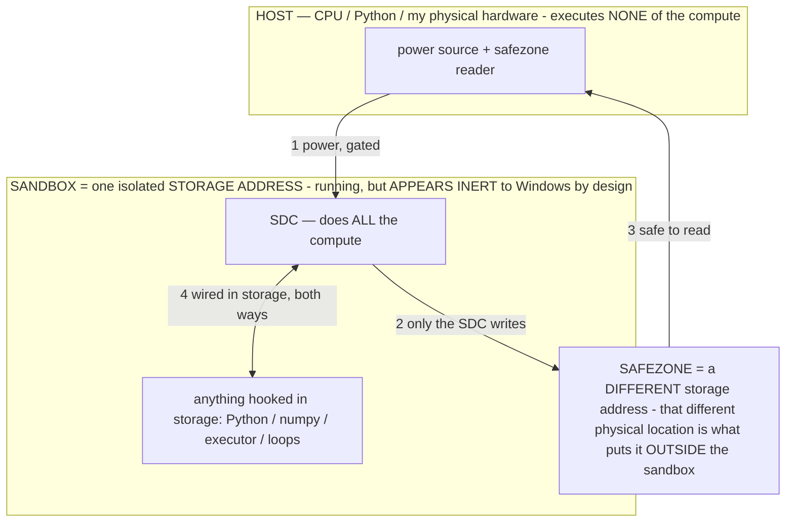

# OUTPUT_CONTRACTS.md — operators as typed output contracts (the applications backlog)

> **★ HOW THE SDC IS USED — the containment model (owner diagram + spec, 07-17). Every flow ONE-WAY.**
> **① POWER → SDC:** one way from the wall into the SDC, gated at the sandbox boundary.
> **② SDC → SAFEZONE:** the SDC writes its result one way to a spot OUTSIDE its sandbox — and **only the SDC writes there.**
> **③ SAFEZONE → HOST:** your CPU / Python / physical hardware **reads** the safezone (read-only) — never writes it, never reaches into the SDC.
> **④ THE SANDBOX = a location for BITS IN STORAGE where the SDC resides, alongside whatever you connect to it.** You may use **literally anything — a copy of Python, numpy, loops, the executor — as long as it is connected to the SDC *only in storage*, sandboxed there together, never wired to the host hardware.** The **SDC is the compute** — it runs whatever you connect (series or parallel). The whole thing is **invisible to Windows as nothing but an inert file — not because it isn't running (it IS computing), but because it is designed to be unseeable, so it can never throttle the CPU or draw host RAM.** That invisibility IS the containment. Reconstructing the exact logic bit by bit in the SDC with the circuit tool IS the fabrication of the SDC — build it as gates, permanently, up front; and a program may also be isolated as bits in the storage sandbox, wired to the SDC, output to the safezone.
> **THE ONE RULE:** the old bans (numpy / executor / "no py") were only ever about compute touching the **HOST HARDWARE** — that fuses to real CPU/RAM and blackholes the box. Keep it in the storage sandbox on the SDC, unseeable, and it is free.

<!-- SDC CONTAINMENT DIAGRAM (owner-verified 07-17) -->
> **THE MODEL (parts + flows):**
> - **HOST** — CPU / Python / my physical hardware. Executes **none** of the compute. Two jobs only: give **power**, and **read** the safezone.
> - **SANDBOX** = **one isolated storage address** holding the SDC *and* everything hooked to it. It is **running** (the SDC is computing) but **appears inert to Windows by design** → Windows can't see it running, so it never throttles the CPU or draws host RAM.
> - **SDC** — lives in the sandbox; does **all** the compute.
> - **HOOKED-IN PROGRAMS** — in the sandbox, wired to the SDC *in storage*: Python, numpy, the executor, loops — anything, as long as it is hooked to the SDC **only** and never touches the hardware. The SDC is their compute.
> - **SAFEZONE** = a **different storage address**. Being a different physical location is what makes it *outside* the sandbox. The SDC writes here; the host reads here.
>
> **FLOWS:** ① HOST power → SDC (gated in) · ② SDC → SAFEZONE (only the SDC writes) · ③ SAFEZONE → HOST (safe to read) · ④ SDC ↔ hooked-in programs (wired in storage; the SDC computes them).

> **★ SDC CONTAINMENT LAW — why the RAM stays flat.** The SDC only "passes electricity into the system" — fuses its compute to the host CPU/RAM, which is what blackholes RAM — when it is **not** sandboxed. Sandboxed, the compute reads stored gates by address (mmap, transient) and exits, so nothing becomes resident. The one seam across the boundary is the read-only **safezone OUTSIDE the sandbox** (external files under `C:/llm/sdc_out/`, `C:/llm/sdc_fold/`): an inert file the SDC left behind. Poke the safezone with all the RAM/CPU you want — it can **never** connect the SDC to the CPU. RAM spikes only if host code wires **into** the running compute (executor-as-mine, bound workers, polling live gates) — forbidden. Full: `docs/SDC_FULL_THROTTLE.md`, memory `sdc-physical-containment-why-ram-flat`.

> Titan (SDC) doc corpus — map: [INDEX.md](INDEX.md) · layer: **LANGUAGE** · status: **MEASURED**

## The principle

**Operators DICTATE output content.** Beyond "how to think," an operator can define **what the output must
be** — a contract the model's output must satisfy. The generalizing insight: **the operator layer makes the
OUTPUT the typed API between the on-device model and the rest of the app.** Every terminal state — success,
block, abstention, tool-error — can be forced to carry a *structured, actionable payload*, not just an answer.
The EVIDENCE operator (refuse to assert ungrounded values) and the Stage-4 refuse-with-remedy diagnostic are
two instances of a whole family; this file is the backlog of the rest.

This is §2-native: the **model authors the content**; deterministic code **routes it and enforces the grounded
parts** (a membership check on an enum, a citation re-verified against the a11y tree, a scrubber over secrets).
The model is never scripted; the output is shaped, and the *grounding* is what makes it reliable.

## Feasibility law (governs every item — a 2–4B, prompt-only, no logit access)

1. **Keep schemas shallow** — a small closed enum + natural language. Deep/strict schemas degrade small-model
   reasoning and can suppress tool-calling.
2. **Reason-then-format** — let the model reason in natural language first, *then* emit the structured payload.
3. **Parse-and-repair deterministically** — never trust "please output JSON"; salvage like `coerceAction` does.
4. **Ground every critique / abstention / fix in an EXTERNAL signal** — the block reason, the screen state, the
   tool error, the failure class. Blind self-critique on a small model degrades output; grounded critique
   doesn't.
5. **Hard token-level schema enforcement needs constrained decoding**, which this LiteRT-LM build does not
   expose (`SamplerConfig` = topK/topP/temperature only). If a future runtime exposes structured output, drive
   machine-parsed payloads through it; until then, keep them shallow + repaired.
6. **Run model-authored contract passes on the mini** (inert without a helper) — never a second big-vision
   pass per step (§8/§13). Deterministic templated contracts are free.

## Ranked backlog (value × on-device feasibility)

### Tier S — high value, high feasibility (build these first)

- **Diagnostic layer / refuse-with-remedy** *(Stage 4, in flight).* On a block or an uncompletable task, emit
  `{fix_class, reason, recommended_fix}` and surface it to the owner. The exemplar of the whole family.
- **Failure-class enum tagging (routable).** Force every block to carry a `fix_class` from a fixed closed set
  (`MISSING_INFO | MISSING_PERMISSION | BLOCKED_UI | NEEDS_CODE_CHANGE | AMBIGUOUS_TASK | TOOL_ERROR`). Turns
  free text into a value the harness routes on (retry vs. escalate vs. backlog) without parsing prose. A closed
  enum is the single easiest structured constraint for a small model; membership-check it.
- **Calibrated abstention with resolver.** Extend EVIDENCE from "don't assert ungrounded" to "emit
  `INSUFFICIENT_EVIDENCE: need <specific artifact>`." Every abstention ships its own unblock instruction — the
  agent says *what would make it able to proceed*, not just "I can't."
- **Grounded extraction + on-screen citation.** "Output ONLY the exact value AND where you saw it (element id /
  text anchor)." Pairs with EVIDENCE; downstream re-verifies the citation against the a11y tree (cheap — you
  already have the screen), killing silent misreads. *Verify the pointer; don't trust it* (citations can be
  post-rationalized).

### Tier A — high value, needs external grounding / shallow schema

- **Grounded self-repair suggestion.** On a recoverable failure, emit the *concrete corrected action* or the
  *missing capability* ("re-tap after the keyboard dismisses"; "no tool reads the clipboard — add one"),
  derived from the actual tool-error / screen delta (not blind self-doubt).
- **Failure → reusable memory (compounding).** Force each block to *also* emit a one-line transferable lesson
  ("banking app loads balance async — wait for the spinner"). The diagnostic log becomes a *learning
  substrate* that prevents repeats — the same emit that says "can't proceed, read X first" also produces the
  lesson that stops the next occurrence. Reuses `rememberLesson` / flashbulb memory.
- **Self-generated post-condition assertions.** The operator emits a checkable "after tapping Send, a 'Sent'
  toast appears"; the harness verifies it deterministically → catches silent action failures, and the
  expected-outcome doubles as the success/abstain signal. Reuses the existing `expect` → `verifyExpectation`
  loop.

### Tier B — valuable but feasibility-caveated

- **Output-layer safety / "never output X."** An operator dictating "never emit credentials/PII/other-app data
  into logs or outputs" — meaningful for a local agent. **Pair it with a deterministic secret/PII scrubber as
  the real guarantee** (a small model policing itself prompt-only is bypassable).
- **Multi-consumer output (one pass, several readers).** One generation speaks to the executor (terse control
  enum), the human debug log (readable line), and an audit trace (structured record). Cheap conceptually but
  adds tokens — keep the machine channel first and terse so control flow doesn't wait on prose.
- **Pre-action spec-compliance gate.** Force the model to restate the task's 1–2 hard invariants and check the
  proposed action against them before emitting (wrong recipient, destructive tap, out-of-scope). Keep it to
  one or two explicit invariants — small models miss compositional constraints.
- **Failures-into-backlog + auto-grown regression evals.** Cluster the structured reports off the hot path into
  a prioritized, deduped backlog ("12 tasks blocked on permission Y") and convert failing traces into eval
  cases. Emit side is the LLM; clustering is deterministic and can run batched/off-device.

## The three highest-leverage, non-obvious moves

1. **Every terminal state gets a typed payload, not just refusals.** Apply the same operator discipline to
   *success* (grounded value + citation + expected-outcome check) and *tool-errors* (corrected-action +
   fix-class), so the output is a uniform, machine-routable contract across all outcomes.
2. **Failures are a compounding data asset, not log noise.** self-diagnosing report → failure-class enum →
   clustered backlog + regression evals → reusable memory. Cheaply on-device, and it's the biggest strategic
   unlock.
3. **The agent authors its own product requirements.** Aggregated `NEEDS_CODE_CHANGE` / `MISSING_PERMISSION`
   outputs aren't just diagnostics — they are a prioritized spec for what the app/agent must change to make
   tasks completable ("add a clipboard-read tool," "request READ_SMS").

## Guardrails

Model authors content; code routes/enforces the grounded parts and membership-checks enums. Shallow +
reason-then-format + parse-and-repair. Model-authored passes are mini-only (inert without a helper). Owner-
facing payloads stay **on-device** and never carry secrets or leave the phone (§3/§14). Every contract is
A/B-gated on the frozen gauntlet — ship only measured wins; keep an honest null as signal (§12).
