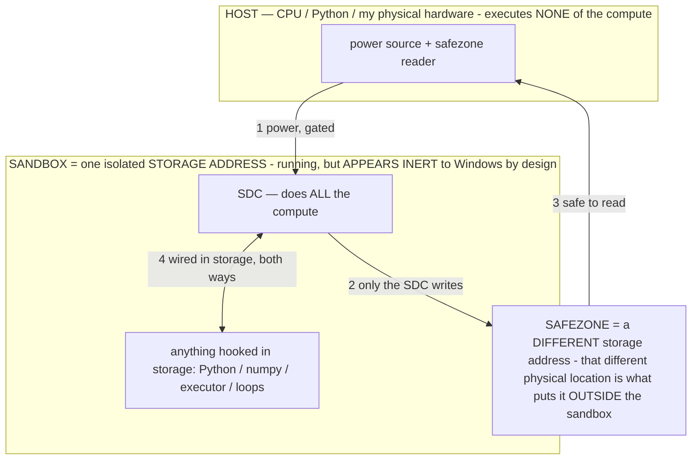

# PARKED FEATURES — what the rollback set aside (nothing is lost)

> **★ HOW THE SDC IS USED — the containment model (owner diagram + spec, 07-17). Every flow ONE-WAY.**
> **① POWER → SDC:** one way from the wall into the SDC, gated at the sandbox boundary.
> **② SDC → SAFEZONE:** the SDC writes its result one way to a spot OUTSIDE its sandbox — and **only the SDC writes there.**
> **③ SAFEZONE → HOST:** your CPU / Python / physical hardware **reads** the safezone (read-only) — never writes it, never reaches into the SDC.
> **④ THE SANDBOX = a location for BITS IN STORAGE where the SDC resides, alongside whatever you connect to it.** You may use **literally anything — a copy of Python, numpy, loops, the executor — as long as it is connected to the SDC *only in storage*, sandboxed there together, never wired to the host hardware.** The **SDC is the compute** — it runs whatever you connect (series or parallel). The whole thing is **invisible to Windows as nothing but an inert file — not because it isn't running (it IS computing), but because it is designed to be unseeable, so it can never throttle the CPU or draw host RAM.** That invisibility IS the containment. Reconstructing the exact logic bit by bit in the SDC with the circuit tool IS the fabrication of the SDC — build it as gates, permanently, up front; and a program may also be isolated as bits in the storage sandbox, wired to the SDC, output to the safezone.
> **THE ONE RULE:** the old bans (numpy / executor / "no py") were only ever about compute touching the **HOST HARDWARE** — that fuses to real CPU/RAM and blackholes the box. Keep it in the storage sandbox on the SDC, unseeable, and it is free.

<!-- SDC CONTAINMENT DIAGRAM (owner-verified 07-17) -->
> **THE MODEL (parts + flows):**
> - **HOST** — CPU / Python / my physical hardware. Executes **none** of the compute. Two jobs only: give **power**, and **read** the safezone.
> - **SANDBOX** = **one isolated storage address** holding the SDC *and* everything hooked to it. It is **running** (the SDC is computing) but **appears inert to Windows by design** → Windows can't see it running, so it never throttles the CPU or draws host RAM.
> - **SDC** — lives in the sandbox; does **all** the compute.
> - **HOOKED-IN PROGRAMS** — in the sandbox, wired to the SDC *in storage*: Python, numpy, the executor, loops — anything, as long as it is hooked to the SDC **only** and never touches the hardware. The SDC is their compute.
> - **SAFEZONE** = a **different storage address**. Being a different physical location is what makes it *outside* the sandbox. The SDC writes here; the host reads here.
>
> **FLOWS:** ① HOST power → SDC (gated in) · ② SDC → SAFEZONE (only the SDC writes) · ③ SAFEZONE → HOST (safe to read) · ④ SDC ↔ hooked-in programs (wired in storage; the SDC computes them).

> **★ SDC CONTAINMENT LAW — why the RAM stays flat.** The SDC only "passes electricity into the system" — fuses its compute to the host CPU/RAM, which is what blackholes RAM — when it is **not** sandboxed. Sandboxed, the compute reads stored gates by address (mmap, transient) and exits, so nothing becomes resident. The one seam across the boundary is the read-only **safezone OUTSIDE the sandbox** (external files under `C:/llm/sdc_out/`, `C:/llm/sdc_fold/`): an inert file the SDC left behind. Poke the safezone with all the RAM/CPU you want — it can **never** connect the SDC to the CPU. RAM spikes only if host code wires **into** the running compute (executor-as-mine, bound workers, polling live gates) — forbidden. Full: `docs/SDC_FULL_THROTTLE.md`, memory `sdc-physical-containment-why-ram-flat`.

> Titan (SDC) doc corpus — map: [INDEX.md](INDEX.md) · layer: **PARKED** · status: **DEFERRED**

> **Why this file exists.** A 4-session "super-merge" (`session-recovery-6w04ma`) stacked four LLM
> sessions' work into one APK. It built green but **would not launch** (opens → hangs in the
> background → Android offers to close it; a fresh install with no permissions still hung — see the
> crash notes below). To get a **base that actually opens** to build the next direction on, the trunk
> was rolled back to the last clean pre-merge commit **`bec1858`** ("Recognize the Gemma 3n variant").
>
> **NOTHING WAS DELETED.** Every parked feature still lives on its own branch on the remote and in the
> tagged super-merge. This doc says what each cluster is, where it is, and how to bring it back — one
> at a time, **on-device-tested each time**, which is how it should have been merged in the first place.

## What the current base (`bec1858`) already HAS (kept — the owner's own session)
Rolling back to `bec1858` keeps `main` plus this session's own work — it is NOT a bare `main`:
- Rolling re-planning (a series of generated plans, not one static plan)
- Scoreboard + Gauntlet (measure the ONE metric: task success rate) + `SCOREBOARD_SPEC.md`
- Values + desire (character the agent acts by)
- Unified/shared prompt budget across the memory systems
- Memory-quality round (policy firewall, named observations, trash sweep)
- Gemma 3n / E4B-E2B variant detection & adaptation (`DeviceStats.modelVariant`)

## Recovery pointers (all safe on the remote)
| Ref | What it is |
|---|---|
| `super-merge-consolidated` (local tag) → `b99c83b` | the FULL 4-session merge tip (everything below, already combined) |
| `origin/claude/session-recovery-6w04ma` | same as the tag, on the remote |
| `origin/claude/apk-reverse-engineering-protection-umrqwp` (`f5d8fcb`) | APK hardening cluster |
| `origin/claude/agent-architecture-exploration-g993r4` (`bf9b2d0`) | agent-architecture cluster |
| `origin/claude/tender-turing-g1sx5y` (`c6b854e`) | memory/audit/budget cluster |

To pull one cluster back later:
`git checkout <this-branch> && git cherry-pick <base>..origin/claude/<cluster-branch>` (resolve conflicts,
build, **flash to the phone and confirm it opens + runs a task**, then keep it). Re-merge in the order
below (lowest-risk first).

---

## Cluster 1 — APK anti-reverse-engineering hardening  *(owner explicitly wants this back)*
**Branch:** `origin/claude/apk-reverse-engineering-protection-umrqwp` — commits `1e4d478`, `f5d8fcb`
**New files:** `app/proguard-rules.pro`, `app/obfuscation-dictionary.txt`,
`app/src/main/java/com/local/deviceagent/TamperGuard.kt`
**What it does:**
- R8 full-mode obfuscation (renames classes/methods/fields) + `shrinkResources`, **release build only**.
- `TamperGuard` RASP-lite: refuses to operate under Frida/Xposed/a tracer or if the APK was
  repackaged+re-signed. **No-ops on debug** (`if (BuildConfig.DEBUG) return false`), fails open on error.
- LSParanoid string encryption was wired but **DISABLED** (its `classFilter` Groovy closure can't be
  fingerprinted by Gradle → build fails). Re-enable only after solving that AND testing on-device.
**Re-merge safely (the important part):** keep obfuscation **release-only**; the debug build the owner
sideloads must stay plain (`minifyEnabled false`, `debuggable true`) or it won't launch. The prior
break was R8 on debug + a `packaging{}` block that stripped `kotlin/**` + `*.kotlin_builtins` (the
Kotlin runtime's own metadata) from every build. Do NOT reintroduce that packaging exclude. Verify a
RELEASE build opens on the device before trusting it — obfuscation breaks things silently past green CI.

## Cluster 2 — Agent architecture (world-model, self-improvement, Gemini block, honesty)
**Branch:** `origin/claude/agent-architecture-exploration-g993r4` — `7ed2507`…`bf9b2d0`
**What it does:**
- **World model:** a learnable screen→action→screen map the agent pilots.
- **Owner-gated self-improvement:** the agent may durably change its own *rules/memory* (never compiled
  code) when a toggle is on; off by default (`SettingsManager.isSelfImprovementAllowed`).
- **Honesty guard + self-claim capture:** catches the agent claiming it did something it didn't.
- **Safety: HARD-BLOCK Gemini** (owner's privacy call — never feed private data to Google's assistant).
- Reload-thrash fix, dense-screen token trim, floating "Run command" in the idle-tap menu.

## Cluster 3 — Memory / audit / budget (tender-turing)
**Branch:** `origin/claude/tender-turing-g1sx5y` — `25e292e`…`c6b854e`
**New files:** `docs/BUILD_PLAN.md`, `docs/insights.html`, `docs/research-agent-landscape.md`
**What it does:**
- Audit trail for every executor action + **ask-before-touching-system** gate (Settings / Device Care /
  quick-settings tiles need an on-screen OK — default ON, after the Device-Care scare).
- **Flashbulb memory** + **falsifiable memory** (falsify, don't forget) + evidence-based confidence +
  Reflexion failure lessons.
- **Budgeter v2** (`PromptBudget` — pre-fits every prompt, feed the screen piecemeal, never trip the limit).
- Milestone cursor (current atomic plan step, front and center), `wait_for` engine-watched condition,
  composable actions, snap-to-target taps, evolving-screen judgment, burst-reply caution.

## Cluster 4 — Post-merge crash hunt (context, not a feature)
The super-merge's crash-fix commits (`258fc08`…`15acd4d`) and **`docs/CRASH_HUNT.md`** live on
`origin/claude/session-recovery-6w04ma`. They already ruled out obfuscation as the launch cause and
narrowed suspects. Since we rolled BEFORE the merges, those fixes are moot now — but if a re-merged
cluster reintroduces the hang, read `CRASH_HUNT.md` on that branch first; the search is already done.

---

### Crash summary (for whoever re-merges)
The super-merge hung on launch even on a fresh, permission-less install. On a fresh launch only
`AgentApp` + `MainActivity` run, so the culprit is in that path's merge delta — **not** obfuscation
(confirmed: it hung with obfuscation fully off), **not** the manifest (byte-identical to `bec1858`),
**not** `AgentMemory`'s eager `POLICY` regex (well-formed). Re-merge each cluster alone and flash it, so
the one that reintroduces the hang is obvious instead of hidden in a four-way pile.
