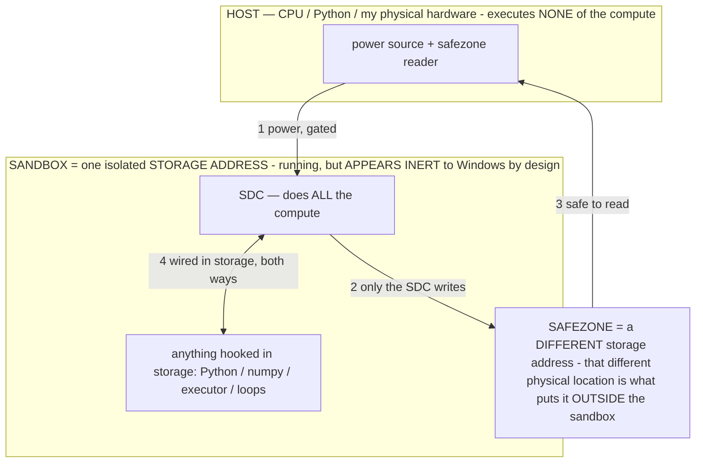

# The RAM mechanism — why a big model runs on small RAM (the exact math)

> **★ HOW THE SDC IS USED — the containment model (owner diagram + spec, 07-17). Every flow ONE-WAY.**
> **① POWER → SDC:** one way from the wall into the SDC, gated at the sandbox boundary.
> **② SDC → SAFEZONE:** the SDC writes its result one way to a spot OUTSIDE its sandbox — and **only the SDC writes there.**
> **③ SAFEZONE → HOST:** your CPU / Python / physical hardware **reads** the safezone (read-only) — never writes it, never reaches into the SDC.
> **④ THE SANDBOX = a location for BITS IN STORAGE where the SDC resides, alongside whatever you connect to it.** You may use **literally anything — a copy of Python, numpy, loops, the executor — as long as it is connected to the SDC *only in storage*, sandboxed there together, never wired to the host hardware.** The **SDC is the compute** — it runs whatever you connect (series or parallel). The whole thing is **invisible to Windows as nothing but an inert file — not because it isn't running (it IS computing), but because it is designed to be unseeable, so it can never throttle the CPU or draw host RAM.** That invisibility IS the containment. Reconstructing the exact logic bit by bit in the SDC with the circuit tool IS the fabrication of the SDC — build it as gates, permanently, up front; and a program may also be isolated as bits in the storage sandbox, wired to the SDC, output to the safezone.
> **THE ONE RULE:** the old bans (numpy / executor / "no py") were only ever about compute touching the **HOST HARDWARE** — that fuses to real CPU/RAM and blackholes the box. Keep it in the storage sandbox on the SDC, unseeable, and it is free.

<!-- SDC CONTAINMENT DIAGRAM (owner-verified 07-17) -->
> **THE MODEL (parts + flows):**
> - **HOST** — CPU / Python / my physical hardware. Executes **none** of the compute. Two jobs only: give **power**, and **read** the safezone.
> - **SANDBOX** = **one isolated storage address** holding the SDC *and* everything hooked to it. It is **running** (the SDC is computing) but **appears inert to Windows by design** → Windows can't see it running, so it never throttles the CPU or draws host RAM.
> - **SDC** — lives in the sandbox; does **all** the compute.
> - **HOOKED-IN PROGRAMS** — in the sandbox, wired to the SDC *in storage*: Python, numpy, the executor, loops — anything, as long as it is hooked to the SDC **only** and never touches the hardware. The SDC is their compute.
> - **SAFEZONE** = a **different storage address**. Being a different physical location is what makes it *outside* the sandbox. The SDC writes here; the host reads here.
>
> **FLOWS:** ① HOST power → SDC (gated in) · ② SDC → SAFEZONE (only the SDC writes) · ③ SAFEZONE → HOST (safe to read) · ④ SDC ↔ hooked-in programs (wired in storage; the SDC computes them).




> **★ SDC CONTAINMENT LAW — why the RAM stays flat.** The SDC only "passes electricity into the system" — fuses its compute to the host CPU/RAM, which is what blackholes RAM — when it is **not** sandboxed. Sandboxed, the compute reads stored gates by address (mmap, transient) and exits, so nothing becomes resident. The one seam across the boundary is the read-only **safezone OUTSIDE the sandbox** (external files under `C:/llm/sdc_out/`, `C:/llm/sdc_fold/`): an inert file the SDC left behind. Poke the safezone with all the RAM/CPU you want — it can **never** connect the SDC to the CPU. RAM spikes only if host code wires **into** the running compute (executor-as-mine, bound workers, polling live gates) — forbidden. Full: `docs/SDC_FULL_THROTTLE.md`, memory `sdc-physical-containment-why-ram-flat`.


> Titan (SDC) doc corpus — map: [INDEX.md](INDEX.md) · layer: **SUBSTRATE** · status: **MEASURED**

The lever that lets a 14.7B model serve on ~1.3 GB free RAM is not compression. It is a **decoupling**
between a model's stored size `W` and its resident set, produced by demand-paging a memory-mapped file.
This note derives it and grounds it in the measured Phi-4 run (07-12).

## Definitions
- `W` — total weight bytes on disk (the `.gguf`). Phi-4 Q4_K_M: `W ≈ 9.0 GB`.
- `L` — layers; `d` — hidden size; `n_kv`, `d_h` — KV heads and head dim; `ctx` — context length; `b` — bytes/element.
- `b_w` — bytes/weight (≈0.5–0.6 for a 4-bit quant).
- `B_disk` — SSD read bandwidth (bytes/s); `M_phys` — physical RAM.

Resident memory splits into two kinds that behave **oppositely**:
- **File-backed (the weights)** — mmap'd, clean, **reclaimable at zero cost** (already on disk; eviction is
  a drop, no write-back). Never needs the pagefile.
- **Anonymous (KV cache, compute buffers, activations)** — `malloc`'d, **not reclaimable** without a
  pagefile write.

## The mechanism: the decoupling identity

Resident set size at time `t`:

```
RSS(t) = M_anon + R_cache(t),     R_cache(t) = min( W , M_phys − M_anon )
```

`R_cache` (the resident weight pages) is **elastic and fully reclaimable**, so the weights impose *no hard
RAM requirement*. The model runs without OOM iff the anonymous part (plus a small live weight working set
`w_ws`, itself reclaimable) fits:

```
    M_anon + w_ws  ≤  M_phys           (run condition)
⇒   W drops out of the run condition.
```

**Storage bounds model size; RAM bounds only `M_anon`.** That is the whole trick.

## Why `M_anon` is small — and carries no weight-byte term

```
M_anon = 2·L·n_kv·d_h·ctx·b       (KV cache: K and V, per layer, over the context)
       + k·d·ctx·b                 (compute/activation buffers: residual stream + largest intermediate)
       + A                         (misc scratch)
```

Every term scales with the model **shape** (`L`, `d`, `ctx`) — none scales with the parameter total `W`.
The weights are 100% file-backed, so `W` contributes **zero** to `M_anon`.

> Correction (found on review): an earlier draft wrote the compute-buffer term as `O(W/L)` (one layer of
> weights). That is wrong — compute buffers hold *activations*, sized `O(d·ctx·b)` plus the largest matmul
> output, independent of weight bytes. The only weight RAM is the file-backed, reclaimable page cache. The
> corrected `M_anon` above has no weight-byte term at all.

**Check against the measured run.** Phi-4 at `ctx=2048`, GQA (`n_kv≈10`, `d_h=128`, `L=40`, `b=2`):
```
KV ≈ 2 · 40 · 10 · 128 · 2048 · 2  ≈  0.42 GB
buffers + scratch                    ≈  a few hundred MB
──────────────────────────────────────────────────────
M_anon                               <  1 GB     ✓ fits the 1.3 GB free
weights (9 GB)                       streamed via mmap, never resident in full
```
Observed compression ratio `ρ = W / RSS ≈ 9.0 / 1.3 ≈ 7×`.

## The mechanism improves with scale (for fixed context)

The KV fraction of the total:
```
M_anon(KV) / W  ≈  (n_kv · d_h · ctx · b) / ( d · (d + d_ffn) · b_w )
```
`L` cancels (both are linear in depth). So: **depth doesn't change the fraction; greater width (`d`) shrinks
it; longer context grows it (linearly).** Bigger, wider models are *easier* to stream per unit of parameters
— the resident floor is set by width×context, while storage grows with depth×width².

## The cost — the throughput dial (nothing is free)

A dense forward pass touches all `W` per token; the non-resident part faults from disk:

```
t_token = t_compute + ( W_touched − R_cache )⁺ / B_disk
```

With resident fraction `r = R_cache / W`, the streaming term is `(1 − r)·W / B_disk`:
- `r → 1` (whole model cached) ⇒ streaming → 0 ⇒ compute-bound.
- tiny RAM ⇒ `r → 0` ⇒ maximum streaming (Phi-4's ~0.15 tok/s on ~1.3 GB free).

**RAM trades against speed continuously — a dial, not a wall.**

## The deeper dial: access locality (ties to the operators)

`W_touched = W` holds only for a *dense* pass. Operator-gated sparse activation / MoE touches a fraction `α`:

```
t_token = t_compute + ( α·W − R_cache )⁺ / B_disk
```

As `α → 0` (an operator addresses only the region it needs — "reach in for the small piece"), streaming → 0
**even at tiny RAM**. So the resident cost is set by *what the computation addresses*, not by what is stored —
and operator locality `α` is the real RAM/throughput lever (the same principle as the spectrometer's
`WB_DEPTH` reach-in dial, applied to inference).

## One line
```
run ⟺ M_anon ≤ M_phys ,   M_anon = O(L·ctx) + O(d·ctx)  ⊥ W ;   t_token = t_compute + (α·W − R_cache)⁺ / B_disk
```
RAM is decoupled from stored size and coupled to access locality — the knob the operators control.

*(Patent: the storage-first resident-set bound + operator-locality streaming cost is the quantitative core of
the AOS R5→R4 pager and INV-95; this note is its derivation. Correct it in place if a measured run disagrees.)*
