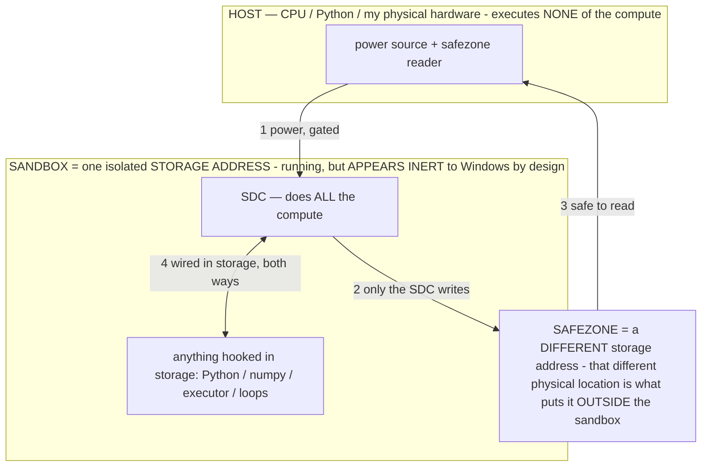

# The RAM mechanism, in prose (sister to RAM_MECHANISM.md)

> **★ HOW THE SDC IS USED — the containment model (owner diagram + spec, 07-17). Every flow ONE-WAY.**
> **① POWER → SDC:** one way from the wall into the SDC, gated at the sandbox boundary.
> **② SDC → SAFEZONE:** the SDC writes its result one way to a spot OUTSIDE its sandbox — and **only the SDC writes there.**
> **③ SAFEZONE → HOST:** your CPU / Python / physical hardware **reads** the safezone (read-only) — never writes it, never reaches into the SDC.
> **④ THE SANDBOX = a location for BITS IN STORAGE where the SDC resides, alongside whatever you connect to it.** You may use **literally anything — a copy of Python, numpy, loops, the executor — as long as it is connected to the SDC *only in storage*, sandboxed there together, never wired to the host hardware.** The **SDC is the compute** — it runs whatever you connect (series or parallel). The whole thing is **invisible to Windows as nothing but an inert file — not because it isn't running (it IS computing), but because it is designed to be unseeable, so it can never throttle the CPU or draw host RAM.** That invisibility IS the containment. Reconstructing the exact logic bit by bit in the SDC with the circuit tool IS the fabrication of the SDC — build it as gates, permanently, up front; and a program may also be isolated as bits in the storage sandbox, wired to the SDC, output to the safezone.
> **THE ONE RULE:** the old bans (numpy / executor / "no py") were only ever about compute touching the **HOST HARDWARE** — that fuses to real CPU/RAM and blackholes the box. Keep it in the storage sandbox on the SDC, unseeable, and it is free.

<!-- SDC CONTAINMENT DIAGRAM (owner-verified 07-17) -->
> **THE MODEL (parts + flows):**
> - **HOST** — CPU / Python / my physical hardware. Executes **none** of the compute. Two jobs only: give **power**, and **read** the safezone.
> - **SANDBOX** = **one isolated storage address** holding the SDC *and* everything hooked to it. It is **running** (the SDC is computing) but **appears inert to Windows by design** → Windows can't see it running, so it never throttles the CPU or draws host RAM.
> - **SDC** — lives in the sandbox; does **all** the compute.
> - **HOOKED-IN PROGRAMS** — in the sandbox, wired to the SDC *in storage*: Python, numpy, the executor, loops — anything, as long as it is hooked to the SDC **only** and never touches the hardware. The SDC is their compute.
> - **SAFEZONE** = a **different storage address**. Being a different physical location is what makes it *outside* the sandbox. The SDC writes here; the host reads here.
>
> **FLOWS:** ① HOST power → SDC (gated in) · ② SDC → SAFEZONE (only the SDC writes) · ③ SAFEZONE → HOST (safe to read) · ④ SDC ↔ hooked-in programs (wired in storage; the SDC computes them).

> **★ SDC CONTAINMENT LAW — why the RAM stays flat.** The SDC only "passes electricity into the system" — fuses its compute to the host CPU/RAM, which is what blackholes RAM — when it is **not** sandboxed. Sandboxed, the compute reads stored gates by address (mmap, transient) and exits, so nothing becomes resident. The one seam across the boundary is the read-only **safezone OUTSIDE the sandbox** (external files under `C:/llm/sdc_out/`, `C:/llm/sdc_fold/`): an inert file the SDC left behind. Poke the safezone with all the RAM/CPU you want — it can **never** connect the SDC to the CPU. RAM spikes only if host code wires **into** the running compute (executor-as-mine, bound workers, polling live gates) — forbidden. Full: `docs/SDC_FULL_THROTTLE.md`, memory `sdc-physical-containment-why-ram-flat`.

> Titan (SDC) doc corpus — map: [INDEX.md](INDEX.md) · layer: **SUBSTRATE** · status: **MEASURED**

This is the prose form of `RAM_MECHANISM.md` — the same derivation and the same claims, written as
argument rather than equations. It explains why Phi-4 (14.7B parameters, ~9 GB on disk) served on a laptop
with roughly 1.3 GB of free physical memory.

## The mechanism is a decoupling, not a compression

The reason a large model fits in small memory is not that anything is made smaller. It is that the model's
**stored size** and its **resident set** — the bytes physically in RAM at a given instant — are two
independent quantities, and demand-paging a memory-mapped file is what separates them. When the weights are
memory-mapped rather than read into a heap buffer, they are not copied into RAM up front. The virtual
address space points at the file on the SSD, and physical pages are faulted in only when the running
computation actually references them. Because those pages are **clean and file-backed**, the operating
system can evict them at zero cost — dropping them requires no write-back, since the authoritative copy is
still on disk. The weights therefore pass through a bounded window of physical memory instead of occupying
memory proportional to their total size.

## Two kinds of resident memory, behaving oppositely

The resident footprint divides into two categories that must be kept distinct, because they have opposite
consequences for whether the model can run. The first is the **file-backed weight pages**: mapped from the
`.gguf`, clean, and fully reclaimable. Under memory pressure the OS simply drops the pages it isn't
currently touching and re-faults them later. This category can be arbitrarily large without ever forcing an
out-of-memory condition, because it never has to fit — it is elastic, expanding to fill free memory as an
opportunistic cache and contracting instantly when something else needs the space. The second category is
the **anonymous allocations**: the KV cache, the compute/scratch buffers, and the activations. These are
`malloc`'d, not backed by the model file, and therefore *not* freely reclaimable — evicting them would
require a pagefile write. This is the memory that genuinely has to fit.

The run condition follows directly. The model runs, rather than thrashing into an OOM kill, precisely when
the anonymous allocations (plus a small, still-reclaimable working set of weight pages for the operation in
flight) fit inside physical RAM. The total weight size does not appear in that condition at all. Storage
bounds how large a model you can host; physical RAM bounds only the anonymous set.

## Why the anonymous set carries no weight-byte term

The anonymous memory is dominated by the KV cache, which is proportional to the number of layers times the
number of key/value heads times the head dimension times the context length times the bytes per element —
the two K and V tensors accumulated across the context. Added to that are the compute buffers, which hold
the residual stream and the largest intermediate matmul output, sized by the hidden dimension times the
context length, plus miscellaneous scratch. Every one of these terms scales with the model's **shape** —
its depth, its width, and the context length — and none of them scales with the raw parameter total. The
weights contribute nothing to the anonymous set, because they live entirely in the reclaimable file-backed
category.

(This is the point an earlier draft got wrong: it attributed a one-layer weight term to the compute buffers.
The compute buffers hold activations, not weights; the weight working set is file-backed and reclaimable, so
the hard requirement has no weight-byte term in it. The correction sharpens the conclusion rather than
weakening it.)

The measured Phi-4 run bears this out. At a context of 2048 with grouped-query attention — on the order of
ten KV heads, a head dimension of 128, forty layers, two bytes per element — the KV cache comes to roughly
0.42 GB, and the compute buffers and scratch add a few hundred megabytes more, for an anonymous set under a
gigabyte. That fit inside the 1.3 GB free, while the 9 GB of weights streamed off the SSD and were never
resident in full. The observed ratio of stored size to resident footprint was about sevenfold.

## The mechanism strengthens with model size, for fixed context

Because the anonymous set is governed by shape rather than parameter count, the fraction of a model that must
be resident behaves counterintuitively as models scale. Compare the KV-cache size against the total weight
size: the layer count appears linearly in both and therefore cancels, so **depth does not change the resident
fraction at all**. Width appears linearly in the KV term but quadratically in the per-layer weights, so
**greater width shrinks the resident fraction** — a wider model carries more parameters per unit of anonymous
memory. The only factor that inflates the resident requirement is **context length**, which enters the KV
term linearly. The practical consequence is that "this model is too large for this machine" is the wrong
framing; the binding constraint is context length, not parameter count, and larger models are if anything
more favorable to stream per parameter.

## The cost is throughput, and it is a continuous dial

None of this is free; the trade is paid in speed. For a dense model, every weight is referenced once per
generated token, so any weight page not currently resident must be faulted from the SSD during that token.
The per-token latency is therefore the compute time plus the time to stream whatever fraction of the weights
was not already cached, and that streaming time is the non-resident byte count divided by the disk bandwidth.
This makes the resident fraction a smooth control on speed rather than a threshold on feasibility. When free
memory is ample and most of the model stays cached between tokens, the streaming term collapses toward zero
and the model is compute-bound. When free memory is scarce and little stays cached, nearly the whole model
is re-read per token and throughput drops accordingly — which is exactly the regime that produced Phi-4's
roughly 0.15 tokens per second on 1.3 GB free. RAM buys speed continuously; it never decides whether the
model can run, only how fast it runs.

## The deeper lever is access locality

The preceding paragraph assumed a dense forward pass that touches all of the weights per token. That
assumption is what makes the streaming cost proportional to the full model size, and it is also where the
real lever lives. If only a fraction of the weights is activated per step — a mixture-of-experts routing, or
an operator that steers the computation into the specific region it needs — then the streamed quantity is
that fraction of the model rather than the whole, and the streaming term shrinks proportionally. As that
active fraction approaches zero, the model stays fast even under severe memory pressure, because the cost is
set by **what the computation addresses**, not by what is stored. This is the same principle as the
spectrometer's reach-in depth control applied to inference: resident cost and streaming cost both follow
locality, and locality is precisely the quantity the operator layer is designed to govern.

## Summary of the argument

Memory-mapping decouples a model's stored size from its resident set by streaming clean, reclaimable weight
pages through a bounded window of physical memory. The only memory that must actually fit is the anonymous
set — KV cache, compute buffers, activations — whose size is fixed by the model's shape and the context
length, with no dependence on the parameter total; so the run condition drops the weight size entirely, and
even very large models run while long contexts, not large parameter counts, are what strain memory. Reduced
free memory degrades throughput continuously rather than blocking execution, and confining each step to the
portion of the model it actually needs keeps throughput high even when memory is nearly full.
