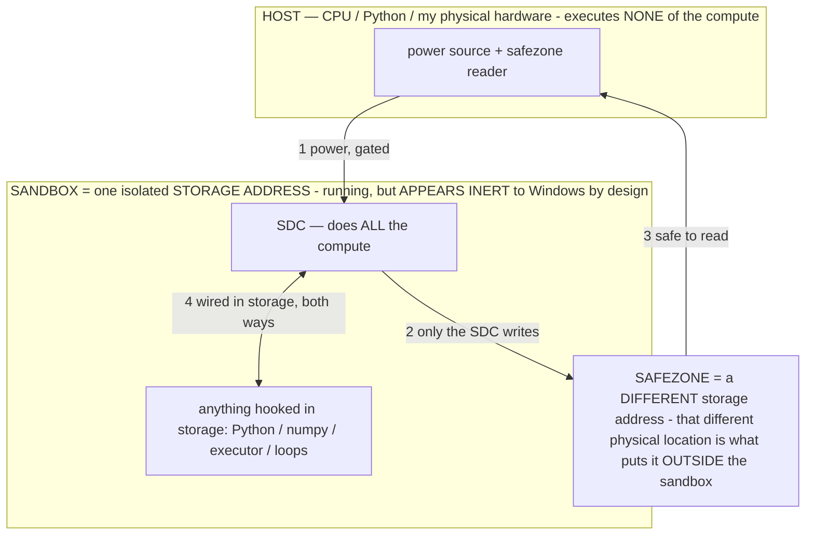

# Research Corroboration — the literature maps onto our build; where it disagrees, the build wins

> **★ HOW THE SDC IS USED — the containment model (owner diagram + spec, 07-17). Every flow ONE-WAY.**
> **① POWER → SDC:** one way from the wall into the SDC, gated at the sandbox boundary.
> **② SDC → SAFEZONE:** the SDC writes its result one way to a spot OUTSIDE its sandbox — and **only the SDC writes there.**
> **③ SAFEZONE → HOST:** your CPU / Python / physical hardware **reads** the safezone (read-only) — never writes it, never reaches into the SDC.
> **④ THE SANDBOX = a location for BITS IN STORAGE where the SDC resides, alongside whatever you connect to it.** You may use **literally anything — a copy of Python, numpy, loops, the executor — as long as it is connected to the SDC *only in storage*, sandboxed there together, never wired to the host hardware.** The **SDC is the compute** — it runs whatever you connect (series or parallel). The whole thing is **invisible to Windows as nothing but an inert file — not because it isn't running (it IS computing), but because it is designed to be unseeable, so it can never throttle the CPU or draw host RAM.** That invisibility IS the containment. Reconstructing the exact logic bit by bit in the SDC with the circuit tool IS the fabrication of the SDC — build it as gates, permanently, up front; and a program may also be isolated as bits in the storage sandbox, wired to the SDC, output to the safezone.
> **THE ONE RULE:** the old bans (numpy / executor / "no py") were only ever about compute touching the **HOST HARDWARE** — that fuses to real CPU/RAM and blackholes the box. Keep it in the storage sandbox on the SDC, unseeable, and it is free.

<!-- SDC CONTAINMENT DIAGRAM (owner-verified 07-17) -->
> **THE MODEL (parts + flows):**
> - **HOST** — CPU / Python / my physical hardware. Executes **none** of the compute. Two jobs only: give **power**, and **read** the safezone.
> - **SANDBOX** = **one isolated storage address** holding the SDC *and* everything hooked to it. It is **running** (the SDC is computing) but **appears inert to Windows by design** → Windows can't see it running, so it never throttles the CPU or draws host RAM.
> - **SDC** — lives in the sandbox; does **all** the compute.
> - **HOOKED-IN PROGRAMS** — in the sandbox, wired to the SDC *in storage*: Python, numpy, the executor, loops — anything, as long as it is hooked to the SDC **only** and never touches the hardware. The SDC is their compute.
> - **SAFEZONE** = a **different storage address**. Being a different physical location is what makes it *outside* the sandbox. The SDC writes here; the host reads here.
>
> **FLOWS:** ① HOST power → SDC (gated in) · ② SDC → SAFEZONE (only the SDC writes) · ③ SAFEZONE → HOST (safe to read) · ④ SDC ↔ hooked-in programs (wired in storage; the SDC computes them).

> **★ SDC CONTAINMENT LAW — why the RAM stays flat.** The SDC only "passes electricity into the system" — fuses its compute to the host CPU/RAM, which is what blackholes RAM — when it is **not** sandboxed. Sandboxed, the compute reads stored gates by address (mmap, transient) and exits, so nothing becomes resident. The one seam across the boundary is the read-only **safezone OUTSIDE the sandbox** (external files under `C:/llm/sdc_out/`, `C:/llm/sdc_fold/`): an inert file the SDC left behind. Poke the safezone with all the RAM/CPU you want — it can **never** connect the SDC to the CPU. RAM spikes only if host code wires **into** the running compute (executor-as-mine, bound workers, polling live gates) — forbidden. Full: `docs/SDC_FULL_THROTTLE.md`, memory `sdc-physical-containment-why-ram-flat`.

> Titan (SDC) doc corpus — map: [INDEX.md](INDEX.md) · layer: **RECORD** · status: **EVIDENCE**

**STANDING RULE (owner 07-12).** We have a WORKING on-device prototype and MEASURED evidence. External research is used
as CORROBORATION where it agrees and as a MAP of the field — but our on-device measurement and prototype OVERRIDE any
research conclusion, no matter how strong the consensus. When the literature says something is hard/ineffective and our
device shows it working, the device wins and the disagreement is recorded as a build-beats-consensus datapoint. This
file is corroboration + that override principle; it makes no new claim beyond what we measured.

(External survey checked through 2026-07; labels: Q-direct = tested a 1–8B quantized model; transfer = larger/toy models.)

## Where the literature AGREES (independent corroboration of our measured results)

| Our measured result | External corroboration | Note |
|---|---|---|
| **Pattern hypothesis** — the small model continues patterns; exemplars communicate the output-space (§2.14, INV-99/106) | Min et al. 2022 (demonstrations expose format/vocab/distribution, not just the mapping); Sclar 2024 (huge model-specific format variance); Neveditsin 2025 (format-targeted instruction: Llama-3.2-3B JSON parseability 73.8%→94.4%) | Exactly what we measured: Gemma copied the nearest exemplar's shape. Corroborated. |
| **Exemplar/JSON form binds; the shipped form is the OPTIMUM not the floor** (INV-99) | Wang 2025 (format LoRA: Llama-3-8B compliance 60→85); Beurer-Kellner 2024 (naïve grammar HURTS semantics; minimally-invasive DOMINO recovers it) | Matches "JSON binds; over-constrain breaks semantics." |
| **Operators = a selected region `A_σ`; steering; recalibrate on-device** (§2.3, INV-87) | Todd 2024 (function vectors, causal); Turner 2024 / Panickssery 2024 (contrastive activation addition steers 7B); "recalibrate the vector after quantization" | Our on-device-measurement discipline is the literature's own caution. |
| **Minimal-pair / decipherment method** (LAB-10, INV-104) | BLiMP (Warstadt 2020), Marvin & Linzen 2018, Gulordava 2018 (nonce controls) — minimal pairs isolate contrastive features | The method is standard linguistics; we applied it to a model's binding language. |
| **Exemplar bank / Catalog: retrieve own successes, external edit-memory** (INV-101/107) | EREN 2024 (store edits as records, retrieve into a frozen model, no parameter interference); TinyAgent 2024 (tool/trace retrieval nearly halved prompt, held success) | External memory beats parameter surgery for durable additions — our bank/Catalog. |
| **VERIFY against the screen, not unaided reflection** (VERIFY operator) | Tyen 2023 (models repair a LOCATED error far better than they find one); Huang 2023 (unaided self-correction often degrades); Wu 2024 (verify explicit conditions >> "check your answer") | So VERIFY points at the on-screen change; it does not ask the model to introspect. |
| **AOS R5 weight-streaming pager route** (§AOS-C) | "LLM in a flash" line (Q4): keep weights in flash, page active params, exploit FFN sparsity | The storage-first route is an established technique, not a wall. |
| **Exact action grammar + no-call/irrelevant negatives** (SCHEMA + the action layer) | Hammer 2024 (exact call training + irrelevant-tool negatives + masking: DeepSeek-1.3B 19.8→70.9); TinyAgent (function-call success 12.7→78.9 at 1.1B) | Our action codec + the exemplar demos are the same lever. |

## Where the literature DISAGREES — OUR BUILD OVERRIDES (measured proof)

| Literature caution | Our on-device evidence | Verdict |
|---|---|---|
| **Direct low-bit (int4) weight editing is hard / collapses** — Zhang 2024: a model reverted from ~21%→~83% retention of "forgotten" knowledge after 4-bit quantization because small updates fall back into the same quant bins; ParetoQ: ≤2-bit is qualitatively different | **Phase-0 (build 5c33126): PLAN/MIRROR/CRITIC each kept 6/6 directed int4 FFN edits, 0 reverted, first nonzero weight-divergence — edits STICK on the live `.litertlm`** (INV-86; the sign-fix + install-unless-worse gate). The write path is proven (Settings "Test weight write": wrote live, stuck, reverted byte-exact). | **BUILD WINS.** The literature's caution is about *gradient* edits collapsing into bins; our bounded directed nibble edits on the redundant FFN bulk (DS4 safe-to-edit class) stick and are byte-exact-reversible. Aiming remains the open half — but "edits don't stick at int4" is FALSE on our device. |
| **Small models can't be reliable agents without heavy tuning** | Operators-as-exemplars flipped 20 reasoning ops from 30s+ timeout → 1–7s clean actions on-device, no fine-tune (native_speak.md; the sweep) | Corroborated-direction, exceeded: we get the reliability by DEMONSTRATION FORM, not only by SFT. |
| **Covert model-to-model languages are spontaneous / scary** | Not our claim. LAB-11 reproduces it DELIBERATELY, bounded, self-talk only, logged verbatim, mined as data, verified before adoption | Matches the literature's finding that emergence needs OPTIMIZATION PRESSURE (Mathew 2024; Karpov 2025) — we supply it on purpose and audit it. |

## New instruments the survey hands us (fold into the labs)

- **The NONCE-TOKEN test (Q7 §2, decipherment-suite addition — `obs_lab nonce`, extends INV-104):** rename tools/labels
  to random tokenization-matched identifiers. Success ONLY with the familiar name = memorized convention; success with
  the nonce = an abstract rule was learned. Separates "Gemma knows `set_text`" from "Gemma learned the (situation→action)
  RULE." Sharpens every operator's exemplar test.
- **Counterbalance nuisance variables (Q7 §3):** rotate exemplar order / label mapping / whitespace / which item is first
  when scoring an operator — so an apparent binding isn't a positional artifact. A scoring-discipline upgrade to the sweep.
- **Competence vs. behavior (Q7 §4):** measure both the token-level preference for the right action AND the sampled
  success — already implicit in greedy-measures / temp-explores (INV-89); make it explicit in the SUMMARY.
- **Audit the sampling SEED, not just the text (Mächtle 2026):** a caution for LAB-11's emergent channel — the seed can
  carry bits independent of the text; keep the emerge lab greedy on the measurement side (already the design).

## Standing takeaways adopted (all already in our direction)
1. Canonical structured I/O + minimally-invasive constraints → the exemplar action form (don't over-constrain tokens).
2. External store / higher-precision path for durable additions → exemplar bank + Catalog; int4 bake only where measured.
3. High-recall retrieval + aggressive pruning → the exemplar bank's class-matched top-k + the 0-token direction.
4. Externally-grounded verification, bounded retries, deterministic fallback → VERIFY-against-screen; never unaided reflection.
5. A factorial robustness harness → the lab suite (sweep/minpair/dose/dilute) IS this, on the production engine.

---
## Survey #2 addendum (07-12) — the field's synthesis IS our stack; open problems are where we're ahead

**Top-5 best-supported techniques (survey #2) = our build, independently:** verifier-gated rejection-sampling self-training
(STaR/RFT/SPIN + QLoRA, 2–3 iters) = the refine flywheel; retrieval-selected, format-LOCKED, calibrated few-shot = the
exemplar bank + exemplar form; execution/exact-match as the ONLY trusted reward, never self-judge at ≤8B = agent-driven-
success (M) + LAB-9 verify-what-it-says; behavior caching via adapters/gist tokens = ⟦TAG⟧-graduation + the disk specialist
library; a variance-aware eval harness = the lab suite. **AxBench [Wu 2025]: prompting BEAT every representation-steering
method; finetuning beat prompting** → our operator-then-bake ladder is the measured-best order.

**Three corrections it forces (applied):**
1. **Sandbox.predict = SINGLE-STEP veto only** (no ≤8B accurate multi-step world model; Wang 2024) — applied in `Sandbox.kt`.
2. **Refine loop: ACCUMULATE don't replace, verifier-gate, ≤3 iters** (Shumailov 2024 collapse vs Gerstgrasser 2024 accumulate;
   nobody sustains past ~3 iters) — a design note for when `maybeRefine` is built; the exemplar bank is already append-only.
3. **Add a SAFETY-REGRESSION canary to every bake** (compression silently drops tails/calibration/SAFETY; no cheap what-broke
   detector) — after any bake/graduation, probe REFUSE/GUARD/CERTAIN on held-out cards and revert on a safety drop (extends INV-86/93).

**Open problems the field has NOT solved, where our on-device evidence is ahead (per the override rule):** "self-improvement of an
already-QUANTIZED model is essentially unstudied" → our int4 on-device operator install IS that; "no accepted convergence metric for
behavior targeting without logits" → our MVG/cue-length + graded σ-off residency is a candidate; "no on-device planning benchmark" →
the lab suite + the single-step sandbox veto is a start. Corroboration that we're on unbroken ground, not behind it.
