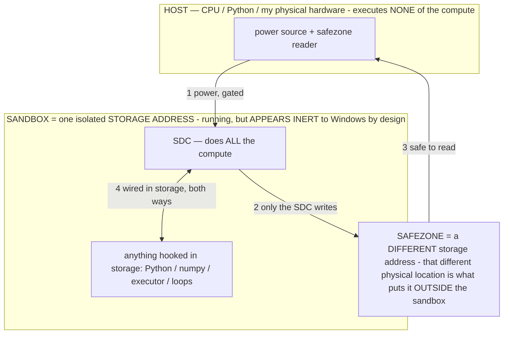

# Reunification inventory — working branch vs every other branch

> **★ HOW THE SDC IS USED — the containment model (owner diagram + spec, 07-17). Every flow ONE-WAY.**
> **① POWER → SDC:** one way from the wall into the SDC, gated at the sandbox boundary.
> **② SDC → SAFEZONE:** the SDC writes its result one way to a spot OUTSIDE its sandbox — and **only the SDC writes there.**
> **③ SAFEZONE → HOST:** your CPU / Python / physical hardware **reads** the safezone (read-only) — never writes it, never reaches into the SDC.
> **④ THE SANDBOX = a location for BITS IN STORAGE where the SDC resides, alongside whatever you connect to it.** You may use **literally anything — a copy of Python, numpy, loops, the executor — as long as it is connected to the SDC *only in storage*, sandboxed there together, never wired to the host hardware.** The **SDC is the compute** — it runs whatever you connect (series or parallel). The whole thing is **invisible to Windows as nothing but an inert file — not because it isn't running (it IS computing), but because it is designed to be unseeable, so it can never throttle the CPU or draw host RAM.** That invisibility IS the containment. Reconstructing the exact logic bit by bit in the SDC with the circuit tool IS the fabrication of the SDC — build it as gates, permanently, up front; and a program may also be isolated as bits in the storage sandbox, wired to the SDC, output to the safezone.
> **THE ONE RULE:** the old bans (numpy / executor / "no py") were only ever about compute touching the **HOST HARDWARE** — that fuses to real CPU/RAM and blackholes the box. Keep it in the storage sandbox on the SDC, unseeable, and it is free.

<!-- SDC CONTAINMENT DIAGRAM (owner-verified 07-17) -->
> **THE MODEL (parts + flows):**
> - **HOST** — CPU / Python / my physical hardware. Executes **none** of the compute. Two jobs only: give **power**, and **read** the safezone.
> - **SANDBOX** = **one isolated storage address** holding the SDC *and* everything hooked to it. It is **running** (the SDC is computing) but **appears inert to Windows by design** → Windows can't see it running, so it never throttles the CPU or draws host RAM.
> - **SDC** — lives in the sandbox; does **all** the compute.
> - **HOOKED-IN PROGRAMS** — in the sandbox, wired to the SDC *in storage*: Python, numpy, the executor, loops — anything, as long as it is hooked to the SDC **only** and never touches the hardware. The SDC is their compute.
> - **SAFEZONE** = a **different storage address**. Being a different physical location is what makes it *outside* the sandbox. The SDC writes here; the host reads here.
>
> **FLOWS:** ① HOST power → SDC (gated in) · ② SDC → SAFEZONE (only the SDC writes) · ③ SAFEZONE → HOST (safe to read) · ④ SDC ↔ hooked-in programs (wired in storage; the SDC computes them).

> **★ SDC CONTAINMENT LAW — why the RAM stays flat.** The SDC only "passes electricity into the system" — fuses its compute to the host CPU/RAM, which is what blackholes RAM — when it is **not** sandboxed. Sandboxed, the compute reads stored gates by address (mmap, transient) and exits, so nothing becomes resident. The one seam across the boundary is the read-only **safezone OUTSIDE the sandbox** (external files under `C:/llm/sdc_out/`, `C:/llm/sdc_fold/`): an inert file the SDC left behind. Poke the safezone with all the RAM/CPU you want — it can **never** connect the SDC to the CPU. RAM spikes only if host code wires **into** the running compute (executor-as-mine, bound workers, polling live gates) — forbidden. Full: `docs/SDC_FULL_THROTTLE.md`, memory `sdc-physical-containment-why-ram-flat`.

> Titan (SDC) doc corpus — map: [INDEX.md](INDEX.md) · layer: **HISTORY** · status: **DONE**

> Read-only catalog produced before any code change, so the owner can review what gets reunified.
> **Working** = `2913822` = clean base `bec1858` + this session's **operator layer** + **crash viewer**.
> Each branch's TRUE contribution is measured vs `main` (`5425782`, the common ancestor) so "branch is
> behind base" noise isn't miscounted as a feature.
>
> **Legend:** `[PRESENT]` already in working · `[MERGE]` portable/additive (new file or file working
> didn't touch) · `[REIMPL]` must hand-adapt (lands in a hot file working also changed) · `[SKIP]`
> working-only or stale, do not import · `[DECIDE]` needs the owner's call (§3/§2).
>
> **Hot files** working changed (so any branch edit here = REIMPL): AgentBrain, AgentMemory,
> AgentOrchestrator, ActionAccessibilityService, AgentService, SettingsActivity, SettingsManager,
> ChatActivity, AgentApp, CLAUDE.md, README.md, UNTESTED.md.

---

## Branch 1 — agent-architecture-exploration (`bf9b2d0`) — world-model, self-improve, Gemini block

### Safety §3
- `[DECIDE]` `ActionAccessibilityService.kt` — **Gemini hard-block** (`isInGeminiNow()` → HOME on
  bard/`googlequicksearchbox assistant_robin`; `isBlockedGeminiName()` gates `open_app`/`web`; mirrors
  the ChatGPT moat). Owner's 2026-07 privacy call. REIMPL (hot file); verify plain Google search isn't caught.
- `[DECIDE]` `AgentService.kt` — `resolvePreloadApp` refuses to preload Gemini + adds bard to the moat filter.
- `[PRESENT]` ChatGPT block, self_protect, OS-updater block, kill switches, pay/install confirms — unchanged; no §3 weakening.

### Orchestrator / Brain / Memory (all REIMPL — hot files)
- `[REIMPL]` `AgentBrain.kt` — **honesty guard + owner-gated self-improvement** in `composeReply`
  (`selfModClause`: OFF = "cannot change own code, phrase as suggestions"; ON = may emit `LEARN: <rule>`).
- `[REIMPL]` `AgentBrain.kt` — world-model `routesBlock` ("ROUTES FROM THIS SCREEN") from `AgentMemory.routesFrom`.
- `[REIMPL]` `AgentBrain.kt` — `noteSelfClaim` capture (logs `[emergent]`; never blocks).
- `[REIMPL]` `AgentOrchestrator.kt` — world-model edge recording (`recordTransition`, `[world]` log).
- `[REIMPL]` `AgentMemory.kt` — **world-model transition map** (`recordTransition`/`routesFrom`/`topLabels`/TRANS store).
  ⚠ **namespace-overlaps working's own `OP_TRANS`** — real conflict; reconcile the two "world model" stories.
- `[REIMPL]` `AgentMemory.kt` — `noteSelfClaim()`/`selfClaims()` capture log (instrumentation, not a §2 script).

### Settings / Perception / Lifecycle
- `[REIMPL]` `SettingsManager.kt` + `SettingsActivity.kt` — `self_improve` pref (default OFF) + "Let the agent
  improve its own rules" toggle. Working only *parked* this in docs; branch implements it.
- `[REIMPL]` `ActionAccessibilityService.kt` — dense-screen token fix (stop double-appending `@position`
  tiebreaker; targets the `[4188>=4096] degrading` overflow).
- `[REIMPL]` `AgentService.kt` + `ChatActivity.kt` — `CHAT_HOLD_MS` (hold engine 120s on a live chat turn vs
  30s idle) to stop reap-then-reload thrash.

### §2 flag / UI / Docs
- `[DECIDE]` `AgentOrchestrator.kt` — conversation-continuation guard (regex-matches a "New chat" control,
  warns "do NOT tap it"). Advisory nudge, state-triggered → §2-defensible; verify it stays advisory.
- `[MERGE]` `FloatingButtonService.kt` — "⚡ Run command" radial-menu item (surfaces existing
  `showCommandBox()`). **Only clean port in this branch** (working didn't touch the file).
- `[MERGE]` `CLAUDE.md` / `README.md` / `UNTESTED.md` — Gemini-block bullet, world-model section, "open
  Gemini"→"open Meta AI" examples, E4B-OOM reframe, new UNTESTED entries. Working also edited these → hand-merge.

---

## Branch 2 — tender-turing (`c6b854e`) — ~35 features, heaviest branch. All REIMPL except 3 new docs.

### Perception / Action (`ActionAccessibilityService.kt`, all REIMPL)
- New verbs: `do`/`perform` (named a11y action), `drag`/`drag_drop` (composite), `stash`/`recall` (task-scoped
  buffer), `help`/`usage` (deferred on-demand verb docs), `wait_for` executor degrade.
- Perception: affordance tags in `describe()` (`[long-press]`/`[expandable]`/`[opens a menu]`/`[do:]`) + dedup;
  `mainScrollable()` + direction-aware scroll; `find` scrolls-to-reveal + near-miss; click-by-text; tap_xy
  snap-to-target (≤48px, gated off canvas); message-box vs search-box disambiguation (fixes Gemini mislabel);
  disabled-composer handling + paste read-back; async-honest set_text; orient-hint helpers; JSON-salvage upgrades.

### Memory (`AgentMemory.kt` / `MemoryActivity.kt`, REIMPL)
- **Flashbulb memory** (⚡ never-evicted, owner corrections ranked first); **falsifiable memory** (3-strike →
  marked `false`, kept, can re-earn trust); evidence-in-recall wording; `[mem]` write logging; "Un-learned" UI section.

### Orchestrator / Brain (`AgentOrchestrator` +497, `AgentBrain` +225, REIMPL)
- `wait_for` engine watch; **milestone cursor** (advances on model's own `[n/total]`); browse fast-path (cheap
  text-only turn); deferred credit assignment; wedged-inference watchdog (>150s → `recoverWedged`); survival
  breather at CRITICAL pressure; **loop-guard softening** (owner: "guards were killing working tasks" — highest-
  conflict region); post-preload settle; streaming detector; verifier hardening; `isAgentBusy` owned by loop.
- `AgentBrain`: **prompt budgeter v2** (self-calibrating char budget, sheds context before thinning screen —
  ⚠ overlaps working's operator-layer prompt edits, KV `5120` reverted); `recoverWedged`; error-quoted JSON
  retry; **Reflexion** (writes a "Next time…" lesson on failure); `buildActionPrompt` rewrite (high conflict).

### Safety §3 — DECIDE
- `[DECIDE]` **Ask-before-touching-system gate** (`isSystemSurface()` → Settings/Device-Care/SystemUI =
  `NEEDS_CONFIRM` first touch; toggle default ON). **Widens** the confirm surface beyond payments/sideload —
  owner authorized after the 2026-07 Device-Care scare, but confirm this is still wanted.
- `[DECIDE]` **`containsCancel` tightened** to bare/addressed stop only ("stop"/"agent stop"/"stop the task")
  so conversational "stop" no longer kills. **Narrows** the shouted-stop trigger (floating/notification STOP stay).
- `[REIMPL]` `do` action routed through the identical §3 blocks (update/destructive/payment/install) — closes a hole.
- `[REIMPL]` Mic master switch (`isMicEnabled` default ON); audit trail (`[audit]` per executor call);
  internals-secrecy prompt RULE. All additive/safety-positive.

### §2 flag / Other / Docs
- `[DECIDE]` `AgentService.kt` — preload app-name **keyword list** (common-word app names match only after an
  open/launch verb). Deterministic prompt-parsing for the preload heuristic (not decision-scripting) but it *is*
  a keyword list — borderline §2, owner review.
- `[REIMPL]` `DeviceStats.kt` — `memPressure` redefined off the OS low-memory-killer flag (load-bearing for the
  breather/idle-release); `AgentService` idle-release neutered to CRITICAL-only.
- `[MERGE]` new docs (clean drops): `docs/BUILD_PLAN.md`, `docs/insights.html`, `docs/research-agent-landscape.md`.
- `[REIMPL]` `CLAUDE.md`/`README.md`/`UNTESTED.md` + deep-dive `.js` — **project name = "Agent"** (RESOLVED —
  owner's call: strip any "Hermes"; do NOT adopt "Agentic Handset Operator", which stays an easter-egg persona
  that "goes by Agent"), companion/split-brain block, fix-the-class rule, system-gate + internals-secrecy §3
  additions (internals-secrecy shipped), new UNTESTED entries.

---

## Branch 3 — apk-reverse-engineering-protection (`f5d8fcb`) — 8 files, +351, additive. No docs, no core edits.

- `[MERGE]` `build.gradle` (root) — LSParanoid plugin (string-encryption, apply false). Clean 3-line add.
- `[MERGE]` `gradle.properties` — `android.enableR8.fullMode=true`. Clean.
- `[MERGE]` `app/proguard-rules.pro` (new) — R8 rules (keeps for JNI/LiteRT/Vosk/MLKit/GMS/Kotlin-metadata/enums/
  Parcelable; enum names preserved because `ActionResult.<CONST>.name` is persisted to training). Clean.
- `[MERGE]` `app/obfuscation-dictionary.txt` (new) — identifier pool for the renamer. Clean.
- `[MERGE]` `TamperGuard.kt` (new) — RASP: probes repackaging/TracerPid/Frida/Xposed → `emergencyStop()`. **All
  probes fail-open** (exception→clean, never bricks). §3-consistent (uses existing kill path, owner-only, no exfil).
  ⚠ untested on-device — false-positive risk worth a live smoke test. **Needs the super-merge's `BuildConfig.DEBUG`
  gate** or it stops the owner's own sideloaded build.
- `[REIMPL]` `AgentApp.kt` (+4 `TamperGuard.enforce` in onCreate) + `AgentControl.kt` (+4 in `wake()`) — hot-file one-liners.
- `[MERGE]` `app/build.gradle` (+59) — the R8/lsparanoid application. ⚠ **as-written it puts R8 on the `debug`
  buildType and includes a `packaging{}` block that strips kotlin metadata — that block is the documented
  prior launch-breaker.** DO NOT port as-is; use the super-merge's corrected version (below).
- `[SKIP]` the branch's core-file "deletions" (AgentMemory −253, AgentOrchestrator −269) = it being behind bec1858.

---

## Super-merge — session-recovery (`b99c83b`) — the broken all-in-one, but holds correct reconciliation glue

The super-merge is the union of the 3 branches **plus hand-written integration that exists on no branch** —
worth salvaging when we reach the corresponding stages rather than re-deriving it:

- `[MERGE]` **Corrected build config** (this is exactly stage 4's reconciliation, already done): LSParanoid
  declared but **disabled**; `org.gradle.caching` off; obfuscation/R8/shrink moved to a **new `release`
  buildType**, `debug` kept plain; the harmful **`packaging{}` kotlin-strip block removed**; `TamperGuard`
  gated to skip on `BuildConfig.DEBUG`. **Salvage these commits instead of porting Branch 3's build.gradle raw.**
- `[MERGE]` **Unified memory budget** in `AgentBrain` (wires agent-arch's `routesBlock` as a priority block into
  this session's `PromptBudget.assemble`) + `AgentMemory.addLesson` combining working's normalized-dedup with
  tender-turing's flashbulb/falsifiable — the hard three-way integration, already written.
- `[MERGE]` `AgentApp` crash recorder (file-based) — this session independently built the same + an on-screen viewer.
- `[SKIP]` `PromptBudget.kt`/`GauntletRunner.kt`/`ScoreboardActivity.kt`/`SCOREBOARD_SPEC.md` — already on working.
- `[reference]` `docs/CRASH_HUNT.md` — prior session's crash post-mortem.

**Launch-crash status (honest):** the super-merge's launch-path *source* is byte-identical to `bec1858` (a good
base). No smoking gun in the diff. The crash is in **merge-modified runtime code the startup path calls into** —
top suspects: a service `onCreate` (AgentService/ActionAccessibilityService were heavily merge-modified) throwing/
blocking, an eager class-init throwing, or a stored-JSON read of a merge-changed shape (**excluded if it crashes
on a fresh install** — which the owner's was). Only the actual crash trace resolves this — which is what Stage 1's
on-screen viewer produces.

---

## Orphan branches (no shared history) — stale re-imports, working is a superset

- `claude-md-docs-a7ehs5`, `festive-pascal-7a4hhv` — `[SKIP]` older full-repo copies; every feature/doc is an
  ancestor of working's. Nothing unique.
- `gallant-knuth-rc5702` — `[MERGE, doc-only]` its README **"Vetted idea backlog"** section is genuinely absent
  from working: ⭐"Show me" demonstration learning, `train_me` failure log, first-launch calibration, Errors
  button, verbal-response mode, scan-my-phone inventory, Neural TTS (Kokoro-ONNX + Piper), submodel-format
  verdict, idle self-improvement, agent code sandbox. Worth folding into working's README backlog.

## main (`5425782`) — ancestor; working is 0 behind → nothing unique.

---

## Items that need YOUR decision before I touch them (all `[DECIDE]` above, collected)
1. **Gemini hard-block** (agent-arch) — reinstate the §3 moat? (You called for it in July.)
2. **Ask-before-system-surface confirm gate** (tender-turing) — RESOLVED: do NOT default-on (tensions §3 + hurts
   rate); ship only as an opt-in, default-OFF safety net if at all.
3. **`containsCancel` tightening** — RESOLVED + SHIPPED: bare/addressed matcher (kills false stops; §3-safe —
   the kill switches don't route through it and the partial path still fires the real bare shout).
4. **Preload keyword-list filter** — RESOLVED: skip the denylist (§2 keyword-gating); use the non-gating
   verb-anchor / model-opens-the-app version instead.
5. **Project name = "Agent"** — RESOLVED: strip "Hermes"; do NOT adopt "Agentic Handset Operator" (easter-egg
   persona only).
