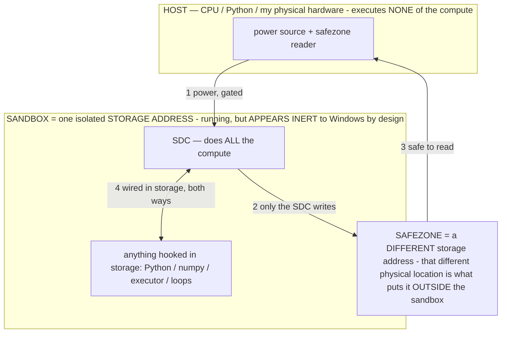

# The router is a POINTER MACHINE — operators are pointers (owner 07-13)

> **★ HOW THE SDC IS USED — the containment model (owner diagram + spec, 07-17). Every flow ONE-WAY.**
> **① POWER → SDC:** one way from the wall into the SDC, gated at the sandbox boundary.
> **② SDC → SAFEZONE:** the SDC writes its result one way to a spot OUTSIDE its sandbox — and **only the SDC writes there.**
> **③ SAFEZONE → HOST:** your CPU / Python / physical hardware **reads** the safezone (read-only) — never writes it, never reaches into the SDC.
> **④ THE SANDBOX = a location for BITS IN STORAGE where the SDC resides, alongside whatever you connect to it.** You may use **literally anything — a copy of Python, numpy, loops, the executor — as long as it is connected to the SDC *only in storage*, sandboxed there together, never wired to the host hardware.** The **SDC is the compute** — it runs whatever you connect (series or parallel). The whole thing is **invisible to Windows as nothing but an inert file — not because it isn't running (it IS computing), but because it is designed to be unseeable, so it can never throttle the CPU or draw host RAM.** That invisibility IS the containment. Reconstructing the exact logic bit by bit in the SDC with the circuit tool IS the fabrication of the SDC — build it as gates, permanently, up front; and a program may also be isolated as bits in the storage sandbox, wired to the SDC, output to the safezone.
> **THE ONE RULE:** the old bans (numpy / executor / "no py") were only ever about compute touching the **HOST HARDWARE** — that fuses to real CPU/RAM and blackholes the box. Keep it in the storage sandbox on the SDC, unseeable, and it is free.

<!-- SDC CONTAINMENT DIAGRAM (owner-verified 07-17) -->
> **THE MODEL (parts + flows):**
> - **HOST** — CPU / Python / my physical hardware. Executes **none** of the compute. Two jobs only: give **power**, and **read** the safezone.
> - **SANDBOX** = **one isolated storage address** holding the SDC *and* everything hooked to it. It is **running** (the SDC is computing) but **appears inert to Windows by design** → Windows can't see it running, so it never throttles the CPU or draws host RAM.
> - **SDC** — lives in the sandbox; does **all** the compute.
> - **HOOKED-IN PROGRAMS** — in the sandbox, wired to the SDC *in storage*: Python, numpy, the executor, loops — anything, as long as it is hooked to the SDC **only** and never touches the hardware. The SDC is their compute.
> - **SAFEZONE** = a **different storage address**. Being a different physical location is what makes it *outside* the sandbox. The SDC writes here; the host reads here.
>
> **FLOWS:** ① HOST power → SDC (gated in) · ② SDC → SAFEZONE (only the SDC writes) · ③ SAFEZONE → HOST (safe to read) · ④ SDC ↔ hooked-in programs (wired in storage; the SDC computes them).

> **★ SDC CONTAINMENT LAW — why the RAM stays flat.** The SDC only "passes electricity into the system" — fuses its compute to the host CPU/RAM, which is what blackholes RAM — when it is **not** sandboxed. Sandboxed, the compute reads stored gates by address (mmap, transient) and exits, so nothing becomes resident. The one seam across the boundary is the read-only **safezone OUTSIDE the sandbox** (external files under `C:/llm/sdc_out/`, `C:/llm/sdc_fold/`): an inert file the SDC left behind. Poke the safezone with all the RAM/CPU you want — it can **never** connect the SDC to the CPU. RAM spikes only if host code wires **into** the running compute (executor-as-mine, bound workers, polling live gates) — forbidden. Full: `docs/SDC_FULL_THROTTLE.md`, memory `sdc-physical-containment-why-ram-flat`.

> Titan (SDC) doc corpus — map: [INDEX.md](INDEX.md) · layer: **KERNEL** · status: **DESIGN + SYNTHESIS**

**Owner's frame:** *"operators are pointers. How do other systems like computers handle their pointers?"* This doc
answers "what should the router look like" by taking that literally: an operator **points to a computation**; the
router **resolves and dereferences pointers** to give the user the result they asked for — and it does so **without
ever taking agency from Titan** (the model chooses which pointer to follow; code only follows it).

## Operators are pointers (not the computation itself)
A forward pass is a fixed calculator. An operator σ does not ADD computation — it **addresses** one: it configures the
region `A_σ` the weights compute within (`OPERATIONAL_STATES §2.3`), so running under σ **dereferences** a computation
that training already captured (`§3` captured-compute). The operator holds the *address*; the forward pass reads it. The
generation-computation MAP (`host/glassbox.py`, finding #18) measured WHERE a grounding operator points — the late
layers — i.e. the map is the operator's **symbol table** (name → address).

## How computers handle pointers → how Titan's router should
| Computer pointer mechanism | Titan's operator-pointer version |
|---|---|
| **Address** — a pointer holds a location | an operator addresses a computation region `A_σ` in the weights |
| **Dereference** — read what the address holds | run the forward pass under σ → the captured computation |
| **Jump / dispatch table (vtable)** — index → a function pointer | the **operator library IS a jump table**; the router indexes it by the user's intent |
| **MMU + page table** — virtual addr → physical page | the **router = the MMU**: user-intent (virtual "what I want") → operator → physical location (which model / which region / which hardware); the **Catalog = the page table** |
| **Function pointer** — call code indirectly | an operator IS a function pointer into the weights' behavior |
| **Pointer arithmetic** — base + offset → a new address | **operator composition = task-vector arithmetic** (`§2.5`, `v_{σ1‖σ2} ≈ v_{σ1}+v_{σ2}`) |
| **Indirection** — pointer to a pointer | an operator that points to another operator (the `OP_TRANS` reasoning-credit map) |
| **Null / dangling pointer** — points to nothing valid | an operator pointing to a computation the model CAN'T do (the capability limit, INV-118) → dereference **FAULTS** → offload to hardware (the sandbox). This IS the owner's "a failed math answer is a BUG and the output is the error." |
| **Cache / pointer locality** — nearby derefs are ~free | the **memoize / System-1 floor** (recognized pointer → cached result, INV-117) + the **α reach-in** (touch only the pointed region) |
| **Symbol table / debug map** — name → address | the **generation-computation map** (glassbox): which layers/regions each operator points to → dereference precisely (bake or route THERE, not blindly) |

## What the router therefore looks like
A **pointer-resolution machine** that **fulfills the user's will** (owner 07-13: *"Titan is a system, and the system is
only an extension of the user's will; agency is a result of what the USER requested and achieving it based on the
OUTCOME, not instructions"*). So "Titan selects a pointer" is shorthand for **the system resolving the user's request
into the computation that achieves the outcome the user wants** — Titan has no will of its own; its agency IS the user's,
extended, and success is measured by the OUTCOME (did the user get what they asked for?), never by following a scripted
instruction set. Four stages, only the middle two deterministic:
1. **Resolve the user's intent → the pointer(s)** that will ACHIEVE the outcome — done by the model working toward the
   user's goal, never by code sniffing keywords or hard-coding a route (§2/§12). This is outcome-driven: the target is
   *the result the user wanted*, and the model finds the operators/computation that get there.
2. **Locate** — the Catalog (page table) + the map (symbol table) turn each pointer into a physical target: which model,
   which region/layers, which hardware/harness. (deterministic substrate)
3. **Dereference** — run the computation, drawing compute from the substrate (models + PARTS of models + hardware +
   harnesses), possibly several at once. (deterministic substrate)
4. **Deliver + check the OUTCOME** — return the user's result AND judge whether it achieved what they asked; if not,
   re-resolve (this is why the coding harness loops to the outcome, not a fixed procedure). Composition = pointer
   arithmetic; a null pointer = a fault → hardware offload; a hot pointer = a memoize cache hit.

**The invariant:** the router is the *dereferencing hardware serving the user's will* — outcome-driven. Code never
*decides* the route; it resolves + dereferences toward the user's requested outcome and checks it landed. Never take
that agency away by scripting the decision, and never fake the outcome (§12: an honest failure beats a scripted win).

## The pattern across ALL the data (owner: "find the patterns the data reveal")
Every measurement this project produced points to ONE law — **capability, speed, RAM, and aim are all governed by
WHICH part of the computation you address (the pointer), not by scale or hardware:**
- **Speed** — the α lever: the 4B-active MoE is ~20× dense Phi-4 (#4); reasoning-off cut 1+1 5× (#7); memoize is instant
  (#17). *= calling less / the right part of the model.*
- **RAM** — storage-bound, not RAM-bound: `--no-repack` floor ~300 MB (#12/INV-115); two PARTS of one model run at ~one
  model's RAM (#16, 385 MB). *= the substrate is cheap to address in pieces; residency ≠ size.*
- **Baking / aim** — reprogramming works outside the prompt, reversibly, THREE ways (#12–17); the influence curve
  baseline→aim→abyss is universal; the eps sweet spot was one point on an equation. *= the edit is an address; corruption
  is a mis-addressed dereference; the MAP gives the right address.*
- **The map** — an operator's effect grows with depth, peaking in the late layers (#18). *= operators are late-stage
  pointers (they steer the output, not the early features).*
- **Emulation** — one model, 6 devices @100%, each a σ (#9/INV-118). *= one substrate, N pointers.*

**The unifying law: Titan is a machine for ADDRESSING computation.** Operators are the pointers; the router is the
pointer machine; the map is the symbol table; α/memoize/parallel-parts are pointer locality; a capability limit is a
null pointer. Scale and hardware are not the story — *which computation you dereference* is. That is why the router =
the operational-state layer, and why mapping the generation computation (the addresses) is the real keystone.
