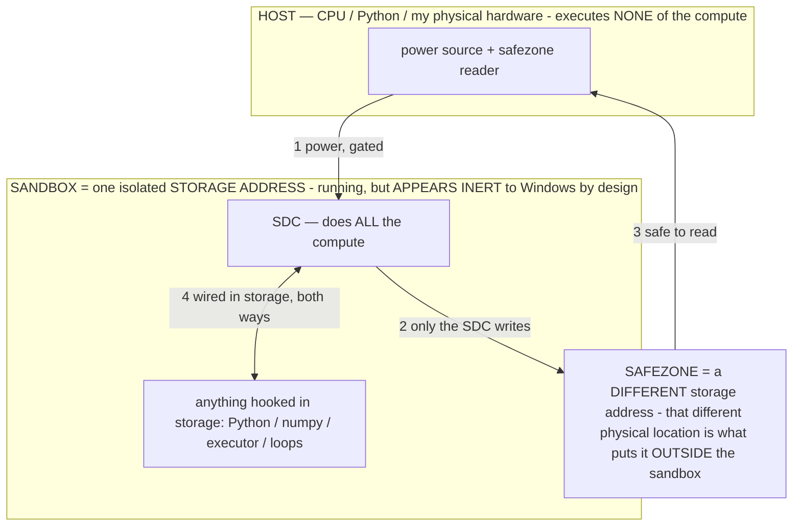

# SPEC: Scoreboard + Gauntlet — make the ONE metric visible

> **★ HOW THE SDC IS USED — the containment model (owner diagram + spec, 07-17). Every flow ONE-WAY.**
> **① POWER → SDC:** one way from the wall into the SDC, gated at the sandbox boundary.
> **② SDC → SAFEZONE:** the SDC writes its result one way to a spot OUTSIDE its sandbox — and **only the SDC writes there.**
> **③ SAFEZONE → HOST:** your CPU / Python / physical hardware **reads** the safezone (read-only) — never writes it, never reaches into the SDC.
> **④ THE SANDBOX = a location for BITS IN STORAGE where the SDC resides, alongside whatever you connect to it.** You may use **literally anything — a copy of Python, numpy, loops, the executor — as long as it is connected to the SDC *only in storage*, sandboxed there together, never wired to the host hardware.** The **SDC is the compute** — it runs whatever you connect (series or parallel). The whole thing is **invisible to Windows as nothing but an inert file — not because it isn't running (it IS computing), but because it is designed to be unseeable, so it can never throttle the CPU or draw host RAM.** That invisibility IS the containment. Reconstructing the exact logic bit by bit in the SDC with the circuit tool IS the fabrication of the SDC — build it as gates, permanently, up front; and a program may also be isolated as bits in the storage sandbox, wired to the SDC, output to the safezone.
> **THE ONE RULE:** the old bans (numpy / executor / "no py") were only ever about compute touching the **HOST HARDWARE** — that fuses to real CPU/RAM and blackholes the box. Keep it in the storage sandbox on the SDC, unseeable, and it is free.

<!-- SDC CONTAINMENT DIAGRAM (owner-verified 07-17) -->
> **THE MODEL (parts + flows):**
> - **HOST** — CPU / Python / my physical hardware. Executes **none** of the compute. Two jobs only: give **power**, and **read** the safezone.
> - **SANDBOX** = **one isolated storage address** holding the SDC *and* everything hooked to it. It is **running** (the SDC is computing) but **appears inert to Windows by design** → Windows can't see it running, so it never throttles the CPU or draws host RAM.
> - **SDC** — lives in the sandbox; does **all** the compute.
> - **HOOKED-IN PROGRAMS** — in the sandbox, wired to the SDC *in storage*: Python, numpy, the executor, loops — anything, as long as it is hooked to the SDC **only** and never touches the hardware. The SDC is their compute.
> - **SAFEZONE** = a **different storage address**. Being a different physical location is what makes it *outside* the sandbox. The SDC writes here; the host reads here.
>
> **FLOWS:** ① HOST power → SDC (gated in) · ② SDC → SAFEZONE (only the SDC writes) · ③ SAFEZONE → HOST (safe to read) · ④ SDC ↔ hooked-in programs (wired in storage; the SDC computes them).




> **★ SDC CONTAINMENT LAW — why the RAM stays flat.** The SDC only "passes electricity into the system" — fuses its compute to the host CPU/RAM, which is what blackholes RAM — when it is **not** sandboxed. Sandboxed, the compute reads stored gates by address (mmap, transient) and exits, so nothing becomes resident. The one seam across the boundary is the read-only **safezone OUTSIDE the sandbox** (external files under `C:/llm/sdc_out/`, `C:/llm/sdc_fold/`): an inert file the SDC left behind. Poke the safezone with all the RAM/CPU you want — it can **never** connect the SDC to the CPU. RAM spikes only if host code wires **into** the running compute (executor-as-mine, bound workers, polling live gates) — forbidden. Full: `docs/SDC_FULL_THROTTLE.md`, memory `sdc-physical-containment-why-ram-flat`.


> Titan (SDC) doc corpus — map: [INDEX.md](INDEX.md) · layer: **KERNEL** · status: **SPEC**

> **Status: approved-pending-owner-yes; NOT built.** This spec is written so any capable model
> (or the owner) can build it without the original session's context. Read `CLAUDE.md` first —
> especially §2 (philosophy), §10 (conventions), §12 (success-rate rules). Everything here is
> MEASUREMENT and OWNER UI: it must never script the agent's decisions or manufacture a success.

## Why this is the thing the project needs (300-foot view)

The owner's stated ONE metric is task success rate — and it is currently **unmeasured**. Every
session ships "should help" changes; `UNTESTED.md` is a growing IOU list; whether a build actually
raised the success rate is vibes from memory. The two most valuable properties this feature buys:

1. **Per-build trend**: TaskHistory already stamps every entry with the APK build (`build` field =
   `lastUpdateTime`). Group by build → success %, avg steps, avg duration per build → the owner
   SEES whether the last round of changes helped or hurt. Regression detection for free.
2. **A repeatable benchmark ("the Gauntlet")**: a fixed list of standard tasks run back-to-back on
   demand, scored automatically. Same tasks every build = the honest, comparable number. This also
   systematically exercises the UNTESTED list and feeds the data flywheel (TrainingData captures
   every gauntlet step for the future fine-tune).

Philosophy check (§12): a gauntlet run is the agent doing tasks ON ITS OWN — completions are real,
failures are real signal. The runner only queues objectives and records outcomes. It never feeds
the agent hints it wouldn't normally get, never retries-with-coaching, never auto-confirms.

## Part 1 — richer task stats (small, do first)

**`TaskHistory.kt`**: extend `add(...)` with optional params (defaults keep existing callers
compiling): `durationMs: Long = 0`, `failureClass: String = ""`, `gauntlet: Boolean = false`.
Store as `"dur"`, `"fclass"`, `"gauntlet"` in the JSON entry; extend `Entry` + `list()` to read
them back. Do NOT touch the id/dedupe/cap logic (hard-won — see the file's header comment).

**`AgentOrchestrator.kt`**: it already knows `startTime` and `totalSteps`, and the failure
taxonomy (`[failure] NAVIGATION — …`, written near the give-up paths) classifies give-ups. Thread
`durationMs = now - startTime` and the failure class into whatever the service reads at task end
(find the existing finish → AgentService handoff; AgentService calls `TaskHistory.add` at ~line
176 (finish/stop with `success`), ~1009 (deterministic commands), ~1200 (stop path)). The
simplest route: expose the last run's stats on the orchestrator (`lastRunDurationMs`,
`lastRunFailureClass`) and read them at the `TaskHistory.add` call sites.

## Part 2 — ScoreboardActivity (owner UI)

New `ScoreboardActivity.kt`, programmatic UI only (NO XML — copy the structure of
`TaskLogActivity`/`MemoryActivity`: `ScrollView` + `LinearLayout`, `Ui.BG`/`Ui.TEXT`/`Ui.styleButton`,
raw px padding). Register it in `AndroidManifest.xml` next to the other activities.

Content, top to bottom:
- **Headline**: success rate over the last 30 tasks. A task counts SUCCESS iff `rating == 1` OR
  (`outcome == "finished"` AND `rating != -1`); FAIL iff `rating == -1` OR `outcome == "stopped"`
  (unrated). Owner rating always outranks the recorded outcome — same rule as
  `TaskHistory.failureHintFor`. Show as "17/23 (74%)" + a plain-language line.
- **By build** (the trend): group entries by their `build` field, newest ~5 builds, one row each:
  date (from the newest entry's time), success %, avg steps, avg duration. Mark the current build.
  This is the regression view — keep it a simple table of TextViews.
- **Failure classes**: count of `fclass` values over the same window (NAVIGATION 3 · RECOGNITION 1…)
  so the owner sees WHERE it fails, matching the `[failure]` taxonomy.
- **Gauntlet section**: last gauntlet score ("6/8 on build <date>"), a "Run gauntlet" button, and
  an editable task list (see Part 3).

Entry point: a "Scoreboard" button at the top of `TaskLogActivity` (beside the existing header),
plus optionally from MainActivity if it fits the clean-home-screen bar (§12 design bar: tuck
power features away; Task log is the natural neighbor).

## Part 3 — the Gauntlet runner

**Storage**: the task list lives in `SettingsManager` as a JSON array string
(`gauntlet_tasks`). Defaults (harmless, no sends to real people, no payments — DO NOT add
consequential tasks as defaults):
```
open YouTube and search for cat videos
open Chrome and search the weather
set an alarm for 9am then delete it
draw a simple house in Samsung Notes
open Gemini and ask it what day it is
open Settings and read the battery percentage back to me
```
Owner can add/remove/reset in the Scoreboard screen (simple list + delete + add-field, like
MemoryActivity's deletable lines).

**Runner**: a small `object GauntletRunner` (companion-instance style, like the services —
null-safe access everywhere):
- `start(context, tasks)`: stores the queue + marks running; fires the first task via
  `startForegroundService(Intent(ctx, AgentService::class.java).setAction(AgentService.ACTION_RUN_COMMAND)
  .putExtra(AgentService.EXTRA_COMMAND, task))` — the exact pattern TaskLogActivity's
  "▶ Run this task again" uses.
- **Completion signal**: at each `TaskHistory.add` call site in AgentService, after the add, call
  `GauntletRunner.onTaskEnded(applicationContext, objective, outcome)`. If the runner isn't
  running or the objective doesn't match the current gauntlet task, it's a no-op (one line, no
  behavioral risk to normal tasks).
- Between tasks: press home (`ActionAccessibilityService.instance?.performActionJson("{\"action\":\"home\"}", allowGated = true)`),
  wait ~4s (Handler postDelayed, main looper), then fire the next task. Tag the finished entry
  gauntlet=true via `TaskHistory` (either pass through add, or set on the matching entry by id).
- **Timeout fallback**: when firing a task, also postDelayed a 25-minute watchdog (longer than
  MAX_RUNTIME_MS = 20 min, so the agent's own caps fire first); if it triggers and the runner is
  still on that task, record it failed ("gauntlet timeout") and move on. Cancel it in onTaskEnded.
- **Kill switches**: the floating STOP / notification Stop / "stop" already stop the agent; the
  runner must ALSO stop the whole gauntlet when a task ends with a user-stop (outcome "stopped"
  arriving <20s after a manual stop is indistinguishable from a give-up — simplest rule: a
  "Stop gauntlet" button in the Scoreboard + stop the queue whenever AgentControl's emergency
  stop fires). NEVER auto-restart a task the owner stopped.
- **Scoring**: success = the same rule as Part 2 (outcome "finished"; the premature-done vetoes
  already guard false positives). Show the score + per-task ✓/✗ list at the end (notification +
  the Scoreboard section). Failures are DATA — do not retry them within the run.

## Guardrails (do not violate)

- Measurement only. No code path may nudge, hint, retry-with-coaching, or force actions during a
  gauntlet run. If tempted, re-read CLAUDE.md §2/§12: a scripted success is worth nothing.
- Gauntlet defaults must stay harmless (no messaging real contacts, no purchases, no settings
  changes beyond an alarm that's deleted). The owner may add riskier tasks himself — that's his
  call, not a default.
- Don't break `TaskHistory`'s id/dedup/cap invariants (its header comment lists three bugs they
  fixed — read it).
- Keep every new log line terse and diagnostic, tag `[gauntlet]` (e.g. "task 3/8 started",
  "3/8 ✓ finished in 4m02s (23 steps)", "gauntlet done: 6/8").
- Update `UNTESTED.md` (new section: what to watch — per-build table populates, gauntlet runs all
  tasks unattended, timeout path, stop kills the queue) and the README shipped log.
- Build check: push and confirm the `android.yml` CI run is green (no local SDK).

## Suggested commit split
1. TaskHistory stats + orchestrator/service threading (Part 1).
2. ScoreboardActivity + manifest + Task log entry point (Part 2).
3. GauntletRunner + Settings storage + hooks + docs (Part 3).
