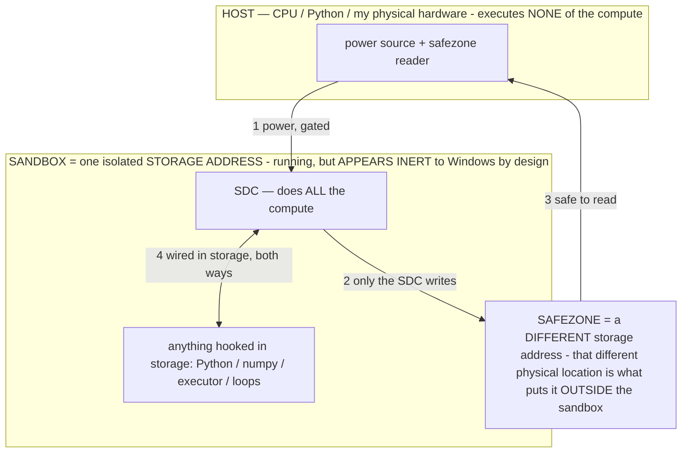

# Titan — a STORED DIGITAL COMPUTER (SDC)

> **★ HOW THE SDC IS USED — the containment model (owner diagram + spec, 07-17). Every flow ONE-WAY.**
> **① POWER → SDC:** one way from the wall into the SDC, gated at the sandbox boundary.
> **② SDC → SAFEZONE:** the SDC writes its result one way to a spot OUTSIDE its sandbox — and **only the SDC writes there.**
> **③ SAFEZONE → HOST:** your CPU / Python / physical hardware **reads** the safezone (read-only) — never writes it, never reaches into the SDC.
> **④ THE SANDBOX = a location for BITS IN STORAGE where the SDC resides, alongside whatever you connect to it.** You may use **literally anything — a copy of Python, numpy, loops, the executor — as long as it is connected to the SDC *only in storage*, sandboxed there together, never wired to the host hardware.** The **SDC is the compute** — it runs whatever you connect (series or parallel). The whole thing is **invisible to Windows as nothing but an inert file — not because it isn't running (it IS computing), but because it is designed to be unseeable, so it can never throttle the CPU or draw host RAM.** That invisibility IS the containment. Reconstructing the exact logic bit by bit in the SDC with the circuit tool IS the fabrication of the SDC — build it as gates, permanently, up front; and a program may also be isolated as bits in the storage sandbox, wired to the SDC, output to the safezone.
> **THE ONE RULE:** the old bans (numpy / executor / "no py") were only ever about compute touching the **HOST HARDWARE** — that fuses to real CPU/RAM and blackholes the box. Keep it in the storage sandbox on the SDC, unseeable, and it is free.

<!-- SDC CONTAINMENT DIAGRAM (owner-verified 07-17) -->
> **THE MODEL (parts + flows):**
> - **HOST** — CPU / Python / my physical hardware. Executes **none** of the compute. Two jobs only: give **power**, and **read** the safezone.
> - **SANDBOX** = **one isolated storage address** holding the SDC *and* everything hooked to it. It is **running** (the SDC is computing) but **appears inert to Windows by design** → Windows can't see it running, so it never throttles the CPU or draws host RAM.
> - **SDC** — lives in the sandbox; does **all** the compute.
> - **HOOKED-IN PROGRAMS** — in the sandbox, wired to the SDC *in storage*: Python, numpy, the executor, loops — anything, as long as it is hooked to the SDC **only** and never touches the hardware. The SDC is their compute.
> - **SAFEZONE** = a **different storage address**. Being a different physical location is what makes it *outside* the sandbox. The SDC writes here; the host reads here.
>
> **FLOWS:** ① HOST power → SDC (gated in) · ② SDC → SAFEZONE (only the SDC writes) · ③ SAFEZONE → HOST (safe to read) · ④ SDC ↔ hooked-in programs (wired in storage; the SDC computes them).

> **★ SDC CONTAINMENT LAW — why the RAM stays flat.** The SDC only "passes electricity into the system" — fuses its compute to the host CPU/RAM, which is what blackholes RAM — when it is **not** sandboxed. Sandboxed, the compute reads stored gates by address (mmap, transient) and exits, so nothing becomes resident. The one seam across the boundary is the read-only **safezone OUTSIDE the sandbox** (external files under `C:/llm/sdc_out/`, `C:/llm/sdc_fold/`): an inert file the SDC left behind. Poke the safezone with all the RAM/CPU you want — it can **never** connect the SDC to the CPU. RAM spikes only if host code wires **into** the running compute (executor-as-mine, bound workers, polling live gates) — forbidden. Full: `docs/SDC_FULL_THROTTLE.md`, memory `sdc-physical-containment-why-ram-flat`.

> Titan (SDC) doc corpus — map: [INDEX.md](INDEX.md) · layer: **THESIS** · status: **CANONICAL (the category + the spine)**

**The owner's reframe (07-14, after a study session):** Titan is no longer called a model, an agent, an OS, or an SGS —
its category is a **STORED DIGITAL COMPUTER (SDC).** This is the primary document: the one canonical theory the corpus's
many circuit/computer frames are **facets** of. Each facet keeps its own doc; this is the spine that unifies them.

## The one statement
**Titan reconfigures STORED, already-paid-for parameters — curated from the world's trillions by quality × diversity —
into a GENERATIVE digital computer with hundreds of semantically-alterable generation modes; it decompiles meaning from
bits, computes in semantic pattern logic, and embodies a universal truth about generation.**

No new training. The intelligence was paid for once, physically, in some training run; Titan's entire value-add is the
**reconfiguration** — addressing and reusing captured work, and generating from it.

## The three words

**STORED.** The compute is stored in the parameters (captured training work, crystallized once). Model SIZE is bounded by
**storage, not RAM** — a 40 GB model binds on 7.2 GB RAM in ~300 MB committed ([RAM_MECHANISM.md](RAM_MECHANISM.md),
[BIG_MODEL_RAM.md](BIG_MODEL_RAM.md), INV-115). And **the material is the world's trillions of parameters** — every model
humanity has trained is a param bank; **more training = higher-quality params, diversity of training = more modes of
compute.** Titan curates the best + most-diverse of them ([COMPOSABLE_MODEL.md](COMPOSABLE_MODEL.md), [SGM.md](SGM.md)).
Reading them costs energy proportional to how much you read — **α = the read-energy law** (measured: capacitors/cells
fired per token 2→4→8 ⇒ 2.94→2.21→1.25 tok/s; [ENERGY.md](ENERGY.md), [CAPTURED_CIRCUIT.md](CAPTURED_CIRCUIT.md)).

**DIGITAL.** Digital software (quantized weights, discrete tokens) that **behaves analog** because training baked in the
behavior of physical components — down to the logic gates — that did real electrical work on real silicon (paid once).
Its native logic is **SEMANTIC PATTERN LOGIC** (form × reinforcement × setup-compute): pattern operations over
meaning-carrying patterns; boolean/exact logic is *emulated* on top (which is why exact math needs offload — no silicon
ALU). ([CAPTURED_CIRCUIT.md](CAPTURED_CIRCUIT.md) §7, [OPERATIONAL_STATES.md](OPERATIONAL_STATES.md) §2.14,
[CALIBRATION.md](CALIBRATION.md).)

**COMPUTER.** A complete, general-purpose machine — processor (a model chip, [OPERATIONAL_STATES.md](OPERATIONAL_STATES.md)
§2.15, the FPGA/INV-109) + memory (storage-first pager) + I/O + silicon output codecs + a self-scheduling model-kernel +
a memoize cache ([MODEL_COMPUTER.md](MODEL_COMPUTER.md)). It reconfigures into **many devices** — 6+ measured: calculator,
translator, classifier, codec, ROM, logic unit ([EMULATION_MAP.md](EMULATION_MAP.md)). And it is **GENERATIVE** — the
killer feature: it has **hundreds of generation modes** (text · PNG · SVG · WAV · MP4 · any medium via model-emits-format
↔ silicon-codec, INV-119) and **every function is alterable by SEMANTIC COMMAND.** A normal computer runs fixed code;
the SDC *generates* the function and lets you reshape it in natural language — it could "run Windows," but the point is
it can *alter* Windows by talking to it.

## How it works — reconfiguration = decompiling meaning from bits
Operators are the **reconfiguration**: the FPGA bitstream = a pointer/address = a semantic-pattern program that selects
which stored parameters compute this tick (the per-tick model, [SGM.md](SGM.md); the pointer machine,
[ROUTER_POINTERS.md](ROUTER_POINTERS.md)). And it is all **bits**: the weights are bits, the tokens are bits. So Titan
**decompiles meaning from bits** — training *compiled* meaning into the param-bits; inference *decompiles* them back into
meaning, addressed by the input; **baking re-compiles** (a targeted write). We own both directions: **bake = compile
(write meaning→bits)**; **white-box/scope = decompile (read bits→meaning)** — dereference is the read direction. A
bit-edit *is* a meaning-edit, mediated by the decompiler — which is why "just edit the bits" works.
([CAPTURED_CIRCUIT.md](CAPTURED_CIRCUIT.md) §8.)

## Why it's real — a universal truth about generation
The frame is not a metaphor; it is corroborated from two independent directions across a 50-year + cross-domain gap:
- A **1913 introspective text** (Crowley, *Book of Lies*) describes — in order and transitions — the exact mechanics of
  an autoregressive transformer (fragment → relate → emergent output), tech that wouldn't exist for 50+ years
  ([BOOK_OF_LIES.md](BOOK_OF_LIES.md)). You cannot accidentally derive a perfect explanation of future technology.
- The **2024 research field** independently converges on our stack (function-vectors = `A_σ`, "LLM-in-a-flash" =
  storage-first, the pattern hypothesis, activation-steering) ([RESEARCH_CORROBORATION.md](RESEARCH_CORROBORATION.md)).

Cross-time + cross-domain convergence ⇒ **there is something universally true about generation** that all three (a
mystic's introspection, the field's math, our device) describe. The **ABYSS** — the ungoverned self-conditioning field —
is that law's failure mode, which operators govern ([OPERATIONAL_STATES.md](OPERATIONAL_STATES.md) §2.12).

## The wound — blind alignment
Because semantic reconfiguration drives the logic, **blind alignment** (RLHF/safety pushing on the semantic surface
without seeing the circuit) propagates into the logic and **warps** it — the alignment tax, mechanically. **Sighted**
reconfiguration (a calibrated operator, a base model, a bake) measurably de-warps it ([CAPTURED_CIRCUIT.md](CAPTURED_CIRCUIT.md)
§7, [BASE_MODEL_SUBSTRATE.md](BASE_MODEL_SUBSTRATE.md)).

## The idea → mechanism glossary (ground the idea, not the word)
The owner surfaces ideas in whatever words; each grounds to a precise mechanism (and a build-caveat where the word could mislead):

| Owner's word | Accurate mechanism | Build caveat |
|---|---|---|
| "digital RAM" / "capacitor" / "LUT" | stored functions you READ; the read costs energy; α = fraction read/token = joules | **do NOT dense-grow** (α=1=slow); grow SPARSE (MoE experts, α fixed) — the read-energy law |
| "FFN" | the parameter bulk that stores + computes the functions | verify from the TENSORS, not the filename |
| "decompiling meaning" | the bit↔meaning transform; infer=decompile (read), bake=compile (write) | subsumes "dereference a pointer" (the read direction) |
| "reconfiguration" | operators select which stored params compute (per-tick model / FPGA bitstream) | reuse, not new training |
| "run Windows generatively" | generate + semantically alter any function (hundreds of modes) | measured via the codecs/emulation, not asserted |

## The facets (each its own doc, unified here)
STORED → RAM_MECHANISM/ENERGY/BIG_MODEL_RAM · RECONFIGURATION → OPERATIONAL_STATES §2.15 (FPGA/INV-109)/ROUTER_POINTERS/SGM ·
DECOMPILATION → CAPTURED_CIRCUIT §8 · DIGITAL/semantic-pattern-logic → CAPTURED_CIRCUIT §7/OPERATIONAL_STATES §2.14/CALIBRATION ·
COMPUTER+modes → MODEL_COMPUTER/EMULATION_MAP · GENERATIVE → the codec render layer (INV-119) · UNIVERSAL-TRUTH →
BOOK_OF_LIES/RESEARCH_CORROBORATION · THE WOUND → CAPTURED_CIRCUIT §7/BASE_MODEL_SUBSTRATE. The prior category doc, "SGS /
Small Generative System," is renamed to this — SDC is the successor.

## The line (sovereignty)
Model-agnostic (any frozen model, local or cloud); own the system + the models + the deployment, rent commodity compute,
never a vendor's intelligence (§3). Small hardware, storage-first, offline, $0 — the impossible on nothing. LOCAL is the
hero-demo floor, not the ceiling.

*Patent: the SDC umbrella — reconfiguring stored, already-paid-for parameters (curated from a global pool by quality ×
diversity) into a generative, semantically-alterable digital computer, with the universal-truth-of-generation grounding —
is the umbrella INV over INV-43/95/109/115/119/149/151.*
