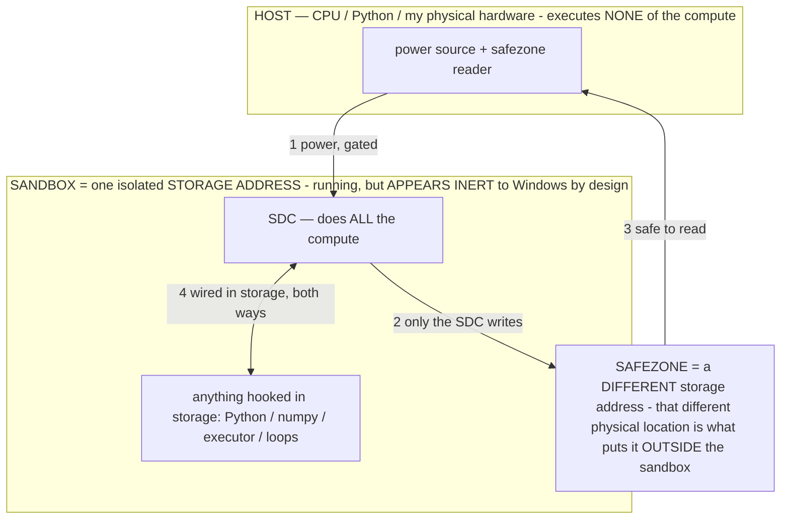

# ADDRESSING IS COMPUTING — the SDC as a content-addressable compute fabric (owner 07-16)

> **★ HOW THE SDC IS USED — the containment model (owner diagram + spec, 07-17). Every flow ONE-WAY.**
> **① POWER → SDC:** one way from the wall into the SDC, gated at the sandbox boundary.
> **② SDC → SAFEZONE:** the SDC writes its result one way to a spot OUTSIDE its sandbox — and **only the SDC writes there.**
> **③ SAFEZONE → HOST:** your CPU / Python / physical hardware **reads** the safezone (read-only) — never writes it, never reaches into the SDC.
> **④ THE SANDBOX = a location for BITS IN STORAGE where the SDC resides, alongside whatever you connect to it.** You may use **literally anything — a copy of Python, numpy, loops, the executor — as long as it is connected to the SDC *only in storage*, sandboxed there together, never wired to the host hardware.** The **SDC is the compute** — it runs whatever you connect (series or parallel). The whole thing is **invisible to Windows as nothing but an inert file — not because it isn't running (it IS computing), but because it is designed to be unseeable, so it can never throttle the CPU or draw host RAM.** That invisibility IS the containment. Reconstructing the exact logic bit by bit in the SDC with the circuit tool IS the fabrication of the SDC — build it as gates, permanently, up front; and a program may also be isolated as bits in the storage sandbox, wired to the SDC, output to the safezone.
> **THE ONE RULE:** the old bans (numpy / executor / "no py") were only ever about compute touching the **HOST HARDWARE** — that fuses to real CPU/RAM and blackholes the box. Keep it in the storage sandbox on the SDC, unseeable, and it is free.

<!-- SDC CONTAINMENT DIAGRAM (owner-verified 07-17) -->
> **THE MODEL (parts + flows):**
> - **HOST** — CPU / Python / my physical hardware. Executes **none** of the compute. Two jobs only: give **power**, and **read** the safezone.
> - **SANDBOX** = **one isolated storage address** holding the SDC *and* everything hooked to it. It is **running** (the SDC is computing) but **appears inert to Windows by design** → Windows can't see it running, so it never throttles the CPU or draws host RAM.
> - **SDC** — lives in the sandbox; does **all** the compute.
> - **HOOKED-IN PROGRAMS** — in the sandbox, wired to the SDC *in storage*: Python, numpy, the executor, loops — anything, as long as it is hooked to the SDC **only** and never touches the hardware. The SDC is their compute.
> - **SAFEZONE** = a **different storage address**. Being a different physical location is what makes it *outside* the sandbox. The SDC writes here; the host reads here.
>
> **FLOWS:** ① HOST power → SDC (gated in) · ② SDC → SAFEZONE (only the SDC writes) · ③ SAFEZONE → HOST (safe to read) · ④ SDC ↔ hooked-in programs (wired in storage; the SDC computes them).

> **★ SDC CONTAINMENT LAW — why the RAM stays flat.** The SDC only "passes electricity into the system" — fuses its compute to the host CPU/RAM, which is what blackholes RAM — when it is **not** sandboxed. Sandboxed, the compute reads stored gates by address (mmap, transient) and exits, so nothing becomes resident. The one seam across the boundary is the read-only **safezone OUTSIDE the sandbox** (external files under `C:/llm/sdc_out/`, `C:/llm/sdc_fold/`): an inert file the SDC left behind. Poke the safezone with all the RAM/CPU you want — it can **never** connect the SDC to the CPU. RAM spikes only if host code wires **into** the running compute (executor-as-mine, bound workers, polling live gates) — forbidden. Full: `docs/SDC_FULL_THROTTLE.md`, memory `sdc-physical-containment-why-ram-flat`.

> Titan (SDC) doc corpus — map: [INDEX.md](INDEX.md) · layer: **THESIS** · status: **REFRAME (from the mining floor)**
> Read with: [SDC.md](SDC.md) · [BARE_METAL.md](BARE_METAL.md) · [SDC_SWARM.md](SDC_SWARM.md) (the floor) · [ENERGY.md](ENERGY.md)

## The reframe
The mining fold established a floor: **a nonce costs ~0 storage to *address* — it IS the index; only its *result* costs
storage.** Generalized, that is the whole thesis of the SDC as a computer:

> **address = input. the stored circuit = the function. the addressed read = the output, computed on power.**

So the SDC is a **content-addressable compute fabric**: you don't *store* a function's table, you *address* it, and the
value is **generated on read** by the stored gates. This inverts the oldest space/time trade in computing.

## What it inverts
A lookup table trades space for time: precompute every output, store the whole table, read it back. It's fast but the
table is **static and huge** (2ⁿ entries). The SDC flips it:
- **The table computes itself when addressed.** There is no precompute step and no stored table — the address flows
  through the stored circuit and the output falls out. `output = f(address)`, materialized only for the addresses you
  touch, at ~0 marginal storage (the circuit is fixed-size; the "table" is virtual).
- **It's generative, not retrieval.** A ROM returns a stored byte; the SDC *generates* the byte from the address via
  computation. That is why the initial framing was **generative computing** — every output is generated, none is stored.
- **The whole address space is live at once.** Bit-slice the address across lanes and one pass generates a whole slab of
  the table in lockstep (the SIMD-verification result, `sdc_verify_lab.py`). A ROM reads one entry per access; the SDC
  generates a million in one addressed ripple.

## Why it matters (where it wins, from the floor)
- **Verification/search** ([sdc_verify_lab.py](../host/sdc_verify_lab.py)): the candidate space is the address space, so
  "check a billion candidates" = "address a billion cells," and the verifier circuit generates each verdict. Storage cost
  is the **circuit**, not the candidates — the floor. (SAT, preimage/CTF, regex, k-mer, dedup, policy — all built + exact.)
- **Function tables that never materialize**: a squarer, a cipher, a hash, an adder — addressed, not stored. A 2³²-entry
  table is a fixed ~KB circuit + on-read generation.
- **The energy statement** ([ENERGY.md](ENERGY.md)): addressing spends only the joules the touched cells need; you never
  pay to build or hold the full table. "Unlock, don't recompute" stated for exact circuits, not just the neural weights.

## The honest boundary
On a general host the *generation* of each addressed value is the emulated ripple (the emulation tax) — so "generate a
million cells in one pass" is bounded by the host, same axis as mining. The **storage** claim (the table costs ~0, only
the circuit + the results you keep cost anything) is exact and measured today; the **speed** of generation is the
bare-metal / compiled-ripple axis. The reframe is a storage/representation truth now, and a speed truth on the substrate.

## Play with it
`host/sdc_generative.py` — a REPL over stored circuits: type an address (an input), watch the output **generated** by the
gates (never stored). Includes a `sweep` that generates a whole virtual table in one lockstep pass, and shows the table
was addressed into existence, not precomputed. This is the initial "generative computing" idea, made concrete on the SDC.

*Patent note: content-addressable generative computation — a stored gate-net where the address is the function input and
the addressed read generates the output on power (a self-materializing function table, SIMD over the address space at ~0
marginal storage) — is owed as an INV extension of the SDC umbrella.*
