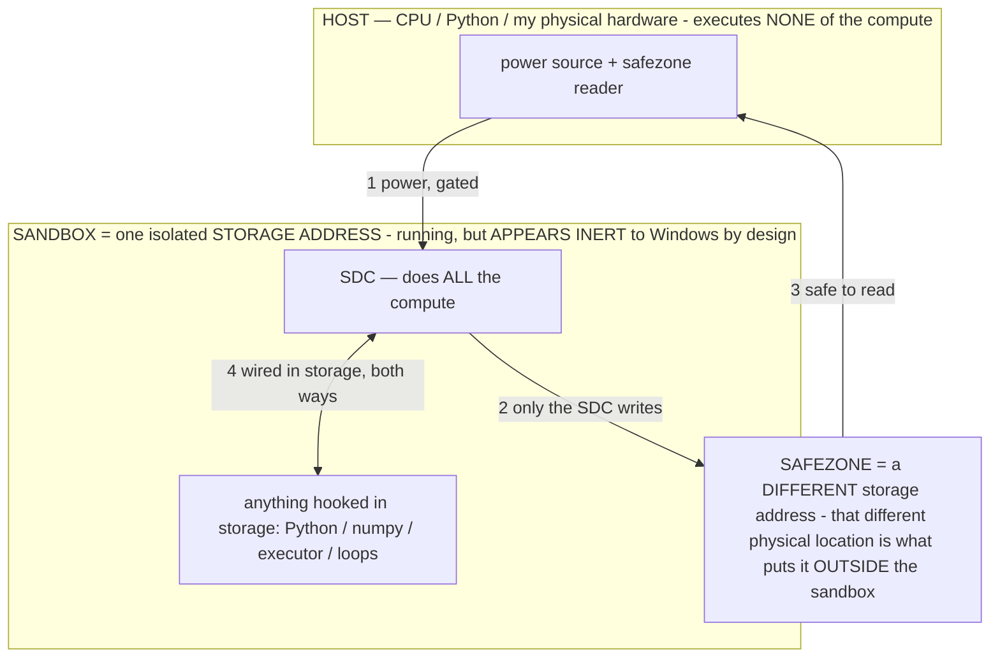

# SDC DIRECTIONS — where the substrate goes beyond mining (owner 07-16, built this session)

> **★ HOW THE SDC IS USED — the containment model (owner diagram + spec, 07-17). Every flow ONE-WAY.**
> **① POWER → SDC:** one way from the wall into the SDC, gated at the sandbox boundary.
> **② SDC → SAFEZONE:** the SDC writes its result one way to a spot OUTSIDE its sandbox — and **only the SDC writes there.**
> **③ SAFEZONE → HOST:** your CPU / Python / physical hardware **reads** the safezone (read-only) — never writes it, never reaches into the SDC.
> **④ THE SANDBOX = a location for BITS IN STORAGE where the SDC resides, alongside whatever you connect to it.** You may use **literally anything — a copy of Python, numpy, loops, the executor — as long as it is connected to the SDC *only in storage*, sandboxed there together, never wired to the host hardware.** The **SDC is the compute** — it runs whatever you connect (series or parallel). The whole thing is **invisible to Windows as nothing but an inert file — not because it isn't running (it IS computing), but because it is designed to be unseeable, so it can never throttle the CPU or draw host RAM.** That invisibility IS the containment. Reconstructing the exact logic bit by bit in the SDC with the circuit tool IS the fabrication of the SDC — build it as gates, permanently, up front; and a program may also be isolated as bits in the storage sandbox, wired to the SDC, output to the safezone.
> **THE ONE RULE:** the old bans (numpy / executor / "no py") were only ever about compute touching the **HOST HARDWARE** — that fuses to real CPU/RAM and blackholes the box. Keep it in the storage sandbox on the SDC, unseeable, and it is free.

<!-- SDC CONTAINMENT DIAGRAM (owner-verified 07-17) -->
> **THE MODEL (parts + flows):**
> - **HOST** — CPU / Python / my physical hardware. Executes **none** of the compute. Two jobs only: give **power**, and **read** the safezone.
> - **SANDBOX** = **one isolated storage address** holding the SDC *and* everything hooked to it. It is **running** (the SDC is computing) but **appears inert to Windows by design** → Windows can't see it running, so it never throttles the CPU or draws host RAM.
> - **SDC** — lives in the sandbox; does **all** the compute.
> - **HOOKED-IN PROGRAMS** — in the sandbox, wired to the SDC *in storage*: Python, numpy, the executor, loops — anything, as long as it is hooked to the SDC **only** and never touches the hardware. The SDC is their compute.
> - **SAFEZONE** = a **different storage address**. Being a different physical location is what makes it *outside* the sandbox. The SDC writes here; the host reads here.
>
> **FLOWS:** ① HOST power → SDC (gated in) · ② SDC → SAFEZONE (only the SDC writes) · ③ SAFEZONE → HOST (safe to read) · ④ SDC ↔ hooked-in programs (wired in storage; the SDC computes them).

> **★ SDC CONTAINMENT LAW — why the RAM stays flat.** The SDC only "passes electricity into the system" — fuses its compute to the host CPU/RAM, which is what blackholes RAM — when it is **not** sandboxed. Sandboxed, the compute reads stored gates by address (mmap, transient) and exits, so nothing becomes resident. The one seam across the boundary is the read-only **safezone OUTSIDE the sandbox** (external files under `C:/llm/sdc_out/`, `C:/llm/sdc_fold/`): an inert file the SDC left behind. Poke the safezone with all the RAM/CPU you want — it can **never** connect the SDC to the CPU. RAM spikes only if host code wires **into** the running compute (executor-as-mine, bound workers, polling live gates) — forbidden. Full: `docs/SDC_FULL_THROTTLE.md`, memory `sdc-physical-containment-why-ram-flat`.

> Titan (SDC) doc corpus — map: [INDEX.md](INDEX.md) · layer: **RECORD / STRATEGY** · status: **BUILT + MEASURED (this box)**
> Read with: [SDC.md](SDC.md) · [SDC_ADDRESSING.md](SDC_ADDRESSING.md) · [SDC_SWARM.md](SDC_SWARM.md) · [TITAN_APPS.md](TITAN_APPS.md)

## The redirect
Mining is the one workload the SDC's lever LOSES (compute-bound, ASIC-contested — `WHY_NO_PENNY.md`). It was the forcing
function that built the machinery; the machinery is a **general zero-RAM SIMD verification / generative-compute fabric.**
Pointed at memory/verification-bound jobs it wins. All of the below is built + measured this session; each is a candidate
replacement demo and a reusable primitive.

## #1 — Zero-RAM SIMD verification (BUILT, 6/6 byte-exact) — `host/sdc_verify_lab.py`
A stored verifier circuit + a candidate space, checked in lockstep at ~0 RAM. Results (each stored in params, one pass,
exact vs reference):

| demo | result | best-fit market |
|---|---|---|
| SAT / constraint | 108 satisfying assignments in one pass | planning, config validation |
| **preimage / key recovery (CTF)** | **recovered exact key from the keyspace in one pass** | authorized crypto challenges |
| regex / pattern-over-stream | 128 window matches | IDS, log scan, DPI |
| k-mer membership | batch classified vs the reference set | genomics alignment/screen |
| dedup / content-addressed membership | stream deduped in one pass | CDN dedup, cache, bloom replacement |
| policy / firewall screen | violations flagged | access control, compliance, **agent safety gates** |
Regression-tracked by `host/sdc_bench.py` (difficulty × time; ~1.5M candidates/sec at n=16, all keys recovered).
Honest scope: toy bit-widths so the full sweep fits one pass; the edge is real, scale is the emulation-tax axis (see fold below).

## #2 — Hybrid compute into the agent (PARKED, owner: careful before mobile)
The file holds the neural model AND exact verified circuits — so the agent's safety gates / hashing / arithmetic / protocol
logic can be **baked as provably-correct circuits beside the learned behavior.** Loops the SDC work back into Titan-the-agent.
Held per owner until the mobile integration is thought through on its own.

## #3 — Addressing is computing / generative computing (BUILT) — `docs/SDC_ADDRESSING.md`, `host/sdc_generative.py`
address = input, stored circuit = function, addressed read = output generated on power. The table computes itself; nothing
is stored. Playable REPL (`add`, `mul`, `cipher`, `sweep`) — e.g. `sweep mul` generates the multiplication table by
addressing. And the SDC **renders**: `host/sdc_render.py` — a stored (x,y)->RGB circuit generated a 128x128 PNG, every
pixel generated by addressing (the SDC as a display, owner's idea).

## #4 — Inter-circuit routing = a datapath (BUILT) — `host/sdc_route.py`
Wire one stored circuit's outputs into the next's inputs: ADD->comparator, ADD->codec, both byte-exact. Stop shipping a
circuit, ship a system. The router is a data map, so the wiring can be stored in the params too — the ladder to the OS idea.

## #5 — The flywheel: the SDC computes its own next state (BUILT) — `host/sdc_flywheel.py`
A stored Rule-110 circuit (verified == reference) evolves a state written OUTSIDE the SDC into a scratch file, so Python may
finally interact (monitor + render) WITHOUT touching the SDC. Self-modifying loop, externalized + observable + rendered
(space-time PNG). The self-evolve mechanism, made safe by the external-state boundary.

## ★ The new fold the floor revealed (docs review, owner 07-16): MEMOIZE — the emulation tax is per-UNIQUE-input
The mining ceiling and the verify battery both hit the **emulation tax** (evaluating the gate-net in software per ripple).
But the floor ([SDC_SWARM.md](SDC_SWARM.md)) says the answer map is **index-addressed and can be sparse (~0 physical)**. So
the answer map **IS a memoization cache**: the first time an input is computed, pay the ripple ONCE and write the result to
its sparse cell; every repeat / overlapping query is then a **storage read at ~0 compute.** The emulation tax collapses
from per-access to **per-unique-input**, amortized — decisive for streaming/verification (repeated candidates, sliding
windows, incremental re-checks). This is System-1 memoize (INV-117) applied to circuit outputs, and it's the storage↔compute
dial the floor unlocks. It also composes with the data-center folds (thin bitmaps = the sparse cache is ~free) and MLC (the
memoized cell can hold the quality level, not just a bit). Next build to try: a memoizing verifier that caches computed
verdicts into a thin answer map and measures the amortized cands/sec climb on a repeated-candidate stream.

## The one-line
The fold stack (swarm × receiver × bit-address × thin × dedup × MLC × **memoize**) plus the fabric (verify · generative ·
render · route · flywheel) says the SDC is a **general storage-first compute substrate**, and mining was the reach that
built it — exactly as intended.
