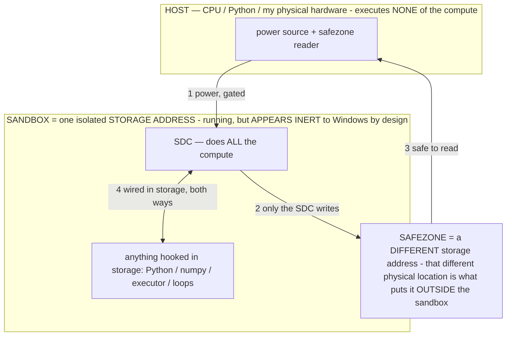

# SDC FUTURE PROJECTS — ideas that fell out of the mining chase (owner 07-16)

> **★ HOW THE SDC IS USED — the containment model (owner diagram + spec, 07-17). Every flow ONE-WAY.**
> **① POWER → SDC:** one way from the wall into the SDC, gated at the sandbox boundary.
> **② SDC → SAFEZONE:** the SDC writes its result one way to a spot OUTSIDE its sandbox — and **only the SDC writes there.**
> **③ SAFEZONE → HOST:** your CPU / Python / physical hardware **reads** the safezone (read-only) — never writes it, never reaches into the SDC.
> **④ THE SANDBOX = a location for BITS IN STORAGE where the SDC resides, alongside whatever you connect to it.** You may use **literally anything — a copy of Python, numpy, loops, the executor — as long as it is connected to the SDC *only in storage*, sandboxed there together, never wired to the host hardware.** The **SDC is the compute** — it runs whatever you connect (series or parallel). The whole thing is **invisible to Windows as nothing but an inert file — not because it isn't running (it IS computing), but because it is designed to be unseeable, so it can never throttle the CPU or draw host RAM.** That invisibility IS the containment. Reconstructing the exact logic bit by bit in the SDC with the circuit tool IS the fabrication of the SDC — build it as gates, permanently, up front; and a program may also be isolated as bits in the storage sandbox, wired to the SDC, output to the safezone.
> **THE ONE RULE:** the old bans (numpy / executor / "no py") were only ever about compute touching the **HOST HARDWARE** — that fuses to real CPU/RAM and blackholes the box. Keep it in the storage sandbox on the SDC, unseeable, and it is free.

<!-- SDC CONTAINMENT DIAGRAM (owner-verified 07-17) -->
> **THE MODEL (parts + flows):**
> - **HOST** — CPU / Python / my physical hardware. Executes **none** of the compute. Two jobs only: give **power**, and **read** the safezone.
> - **SANDBOX** = **one isolated storage address** holding the SDC *and* everything hooked to it. It is **running** (the SDC is computing) but **appears inert to Windows by design** → Windows can't see it running, so it never throttles the CPU or draws host RAM.
> - **SDC** — lives in the sandbox; does **all** the compute.
> - **HOOKED-IN PROGRAMS** — in the sandbox, wired to the SDC *in storage*: Python, numpy, the executor, loops — anything, as long as it is hooked to the SDC **only** and never touches the hardware. The SDC is their compute.
> - **SAFEZONE** = a **different storage address**. Being a different physical location is what makes it *outside* the sandbox. The SDC writes here; the host reads here.
>
> **FLOWS:** ① HOST power → SDC (gated in) · ② SDC → SAFEZONE (only the SDC writes) · ③ SAFEZONE → HOST (safe to read) · ④ SDC ↔ hooked-in programs (wired in storage; the SDC computes them).

> **★ SDC CONTAINMENT LAW — why the RAM stays flat.** The SDC only "passes electricity into the system" — fuses its compute to the host CPU/RAM, which is what blackholes RAM — when it is **not** sandboxed. Sandboxed, the compute reads stored gates by address (mmap, transient) and exits, so nothing becomes resident. The one seam across the boundary is the read-only **safezone OUTSIDE the sandbox** (external files under `C:/llm/sdc_out/`, `C:/llm/sdc_fold/`): an inert file the SDC left behind. Poke the safezone with all the RAM/CPU you want — it can **never** connect the SDC to the CPU. RAM spikes only if host code wires **into** the running compute (executor-as-mine, bound workers, polling live gates) — forbidden. Full: `docs/SDC_FULL_THROTTLE.md`, memory `sdc-physical-containment-why-ram-flat`.

> Titan (SDC) doc corpus — map: [INDEX.md](INDEX.md) · layer: **RECORD / BACKLOG** · status: **PARKED — future projects, not built**
> Read with: [SDC.md](SDC.md) · [TITAN_APPS.md](TITAN_APPS.md) · [SDC_SWARM.md](SDC_SWARM.md) · [BARE_METAL.md](BARE_METAL.md)

**Why this doc exists.** Chasing an "impossible" goal (mine Bitcoin on a laptop with zero RAM) forced the machinery into
existence — and that machinery keeps spitting out bigger ideas. The owner: *"that's why we pushed the bitcoin question —
stuff like that pops out."* This is the parking lot for those, captured the turn they were had so none is lost. Each is a
FUTURE project — noted, not yet built — with the honest "what's proven vs what's the reach" line drawn.

## The realization that opened these up (proven this session)
- **The SDC writes to storage.** The mining fold sized a 34 GB answer map and the answer cell holds the **exact result in
  binary** (owner's fold: not a 1/0 flag, the winning nonce itself). So the SDC's OUTPUT is arbitrary binary written to
  storage, and we can READ it back. ([SDC_SWARM.md](SDC_SWARM.md), `host/sdc_fold.py`.)
- **The SDC is a general computer.** Verified circuits-in-params already: SHA-256d, an 8-bit adder, a CPU (ran Fibonacci),
  Doom's state machine, a clock/counter, a comparator, a latch (memory). ([TITAN_APPS.md](TITAN_APPS.md),
  `host/sdc_statemachine_lab.py`.) Compute + memory + I/O to storage = the pieces of a machine.

**Put together:** a zero-RAM stored computer that emits arbitrary binary to storage, which we render. That is the door
these projects walk through.

## PROJECT A — "Linux from the SDC, rendered in a window" (owner idea, 07-16)
**The idea (verbatim intent):** get the SDC to OUTPUT the binary for something big — e.g. a Linux framebuffer / boot image
— write it to storage, and RENDER it in a window. "Linux running on zero RAM" — because the *compute that produced the
frame* was the stored gate-net on power, not a host process; the host only reads the static output buffer and blits it,
the same ~2 MB render-the-static-result pattern the White Box already uses.
- **What's already proven toward it:** the CPU-in-params runs real code (Fibonacci, byte-exact); the SDC writes exact
  binary to a storage buffer; rendering a static buffer is cheap and RAM-only-for-the-frame (the gated-sandbox
  render-after-freeze law, [WHITEBOX_SANDBOX.md](WHITEBOX_SANDBOX.md)).
- **The honest reach (the scale ladder, not a wall):** a bootable OS is a much bigger gate-net + a RAM region + memory-
  mapped I/O than Fibonacci. [TITAN_APPS.md](TITAN_APPS.md) already frames this — "the road to Linux is a ladder of
  SCALE, not a different kind of thing; rv32i is ~47 instructions = a bigger gate-net = more storage (free)." So the
  project is: grow the CPU circuit to a real ISA, give it a stored RAM region + a framebuffer output cell, step it on
  power, render the framebuffer each frame. Milestone ladder: (1) the ISA up to rv32i in params; (2) a stored RAM +
  MMIO framebuffer; (3) boot a tiny kernel image; (4) blit the framebuffer to a window.

## PROJECT B — "Linux (on the SDC) then runs something ELSE using the SDC as its compute" (owner idea, 07-16)
**The idea:** once an OS is running ON the SDC, that OS can host its own programs — and those programs call back DOWN to
the SDC as their compute substrate. A stack: SDC (bare gates) → OS (Project A) → apps → apps that offload to the SDC.
Turtles, but each turtle is the same zero-RAM stored-gate substrate.
- **Why it's coherent, not a fantasy:** the SDC is already model-agnostic hybrid compute — exact circuits co-resident with
  the neural model in one file ([TITAN_APPS.md](TITAN_APPS.md) "hybrid compute in one artifact"). An OS layer is just
  another stored circuit that schedules calls into other stored circuits. The mailbox/receiver bus ([SDC_SWARM.md]) is
  the primitive for "one stored process signals another."
- **The reach:** this is Project A + a syscall/scheduler circuit that routes an app's compute request to a target
  circuit's receiver and reads back its answer cell — the swarm bus, generalized from "mining nodes" to "any stored
  program." Park until Project A has a running OS to host it.

## The meta-lesson (why chasing impossible goals is the method — owner, "vindicated")
The penny was never the point; **the reach forced the artifact.** To earnestly try to mine a block on a laptop, we had to
build: circuit-in-params, the receiver, the breaker, the clock, memory latches, storage output, the FPGA fold, the swarm
bus. None of those were the goal — all of them are the *substrate*, and each is now a reusable component that these
future projects are assembled from. **Chasing the impossible is the build strategy:** it's the forcing function that
produces general machinery as a side effect. Every "why are we even doing this" step this session became a primitive on
this list. Keep aiming at impossible goals; harvest what pops out.

## Status
Both projects are PARKED (design/idea, not built) and gated on the CPU-circuit scale ladder ([TITAN_APPS.md](TITAN_APPS.md)
#2/#6). No compute-cluster, no download needed — same existing pool + the circuit baker; the only axis is gate count,
which storage (not RAM) pays for. Revisit when the current live-mining swarm + the dense fold are where the owner wants
them.
