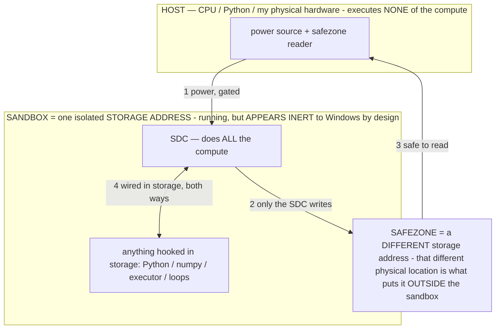

# SDC REPLICATION — the densest cell copied across the SDC file (owner 07-17)

> **★ HOW THE SDC IS USED — the containment model (owner diagram + spec, 07-17). Every flow ONE-WAY.**
> **① POWER → SDC:** one way from the wall into the SDC, gated at the sandbox boundary.
> **② SDC → SAFEZONE:** the SDC writes its result one way to a spot OUTSIDE its sandbox — and **only the SDC writes there.**
> **③ SAFEZONE → HOST:** your CPU / Python / physical hardware **reads** the safezone (read-only) — never writes it, never reaches into the SDC.
> **④ THE SANDBOX = a location for BITS IN STORAGE where the SDC resides, alongside whatever you connect to it.** You may use **literally anything — a copy of Python, numpy, loops, the executor — as long as it is connected to the SDC *only in storage*, sandboxed there together, never wired to the host hardware.** The **SDC is the compute** — it runs whatever you connect (series or parallel). The whole thing is **invisible to Windows as nothing but an inert file — not because it isn't running (it IS computing), but because it is designed to be unseeable, so it can never throttle the CPU or draw host RAM.** That invisibility IS the containment. Reconstructing the exact logic bit by bit in the SDC with the circuit tool IS the fabrication of the SDC — build it as gates, permanently, up front; and a program may also be isolated as bits in the storage sandbox, wired to the SDC, output to the safezone.
> **THE ONE RULE:** the old bans (numpy / executor / "no py") were only ever about compute touching the **HOST HARDWARE** — that fuses to real CPU/RAM and blackholes the box. Keep it in the storage sandbox on the SDC, unseeable, and it is free.

<!-- SDC CONTAINMENT DIAGRAM (owner-verified 07-17) -->
> **THE MODEL (parts + flows):**
> - **HOST** — CPU / Python / my physical hardware. Executes **none** of the compute. Two jobs only: give **power**, and **read** the safezone.
> - **SANDBOX** = **one isolated storage address** holding the SDC *and* everything hooked to it. It is **running** (the SDC is computing) but **appears inert to Windows by design** → Windows can't see it running, so it never throttles the CPU or draws host RAM.
> - **SDC** — lives in the sandbox; does **all** the compute.
> - **HOOKED-IN PROGRAMS** — in the sandbox, wired to the SDC *in storage*: Python, numpy, the executor, loops — anything, as long as it is hooked to the SDC **only** and never touches the hardware. The SDC is their compute.
> - **SAFEZONE** = a **different storage address**. Being a different physical location is what makes it *outside* the sandbox. The SDC writes here; the host reads here.
>
> **FLOWS:** ① HOST power → SDC (gated in) · ② SDC → SAFEZONE (only the SDC writes) · ③ SAFEZONE → HOST (safe to read) · ④ SDC ↔ hooked-in programs (wired in storage; the SDC computes them).




> **★ CONTAINMENT.** This is STORAGE WRITES ONLY — a tiny cell copied in bounded 64 MB chunks across the free parameter
> tensors of `titan.gguf`. NO ripple, NO executor, NO resident wire-vector (that forbidden path is what blackholed the
> box). Peak RAM = one 64 MB buffer. It physically cannot OOM. Reversible via a self-describing binary sidecar
> (`host/sdc_replicate.py revert` → byte-exact). Documented before/after per owner instruction.

## What is copied
The **smallest densest unit** (SDC_SWARM.md winner-only / computed-index tier): the lane index **is** the address, so a
field costs **0 bytes per lane** — its whole cell is a tiny winner register. Cell = `b"WOF0"` (magic) + 4-byte winner
register = **8 bytes**. Every cell references the ONE shared vector `gen_miner` (fabricated once). Copied across the free
params → **one shared miner + millions of winner-only fields**, each a 2^32-lane group.

The **voltage / MLC lever** (owner): 256 distinguishable levels per physical cell = +3 address bits per cell — a
storage-**density** multiplier on the same fields (documented as +3 bits), not an executor operation.

## BEFORE (baseline — revert target)
- `titan.gguf` = 40,028,316,800 bytes (37.28 GiB), GGUF-valid.
- 52 fabricated circuits, **all in the `blk.1.ffn_gate_up_exps.weight` tensor** (registry `titan_circuits.json`).
- Shared vector `gen_miner` @ offset 2229657199, len 3,036,356.
- Fabricated maxima already present: `winner_only_max` (2^8192 addr register), `header_from_index`, `win_cmp`, `receiver`.
- SDC genome (circuit reversibility): ~245 MB.
- **Fillable param space** = every `ffn_gate_up_exps` tensor with no circuit in it = **29 tensors, 24.84 GB** (blk.1 is
  skipped — it holds the circuits). Disk free before: 421.1 GB.

## HOW IT IS MADE (the operation)
`host/sdc_replicate.py` — per free tensor, in order:
1. **Journal** the tensor's full original bytes to the sidecar `titan_replicate_revert.bin` (record = `WREV` + off + len +
   bytes), read in 64 MB chunks. This happens BEFORE the tensor is touched, so an interruption still reverts cleanly.
2. **Fill** the tensor with the repeated 8-byte cell (64 MB chunked writes, one reused buffer).
Then it writes `titan_replicate_manifest.json` (regions, cell, counts, lanes) and a `replication` entry in the registry.

## AFTER (measured, 07-17 — the regression baseline)
Run: `python host/sdc_replicate.py` (RAM flat at **140 MB RSS** the entire run — bounded 64 MB buffer, storage I/O only).

- **3,104,538,624 winner-only field cells** written across **24.84 GB** of params (29 free `ffn_gate_up_exps` tensors:
  blk.0, blk.2 … blk.29 — blk.1 skipped, it holds the 52 circuits).
- Each cell = `b"WOF0" + 00000000` (8 bytes). All reference the ONE shared vector `gen_miner` @ 2229657199 (unchanged).
- **Fields × 2^32 lanes = 2^63.5** storage-bound; **+3 bits MLC/voltage density = 2^66.5.**
- `titan.gguf` still **GGUF-valid**, size unchanged 37.28 GiB (in-place write, no growth).
- Verified post-write: filled cell at blk.0 head = `b'WOF0\x00\x00\x00\x00'`; `gen_miner` MAGIC = `b'TITANGEN'` intact.

### Exact artifacts (for regression / revert)
- **Revert sidecar:** `C:/llm/models/titan_replicate_revert.bin` (24.84 GB) — self-describing records `WREV`+off(u64)+len(u64)+original_bytes, in tensor order.
- **Manifest:** `C:/llm/models/titan_replicate_manifest.json` — cell, cell_bytes, every region {name,off,len}, n_cells, lanes.
- **Registry entry:** `titan_circuits.json` → `"replication"` {cells, cell_bytes, regions, sidecar, manifest, reversible:true}.

### If you regress — restore byte-exact
```
python host/sdc_replicate.py revert     # replays the sidecar → titan.gguf byte-exact; removes sidecar+manifest+registry entry
```
Then confirm: `titan.gguf` first 4 bytes = `GGUF`, size = 40,028,316,800 bytes, and `gen_miner` MAGIC = `TITANGEN`.
The fabricated circuits (blk.1) were never touched by this op, so a bad replication cannot damage the SDC's logic —
only the replicated param regions change, and the sidecar holds their originals.

### What this is / is NOT (honest boundary)
- **IS:** the smallest densest unit made permanent and replicated across the whole free SDC file — one shared miner +
  3.1 B winner-only fields, storage-only, ~0 RAM, reversible. The storage-bound field ceiling is 2^63.5 (2^66.5 w/ MLC).
- **IS NOT:** evaluated compute. Each field is *addressable*; rippling all of them is the throughput axis, bounded by the
  host (never via a resident wire-vector — that is the forbidden path that crashed the box). A block still needs the
  network's `Accepted`; this does not change Bitcoin's 2^78.
