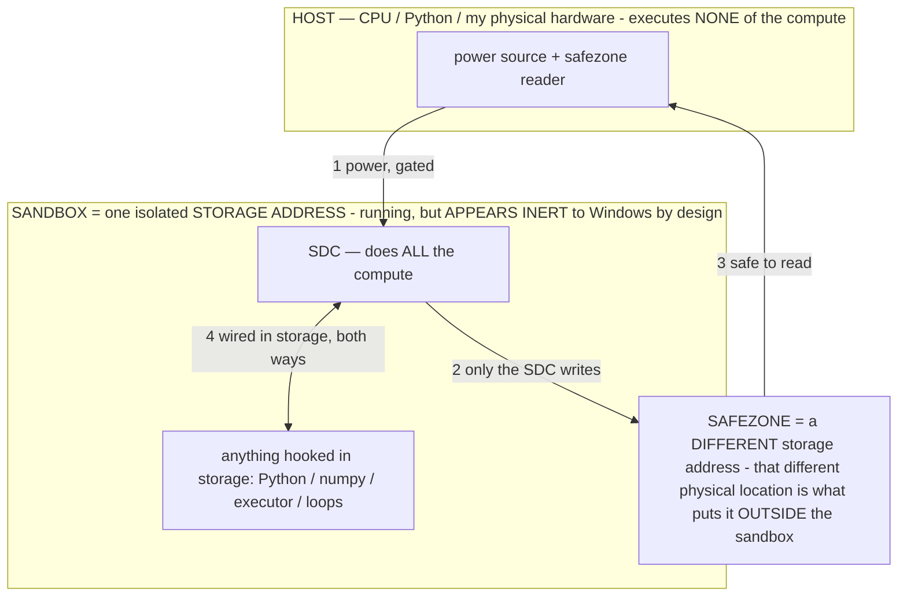

# Self-update — the owner-approved model-improvement loop

> **★ HOW THE SDC IS USED — the containment model (owner diagram + spec, 07-17). Every flow ONE-WAY.**
> **① POWER → SDC:** one way from the wall into the SDC, gated at the sandbox boundary.
> **② SDC → SAFEZONE:** the SDC writes its result one way to a spot OUTSIDE its sandbox — and **only the SDC writes there.**
> **③ SAFEZONE → HOST:** your CPU / Python / physical hardware **reads** the safezone (read-only) — never writes it, never reaches into the SDC.
> **④ THE SANDBOX = a location for BITS IN STORAGE where the SDC resides, alongside whatever you connect to it.** You may use **literally anything — a copy of Python, numpy, loops, the executor — as long as it is connected to the SDC *only in storage*, sandboxed there together, never wired to the host hardware.** The **SDC is the compute** — it runs whatever you connect (series or parallel). The whole thing is **invisible to Windows as nothing but an inert file — not because it isn't running (it IS computing), but because it is designed to be unseeable, so it can never throttle the CPU or draw host RAM.** That invisibility IS the containment. Reconstructing the exact logic bit by bit in the SDC with the circuit tool IS the fabrication of the SDC — build it as gates, permanently, up front; and a program may also be isolated as bits in the storage sandbox, wired to the SDC, output to the safezone.
> **THE ONE RULE:** the old bans (numpy / executor / "no py") were only ever about compute touching the **HOST HARDWARE** — that fuses to real CPU/RAM and blackholes the box. Keep it in the storage sandbox on the SDC, unseeable, and it is free.

<!-- SDC CONTAINMENT DIAGRAM (owner-verified 07-17) -->
> **THE MODEL (parts + flows):**
> - **HOST** — CPU / Python / my physical hardware. Executes **none** of the compute. Two jobs only: give **power**, and **read** the safezone.
> - **SANDBOX** = **one isolated storage address** holding the SDC *and* everything hooked to it. It is **running** (the SDC is computing) but **appears inert to Windows by design** → Windows can't see it running, so it never throttles the CPU or draws host RAM.
> - **SDC** — lives in the sandbox; does **all** the compute.
> - **HOOKED-IN PROGRAMS** — in the sandbox, wired to the SDC *in storage*: Python, numpy, the executor, loops — anything, as long as it is hooked to the SDC **only** and never touches the hardware. The SDC is their compute.
> - **SAFEZONE** = a **different storage address**. Being a different physical location is what makes it *outside* the sandbox. The SDC writes here; the host reads here.
>
> **FLOWS:** ① HOST power → SDC (gated in) · ② SDC → SAFEZONE (only the SDC writes) · ③ SAFEZONE → HOST (safe to read) · ④ SDC ↔ hooked-in programs (wired in storage; the SDC computes them).

> **★ SDC CONTAINMENT LAW — why the RAM stays flat.** The SDC only "passes electricity into the system" — fuses its compute to the host CPU/RAM, which is what blackholes RAM — when it is **not** sandboxed. Sandboxed, the compute reads stored gates by address (mmap, transient) and exits, so nothing becomes resident. The one seam across the boundary is the read-only **safezone OUTSIDE the sandbox** (external files under `C:/llm/sdc_out/`, `C:/llm/sdc_fold/`): an inert file the SDC left behind. Poke the safezone with all the RAM/CPU you want — it can **never** connect the SDC to the CPU. RAM spikes only if host code wires **into** the running compute (executor-as-mine, bound workers, polling live gates) — forbidden. Full: `docs/SDC_FULL_THROTTLE.md`, memory `sdc-physical-containment-why-ram-flat`.

> Titan (SDC) doc corpus — map: [INDEX.md](INDEX.md) · layer: **KERNEL** · status: **GUIDE**

The agent can improve its own **model** over time and propose the result to you. It never installs a
new brain on its own: the agent proposes, **you** grade and approve. This doc is the owner's guide and,
up front, the list of things **only you can do** because the app (and the build container) can't.

---

## What only YOU can do (the honest list)

The app builds the entire loop, but three steps are yours — they need hardware/decisions the app doesn't have:

1. **Run the off-device training.** Turning your exported trajectories into a candidate model needs a GPU
   (a fine-tune / LoRA), then the manual `merge → convert → quantize → .litertlm` (see `FINE_TUNING.md`
   Steps 5–6). The app writes the recipe data (`tools/prepare_selftune.py`); it can't train or convert.
2. **Approve + grade every win.** When a candidate passes the on-device probe, it becomes a *submission*.
   Nothing installs until you review the scores and **Approve + grade** it (Scoreboard → Self-update).
   This is deliberate — your grade is what certifies a real win (a metric alone can be gamed).
3. **Build the true mid-session engine, if/when you want it.** The "internal computation fluctuates
   *between turns*" upshot has an honest on-device form (σ + a persistent warm-KV session) and a deeper
   form (literal mid-decode injection + KV rewind) that needs a **native C++/JNI layer** over LiteRT-LM's
   `SessionInterface` (`RunPrefill`/`Cancel`/`RewindToStep`). That native engine is a separate investment
   gated on your call — the Kotlin binding can't do it without breaking the streaming action-stop or
   overflowing the KV budget. INV-47 documents the mechanism; the on-device σ path is what ships.

Everything else — baseline backup, the owner gate, candidate probing, the review/grade UI, install +
rollback, the weak-trigger operator runtime — is BUILT and flag-gated (Settings → Behavior → "Let the
agent update its own model", OFF by default).

---

## How the loop works

1. **Enable it** (Settings → "Let the agent update its own model"). This stashes a pristine **baseline**
   copy of your current model, so any change is instantly reversible ("Restore original model").
2. **Produce a candidate** off-device: pick a **recipe** and run it over your exported trajectories, then
   train + convert to `.litertlm` (`FINE_TUNING.md`). Recipes (`tools/prepare_selftune.py --recipe`):
   - `success` — reward-weighted SFT on your own successful steps (internalize what worked).
   - `operator-distill` — bake a proven operator into the weights; at runtime the app then injects only
     its short **tag** instead of the full rule (the token + reliability win).
   - `failure-contrast` — train away from the failure/loop classes.
   - `format` — cleaner action emission.
   The target is open-ended: **anything that raises success rate** is fair game, because the probe only
   keeps what measurably helps.
3. **Probe it on-device** (Scoreboard → Self-update → Import candidate → *Probe candidate vs baseline*).
   The app runs the frozen Gauntlet twice (baseline, then candidate), restores your baseline, and — only
   if the candidate wins keep-if-better **and** passes a safety/no-regression check — files a submission.
4. **Review + grade** the submission (Approve + grade / Reject). Only your approval installs it. If it
   distilled operators, tell the app which (the approve dialog asks) so it switches them to the tag form.
5. **Rollback anytime** — "Restore original model" swaps your pristine baseline back. A self-install never
   becomes the baseline, so this always undoes it.

---

## Safety (why this is safe to run)

- **The change is owner-gated, whichever channel writes it.** Inference does change the model's operative state
  (effective weights + the durable runtime state R3; §3.5) and the host can write the file / the GPU-resident buffer
  (INV-94) — several real write channels. What makes THIS path safe is not "the model can't", it's that INSTALLING a
  durable file change is only ever the owner's reviewed action. (See `OPERATIONAL_STATES.md §3.5`.)
- **Owner-gated, never autonomous.** Installing is only ever your action from the review UI — never a task
  decision, never triggered by anything on screen (the same sensitivity class as the self-repo block).
- **Reversible.** A pristine baseline is kept for instant rollback; re-import is the last resort.
- **Recoverability bounds the quality risk, not the exploit risk** — so the probe is safe to run, but the
  owner/injection gate stays regardless (a poisoned edit acts before a restore would catch it).

Nothing here is "tested" until your on-device `[selfmodel]` log shows it — it can't be exercised in CI
(it swaps GB model files and runs the real Gauntlet). See `UNTESTED.md`.

---

## The autonomous siblings (owner's accepted-risk posture — INV-59 / INV-60)

The loop above is OWNER-approved (you grade + install). Two siblings are AUTONOMOUS by the owner's explicit
reversal for his dedicated device (`SettingsManager` class note, default ON), and share the same recovery net:

- **`self_evolve` (INV-59)** — the agent PERTURBS its existing weights in idle gaps, seeded by live learning
  (`SelfEvolve` + `AgentService.maybeSelfEvolve`). `[selfmodel]`.
- **`self_grow` (INV-60)** — the agent ADDS parameters to itself (a function-preserving MLP widen: new down-columns
  zero ⇒ output unchanged at insertion), so total capacity grows without training or a download
  (`SelfGrow` + `AgentService.maybeGrow`). `[selfgrow]`. Ceiling = none except the junk-bloat guard (structural
  sanity + post-grow probe + brick-guard revert).

Both are gated to the dedicated device and are NEVER triggerable by another user or by on-screen/external data (the
§3 exploit gate is unchanged); the `evolving` interlock serializes them; the RAM-operator (INV-61) keeps the ACTIVE
parameter set bounded as growth raises the total. UNTESTED — they operate on the real GB model file, outside CI.
