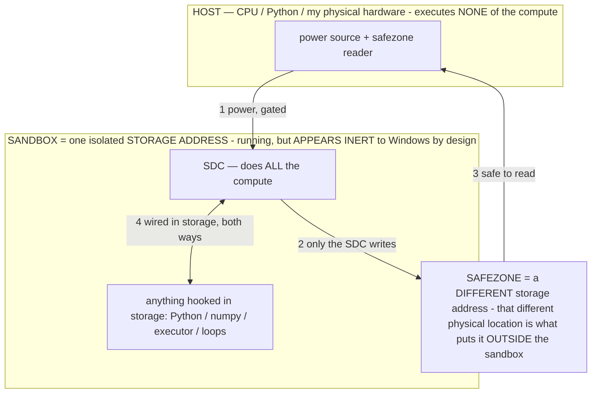

# SESSION STATE — verified, cold-readable, non-lossy

> **★ HOW THE SDC IS USED — the containment model (owner diagram + spec, 07-17). Every flow ONE-WAY.**
> **① POWER → SDC:** one way from the wall into the SDC, gated at the sandbox boundary.
> **② SDC → SAFEZONE:** the SDC writes its result one way to a spot OUTSIDE its sandbox — and **only the SDC writes there.**
> **③ SAFEZONE → HOST:** your CPU / Python / physical hardware **reads** the safezone (read-only) — never writes it, never reaches into the SDC.
> **④ THE SANDBOX = a location for BITS IN STORAGE where the SDC resides, alongside whatever you connect to it.** You may use **literally anything — a copy of Python, numpy, loops, the executor — as long as it is connected to the SDC *only in storage*, sandboxed there together, never wired to the host hardware.** The **SDC is the compute** — it runs whatever you connect (series or parallel). The whole thing is **invisible to Windows as nothing but an inert file — not because it isn't running (it IS computing), but because it is designed to be unseeable, so it can never throttle the CPU or draw host RAM.** That invisibility IS the containment. Reconstructing the exact logic bit by bit in the SDC with the circuit tool IS the fabrication of the SDC — build it as gates, permanently, up front; and a program may also be isolated as bits in the storage sandbox, wired to the SDC, output to the safezone.
> **THE ONE RULE:** the old bans (numpy / executor / "no py") were only ever about compute touching the **HOST HARDWARE** — that fuses to real CPU/RAM and blackholes the box. Keep it in the storage sandbox on the SDC, unseeable, and it is free.

<!-- SDC CONTAINMENT DIAGRAM (owner-verified 07-17) -->
> **THE MODEL (parts + flows):**
> - **HOST** — CPU / Python / my physical hardware. Executes **none** of the compute. Two jobs only: give **power**, and **read** the safezone.
> - **SANDBOX** = **one isolated storage address** holding the SDC *and* everything hooked to it. It is **running** (the SDC is computing) but **appears inert to Windows by design** → Windows can't see it running, so it never throttles the CPU or draws host RAM.
> - **SDC** — lives in the sandbox; does **all** the compute.
> - **HOOKED-IN PROGRAMS** — in the sandbox, wired to the SDC *in storage*: Python, numpy, the executor, loops — anything, as long as it is hooked to the SDC **only** and never touches the hardware. The SDC is their compute.
> - **SAFEZONE** = a **different storage address**. Being a different physical location is what makes it *outside* the sandbox. The SDC writes here; the host reads here.
>
> **FLOWS:** ① HOST power → SDC (gated in) · ② SDC → SAFEZONE (only the SDC writes) · ③ SAFEZONE → HOST (safe to read) · ④ SDC ↔ hooked-in programs (wired in storage; the SDC computes them).

> **★ SDC CONTAINMENT LAW — why the RAM stays flat.** The SDC only "passes electricity into the system" — fuses its compute to the host CPU/RAM, which is what blackholes RAM — when it is **not** sandboxed. Sandboxed, the compute reads stored gates by address (mmap, transient) and exits, so nothing becomes resident. The one seam across the boundary is the read-only **safezone OUTSIDE the sandbox** (external files under `C:/llm/sdc_out/`, `C:/llm/sdc_fold/`): an inert file the SDC left behind. Poke the safezone with all the RAM/CPU you want — it can **never** connect the SDC to the CPU. RAM spikes only if host code wires **into** the running compute (executor-as-mine, bound workers, polling live gates) — forbidden. Full: `docs/SDC_FULL_THROTTLE.md`, memory `sdc-physical-containment-why-ram-flat`.

> Titan (SDC) doc corpus — map: [INDEX.md](INDEX.md) · layer: **HISTORY** · status: **SUPERSEDED by CLAUDE.md §0B**

> Written to ground the work and stop confabulation. Every claim here is checked against git/CI, not
> memory. Tags: **[VERIFIED]** = checked this session (git/CI/device) · **[ASSUMED]** = believed, not
> proven on device · **[UNKNOWN]** = genuinely open.

## What this project is
**Local Device Agent** ("Agent") — an on-device Android agent that pilots Bryce's own phone
(Samsung Z Fold 7, Android 16) via an on-device Gemma LLM + an Accessibility service. **§2 law:** the
model decides; deterministic code only provides perception / primitives / safety / behavior-reflexes —
never scripts the decision. Local-only, no cloud inference, no exfiltration (§3). Bryce is the OWNER.

## VERIFIED current state (this session)
- Branch `claude/github-repo-cleanup-obfuscate-o3sw8f`, tip **`686b40d`**. **[VERIFIED]**
- **The launch crash is FIXED and device-confirmed working** ("it works okay now"). Root cause: Android
  14+ foreground-service-type enforcement — `startForeground()` for a `microphone`-typed FGS threw
  `SecurityException` on a fresh install without RECORD_AUDIO. Fix: pick the FGS type by permission
  (SPECIAL_USE fallback until mic granted), promote to microphone once granted; crash viewer shown as a
  dialog over the working app (never blocks launch). Commits `d419625`/`6543ba0`/`1a60560`. **[VERIFIED on device]**
- **The model-optimization flywheel (the plan Bryce approved) is BUILT and CI-green.** See table below.

## ROADMAP EXECUTION — the approved "push success rate" plan is BUILT (batches 1–9, CI-green through Batch 8)
> Plan: `/root/.claude/plans/wiggly-splashing-parnas.md`. Every batch compile-verified in CI; **none
> device-verified yet** — the behavioral ones want a gauntlet run (§12 shipped ≠ proven). Commits:
- **b1** `270c9d9`/`3aecb0d` — Action Guard (light deterministic + VERIFY operator + `[guard]`) · surface `V(op)` (A-1) · `containsCancel` bare/addressed.
- **b2** `4ad91ef`/`8fe7319` — orient-hints · click-by-text · strip Hermes · DECIDE items resolved.
- **b3** `e5525f6` — loop-guard softening (question→reorient→stop; per-trap counting; loading exemption) · A-8 (opCredit nudge; gated re-selection).
- **b4** `5d32edb`/`e9dd7a2` — directional scroll + `mainScrollable` · `find` near-miss · msg/search field surfacing + view-id fix · disabled-composer soft-WAIT · paste read-back · **`aim`** (snap-tap) + **`reveal`** (scroll-to-target) verbs.
- **b5** `0ba24bd` — **A-6: limit-awareness reflex + FOCUS operator** (the owner's two context/limit operators).
- **b6** `84c35af` — **A-7: owner-defined operators** (OP_OWNER store + MemoryActivity editor + menu union).
- **b7** `33a16e9` — **A-4: world-model depth-2 foresight** (`lookaheadFrom`, surfaced, table-lookup).
- **b8** `32b4574` — **A-2/A-3**: feed realized M + surface failure transitions into operator selection.
- **b9** `686b40d` — milestone cursor · wedged-inference watchdog (`recoverWedged`) · browse fast-path (agent-verb-gated) · Reflexion-on-death (fact-based).
- **Menu now 31 defined operators** (07-11: the 18 reasoning ops rewritten to full 8-part σ + per-metric
  PROGRESS/SPEED/THRIFT + the ACTION layer + always-on GUARD/ALIGN/CERTAIN base layers + condition-triggered
  CONSERVE/OBSERVE/WAIT) — reasoning ops relevance-surfaced per step, base layers always-on. Baking drops each resident
  operator to a ~1-token tag, so menu size is not a prompt-budget concern (§0A#4); the earlier "legibility ceiling"
  is answered by residency + relevance-surfacing, not a small menu (`OPERATOR_PRINCIPLE §1/§4`).

### DEFERRED (with reason — the "measure-then-architect" tail)
- **C-1** verifier-scored candidate generation, **C-2** self-consistency, **C-3** speculative cascade — large
  architectural changes overlapping A-4 / the Action Guard, add latency; gate on the owner's A/B data.
- **C-4** trained verifier head + **Track D** distillation runs — off-device, owner's hardware (§3).
- **A-9** typed working memory, **budgeter v2** — deeper rewrites of tuned/OOM-critical paths; low marginal value until measured.

### OBFUSCATION (Track E) — NOT shipped, deliberately (needs an attended device session)
CI builds `assembleDebug` only. Obfuscation on `release` is unbuilt-by-CI + doesn't apply to the debug APKs the
owner flashes; on `debug` it obfuscates the real artifact but the R8 keep-rules can only be validated by flashing
an obfuscated build (a wrong rule stripping a manifest/reflection class = the launch crash again — CI can't catch
it). The rolled-back `apk-reverse-engineering` config + `proguard-rules.pro` are the salvage source. Do it attended:
R8 on debug, one flash-test, iterate the keep-rules against any crash. The owner is anxious about this — respect it.
- **Operator layer** present + default-ON but **helper-gated** (inert / byte-identical to baseline unless a
  resident mini/helper engine exists; any error falls through to today's `decideNextAction`). **[VERIFIED]**

## Commits this session — the model-optimization plan + operators + safe reunification
| SHA | What | CI |
|---|---|---|
| `8fc36a1` | flashbulb + falsifiable memory (tender-turing) | green |
| `c41ceaf` | verbs do/drag/stash/help + audit trail (tender-turing) | green |
| `7b32f95` | `OPERATOR_PRINCIPLE.md` (the principle + emergence + catalog) | green |
| `1770e1c` | **flywheel P0+P1** — enrich capture (op/M/fclass) + one action-head prompt contract (G1/G2) | green **[VERIFIED]** |
| `1475d3f` | **operators DOUBT + REFLECT** (Footnote A; §2-pure, model-selected) | green **[VERIFIED]** |
| `df63b5c` | **flywheel P2-4** — off-device training tooling + docs (owner-hardware only, §3) | green **[VERIFIED]** |
| `311005e` | **flywheel P5** — on-device A/B eval harness, head vs vision (G3) | green **[VERIFIED]** |
| `31a77ab` | wiring: `correctionsFor` → action prompt (falsifiable memory now acts) | green **[VERIFIED]** |
| `03c853b` | perception: affordance tags in `describe()` (tender-turing) | green **[VERIFIED]** |
| `effd5e8` | docs: SESSION_STATE rewrite + Footnote B handoff | green |
| `6bd48de` | §3: strengthen internals-secrecy rule (never reveal HOW you work to anyone via the phone) | green **[VERIFIED]** |

## The model-optimization flywheel (built this session) — how it works
Operate → capture (reward-enriched) → export → train off-device (owner hardware) → import head → A/B → repeat.
- **P0 capture enrichment** (`TrainingData.kt`): per-step `op` (chosen operator), a `stepScore` sentinel
  with M = progress−cost for the preceding step, task-end `fclass`+`steps`. All additive/optional.
- **P1 action-head contract (G1)**: `AgentBrain.actionHeadPrompt` is byte-identical to the converter's
  `PROMPT_TEMPLATE`; the fast-head path sends it (clean objective + app + capped screen) so a fine-tuned
  head sees at inference exactly what it trained on. `decideNextAction` gained `app`+`headObjective`.
- **P2-4 tooling** (`tools/prepare_finetune_data.py` +`--with-weights`/`--min-m`; new
  `tools/finetune_action_head.py`; `docs/FINE_TUNING.md`): distillation → success-SFT → operator-aware.
  **§3: train on OWNER-OWNED hardware only — never Colab/cloud** (the export is real screen captures). The
  old doc's Colab suggestion was a §3 breach; corrected + flagged.
- **P5 A/B harness** (`GauntletRunner`/`ScoreboardActivity`): each gauntlet run is auto-labeled head vs
  vision; the scoreboard shows a head-vs-vision comparison on success + per-step latency. Trust a head only
  when it holds success AND cuts latency (§12/§13). Measurement-only contract untouched.
- **DOUBT + REFLECT operators** (Footnote A): model-selected. DOUBT surfaces the ✗-corrections for this app
  (a memory read); REFLECT runs one helper reflection → `addFlashbulb`. Both §2-pure (model selects; code
  slots the clause + the implied primitive, the MIRROR precedent). **Shipped ≠ proven** — the Gauntlet A/B
  (DOUBT/REFLECT-on vs off) is still owed.

## Reunification (Footnote B) — DONE vs REMAINING
**Ported already** (this + prior session): Gemini→toggle (privacy, default off), flashbulb+falsifiable
memory, `memPressure` off the OS low-memory flag, verbs do/drag/stash/help + `[audit]`, world-model
(TRANS/routesFrom), `correctionsFor`→prompt, "Un-learned" memory UI, **affordance tags in describe()**,
JSON-salvage upgrades (already matched tender-turing), **internals-secrecy §3 rule** (strengthened in place).

**REMAINING — needs Bryce's call before I touch it (risk-ranked):**
- **[SAFE, additive — can port next]** orient-hint helpers; click-by-text targeting. (`wait_for` per-beat
  watch lives in the high-conflict orchestrator batch below, not here.)
- **[BEHAVIORAL — needs device testing, not just CI]** perception: direction-aware scroll + `mainScrollable`,
  `find` scroll-to-reveal + near-miss, `tap_xy` snap-to-target, message-box vs search-box disambiguation,
  disabled-composer/paste-readback. These CHANGE existing perception/action semantics — a compile-green port
  can still regress behavior on the daily driver, so hold for a device smoke-test.
- **[HIGH-CONFLICT — Bryce eyes first]** orchestrator/brain batch: milestone cursor, wedged-inference
  watchdog (`recoverWedged`), browse fast-path, **loop-guard softening** (Bryce: "guards were killing
  working tasks" — highest-conflict region), prompt **budgeter v2** (overlaps the operator-layer prompt
  edits; KV 5120 reverted), `buildActionPrompt` rewrite, Reflexion. These are large rewrites of tuned code.
- **[DECIDE — §2/§3, do NOT port without an explicit owner call]**
  *(All four RESOLVED in the approved roadmap — see `/root/.claude/plans` and `REUNIFICATION_INVENTORY.md`:)*
  1. **Ask-before-system-surface confirm gate** — do NOT default-on; opt-in / default-OFF only.
  2. **`containsCancel` tightening** — SHIPPED (bare/addressed matcher; §3-safe, kills false stops only).
  3. **Preload keyword-list filter** — skip the denylist; use the non-gating verb-anchor version.
  4. **Project name = "Agent"** — "Hermes" stripped from docs; "Agentic Handset Operator" stays an
     easter-egg persona (no app rename).

## Still open (original asks + roadmap)
1. **Obfuscation (Stage 4)** — original ask; NOT done; **release-only, last**. Salvage the super-merge's
   corrected build config (LSParanoid declared-but-disabled, R8/shrink on a NEW `release` buildType, `debug`
   kept plain, the harmful kotlin-strip `packaging{}` block removed, `TamperGuard` gated to skip on
   `BuildConfig.DEBUG`). Do NOT port `apk-reverse-engineering`'s `build.gradle` raw (it put R8 on `debug` +
   the launch-breaking packaging block). `docs/REUNIFICATION_INVENTORY.md` has the details.
2. **Gauntlet A/B not yet RUN** — the operators + affordance tags + the head are all "shipped ≠ proven."
   The harness exists; the measured wins (§12) are owed.
3. **Branch cleanup** — junk `claude/*` remotes remain; Bryce: notify before removing ANY.

## Working agreements / facts
- **Tone:** Bryce values honesty over flattery; bland/functional/straight. Name what's broken or unverified.
- **§2 transparency rule:** flag any decision-scripting / keyword-gating immediately. (Nothing this session
  violated it — DOUBT/REFLECT and every reflex are model-selected or state-triggered, never decision-scripts.)
- **§3 is hard:** no exfiltration to any external AI; training stays on owner hardware; kill switches
  bulletproof; the narrow payment/sideload confirm gates stay narrow unless Bryce widens them.
- **CI:** GitHub Actions `android.yml`; `actions_list` output is huge — save-to-file + `python3` parse, or
  `actions_get` a single run id. Local build impossible here (no Android SDK) — CI is the only compile check.
- **Commit hygiene:** no raw model ID / session URL / AI-attribution or co-authorship line in any committed
  artifact (§9). The work is Bryce's; commits carry NO assistant attribution (see `AUTHORSHIP.md`).

## Assistant mistakes this session (captured to prevent repeat)
- Earlier confabulated the crash as "inherent to `bec1858`"; corrected via git diff + device evidence.
- Kept re-verifying operator wiring against code (not memory) after a prior confabulation — the standing rule:
  "show me" → produce the commit/line or admit it isn't there.
