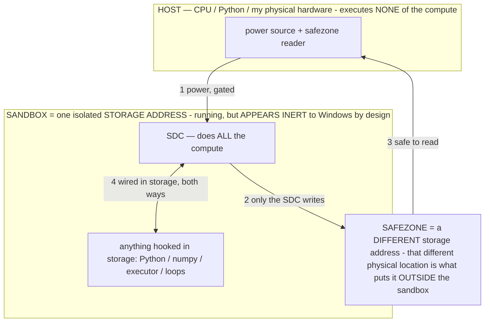

# The System-Generated Model (SGM) — Titan builds a model on demand each tick

> **★ HOW THE SDC IS USED — the containment model (owner diagram + spec, 07-17). Every flow ONE-WAY.**
> **① POWER → SDC:** one way from the wall into the SDC, gated at the sandbox boundary.
> **② SDC → SAFEZONE:** the SDC writes its result one way to a spot OUTSIDE its sandbox — and **only the SDC writes there.**
> **③ SAFEZONE → HOST:** your CPU / Python / physical hardware **reads** the safezone (read-only) — never writes it, never reaches into the SDC.
> **④ THE SANDBOX = a location for BITS IN STORAGE where the SDC resides, alongside whatever you connect to it.** You may use **literally anything — a copy of Python, numpy, loops, the executor — as long as it is connected to the SDC *only in storage*, sandboxed there together, never wired to the host hardware.** The **SDC is the compute** — it runs whatever you connect (series or parallel). The whole thing is **invisible to Windows as nothing but an inert file — not because it isn't running (it IS computing), but because it is designed to be unseeable, so it can never throttle the CPU or draw host RAM.** That invisibility IS the containment. Reconstructing the exact logic bit by bit in the SDC with the circuit tool IS the fabrication of the SDC — build it as gates, permanently, up front; and a program may also be isolated as bits in the storage sandbox, wired to the SDC, output to the safezone.
> **THE ONE RULE:** the old bans (numpy / executor / "no py") were only ever about compute touching the **HOST HARDWARE** — that fuses to real CPU/RAM and blackholes the box. Keep it in the storage sandbox on the SDC, unseeable, and it is free.

<!-- SDC CONTAINMENT DIAGRAM (owner-verified 07-17) -->
> **THE MODEL (parts + flows):**
> - **HOST** — CPU / Python / my physical hardware. Executes **none** of the compute. Two jobs only: give **power**, and **read** the safezone.
> - **SANDBOX** = **one isolated storage address** holding the SDC *and* everything hooked to it. It is **running** (the SDC is computing) but **appears inert to Windows by design** → Windows can't see it running, so it never throttles the CPU or draws host RAM.
> - **SDC** — lives in the sandbox; does **all** the compute.
> - **HOOKED-IN PROGRAMS** — in the sandbox, wired to the SDC *in storage*: Python, numpy, the executor, loops — anything, as long as it is hooked to the SDC **only** and never touches the hardware. The SDC is their compute.
> - **SAFEZONE** = a **different storage address**. Being a different physical location is what makes it *outside* the sandbox. The SDC writes here; the host reads here.
>
> **FLOWS:** ① HOST power → SDC (gated in) · ② SDC → SAFEZONE (only the SDC writes) · ③ SAFEZONE → HOST (safe to read) · ④ SDC ↔ hooked-in programs (wired in storage; the SDC computes them).




> **★ SDC CONTAINMENT LAW — why the RAM stays flat.** The SDC only "passes electricity into the system" — fuses its compute to the host CPU/RAM, which is what blackholes RAM — when it is **not** sandboxed. Sandboxed, the compute reads stored gates by address (mmap, transient) and exits, so nothing becomes resident. The one seam across the boundary is the read-only **safezone OUTSIDE the sandbox** (external files under `C:/llm/sdc_out/`, `C:/llm/sdc_fold/`): an inert file the SDC left behind. Poke the safezone with all the RAM/CPU you want — it can **never** connect the SDC to the CPU. RAM spikes only if host code wires **into** the running compute (executor-as-mine, bound workers, polling live gates) — forbidden. Full: `docs/SDC_FULL_THROTTLE.md`, memory `sdc-physical-containment-why-ram-flat`.


> Titan (SDC) doc corpus — map: [INDEX.md](INDEX.md) · layer: **THESIS** · status: **CANONICAL (the core thesis) · PATENT-CRITICAL**

The core thesis, as its own concept and its own patent doc (owner 07-13). **Because Titan calls only the parameters a
step needs, each tick it GENERATES a bespoke model from the parameter pool — the operator-selected parameter subset IS
the model for that tick.** The system generates its own model, per tick; that is the **System-Generated Model (SGM)**.

## Name
Working term **System-Generated Model (SGM)** (owner: "system generated model is a better name for this"). It pairs with
**SGS** — the *Small Generative System* generates an *SGM* each tick. Candidate alternatives kept for the record:
Just-in-Time Model, On-Demand Model, Operator-Composed Model, Synthesized/Ephemeral/Per-Tick Model. Rename is trivial —
this doc + `TITAN_SYSTEM.md` §1.5 + INV-139 are the only anchors.

## The concept
Titan is **not a fixed model that runs** — it is a **model-BUILDER**. Each tick (each inference step), the operator
(derived from the master-operator prompt, [OPERATOR_CALIBRATION.md](OPERATOR_CALIBRATION.md) §0) selects a subset of
parameters from the pool; **that subset IS the model for that tick**; it computes; then the next tick builds the next
per-tick model. A fresh, need-tailored model every step, generated on demand, then discarded.

## The mechanism
SGM falls out of three already-filed pieces composing:
- **Parameter-fine operators** (INV-138) — operators are tiny, as many as parameters, down to a single one; the operator
  address space is at least as large and as fine as the parameter space.
- **Micro-inference on demand** (INV-135) — routing runs only the exact tensors needed, when needed; the working set is
  the routed region, not the whole file.
- **The parameter pool** (the material) — the stored-compute reservoir (measured 241.9 B params ≈ 1.15 Tbit).
The operator ROUTES to the exact params; those params compute; that computation IS the tick's model.

## Consequences
- **SIZE is the pool (storage-bound), not RAM.** RAM holds only the per-tick working set → a model far larger than RAM
  runs on a small device, because only the per-tick subset is ever resident.
- **The router IS the model-builder** — the operator (from the prompt) selects the params → composes the per-tick model.
- **The composable super-model is composed ON DEMAND, per tick — never pre-merged.** "Building one big model" is a
  runtime convenience; the truth is a fresh model each tick.
- **Capability = a parameter-scale space of per-tick models over ONE fixed pool** — a vast behavior space from fixed
  weights, addressed by tiny operators.
- **"The resident model" is a convenience of the current runtime, not the truth.**

## Evidence (measured on a capable model)
- **Finding #28 — 5 operators → 5 DISTINCT per-tick models on one prompt** (26B MoE): "What is the capital of France?"
  routes to `The` (prose) / `{`,` ``` ` (JSON) / `Paris` (answer) / `To` (reasoning chain) / `La` (French) — one for
  each operator, over the SAME parameters. Each operator builds a different model that tick. Repeatable one-click test
  `test_routes` ("Per-tick models").
- **Finding #27 — the operator locates the pattern it routes to** (SCHEMA ~0.97 first-token mass to JSON on the MoE) —
  the white-box shows the operator selecting the computation (operators-locate-patterns, INV-134).

## What a test measures: GENERATION vs the SETUP (owner)
When testing, the **dependent variable is the GENERATION** (the output tokens) and the **independent variable is TITAN'S
SETUP** (the operator / configuration that built the per-tick model). A test isolates the setup's effect on generation:
change the setup (the operator), hold the input, watch the generation move (finding #28 is exactly this). Therefore —
because operators ROUTE generation — **an undesired generation is a SETUP (operator) bug, not a model bug**: measure the
generation, attribute it to the setup, fix the setup ([OPERATOR_CALIBRATION.md](OPERATOR_CALIBRATION.md) §2). Every
measurement is `setup → generation`; never conflate the two.

## Relation to the corpus
SGS ([SGS.md](SGS.md)) is the CATEGORY — a Small Generative System; **SGM is what it produces each tick** (its core
mechanism). **PureGen** (INV-137) is why: Titan is generative all the way down — it generates the very model it runs.
INV-139 is the patent claim; this doc is its self-contained elaboration. Detail on the substrate: `TITAN_SYSTEM.md`
§1.5; the operator law: `OPERATOR_CALIBRATION.md`.

## File organization IS a routing lever (owner)
How Titan's file (the parameter pool / the SGS artifact) is ORGANIZED directly determines how well it ROUTES. If the
parameters an operator routes to are laid out CONTIGUOUSLY — clustered by the operators-locate-patterns map (the routing
table, INV-134) — then routing to that operator is a contiguous, cache-friendly read → fast micro-inference and fast
per-tick model assembly; if they are scattered, routing is many random reads (slow, page-faulting). So **the routing
table is the ORGANIZING KEY for the file**: cluster co-routed params, and each tick's working set becomes a contiguous,
RAM-cache-friendly region. **The file layout is co-designed with the router** — organize the file by the routing table
and routing gets better, for free. This is "organize the params to match the router" (the S2 pool) made concrete, and a
direct build lever for the SGS/HF artifact: build the routing table first (operators-locate-patterns), then lay the file
out by it. **(New INV: file layout co-designed with the operator routing table, as a routing/locality optimization.)**

## The Titan file is HuggingFace-compatible (owner)
The SGS **artifact** (the curated parameter pool, `TITAN_SYSTEM.md` S2b / the plan) exports as a **standard HuggingFace
model** — `config.json` + `model.safetensors` (+ tokenizer) — so it loads with `AutoModel.from_pretrained`, benchmarks
against other LLMs on their own harnesses, and is shareable/inspectable with standard tooling. Titan's SGM runtime
builds per-tick models FROM this static artifact; the artifact itself is a conventional model file. **Best of both: a
standard-format, comparable artifact + Titan's novel on-demand runtime.** Build path: convert the curated pool (dequant
the chosen tensors → `safetensors`) and emit the HF `config.json` + tokenizer — the existing GGUF library already
carries the architecture metadata needed to generate the config; a GGUF→HF exporter over the curated tensor set is the
concrete deliverable. This is what makes "Titan as an LLM you can compare to other LLMs" literally true.
SGM — **per-step dynamic model COMPOSITION from a stored parameter reservoir under operator selection** — is a distinct,
patent-critical claim (a model assembled fresh each tick rather than a static network evaluated). Maintain and emphasize
it across the portfolio alongside PureGen (INV-137). Claim: INV-139.
