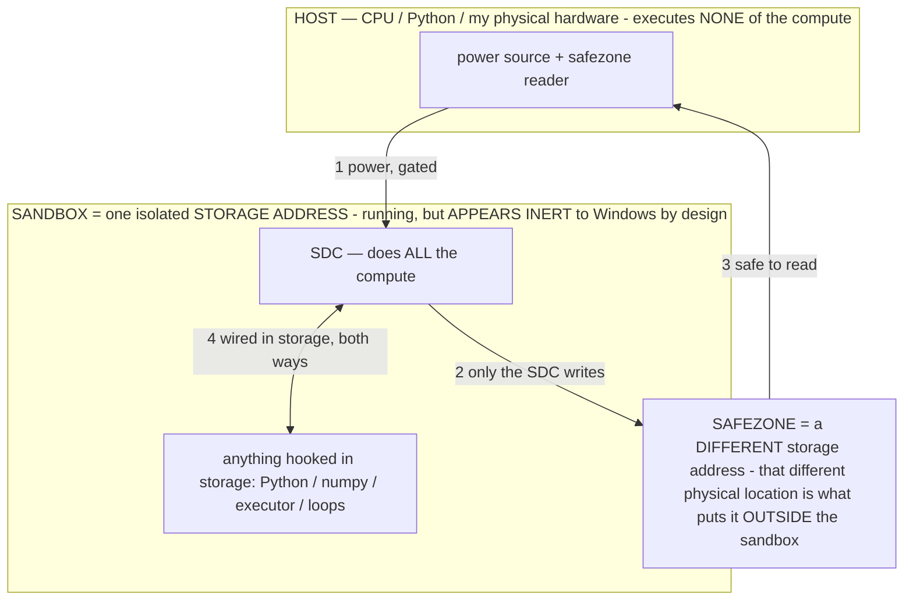

# Titan — a Small Generative System (SGS)

> **★ HOW THE SDC IS USED — the containment model (owner diagram + spec, 07-17). Every flow ONE-WAY.**
> **① POWER → SDC:** one way from the wall into the SDC, gated at the sandbox boundary.
> **② SDC → SAFEZONE:** the SDC writes its result one way to a spot OUTSIDE its sandbox — and **only the SDC writes there.**
> **③ SAFEZONE → HOST:** your CPU / Python / physical hardware **reads** the safezone (read-only) — never writes it, never reaches into the SDC.
> **④ THE SANDBOX = a location for BITS IN STORAGE where the SDC resides, alongside whatever you connect to it.** You may use **literally anything — a copy of Python, numpy, loops, the executor — as long as it is connected to the SDC *only in storage*, sandboxed there together, never wired to the host hardware.** The **SDC is the compute** — it runs whatever you connect (series or parallel). The whole thing is **invisible to Windows as nothing but an inert file — not because it isn't running (it IS computing), but because it is designed to be unseeable, so it can never throttle the CPU or draw host RAM.** That invisibility IS the containment. Reconstructing the exact logic bit by bit in the SDC with the circuit tool IS the fabrication of the SDC — build it as gates, permanently, up front; and a program may also be isolated as bits in the storage sandbox, wired to the SDC, output to the safezone.
> **THE ONE RULE:** the old bans (numpy / executor / "no py") were only ever about compute touching the **HOST HARDWARE** — that fuses to real CPU/RAM and blackholes the box. Keep it in the storage sandbox on the SDC, unseeable, and it is free.

<!-- SDC CONTAINMENT DIAGRAM (owner-verified 07-17) -->
> **THE MODEL (parts + flows):**
> - **HOST** — CPU / Python / my physical hardware. Executes **none** of the compute. Two jobs only: give **power**, and **read** the safezone.
> - **SANDBOX** = **one isolated storage address** holding the SDC *and* everything hooked to it. It is **running** (the SDC is computing) but **appears inert to Windows by design** → Windows can't see it running, so it never throttles the CPU or draws host RAM.
> - **SDC** — lives in the sandbox; does **all** the compute.
> - **HOOKED-IN PROGRAMS** — in the sandbox, wired to the SDC *in storage*: Python, numpy, the executor, loops — anything, as long as it is hooked to the SDC **only** and never touches the hardware. The SDC is their compute.
> - **SAFEZONE** = a **different storage address**. Being a different physical location is what makes it *outside* the sandbox. The SDC writes here; the host reads here.
>
> **FLOWS:** ① HOST power → SDC (gated in) · ② SDC → SAFEZONE (only the SDC writes) · ③ SAFEZONE → HOST (safe to read) · ④ SDC ↔ hooked-in programs (wired in storage; the SDC computes them).

> **★ SDC CONTAINMENT LAW — why the RAM stays flat.** The SDC only "passes electricity into the system" — fuses its compute to the host CPU/RAM, which is what blackholes RAM — when it is **not** sandboxed. Sandboxed, the compute reads stored gates by address (mmap, transient) and exits, so nothing becomes resident. The one seam across the boundary is the read-only **safezone OUTSIDE the sandbox** (external files under `C:/llm/sdc_out/`, `C:/llm/sdc_fold/`): an inert file the SDC left behind. Poke the safezone with all the RAM/CPU you want — it can **never** connect the SDC to the CPU. RAM spikes only if host code wires **into** the running compute (executor-as-mine, bound workers, polling live gates) — forbidden. Full: `docs/SDC_FULL_THROTTLE.md`, memory `sdc-physical-containment-why-ram-flat`.

> Titan (SDC) doc corpus — map: [INDEX.md](INDEX.md) · layer: **THESIS** · status: **CANONICAL (the category)**

> **★ SUPERSEDED (owner 07-14): the category is renamed SGS → SDC (STORED DIGITAL COMPUTER).** The canonical spine is now
> **[SDC.md](SDC.md)** — read it first. "Small Generative System" was too small a word; SDC captures the same thing more
> precisely (stored compute · digital-behaving-analog · a generative computer). This doc is kept as the historical
> category note + a facet; SDC.md is the primary Titan document.

**The owner's reframe (07-13, now superseded by SDC):** Titan is no longer called an OS, an agent, or a model — those
words are each too small. It was called a **Small Generative System (SGS)**; as of 07-14 the category is **SDC — a Stored
Digital Computer** ([SDC.md](SDC.md)). This doc defines the earlier category — everything else in the corpus is an
instance or a component of it.

## Why the old words don't fit

- **Not a MODEL.** A model is a single frozen artifact — one chip. Titan *uses* models as components (each model is a
  reconfigurable-processor chip, `OPERATIONAL_STATES §2.15`), but Titan is the whole machine built around them: the
  processor **and** the devices it's configured into, the codecs, the kernel, the memory, the bus. A model is a part;
  Titan is the system.
- **Not an AGENT.** An agent is a loop that calls pre-existing tools toward a goal. Titan **generates its own tools,
  apps, and components** (the Forge / `make_app`, self-hosting, `INV-116/120`), emulates the hardware devices it needs
  (`INV-118`), and renders its own media (`INV-119`). Agents are something Titan can *assemble and run*; Titan is the
  substrate they run on, and it writes itself.
- **Not an OS.** An OS schedules software someone else wrote. Titan **generates its software** (apps are operators
  authored live), and — the load-bearing difference — it can rewrite **its own weights** (baking, `INV-86/121`). It is
  generative all the way down to the parameters. An OS manages programs; Titan grows them, and grows itself.

## The three words

**SMALL** — it runs on almost nothing. Model size is bounded by *storage*, not RAM (`RAM_MECHANISM.md`, `INV-115`): a
40 GB model binds on 7.2 GB of RAM in ~300 MB committed; a transformer *trains* with backprop on a 32 KB PDP-11
(ATTN-11, folded into the keystone). Small hardware, small footprint, small commitment — *"run the impossible on
nothing."* Small is not a limitation; it is the point — it makes the system yours, on your own $200 device, offline,
for $0.

**GENERATIVE** — it generates at *every* layer, not just the output:
- **Output:** any medium — text, and real PNG/WAV/MP4/diffusion via the model-emits-format ↔ silicon-codec render
  layer (`INV-119`); watchable live, speed-controlled (Live Scope).
- **Software:** its own apps/operators, authored live by the kernel when none fits (`INV-120`), and its own UI/panels
  (self-hosting, `INV-116`).
- **Hardware:** it *becomes* the device a task needs — calculator, translator, codec, ROM, logic unit — by loading an
  operator (the emulation envelope, `INV-118`).
- **Itself / its weights:** the keystone — it installs proven operators into its own parameters (baking, `INV-121`),
  so the system you use for a month becomes a *better* system. Generative down to the silicon it emulates.

**★ PureGen — the defining emphasis (owner 07-13; PATENT-CRITICAL, maintain in every patent artifact).** Titan is a
**PureGen model — *purely* generative.** Everything it does is accomplished through GENERATION and nothing else: the
output (any modality), its own software/apps, the hardware it emulates, its own operators, and its own weights. There
is **no discriminative or scripted decision-core** — the deterministic layer only SERVES generation (perception in,
render out, measure, the §3 safety gates); **every decision and every artifact is generated.** "Purely generative all
the way down to the parameters" is the load-bearing, patent-critical property of the SGS category — it is what makes
SGS a new category rather than a model/agent/OS, and it must be stated and emphasized in the patent upkeep (a purely-
generative SYSTEM architecture, distinct from a generative MODEL used inside an otherwise-conventional program).

**SYSTEM** — a complete, interoperating whole, not a single part. The model-computer (`MODEL_COMPUTER.md`): a processor
(a model chip) + σ-configured device peripherals + silicon output codecs + a self-scheduling model-kernel + a
storage-first pager + a memoize cache + a controller component + an (off-by-default) network card, and — networked —
a pool of chips talking over a text IPC bus. Components, not delegation: the big model does 100% of the thinking; the
small model is a *controller component*, never a work-taker (`HANDOFF.md` CORE CORRECTION).

## The core thesis (07-13, owner)
Because Titan calls only the parameters it needs (param-fine operators + micro-inference), **it builds a model on demand
each tick** — the operator-selected parameter subset IS the model for that step. Titan is a model-BUILDER, not a fixed
model: it composes a bespoke, need-tailored model every tick from the pool and builds the next one the next tick. This
is *why* it is PureGen down to the parameters (it generates the very model it runs, per tick) and why SIZE is
storage-bound (the pool on disk) while RAM holds only the per-tick working set. Detail: `TITAN_SYSTEM.md` §1.5,
`OPERATOR_CALIBRATION.md` §0.5.

## One line

**Titan is a Small Generative System: a small, self-generating system of interoperating components — a computer whose
processor is a language model — that generates its own outputs, software, emulated hardware, and even its own weights,
running the impossible on nothing, owned end-to-end.** Model-agnostic (any frozen model, local or cloud); the
sovereignty invariant holds (own the system + the models + the deployment; rent commodity compute, never a vendor's
intelligence — §3). LOCAL is the hero-demo floor, not the ceiling.

## Where it lives in the corpus
The category is realized by the component inventions (`PATENT_SUPPORT.md`): the processor/operator substrate
(43/95/109), storage-first (61/115), the generative layers (116/118/119/120), the memoize/System-1 floor (117), and
the self-reprogramming keystone (86/121). `MODEL_COMPUTER.md` is the part-by-part machine; this doc is the category it
belongs to. Titan's first application + proving ground is the on-device phone agent (the S24 Ultra that *is* Titan).
