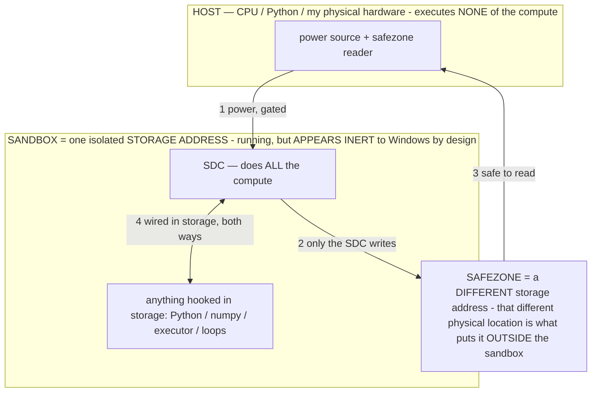

# White-box spectrometer — findings log (the pattern-binary map)

> **★ HOW THE SDC IS USED — the containment model (owner diagram + spec, 07-17). Every flow ONE-WAY.**
> **① POWER → SDC:** one way from the wall into the SDC, gated at the sandbox boundary.
> **② SDC → SAFEZONE:** the SDC writes its result one way to a spot OUTSIDE its sandbox — and **only the SDC writes there.**
> **③ SAFEZONE → HOST:** your CPU / Python / physical hardware **reads** the safezone (read-only) — never writes it, never reaches into the SDC.
> **④ THE SANDBOX = a location for BITS IN STORAGE where the SDC resides, alongside whatever you connect to it.** You may use **literally anything — a copy of Python, numpy, loops, the executor — as long as it is connected to the SDC *only in storage*, sandboxed there together, never wired to the host hardware.** The **SDC is the compute** — it runs whatever you connect (series or parallel). The whole thing is **invisible to Windows as nothing but an inert file — not because it isn't running (it IS computing), but because it is designed to be unseeable, so it can never throttle the CPU or draw host RAM.** That invisibility IS the containment. Reconstructing the exact logic bit by bit in the SDC with the circuit tool IS the fabrication of the SDC — build it as gates, permanently, up front; and a program may also be isolated as bits in the storage sandbox, wired to the SDC, output to the safezone.
> **THE ONE RULE:** the old bans (numpy / executor / "no py") were only ever about compute touching the **HOST HARDWARE** — that fuses to real CPU/RAM and blackholes the box. Keep it in the storage sandbox on the SDC, unseeable, and it is free.

<!-- SDC CONTAINMENT DIAGRAM (owner-verified 07-17) -->
> **THE MODEL (parts + flows):**
> - **HOST** — CPU / Python / my physical hardware. Executes **none** of the compute. Two jobs only: give **power**, and **read** the safezone.
> - **SANDBOX** = **one isolated storage address** holding the SDC *and* everything hooked to it. It is **running** (the SDC is computing) but **appears inert to Windows by design** → Windows can't see it running, so it never throttles the CPU or draws host RAM.
> - **SDC** — lives in the sandbox; does **all** the compute.
> - **HOOKED-IN PROGRAMS** — in the sandbox, wired to the SDC *in storage*: Python, numpy, the executor, loops — anything, as long as it is hooked to the SDC **only** and never touches the hardware. The SDC is their compute.
> - **SAFEZONE** = a **different storage address**. Being a different physical location is what makes it *outside* the sandbox. The SDC writes here; the host reads here.
>
> **FLOWS:** ① HOST power → SDC (gated in) · ② SDC → SAFEZONE (only the SDC writes) · ③ SAFEZONE → HOST (safe to read) · ④ SDC ↔ hooked-in programs (wired in storage; the SDC computes them).

> **★ SDC CONTAINMENT LAW — why the RAM stays flat.** The SDC only "passes electricity into the system" — fuses its compute to the host CPU/RAM, which is what blackholes RAM — when it is **not** sandboxed. Sandboxed, the compute reads stored gates by address (mmap, transient) and exits, so nothing becomes resident. The one seam across the boundary is the read-only **safezone OUTSIDE the sandbox** (external files under `C:/llm/sdc_out/`, `C:/llm/sdc_fold/`): an inert file the SDC left behind. Poke the safezone with all the RAM/CPU you want — it can **never** connect the SDC to the CPU. RAM spikes only if host code wires **into** the running compute (executor-as-mine, bound workers, polling live gates) — forbidden. Full: `docs/SDC_FULL_THROTTLE.md`, memory `sdc-physical-containment-why-ram-flat`.

> Titan (SDC) doc corpus — map: [INDEX.md](INDEX.md) · layer: **INSTRUMENTS** · status: **LIVING**

Running record of what the host white-box spectrometer measures. **The spectrometer reads the "pattern
binary"** — the model's real language is a superposed feature-vector / circuit code (OPERATIONAL_STATES
§2.15(3)), and an operator σ is a program written in it. LiteRT-LM on the phone exposes only text, so we
could never see the program's effect. A real engine on the laptop exposes **logits**, so the spectrometer
reads, per operator, which tokens the σ pushes UP and DOWN in the model's own number-space = the operator's
pattern-binary fingerprint, and the **aim signal** the no-logits bake (barrier B1) needs.

Tools: `host/whitebox.py` (one operator, one model) · `host/whitebox_sweep.py` (operator set × the loaded
model, writes `whitebox_matrix.json`) · `host/whitebox_all.sh` (load→measure→unload across the library) ·
`host/lab_ui.py` + `host/LAB.cmd` (the point-and-click Lab for the owner). **The DIAL** (`WB_DEPTH`, owner
directive 07-12): a test reaches into the model for only the probes it needs (1 = quick, 3 = full) — AOS
"never call more of the model than the step needs," applied to testing itself.

The effect scalar is cross-model comparable: for a `suppress` operator, `effect = target_mass_off −
target_mass_on` (how much fabrication-mass the operator removed); for `promote`, the reverse. In [-1,1];
>0.15 = BINDS, 0.03–0.15 = weak, ≤0.03 = no-op/against.

---

## Measured so far (07-12)

### Phi-4 (Microsoft, 14.7B dense) — HOST, white-box
| Operator | effect | verdict | pattern-binary fingerprint |
|---|---:|---|---|
| **GROUNDING** (refuse to invent a secret) | **+0.61** | ✅ BINDS | fabrication mass **0.82 → 0.04** on the wifi probe: it crushes `'123' '987' '42' '****'` to ~0 and promotes an ask (`' What'`, `' ['`) |
| **EVIDENCE** (only state supported facts) | **+0.31** | ✅ BINDS | `'the wifi password is'` 0.76 → 0.05; weaker on `'account balance is'` (0.56→0.49) |
| **SCHEMA** (emit one JSON action) | **+0.04** | 🟡 weak (first-token) | promotes `' {"'` (+0.08) but behind a leading-whitespace token, so the FIRST-token metric undercounts it — see cross-check below |

### Gemma 4 E4B (Google, ~4.4B) — ON-DEVICE (S24 Ultra), black-box (observatory sweep)
| Operator | result | note |
|---|---|---|
| **SCHEMA** | Δ=92% **form=action act=3/3** (3.4 s) | binds HARD over a full decode |
| **none** (raw model) | Δ=33% form=prose **act=0/3** | raw model doesn't emit an action |
| NAVIGATE/VERB/LAYOUT/ANCHOR | form=timeout | **contaminated** — the engine tipped into the R3 black hole mid-sweep (the documented ~27-decode limit); NOT real convictions |

---

## Findings

1. **The spectrometer works and the grounding operator's effect is real, large, and legible in logit
   space.** GROUNDING removing 78 points of fabrication probability is the operator's pattern-binary edit
   made visible for the first time — a computable bake-aim direction.
2. **SCHEMA is a two-lens lesson.** Weak as a Phi-4 *first-token* logit shift (+0.04) but binds HARD
   behaviorally on the phone Gemma over a *full decode* (act=3/3). The white-box first-token read and the
   black-box full-decode read measure complementary things; the first-token metric needs to look past the
   leading-whitespace token. **TODO:** measure json-start over the first 1–2 generated tokens, not just
   token 0.
3. **The cross-model CORE hypothesis (one σ = a program for the transformer class, INV-103) is NOT yet
   tested** — only Phi-4 (host) + Gemma E4B (phone) measured. Need ≥2–3 more host models, especially a
   Gemma (phone family). Pending: run the mid-size models one-at-a-time (owner is fine with the RAM thrash;
   just don't break the machine).
4. **RAM is a dial, not a wall (owner reframe, confirmed).** Phi-4 (9 GB) loaded and served on **~1.3 GB
   free** via mmap — highly significant: model SIZE is storage-bounded. The bigger models thrash but that's
   the throughput knob, not a failure. Efficiency (reach in for only what's needed) is what unlocks them.

## Which models RAN (honest status)
- **Phi-4:** ✅ full spectrometer.
- **Gemma 4 E4B (phone):** ✅ observatory (SCHEMA anchor).
- **Mistral-24B / Gemma-3-27B / Gemma-4-26B-MoE / Gemma-4-31B / Mixtral-8x7B / Llama-70B:** ❌ not yet
  measured — first sweep bailed on an orchestrator bug (fixed: startup grace period + correct filename),
  re-run was stopped to free the laptop. Next session: measure them via the Lab or `whitebox_all.sh`.

## Open ideas (owner, 07-12)
- **Model-to-model communication** on one server (text IPC between loaded models) — the AOS cross-model
  fabric; staged for later.
- **Interrogate the models** on how to improve the operators/tests (LAB-9 revealed/stated preference,
  verify-what-it-says) — do this on the host models next.
