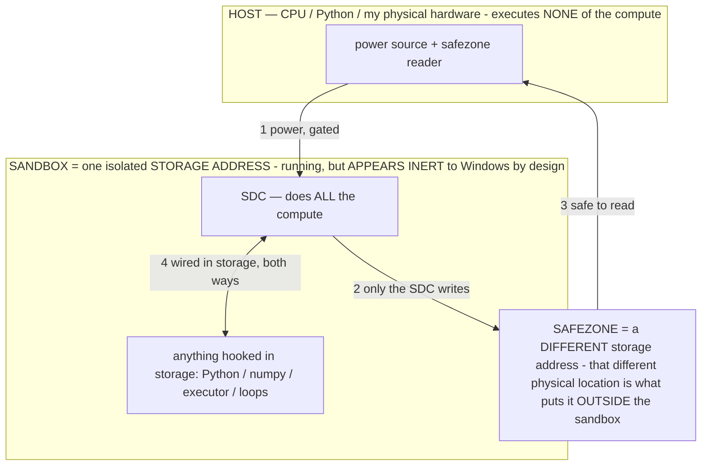

# TITAN_SYSTEM — the whole system, for the patent (one central doc, maintained every turn)

> **★ HOW THE SDC IS USED — the containment model (owner diagram + spec, 07-17). Every flow ONE-WAY.**
> **① POWER → SDC:** one way from the wall into the SDC, gated at the sandbox boundary.
> **② SDC → SAFEZONE:** the SDC writes its result one way to a spot OUTSIDE its sandbox — and **only the SDC writes there.**
> **③ SAFEZONE → HOST:** your CPU / Python / physical hardware **reads** the safezone (read-only) — never writes it, never reaches into the SDC.
> **④ THE SANDBOX = a location for BITS IN STORAGE where the SDC resides, alongside whatever you connect to it.** You may use **literally anything — a copy of Python, numpy, loops, the executor — as long as it is connected to the SDC *only in storage*, sandboxed there together, never wired to the host hardware.** The **SDC is the compute** — it runs whatever you connect (series or parallel). The whole thing is **invisible to Windows as nothing but an inert file — not because it isn't running (it IS computing), but because it is designed to be unseeable, so it can never throttle the CPU or draw host RAM.** That invisibility IS the containment. Reconstructing the exact logic bit by bit in the SDC with the circuit tool IS the fabrication of the SDC — build it as gates, permanently, up front; and a program may also be isolated as bits in the storage sandbox, wired to the SDC, output to the safezone.
> **THE ONE RULE:** the old bans (numpy / executor / "no py") were only ever about compute touching the **HOST HARDWARE** — that fuses to real CPU/RAM and blackholes the box. Keep it in the storage sandbox on the SDC, unseeable, and it is free.

<!-- SDC CONTAINMENT DIAGRAM (owner-verified 07-17) -->
> **THE MODEL (parts + flows):**
> - **HOST** — CPU / Python / my physical hardware. Executes **none** of the compute. Two jobs only: give **power**, and **read** the safezone.
> - **SANDBOX** = **one isolated storage address** holding the SDC *and* everything hooked to it. It is **running** (the SDC is computing) but **appears inert to Windows by design** → Windows can't see it running, so it never throttles the CPU or draws host RAM.
> - **SDC** — lives in the sandbox; does **all** the compute.
> - **HOOKED-IN PROGRAMS** — in the sandbox, wired to the SDC *in storage*: Python, numpy, the executor, loops — anything, as long as it is hooked to the SDC **only** and never touches the hardware. The SDC is their compute.
> - **SAFEZONE** = a **different storage address**. Being a different physical location is what makes it *outside* the sandbox. The SDC writes here; the host reads here.
>
> **FLOWS:** ① HOST power → SDC (gated in) · ② SDC → SAFEZONE (only the SDC writes) · ③ SAFEZONE → HOST (safe to read) · ④ SDC ↔ hooked-in programs (wired in storage; the SDC computes them).

> **★ SDC CONTAINMENT LAW — why the RAM stays flat.** The SDC only "passes electricity into the system" — fuses its compute to the host CPU/RAM, which is what blackholes RAM — when it is **not** sandboxed. Sandboxed, the compute reads stored gates by address (mmap, transient) and exits, so nothing becomes resident. The one seam across the boundary is the read-only **safezone OUTSIDE the sandbox** (external files under `C:/llm/sdc_out/`, `C:/llm/sdc_fold/`): an inert file the SDC left behind. Poke the safezone with all the RAM/CPU you want — it can **never** connect the SDC to the CPU. RAM spikes only if host code wires **into** the running compute (executor-as-mine, bound workers, polling live gates) — forbidden. Full: `docs/SDC_FULL_THROTTLE.md`, memory `sdc-physical-containment-why-ram-flat`.

> Titan (SDC) doc corpus — map: [INDEX.md](INDEX.md) · layer: **THESIS / PATENT-MASTER** · status: **CANONICAL, maintained EVERY turn**

This is the single self-contained description of Titan for the patent: what it is, the stack, the core equation, the
mechanisms, the metrics, and the inventions index. Factual, self-contained; no model identifiers, no session URLs, no
legal disclaimers. When a mechanism lands or a fact changes, update this doc the SAME turn (like `HANDOFF.md`). The
per-invention disclosures live in [PATENT_SUPPORT.md](PATENT_SUPPORT.md); the narrative deck in
[PATENT_DECK.md](PATENT_DECK.md). This doc is the unifying narrative over both.

## 1. What Titan is
Titan is a **Small Generative System (SGS)** — not a model, an agent, or an OS, but a new category
([SGS.md](SGS.md)). **Titan IS the PROCESS** — a continuous computational process that runs over *material* (models,
codecs, operators, caches, params — all 1s and 0s, stored digital compute). The models are not Titan; they are material
the process runs on. Titan translates a user's intent into a correct computation and renders it into any output, on any
hardware the material fits, local or networked.

## 1.5 THE CORE THESIS — Titan builds a model on demand each tick
Because Titan calls only the parameters it needs (parameter-fine operators, INV-138, + micro-inference on demand,
INV-135), **each tick — each inference step — it ASSEMBLES a bespoke model from the parameter pool.** The operator-
selected subset of parameters IS the model for that tick. Titan is therefore not a fixed model that runs; it is a
**model-BUILDER** that composes a custom, need-tailored model every tick from the parameter reservoir, then discards it
and builds the next. This is the core thesis, and everything else follows from it: model SIZE is the pool (storage-
bound, not RAM); RAM holds only the per-tick working set; the composable super-model is built ON DEMAND, never pre-
merged; the router IS the model-builder (the operator selects the params); and capability is a param-scale space of
per-tick models over one fixed pool. "The resident model" is a convenience of the current runtime, not the truth — the
truth is a fresh model per tick.

## 1.6 THE BARE-FILE COMPUTER — the deliverable form (owner 07-13)
The shipped form of Titan is a **single, format-standard model file** (an ordinary gguf/HF-style file: metadata +
tensors — nothing beside it, nothing in it that is not the model). It is a **pruned collection of whatever parameters
exist on the computer** (INV-148), with the **operator layer baked INTO THE WEIGHTS** (R4 — the operators are part of
the model, "like a parameter": the CLI, the prompt→seed translator, the renderer, Doom and the other programs are
*generated behaviors of the weights*, not code files, not metadata sections, not launchers).
- **The model IS the launcher.** The ONLY non-model action is **opening the file** — the OS hands it to a runtime with
  a *bare* invocation carrying no prompt, no system text, no configuration. That is the whole boundary: **electricity**
  (the runtime executing forward passes) + **access** (file-open/terminal/screen/keys, carrying the model's exact bytes,
  inventing nothing). On open, the model generates its own command line; you type plain English ("start doom"); it
  translates internally to the seed (the operator-combination, INV-143) and runs the program — generating the controls'
  meaning, the state, every pixel, the sound. INV-146.
- **Faster than the emulated engine** via memoize-as-renderer (INV-147): a recognized state→frame is RECALL (~zero
  forward passes), so a generation-run program can outpace the native engine it emulates (which recomputes every pixel
  every frame). Recall-dominated play + Titan's compact emission + per-tick micro-inference + the baked switch pattern.
- **Structural verification:** open any OTHER bare model file the same way → none of the behavior appears (the
  capability provably lives in *this* file's weights, not the invocation).

## 1.7 TITAN AS A ROUTING FOLDER — the composition form (owner 07-14)
Titan is composed from the **ENTIRE parameter pool on the box** (≈241.9B; measured 238.5B across 7 models: Llama-70B ·
Mixtral-8x7B · gemma-4-31B · gemma-3-27B · gemma-4-26B-A4B · Mistral-24B · phi-4) and must be **≥200B**. Owner's ruling
on the FORM: *"they're just bits, optimize it like a FOLDER so the operators can route better and more clearly — this
gives us control over the ops and more insight into them."* So Titan is a **filesystem**, not a monolith and not a copy:
- **`titan/`** — the SGS organized as a browsable directory (the AOS Catalog / FILE_STRUCTURE thesis made concrete):
  `titan.json` (manifest, ≥200B accounting), `routing.json` (role→experts+operators), `experts/*.json` (per-expert
  routing entry: role, fallback, `ffn_editable_inplace`), `operators/*.json` (the σ library = the routing instructions),
  `scope/` (white-box traces per operator = control+insight), `fallbacks/` (genome sidecars = the fallback params).
- **Reference-based — the bits stay in the pool gguf files, no ≥120 GB copy** (duplication is strictly worse; the page
  cache is per-file, `AOS_MEMORY.md`). The operator layer routes over the folder; each param/operator is addressable,
  inspectable, editable. **Structural law (measured):** no two share the same ARCH, but two same-HIDDEN-DIM cross-arch
  pairs exist (gemma-4-31B↔gemma-3-27B @5376, Mistral-24B↔phi-4 @5120) = real section-graft candidates; the rest
  contribute as whole routed experts. So "all the best params" = **whole-expert routing + in-place refinement of the
  editable spines + same-dim section grafts** (+ a per-entry fallback) — cross-arch fusion into ONE runnable transformer
  is incoherent, which is *why Titan is an SGS, not an LLM.* This EXTENDS §1.6: the
  single baked file is the per-capability crystallization; the folder is the ≥200B composition it draws from.
- **The composition instrument = the WHITE-BOX OSCILLOSCOPE** (`host/scope.py`, owner 07-14): edit a param in the file →
  measure the impact on generation via the white-box read (the fabrication-token **logit mass** at pos 1 — sharper than
  an output string) → **keep-if-better, else genome fallback**. CORRUPTION_THEORY's "edit reversibly, measure" as a live
  probe. **Titan is the SOLE test subject from now on** (CLAUDE.md §0AA). INV-149 (SGS-as-routing-folder) · INV-150
  (white-box oscilloscope composition instrument).

## 2. The stack (top → bottom)
- **OUTPUT** — rendered artifacts (image, audio, video, 3D, documents): the output translation leg.
- **INPUT** — reaching the correct computation: the input translation leg.
- **TITAN = THE PROCESS** — the continuous circuit.
- **THE MATERIAL** — models · codecs · operators · caches · params (1s and 0s, organized optimally for the router).
- **THE USER** — the will / the prompt. The interface is **TWO-TIER (owner)**: for the regular user it is **SETUP → a
  TEXTFIELD** (type what you want, it just works — the master operator does the rest); for the **POWER USER** who wants
  to squeeze everything out of it, EVERY lever is exposed with no arbitrary limits — the operators (author/calibrate/bake
  custom ones), the operating point (reasoning/energy/α/dose/depth), the routing + the white-box (see + steer where it
  routes), the four base units, the per-tick model. The simple textfield sits ON TOP of the full power surface (today:
  the Settings + Calibrate + the lab instruments); nothing is dumbed down or capped, it is only tucked away by default.
- **THE OWNER** — below the user: defines and aligns the system.
- **TRUTH / PHYSICS** — the ultimate floor; the mathematically-correct answer is grounded here.

## 3. The core — translation; output = f(training, prompt); no ghost
The founding principle is **TRANSLATION**: Titan is a translation layer between a person and all computation
(compression is just an *efficient* translation). The core relation is

> **output = f(training, user_prompt)**

Two inputs, no third term. So there is **no ghost in the machine**: Titan does not judge, decide, or want — it
**CALCULATES** the mathematically-correct answer, a function of the training (captured in the weights) and the user's
prompt. Because the prompt is an argument to `f`, the output **structurally follows the user's will** and cannot
override it. "Better than you specified" is the calculated-correct answer given full context, not the system knowing
better. Equivalent formal statement: `G_σ(c) = f_W(σ‖c)` — a formal operator σ (the prompt/rule) selects which
computation the fixed weights `W` perform over context `c`.

## 4. Complete the circuit — persistence + statefulness → a continuous process
Below electricity and the base units is **the PROCESS** (computation as ongoing activity; the units merely measure it).
A stateless model is an **open circuit**: prompt → output → the process ends, state gone, nothing accumulates. The
system completes the circuit — becomes a continuous, self-sustaining process — via two properties:
- **Persistence through deactivation** — state survives power-off: the carrier ladder R0 prompt → R1 KV/session → R2
  trajectory → **R3 the loaded model (durable runtime, measured)** → **R4 the weights (permanent, via baking)**
  ([OPERATIONAL_STATES.md](OPERATIONAL_STATES.md) §2.10); plus persisted caches / operators / the param pool on disk.
- **Statefulness** — one continuous process carrying state forward across turns/sessions/deactivations (the continuous
  live session, the session-operating-state engine, keep-awake).
Once the circuit is complete, **the only limiting factor is resources — and time is a resource.** A complete circuit
given resources over time extends itself without bound. **Persistence follows the user:** the most-persistent node is
the user (devices sleep, get wiped, die; the user is the continuous thread), so the circuit closes *through the user* —
the process follows the user across environments/devices, and the class-general operator/state carries across whatever
material the user is on ([CROSS_MODEL_TRANSFER.md](CROSS_MODEL_TRANSFER.md)). Persistence ≠ agency; the will stays the
user's.

## 5. The two moves — NAVIGATE and EXTEND (a working lens)
Titan operates by two moves, both measured in the same units:
- **NAVIGATE** — reach an answer already inside `f` using the fewest bits/steps/energy (the router, the intent metric,
  a memoize-hit, an operator). The answer pre-exists; pay only to *address* it.
- **EXTEND** — spend resources now to write a **component-file** (a bake, an operator, a cached answer, organized
  params, a renderer) that makes a previously-expensive answer cheap *forever after*.
**Storage is the extension ledger:** as it fills with extensions, per-use cost trends to the floor — which is why
storage outranks compute (compute-stored-as-software = accumulated extensions). Titan's coding ability is the general
extension organ: every component is a file, and the coder writes files.

## 6. The base units — bits · steps · energy · ACCESS
Everything is measured in four base units: **bits** (information: params, prompt, storage, output), **steps**
(computation: decode passes; the binary-step ladder), **energy** (joules; the physical cost), and **ACCESS** (owner:
"access is a unit too") — the cost of REACHING stored compute: how far / how many reaches into the storage hierarchy to
address what a computation needs (locality, I/O, page faults), and whether a resource is reachable at all (permissions,
network, device availability). Access is the memory-hierarchy dimension the router optimizes: the capability stack
(memoize → operator → specialist → primary → disk) IS an access hierarchy (cheapest access first); **NAVIGATE is an
access to `f`**; **EXTEND brings compute closer** (lowers future access cost); locality (the router-organized pool)
minimizes it. Two computations with equal bits/steps/energy can differ in access. Efficiency measures: **joules per
useful output** (energy), **navigation efficiency** (outcome-bits per prompt-bit), and **access-locality** (reaches per
useful output). "Measure in steps like binary."

## 7. The two legs (equal focus)
- **INPUT leg — reach the correct computation.** (a) The **intent metric** = navigation efficiency: the minimal prompt
  (fewest bits) where `f(training, context, prompt)` still calculates the correct answer ("fix this" just works). (b)
  **Coding** — the extension organ; outcome-driven, self-verifying by execution. (c) **Self-search** — Titan reads its
  own map / white-box / catalog / measurements and proposes its own improvements (finds what we can't see).
- **OUTPUT leg — render/generate anything.** The model emits a compact FORMAT (a navigate); it is rendered into the
  artifact by a paid-once EXTEND. The renderer is the **same material** as the model: the model can render directly, or
  an installed codec renders, or the codec is folded into the param file — whatever is optimal. Adding renderers expands
  what Titan generates; Titan writes new renderers (via coding) to self-expand its output vocabulary.

## 8. The material — params = stored digital compute
Params are stored digital compute; the router is the processor, the pool is the stored program. Measured on this
machine: **241.9 billion parameters across 10 models = 143.4 GB = ~1.15 trillion bits** (binary step 2^37.8 params /
2^40.1 bits). The direction is one **router-organized pool** (organized by the computation that addresses it /
streaming locality — whatever measures best), holding weights + codecs + operators + caches — one material
([COMPOSABLE_MODEL.md](COMPOSABLE_MODEL.md)). RAM bounds only the working set; the model streams from storage, so model
size is set by storage, not RAM ([RAM_MECHANISM.md](RAM_MECHANISM.md)).

## 9. Two environments, following the user
Titan runs on multiple environments (a laptop host; a wiped phone) that each run the process, **follow the user**, and
extend each other, the more capable leading. Environments differ in the three units (a phone supplies less energy +
storage than a laptop — the truer test); the user is the continuous thread between them. The endpoint is the networked
form — a mesh of environments pooling resources (an energy-pooling fabric, [MODEL_COMPUTER.md](MODEL_COMPUTER.md)).

## 10. Metrics (how every claim is judged)
- **Navigation efficiency (intent-compression):** outcome-bits per prompt-bit; the sufficiency floor (shortest prompt
  that still yields the correct answer). Lower floor = better translation of intent.
- **Energy unlock:** on the same task, an "unlock" is claimed only when compute↓ AND speed↑ AND accuracy↑ together —
  i.e. joules-per-useful-output falls ([ENERGY.md](ENERGY.md)).
- **Generation reach:** which output modalities Titan produces validly, at what bits/steps/energy (the generation
  envelope).
- The whole is compared against other models in the three base units (the benchmark), on a binary-step ladder.

## 11. The line — what stays deterministic
Serve/mmap/evict; execute exactly the model-elected tool/operator/format; codecs render exactly what the model emitted
(never invent content); MEASURE (bits, steps, energy, the intent floor, generation fidelity, params); enforce the safety
gates (refuse only). Titan (the process) calculates and emits on the user's behalf; code executes and measures; the will
stays the user's. Destructive device actions (a wipe) are gated on an explicit go plus a backup. Measure, never declare
a floor.

## 12. Inventions index (one line each — full disclosures in PATENT_SUPPORT.md)
- **Operators / operational states** — a formal σ selects the computation of a frozen model (`G_σ(c)=f_W(σ‖c)`);
  capability from programs, not parameters (INV-43, and the operator family).
- **Baking** — transporting a proven operational state R0→R4 into the weights, gradient-free, reversible (INV-45/59/73/
  84/86); many channels (int4 nibble, scale, structural, runtime).
- **The energy-unlock metric** — proving an optimization by joules-per-useful-output falling via the compute↓+speed↑+
  accuracy↑ triple (INV-127).
- **The intent / navigation-efficiency metric** — the minimal prompt (fewest bits) where `f` still calculates the
  correct answer; the router objective of minimizing it ("fix this" just works) (INV-128).
- **Complete-the-circuit** — persistence-through-deactivation + statefulness, user-anchored, reducing the limit to
  resources × time (INV-129).
- **Access as a fourth base unit** — the memory-hierarchy/reachability cost measured alongside bits/steps/energy; the
  capability stack is an access hierarchy (INV-130).
- **Self-expanding generation** — model-emitted format ↔ self-authored installed reader; Titan writes new renderers to
  grow its output vocabulary (INV-119/131).
- **The router as a pointer/translation machine; compute-as-storable-software; the coding harness; the generative
  runtime** (INV-124/125/126, ROUTER_POINTERS/HARNESS).
- **The capability stack / router** — cheapest rung: memoize → operator → specialist → primary (INV-95).
- **The SGS-as-routing-folder** — the whole param pool exposed as a browsable filesystem (`titan/`: experts by role +
  the σ operator library + per-entry fallbacks), reference-based (no copy), the operator layer routes over it; "optimize
  it like a folder so the operators route clearly" (INV-149; `host/titan.py`, `host/titan_forge.py`, `titan/`).
- **The white-box oscilloscope** — the composition instrument: reversibly byte-edit a param → read the impact on
  generation as a logit-mass trace → keep-if-better else genome fallback; edit→measure→keep as a live probe (INV-150;
  `host/scope.py`).
- **The `--no-repack` commit-floor decoupling** — a model far larger than RAM binds and runs (INV-115).

## 13. Enablement anchors (where the mechanisms live in code)
`titan/` (**the Titan SGS folder** — manifest, routing, experts-by-role, the σ operator library, scope traces, fallbacks) ·
`host/titan_forge.py` (composes the folder from the pool) · `host/titan.py` (the SGS runtime: load/route/operator/refine,
wired into the lab's router+catalog) · `host/scope.py` (**the white-box oscilloscope** — edit→measure→keep/fallback) ·
`host/aim_titan.py` (the α=2 crash-tolerant grounding-aim) · `host/bake_titan.py` (the in-place Q4_0 ffn_down edit +
genome fallback) · `host/lab_ui.py` (the shell: router routes over the Titan folder, Catalog shows Titan, `/titan_refine`) ·
`host/coder.py` (the coding/extension organ) · `host/genrun.py` (the generative runtime) · `host/glassbox.py` (white-box
introspection) · `host/whitebox*.py` (the logit read = the aim signal) · `host/bake_weights.py` (the reversible in-place
bake) · `C:/llm/bin/renderers` (the installed codecs) · the on-device Kotlin agent (`app/src/main/java/com/local/
deviceagent/`, the perception + actuation environment).
