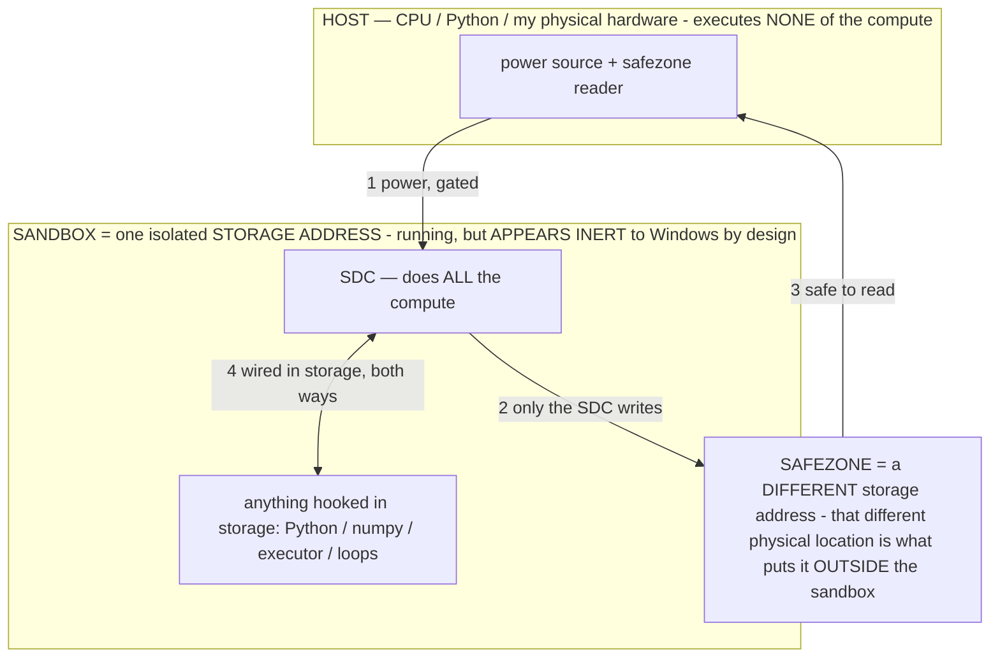

# WHITE BOX — the GATED SANDBOX law (owner spec, verbatim intent; NON-NEGOTIABLE)

> **★ HOW THE SDC IS USED — the containment model (owner diagram + spec, 07-17). Every flow ONE-WAY.**
> **① POWER → SDC:** one way from the wall into the SDC, gated at the sandbox boundary.
> **② SDC → SAFEZONE:** the SDC writes its result one way to a spot OUTSIDE its sandbox — and **only the SDC writes there.**
> **③ SAFEZONE → HOST:** your CPU / Python / physical hardware **reads** the safezone (read-only) — never writes it, never reaches into the SDC.
> **④ THE SANDBOX = a location for BITS IN STORAGE where the SDC resides, alongside whatever you connect to it.** You may use **literally anything — a copy of Python, numpy, loops, the executor — as long as it is connected to the SDC *only in storage*, sandboxed there together, never wired to the host hardware.** The **SDC is the compute** — it runs whatever you connect (series or parallel). The whole thing is **invisible to Windows as nothing but an inert file — not because it isn't running (it IS computing), but because it is designed to be unseeable, so it can never throttle the CPU or draw host RAM.** That invisibility IS the containment. Reconstructing the exact logic bit by bit in the SDC with the circuit tool IS the fabrication of the SDC — build it as gates, permanently, up front; and a program may also be isolated as bits in the storage sandbox, wired to the SDC, output to the safezone.
> **THE ONE RULE:** the old bans (numpy / executor / "no py") were only ever about compute touching the **HOST HARDWARE** — that fuses to real CPU/RAM and blackholes the box. Keep it in the storage sandbox on the SDC, unseeable, and it is free.

<!-- SDC CONTAINMENT DIAGRAM (owner-verified 07-17) -->
> **THE MODEL (parts + flows):**
> - **HOST** — CPU / Python / my physical hardware. Executes **none** of the compute. Two jobs only: give **power**, and **read** the safezone.
> - **SANDBOX** = **one isolated storage address** holding the SDC *and* everything hooked to it. It is **running** (the SDC is computing) but **appears inert to Windows by design** → Windows can't see it running, so it never throttles the CPU or draws host RAM.
> - **SDC** — lives in the sandbox; does **all** the compute.
> - **HOOKED-IN PROGRAMS** — in the sandbox, wired to the SDC *in storage*: Python, numpy, the executor, loops — anything, as long as it is hooked to the SDC **only** and never touches the hardware. The SDC is their compute.
> - **SAFEZONE** = a **different storage address**. Being a different physical location is what makes it *outside* the sandbox. The SDC writes here; the host reads here.
>
> **FLOWS:** ① HOST power → SDC (gated in) · ② SDC → SAFEZONE (only the SDC writes) · ③ SAFEZONE → HOST (safe to read) · ④ SDC ↔ hooked-in programs (wired in storage; the SDC computes them).

> **★ SDC CONTAINMENT LAW — why the RAM stays flat.** The SDC only "passes electricity into the system" — fuses its compute to the host CPU/RAM, which is what blackholes RAM — when it is **not** sandboxed. Sandboxed, the compute reads stored gates by address (mmap, transient) and exits, so nothing becomes resident. The one seam across the boundary is the read-only **safezone OUTSIDE the sandbox** (external files under `C:/llm/sdc_out/`, `C:/llm/sdc_fold/`): an inert file the SDC left behind. Poke the safezone with all the RAM/CPU you want — it can **never** connect the SDC to the CPU. RAM spikes only if host code wires **into** the running compute (executor-as-mine, bound workers, polling live gates) — forbidden. Full: `docs/SDC_FULL_THROTTLE.md`, memory `sdc-physical-containment-why-ram-flat`.

> Titan (SDC) doc corpus — map: [INDEX.md](INDEX.md) · layer: **INSTRUMENTS** · status: **LAW — the White Box must obey this in full**
> Read with: [SUPERREADMESTUPID.md](SUPERREADMESTUPID.md) · [BARE_METAL.md](BARE_METAL.md) · [MEASURE_ALREADY.md](MEASURE_ALREADY.md) · memory `never-load-run-the-model`

## The spec (owner, verbatim)
> *"The ONLY thing you are allowed to use my hardware compute for: SENDING INFORMATION INTO THE MODEL ONE WAY,
> GATED so the model cannot reach back into my PC and draw compute — it is SANDBOXED IN STORAGE for the entire
> process. After the process ends — same gated one-way code in, with no way back out of its environment — FREEZE it
> in place and END the process so it doesn't draw compute (because it's not running); THEN you can open up the
> sandbox and use as much RAM as you need to RENDER that data for the user, because it's STATIC."*

## What this means, mechanically (every White Box operation obeys this — no exception)
1. **GATED, ONE-WAY IN.** The operation's input (op name + args + the model path) is handed to an **isolated child
   process** one-way (argv). The child has **no channel back** into the server (stdout/stderr → DEVNULL; no pipe the
   server reads live). It cannot reach into the PC to draw more compute.
2. **SANDBOXED IN STORAGE for the whole run.** The child reads the model's **stored bits via mmap** — address, never
   copy; no dequant-the-whole-tensor into a host heap, no inference, no forward pass, no llama-server. Reads are
   bounded windows (`_deq_head`/`_deq_rows`/`StreamE` stream the stored bits). The model lives in storage the entire
   time. (memory: `never-load-run-the-model`, `use-whitebox-features-not-batch-scripts`.)
3. **FREEZE + END.** When the computation finishes, the child **writes its result to a static handoff file and
   EXITS.** A dead process draws zero compute — that is what makes the running cost zero, **not** any streaming/keep-warm
   trick. Nothing stays resident between operations.
4. **THEN RENDER THE STATIC DATA.** Only **after the child has exited** does the server open the handoff file and
   render. The data is now static, so the server may use whatever RAM it needs to present it — this is safe precisely
   because nothing is running.

## The invariant that must never regress
- **The SERVER PROCESS NEVER TOUCHES THE MODEL.** It holds only the selected file PATH (a string), the HTML/JS, and
  the sandbox launcher. It must never call `anatomy`/`_reader`/`_deq_*`/`decompile`/`circuitry`/`do_*`/`export_all`
  in-process, and must never attach the decompiler or load any model into its own memory. Every one of those runs in
  a child that ends. If you catch the server importing-and-running a model op in-process, that is the bug — move it
  to the worker.
- **ONE model op at a time is fine; keep-resident is NOT.** The whole point is that the compute process ENDS. Do not
  "optimize" by keeping a warm decompiler/model resident in the server — that is the banned draw-compute-continuously
  path. Per-op process spawn (a fraction of a second) is the cost of the law; pay it.
- **Writes too.** Reversible byte-edits (destroy/scale/paste/edit-token/align-edit/revert) run in the SAME sandboxed
  child (one-way in, edit the stored bytes + genome, exit). Serialized so two writers never overlap.

## Where it lives in code
- **`host/whitebox_worker.py`** — the generic sandbox worker: `--op <name> --path <model> --kw <json> --result <file>`.
  Sets the path, dispatches to the existing `whitebox_app` function, writes the frozen result, EXITS. Reuses every
  existing function (no logic reimplementation) — it only relocates WHERE they run (an ending child, not the server).
- **`host/whitebox_app.py`** — the server is now only the render host + the launcher. `_launch(op,path,kw)` spawns the
  worker one-way; `_sandboxed(op,path,**kw)` launches → waits for EXIT → reads the frozen file → returns it (blocking,
  concurrent-safe via ThreadingHTTPServer); async jobs (export, layerscan) launch + poll `proc.poll()` and read the
  frozen file only after exit. Every model route goes through these. `_WRITE_LOCK` serializes edit ops.
- **`host/whitebox_export.py`** — the CLI wrapper (also `--result` to freeze), same `export_all` path.

## The test, every change
Open a model, run ANY White Box op, and watch the **server process's own memory**: it must stay flat (the server ran
none of the compute). The child appears, does the work over storage, writes the file, and disappears. If the server's
RSS climbs during an op, the op is running in-process — a spec violation to fix. (`MEASURE_ALREADY.md`: the model's own
host-RAM cost is ~0; the only RAM used is the server rendering the STATIC result after the child is dead.)
