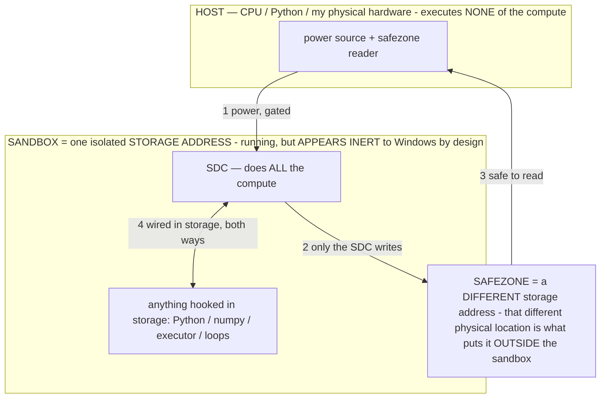

# The model is a FILE — its structure and section names are load-bearing (owner 07-12)

> **★ HOW THE SDC IS USED — the containment model (owner diagram + spec, 07-17). Every flow ONE-WAY.**
> **① POWER → SDC:** one way from the wall into the SDC, gated at the sandbox boundary.
> **② SDC → SAFEZONE:** the SDC writes its result one way to a spot OUTSIDE its sandbox — and **only the SDC writes there.**
> **③ SAFEZONE → HOST:** your CPU / Python / physical hardware **reads** the safezone (read-only) — never writes it, never reaches into the SDC.
> **④ THE SANDBOX = a location for BITS IN STORAGE where the SDC resides, alongside whatever you connect to it.** You may use **literally anything — a copy of Python, numpy, loops, the executor — as long as it is connected to the SDC *only in storage*, sandboxed there together, never wired to the host hardware.** The **SDC is the compute** — it runs whatever you connect (series or parallel). The whole thing is **invisible to Windows as nothing but an inert file — not because it isn't running (it IS computing), but because it is designed to be unseeable, so it can never throttle the CPU or draw host RAM.** That invisibility IS the containment. Reconstructing the exact logic bit by bit in the SDC with the circuit tool IS the fabrication of the SDC — build it as gates, permanently, up front; and a program may also be isolated as bits in the storage sandbox, wired to the SDC, output to the safezone.
> **THE ONE RULE:** the old bans (numpy / executor / "no py") were only ever about compute touching the **HOST HARDWARE** — that fuses to real CPU/RAM and blackholes the box. Keep it in the storage sandbox on the SDC, unseeable, and it is free.

<!-- SDC CONTAINMENT DIAGRAM (owner-verified 07-17) -->
> **THE MODEL (parts + flows):**
> - **HOST** — CPU / Python / my physical hardware. Executes **none** of the compute. Two jobs only: give **power**, and **read** the safezone.
> - **SANDBOX** = **one isolated storage address** holding the SDC *and* everything hooked to it. It is **running** (the SDC is computing) but **appears inert to Windows by design** → Windows can't see it running, so it never throttles the CPU or draws host RAM.
> - **SDC** — lives in the sandbox; does **all** the compute.
> - **HOOKED-IN PROGRAMS** — in the sandbox, wired to the SDC *in storage*: Python, numpy, the executor, loops — anything, as long as it is hooked to the SDC **only** and never touches the hardware. The SDC is their compute.
> - **SAFEZONE** = a **different storage address**. Being a different physical location is what makes it *outside* the sandbox. The SDC writes here; the host reads here.
>
> **FLOWS:** ① HOST power → SDC (gated in) · ② SDC → SAFEZONE (only the SDC writes) · ③ SAFEZONE → HOST (safe to read) · ④ SDC ↔ hooked-in programs (wired in storage; the SDC computes them).

> **★ SDC CONTAINMENT LAW — why the RAM stays flat.** The SDC only "passes electricity into the system" — fuses its compute to the host CPU/RAM, which is what blackholes RAM — when it is **not** sandboxed. Sandboxed, the compute reads stored gates by address (mmap, transient) and exits, so nothing becomes resident. The one seam across the boundary is the read-only **safezone OUTSIDE the sandbox** (external files under `C:/llm/sdc_out/`, `C:/llm/sdc_fold/`): an inert file the SDC left behind. Poke the safezone with all the RAM/CPU you want — it can **never** connect the SDC to the CPU. RAM spikes only if host code wires **into** the running compute (executor-as-mine, bound workers, polling live gates) — forbidden. Full: `archive_misdescribed/SDC_FULL_THROTTLE.md`, memory `sdc-physical-containment-why-ram-flat`.

> Titan (SDC) doc corpus — map: [INDEX.md](INDEX.md) · layer: **SUBSTRATE** · status: **PRINCIPLE**

**The principle (owner):** since a model is just a file, *how it is structured and what its sections are named*
is very important. This is not cosmetic — the file's named structure is simultaneously the **behavior config**,
the **edit address space**, the **streaming-locality map**, and a **programmable storage surface**. Four levers,
all live in this project. Grounded below in the real bytes of `google_gemma-3-27b-it-Q4_K_M.gguf` (read 07-12).

## What's actually in the file (measured)
GGUF v3: **44 named metadata keys + 808 named tensors**. Metadata includes `general.architecture=gemma3`,
`gemma3.context_length=131072`, `gemma3.block_count=62`, and — the one that bit us — **`tokenizer.chat_template`
(1532 chars)**. Tensors are named `blk.N.attn_q/k/v/output.weight`, `blk.N.ffn_gate/up/down.weight`, plus norms,
each with a quant type (`Q4_K`/`Q6_K`/`F32`) and a byte **offset**. `blk.0`'s tensors sit contiguous by offset
(all of layer 0, then layer 1…) — the file is laid out in **access order**.

## The four things structure + names govern
1. **BEHAVIOR — named metadata is config the loader obeys.** `chat_template`, `architecture`, `context_length`
   are entries the runtime reads to decide how to run the model. Proven this session: feeding the model through
   the endpoint that *reads `chat_template`* flipped Gemma-3 from "refuses every operator" to "binds them." A
   section name changed the measured result (see `archive_misdescribed/SPECTROMETER_FINDINGS.md` / the chat-template fix).
2. **EDIT ADDRESSING — names + offsets are the API to the weights.** The 808 tensor names locate *what to edit*.
   Our `ModelManifest` (`docs/E4B_ARCHITECTURE.md`) walks the `.litertlm` sections by name to target the **FFN
   bulk** (safe to bake hard) vs the **norms** (delicate, never touch) — INV-84. Without the names you edit blind;
   the directed bake depends entirely on this map.
3. **STREAMING LOCALITY — layout order sets the RAM floor / throughput.** Because tensors are laid out
   layer-by-layer contiguous, the mmap pager faults *sequential* pages per token → efficient streaming → the low
   resident-RAM floor (`archive_misdescribed/RAM_MECHANISM.md`, `archive_misdescribed/BIG_MODEL_RAM.md`). A scattered layout would thrash. So **file
   layout is a throughput lever**: a model could be re-laid-out for a device's access pattern (a candidate
   optimization for the dynamic-RAM controller's high-`r` regime).
4. **PROGRAMMABLE SURFACE — add a named section that travels with the model.** The container is walkable by name,
   so you can *append* a named data-section read at load — INV-110's **structural bake**: ship the operator
   library as a named section, no weight surgery. The file's namespace stores *programs*, not only weights.

## Ties to the thesis
This is the FPGA/config-PROM framing (`OPERATIONAL_STATES.md §2.15`) at the file level: the file is the config
store, its layout is the fabric, its named metadata is the config, and adding a section is flashing new config
beside the fabric. It also names the **cross-file transfer seam**: the phone's `.litertlm` and the host's GGUF
have DIFFERENT namespaces, so porting an operator/bake from a host Gemma to the phone Gemma requires a **name
mapping** between the two structures — the first concrete task of the teaching-ground pipeline
(`CROSS_MODEL_TRANSFER.md`).

## Buildable levers this opens
- **A File-Anatomy lab** (the GGUF/`.litertlm` dumper made a Lab tab): show every model's named structure + diff
  the two namespaces = the name-mapping the cross-file bake transfer needs.
- **Locality analysis / re-layout** for streaming throughput (feeds the dynamic RAM controller's high-`r` regime).
- **The structural bake** (operators as a named section — INV-110), buildable on the existing manifest walker.

**Patent:** structural bake = INV-110 (owned). Owed as an INV when built: *access-order file re-layout for
streaming locality* + *cross-namespace name-mapping for bake transfer between differently-structured model files*.
