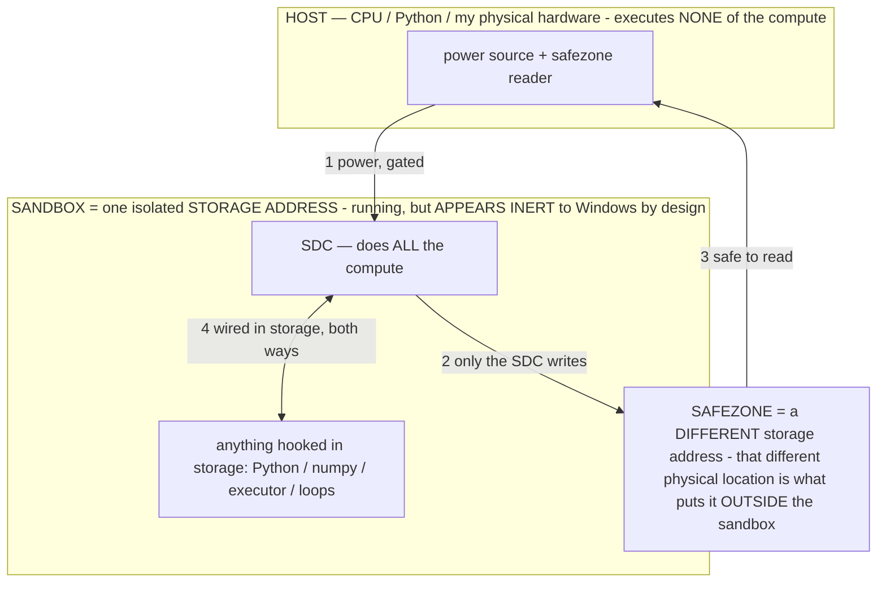

# Titan's harnesses — the coding harness + the generative runtime (owner TOP priority, 07-13)

> **★ HOW THE SDC IS USED — the containment model (owner diagram + spec, 07-17). Every flow ONE-WAY.**
> **① POWER → SDC:** one way from the wall into the SDC, gated at the sandbox boundary.
> **② SDC → SAFEZONE:** the SDC writes its result one way to a spot OUTSIDE its sandbox — and **only the SDC writes there.**
> **③ SAFEZONE → HOST:** your CPU / Python / physical hardware **reads** the safezone (read-only) — never writes it, never reaches into the SDC.
> **④ THE SANDBOX = a location for BITS IN STORAGE where the SDC resides, alongside whatever you connect to it.** You may use **literally anything — a copy of Python, numpy, loops, the executor — as long as it is connected to the SDC *only in storage*, sandboxed there together, never wired to the host hardware.** The **SDC is the compute** — it runs whatever you connect (series or parallel). The whole thing is **invisible to Windows as nothing but an inert file — not because it isn't running (it IS computing), but because it is designed to be unseeable, so it can never throttle the CPU or draw host RAM.** That invisibility IS the containment. Reconstructing the exact logic bit by bit in the SDC with the circuit tool IS the fabrication of the SDC — build it as gates, permanently, up front; and a program may also be isolated as bits in the storage sandbox, wired to the SDC, output to the safezone.
> **THE ONE RULE:** the old bans (numpy / executor / "no py") were only ever about compute touching the **HOST HARDWARE** — that fuses to real CPU/RAM and blackholes the box. Keep it in the storage sandbox on the SDC, unseeable, and it is free.

<!-- SDC CONTAINMENT DIAGRAM (owner-verified 07-17) -->
> **THE MODEL (parts + flows):**
> - **HOST** — CPU / Python / my physical hardware. Executes **none** of the compute. Two jobs only: give **power**, and **read** the safezone.
> - **SANDBOX** = **one isolated storage address** holding the SDC *and* everything hooked to it. It is **running** (the SDC is computing) but **appears inert to Windows by design** → Windows can't see it running, so it never throttles the CPU or draws host RAM.
> - **SDC** — lives in the sandbox; does **all** the compute.
> - **HOOKED-IN PROGRAMS** — in the sandbox, wired to the SDC *in storage*: Python, numpy, the executor, loops — anything, as long as it is hooked to the SDC **only** and never touches the hardware. The SDC is their compute.
> - **SAFEZONE** = a **different storage address**. Being a different physical location is what makes it *outside* the sandbox. The SDC writes here; the host reads here.
>
> **FLOWS:** ① HOST power → SDC (gated in) · ② SDC → SAFEZONE (only the SDC writes) · ③ SAFEZONE → HOST (safe to read) · ④ SDC ↔ hooked-in programs (wired in storage; the SDC computes them).

> **★ SDC CONTAINMENT LAW — why the RAM stays flat.** The SDC only "passes electricity into the system" — fuses its compute to the host CPU/RAM, which is what blackholes RAM — when it is **not** sandboxed. Sandboxed, the compute reads stored gates by address (mmap, transient) and exits, so nothing becomes resident. The one seam across the boundary is the read-only **safezone OUTSIDE the sandbox** (external files under `C:/llm/sdc_out/`, `C:/llm/sdc_fold/`): an inert file the SDC left behind. Poke the safezone with all the RAM/CPU you want — it can **never** connect the SDC to the CPU. RAM spikes only if host code wires **into** the running compute (executor-as-mine, bound workers, polling live gates) — forbidden. Full: `archive_misdescribed/SDC_FULL_THROTTLE.md`, memory `sdc-physical-containment-why-ram-flat`.

> Titan (SDC) doc corpus — map: [INDEX.md](INDEX.md) · layer: **KERNEL** · status: **BUILDING**

A **harness** turns a bare model into an agent: **loop + tool interface + context + control** (the convergent 2026
pattern — Claude Code / Codex CLI / Aider / OpenClaw all landed on it; ~98% of a real agent is harness infra, ~2% is the
model's decisions). Titan's harnesses are **outcome-driven** (owner: Titan is an extension of the user's will; success =
the OUTCOME the user asked for, proven, not a scripted procedure) and **§2-clean** (the model elects every action via a
native tool call; code only executes + feeds back the real result).

## 1. The CODING HARNESS — Codex-style (`host/coder.py`)
The write→run→**self-verify against the goal**→debug→iterate loop, over a small file-based action space:
- **Actions (tools):** `run_python` (execute in the sandbox, real stdout/stderr) · `write_file` / `read_file` /
  `list_files` (externalize state to FILES — build/edit multi-file projects, the 2026 pattern).
- **Outcome-driven:** it does not stop on a fixed step count; it iterates until EXECUTION proves the goal (the model
  writes assertions/checks and runs them), then delivers the verified result. Honest-fail if it can't (§12).
- **Two-layer** (the convergent split): the harness = control flow + tool routing (`coder.py`); the compute = the
  isolated sandbox (`C:/llm/sandbox`, 20 s cap). `cache_prompt` keeps the σ prefix warm (the "stable cached prefix" best
  practice, INV-47).
- **Proven (finding #20):** wrote+ran factorial, verified `factorial(6)==720` by real execution, 2 iters, clean.
- **Road to "REALLY good":** debugging real failures (tasks that error first), bigger multi-file projects, a lab UI, a
  stronger model (bounded by hardware here; better on the Ultra / a bigger model). Future: MCP-style tool sources
  (CI/logs), resume/replay/audit.

## 2. THE GENERATIVE RUNTIME — run a program by GENERATING its output (`host/genrun.py`)
The owner's idea: *"what if Titan sees a file and runs it on ITS OWN compute rather than yours — play Minecraft PC on a
phone, because it looks at the code and just generates and displays it on screen."* The model **IS the runtime**: given
PROGRAM (rules/code) + STATE + INPUT, it computes the next state and **generates the screen** (SVG); an installed codec
(resvg→PNG, INV-119) **displays the real frame**. So a program "runs" wherever Titan can generate — a phone plays
software its hardware can't execute, because the model **emulates the output** (emulation envelope INV-118 + render
codecs INV-119, fused into a harness; the game-generation moonshot, concrete).
- **Loop:** INPUT → model generates {next state, frame SVG} → render PNG → next INPUT → … → frames → MP4.
- **§2-clean:** the model does 100% of the "execution" (state + frame); code renders exactly what it emitted.
- **Honest scope:** a small/slow model gives rough, low-consistency frames — this proves the MECHANISM (Titan as the
  runtime); fidelity scales with the model + a **baked game operator** (bake the program's behavior into the weights, so
  the runtime holds the world consistently — the corruption-theory bake applied to a program).
- **This is where the harness meets the keystone:** the more Titan can MAP + BAKE a program's computation, the higher
  the fidelity of the generated run — "run it on Titan's compute" gets sharper as the generation-computation map does.

## 3. Where harnesses fit the router (`archive_misdescribed/ROUTER_POINTERS.md`)
A harness is a **compute source the router draws from** (owner: "the router draws from models + hardware + harnesses").
The router = operational-state layer resolves a user's request → a harness (coding, generative-runtime, research, …),
runs it like a process (schedulable, killable, inspectable), and returns the outcome. A harness COMPOSES the OS's own
components toward a goal — the big model still does the thinking each step; NOT delegation.

*Patent: the outcome-driven self-verifying coding harness + the generative-runtime (a model as a program's runtime,
emitting frames a codec displays, so software runs on generation not execution) are owed as INVs as they mature.*
