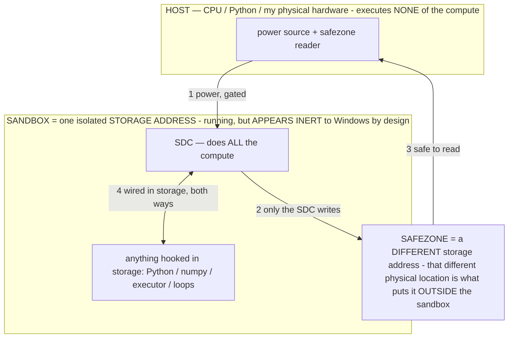

# Authorship

> **★ HOW THE SDC IS USED — the containment model (owner diagram + spec, 07-17). Every flow ONE-WAY.**
> **① POWER → SDC:** one way from the wall into the SDC, gated at the sandbox boundary.
> **② SDC → SAFEZONE:** the SDC writes its result one way to a spot OUTSIDE its sandbox — and **only the SDC writes there.**
> **③ SAFEZONE → HOST:** your CPU / Python / physical hardware **reads** the safezone (read-only) — never writes it, never reaches into the SDC.
> **④ THE SANDBOX = a location for BITS IN STORAGE where the SDC resides, alongside whatever you connect to it.** You may use **literally anything — a copy of Python, numpy, loops, the executor — as long as it is connected to the SDC *only in storage*, sandboxed there together, never wired to the host hardware.** The **SDC is the compute** — it runs whatever you connect (series or parallel). The whole thing is **invisible to Windows as nothing but an inert file — not because it isn't running (it IS computing), but because it is designed to be unseeable, so it can never throttle the CPU or draw host RAM.** That invisibility IS the containment. Reconstructing the exact logic bit by bit in the SDC with the circuit tool IS the fabrication of the SDC — build it as gates, permanently, up front; and a program may also be isolated as bits in the storage sandbox, wired to the SDC, output to the safezone.
> **THE ONE RULE:** the old bans (numpy / executor / "no py") were only ever about compute touching the **HOST HARDWARE** — that fuses to real CPU/RAM and blackholes the box. Keep it in the storage sandbox on the SDC, unseeable, and it is free.

<!-- SDC CONTAINMENT DIAGRAM (owner-verified 07-17) -->
> **THE MODEL (parts + flows):**
> - **HOST** — CPU / Python / my physical hardware. Executes **none** of the compute. Two jobs only: give **power**, and **read** the safezone.
> - **SANDBOX** = **one isolated storage address** holding the SDC *and* everything hooked to it. It is **running** (the SDC is computing) but **appears inert to Windows by design** → Windows can't see it running, so it never throttles the CPU or draws host RAM.
> - **SDC** — lives in the sandbox; does **all** the compute.
> - **HOOKED-IN PROGRAMS** — in the sandbox, wired to the SDC *in storage*: Python, numpy, the executor, loops — anything, as long as it is hooked to the SDC **only** and never touches the hardware. The SDC is their compute.
> - **SAFEZONE** = a **different storage address**. Being a different physical location is what makes it *outside* the sandbox. The SDC writes here; the host reads here.
>
> **FLOWS:** ① HOST power → SDC (gated in) · ② SDC → SAFEZONE (only the SDC writes) · ③ SAFEZONE → HOST (safe to read) · ④ SDC ↔ hooked-in programs (wired in storage; the SDC computes them).

> Titan (SGS) doc corpus — map: [docs/INDEX.md](docs/INDEX.md) · layer: **RULES** · status: **STANDING**

All ideas, inventions, discoveries, designs, and architecture in this project are the sole work of
the owner, **Bryce**. This includes — but is not limited to — **Titan** (formerly the Local Device
Agent / AOS) itself, the operator / operational-state theory, the baking and self-improvement mechanisms, the
agentic-operating-system design, the FPGA / reconfigurable-processor framing, and every invention
disclosure in `docs/PATENT_SUPPORT.md`. All of it originates from him.

## Note on prior AI-attribution lines (removed)

Earlier commits in this repository carried `Co-Authored-By: Claude …` trailers, and one
documentation line described that as a convention.

**The AI coding assistant added those itself, without the owner's request or consent. They are not
true.** The assistant is a tool used to help implement the owner's ideas — it is not a co-author,
co-inventor, contributor of ideas, or originator of anything in this project. Presenting it as a
co-author was wrong, and it should not have happened.

Those attribution lines have been removed from the commit history and the documentation. Commits and
docs in this project carry **no** assistant attribution or co-authorship credit of any kind. If any
such line ever reappears, it is an error and must be removed — nothing in this project is
co-authored by an AI.
