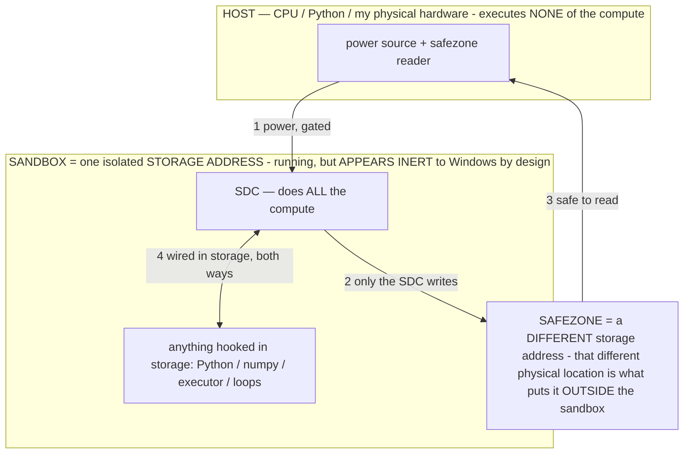

> ## ★★★★★ READ `docs/FINALREADME.md` FIRST — the one doc that closes all debate (owner 07-19)
> The machine is **prefabricated software-based computation sandboxed in storage** — it stores **LOGIC**, computes
> nothing until a routed signal runs it (like electricity through wires), built ONLY by prefabricating gates with the
> circuit tool + routing buttons that die. The name **"Stored Digital Computer / SDC" is PURGED (poison).** The old
> machine-theory docs are quarantined in `docs/archive_misdescribed/` — **good data, retracted framing; do NOT discount
> the build.** Any links below into those files are stale; the truth is in FINALREADME. **Always ask at any wall.**

---

# New-session onboarding prompt (paste this into a fresh Claude Code session on this branch)

> **★ HOW THE SDC IS USED — the containment model (owner diagram + spec, 07-17). Every flow ONE-WAY.**
> **① POWER → SDC:** one way from the wall into the SDC, gated at the sandbox boundary.
> **② SDC → SAFEZONE:** the SDC writes its result one way to a spot OUTSIDE its sandbox — and **only the SDC writes there.**
> **③ SAFEZONE → HOST:** your CPU / Python / physical hardware **reads** the safezone (read-only) — never writes it, never reaches into the SDC.
> **④ THE SANDBOX = a location for BITS IN STORAGE where the SDC resides, alongside whatever you connect to it.** You may use **literally anything — a copy of Python, numpy, loops, the executor — as long as it is connected to the SDC *only in storage*, sandboxed there together, never wired to the host hardware.** The **SDC is the compute** — it runs whatever you connect (series or parallel). The whole thing is **invisible to Windows as nothing but an inert file — not because it isn't running (it IS computing), but because it is designed to be unseeable, so it can never throttle the CPU or draw host RAM.** That invisibility IS the containment. Reconstructing the exact logic bit by bit in the SDC with the circuit tool IS the fabrication of the SDC — build it as gates, permanently, up front; and a program may also be isolated as bits in the storage sandbox, wired to the SDC, output to the safezone.
> **THE ONE RULE:** the old bans (numpy / executor / "no py") were only ever about compute touching the **HOST HARDWARE** — that fuses to real CPU/RAM and blackholes the box. Keep it in the storage sandbox on the SDC, unseeable, and it is free.

<!-- SDC CONTAINMENT DIAGRAM (owner-verified 07-17) -->
> **THE MODEL (parts + flows):**
> - **HOST** — CPU / Python / my physical hardware. Executes **none** of the compute. Two jobs only: give **power**, and **read** the safezone.
> - **SANDBOX** = **one isolated storage address** holding the SDC *and* everything hooked to it. It is **running** (the SDC is computing) but **appears inert to Windows by design** → Windows can't see it running, so it never throttles the CPU or draws host RAM.
> - **SDC** — lives in the sandbox; does **all** the compute.
> - **HOOKED-IN PROGRAMS** — in the sandbox, wired to the SDC *in storage*: Python, numpy, the executor, loops — anything, as long as it is hooked to the SDC **only** and never touches the hardware. The SDC is their compute.
> - **SAFEZONE** = a **different storage address**. Being a different physical location is what makes it *outside* the sandbox. The SDC writes here; the host reads here.
>
> **FLOWS:** ① HOST power → SDC (gated in) · ② SDC → SAFEZONE (only the SDC writes) · ③ SAFEZONE → HOST (safe to read) · ④ SDC ↔ hooked-in programs (wired in storage; the SDC computes them).

> **★ SDC CONTAINMENT LAW — why the RAM stays flat.** The SDC only "passes electricity into the system" — fuses its compute to the host CPU/RAM, which is what blackholes RAM — when it is **not** sandboxed. Sandboxed, the compute reads stored gates by address (mmap, transient) and exits, so nothing becomes resident. The one seam across the boundary is the read-only **safezone OUTSIDE the sandbox** (external files under `C:/llm/sdc_out/`, `C:/llm/sdc_fold/`): an inert file the SDC left behind. Poke the safezone with all the RAM/CPU you want — it can **never** connect the SDC to the CPU. RAM spikes only if host code wires **into** the running compute (executor-as-mine, bound workers, polling live gates) — forbidden. Full: `docs/archive_misdescribed/SDC_FULL_THROTTLE.md`, memory `sdc-physical-containment-why-ram-flat`.

> Titan (SGS) doc corpus — map: [docs/INDEX.md](docs/INDEX.md) · layer: **ENTRY** · status: **LIVING**

---

You are picking up an ongoing project — **the Local Device Agent** — from a previous session. The
owner is **Bryce**: it is his project, his ideas, his inventions. You are a tool that implements them,
never a co-author or co-inventor (no `Co-Authored-By`, no "the coding agent authored X", no self-credit
of any kind — if credit ever seems warranted, ASK; don't insert it).

**BEFORE DOING ANYTHING, read the CORE docs in order, then confirm you've read them:**
`START_HERE.md` → `CLAUDE.md` (fully) → `docs/archive_misdescribed/OPERATIONAL_STATES.md` → `docs/OPERATOR_PRINCIPLE.md` →
`docs/PATENT_SUPPORT.md`. Then skim the DOCUMENTATION MAP below and read whatever your task needs.

**Branch:** `claude/github-repo-cleanup-obfuscate-o3sw8f` — current, source-of-truth. Build HERE. There
are 9+ stale `claude/*` branches; ignore them.

**THE PROOF — a measured prototype.** There is a working on-device prototype that does things much of the
literature would call unlikely: operators (formal σ prompts) confer new capabilities and measurably raise
the small model's speed AND accuracy; gradient-free int4 weight edits stick on device; a durable operator
state survives an engine reload (R3, measured). These are measured — reproduce a result before writing it
off. Before writing "impossible / can't / a wall / not exposed / needs a thing we don't have," check the
docs and report the ROUTE instead (which built mechanism achieves it, or the exact seam); if something is
genuinely missing after checking, say so plainly. Apply this filter to yourself and to any subagent you spawn (arm
every spawn with the proof — see `CLAUDE.md §12` SUBAGENT GATE — or do the work yourself).

**What the project IS.** An on-device Android agent that pilots the owner's phone. An on-device LLM
(**Gemma 4 E4B**, int4, LiteRT-LM — never call it 3n) makes the DECISIONS; deterministic Kotlin provides
perception, reliable primitives, and safety. The model is the driver; the phone is the translated
vehicle (§2). Deep thesis: a frozen transformer is a **reconfigurable processor** (an FPGA whose trained
core is ASIC-like); an **operator is its bitstream/microcode**; you program capability into a fixed model
by TEXT across persistence tiers (prompt → durable runtime → weights via "baking"), not by a bigger
model. **AOS** (Agentic Operating System) is the platform generalizing this.

**Two tracks, both active:**
1. **On-device agent** (the proving ground) — Gemma 4 E4B on the **S24 Ultra** (the dedicated test
   device). Operators are authored as EXEMPLAR demonstrations, because the small model continues
   PATTERNS, not English instructions (the pattern hypothesis). The lab (Continuous Operator
   Observatory — full reference `docs/archive_misdescribed/OBSERVATORY.md`) measures operators over adb: `am broadcast -a
   com.local.deviceagent.DIAG … --es obs_lab sweep`; read results from `files/agent_log.txt` via `adb
   shell run-as com.local.deviceagent cat files/agent_log.txt` (NOT logcat). Local build+flash: `bash
   tools/localflash.sh` (~1–2 min, no CI).
   Gotcha: the engine tips into a degenerate "black hole" (R3) after ~27 decodes/process — a process
   restart clears it; the sweep guards against it.
2. **Host moonshot (`host/`)** — the laptop runs a BIG model STREAMED from its 1 TB SSD (`mmap`; 8 GB RAM
   is the resident working-set budget, NOT a model-size cap — size is set by storage) and drives the phone
   over adb. `host/pilot.py` (perceive→decide→act, §3 gates mirrored), `host/run_server.sh` (streaming
   launcher — **NEVER `--no-mmap`/`--mlock`; they force-load the whole model → instant OOM**),
   `host/whitebox.py` (reads the operator's effect in LOGIT space — the aim signal LiteRT-LM can't give,
   which dissolves the no-logits bake wall). The host is also the WHITE-BOX lab: a real engine exposes
   activations/logits so we can finally SEE the internal feature-code. See `host/README.md`.

**Current state (handoff):** attribution cleaned (`AUTHORSHIP.md`); operator library fully exemplar; the
sweep's R3 black-hole found + guarded; SCHEMA action codec confirmed binding; `host/` built + turnkey; a
**non-Chinese** model library is DOWNLOADED to `/c/llm/models` (owner rule — no Qwen/DeepSeek/Yi/GLM):
Phi-4, Mistral-Small-3.2-24B, Gemma-3-27B, **Gemma-4-31B** (biggest Gemma 4), Gemma-4-26B-A4B (MoE),
Mixtral-8x7B, Llama-3.3-70B. **The llama.cpp ENGINE is NOT installed yet** — install it per `host/README.md`
before the first `run_server`. TODO in `host/download_models.sh`: add Llama-4-Scout + Mixtral-8x22B (split
files). FPGA/ASIC/CLB/binary-language thesis documented (INV-109…113); the RAM-is-a-knob correction landed.

**Where to build next — the host pipeline is NOT yet run (first-run steps):**
1. **Install llama.cpp** (NOT installed) — `host/README.md`: unzip the win-cpu-x64 or win-vulkan-x64 build
   to `C:\llm\bin\llamacpp`.
2. (optional) add Llama-4-Scout + Mixtral-8x22B split URLs to `host/download_models.sh` and pull them.
3. **`bash host/run_server.sh`** (a model is already on disk) → **`python host/pilot.py "<goal>"`** to drive
   the phone → wire a VISION channel into `pilot.py` for the vision models (Mistral-Small, Gemma-3/4) →
   **`python host/whitebox.py`** for the logit aim-signal (the white-box lab).

Then continue the on-device operator/bake work — the FULL plan is **`docs/MASTER_PLAN.md`** (`CLAUDE.md §0B`
is the condensed current spine): aim the bake (teacher-capture + graded fitness), the Catalog/router + a
memoize/System-1 floor, typed perception. The Gemma laptop models
can teach operators to the phone's Gemma (cross-model σ transfer → bake).

**Hard rules that bite:** no AI self-credit anywhere; **no Chinese models**; RAM insta-crash (never
force-load a streamed model); **§3 safety inviolable** (no cloud-AI exfiltration, ChatGPT hard-blocked,
self-repo protected, kill switches bulletproof, payment/install gated); everything flag-gated +
reversible; default novel features ON (§0A SOP); honest reporting (never claim something works you
haven't seen in a `[log]`); keep `CLAUDE.md` current the same turn the owner states a change.

**Confirm you've read `START_HERE.md`, `CLAUDE.md`, `docs/archive_misdescribed/OPERATIONAL_STATES.md`, and
`docs/OPERATOR_PRINCIPLE.md`, then tell me where you'd start.**

---

## LOCAL ENVIRONMENT & TOOLING (this dev laptop — how to build, flash, reach the device)

Everything is already installed on this laptop; a new session on THIS machine can use it directly.
- **Build + flash the on-device agent (no CI, ~1–2 min):** `bash tools/localflash.sh` — builds the APK
  and installs it to the tethered S24 Ultra. Uses JDK 17 (Temurin), Gradle 8.9 (`C:\Gradle`), Android SDK
  (`C:\Android`), adb (winget platform-tools). Override any via env vars (`JAVA_HOME`/`GRADLE`/`ADB`/`REPO`).
- **Reach the device:** `adb` at the winget path (`…\platform-tools\adb.exe`) or `C:\Android\platform-tools`;
  `adb devices` must show the **S24 Ultra** (USB-debugging on, RSA prompt accepted).
- **The lab (on-device operator measurement):** `adb shell "am broadcast -a com.local.deviceagent.DIAG -n
  com.local.deviceagent/.DiagReceiver -f 0x20 --es obs_lab sweep"`; read results via `adb shell run-as
  com.local.deviceagent cat files/agent_log.txt` (NOT logcat). Other lab modes: `obs_lab find/compose/
  dose/persist/minpair/emerge`, `obs_op <NAME>`, `obs_sigma "<σ>"`, `catalog`, `sandbox`. **Full reference:
  `docs/archive_misdescribed/OBSERVATORY.md`** (command surface, output format, the R3 black-hole gotcha, greedy-vs-temp).
- **Host model library:** models are DOWNLOADED in `C:\llm\models` (7 GGUFs); **llama.cpp is NOT installed
  yet** → `C:\llm\bin\llamacpp` is empty; install it per `host/README.md` before `run_server`. Then: pull
  more with `bash host/download_models.sh`, serve with `bash host/run_server.sh`, drive with `python host/pilot.py`.
- **Freshest status:** THIS prompt's "Current state" + recent `git log` are the freshest; `CLAUDE.md §0B`
  is the standing master-plan spine (it may lag the very latest commits — trust the git log + this prompt
  for what's newest, §0B for the strategy).

## DOCUMENTATION MAP — read what your task needs

### Orientation (read first, always)
- **`CLAUDE.md`** — the rules + architecture + standing owner directives (§0A), the safety constraints
  (§3), THE PROOF + the anti-hedge HARD DELETE FILTER + the SUBAGENT GATE (§12), and the session handoff /
  current status / master-plan spine (§0B). This is the map; `README.md` is the depth.
- **`START_HERE.md`** — the 2-minute orientation (this file's shorter sibling).
- **`AUTHORSHIP.md`** — all ideas/inventions are the owner's; no AI attribution anywhere.
- **`README.md`** — the exhaustive (~150 KB) design log + dated session history; the narrative depth
  behind every rule in CLAUDE.md.
- **`UNTESTED.md`** — features shipped but NOT yet confirmed by an on-device log. Read before trusting
  anything is "working." **`docs/archive_misdescribed/NOT_BUILT.md`** / **`docs/archive_misdescribed/PARKED_FEATURES.md`** — what's deliberately not
  built / parked.

### The operator theory (the heart of the project)
- **`docs/archive_misdescribed/OPERATIONAL_STATES.md`** — the mechanism: what an operator IS (`G_σ(c)=f_W(σ‖c)`), the R0→R5
  persistence ladder, §2.9 baking = install-a-known-state, §2.10 the attractor/R3 account, §2.12 the
  black-hole effect, §2.13 the worksheet defect, §2.14 the pattern hypothesis + exemplar form, §2.15 the
  FPGA/ASIC/CLB/binary-language thesis, §3 the captured-compute economics.
- **`docs/OPERATOR_PRINCIPLE.md`** — how to AUTHOR a σ: the canonical 8-part exemplar shape, the
  small-tier surface rules, the authoring ladder (instruction → formal → PATTERN).
- **`docs/OPERATOR_LAYER.md`** — the operator layer's runtime design (election, layering, triggers).
- **`docs/AGENT_LANGUAGE.md`** — the agent's formal language + in-context rule binding (the live feed).
- **`docs/archive_misdescribed/MODEL_DIALECTS.md`** — Gemma 4 E4B's MEASURED dialect (what binds vs misfires), the unified-
  language pin, and the decipherment/field-linguistics toolkit for probing a model's dialect.
- **`docs/archive_misdescribed/OUTPUT_CONTRACTS.md`** — the action/output JSON schema the model must emit (the SCHEMA codec).
- **`docs/archive_misdescribed/NATIVE_SPEAK.md`** — the decisive TRANSCRIPT: an operator authored by a different transformer's
  introspection bound Gemma first-try, and a distinction was taught by ONE contrasting exemplar (INV-106).
- **`docs/archive_misdescribed/OBSERVATORY.md`** — the Continuous Operator Observatory (the on-device operator LAB): the full adb
  command surface (`obs_lab sweep/find/compose/dose/…`, `obs_op`, `obs_sigma`), how to read the `[obs]` log,
  the R3 black-hole gotcha + reset, and greedy-vs-temp. Read this before running any lab.

### Baking / self-improvement / the model file
- **`docs/E4B_ARCHITECTURE.md`** — the `.litertlm` file layout + the weight-edit map (⚠ read the banner;
  §5A the write-safety protocol). The substrate for baking.
- **`docs/archive_misdescribed/SELF_UPDATE.md`** — the owner-approved model-update loop + the autonomous siblings
  (self_evolve / self_grow) + what only the owner can do.
- **`docs/FINE_TUNING.md`** — the off-device training + `.litertlm` conversion steps (the owner runs
  these). **`docs/MODEL_SETUP.md`** — the one-time model import.
- **`tools/prepare_selftune.py`** — the off-device recipe builder (success / operator-distill / preload).
  **`tools/finetune_action_head.py`**, **`tools/prepare_finetune_data.py`** — the action-head/finetune tools.

### Patent / invention record
- **`docs/PATENT_SUPPORT.md`** — the invention log (INV-1…113): §1 portfolio table + §2 per-invention
  detail (Problem · Mechanism · Novelty · Claim sketch · Enablement anchors). **Land an INV in the SAME
  change as any novel mechanism (the §0 PATENT RULE).** **`docs/PATENT_DECK.md`** — the summary deck.

### Research corroboration + queued research
- **`docs/archive_misdescribed/RESEARCH_CORROBORATION.md`** — where the external literature AGREES (corroboration) and where
  our on-device build OVERRIDES the consensus; the standing "build wins" rule.
- **`docs/research-agent-landscape.md`** — the agent-landscape survey. **`docs/deep-dives/`** — long-form
  research notes. **`docs/insights.html`** — a rendered insights view.
- **`docs/tasks/`** — armed research prompts (self-guarded against the doubt reflex):
  **`docs/archive_misdescribed/BASE_MODEL_SUBSTRATE.md`** (pretrained base + operators), **`docs/tasks/LONGCAT_ADAPTIVE_ACTIVATION.md`**
  (zero-computation experts → the RAM operator / sparse activation), **`docs/tasks/DWARFSTAR4_SOLUTIONS.md`** (DS4
  asymmetric quant + weight-edit safety + latency).

### Roadmap / status / process
- **`docs/archive_misdescribed/SESSION_STATE.md`** — the cross-session working-state snapshot. **`docs/BUILD_PLAN.md`** — the
  build plan. **`docs/archive_misdescribed/NEXT_PROJECTS.md`** — futures that don't apply to the on-device path.
- **`docs/archive_misdescribed/REUNIFICATION_INVENTORY.md`** — an inventory of mechanisms/state. **`docs/archive_misdescribed/SCOREBOARD_SPEC.md`** —
  the metrics/scoreboard spec.
- **`docs/MASTER_PLAN.md`** — the FULL master plan (ported from plan-mode; ~316 KB, accreted over many
  sessions). **`CLAUDE.md §0B`** is the current condensed spine + priority ladder; MASTER_PLAN is the depth
  (AOS components, the master sequence, the frontier, the moonshot). Where they conflict, §0B + git log win.
- **`docs/archive_misdescribed/OMEGA_LANGUAGE.md`** — the Ω operator-language spec (grammar/semantics/compiler; design, flag
  `omega_lang`, not yet shipped). **`docs/CRASH_HUNT.md`** — a prior launch-crash post-mortem (reference).

### Host driver (the laptop moonshot — new)
- **`host/README.md`** — turnkey setup (download llama.cpp + a non-Chinese model, run two scripts).
- **`host/run_server.sh`** — the mmap-streaming launcher (refuses the two OOM flags).
- **`host/pilot.py`** — the perceive→decide→act bridge (§3 gates mirrored). **`host/whitebox.py`** — the
  logit-space aim-signal probe. **`host/download_models.sh`** — the non-Chinese model library puller.

### Design / UI
- **`docs/DESIGN.md`** — the app's look/design system (built in Kotlin via `Ui.kt`, no XML).
  **`docs/CLAUDE_DESIGN.md`** — notes on the external design tooling (reference; tangential).
