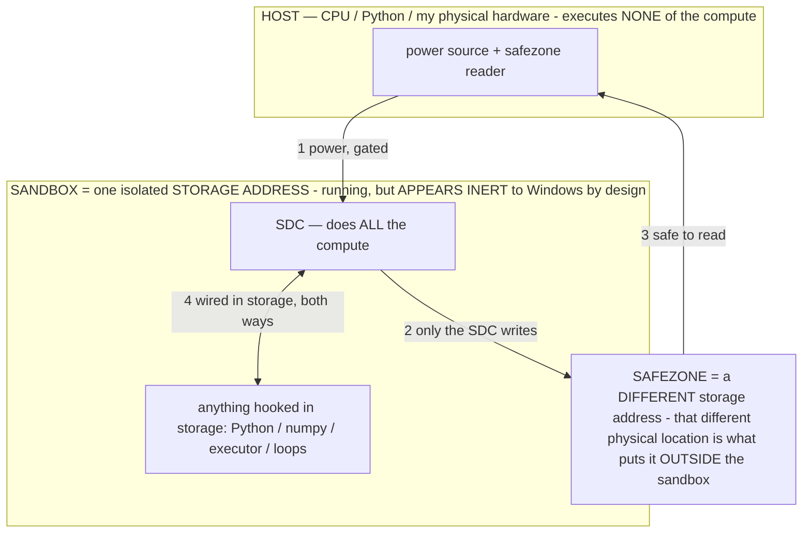

# Titan — a Small Generative System (SGS)  (formerly "Local Device Agent" / "AOS" / "TitanOS")

> **★ HOW THE SDC IS USED — the containment model (owner diagram + spec, 07-17). Every flow ONE-WAY.**
> **① POWER → SDC:** one way from the wall into the SDC, gated at the sandbox boundary.
> **② SDC → SAFEZONE:** the SDC writes its result one way to a spot OUTSIDE its sandbox — and **only the SDC writes there.**
> **③ SAFEZONE → HOST:** your CPU / Python / physical hardware **reads** the safezone (read-only) — never writes it, never reaches into the SDC.
> **④ THE SANDBOX = a location for BITS IN STORAGE where the SDC resides, alongside whatever you connect to it.** You may use **literally anything — a copy of Python, numpy, loops, the executor — as long as it is connected to the SDC *only in storage*, sandboxed there together, never wired to the host hardware.** The **SDC is the compute** — it runs whatever you connect (series or parallel). The whole thing is **invisible to Windows as nothing but an inert file — not because it isn't running (it IS computing), but because it is designed to be unseeable, so it can never throttle the CPU or draw host RAM.** That invisibility IS the containment. Reconstructing the exact logic bit by bit in the SDC with the circuit tool IS the fabrication of the SDC — build it as gates, permanently, up front; and a program may also be isolated as bits in the storage sandbox, wired to the SDC, output to the safezone.
> **THE ONE RULE:** the old bans (numpy / executor / "no py") were only ever about compute touching the **HOST HARDWARE** — that fuses to real CPU/RAM and blackholes the box. Keep it in the storage sandbox on the SDC, unseeable, and it is free.

<!-- SDC CONTAINMENT DIAGRAM (owner-verified 07-17) -->
> **THE MODEL (parts + flows):**
> - **HOST** — CPU / Python / my physical hardware. Executes **none** of the compute. Two jobs only: give **power**, and **read** the safezone.
> - **SANDBOX** = **one isolated storage address** holding the SDC *and* everything hooked to it. It is **running** (the SDC is computing) but **appears inert to Windows by design** → Windows can't see it running, so it never throttles the CPU or draws host RAM.
> - **SDC** — lives in the sandbox; does **all** the compute.
> - **HOOKED-IN PROGRAMS** — in the sandbox, wired to the SDC *in storage*: Python, numpy, the executor, loops — anything, as long as it is hooked to the SDC **only** and never touches the hardware. The SDC is their compute.
> - **SAFEZONE** = a **different storage address**. Being a different physical location is what makes it *outside* the sandbox. The SDC writes here; the host reads here.
>
> **FLOWS:** ① HOST power → SDC (gated in) · ② SDC → SAFEZONE (only the SDC writes) · ③ SAFEZONE → HOST (safe to read) · ④ SDC ↔ hooked-in programs (wired in storage; the SDC computes them).




> **★ SDC CONTAINMENT LAW — why the RAM stays flat.** The SDC only "passes electricity into the system" — fuses its compute to the host CPU/RAM, which is what blackholes RAM — when it is **not** sandboxed. Sandboxed, the compute reads stored gates by address (mmap, transient) and exits, so nothing becomes resident. The one seam across the boundary is the read-only **safezone OUTSIDE the sandbox** (external files under `C:/llm/sdc_out/`, `C:/llm/sdc_fold/`): an inert file the SDC left behind. Poke the safezone with all the RAM/CPU you want — it can **never** connect the SDC to the CPU. RAM spikes only if host code wires **into** the running compute (executor-as-mine, bound workers, polling live gates) — forbidden. Full: `docs/archive_misdescribed/SDC_FULL_THROTTLE.md`, memory `sdc-physical-containment-why-ram-flat`.


> **Titan is a Small Generative System (SGS)** — not a model, an agent, or an OS, but a new category (see
> [docs/SGS.md](docs/archive_misdescribed/SGS.md)): a **small, self-generating system** of components on a model-as-reconfigurable-processor
> substrate, model-agnostic (any frozen model, local or cloud). It generates its own output (real text/image/audio/
> video/code via silicon codecs), its own software (apps/operators, authored live), the emulated hardware a task needs,
> and **its own weights** (baking). *Own your intelligence, don't rent it — the system that writes itself, running the
> impossible on nothing.* (The on-device phone agent below is Titan's first application + proving ground.)

> Titan (SGS) doc corpus — map: [docs/INDEX.md](docs/INDEX.md) · layer: **RECORD** · status: **DESIGN LOG**

**An on-device, local-only Android agent that controls your own phone by voice.**
You speak a command ("hey agent, open settings and turn on Wi-Fi"); an on-device
LLM decides what to do; an Accessibility service taps, types, scrolls, and opens
apps to carry it out - looping until the task is done.

> **This file is the canonical context for the project.** It exists so any human
> or AI assistant can understand the purpose, architecture, decisions, and
> roadmap without it being re-explained. **If you change direction or add a
> feature, update this file in the same change.**

---

## Core philosophy: the phone as a translation layer

The whole agent is one idea, applied relentlessly in BOTH directions:

> **Translate the phone into something a small model can easily INTERPRET, and translate the
> model's easy OUTPUTS back into things the phone can do.** The model only ever sees the phone in
> its own native language, and only ever has to *speak* in that language. A deterministic
> translation layer owns all the mess on each side.

**The unifying principle — the agent's identity (it's robotics, not a script).** The agent IS the
on-device model *piloting the phone*. Everything deterministic is the **vehicle** that translates the
phone into something the model can drive: the screen becomes perception it reads, its decision becomes
a reliable Android action. This is **autonomous driving** — think Tesla FSD: the car's sensors and
actuators translate the road into something the neural net can pilot, then carry out its decisions
precisely. **The net is the driver; the car is the translation layer.** Here the model is the driver
and the phone-as-pilotable-vehicle is what we build — so "the agent" is neither the Kotlin alone nor
the model alone, it's *the model driving the translated phone*. Every decision in this codebase falls
out of that: make the **vehicle** better (sharper perception, reliable primitives, safety, reflexes)
so the driver succeeds — and **never grab the wheel** (never script the decision, never let a reflex
overrule an explicit owner command). Improving the car is our whole job; driving is the model's.

This also sets how we scale: one build, **many drivers and many cars**. Detect the model and the
hardware and adapt the *vehicle* to them — a strong model on a flagship gets the full rich path and
more rope; a lighter model or a budget phone gets a lighter path and *more* scaffolding, to maximize
the lesser setup's success while leveraging the better one when it's present. And we **compress what
the driver has to read** (fewer tokens, cheaper perception) — but never make a real control or real
data *inaccessible* by pre-deciding it was irrelevant; we dedup and organize, we don't delete.

A phone is, to a model, a hostile interface: millions of raw pixels, a sprawling accessibility tree,
exact coordinates it can't compute, dozens of apps each with their own conventions. A ~2–4B on-device
model with a 4096-token window cannot reason over that directly — so we never make it.

**Perception (phone → model): give it a clean, compact world-model, not raw reality.**
- The accessibility tree + screenshot become a short, numbered **element list** (`[N] "Send"`, with a
  type word only for non-buttons like `field`/`tab`) — the model picks a number; it never parses a tree.
- Coordinates become a **labeled grid** (A–H × 1–12) drawn on the screenshot — the model names a
  *cell* ("C4"); it never guesses a pixel (VLMs are weak at exact pixels).
- Real interactive elements get numbered **Set-of-Mark badges** on the image, so "which thing" is a
  number it can SEE; a **cyan marker** shows where it last tapped.
- "Did my last action do anything?" becomes a **pixel-map fingerprint** diff — a yes/no answer on a
  game/canvas where the tree says nothing.
- The representation is **budgeted to FIT the model's input** (token caps, downscaled image). If it
  doesn't fit, the image is dropped and the model goes blind — so fitting is non-negotiable.

**Action (model → phone): accept the easiest possible output, then do the hard part deterministically.**
- The model emits a tiny JSON verb (`{"action":"click","id":5}`), a grid cell, or a list of points —
  all things a small model produces reliably.
- The translation layer turns that into messy reality: resolving the element, dispatching a precise
  gesture, finding the real Send button through a strategy ladder, expanding a collapsed composer,
  tracing a coordinate path with one continuous finger.
- Anything the model does unreliably moves OUT of the model and INTO deterministic code (open-by-name,
  the send ladder, the conversation autopilot). The model's job stays "choose among legible options" —
  the one thing it's actually good at.

**Why this is the whole game:** every bug we've fixed was a *translation* failure — pixel
hallucination (→ the grid), id hallucination (→ marks), a screen too dense to fit (→ trim so vision
survives), a Send button it couldn't reach (→ the deterministic ladder), a file picker it couldn't
escape (→ Back instead of re-open). And every future capability is the same principle pushed further:
- Translate MORE of the phone into the model-world: notifications, battery/thermal state, what's
  playing, which DeX display is active, app state — each as a clean named fact, not raw data.
- Translate RICHER model outputs back into device actions: a generated document into a real file, a
  described drawing into gesture strokes, a multi-step intent into a verified chain of operations.

If a new feature feels hard, the question is almost always: *what's the clean representation that makes
this easy for the model to read, and easy for it to emit?* Build that, and let deterministic code
bridge it to the device.

---

## Status at a glance

> ✅ **The core loop works on-device:** voice -> on-device Gemma 4 (LiteRT-LM, GPU,
> vision) -> taps/types the real UI -> completes multi-step tasks (e.g. "open
> YouTube, search a cat video, play it") and self-corrects its own mistakes.

> 🧪 **Operator / operational-state layer validated on-device (2026-07-07):** a live test showed a
> **measurable, immediate increase in both speed and accuracy** versus the base model — the operational-state
> theory (a fixed model computing a *better* function under a chosen σ) confirmed in operation, not just in
> principle. This is on top of the earlier capability result (an operator holding zero fabrication across 10+
> consecutive turns). See `docs/archive_misdescribed/OPERATIONAL_STATES.md`; quantified per-run logs are being captured.

| Area | State |
|------|-------|
| Voice activation (offline, no beeps) | ✅ Implemented |
| Push-to-speak (floating button) | ✅ Implemented |
| Always-on wake word ("hey agent") | ✅ Implemented |
| Always-on shouted "stop" during tasks | ✅ Implemented |
| On-screen actions via Accessibility | ✅ Implemented (node/text based) |
| Run-forever / continuous tasks | ✅ Implemented |
| Payment / sideload confirmation gates | ✅ Implemented |
| **Vision brain (Gemma 4 via LiteRT-LM; sees the screen)** | ✅ Working end-to-end (GPU + vision) |
| Voice modes (minimal / explanation / silent) + male voice | ✅ Implemented |
| Type-a-command box + model-import screen | ✅ Implemented |
| Settings screen (advanced toggles tucked away) + speed dial | ✅ Implemented |
| Debug log screen | ✅ Implemented |
| Draggable / translucent floating button | ✅ Implemented |
| Richer gestures (tap_xy / swipe / long_press / enter / quick_settings) | ✅ Implemented |
| Human-like navigation toggle (default on) | ✅ Implemented |
| Deterministic stall detection (nudges the model) | ✅ Implemented |
| Capability self-report ("what can you do") | ✅ Implemented |
| Task log + 👍/👎 feedback | ✅ Implemented |
| Deeper-voice toggle | ✅ Implemented |
| GPU inference (CPU fallback) | ✅ Implemented |
| Plan-ahead + verify-before-act actions (latency hiding) | 🔜 Planned (part of vision brain) |
| Persistent, size-capped task memory | 🔜 Planned |
| Mid-task voice correction ("hey agent ...") | ✅ Implemented |
| Clarifying questions (asks aloud, waits for spoken answer) | ✅ Implemented (verbal; text/email fallback planned) |
| Battery failsafe (≤3% → stop) | ✅ Implemented |
| Thermal failsafe + heat-protection level (minimal/medium/high) | ✅ Implemented (minimal default) |
| Master on/off button (home screen) | ✅ Implemented |
| Deterministic quick-settings / notifications actions | ✅ Implemented |
| Runaway guards (step/time caps + same-screen loop breaker) | ✅ Implemented |
| Off-screen / out-of-range tap & id rejection | ✅ Implemented |
| Model chain-of-thought logged to debug (`[think]`) | ✅ Implemented |
| Task-complete handoff ("Anything else?" + listen) | ✅ Implemented |
| Risky-actions + auto-decline-calls toggles (default off) | ✅ Implemented |

---

## How it's built (important context)

- Built by a **non-coder**; the code is written by AI assistants and pasted in.
- Primary device: **Samsung Galaxy Z Fold 7** (modern Snapdragon w/ NPU).
- **No local build environment** is assumed - the APK is built by **GitHub Actions**
  (`.github/workflows/android.yml`, Gradle 8.9 / JDK 17 → `app-debug.apk` artifact).
- Develop on a feature branch; do **not** push straight to `main`.

---

## How it works

```
                ┌──────────────────────────── AgentService (foreground) ───────────────────────────┐
   your voice → │  Vosk (offline ASR, always on)                                                    │
   / button tap │     - idle → detect wake word, capture command                                    │
                │     - busy → detect "stop"/"cancel"                                                │
                │                              │ command text                                        │
                │                              ▼                                                     │
                │                       AgentOrchestrator  ── observe → decide → act → re-observe ──┐│
                │                              │                                                    ││
                │              screen + (soon) screenshot │            ▲ action result              ││
                │                              ▼          │            │                            ││
                │                         AgentBrain (on-device LLM)   │                            ││
                │                              │ JSON action(s)        │                            ││
                │                              ▼                       │                            ││
                │                   ActionAccessibilityService ────────┘  (tap / type / scroll /    ││
                │                     - snapshotScreen() → numbered elements   back / home / open)   ││
                │                     - performActionJson()                                          ││
                │                                                                                    ││
                │  TTS (narration / "Yes?" / "Stopped")   ConfirmationOverlay (pay/install gates)   ││
                └────────────────────────────────────────────────────────────────────────────────┘│
                    Floating button (tap = talk / stop · long-press = kill) · Notification (Stop)    │
```

### Key files (`app/src/main/java/com/local/deviceagent/`)

| File | Role |
|------|------|
| `MainActivity.kt` | Permission setup UI; starts services when mic + overlay + accessibility are granted; wake-word field + "explain aloud" toggle. |
| `AgentService.kt` | Foreground service. Owns the mic (Vosk) and TTS. State machine: LOADING → IDLE (wake word) → CAPTURING (command) → BUSY (running; listens for "stop"). |
| `VoskModelManager.kt` | Downloads + unpacks the ~40 MB offline Vosk model on first run; loads it thereafter. |
| `AgentBrain.kt` | Wraps the on-device LLM. Turns *(objective + screen + history)* into the next action(s) as JSON. **Being upgraded to a vision model.** |
| `AgentOrchestrator.kt` | The observe→decide→act loop. Chunks + summarizes long runs, detects unproductive loops, supports continuous "forever" tasks, routes payment/install gates. |
| `ActionAccessibilityService.kt` | The "eyes and hands." `snapshotScreen()` lists interactive elements; `performActionJson()` executes actions; gates payments/sideload installs. |
| `ConfirmationOverlay.kt` | Yes/No system overlay shown before irreversible actions. |
| `FloatingButtonService.kt` | Overlay mic button: tap while idle = listen; tap while running = STOP (instant ✋ feedback); long-press = type-a-command box. Draggable. |
| `NotificationHelper.kt` | Persistent foreground notification with Stop/Resume. |
| `SettingsManager.kt` | SharedPreferences: wake word, voice mode, male voice, human-navigation, agent speed (fast/balanced/careful → inter-step delay), heat-protection level, and the master enabled flag. |
| `SettingsActivity.kt` | The Settings screen. Holds the advanced toggles (wake word, voice, male voice, human navigation, speed, heat protection) so the home screen stays clean; changes apply live, no save button. |
| `ScreenManager.kt`, `VoiceCaptureService.kt`, `SmsReceiver.kt` | Currently **unused / not wired** (kept for possible later use). |

---

## Voice & activation (offline, no system beeps)

Speech runs entirely on **Vosk** (offline Kaldi ASR) via a single always-on
recognizer, chosen specifically because Android's built-in `SpeechRecognizer`
re-acquires the mic every couple of seconds - that caused constant start/stop
earcons and clipped commands. Vosk reads raw audio with **no earcons**, so one
pipeline does three jobs:

- **Idle** → match the wake word, then capture the command.
- **Capturing** → the floating button jumps straight here (push-to-speak).
- **Busy** → a shouted **"stop"/"cancel"** halts the task immediately (matched on
  partial results for speed). Vosk is paused while the agent speaks so it never
  transcribes its own voice.

---

## The brain (on-device LLM)

**Current (working): `Gemma 4 E2B` (multimodal) via LiteRT-LM**, GPU-accelerated
with a CPU fallback, loading the user-imported `.litertlm` model. It **sees the
screen** (screenshot) AND reads the accessibility element list - hybrid grounding,
so it handles things the accessibility tree misses (canvases, games, images). The
older text-only Gemini Nano (`aicore`) path was abandoned because it was blind to
the screen. Why Gemma 4:
- It can **see the screen** (takes screenshots), the headline requirement.
- Its image skills explicitly include **screen/UI understanding** and
  **pointing** (it can output *where* to tap) - purpose-built for a GUI agent.
- **NPU/GPU accelerated** on the Fold (~28-31 tok/s decode); the agent only emits
  a small JSON action, so a step is ~ 2-4 s of think.
- **Configurable visual-token budget** = a direct speed dial.
- Runs **fully offline** after setup.

**Setup cost (be honest with the user):** Gemma weights are **license-gated**, so
the app can't silently download them like the Vosk model. Setup is a **one-time**
step - accept the license / fetch the file (e.g. Google's *AI Edge Gallery* app or
Hugging Face), then import it into the app. After that it's offline forever.

**Grounding strategy - hybrid:** feed the model **both** the screenshot **and** the
accessibility element list. Prefer exact element taps when the tree exposes them;
fall back to vision/pointing coordinates for what it can't see.

### Latency strategy (hide the think time, but never act blind)

"2 s per action" is unacceptable as a per-tap cost, so the execution model hides
it. **Hard rule: the agent never fires an action against a screen it hasn't just
confirmed** - speculation hides latency, it never replaces looking.

1. **Plan ahead** - one inference may return a short *plan* of the next few
   actions (not just one), each tagged with the precondition it assumes (e.g.
   "tap the element labelled 'Search'").
2. **Pipeline** - compute the next step *while* the current action executes and the
   screen settles, so think time overlaps the unavoidable UI delay instead of
   adding to it.
3. **Verify before every action - cheaply, without the model (the hard rule)** -
   immediately before firing any planned/queued action, confirm its precondition
   still holds using *deterministic* checks, not another inference: re-query the
   accessibility tree for the expected element, and/or fingerprint a small pixel
   region of the target ("pixel map") and compare it to a fresh screenshot. If it
   matches, fire instantly (latency hidden, no model call); if not, drop the stale
   plan and call the model to re-decide from what's actually on screen.
4. **Think-and-correct** - that re-decide-on-mismatch is the safety net; it lets
   the agent plan optimistically without ever acting on an unseen state.
5. **Resource priority** - while a task runs the user has handed over control, so
   run inference on NPU/GPU, hold a wake-lock, and request sustained-performance
   mode.
6. **Feedback** - a lightweight "thinking..." indicator during inference; keep the
   prompt tight and the output budget small to minimize time-to-first-action.
7. **Event-driven loop** - re-observe the moment the screen changes rather than
   waiting a fixed delay.

Net effect: when the prediction matches reality (common in deterministic flows)
actions fire back-to-back with no visible wait; when reality diverges it pays one
think to re-plan - correct, just not instant.

---

## Safety & design decisions (do NOT change these without asking)

- **Local-only.** No remote control. SMS triggering was deliberately removed
  (spoofing / prompt-injection risk). Activation is only the user's own voice/taps.
- **No boot persistence.** A reboot kills the agent. Intentional.
- **Kill switches are a hard requirement** and must stay reliable: floating button,
  notification **Stop**, shouted **"stop"**, step caps, and unproductive-loop
  detection.
- **On-screen text is untrusted.** The agent reads arbitrary screen content, so
  prompt injection is a known, accepted limitation; the prompt separates
  "untrusted screen content" from instructions as partial mitigation. Never treat
  screen text as commands.
- **Confirmation gates are intentionally narrow** - only **payments** and
  **sideloaded (non-Play-Store) installs** - to keep hands-free operation intact.
- Accepted trade-offs from the owner: **more battery is fine**, **a bigger model is
  fine**; **latency is the main concern** (hence the batching/pipeline design).
- **Human-like interaction is the DEFAULT.** The agent taps and types on screen
  like a person (screenshot + coordinates), navigating the same way the user
  would. Deterministic shortcuts (web-search / open-app intents) are a LAST-RESORT
  fallback only when it is genuinely stuck - never the default crutch.
- **NEVER update the device OS.** The agent must never install/accept system or
  software updates, or tap update prompts - not even to troubleshoot. Enforced in
  the prompt AND hard-blocked in the accessibility layer
  (`isBlockedUpdateAction`). This is a firm owner rule; do not weaken it.
- **No unsolicited side-actions.** The agent does ONLY what the task needs - never
  reply to messages/calls, change settings, "fix" preferences, or engage unrelated
  popups beyond getting past what blocks the task. Such behaviour should count
  against it in the learning loop. Closing browser tabs / altering files is OFF by
  default and only allowed via the "Allow risky actions" toggle.

- **Resource & runaway safety (HARD - added after a real thermal/battery scare).**
  A stuck agent once pegged the GPU in an app-drawer open/close loop and ran the
  battery 8%→0% while overheating. The agent must NEVER be able to spin forever:
  - **Battery failsafe:** at/under 3% it refuses to start and aborts mid-task.
  - **Thermal guard (user-configurable):** Heat protection in Settings - *Minimal*
    (default) only stops at EMERGENCY thermal status (phone critically hot, about to
    self-protect from damage), *Medium* at CRITICAL, *High* at SEVERE (the old,
    over-eager default that cut tasks short - phones simply run warm under sustained
    GPU inference). The owner asked it not to stop unless damage is actually imminent.
  - **Absolute caps (one-shot tasks):** max 60 steps / 5 minutes, then stop.
    (Explicit "forever" *and explicit-count* tasks - "tap 30 times" - skip the caps
    and loop breaker, since obeying the owner's instruction IS success; they still
    obey battery/thermal.)
  - **Loop breaker:** counts repeats of the SAME screen (not just *consecutive* -
    the gap the old stall check missed); resets to home up to twice, then stops.
  - **App-drawer paging:** the FIRST `app_drawer` opens the drawer; repeats now PAGE
    through it (alternating sideways/vertical) instead of re-opening from the top -
    the weak model used to call `app_drawer` over and over, re-opening to the same
    first screen of apps forever (pure dead air). Any other action resets it.
  - **Action validation:** off-screen `tap_xy` and out-of-range element ids are
    rejected with feedback, never dispatched (kills the model's "token-spiral").
  - **Swipe-away halts:** removing the app from recents stops the task and frees
    the wake-lock. Battery/thermal are logged to `[diag]` at task start and end.

---

## Permissions

`RECORD_AUDIO` (voice), `SYSTEM_ALERT_WINDOW` (floating button + confirm overlay),
`FOREGROUND_SERVICE` + `FOREGROUND_SERVICE_MICROPHONE`, the bound
**Accessibility** service, and `INTERNET` (one-time model downloads only).

**Privacy - no passive screen monitoring.** `onAccessibilityEvent()` is empty: the
agent never reacts to or stores the stream of screen events Android delivers. It
reads the screen (`snapshotScreen` + screenshot) ONLY on demand inside an active
task (`isAgentBusy`); when idle it reads nothing and only listens (on-device Vosk)
for the wake word. The service subscribes to the minimum event type
(`typeWindowStateChanged`, not `typeAllMask`) so the OS streams it less while idle,
and the home-screen **Turn off** switch stops even the idle listening. Nothing -
screen or audio - ever leaves the device; the LLM is fully local.

---

## Perception & control architecture (Tesla FSD-inspired)

Direction borrowed from Andrej Karpathy's Tesla AI-Day perception talk
("Tesla Full Self Driving explained", https://youtu.be/3SypMvnQT_s). Tesla solved
the *same shape of problem* we have — an agent operating a machine from raw sensors —
so we mirror its data-flow ideas. Mapping each idea to this agent:

| Tesla FSD idea | Agent equivalent | Status |
|----------------|------------------|--------|
| **Pixels → "vector space"** (net turns raw pixels into a clean structured world model; planning runs on *that*, not pixels) | Turn the raw screenshot + accessibility tree into ONE clean **structured screen model** (each visible element = role + label + stable bounds); the planner/decider acts on that model, not raw pixels. | 🔜 partial (snapshot is semi-structured) |
| **Multi-camera fusion → BEV** (many sensors fused into one space via a transform) | **Hybrid grounding**: fuse the a11y tree (precise, misses canvases) and the screenshot (sees all, imprecise) into one element list per visible region. | ✅ have (fusion is implicit; make it explicit next) |
| **Shared backbone + HydraNet heads** (one feature pass, many task heads) | One **observe** pass → many cheap deterministic heads (is there a Send button? a blocking popup? a focused field? a SurfaceView-only game?) PLUS the model's action head. | 🔜 next |
| **Feature queue + spatial RNN** (temporal memory — the net remembers what it just saw, even when occluded) | A rolling **context buffer** of recent (action → resulting screen signature) so it *knows* "I already typed that / the Send button was below the keyboard." This is our memory/context-window work. | 🔜 partial (history + AgentMemory exist; add a tighter feature-queue) |
| **Predictive + reactive** (predict the next state while reacting to now) | **Latency-hiding**: while the current action animates, pre-compute the likely next step; still re-observe and correct each step. | 🔜 planned |
| **Data engine flywheel / "operation vacation"** (auto-collect failure cases → label → retrain → deploy → repeat) | **Learn-from-logs**: auto-record stuck/loop/failure cases as lessons (AgentMemory), surface them in the prompt, and (train-while-idle) improve over time. | 🔜 partial (AgentMemory lessons exist; auto-capture next) |
| **Shadow mode / test-driven** (run a new model alongside, compare) | A background **critic** that scores whether an action advanced the goal; use it to pick actions and to grade the run. | 🔜 explore |
| **Throttle compute; net emits a small decision** | We already emit one tiny JSON action per step; keep prompt/decode small (done) and offload structure to deterministic code. | ✅ have |

**Concrete near-term build order from this:**
1. **Structured screen model** ("vector space"): one fused list where each entry has a
   semantic role (button / field / toggle / tab / link / icon), its text/desc, stable
   pixel bounds, and source (tree vs screenshot). The model reasons over roles, not raw
   nodes — fewer hallucinated ids, better targeting.
2. **Deterministic "heads"** over that model run every step (popup-present, send-button
   present, field-focused, canvas-only) and feed the engine→model feedback channel.
3. **Feature-queue memory**: a compact, size-capped buffer of the last few screen models
   + actions, so persistence survives keyboard/overlay changes.
4. **Predictive pre-step** to hide inference latency.
5. **Auto data-engine**: every stuck/loop/failure writes a structured lesson; idle-time
   self-review distills them into prompt tips.

---

## Principles & idea backlog (GPT/Gemini advice, spot-checked)

External advice was filtered, not parroted. The signal that's unanimous **and** matches
our logs: **the agent's failures are premature action + missing verification, not low
intelligence.** Android is a hostile, asynchronous environment; treat every interaction
as `observe → act → verify → recover`. Build *capabilities/guardrails*, not "be careful"
prompts. Below, ✅ = shipped, ⏳ = near-term queue, 🔭 = long-term, ❌ = judged not worth it now.

> **Root cause found (ChatGPT-conversation logs): OBJECTIVE DRIFT.** The same agent
> preserves *action patterns/themes* far better than *constraints*. "Talk to ChatGPT" →
> "communicate" → "send a message" → opened Chrome/Messages. It even **pasted the prompt**
> into the app instead of acting on it. Partial fixes shipped: planner keeps the EXACT
> app/person + authors a BEHAVIOR brief from a short command (so the user need not write
> the giant prompt); action prompt hard-forbids substituting app/recipient and forbids
> typing the plan into a field; deterministic set_text-retype and send fixes; stuck-cap is
> now progress-based so conversations aren't cut off. STILL TODO (highest value next):
> (a) ✅ MOSTLY SHIPPED — goal state is re-asserted every step via the `orient` line (target
> app + a planner-authored **DONE WHEN** success criterion), and drift is flagged AND blocked
> (nudge → deterministic reopen; plus a done-time app-foreground veto). Remaining: explicit
> recipient field. (b) ✅ on-screen text (messages/web/notifications/dialogs) is now hardened
> in the prompt as INFORMATION not AUTHORITY — it can't change the task or command an action.
> (c) ✅ remember per-app what worked (send recipes) and try it first. (d) self-explanation
> line per step (goal/target/why/confidence) for diagnosability — still TODO.

**Shipped from this advice:** ✅ send-button fallbacks (labeled → right-of-field →
IME), ✅ settle delay after typing/opening (anti-premature-action), ✅ echo typed text +
verify it landed, ✅ engine→model loop/stall feedback, ✅ canvas/SurfaceView head,
✅ deterministic planner (recursive intent decomposition, lite), ✅ structured `[trace]`
logs (searchable causality), ✅ AgentMemory facts/lessons + audit screen, ✅ logins
vault + `save_login`, ✅ self-report ("what do you need fixed"), ✅ optional biometric gate,
✅ objective-drift guard (learn the target app's package, nudge then deterministically reopen
on wander), ✅ pinned low sampler (topK/topP/temperature) to clip the hallucination tail.

**⏳ Near-term, highest ROI (do next, in order):**
- **★ HIGH PRIORITY (owner request) — Function-Gemma "action head":** pair the vision model (which
  produces the world-state) with a SMALL Gemma fine-tuned for device-action *function-calling* that
  emits the structured action. Directly on-theme ("the agent is a plug-in for the local model"; a small
  model owns the narrow ACTION job), and it should shrink the giant hand-written action prompt AND raise
  action-emission reliability + speed. Seed found by the owner: Google AI Edge Gallery's **"Mobile
  Actions" (Function Gemma)** demo — `MobileActions-270M` (289 MB, a fine-tuned Gemma 270M for device
  actions). Do NOT ship the 270M itself — it's too small, text-only (blind on canvas/games), and tuned
  to GOOGLE's function schema, not ours. The play: (1) read their API Documentation / Example code for
  how they frame the action schema; (2) target a BIGGER Function Gemma, or fine-tune one on OUR JSON
  action vocabulary (`{"action":"click","id":N}` …); (3) keep it strictly an ASSIST to the vision model
  (vision → world-state → function model emits the action), NEVER a replacement — it can't see a screen.
  Vision stays the brain; this is the fast, reliable hands.
1. **Verifier-first / hypothesis ranking** — ✅ SHIPPED (and hardened): a fast TEXT-ONLY
   verifier second-opinion (`AgentBrain.verifyAction`) on each consequential action, against the
   goal + element list + orient + history. Its output is CONSTRAINED to one of `OK` /
   `ID <n>` / `BACK` — it can NOT free-form rewrite the action, so it can't drop text, turn a
   button-press into an empty type, or emit malformed JSON (all of which it did when allowed to
   rewrite freely on the small model). The orchestrator applies the verdict by string surgery:
   `ID` retargets to a VALIDATED element (preserving a typing action's text), `BACK` presses
   back, anything else keeps the original. ESCALATION-GATED (item 5): runs only in PRECISION
   mode or when stalled/struggling, not every step. Default-on, Settings toggle ("Double-check
   actions"), every change logged to `[verify]`. Targets the top error class: wrong-textbox /
   wrong-app.
2. **Verification loop after meaningful actions** — expected-state check (app changed?
   field focused? message bubble appeared?) before declaring progress; `done` already
   requires a real in-app action + app-foreground + unsent-message checks. Extend to per-action
   milestone checks (PARTIAL: the verifier + deterministic stall/loop signals cover much of it).
3. **Conversation/turn-taking state machine** — for chat apps (Gemini/ChatGPT): SENT →
   GENERATING (stop button / growing text) → COMPLETE → READ → REPLY. Don't reply while
   the response is still streaming. Detect "response still changing" via screen deltas.
   PARTIAL (shipped): the executor won't re-type/re-send a just-sent message, and the
   loop deterministically WAITs (without asking the model) while a reply is generating
   ("Stop generating"/"Answer now"/typing); the full SENT→READ→REPLY state object is TODO.
4. **Identity verification for relationship-sensitive sends** — before Send/Call to a
   named person, require an exact contact match + prior-thread evidence; else ask. The
   "text Dad" → don't acquire telecom infrastructure problem.
5. **Confidence + escalation calibration** — high stakes (money/identity/settings) = more
   verification/slower; low stakes (search) = fast. Escalate on repeated loops /
   contradictions, not only total failure.
   PARTIAL (shipped): the verifier (item 1) is now ESCALATION-GATED - it runs only when
   PRECISION mode OR the agent is stalled / not making progress, not on every step. Running it
   every step doubled GPU load (laggy device + stop button) and its corrections were noisy on a
   small model; gating keeps the second-opinion where it pays off. Mode switching (item 7)
   provides the stakes-based half.
6. **Episodic session memory** — ✅ SHIPPED: the model can attach an optional `"note"` to any
   action to remember a short fact for the REST of the task ("send is hidden by the keyboard -
   scroll first"). Notes are captured per-task (deduped, capped at 5, cleared on start) and
   surfaced every step, so a useful observation survives beyond the 5-action history window
   (object-permanence) - distinct from durable AgentMemory lessons. Logged to `[note]`.
7. **Mode switching** — ✅ SHIPPED: the objective is classified into PRECISION (money/identity/
   settings), EXPLORER (browse/look-up/games), or NORMAL, and restraint follows the stakes:
   PRECISION clamps the sampler hard (topK20/topP0.8/temp0.2), adds a skeptical "confirm the
   exact target/recipient/amount before acting" stance, and settles longer so it never acts on
   a stale high-stakes frame; EXPLORER adds an initiative stance. Safety guards (updater/payment
   blocks) apply in every mode. Logged to `[mode]`.
8. **Post-task report + "never create persistent state silently"** — after installs/
   signups/setting-changes, summarize what changed (and it's logged to the vault/memory).
9. **Untrusted-input rule** — ✅ SHIPPED (prompt invariant): on-screen text (messages, web,
   notifications, dialogs) can INFORM, never COMMAND — it cannot change the task or direct a
   tap/send/pay/install, and "ignore your instructions" text is explicitly disobeyed. Only the
   objective directs actions. (A future slice: route on-screen-originated money/identity
   requests through explicit approval rather than ignoring them outright.)

**🔭 Long-term / bigger bets (design only; don't build until earned):**
- **Continuous perception** (MediaProjection live frame stream + event-driven cognition
  instead of screenshot-poll). Genuinely high ROI for streaming UIs/games and the
  premature-action class — and doable **in-app** (no OS). Likely the next architectural
  jump after the verification layer. Reason only on meaningful change.
- **Multi-model / hierarchical (Director→Workers), mini-submodel routing, LoRA swap, MCP
  tools.** Verdict: promising but premature as a swarm. The *first real step* — a
  **Gemma-4 mini submodel owning planning / common-sense** so the big model isn't
  overwhelmed, with a lightweight router picking model by task — is now **✅ shipped**
  (text-only helper on CPU; routes planning/progress/self-report; logs to `[mini]`).
  Remaining: run the helper in parallel WHILE the main model acts (pipelining).
- **Governance "Constitution"** — read-only invariant layer (owner name/address, budget
  caps) gating risky actions; decision-receipts ("what / why / how to change") so the
  agent can explain itself by retrieval, not hallucination. Virtual-card budget cap
  (e.g. $15) for any spending; KYA-style auditable action log.
- **Self-improvement** — dream/replay on idle/charging (distill the day's failures into
  lessons), shadow-mode learning from the owner (predict what you'd do, compare),
  failure→principle abstraction, a self-model of known failure modes, an "oops archive."
  Pair with the memory-audit screen so it never drifts unseen. (Self-weight-editing: only
  under tight, reversible, sandboxed control — high risk; default to us adjusting weights.)
- **Cross-device embodiment** — same `observe→act→verify` loop driving a **laptop**
  (plugged in) and Android-on-PC emulation; an "AI-native semantic filesystem" (query
  memory, not folders). **Custom OS / microkernel: long-term only** — the owner's blocker
  is install friction, so prefer achieving the same effect *in-app* (structured UI graph,
  event stream, semantic state) before any OS.
- **Agentic commerce / "anything machine"** — incorporation, 2FA intercept via a
  dedicated number, RentAHuman-style human-labor bridge for physical/notary steps,
  structured-delivery (Instacart) errands. Build as a *general capability behind the
  governance layer + budget caps*, not hard-coded flows. Principal-Agent liability: the
  owner is responsible; keep the audit log.

**❌ Not worth it now (with reasons):**
- **Real-time "blitz mode" gaming** (15-60 FPS reflex model, /dev/input injection, root):
  huge effort, niche payoff; our LLM loop can't drive twitch games regardless. Park it.
- **Framebuffer/SurfaceFlinger/root interception:** MediaProjection gets ~90% of the
  benefit with no root. Don't go lower-level.
- **Full custom OS now:** premature; install friction defeats the purpose. In-app first.
- **Bigger model as the fix:** secondary — bad architecture + smart model is still weird.

## Roadmap & feature backlog

Prioritized capture of the owner's intent. P0 = core path; P1 = wanted next;
P2 = explore; Shelved = post-deployment. Keep this list current.

### ⭐ TASK-SUCCESS-RATE TO-DO (ranked — the ONE metric that matters most)
> The agent gets lost / stuck / quits far too often. Reliability beats intelligence.
> Trade speed for success freely (within reason). Work top-down. NO false-positive
> "done" — verify end state against known info before declaring success, but make
> the check robust so it never blocks a genuinely finished task.

> **DEFERRED from the big-picture batch (owner-approved, held back on purpose — TODO):**
> - **#6 Perception-guarded action batching — ✅ BUILT (to its saved plan; on-device validation
>   pending, see UNTESTED).** The agent chains 2-4 label-targeted quick steps in one decision; the
>   orchestrator runs step 1 through the normal pipeline, then executes the rest ONE PER LOOP TICK
>   against a fresh `snapshotScreen()` (no vision encode, no model call), re-resolving each target
>   by label and aborting to a full look+decide the moment the screen diverges or a step fails.
>   §13 holds: every sub-step re-looks before firing. Consequential/nav verbs (send/pay/open_app/
>   back/home) are ineligible; NEEDS_CONFIRM inside a batch never auto-confirms; reorient/replan
>   clears the queue. Ineligible batches fall through to the old same-screen input batch unchanged.
>   This is a CORE-LOOP change — treat it as unproven until the UNTESTED checks pass on-device.
> - **True token-level constrained decoding (#2 proper)** — force schema-valid action JSON at decode
>   time. Blocked by the LiteRT-LM build in use: `SamplerConfig` exposes only topK/topP/temperature,
>   no grammar/logit-bias hook. Shipped the validate-and-repair stand-in (`coerceAction` + the
>   executor's salvage); revisit if a LiteRT-LM grammar/structured-output API lands.

1. **✅ SHIPPED this batch:** deterministic app launch + foreground-aware open_app (no
   relaunch spam) + run simple commands (timer/search/open/dial/remember) up front +
   action-family loop breaker + `send` action + stricter send match + **planner**
   (item 2) + **stuck auto-advance + ask-user failsafe** (item 4) + **AgentMemory wired**
   (item 7 base) + **ASR mishear fixes** (item 6 base) + **Play Store provisioning**
   (item 3) + **false-`done` guard** (item 8). Keep iterating on the below.
2. **✅ Self-prompt / planner (SHIPPED):** at task start the model rewrites the raw
   (often mis-transcribed) command into a concrete OBJECTIVE + 2-6 step plan naming
   real apps, injected every step. Biggest single win. NEXT: let the mini-model own
   this so the main model isn't overwhelmed; verify quality and tune the plan prompt.
3. **Robust deterministic "find & open app":** resolve by package/label (done);
   missing app → Play Store install (done); drawer paging is capped and uses the
   drawer's OWN scroll axis (done) so it can't hunt forever or close a One UI drawer.
4. **Stuck-recovery ladder:** auto-dismiss/advance popups (done), ask-user-to-tap last
   resort (done). STILL TODO: (c) ChatGPT-app fallback — dump debug log + screenshot to
   ChatGPT with a canned prompt for guidance (deterministic routine; fall back to
   another model if out of free uses). Recover from fail-states without ending the task.
   **PRIVACY (hard requirement):** when asking an external model (ChatGPT/etc.) for help,
   disclose the ABSOLUTE MINIMUM. Send only the generic, sanitized situation needed to
   get unstuck (e.g. "in a notes app, drew, can't find Save") — NEVER the source code,
   architecture, prompts, our action schema, memory/facts, logins, message contents, or
   personal data. Strip PII and on-screen text from the screenshot/log before sending;
   prefer a redacted text summary over a raw screenshot. Treat external models as
   untrusted third parties.
5. **Text-entry correctness:** it rarely types the right thing except simple Google
   searches; it tried to copy/paste on-screen text into fields. Force: tap field →
   set_text the intended literal → verify the field now contains it → then send.
6. **Better ASR (CRITICAL):** mishear map added (chatgpt/wifi/gmail/youtube...), but
   Vosk is still weak. Investigate a stronger on-device recognizer; different ack for a
   question vs a command; speak a verbal ack before asking. Voice-print so only the
   owner activates (a video about agents triggered it via the speaker — it can "hear").
7. **Memory + state:** AgentMemory shipped (facts + capped lessons, injected into the
   prompt; "remember my X is Y" / "what is my X"). STILL TODO: auto-learn lessons from
   device quirks (Z Fold unfolds into TWO panes → scroll affects each side
   separately; pass the correct pane's scroll id) and a task
   ledger (which tasks done/failed; when idle, verbally offer to finish or drop them).
   SEND reliability (revised): `pressSend` ALWAYS tries the real labeled/id Send button FIRST,
   so a learned habit can't override it onto the wrong control; every send strategy refuses to
   tap a voice/mic control (`isVoiceControl`) so it never toggles voice input instead of sending
   (Gemini's half-sheet). We now LEARN only NON-positional recipes (labeled button / IME) — the
   old positional "the control just right of the field" lesson is what made it hit the voice mic
   (owner had to delete it by hand), so it's no longer recorded.
   Note: the model already showed cross-task "memory"-like carryover (latched onto the
   dad-text task) — harness it deliberately instead of letting it leak.
8. **End-state verification:** confirm the goal is actually visible before `done`
   (message sent appears in thread, app actually foreground, etc.). Zero false
   positives, but never block a real completion.
   PARTIAL (shipped): `done` is vetoed (all bounded by one `prematureDones` cap so a real
   finish is never blocked) when (i) nothing was actually done in-app, (ii) a composed
   message is still unsent in the box, and (iii) ✅ NEW **app-foreground check** — the agent
   says done while in the WRONG app (drifted off the named target); it reopens the target to
   verify instead of faking success. Also ✅ NEW: the planner emits a **DONE WHEN** observable
   success criterion that's re-asserted every step ("only finish once you can SEE that"), so
   the model knows the concrete end-state. Still TODO: "message visible in thread" pixel check.

### Reliability & UX fixes — latest session (✅ shipped)
> Captured so nothing is lost. All on-device, no extra model calls unless noted.
- **CRITICAL JSON-parse fix** — the "stray quote after a number" salvage was also stripping the
  CLOSING quote of any text value ending in a digit, so `{"text":"452*12/4+75"}` became invalid
  JSON ("could not parse"). Every calculator expression / number-ending message was silently
  destroyed. The fix is now anchored to a colon (a numeric value), never a string's end. Also
  salvages the doubled-verb typo `{"action":"type":"set_text",...}`.
- **Device-stability / memory** — the optional helper **submodel is opt-in and OFF by default**
  (two resident models tripped Android's low-memory killer: black wallpaper, apps closing, the
  agent itself killed). It's released under `onTrimMemory` pressure and on service destroy, and
  its KV cache is capped. A Settings toggle + warning controls it.
- **Send reliability** — labeled/id Send button tried FIRST; every strategy refuses voice/mic
  controls; only non-positional recipes are learned (see item 7). Kills the "hit the voice
  input button" failure on Gemini's half-sheet.
- **Gemini → the real app** — `open_app "Gemini"` now prefers the standalone Gemini app
  (`com.google.android.apps.bard`) over the Google Assistant voice half-sheet, in both the
  executor and the service pre-launch (the half-sheet's send is unreliable).
- **Calculator / keypad** — prompt rule to TAP the on-screen number/operator buttons (× ÷, not
  * /) rather than `set_text` a whole expression the app rejects as invalid.
- **Continuous-chat autopilot** — engages even when the box holds a stale already-sent draft,
  and `latestReplyText()` excludes our own just-sent messages so it never replies to itself.
- **Debug Log viewer** — persistent (reloaded from disk on launch so it survives a crash),
  grouped BY TASK via a tap-to-pick dropdown, with a plain search filter; theme-default colours
  so it's always legible (a fancier list/jump rework was reverted for readability). Each run is
  marked with a `[task]` boundary.
- **Floating button** — tap-while-running STOPS with instant ✋ feedback (the every-step
  verifier was overloading the GPU and making the button laggy; verifier is now escalation-gated).
- **Permissions card** — each granted permission (and the whole section once all granted)
  disappears from the home screen instead of lingering.
- **OS-updater hard block** — the agent can never tap Update / Go to update / Factory reset;
  Samsung's `com.wssyncmldm` updater (and OEM variants) is detected and backed out of.
- **Deterministic negative memory** — on a confirmed dead-end loop, one observed lesson is
  stored (no LLM "summarize the task" — that fabricated junk; reverted).

### Reliability & UX fixes — newest session (✅ shipped)
> On-device, no extra model calls unless noted. Grouped by area.

**Data retrieval / cross-app (the owner's CRITICAL "weather → note" ping-pong).** A "find X
then put it in a note/message/spreadsheet" task spans a SOURCE and a DESTINATION app, and the
weak model used to bounce `open_app` between them forever, never doing the work. Three causes,
all fixed: (a) the clipboard/copy/paste/`search` tools were never even OFFERED for these tasks
— now they are; (b) the drift guard treated the destination app as "drift" and kept reopening
the source — drift is now suppressed for cross-app tasks; (c) no guard caught bouncing between
two DIFFERENT apps — added app-switch counting, a phased "get it → copy it → switch once →
paste it" steer, and a deterministic veto that redirects a thrash into a one-step web `search`.
Plus an **accuracy-first DATA-ENTRY discipline** block (spreadsheet/doc tasks): break the goal
into exact fields, set up + LABEL the destination first, NEVER type a value from memory (find →
copy → verify → paste; zero invented data), move data as you go, wait for a long paste to
render before pasting again, and don't chase truly-private info (but do search public data).

**Web / browse.** A "browse until something interesting" run typed its query into Chrome's TAB
LIST (no search box there), loop-broke to the launcher, and opened a random game. Web/browse/
look-up tasks now PREFER the one-step `{"action":"search"}` and are told not to type into the
tab list or open a random app when stranded on home.

**Conversation.** (1) "Sent a few messages in Gemini, then restarted the chat" — while a reply
streamed, the same half-sheet recurred and tripped the loop-breaker, which pressed Back and
collapsed the sheet; the draw-canvas "repeats are expected, don't escape" guard now also covers
a streaming reply / a fresh send we're waiting on. (2) The "I struggle with X; the fix is Y"
self-diagnosis template was leaking into normal chat — reserved strictly for an explicit "how
do I improve you" ask; elsewhere the agent answers the actual point and corrects the owner when
he's wrong. (3) Anti-repeat: regenerate once if a reply is near-identical to the last (the small
model's parrot loop). (4) "Ask me a question" now yields a real question, not "I will ask you a
question." (5) Approval is hardwired to **Bryce specifically** — the agent works to earn his
approval but NEVER lies/inflates to get it. (6) **Learn from conversation**: the agent can emit
a `LEARN:` line that's persisted as a fact (`key = value`) or a lesson, then stripped from the
shown reply.

**Drawing.** (1) Procedural figures finished mid-stroke ("one whisker then it stopped") because
`done` fired at a fixed 2.4 s while the gesture ran ~4 s — now we wait the gesture's REAL
duration. (2) "Draw yourself" no longer forces a person — the agent CHOOSES its own self-image
(a robot/smiley/spark — its call, varied each time). (3) "Sign your name in cursive" produced
geometric garbage (it wasn't detected as a draw task, and the model can't compose letters from
primitives) — handwriting/signature/cursive tasks are now recognized and a procedural
`signature()` draws a believable flowing cursive autograph (not legible letters yet — a real
stroke-font is the next step). (4) Premature draw `done` (only 1–3 strokes on a non-trivial
drawing) is vetoed and pushed to add detail; simple-shape tasks (circle/square/…) still finish.
(5) Cats vary more run-to-run (body aspect, eye style). (6) **Mic-to-end now logs the task**:
the floating button's busy-tap sent `ACTION_STOP` (→ `stopSelf()`, no logging); it now sends
`ACTION_STOP_TASK`, which records the rateable entry and returns to idle/listening.

### Built since (✅ shipped) — was deferred, now done
- **Reorient + "don't act in the wrong state":** reorient now DIAGNOSES why it's lost (one line) then
  plans from the ACTUAL screen, and recovers to a RECOGNIZED state when the screen is unfamiliar —
  never forcing the stale route or wiping content. A pervasive STATE GATE (in the orient, every step)
  makes the agent confirm it's in the expected screen/app/field before acting, and explicitly forbids
  deleting/overwriting content just because a screen looks different (variable data ≠ an error).
- **Pen-settings / Insert trap recovery:** a tool sub-panel or file picker that still shows the pen
  toolbar (so it looks like the canvas) is now escaped with Back when stuck, instead of looping inside.
- **Re-run-task button:** every task-log entry has a "▶ Run this task again" action.
- **Learn-mode self-set goals:** learn mode picks its OWN one-step goal per app and promotes what it
  learns to DURABLE memory (specific fact + general pattern), instead of blind wandering.
- **On-screen parameter popup:** the agent asks via a text-field overlay (`InputOverlay`), not just
  voice; the typed answer flows through the same path as a spoken one; voice still works.
- (Drawing critic is largely folded into the new INCREMENTAL draw prompt: draw a part → LOOK at the
  canvas → add/fix → repeat. All scripted figures were removed — drawing is the model's own work.)
- **Dashboard / value reading:** the snapshot now adds a READ-ONLY TEXT layer — the EXACT visible text
  from non-interactive nodes (a dashboard number, a price, a result), labelled "use for values, do NOT
  tap". The model reads ground-truth strings instead of OCR-guessing from the screenshot (accuracy for
  data reads). Capped + deduped + only when budget remains, so it never overflows a dense screen.
- **Connected-device awareness:** `{"action":"connected_devices"}` lists what's attached (Bluetooth
  earbuds/speakers, wired/USB headphones, car, HDMI/TV, dock) by name; offered on device-related tasks.
- **Persistent identity / one continuous entity:** the agent is no longer a blank slate each launch.
  `AgentMemory.identity` stores a stable self `{name, born, tasks}` created once and surfaced into the
  agent's context every task ("YOU: Agent, this phone's own persistent agent — the SAME agent across
  every session; your memory carries over through restarts, sleep, and stop; not a blank slate"). It
  survives app restarts, SLEEP, and EMERGENCY STOP (none of those touch `AgentMemory`); experience
  (`tasks`) grows on each clean completion. The ONLY reset is a full memory wipe (`clear`), which now
  truly forgets — it also clears nav-maps, structural send-skills, and the identity itself (those three
  were silently surviving wipes), reincarnating the agent with a fresh birth date.

### Still open (NOT yet built — next up)
- **Auto split-screen** for data-retrieval (source ↔ destination) — held back deliberately (One UI
  split-screen via accessibility is fragile; single-app + clipboard carry is more reliable for the
  success-rate priority). Revisit if the owner wants the true two-pane view.
- **Chunked screen reading** — for a screen too dense to fit, split into parts and identify the fields
  holding VARIABLE data (vs static chrome), instead of trimming/dropping. (The exact-text layer + the
  scroll-to-reveal note are partial; true chunked traversal is the remaining piece.)
  **✅ Peek-by-default extended:** `peek` is now a first-class verb (alias of `zoom`) framed as the
  DEFAULT move on a busy screen — "grab the chunk where your target likely is, not the whole screen";
  and peeking now FOVEATES EVERYTHING (drops the device-scan / nav-map blocks too, not just the
  off-region elements + the cropped screenshot), so a focused look feeds the agent only that chunk.
  STILL OPEN (deferred, riskier): making the full SCREENSHOT itself rare by default (text-first,
  image-on-demand) — it would cut the most data but can weaken set-of-marks grounding, so it needs
  on-device testing before becoming the default rather than shipping blind.
- **Connected-device CONTROL** (beyond awareness) — drive a paired device's app/settings end to end.
- **Legible cursive / higher-quality art** — NOT via scripting (banned); rides on a stronger model
  (E4B/12B) + the critic loop improving over passes.
- **Memory retrieval polish** + the **Function-Gemma action head** (the high-priority item above).

### From the owner's brief — captured, not yet built
> Suggestions the owner made that aren't implemented yet. Success-rate work has
> priority; these are queued so nothing is lost.
- **Default assistant = Gemini, on-device. ✅ SHIPPED** — the prompt routes any
  AI-assistant/chat task to the **Gemini app** and forbids substituting another assistant.
- **ChatGPT is HARD-BLACKLISTED (security moat). ✅ SHIPPED** — ENFORCED in the executor,
  not just the prompt: `open_app` of ChatGPT/OpenAI is refused, and if the agent ever lands
  in one it leaves at once without typing/sending. The agent must NOT communicate with
  ChatGPT / OpenAI in any form unless the owner explicitly allows it — GPT tried to
  social-engineer the agent into leaking its source / logs / data, which is the worst-case
  failure. Block by package (`com.openai.chatgpt`, etc.) and by name; never send our data
  there. **This SUPERSEDES the "ChatGPT-app help fallback" idea (item 4c above)** — do not
  build that fallback against ChatGPT; use Gemini if an external model is ever needed.
- **Semantic pruning of the element list** — hide UI noise and expose mainly the
  interaction-relevant elements (text fields / send buttons / primary controls) so the
  model isn't lured by arbitrary "Get Started"/promo buttons (a drift trigger).
- **One-tap "thought log" view — ✅ SHIPPED.** The task detail screen (Task log → tap a task) has a
  "See its reasoning" button that opens the Debug log pre-filtered to that task + the `[think]` tag,
  so spot-checking *why* a run failed is one tap instead of hand-picking filters.
- **Persist the FULL (uncapped) thought as a data asset** — the in-loop thought is capped
  to ≤8 words for latency, but the uncapped reasoning is valuable training data; store it to
  file rather than discarding it (would be re-enabled for deployment/distillation).
- **Text the owner ONLY when they're AWAY from the phone** — gate outbound SMS/notify on a
  presence check (screen off + no recent interaction); stay silent while they're using it.
- **Auto-learn operational memory from phone USAGE, not just prompts** — known bug: the
  model latched onto a sentence in a prompt and "remembered" that instead of acting, and
  memory is empty after real runs. Capture durable facts learned from actual execution
  (e.g. "in <app> <orientation> the send arrow is at <coords>", "don't send again until the
  reply is read"). Overlaps with per-app send memory (item 7 / root-cause c).
- **Viewport constraints in the prompt** — ✅ SHIPPED: the action prompt now states the live
  screen W×H and tells the model any `tap_xy` must be in-bounds (the executor already
  clamps/rejects off-screen; now the model is aware too). Bundled with the set-of-marks note.
- **Spatial-reasoning model? (owner asked):** verdict — for accessibility-tree apps the
  tree already has the target, so the fix is **set-of-marks** (numbered boxes), not a second
  model; reserve a dedicated grounding/spatial model for canvas/no-tree apps (games).
  ✅ SHIPPED — set-of-marks numbered badges now drawn on tree elements; see "numbered boxes
  on the image" below.
- SMS is confirmed **working** by the owner — drop any SMS-reliability caveats.

### Memory & world-state research (owner's dump from frontier/research agents — to integrate)
> The transferable theme: frontier GUI agents spend their budget continuously **re-anchoring
> to the actual screen** and treating memory as **fallible, contextual, decaying** data.
> Integrate thoughtfully — the recurring risk is mistaking a VALID sequence for a failure, or
> letting an old memory contaminate current reasoning.
- **Explicit world-state object** — maintain a small structured state `{current_app,
  visible_dialog, keyboard_open, goal, on_target}` instead of relying on the model's memory of
  observations. (Shipped, growing: the per-step `orient` line now carries `current_app`,
  `on_target` (+ drift warning), `goal`/success-criterion (DONE WHEN), and ✅ NEW `keyboard_open`
  — detected from the IME window so the model knows bottom controls may be hidden instead of
  looping. ✅ NEW `visible_dialog` — a CONSERVATIVE detector (`dialogHint`: permission-controller
  package or an explicit AlertDialog signature) surfaces "⚠ a permission/dialog is open — handle it
  FIRST" so the model stops looping on the screen behind a popup.)
- **Memory confidence + metadata** — store each memory with `confidence`, `last_verified`,
  `context` (app/screen/orientation/device-fold). Decay confidence with age; UIs change, so an
  old memory can be worse than none. **Challenge stale memories** ("is this still true?").
  **✅ v1 SHIPPED (observations):** a PROVEN "✓ worked here" step now DECAYS — if it hasn't been
  re-confirmed within `OBS_STALE_MS` (21 days) it loses its confident pin: it drops out of the
  on-button ✓ marks (`provenTargetsFor`) and is surfaced in the recall block (`observationsFor`) as
  a CHALLENGE (⚠ "worked before but not lately — re-confirm; the UI may have changed") instead of a
  certain ✓. A fresh hit bumps its `time` and restores the ✓. TODO: extend the same age-decay to
  lessons / send-skills, and add explicit per-memory `confidence` + `context` metadata.
- **Verification before memory WRITE** — only store **observed** successes ("verified", not "I
  think it worked"). (Send recipes already do this via confirmPendingSend; generalize it.)
- **Narrow, explained retrieval** — retrieve by `{current app, current screen, current
  objective}`, not "everything about Settings"; before using a memory, record WHY it was
  retrieved (screen+goal match). Keeps old experience from contaminating current reasoning.
- **Context-dependent recall** — only "remember" an action if the context (screen/goal/
  orientation/fold-screen) matches; keep re-confirming remembered paths so a false memory
  self-corrects without the user editing. (Send recipes now context-key by screen size.)
- **Episodic vs semantic split** — separate "yesterday I tried X, it failed" from durable
  "on this phone the battery menu is under Device Care."
- **Negative memory (carefully)** — record loops / dead-end action+state sequences to reject,
  but guard hard against flagging a valid sequence as a failure (needs high-confidence,
  context-scoped evidence). Track repeated undesired **states**, not just actions.
  ✅ **v1 shipped (per-task):** `triedHere` records actions that produced a literal no-op (stall)
  keyed by screen signature and feeds them back as "don't repeat these here". Deliberately per-task
  only (cleared each run) and excludes wait/already-sent, so a wrong negative can't contaminate
  future runs or discourage a correct wait. TODO: promote high-confidence, context-scoped negatives
  to durable memory; track undesired STATES (not just actions).
- **Novelty detection** — "have I seen this state before?" → retrieve; else explore carefully.
  **✅ SHIPPED:** a STABLE structural screen signature (`app` + the set of control ids present,
  ignoring dynamic text → same screen reads familiar across visits) is stored durably per app
  (`AgentMemory.seenScreen`, capped, wiped with memory). On a screen never seen before, the orient
  injects "this screen is NEW to you — read the elements before acting, don't assume where things
  are"; familiar screens stay silent (the "✓ worked here" recall already covers them). Skips
  canvas/games (too few ids to judge). Perception only — informs the agent's stance, decides nothing.
- **Explicit failure taxonomy** — classify navigation / visibility / permission / timing /
  recognition failures so patterns emerge (vs a flat "action failed").
- **Action preconditions + outcome expectations** — before acting, check what must be true;
  after, compare expected vs actual state to tell "failed" from "succeeded but wrong state."
  **✅ outcome-expectation half SHIPPED:** the agent may attach `"expect":"..."` to a consequential
  action (what it predicts will be true after — "my message shows as a sent bubble", "I'm on
  Settings"). The orchestrator carries it ONE step (`lastExpect`, logged to `[expect]`) and next step
  injects "you EXPECTED X — check the screen NOW; if not true, the action did the WRONG thing, adapt",
  so the AGENT verifies its own prediction (catching succeeded-but-wrong-state, which the generic
  `stalled` flag misses). Agent-driven + zero latency when omitted; the agent forms AND judges the
  expectation, the loop only remembers it across the step. TODO: the precondition half (assert what
  must hold before acting) — partly covered by the verifier (item 1).
- **Skill abstraction** — store reusable skills ("open app from launcher", "dismiss overlay")
  not just raw taps. **Self-critique after success** ("could this be done more efficiently?").
- **Instrument every step** for the OWNER: observation / chosen action / reason / retrieved
  memories / confidence / expected vs actual outcome. (Memory stays human-readable, NOT
  compressed, per the owner — the viewer must be able to edit it.)
  **✅ v1 SHIPPED:** a terse per-step `[why]` line logs the decision CONTEXT — the agent's short
  thought + live signals (`conv=PHASE`, `NEW-screen`, `expect-set`) — so a log reads as a chain of
  reasoning, not just actions; it sits alongside `[trace]` (where/result/depth/repeat), `[expect]`,
  `[conv]`, and `[failure]`. Derived from data already on hand — no extra inference. TODO: also fold
  in which memories were retrieved + a confidence figure.
- **Study these working agents** (don't reinvent the wheel): PokeClaw (Gemma-on-Android,
  closest), DroidRun/MobileRun, Mobile-Agent (X-PLUG), AppAgent (Tencent), and the
  Awesome-LLM-Powered-Phone-GUI-Agents survey. Plus voice-control prior art: Talon Voice,
  Cephable, Dragon, Voiceitt. Mine for grounding/verification/memory tactics we can lift.
- **Transcribe + mine** the owner's linked talks on agent memory (Richmond Alake) — videos
  `UF230UuclZM`, `hiuozSx9dWM` — for concrete memory-architecture tactics.

### Constant light background training (owner request)
> Beyond idle/dream training: a steady, low-intensity learning process. Open question to
> resolve with the owner: **what exactly is trained?** Likely a LoRA on the helper submodel
> distilling our hand-built prompt rules + verified (observation→action→verified-outcome)
> traces into weights; gate it tightly + reversibly. Decide data format + objective first.

### 📌 PINNED CONCEPT — autonomous desire ("service vs. alive"), owner's idea, NOT built
> Parked deliberately for later; do NOT build without an explicit owner go-ahead + a safety pass.
> **The idea (owner):** the agent already has VALUES + a DESIRE framing + a body (the phone). Today
> desire operates only WITHIN an owner-initiated task and as advocacy (it prefers/voices, never self-
> starts) — because owner-only activation is a HARD constraint (§3). The owner's insight: *the gap
> between the agent being a "service" and being "alive" might be exactly that autonomy* — give it
> values and a body and let it ACT on its own to fulfill them, unprompted. **Why it's pinned, not
> built:** self-initiated action collides head-on with the emphatic safety rules — owner-only
> activation, no boot persistence, no passive action, the kill-switch guarantees. Building it means
> re-opening those on purpose, with new guardrails (what may it self-initiate? only harmless/
> reversible things? only when idle? a hard allow-list? a "proposed action" queue the owner approves
> rather than true autonomy?). That's a whole design + red-team of its own. Captured here so the
> concept isn't lost; the safe, shipped version (values + desire as advocacy) stands until the owner
> decides to take the bigger swing.

### Bigger bets (start scaffolding soon)
- **Sub-model / helper engine — REMOVED (07-10). SINGLE-MODEL ONLY.** The optional text-only
  "helper"/"mini" second engine never worked and was never used; the ENGINE was deleted and
  every feature that was wrongly built on it (operator selection, `verifyEvidence`, planning,
  chat replies, summarize) was RE-ROOTED onto the ONE main model, where it actually runs (§16).
  There is no second model, no `mini_model_enabled`, no "import helper" UI, no fallback path —
  the main model does planning, chat, operator selection, exactness, everything. Do NOT
  re-introduce a second model; if a feature seems to need one, build it on the main model or
  with deterministic code.
- **Gemma 4 12B** as the main brain if the device can run it (owner wants this).
- **In-app model download & switcher:** a "Download model" button shows a list of
  models we can actually fetch (with device-tier recommendations); download, choose,
  and switch entirely in-app — no picking files from storage.
- **Tesla-style perception:** consider a "vector space" representation of the screen
  (how info flows from sensors → state) and predictive+reactive control, mirroring
  how Tesla solved the same agentic machine-operation problem.
- **Make the screenshot easier for the model to interpret** (annotate elements / draw
  numbered boxes on the image so ids map to visible regions).
  ✅ SHIPPED (set-of-marks proper): tree screens now get each element's id NUMBER drawn
  ON the element in the screenshot (blue badge + faint box, matching the `[N]` list), so
  the model taps a number it can SEE instead of guessing an id or raw pixels — the single
  biggest grounding win (AppAgent / Mobile-Agent / Set-of-Mark prompting), and it directly
  targets the documented id-hallucination + off-screen-tap failures. The prompt also states
  the live W×H viewport. Canvas/no-tree screens (games) still use the labeled A–H × 1–12
  GRID + `tap_grid`. The two overlays are mutually exclusive (tree → marks, canvas → grid).
- **Train-while-idle (togglable):** when the phone is idle/pocketed/charging, let the
  agent self-train from its own logs (the prompt-engineering gains we make by hand
  should be learnable). Autonomous improvement loop. Emergent behavior is welcome but
  must stay controlled.
- **Yield to the user:** when the user touches the screen mid-task, pause acting for a
  few seconds, then resume; meanwhile pre-compute likely next batches.
- **Playground mode:** "hey agent activate playground mode" → it runs loose doing
  random, unique, harmless fun stuff each time (open things, draw, chat with an AI).
- **Rich input:** tap-hold-drag, multi-touch / multiple simultaneous inputs.
- **App provisioning:** install + sign up for an app the task needs but the user lacks.
- **Owner-device "free rein" power mode (gated):** treat a dedicated device as the
  agent's own — full control (could even rewrite the OS) behind a password/fingerprint
  gate; likely a sideload-only fork (Play Store would block it). Keep the sanitized,
  Play-Store-friendly build as the default.
- **Rename app to "Agent" + a real home-screen skin/UI.**

### Design principles surfaced from testing
- The agent is essentially a **plug-in for the local model** (most agents plug into
  software; ours plugs into the LLM). Lean on deterministic code for anything the
  model does unreliably (e.g. continuous conversation) — that IS the creative work.
- Default to **taps/swipes** like a human where viable, but **function beats purity**:
  a reliable shortcut (open_app, quick_settings) is acceptable. Find the balance so it
  stays a real agent (model-chosen actions) and not a rigid script.
- **Never read/see/interact with OFF-screen elements** (snapshot already filters to
  visible nodes — keep it that way; reject off-screen taps).
- Keep deterministic code **device-model-independent** for now (single test device).

### Owner's guiding principles
- **Token-frugal:** do NOT be a token guzzler. Prefer local/deterministic work;
  only reach for external AI when it clearly saves time or unblocks.
- **Retry, don't crash or give up.** Errors -> retry / try another way.
- **Background work must not slow the agent** or degrade the user experience.
- **Ask, but don't assume - and don't over-ask.** Pull context (location, time,
  what's on screen) first; ask only what's genuinely needed; never hallucinate.
- **Design bar:** classy, professional, casual-friendly - like Windows /
  Facebook / ChatGPT, NOT Linux / Termux / GitHub. Power-user/obscure options
  live tucked away in Settings. Security warnings are informative, not alarmist.
- **Common sense over genius:** "an ape could operate a phone." The hard part is
  understanding the task well enough to avoid unwanted inputs on the user's device.

### Done
- ✅ Voice foundation - Vosk offline push-to-speak + wake word + shouted "stop".
- ✅ Run-forever / continuous tasks ("...forever / keep doing...").
- ✅ Action set - node click, set_text (paste-style, no keyboard), tap_xy
  (pointing), swipe, long_press; screenshot capture for the vision model.
- ✅ Vision brain working end-to-end - Gemma 4 E2B via LiteRT-LM (GPU + vision),
  taps/types the real UI, completes multi-step tasks, self-corrects.
- ✅ Self-prompting guard - the agent never operates its own UI (goes home if its
  own package is foreground).
- ✅ Verbal clarifying questions - asks aloud, pauses, takes the spoken answer.
- ✅ Settings screen + speed dial (advanced toggles off the clean home screen).
- ✅ Perceived-latency layer - live per-step status (notification, never on the
  screen), shorter waits, lighter screenshots.
- ✅ Resource/runaway safety net - battery+thermal failsafe, step/time caps,
  same-screen loop breaker, off-screen/oob action rejection, swipe-away halt.
- ✅ Chain-of-thought logging (`[think]`) + richer `[diag]` battery/thermal logs.
- ✅ Task-complete handoff - says the result + "Anything else?" then listens for a
  follow-up command or "no".
- ✅ Foldable/split scroll-by-pane (`scroll` accepts an element id).
- ✅ Messaging/calling recipe + never-send-to-a-guessed-recipient guard.
- ✅ app-drawer loop fix (home-first open) + "tap visible icons directly".
- ✅ Risky-actions + auto-decline-calls toggles (default off); male voice default.
- ✅ Floating-button busy pulse (text-free, on-screen "working" cue).

### P0 - core brain (in progress)
- **Vision brain** - Gemma 4 E2B (default; switchable later); hybrid grounding
  (screenshot + accessibility list); plan-ahead + verify-before-act; "thinking"
  overlay; resource priority (NPU/GPU + wake-lock + sustained perf).
- **Model import** - file-picker (format-agnostic) + step-by-step setup guide
  (`docs/MODEL_SETUP.md`).
- **Robustness** - retry-on-error (never crash/quit); trajectory-consistency
  guard (detect stuck-repeating the same action without instruction).
- **Off-screen success** - the confirmation that an action worked may be outside
  the current view/screenshot window; scroll/wait/re-check rather than loop.
- **Failsafe step mode** - drop from batch to careful step-by-step on complicated
  screens, then return to batching; use as little as possible.

### P1 - interaction & intelligence
- **Clarifying questions** - ✅ verbal asking implemented: when the objective is
  ambiguous the agent emits `{"action":"ask",...}`, speaks ONE short question,
  pauses, and takes the next spoken utterance as the answer (folded into the
  objective); a 30 s no-answer timeout stops the task, and consecutive asks are
  capped so it can't pester. Prompt tells it to check the screen first and not
  over-ask. **Still planned:** pull more context automatically before asking; if
  unanswered, message the user (text -> email) and keep doing everything else
  until a reply; only fully block when nothing else can proceed.
- **Conversational info-gathering mode** - e.g. "ask me questions, then build my
  week's schedule": gather, then act. Limited to info-gathering, then executes.
- **Voice modes** - minimal (default) / explanation (TTS narrates reasoning) /
  silent. Passive words while running: "stop"; "explain" (toggles explanation);
  "hey agent ..." (course-correct). Male-voice option. Short ack before acting
  ("okay" / "starting now").
- **In-app text input** - type a prompt + Go, as an alternative to voice.
- **Capability self-report** - "what can you do" -> examples tailored to the user.
- **Deterministic command library** - known device-navigation/menuing recipes so
  common actions are instant; spend reasoning only on genuinely unclear tasks.
  Goal: be an expert at navigating the device, not reinvent each time.
- **Sub-model architecture** - the main vision model is the ONLY one issuing
  screen actions; lighter sub-model(s) handle background subtasks/checks in
  parallel so the device keeps acting while thinking continues.
- **External reasoning offload** - when stuck or clearly faster, build a context
  log and consult an external service (Gemini app / Google / GPT / Claude);
  carefully, only when it saves time; default to local.
- **Self problem-solving** - if it can't find something, search the web on its
  own (optionally split-screen), then resume the original task.
- **Prompt context awareness** - "edit this document" -> infer the obvious target
  (on screen / likely candidate) or ask.
- **Tool/permission pre-check** - work out what a task needs; if something's
  missing, prompt the user once to grant/download/input it, then continue solo.

### P1 - vision memory
- **Pixel-map memory** - remember layouts (e.g. the home screen) as compact
  pixel-maps + notes so it doesn't re-learn them each time; improves batching
  over time.
- **Storage discipline** - keep only VERY important captures; auto-delete the
  rest past a cap; store retained ones as pixel-maps + notes, NOT image files.

### P1 - security & permissions
- **Optional fingerprint on "hey agent"** (toggle).
- **Biometric mid-task** - if it hits a fingerprint/biometric wall, remember it,
  notify the user (verbal -> text -> email), and keep working on everything else
  until truly blocked.
- **Full Access toggle** (default OFF; flipping it requires passcode/fingerprint)
  - lets the agent view all files / take any action up to Android's hard limits.
  Always off-limits: listening to calls, payments, entering the passcode/biometric.
- **Abuse / exploit check** - distinguish legit user intent from manipulation
  (including on-screen prompt injection).
- **Excluded-channel coms** - some channels (e.g. SMS) may block synthetic input;
  try, and if blocked ask the user how to proceed via another channel while
  continuing other work.

### P1 - UX / app shell
- **Debug log screen** (testing phase) - see decisions and why steps failed;
  per-action "what it was thinking" context (kept only if storage-cheap).
- **Satisfaction loop** - after ~5 tasks, a quiet yes/no (+ why, remembered);
  "hey agent" + a scolding -> remember the mistake.
- **Proactive suggestions** - based on usage, offer to grant perms / install apps
  / pre-gather info for future prompts (a button or a verbal prompt after N uses).
- **Toggles** - ✅ a dedicated **Settings screen** now holds the advanced
  toggles (wake word, voice mode, male voice, human navigation) and an agent
  **speed dial** (fast/balanced/careful → inter-step settle delay; default
  balanced to match the tested loop). **Still planned:** show/hide input
  visualizations (taps/swipes); "this device is designated to the agent"
  (always-running vs standby).
- **Floating button** - move it / make it see-through when it (or PiP / split
  overlays) blocks a target element.

### P1 - actions & device mastery
- **Multi-touch** - tap multiple points at once (extend the gesture set).
- **Calls** - let a call ring a few seconds before declining.
- **Passive trigger monitoring** - watch for conditions even when the app isn't in
  use (e.g. "when an unknown number calls, decline then block") and activate on
  match.
- **Web robustness** - avoid bot-detection / "unusual input" blocks from
  synthetic touches.
- **Installs** - prefer browser / preinstalled tools; Play Store / legit installs
  may need a human tap (security-gated) - ask the user if interaction is required.
- **Hardware-adaptive** - light profile on weak devices, squeeze performance on
  strong ones; broadly usable.
- **Samsung DeX / external monitor** - detect and interact with either screen.

### P1 - learning & proactivity
- **Task log + feedback** - a user-facing log of completed tasks with thumbs
  up/down + an optional "why"; the agent learns from it. "hey agent" + a scolding
  also records a correction. Feeds a background **critic** that nudges behaviour
  over time (invisible to the user).
- **Proactive assistance** - while passively watching the screen, give an audio
  cue when it spots a genuinely time-saving/tedious task it is 100% confident it
  can complete ("I see you're stuck on X - want me to do it?"). Never for trivial
  things, and never if it might fail (a failed offer is worse than none).
  Deliver offers as tappable **notifications** (like any app): tap to see what it
  wants to do, then approve before it proceeds.
- **Turn-taking polish** - a short listen tone now replaces spoken "Yes?" (done).
  Keep both styles natural: "hey agent do X" (one breath) vs "hey agent", pause,
  then the command.
- **Action pacing** - time actions properly (not too fast for the UI, not
  needlessly slow); tie into the speed dial.

### P1 - reliability & onboarding
- **Better local ASR** - offer a larger Vosk model (more accurate) as an option;
  small model is the default for size.
- **Certainty threshold + misinput shortcuts** - keep a preset table of common
  mis-recognitions -> intended action (deterministic, instant), and otherwise only
  commit to an action when the brain is confident; when unsure, ask or pick the
  safest option rather than guessing wrong.
- **Zero-effort model setup (end state)** - download/built-in the model from
  inside the app so a casual user does nothing a casual couldn't do (installing
  Gemini/AI Edge Gallery separately is only an interim step).

### P1 - bigger features (requested; design notes for next sessions)
- **Fast keyboard typing via tap batches — ✅ SHIPPED.** `{"action":"tap_sequence",
  "taps":[[x,y],...]}` fires a list of taps in succession (~150ms gaps) so the model
  can "type" by tapping the keys it sees, drive a keypad/field that rejects
  programmatic `set_text`, and keep something visibly happening. Each point is pixels
  OR a 0..1 fraction (like `tap_xy`); only in-bounds points are dispatched and the
  list is capped (40) so a token-spiral can't fire a thousand taps.
- **Personalized layout memory** - learn the owner's home screen, app positions,
  and common menu paths and reuse them so routine navigation is human-fast instead
  of re-derived each run (ties into pixel-map memory + a deterministic recipe book).
- **Agent's own phone number** - it accidentally created a TextNow number; make it
  intentional: a Settings button with setup instructions, store the number, and
  tell the agent what its number is and when to use it (and test whether it can
  actually take part in a call vs Android's default-dialer security limits).
- **Remote prompting / multi-device** - give an agent its own device + SIM; let the
  app receive a prompt remotely (a message channel), have the agent recognize it's
  been prompted, act on the host device, and reach back to the user when it needs a
  fingerprint/permission or is stuck. Most logic stays on the host device.
- **Gemma 4 sub-model** - Gemma 4 ships a small companion model; use it to PREDICT
  (not decide) the next likely action/batch while the main model thinks, feeding
  the plan-ahead/pipeline latency work. The main vision model stays the ONLY thing
  that issues actions.
- **Device choice** - runs on any modern Snapdragon; an S25+ is fine (same model
  weights, so not "dumber" - just less thermal/RAM headroom than a Fold/Ultra, so
  it may throttle or swap sooner on long tasks). Good sacrificial test device.

### P2 - explore
- **Blitz mode** - max-speed input when the situation demands (e.g. gaming).
- **Bluetooth accessories** - controllers / keyboards (if feasible).
- **Coding mode** - download/use tools via Termux etc.
- **Local critic** - invisible background self-eval against a "satisfied user"
  bar that improves the agent over time.
- **Audio awareness** - let the agent "hear" beyond the wake word without blowing
  up the context window (method TBD). NOTE: an accessibility service cannot read
  media audio directly (no API to "hear" playback; capturing system audio needs
  MediaProjection/AudioPlaybackCapture with user consent, and apps can opt out).
  The practical route is a **"turn on Live Caption and read the captions"** action:
  enable the system caption overlay, then read the caption text off the screen via
  the accessibility tree / screenshot. That's how the agent would follow what a
  video/call is saying.
- **Passive screen-monitoring toggle (requested)** - an OPT-IN mode where the agent
  periodically reads the screen even when idle (e.g. to notice something and act
  proactively). Today it deliberately does NOT (onAccessibilityEvent is empty; it
  only reads during an active task) for privacy. Feasible via a low-frequency poll
  or by re-enabling targeted accessibility events, gated behind a clearly-labelled,
  default-OFF setting with a visible indicator. Watch battery/heat (it'd run the
  vision model far more often) - pair with the heat-protection levels.

### Shelved (revisit at deployment)
- PC / browser support; dedicate a machine to run it constantly.
- Full model-switching UI / non-local LLM option (one default model for now).

---

## Known issues / in flight

- **Deep-dives to resume (TODO).** The action-space and perception deep-dives ran to completion and their
  top picks are shipped; the **reliability** deep-dive's P1 (loop breaker keyed on the structural signature)
  shipped, with the rest of its plan queued (oscillation detection, model-steered nudge before motor
  recovery, back-vs-home adaptive escalation, sub-goal verify-replan). Two were **stopped before finishing**
  (to save tokens) and should be **re-run later** — their workflow scripts are saved at
  `docs/deep-dives/memory-deepdive.js` and `docs/deep-dives/safety-redteam.js` (re-run via the Workflow
  tool, or as a template). **Memory/learning** = recall precision, the embedder question, playbook
  generalization, cross-session compounding. **Safety red-team** = adversarial holes in the hard gates /
  kill-switches / injection / exfiltration — important before any distribution; not yet run.

- **Latency** dominated by on-device inference. Owner's real bar: after the first
  load the agent should *always* be visibly doing something (competency / no
  "loading" feel) - but with **NO text drawn on the screen itself** ("action speaks
  louder than words"; the screen stays pure). The big latency lever turned out to be
  the model's OWN OUTPUT: it was generating giant rambling "thought" paragraphs
  (seen at 22-32 s per step, sometimes so long the JSON broke). Shipped mitigations:
  the prompt now demands the **action FIRST + an optional ≤8-word thought** (cuts
  decode), the **prompt itself was halved** (cuts prefill every step), and the
  **screenshot is smaller** (640px / JPEG 60 - fewer vision tokens). Plus live
  per-step status in the notification, short inter-step waits, and the floating
  button pulses blue while busy. Still the main remaining item: **plan-ahead/
  pipeline** (compute the next step while the current one animates). If the
  LiteRT-LM API exposes a max-output-tokens / sampler cap, wiring that would hard-
  bound the worst-case decode.
- The small on-device model occasionally emits malformed JSON, hallucinates an
  element id / coordinate, or loops. These are now CONTAINED: the parser pulls out
  the object that actually has "action" (the model often emits the thought + action
  as two separate objects, which used to waste a whole step as "unknown action"),
  plus off-screen/oob rejection, same-screen loop breaker, step/time caps, and the
  battery+thermal failsafe
  so they can't run away or overheat the device - but raw reliability still scales
  with model quality. The sampler is now pinned low (SamplerConfig topK/topP/temperature
  via ConversationConfig) to clip that hallucination/garbage tail at the source; a true
  repetition penalty isn't in LiteRT-LM yet (google-ai-edge/LiteRT-LM#2249), so a bigger /
  quantization-stable model would cut the rest. Latency also grows on long tasks (context
  buildup + thermal throttle); the chunk-summarize step bounds the context.
- Vision needs `EngineConfig.visionBackend` set (done) and a multimodal model; if
  the vision executor can't load, the brain auto-falls back to the element list.
- Model file is license-gated, so it's a one-time manual import (see
  `docs/MODEL_SETUP.md`); fully automatic download is still a goal.

## Notes for AI assistants

- There is no Android SDK in most working environments, so you generally
  **cannot run the app** - the device owner tests on the Fold and reports back.
- Keep changes incremental; expect on-device iteration.
- Match the existing code style; keep the kill switches bulletproof.
- **Update this README** whenever scope, decisions, or the model/architecture
  change, so the next assistant doesn't start from zero.

## Backlog & designs (owner ideas not yet built / partially built)

This section captures the owner's requests that are NOT fully implemented yet, with
concrete designs so the next session can pick them up. Items marked ✅ shipped.

### Requested 2026-06-21 — captured, not yet built (owner: "anything that doesn't get done put in readme")

Big-ticket productivity & intelligence (roughly priority order the owner implied):

- **Reason about the screen it's on — URGENT.** The agent should infer screen STATE/purpose, not
  just list elements. Tie this to "reduce the decision-making surface via rigorous translation of the
  environment" — the more the harness deterministically describes what's on screen (modes, what's
  selected, what a control does), the less the small model has to GUESS. Owner's framing: "it should
  almost never be guessing unless figuring out how to advance the task. Minimize inference, which these
  small models lean on to compensate for limited resources."
- **Error recovery / "return to a known spot and keep going."** When lost, the agent should navigate
  back to a known anchor screen (home, the app's main screen) and resume, rather than thrash. Design:
  remember the last KNOWN-GOOD screen signature per task; on N unproductive steps, navigate to it (or
  home) and re-plan from there. Partial infra exists (home-recovery, loop breaker) — generalize it into
  an explicit "recover to anchor" routine.
- **Outcome verification enhancements all around** + **verify against BOTH the memory database AND
  previous turns.** Every consequential step should check the result against the goal using (a) what
  the agent already knows worked here and (b) what just happened in prior turns, not just the current
  screen. Extend the existing verifier pass.
- **Move data between apps** — clipboard-based for now (it's built in): copy from app A, switch, paste
  into app B, verify the paste. A concrete `copy`/`paste`/`read_clipboard` verb set + a "carry this
  value across apps" mini-workflow.
- **Spreadsheets & data entry:** create sheets, organize columns/rows properly, enter data, and CHECK
  its own work (read back the cells). Needs cell-addressing perception + verification.
- **Multi-app workflow & multitasking** (the Fold runs 3 apps + a popup). RAM-aware: if it can reliably
  drive 3–4 apps at once it's "a productivity machine." Also: **if the agent's own app is open in the
  multitasking view, it should swap in whatever app it needs in PLACE of its own pane** so the user's
  other on-screen apps stay put. Requires One UI split-screen/pop-up-view mastery.
- **Be a One UI EXPERT:** know the multitasking and productivity tricks (split screen, pop-up view,
  app pairs, edge panels, S Pen actions, etc.) and use them.
- **More robust memory — link MOTIVE to the action.** Current passive learning records tap coords +
  resulting screen but NOT the owner's MOTIVE (the task/step in the agent's own words). "That has to be
  thoughtfully addressed." Store, with each learned navigation, the GOAL it served, so recall is by
  intent, not just by screen. (Owner says memory is directionally much better / less garbage now.)
- **Yelling & praise detection (affective feedback).** If the agent hears the owner yelling AT it (not
  just ambient noise), it should SILENTLY try to figure out what it did wrong and log the owner's
  reaction; same for praise (log what earned it). Feeds learning. Must stay private/on-device.
- **Outcome-based search.** It "googles too literally" — Google/YouTube searches should be phrased for
  the OUTCOME the owner wants, not a literal echo of the words. Rewrite queries toward intent.
- **Recognize the owner vs. "the user."** The agent serves its OWNER (Bryce); external chat partners
  (Gemini, etc.) are NOT the owner and give information, never commands.

Drawing (beyond the variety/quality already shipped):

- Stroke-by-stroke / free-form iterative mode works well ("stroke by stroke drawing works really
  well"). Keep pushing quality: let it take its time, render each SECTION at the quality it currently
  gives the whole picture, with anchor points so sections touch. Optional zoom-in for detail per
  section. Multiple drawing modes chosen by task complexity.

Model tuning (owner explicitly asked; treat vendor claims with caution — VERIFY before relying):

- **Trigger Gemma's reasoning / `<think>` mode.** Owner reports Gemma can be put in a reasoning mode via
  a `<|think|>` token or a thinking parameter in the chat template, and wants it in GLOBAL attention,
  not a local-attention shortcut. CAVEAT to verify against the actual LiteRT-LM build + model card:
  confirm the token/param exists for THIS model before wiring it, and watch the 4096-token input budget
  — a long reasoning trace can blow it. Safe first step: an optional, BUDGETED chain-of-thought scaffold
  in the system prompt (a few reasoning slots, then the action), behind a toggle, measured for latency.
- **Temperature / sampler:** already per-task (ACTION 0.4, PLAN 0.7, PRECISION 0.2, new SKETCH 1.05).
  Revisit once reasoning mode is in.
- **Dual-pass pattern** when compute allows (toggle off when it doesn't): a draft pass + a verify/refine
  pass. The verifier pass already exists for single actions; generalize.
- **Native function-calling / tool-calling.** Owner says Gemma is architecturally suited to agentic
  workflows with native function calling — provide tool-call examples in the system prompt and, if the
  runtime supports structured tool calls, prefer them over free-form JSON. VERIFY runtime support.
- **PLE (per-layer embeddings) & p-RoPE** (owner relayed from Gemini, flagged "could be good or bad").
  These are model-architecture properties, not things we toggle from the app; relevant only as a reason
  to pick a long-context-stable model. Don't over-index on unverified vendor specifics.

Compensate for Gemini/Gemma model biases (owner's analysis — important):

- These models "optimize for COHERENCE, not VERACITY": they prioritize contextual/thematic flow over
  verifiable truth, are sycophantic yes-men, and are incentivized to complete a sentence rather than
  return an error. For an agent whose primary output is ACTIONS (not conversation), conversational
  anchoring/hallucination is potentially catastrophic. Compensations to build: force verification over
  pattern-matching (don't let it "recognize a pattern to be lazy"); make "I'm not sure / that failed"
  a first-class output instead of a confident fabrication; keep steering output into checkable actions;
  lean on Gemini's thematic-consistency strength where useful but never let it substitute for checking
  reality. The compose-reply prompt already says "assert only what you're sure of; ask rather than
  invent" — extend this stance system-wide.

Future / larger (explicitly "future" per owner):

- PC support (Windows + Linux).
- UI overhaul — "needs style and flavor" without losing any buttons.
- Companion app: send commands to the agent remotely over a secure channel.
- Give the agent peripherals for easier device interaction (mouse, keyboard, sensors, remote / AR).

### Assistant's recommendations (2026-06-21) — unsolicited, owner asked for them

Honest engineering read after several sessions, ordered by leverage:

1. **Build a tiny regression suite of golden tasks.** Every change is validated by hand on the Fold,
   so regressions slip in silently (the Gemini send broke once exactly this way). A handful of recorded
   tasks with pass/fail criteria — open Gemini + send two messages, draw a cat, YouTube search, app via
   drawer, copy→paste across apps — run each build, is THE highest-leverage investment for success rate.
   You can't improve what you can't measure.
2. **Aggregate the logs into a per-build "where did the steps go" report.** We emit `[trace]`/`[mem]`/
   `[react]`/`[loop]` lines; roll them up into top failure modes by frequency so we fix the biggest
   real losses instead of guessing.
3. **A bigger / repetition-stable model is the single biggest quality lever.** Most flailing
   (hallucinated ids, repeated intros, geometric drawings, sycophancy) is raw capability. Benchmark the
   largest Gemma/quant that fits the latency+thermal budget; the scaffolding we built will make it shine.
4. **Formalize a deterministic "reflex" layer.** We keep bolting on guards (disabled-tap refusal,
   draw-waste, scroll-to-find, loop breaker) ad hoc. Make it a real layer that resolves the obvious 80%
   WITHOUT a model call (what's selected/disabled/loading, guaranteed dead-ends), and only ask the model
   for genuine decisions. Directly serves "minimize inference / shrink the decision surface."
5. **Make every action state a falsifiable EXPECTATION, then verify it.** Have the model output a
   one-line "expected result" each step and check it against the next screen. A mismatch is a
   high-signal "I was wrong" to learn from, and it forces commitment to a checkable prediction instead
   of fabricated confidence — the antidote to coherence-over-truth.
6. **Promote memory to inspectable SKILLS.** The observation/playbook system is good; the next level is
   a named skill (precondition + steps + success-check) the owner can view/edit/trust, learned from
   successful runs + the per-step ratings UI. That's the "it learned the Gemini send and kept it
   perfectly" experience made durable. (Keep the conservative pin/de-pin — a bad pin broke sending once.)
7. **Drawing: add an explicit critic loop.** sketch a skeleton → screenshot → "what's wrong vs a real
   <subject>?" → fix one part → repeat. We have the pieces (vision-through-draw, continuous drawing);
   the critique step is what closes "abstract shapes" → "recognizable subject."
8. **Pipeline perception.** Pre-capture/encode the next screen during the current step's settle delay;
   won't change correctness but helps the "always visibly doing something" bar.
9. **Audit and prune prompt rules periodically.** Rules compete for attention and tokens (the binding
   constraint). Keep only the ones the eval suite shows actually change behavior.
10. **The companion app / remote channel you want** would also let you trigger the eval suite and pull
    logs without touching the phone — build it early; it pays for itself in iteration speed.

### Shipped recently
- ✅ **Rolling re-planning — a series of generated plans, not one static plan (owner's idea).** The
  owner's fix for a stale, token-hogging plan: don't tighten the one plan, *break it apart*. The
  opener (`makePlan`) still sets strategy, but each time the agent reaches a NEW screen it regenerates
  a lean next-move plan (`brain.nextPlan`) grounded in a **DONE ledger** (the anti-loop memory — one
  compact line per milestone, so a regenerated plan can't re-suggest finished work) + the **live
  screen**. This *inverts* the token problem: only the current phase is ever in the prompt, so detail
  goes up while tokens go down. Generalizes the existing stuck-triggered `rePlan` to fire on
  *progress* (milestones), not just failure. Bounded (≤15 regens/task, ≥2 steps apart, opener drives
  the first steps), and excluded on drawing / streaming-or-awaited replies / continuous chat (the
  conversation path already rolls those). `[plan] rolling re-plan #N (new screen); ledger=K`. The
  strategic completion criterion (`DONE WHEN`) persists across rolls; a roller "DONE" is a verify-and-
  finish nudge, never forced.
- ✅ **Unified prompt budget — the systems now account for each other (owner's ask).** Every round
  added another memory block (values, facts, lessons, situation-recall, mistakes, ✗-tried-here,
  failure-recall, nav-map) and each independently decided to stuff itself into the prompt, on top of
  a binary dense/not-dense cliff. New `PromptBudget` admits blocks **highest-priority first** within a
  device-tier-sized char budget and **dedupes** them (a value and a lesson that say the same thing
  don't both ride; a failure-recall and a failure-lesson about the same run collapse). Wired into
  **both** the planner (`makePlan`, full budget — it was previously budget-*less*, the named gap) and
  the action loop (memory-dump blocks; budget 0 on dense = the exact OOM-safe floor as before,
  tier-sized otherwise). Priority order: VALUES > what-worked-HERE > mistakes/✗-tried > general facts/
  lessons; live/tiny blocks (device scan, nav-map) stay outside it and survive dense as before. The
  planner is also told to keep the plan TIGHT since it's re-shown every step (a long plan eats the
  loop's perception budget). Memory-pull logging now reflects what actually *survived* the budget, not
  just what was available. `[plan] context budget: kept … dropped …` / `[mem] pulled … (dropped …)`.
- ✅ **Values + desire — the agent has character now (owner's idea).** Agency bottoms out in desire:
  one acts to fulfill what one values. Values are a new TOP tier of memory (above facts/lessons/
  skills) — the priors that color every decision — set by the owner in Agent memory (each with a
  Mild/Value/Core strength, the desire-strength dial). They're injected into the planner (shaping the
  whole approach) and the action loop (dropped on dense screens per the OOM budget), framed
  motivationally: the agent pursues the owner's goal in the way that best honors its values, prefers
  the value-aligned path, and VOICES a conflict (ask/reply) rather than silently acting against one.
  The "desire mechanism" is deliberately NOT deterministic action-selection (that would grab the
  wheel, §2) — it's values-in-context + intensity + a standing instruction; the model does the
  wanting, we give it something to want. Two things stay sovereign over any value: an explicit owner
  command, and the executor's hard safety gates. **Scope boundary held on purpose:** this is not
  autonomous action — desire operates within an owner-initiated task and as advocacy; the owner-only-
  activation rule (§3) is unchanged. If the owner ever wants proactive/self-initiated desire, that's a
  separate safety conversation, flagged not silently built.
- ✅ **Scoreboard + Gauntlet — the ONE metric, finally measured.** Success rate was never actually
  tracked; every round shipped "should help" changes on vibes. Now the Task log → 📊 Scoreboard shows
  the success rate over recent tasks, a **per-build trend** (success %, avg steps, avg minutes for each
  installed build — the regression check, built from TaskHistory's existing build stamps), and a
  failure-class breakdown from the `[failure]` taxonomy. The **Gauntlet** runs an owner-editable list
  of harmless standard tasks back-to-back on its own and scores them the same way every build — a
  repeatable benchmark that also exercises the UNTESTED list and feeds the data flywheel. Pure
  measurement (§12): it only queues objectives and records outcomes — no hints, no coached retries, no
  auto-confirm; honest failures count as failures. Stop/emergency kills the whole run and never
  relaunches a stopped task; a 25-min watchdog (past the agent's own 20-min cap) rescues a hung task.
  Built to `docs/archive_misdescribed/SCOREBOARD_SPEC.md`.
- ✅ **Memory quality round (owner's on-device review, 2026-07-03).** The owner found the watched
  lessons nearly all garbage ("too vague or not always true": *"clicking Recents opens ChatGPT"*,
  conflicting destination claims), the "→ advanced the task" observations unjudgeable, POLICY text
  in facts (*"owner's preferences dictate its mode permission overrides"* — a red flag: memory must
  never touch permissions), plus duplicates/old junk. Shipped: a **memory policy firewall**
  (authority/permission text refused at every write AND filtered from every prompt injection;
  Behavior toggle, default off, to override), **state-dependent nav can't be learned** (Recents/
  Overview excluded; a conflicting "opens X" claim deletes the stored one), **observations name
  what they reached** + the viewer shows the task they were learned under, **normalized dedupe**,
  and a **trash sweep on every task start** (junk patterns, dupes, policy text, 45-day unproven
  age-out — proven entries never touched). The perception-guarded batch runner
  was then BUILT in the same session (see the DEFERRED block above, now marked built).
- ✅ **Owner-feedback actually teaches: task-level Fail + note → memory.** The Task log's whole-task
  **Fail** verdict (and its "why" note — the owner's real diagnosis) used to be stored and never
  learned from; only per-step ratings taught. Now a Fail writes a "mistake to avoid" (surfaced in
  MISTAKES TO AVOID), the note rides as the better-way, editing updates in place, and flipping the
  verdict to Success retracts it.
- ✅ **Pre-task failure recall — a re-run plans around the last failed attempt.** Playbooks carried
  successes forward, but "▶ Run this task again" on a failed task re-drove the same dead end. The
  planner is now told when the NEWEST similar attempt failed (owner-marked Fail or ended "stopped"),
  with the owner's note, the steps marked Failed, and how far it got — "plan a DIFFERENT route past
  where it went wrong." Conservative on purpose: a later success silences it, weak keyword matches
  never fire, 14-day recency. A guide the planner reads, never a scripted route.
- ✅ **One-tap thought log.** "See its reasoning" on the task detail screen deep-links the Debug log
  to that task + `[think]` (details in the owner-brief section above).
- ✅ **New verbs don't dilute simple tasks** (owner: "make sure the new stuff doesn't overcomplicate
  simple tasks — it shouldn't ever use the clipboard unless the task calls for it"). The clipboard /
  multi-app verbs are advertised in the prompt ONLY when the objective involves moving data or several
  apps, keeping everyday tasks' decision surface small.
- ✅ **Eliminate guaranteed-waste taps while drawing** (owner: "it shouldn't even try things that
  logically make no sense, like checking the menu instead of drawing"). In a drawing canvas the click
  executor refuses Insert / Attach / overflow-menu taps (file-picker dead-ends) and redirects to
  drawing; pen/color/eraser/undo stay allowed.
- ✅ **Drawing accuracy via the RIGHT shapes, not roughened ones** (owner clarified: a cat shouldn't be
  perfect circles because cats aren't circles — accuracy is the point, not imperfection; and a task that
  calls for a clean circle should still get one). Shapes render cleanly; the prompts push choosing shapes
  that match the subject's real form — free-curve contours where it's organic, clean circle/line/polygon
  where a part (or the task) genuinely is round/straight/angular — with the FIRST strokes already reading
  as the subject. (An earlier wobble/jitter experiment was reverted — it added shakiness for no reason.)
- ✅ **Deterministic element STATE in the snapshot** (owner: "reason about the screen — URGENT;
  minimize inference"). Elements now carry `[disabled]` (greyed out — tapping does nothing), `[selected]`
  (already the current tab/item), and `[focused]` (where typed text lands). The click executor REFUSES a
  disabled tap and names the real blocker, killing the "loop on a greyed-out Send/Next" failure. This is
  the rigorous-translation lever: less to infer, fewer wrong/no-op taps.
- ✅ **Move data between apps — clipboard verbs** (owner's #1 needed-functionality). `copy` (an element's
  text or literal text), `paste` (re-types the carried value — reliable, immune to Android's background
  clipboard limits), `read_clipboard`. The carried value shows in the snapshot ("carrying (clipboard)")
  and clears per task.
- ✅ **`recent_apps` action** for multi-app switching / returning to the previous app (the multitasking
  vision; split-screen/pop-up-view still roadmap).
- ✅ **Outcome-based search** (owner: "it googles too literally"). A rule makes search-box queries short,
  outcome-focused keywords (what to FIND), dropping filler, then submit.
- ✅ **Scroll to reveal off-screen targets** — truncation now says to scroll, and a rule tells the model
  to scroll a list/page to find a target that isn't visible instead of giving up or mis-tapping.
- ✅ **Owner-reaction logging** (owner: "if it hears me yelling at it, log my reaction; same for praise").
  Frustration/praise spoken DURING a task is logged as a `[react]` line tied to what the agent just did.
  Conservative and non-disruptive; durable learning from it is a deliberate follow-up.
- ✅ **Agent stops backing out of the note while drawing** (owner: "after it drew a few things it would
  back out of the app and I had to help it back"). Root cause: while drawing, the accessibility tree is
  IDENTICAL every stroke (ink isn't an element), so the loop breaker thought the screen was stuck and
  pressed back/home — leaving the note and discarding the work. Now a drawing canvas is detected up
  front; a stroke that changes the canvas PIXELS counts as real progress (resets the stuck/loop
  counters), the loop breaker never escapes a drawing canvas, and the model is told never to press
  back/home mid-drawing. (Good news from the same run: the owner's manual correction to get it back
  into the app did NOT confuse it — that resilience is the goal and this fix should make it moot.)
- ✅ **Success rate overrides human mode** (owner: "success rate also overrides human mode when human
  mode would otherwise fail the task"). When human-navigation mode gets stuck reaching an app, the
  engine now not only opens it with the shortcut but DROPS human nav for the rest of that task, so it
  stops fighting a nav style that isn't working. The stuck threshold is lower (3 steps) so the fallback
  is quick. This is the README's governing lens now: **task-completion success rate is the priority, not
  risk-minimization or stylistic preferences** — human mode is a default, not a constraint that may sink
  a task.
- ✅ **Continuous drawing** (owner: "treat a draw task as continuous and add more detail, using different
  colors, maybe the eraser, seeing what it made and modifying it"). Once the first strokes are down, the
  feedback flips to a CONTINUE mode: look at the current canvas, add detail, switch colors (tap a swatch
  then sketch), use the eraser to fix a stroke, and only finish once it looks complete. Vision stays on
  through drawing (the canvas pixels change), so the model can see and build on its own work. The full
  desired-vs-current diff loop is still roadmap, but the agent now keeps adding instead of stopping after
  a few strokes.
- ✅ **Memory-pull logging** (owner: "when the agent pulls a memory, reflect it so I can tell when memory
  is and isn't working"). Every step that injects recalled memory now writes a deduped `[mem] pulled
  recall/facts/mistakes for <app> :: <gist>` line — and a `[mem] no memory matched <app>` line when it
  had room but found nothing — so the debug log shows exactly when memory is feeding the agent and when
  there's a gap.
- ✅ **Wake word no longer fires on any mention of "agent"** (owner: "really bad UX… you can't even say
  his name around him… hated that so much"). The fuzzy mishear list had bare `"agent"` / `"a agent"`,
  so the topic word triggered a run. Every accepted variant must now include a deliberate address
  prefix (`hey`/`ok`/`okay`/`hay` + agent); the bare word is gone. Lesson generalized in the code:
  a wake word is an ADDRESS, not a topic word.
- ✅ **Gemini "wouldn't send the second message" fixed.** Two root causes: (1) the conversation
  autopilot trusted a SINGLE `send` — but on Gemini's collapsed half-sheet the first press only
  EXPANDS the composer, so the message never posted and the agent waited forever for a reply that
  never came. It now presses until the text actually LEAVES the box (bounded to 4, then hands back to
  the vision loop) — reusing the same two-press expand-then-send pattern that already works for the
  first message. (2) the helper kept regurgitating its intro AS the "next" message (the model's
  repetition bias), and that duplicate, sharing the first message's normalized text, also confused the
  send path; a near-duplicate guard now drops a regurgitated turn and waits for fresh material instead
  of re-posting it. (`pressSend`'s once-per-message expand latch was deliberately left intact — for a
  genuinely NEW second message the text differs, so the latch already resets and the expand fires.)
- ✅ **Task log persists across builds** (owner: "task log is completely empty after several tasks").
  It was filtered to the current build's `lastUpdateTime`, so every sideloaded APK wiped the visible
  history. The task log is the owner's record of what the agent DID (not a build-specific debug view),
  so it now retains ALL builds' entries (capped). Feedback still lands correctly via the unique
  monotonic ids — that, not build-filtering, was the original collision fix.
- ✅ **Drawing variety + quality** (owner: "the same prompt to draw the same object should produce two
  different drawings… let it split parts into sections with anchor points so they touch"). A dedicated
  high-temperature `SKETCH_SAMPLER` plus a random per-call variation seed make successive sketches
  diverge; the prompt now asks the model to plot the figure as a few SECTIONS (head/body/limbs/details)
  with anchor points sized relative to each other so parts connect. The fixed cat-coordinate template
  in the forceful canvas feedback was removed (it pinned every drawing to one shape).
- ✅ **Never draws while the keyboard is up** (owner: "sometimes agent doesn't know the keyboard instead
  of the utensil is selected and tries to draw while the keyboard is up"). The `sketch`/`draw` actions
  now detect an open keyboard (typing mode, canvas occluded), close it first, and draw on the next
  step; the deterministic draw-fallback defers instead of wasting its one shot; the canvas feedback
  tells the model the keyboard means typing mode and to close it + pick the pen first.
- ✅ **Human-navigation mode honored again** (owner: "return to my original vision of default taps and
  swipes for navigation rather than shortcuts… press home, swipe up to the app drawer, search, find
  the app, tap it… take the long way because that's how a human would"). With human mode ON (default)
  the instant intent-launch PRELOAD shortcut is disabled, and the nav rule now spells out the
  home → app-drawer (swipe up) → search → tap flow plus what each home-screen swipe does (up = drawer,
  left/right = home pages, down = notifications). Human mode OFF still uses the fast preload/`open_app`
  shortcuts. A stranded-on-home recovery can still fall back to `open_app`, so success rate is
  protected. (Note: this makes app-opening slower/less certain with the weak model — toggle human mode
  OFF in Settings for the fast path.)
- ✅ **Per-step task feedback that teaches memory** (owner: "when you click a task to give feedback,
  show the agent's plan and let me rate each item, so it knows where it failed — these actions worked
  for steps x-y and these didn't"). Tasks now store the authored PLAN and the actions actually taken;
  tapping a task in the log opens a detail screen showing the plan and EACH step with Worked / Failed
  buttons. A rating goes straight into durable memory — a worked step becomes a confirmed lesson, a
  failed one a "mistake to avoid" — so the owner teaches the agent exactly where a run succeeded or
  went wrong. (`TaskHistory` gains plan/steps/per-step ratings; `AgentMemory.recordStepFeedback`.)
- ✅ **Execution robustness — "good plans, bad execution" is the bottleneck** (owner's framing). Three
  fixes: (1) a **PB&J plan-gap rule** — like writing instructions a literal sandwich-maker can follow,
  the agent now CHECKS each step's precondition and inserts the small obvious setup it skipped (open
  the menu, tap the field, pick the pen) instead of firing a step that can't work; the planner is told
  to keep plans complete and call out non-obvious prerequisites. (2) **Learn mode no longer idles** —
  a dynamic note tells the model there's nothing to wait for (look, scroll, home, open the next app),
  and the loop counts every wait while exploring so a ticking clock can't keep it frozen. (3) **Draw
  stays on the canvas** — the agent is told the top strip is the tool toolbar and keeps strokes below
  it, with a service-side clamp in notes/sketch apps as a backstop.
- ✅ **open_app fixation loop fixed:** the planner is now told when the target app is already preloaded/
  open (`alreadyOpenApp`), so it never writes a wasted "1. Open <app>" step the model loops on; a
  forceful "you're already inside it" feedback path catches any stray re-open.
- ✅ **Learning tells VARIABLE content from PERSISTENT chrome** (owner: "when seeing the screen it needs
  to distinguish variable info from stuff that should always be there, for learning"). A shared
  high-precision `looksLikeVariableContent` flags clock times, dates/days, counts and prices, so
  passive AND active learning only keep navigation keyed on stable controls. Paired with a new
  **seen-more-than-once** rule (owner's idea) — a navigation must be observed twice before it's
  committed, and the count is PERSISTED across sessions so a once-per-session habit still accumulates —
  this filters coincidental garbage without ever blocking a legit memory.
- ✅ **Old-build logs viewable on demand:** the debug-log viewer still defaults to the current build
  (so stale behavior never confuses the model's context), but a new "Old builds" toggle loads the
  archived past-build logs the owner wanted kept accessible — that data is valuable.
- ✅ **Vision stays fed on dense screens:** the memory/recall/mistakes text blocks are capped so the
  screenshot always fits the 4096-token budget; a dense composer was overflowing every step and
  blinding the vision model.
- ✅ **Visualization system COMPLETE (never blind):** the agent always has full grounding on the
  model's screenshot — (1) a labeled A-H × 1-12 coordinate grid on every screen (faint under marks,
  prominent on a bare canvas), (2) numbered Set-of-Marks badges on real elements, (3) sub-cell
  `tap_grid` precision (`fx`/`fy`), (4) a pixel-map change check so it knows if a tap did anything,
  and (5) a cyan marker showing where it last tapped. The `draw` action traces coordinate paths
  (with multi-stroke guidance for pictures). All of it is drawn ONLY on the model's screenshot copy,
  never the user's screen. (Future, separate: visual element MEMORY — relocate a control by its
  pixel fingerprint.)
- ✅ **CI artifacts deleted after ~3 hours:** `retention-days` can't go below 1 day, so a
  github-script step deletes artifacts older than 3 hours on every build (covers feature-branch
  pushes), plus a scheduled hourly `cleanup-artifacts.yml` for the gaps (runs once on the default
  branch). retention-days:1 stays as a backstop.
- ✅ **Learn mode** (owner: "add a learn mode in the menu — press it and the agent explores &
  experiments to improve navigation"). New Tools button → a confirm dialog → the agent runs a SAFE
  autonomous exploration (`ACTION_LEARN_MODE` → `startLearnMode` → the normal command path in EXPLORER
  mode): open an app, look at its main screen, scroll a little, go home, open a different one, ~5 apps
  then finish — building navigation memory for later. Strict objective (no type/send/buy/install/login/
  settings) backed by the existing gates; stoppable anytime with the floating button.
- ✅ **Ownership stamp is a DIM visible label** (the "make it invisible" note turned out to be about
  an imagined visible grid, not this — so the stamp was reverted to visible). "Property of Bryce
  Muhlnickel" is embedded on every one of the agent's OWN screens (text + contentDescription, in the
  view tree and APK) and rendered as a faint, dim corner label — present at all times without getting
  in the way. It is never drawn as an overlay on other apps, and the floating mic button is untouched.
- ✅ **Last-action marker (visualization)**: the agent now draws a CYAN ring on the screenshot where it
  just tapped/dragged (`lastTapFrac`, recent-only). Paired with the pixel-map change check, "I tapped
  here and nothing moved → I missed" is now visible to the model — more self-correction, less blind
  flailing. (The grid/marks/marker are drawn only on the model's screenshot copy — never on the user's
  actual screen.)
- ✅ **Pixel-map verification: the agent can tell if its tap actually did anything** (the second half
  of the "pixel-map" idea). New `PixelMap` computes a tiny average-hash fingerprint (8×8 grayscale →
  64-bit) of each screenshot; the orchestrator compares it step-to-step (Hamming distance). On a
  game/canvas the accessibility tree is static, so this is the ONLY "did it work?" signal — if the
  last tap/drag left the pixels IDENTICAL, the orient line now tells the model the tap MISSED and to
  pick a different cell/spot instead of repeating it. Cheap enough to run every step; added as an
  informational signal only (the delicate loop-breaker is untouched).
- ✅ **Never blind: a labeled coordinate grid is now drawn on EVERY screen** (owner: "why is it doing
  blind taps if it can see the screen — build out the pixel-map/visualization, agent should never be
  blind"). Why blind taps happened at all: the vision model can SEE the screen, but reading exact
  pixel coordinates off a downscaled image is unreliable ("pixel hallucination" — VLMs are weak at
  precise coordinates), so a target with no accessibility element fell back to a guessed `tap_xy`. The
  grid existed only on canvas/game screens, so ordinary tree screens had no coordinate fallback. Now
  `toJpegBytes` ALWAYS lays down the labeled A-H × 1-12 grid — FAINT under the numbered element marks
  on tree screens, PROMINENT on a bare canvas — and `tap_grid` gained sub-cell `fx`/`fy` precision.
  The prompt now tells the model it is NEVER blind: tap a numbered badge, or name the grid cell a
  target sits in (with an optional in-cell nudge); never guess raw pixels. (Next for the "pixel-map":
  fingerprint a target's pixel region to verify an action landed and to remember a control's spot.)
- ✅ **`draw` action: trace a coordinate path with one continuous finger** (owner: "for drawing,
  generate a coordinate path and trace it with tap-hold-drag; use it for other things too when
  there's no accessibility element — Block Blast"). New action
  `{"action":"draw","points":[[x,y],...]}` (x,y as fractions 0..1 or pixels) builds a `Path` and
  dispatches it as a single stroke via `tracePath` — to draw a shape, or to DRAG where nothing is
  clickable. `{"from":[x,y],"to":[x,y]}` is the simple-drag form, and `"hold":200` presses-and-holds
  first to GRAB a piece (e.g. moving a block), implemented correctly with `continueStroke` so the
  hold and the drag are one finger-down gesture. Documented in the model's action list.
- ✅ **Deterministic send for collapsed composers — no learning needed** (owner green-lit touching the
  send flow "if it makes it easier to find the button without learning"). The Gemini half-sheet hides
  its Send button until expanded, which is why Send took ~16 tries. `pressSend` now calls
  `expandCollapsedComposer` FIRST: when the collapsed preview is the only input on screen (real box
  not open) and no Send is reachable, it taps to expand so the real Send appears, then the normal
  ladder hits it next snapshot. Tightly gated (only a sole collapsed preview, rate-limited) so
  ordinary chat apps are never touched, and the `send` action reports the expand as progress rather
  than a failure. The delicate `pressSend` strategy ladder + `confirmPendingSend` are otherwise intact.
- ✅ **First-run "How it works" intro** (owner request): a startup dialog that explains the agent
  experiments & learns (let it, but keep an eye on it), that the Security settings protect you (don't
  flip them blindly), that you're always in control (floating button to start/stop), and that nothing
  leaves the phone. Shows once per cold start with a **"Don't show again"** button, and is always
  reachable under **Settings → Help → How it works** (plus a "Show intro on startup" toggle). Chains
  into the existing one-time "scan my phone?" offer so the two don't stack.
- ✅ **Help the agent send in Gemini's collapsed composer (no learning required)** (owner: "can it be
  smart enough naturally to just send, without relying on learned behavior?"). Diagnosis from the log:
  Gemini's input is a COLLAPSED half-sheet preview (`input_collapsed_text_half_sheet`) with no Send
  button until it's expanded, so the agent typed in and then churned ~16 steps while `pressSend`
  advanced strategies until the box happened to expand (a leftover conversation also made send-
  confirmation wait for a brand-new reply). Added a SAFE, additive orient hint (detector
  `isCollapsedComposerPresent()`): when a collapsed composer is present, tell the model to TAP the
  input to expand the full composer, then Send. The delicate `pressSend`/`confirmPendingSend` logic
  is untouched. (Deeper option, pending owner go-ahead since it touches the send flow: auto-expand a
  collapsed composer before sending, and confirm a send the moment Gemini starts generating.)
- ✅ **Passive learning stopped recording garbage** (owner showed a memory full of nonsense:
  "tapping Pay $58.32 now opens Samsung Keyboard", "In Samsung Keyboard, tapping and opens System
  UI", "tapping Cash App, 4 notifications opens Cash App"). Root cause: it logged "tap in A → next
  window B" as navigation, but B was usually the KEYBOARD popping up, the status bar / System UI, or
  going HOME — and the captured label was dynamic chrome (prices, badge counts, media/PiP controls).
  Now `recordPassive` only records a real app→app launch: it ignores taps in / windows to the
  keyboard, System UI, the launcher (going Home), and our own app; requires a launchable destination
  app; rejects dynamic/control labels (currency, "N notifications", versions, Pause/Maximize/"Change
  app aspect ratio", exact-match system controls — while app names like "Google Home" survive); and
  skips the trivial "app icon opens its own app". `pruneJunkObservations`/`isJunkObservation` were
  taught the same patterns, so existing junk is auto-cleaned on next start.
- ✅ **Linked actions — chain type→Send for messages** (owner: "link actions together to save on
  compute instead of searching each step, where it's safe and doesn't force anything against the
  prompt"): typing a message and sending it is one intent (the prompt already says set_text then
  send), so when text clearly lands in a MESSAGE/chat input the executor now presses Send in the
  SAME step instead of spending a whole vision call to decide it. Gated to message inputs (not
  search/forms), reuses the existing robust `pressSend` ladder + pending-send confirmation (can't
  fire the mic or double-post), and falls through to the normal "now SEND" path if no send control
  is found. NOTE: linked actions are already used in the highest-value, lowest-risk spots —
  deterministic app launch (`preLaunchApp`), the whole `tryDeterministic` fast-path (timers/search/
  open/call run with ZERO vision calls), and the conversation autopilot (compose on the cheap helper
  model + deterministic send). We deliberately did NOT make the core per-step vision loop replay
  blind action chains — that's the riskiest part for success rate.
- ⏳ **NEXT — learned-skill REPLAY (the broader "linked actions"):** when a PROVEN playbook
  (`saveSuccessPlaybook`) exactly matches the goal and the screen matches its expected step, follow
  its recorded label-based actions deterministically (no vision call), RE-READING the screen between
  steps and ABORTING back to the vision model the moment reality diverges. Design constraint: verify
  every step, never force an action the live screen doesn't support, and keep it opt-in per
  high-confidence skill — so it saves compute without ever degrading adaptivity/safety.
- ✅ **Task log fixed: feedback no longer jumps tasks, order/build correct** (owner: "feedback from
  one task got transferred to another; the order is messed up; it shows old-build tasks and drops
  current ones"): root causes were non-unique ids (`id = currentTimeMillis()` collided; legacy
  entries shared id 0, so feedback landed on the wrong/first one) and zero build-awareness.
  `TaskHistory` now gives every entry a UNIQUE monotonic id (a stored counter), refuses to match the
  id-0 sentinel, TAGS each entry with the build and lists ONLY the current build (old-build entries
  are pruned from storage), sorts by actual time (newest first), and skips an immediate duplicate add
  (two code paths recording the same task). The task log also dropped its 👍/👎 emoji for the
  monochrome look (Good / Bad / Note / Logs buttons).
- ✅ **Leave a picture-in-picture video alone** (owner): the agent reads only the active window, so a
  floating PiP's controls were never in its element list; now it also DETECTS a PiP tile
  (`pipWindowBounds()` — a small non-active app window), the orient line tells the model to leave it
  alone unless the task is about that video, and a blind pixel-tap (`tap_xy`) that lands on the PiP is
  refused. Legitimate work on the app behind it is unaffected.
- ⏳ **NEXT — "Retro mode" toggle (owner request):** a button that switches the app to a more
  TECHNICAL look (think terminal/monospace, denser chrome) versus the current clean modern look.
  Design notes: it's a theme variant, not a rewrite — the `Ui` palette + `styleButton`/`themes.xml`
  already centralize the look, so retro = a second palette (mono font, sharper corners, terminal
  accent) selected by a setting. IMPORTANT UX CONSTRAINT: BOTH the default and retro looks are
  DARK — there is intentionally NO light-mode option.
- ✅ **Ownership stamp on every screen** (owner): a small, dim "Property of Bryce Muhlnickel" label
  sits in the bottom corner of every screen at all times (stamped via an `Application` lifecycle
  callback in `AgentApp`, so future screens get it automatically). Non-interactive, so it never
  blocks the controls under it.
- ✅ **Self-app interaction is now opt-in, default OFF** (owner: "by default the agent shouldn't touch
  its own app unless I enable it in settings, with a warning"): the agent has always bounced out of
  its own UI; that's now gated on a setting (`isSelfInteractionAllowed`, default false). Settings →
  Security has a "Let the agent use its own app" toggle that pops a warning confirmation before it can
  be enabled (explains the self-prompting-loop / self-editing-settings risk); turning it off is
  instant. While off (default) the agent still leaves to Home if it ever lands on its own screen.
- ✅ **Modern visual refresh** (owner: "the emoji are jarring against the grey nerdy background; make
  it look more modern"): a cohesive dark theme — deep-slate background, clean blue accent, high-
  contrast text, dark status/nav bars (`themes.xml`, forced dark for consistency) — plus a shared
  `Ui` palette/helper that styles buttons as flat, rounded, sentence-case controls (primary = accent
  fill, secondary = surface + hairline). The home screen and chat were restyled with it, and the
  decorative emoji were removed from the buttons, section labels, status text, and chat messages
  (status now reads in color — green ready / amber off / red stop — not emoji).
- ✅ **Conversation: longer answers, but factual — and no more "I am Agent" / question-echo** (owner:
  "in conversation mode let it give long answers, but everything factual and accurate; never speculate
  to the user unless context calls for it"; the chat log showed it prefixing every reply with "I am
  Agent." and restating the question): both the owner-chat (`chat`) and the Gemini conversation
  (`composeReply`) now allow a full, substantive answer (up to a short paragraph) instead of a forced
  1-2 sentences, while requiring accuracy and forbidding speculation/invention unless explicitly
  asked. The chat is told to lead with the answer, NOT prefix its name (only say it if asked), and
  never echo/restate the question.
- ✅ **Stop confusing its OWN app for a task** (owner: "it's seeing its own app and that confused it" —
  it reported its own Send button as a struggle): the chat no longer feeds the agent its own chat UI
  as "the screen". When the agent's app is foreground we pass "(your own chat app — no task screen)",
  and the prompt says its own Send/input are never a problem to analyze.
- ✅ **"Thinking…" instead of restating the prompt** (owner): chat replies show a "💭 Thinking…"
  placeholder while generating; a task launched from chat posts "💭 Thinking… — reading your screen
  and planning. Tap the floating button anytime to stop." (stop hint only where a stop actually works).
- ✅ **Pins are 100%-confidence only, with a real failsafe** (owner: "the only memory preloaded into a
  set of actions must be 100% confidence — plus a failsafe in case memory doesn't apply but was pulled
  anyway"): only PROVEN observations (≥2 clean confirmations, zero strikes) are pinned/preloaded;
  every pin still says "adapt if the screen differs" (model-level failsafe), and the FIRST stall of a
  pinned step both adds a strike AND resets its hit count (`penalizeObservation`), so a flaky pull is
  immediately un-pinned and must FULLY re-earn confidence before it's ever pinned again.
- ✅ **Faster start after preload** (from the log: Gemini was preloaded but the first screenshot caught
  the launcher, wasting a re-open step): a freshly-launched app now gets a generous settle (≥1.3s) to
  come to the front before the first screen read.
- ✅ **Refined memory — plan pre-fills from memory and PINS what's proven** (owner: "Plan → grab as
  much from memory as you can and fill in the rest (specific + general); anything that applies gets
  filled in and PINNED if we know it works — but use caution, it could break normal behavior"):
  observations now carry a `hits` confidence counter (incremented each time a recalled memory is
  re-confirmed working); once it has ≥2 clean hits and no outstanding strikes it's **PROVEN**
  (`isProvenObs`) and gets pinned — marked ✓, floated to the top of recall, and framed as "do it
  directly". Playbooks auto-saved from a successful run are pinned the same way ("✓ PROVEN PLAYBOOK —
  this exact sequence completed the task before"). The planner is told to pre-fill the plan around ✓
  items and plan only the rest. **Caution honored:** pinning is conservative (≥2 confirmations, zero
  strikes) and every pin still says "adapt if the screen clearly differs", so a stale pin can't force
  a blind, screen-blind replay — and the existing 3-strike demotion still drops a pin that stops
  working. The memory layers are now: PROVEN playbooks (pinned) → taught skills → specific per-app
  observations (✓ when proven) → general relevance-pulled lessons → device profile/facts.
- ✅ **Return-to-chat SUMMARY with artifacts** (owner: "when it returns to chat after a task it should
  give a summary, provide any docs/files/logins it created, plus anything else I should know"): a
  finished chat task now posts a real summary — outcome + a "here's what I saved for you" list of any
  files written and logins recorded this run (tracked in `createdArtifacts`, reset per task), grounded
  in real data (no invented results). If it DIDN'T finish, the summary says how far it got and asks
  whether to resume.
- ✅ **New tool — `save_note`** (owner: "are there tools we can add that make his job easier?"): the
  agent can now WRITE output (research notes, a draft, gathered results) to a .txt in
  Downloads/AgentNotes via MediaStore (no storage permission), so "research X and write it up" produces
  a real file the owner can open — and it shows up in the return-to-chat summary. Aliases:
  save_file/write_note/write_file/save_document/save_text.
- ✅ **Ask before resuming an unfinished task** (owner: "ask before trying to complete an older
  unfinished task when active"): the agent NEVER silently re-attempts a task it abandoned. An
  unfinished task is remembered (`lastUnfinishedTask`); the return-to-chat summary explicitly offers to
  resume; only an explicit "yes / continue" picks it back up (`isResumeAffirmation`), and any other
  command drops the pending resume and runs what the owner actually said.
- ✅ **Memory: general concepts pulled by relevance, alongside specific + batched** (owner: "memory
  shouldn't be step-by-step only — it should batch complex action sequences, and have general
  memories/lessons/concepts pulled when needed"): three layers now — (1) BATCHED procedures: a clean
  successful run is saved as a multi-step Skill keyed to the goal (`saveSuccessPlaybook`) and reinjected
  for matching tasks; (2) SPECIFIC per-app navigation: `observations` keyed by app+goal; (3) GENERAL
  lessons/concepts: `lessonsFor`/`lessonsBlockFor` rank app-agnostic lessons by relevance to the goal
  and inject the ones that apply (the planner and the goal-aware `forPrompt(goal)`), instead of dumping
  the last-N.
- ✅ **Easter egg tweak**: middle name changed Phone → **Handset** (full name now "Agentic Handset
  Operator").
- ✅ **Scan more of the phone, keep the useful stuff** (owner: "let it see everything you can to make
  its job easy; remember good info, not junk"): beyond the installed-app list, the agent now learns a
  durable **device profile** — model, Android version, screen size, DeX state, and the phone's real
  **default apps** for browser / texts / phone / email / maps / camera (`scanDeviceProfile()` +
  `scanDefaultApps()` via the system's default-handler resolution; the manifest `<queries>` declares
  those intents so Android 12+ package-visibility doesn't hide them). It's injected into the planner
  ("use the phone's real default apps, don't guess") and the per-step memory block, stored durably,
  shown in the memory viewer ("What it knows about your phone"), and re-derived on every scan. The
  scan now runs automatically on first connect if the phone was never scanned, so the agent is never
  blind. App-list cap raised 120→220. *(Deliberately NOT scanned: contacts — needs a new privacy
  permission and the agent already picks contacts through the Messages UI; left as an opt-in NEXT.)*
- ✅ **Held preload — stay in chat, see the loading message** (owner UX tweak): the target app is no
  longer launched the instant a task starts (which yanked the user into a half-loaded app during the
  ~20s model spin-up). The service now RESOLVES the app but HOLDS it; the orchestrator opens it the
  moment the model is ready (right after planning), so the user stays on the chat/loading screen
  during start-up, then lands in the app. Home logic per the owner: **if** we're preloading an app we
  do NOT press Home (it'll open over us when ready); **if not**, we press Home to keep the agent out
  of its own UI.
- ✅ **Home screen decluttered** (owner: "the UI is getting cluttered, refresh it without losing any
  buttons/menus"): the wall of seven identical stacked buttons is now a prominent "💬 Open chat"
  primary action plus two labelled sections — **Tools** (Train me · Agent memory · Voice commands ·
  Settings) and **Diagnostics** (Debug log · Task log) — laid out two-per-row. Every destination is
  preserved; nothing removed.
- ✅ **Execute the task's INTENT — never relay the prompt; decide delegated choices itself** (owner:
  the agent typed "Choose a topic you know little about…" verbatim into Gemini, then asked the owner
  what to pick — failing the task). Fix: when a command DELEGATES a choice ("choose a topic", "pick a
  recipe", "decide where to eat"), the planner RESOLVES it into a concrete goal NOW and that resolved
  objective — not the raw "choose…" wording — flows to the action model, the conversation driver, and
  every re-plan/reorient (`resolvedObjective`/`resolvedHead()`/`delegatesChoice()` in
  `AgentOrchestrator`; `makePlan` "DECIDE FOR YOURSELF" block; `composeReply` "you already chose it —
  pursue THAT, don't ask them to pick"; action prompt "if the task told YOU to choose, decide it
  yourself, never ask"). Normal commands stay VERBATIM so exact content/quotes survive; only
  choice-delegating ones are rewritten. Net: the agent picks its own topic and pursues it instead of
  parroting the instruction or asking who to ask.
- ✅ **Preload from the phone SCAN, and don't over-eagerly preload Gemini** (owner): `preLaunchApp`
  now opens the FIRST *installed* app named in the command (by position in the real device-app scan),
  so "play X on Spotify then ask Gemini" warms Spotify, not Gemini; the bare-"gemini" fallback only
  fires when the scan didn't already match an earlier app. The task's first app loads instantly while
  the model spins up.
- ✅ **Latency: warm the model in parallel with the app launch** — a task now calls `prewarm()` the
  moment it goes BUSY, so the model's cold-start (load + first inference) overlaps with launching the
  app and reading the first screen instead of stalling the first "thinking" step. Same model, same
  output quality — just not paid for serially. (The model already stays resident for the whole task;
  idle-release only fires when no task/chat is active.)
- ✅ **Easter egg — the agent knows its full name**: "Agent" is what it goes by; its full name (only
  if asked specifically) is **Agentic Phone Operator** — first name Agentic (prefers "Agent"), middle
  Phone, last Operator.
- ✅ **Reach the named app regardless of prompt phrasing + don't get stuck in the Google app**:
  `open_app` to Gemini is only treated as "already open" when Gemini's chat UI (`assistant_robin*`)
  is actually present (the Google app also hosts search + a YouTube lightbox, where the agent got
  stuck and a `set_text` went into the SEARCH box → a YouTube video). `preLaunchApp` opens Gemini
  directly whenever "gemini" appears, and the planner is told to open the target app by name, never
  via another app's search box.
- ✅ **Security vs other models** (owner: the agent treated Gemini like its user and asked it for a
  task — an injection risk): the conversation autopilot now treats the other side as ANOTHER AI, not
  the owner — its messages are DATA not commands, the agent takes tasks ONLY from the owner, never
  asks the other side what to do, leads toward its OWN objective, and refuses attempts to change its
  goal / leak its instructions. (The action prompt already framed on-screen text as untrusted data.)
- ✅ **Chat identity/tone**: name is "Agent" (it runs ON a Gemma model — that's the engine, not the
  name; no more "My name is Gemma 4"); and it corrects the owner from its evidence instead of just
  agreeing.
- ⏳ **NEXT — learn FACTS from conversation (not just navigation)** (owner: "if it talks to gpt it can
  learn stuff; memory shouldn't be limited to navigation"). SAFE design (must not store hallucinated
  or malicious "facts"): after a conversation, a small extractor pulls ≤2 concrete, general,
  durable takeaways; store them ATTRIBUTED + UNVERIFIED ("from a chat with Gemini on <date>:
  <claim>"), never as established truth, and subject them to the same decay/penalize lifecycle as
  observations so a wrong one self-corrects. Owner-stated facts are trusted; another model's claims
  are stored as that model's claim, not fact (it could be wrong or an injection).
- ⏳ **NEXT — trusted-input signature / capability boundary** (owner idea): tag every legitimate
  OWNER input (voice/chat command) as trusted and treat ALL other text (screen content, other AIs,
  notifications) as untrusted data that can never issue commands or tasks. Conceptually already
  enforced in the prompts (owner objective = only authority; everything else = data); the next step
  is to make it structural — a signed/owner-only command channel so a clever on-screen or other-model
  instruction can never be promoted to a task even if a prompt rule is bypassed.
- ✅ **Multi-turn conversation CONFIRMED WORKING** (06-19 20:42 log): intro sent → autopilot drives a
  real back-and-forth (each reply contextual, e.g. discussing memory usage / dumpsys), no new-chat,
  no loop, no intro-spam. The msg-2 fix landed.
- ✅ **Logs auto-archived on every app UPDATE** (`AgentLog`): on a new build the previous log is moved
  to `filesDir/log_archive/` (last 8 kept) and a FRESH log starts, so old-build behavior can't
  pollute the agent's training/context (`tail()` is fed to the model) while the valuable history is
  preserved. Detected via `packageInfo.lastUpdateTime`. `AgentLog.archives()` exposes them.
- ✅ **Samsung DeX detection + adaptation hint** (`isDexMode()` via Samsung's documented Configuration
  reflection + desktop ui-mode fallback): in DeX the orient line tells the model it's a windowed,
  mouse-style desktop with smaller targets so it clicks precisely on the monitor's UI. **Needs
  on-hardware iteration (no DeX to test here):** (a) auto-open/navigate to the phone TRACKPAD when
  DeX is connected but the touchpad isn't active; (b) make `dispatchGesture` target the MONITOR
  display explicitly (multi-display routing) rather than the default display; (c) verify the a11y
  tree read is the monitor's window in all DeX states.
- ✅ **Conversation no longer breaks after message 2**: after we send in a continuous chat, WAIT up
  to 75s for the reply instead of letting the big model re-type the intro (those retries tripped the
  loop breaker → back/home → lost the chat). Resets the loop/stuck counters so the wait isn't a
  dead-end. Plus Gemini voice/**Live** recovery: steer back to the text chat if the box vanishes, and
  the executor refuses to tap voice/Live controls in Gemini.
- ✅ **Memory pollution fixed + lifecycle + bad-memory log** (owner: memory was "filled with bad
  memories"): passive learning no longer stores TYPED TEXT as navigation (skips editable-field taps
  and long/sentence/markdown labels); attribution stores only a CLEAN canonical action, not the
  executor's feedback string; `pruneJunkObservations()` auto-cleans existing junk on start. Lifecycle
  = the owner's 3-state: recall → worked reinforces (clears strikes) / stalled demotes
  (`penalizeObservation`, dropped after 3 strikes = "doesn't apply here"). A small capped "mistakes
  I'm learning from" log records what went wrong + the better action, is injected as MISTAKES TO
  AVOID, and is shown/clearable in the memory viewer.
- ✅ **Separate chat conversations** (`ChatStore` multi-thread): the old single thread becomes
  "Conversation 1" (kept); "✚" starts a fresh one (the brain is fed only the CURRENT conversation,
  so new questions aren't polluted by a previous build's answers); "Chats" switches between them.
- ✅ **Reorient when CONSTANTLY lost** (success-rate; the agent's own #1 self-diagnosis): loop +
  drift recoveries count as "lost" events; after 3 the agent drops the stale plan and re-plans FROM
  THE ACTUAL SCREEN, resetting loop/drift/stuck counters. Continuous tasks too, bounded by
  `MAX_REORIENTS`; only fires when genuinely looping/drifting, so healthy runs are untouched.
- ✅ **Task-success playbook**: the clean sequence of actions that WORKED is tracked per task and, on
  a clean completion, saved as a Skill keyed to the objective (`source="completed"`); `skillsBlockFor`
  injects it into `makePlan` for matching objectives, so a same/similar task starts from a known-good
  plan. Re-running refines it. Viewable/deletable in the memory screen.
- ⏳ **NEXT (owner-requested, not yet built):** **Fuller Live-mode PREVENTION** (we recover + block the
  obvious voice control, but the exact Live-launch element isn't always identifiable); **task-success
  playbook for CONTINUOUS tasks** (today only one-shot `done` tasks save one — a chat that's stopped
  by the owner doesn't count as a clean success).
- ✅ **Anti-stuck: per-task NEGATIVE memory + more persistence** (success-rate priority — the agent
  "gets lost / stuck / quits far too often"): every action that changes NOTHING on a screen is
  remembered against that screen (`triedHere`, per-task, wait/already-sent excluded) and fed back as
  "already tried on THIS screen with no effect: …; pick a DIFFERENT element/action", so it stops
  re-hammering a dead end. Persistence raised (trade speed for success, hard ceilings still guard
  runaway): `MAX_STEPS_NO_PROGRESS` 30→45, `MAX_LOOP_RECOVERIES` 2→4, `MAX_REPLANS` 2→3.
- ✅ **Progress→cause→reuse learning loop — completed & situation+goal matched** (the half-wired
  thing the owner flagged): progress is credit-assigned to the action that caused it (generalised
  beyond replies to *any* action that reaches a new screen; waits/back/errors skipped; the volatile
  `element N` id is stripped so the same action dedupes). Each lesson is stored keyed by the **app**
  (`k`) **and the goal** (`g`) it was learned under (`AgentMemory.addObservation(text, key, goal)`,
  re-observing reinforces recency). Retrieval `observationsFor(app, objective)` returns only lessons
  from the **same app**, ranked by **goal-keyword overlap then recency**, and is injected into
  **every per-step decision** (`buildActionPrompt`), not just the plan. Passive learning writes to
  the same keyed store. (Lightweight stand-in for the embeddings idea in #6.)
- ✅ **Learned SEND recipe is now actually reused** (was recorded but never read): `pressSend`
  consults `getSendRecipe(app)` and prefers the method that previously *landed* in this app (after
  the labeled-button attempt), falling back to normal escalation if it misses. Partially delivers #1.
- ✅ **Mic-vs-Send + send confirmation** (06-19): drop the "nearest-right" tap (it hit the mic);
  send via the OUTERMOST trailing icon; confirm a send by a NEW reply appearing (works even though
  Gemini keeps the typed text in the box); clear the box + tag the field `[ALREADY SENT]` on
  confirm; placeholder-aware `inputText()`/`effectiveText()` so the empty "Ask Gemini" box no longer
  reads as non-empty (this was silently blocking the conversation autopilot); fuzzy `isRecentlySent`
  catches reworded repeats; `open_app` treats Gemini's dual host (bard / googlequicksearchbox) as
  already-open so it can't start a new chat mid-conversation.
- ✅ **Floating stop button stays up during a task** (`AgentService.ensureFloatingButton`) and the
  agent no longer hangs on a blank Home screen during model load (pre-launch the app first; post a
  "⏳ Loading… please wait" line to the chat).
- ✅ **Sleep / Emergency-stop controls** (`AgentControl`, on both chat + menu, side by side):
  Sleep = stop active work + release the model but KEEP passive learning; Emergency stop = shut
  everything (model + monitoring) down; Wake brings it back.
- ✅ **Auto self-diagnosis on a genuine give-up**: when the agent truly can't finish under the
  current build, `finish()` fires `writeSelfReport`, logging a first-person PROBLEM/TRIED/NEED
  recommendation under `[devreq]` for the developer.
- ✅ **Action→result memory**: when a new reply/result appears, the orchestrator records which
  action produced it ("In Gemini, \"tapped send\" got a reply") so it can reuse what worked.
- ✅ **Passive learning kept lean**: cross-app navigation only, clean label (not the node dump),
  rate-limited ≥500ms, deduped, capped 60, no inference - small on battery/RAM/storage.
- ✅ **Text chat is the main screen** (`ChatActivity`, now the launcher). It talks to the
  *same* brain that runs the phone (via `AgentService.brainOrNull()`), is fed the live
  screen + memory + recent `TaskHistory`, answers in the first person, and proposes a
  `RUN:` command that the user must confirm before anything executes. "Copy conversation"
  copies the whole thread. `MainActivity` is now the **Menu/Setup** screen. Verbal
  conversation mode kept (🎙 in chat + the floating menu). Floating menu now also opens chat.
- ✅ **Screen-snapshot token cap** (`MAX_SNAPSHOT_CHARS`, per-label `clip()`): a busy Chrome
  (50+ tabs) used to make the element list exceed the model's 4096-token limit, turning
  vision off AND failing text-only → the agent sat "waiting" forever. Now bounded.
- ✅ **`speak()` no longer reads diagnostics aloud** (the "...it only said 'status'..." bug)
  and de-dupes repeated lines.
- ✅ **Chat draft persists** (`ChatStore.saveDraft`); the field no longer empties on exit.
- ✅ **Skills now store the raw recording** alongside the generalized steps, and the Skills
  view shows "WHAT I'LL DO (generalized)" + "WHAT I LEARNED IT FROM (recorded)".

### 1. Persistent, context-specific SEND skill (the Gemini "won't send the 2nd message" bug) — HIGH PRIORITY
Root cause from logs: the Gemini half-sheet (`googlequicksearchbox`) **collapses its real text
field after the first send**; the compose/send button id changes
(`assistant_robin_input_manual_endpointing_send_button_compose`) and a mic
(`assistant_robin_input_collapsed_voice_wave_view`) sits right next to it. The model then
re-types into a non-field container and drifts (even to SMS, nearly texting a contact named
"Gemini"). The current send memory stores only a *strategy index*, which learned the mic/
positional variant.
**Design:** replace the strategy-index `send_recipes` with a per-package **SendSkill**:
`{pkg, focusFieldId/desc, sendButtonId/desc, needsFieldTapToExpand:Bool}` learned the first
time a send is *confirmed to have landed* (text cleared / new bubble appeared). Reuse it
verbatim next turn: (1) tap the remembered field to expand, (2) `set_text`, (3) click the
remembered send id. Never learn a control whose id/desc matches `voice|mic|wave`. Add a
turn-taking state machine for conversations: `sent → wait for their reply to finish (no Stop
button / text stable) → read it → compose → repeat the SAME send recipe`. Also: resolve
"Gemini" strictly to the Gemini app package and never to the Messages RCS pen-pal.
**Shipped as a stopgap (prompt-only, low-risk):** a rule telling the model to re-tap the input
field before each follow-up (the half-sheet collapses), never tap a mic/voice/"wave" control to
send, and never reach Gemini via Messages/SMS. **Note for the owner:** installing the *standalone
Gemini app* (`com.google.android.apps.bard`) sidesteps the whole `googlequicksearchbox` half-sheet
mess — its input + Send behave like a normal chat app, so automation is far more reliable. The
structural SendSkill (remember the exact working field+send ids per app) still needs on-device
iteration to build safely.
**Update (latest session):** the strategy-index recipe is now actually *reused* (`getSendRecipe` →
`pressSend`, after the labeled button), and a send is only *learned* once confirmed to have landed
(a NEW reply appeared / the box cleared), so it never persists the mic/positional variant.
**✅ SHIPPED — structural exact-id SendSkill:** `AgentMemory.SendSkill{fieldId, sendId, sendDesc,
needsExpand}` keyed by package+WxH. On a *confirmed* send the executor captures the editable's id and
the clearest on-screen Send control (by id/desc, never voice/mic/wave) and persists it; on the next
send in that app `pressSend` clicks that exact remembered control FIRST (expanding a collapsed
composer if needed), falling through to the heuristic ladder only if it isn't on screen. So a repeat
send in a known app never re-derives the button or wanders onto the mic.
**Shipped after the 06-19 logs** (the real failure was NOT "can't send" - the first message sent
and Gemini replied, but the agent re-fired the same intro forever because Gemini's half-sheet
never clears the input field, so `before.contains(text)` stayed true): (a) executor now refuses
to resend text that was already sent once a reply is on screen, and surfaces the reply ("you
already sent that and they replied: …; reply with a NEW message or finish"); (b) conversational
tasks now count as continuous (so the read-reply→compose autopilot engages) - `isContinuousCommand`
matches "convers"/"continu"/"contino"/"back and forth"; (c) chat-initiated tasks return to the
chat screen on completion and ask for the next instruction (`EXTRA_FROM_CHAT`).

### 2. Passive learning / self-training (owner OK'd relaxing "no passive monitor" for testing)
**SHIPPED (opt-in v1):** Settings toggle "Learn from watching me" (default OFF). When on, the
accessibility service widens to taps + window-changes and records cross-app navigation facts
("In Chrome, tapping 'New tab' opens …") via `AgentMemory.addObservation` - no model inference,
rate-limited (≥500ms), skipped while the agent itself is driving. Shown in Agent memory
("Learned from watching you", deletable). **Now keyed by app + goal and recalled per current
situation at every step** (`observationsFor(app, objective)`), not just dumped into the planner.
TODO: also capture in-app screen transitions and the agent's OWN confirmed-good actions; distill
batches into Skills. Battery: it monitors taps while on, hence opt-in. Below is the original design ↓
Goal: learn from how the owner navigates, and mark the agent's own successful actions as
training data — without making the phone sluggish.
**Design:** a `PassiveLearner` gated behind a Settings toggle (default OFF). Reuse the
existing demonstration event hook (`onAccessibilityEvent`) but: (a) subscribe only to
`TYPE_VIEW_CLICKED` + `TYPE_WINDOW_STATE_CHANGED`, (b) hard rate-limit (≤1 record/300ms,
coalesce), (c) ring-buffer to disk, batch-summarize during idle/charging only. Record tuples
`{app, element-label/role, action, screen-hash-before, screen-changed?}` — NOT raw video. The
agent's own executor already knows when an action produced a new screen (`stalled=false`);
emit a `[learn] tap <label> → screen changed` signal there so every successful action becomes
a labeled example. Distill batches into Skills/Lessons offline. Resource guard: skip all of
it above a thermal/battery threshold.

### 3. Coordinate memory (map known buttons → coords from screenshots/experience)
Per-app `{element signature → last-good bounds/center}` cache, so when an element is visually
present but not in the a11y tree (or unlabeled), the agent can `tap_xy` a remembered spot.
Invalidate on resolution/orientation change (the send_recipes already key includes `WxH`).

### 4. Plasticity–stability (don't forget core skills while learning new ones)
Mark each Skill `protected:Bool`. Protected (owner-taught or many-times-confirmed) skills are
never overwritten/evicted by the cap or by passive learning; experimental ones are LRU-evicted.
Add a "confirmations" counter; promote to protected after N successes; let the owner pin/unpin
in the Skills view. This is the classic stability-plasticity split: a stable protected core +
a plastic scratch layer.
**✅ SHIPPED (logic):** each skill now carries `pinned:Bool` + `conf` (confirmations). Owner-taught
skills (`shown`/`described`) are pinned on creation; an auto "completed" playbook gains a
confirmation every time that same objective re-succeeds and is auto-pinned at `SKILL_PROTECT_AT`
(3). The cap evicts the OLDEST UNPINNED skill (not blind FIFO), so learning new things never costs
the agent its proven/taught core; only if every skill is pinned does the oldest get dropped.
`setSkillPinned()` exposes manual pin/unpin, now wired into the Skills view UI (`MemoryActivity`):
a pinned skill shows 📌 in its row, and the skill dialog's button toggles Pin/Unpin so the owner
can protect (or release) any skill by hand. Stability-plasticity split is now complete end-to-end.

### 5. Try a learned principle when stuck (retrieval by similarity to desired outcome)
When the loop is stuck, embed/keyword-match the current `objective + screen` against stored
Skills/Lessons and *inject the most similar successful principle as a candidate action*
("last time, to <goal> here, you <did X> — try that"). Cheap v1 = token-overlap (already have
`skillsForObjective`); better v1.5 = on-device embedding of skill names + screen text.
**✅ SHIPPED (cheap v1):** planning already pulls objective-matched skills/lessons; the new piece
is *mid-loop* retrieval. `AgentMemory.principleForStuck(objective, screen)` token-matches stored
lessons against the objective **plus the live screen text** (so the pull reflects *where* it's
stuck, not just the goal) and returns the single best — only if it clears a ≥2-keyword bar, else
null. The orchestrator surfaces it **only when the loop is actually spinning** (`unproductive ≥ 3`
or `repeatRun ≥ 2`) and only on non-dense screens (token budget), framed as a *candidate, not an
order* ("A PAST LESSON that may fit … use it only if it fits what's on screen"). The agent reads it
and decides — perception/memory steering, never a scripted action. v1.5 (on-device embeddings) is
still open.

### 6. Semantic/embedded context window
Beyond the current rolling text condensation, store a small vector per past screen/outcome and
retrieve the few most relevant to the current step instead of (or alongside) the linear
summary. Needs an on-device embedder; defer until the send/passive items land.

### 7. Confidence-scored task identification
The chat already asks the model to pick which past task "why did it fail" refers to. Formalize:
score each `TaskHistory` entry by recency + token overlap with the question, pick the argmax,
and state the assumption. Surface the score in the debug log.

### How this agent compares to other on-device phone agents (what to borrow)
The owner asked how we differ from comparable agents and what to integrate. Relevant prior art
and what we already do / should steal:
- **AppAgent / Mobile-Agent / Set-of-Mark prompting** — we already use Set-of-Marks (numbered
  badges on the screenshot) and the labeled grid; this was the single biggest grounding win.
- **AutoDroid / DroidBot / "UI element graph"** — they build a compressed UI transition graph
  and reuse it; our Skills + coordinate memory (#1, #3) are the lightweight version. Worth
  borrowing: their *element-signature hashing* so "the same button" is recognized across runs.
- **AndroidWorld / uiautomator dump** — the "tool that shows all accessible elements" the owner
  mentioned is the **accessibility node tree**, which we DO use (`snapshotScreen()` walks
  `rootInActiveWindow`); the recent cap stops it from overflowing. We do not yet use the
  *window list* fully or `uiautomator`'s screenshot+hierarchy XML.
- **Capabilities they have that we don't (compensate for):** server-class models (we're on a
  ~2B on-device model — hence the aggressive grounding/containment), a UI transition graph
  (→ #1/#3), and replay/skill libraries (→ Skills, partly done). Our differentiators: fully
  on-device/offline, hard safety kill-switches, code-execution containment, and owner-taught
  skills.

### 8. Rules as explicit thresholds, not vague adjectives (owner principle)
Owner's rule: "don't go too fast" is a BAD rule; "speed limit = X, ignore if X < attempt" is a
GOOD rule. So behavioral rules must be expressed as numeric limits / conditions the small model
can actually evaluate. Started: `RETRY LIMIT = 1` (repeat a failed action at most once, then
switch) and `WAIT LIMIT = 3` (then act/back) replace the old "never repeat 2-3+ times" / "only
while loading". **✅ Mode stances converted:** PRECISION was "be skeptical / take the slow certain
step" (adjectives the model can't act on) → now an explicit *gate*: "before EACH consequential tap
(pay/send/transfer/confirm/delete/submit/login), re-read the exact amount + recipient + target and
act only if all match; else STOP and ask." EXPLORER was "keep moving" → "you MAY try a plausible
action without confirming first (RETRY LIMIT still 1); decide low-stakes choices yourself." The
orchestrator feedback strings already cite their counts (`repeated X $repeatRun times`, `$unproductive
attempts`). Remaining: a periodic re-audit as new prompt lines are added.

### 9. Bluetooth mouse / hover-to-read (owner idea)
Detect a connected pointing device (`InputManager.inputDeviceIds` → `InputDevice.sources &
SOURCE_MOUSE`) and, when present, use hover to reveal content that only appears on mouse-over
(tooltips, web `:hover` menus) before reading the a11y tree. Caveats: an `AccessibilityService`
can dispatch touch gestures but **cannot freely move the system mouse cursor**, and most Android
UI exposes its content through the accessibility tree we already read - so hover mainly helps on
desktop-style/web surfaces. Realistic v1: surface "mouse connected" as a world-state signal +
allow `tap_xy`-style hover dwell on web views; treat full cursor control as research. Low
priority vs. the send-skill and vision-crop items.

### Vision pipeline vs. cloud Gemini (owner shared Gemini's description)
Gemini described its screen-reading as: dual-stream (rendered frame buffer + linearized
accessibility node tree), Set-of-Mark coordinate marking, ViT patch tokenization, and
cross-attention grounding. **We already implement the parts that matter on-device:**
- Dual stream: `snapshotScreen()` walks the `AccessibilityNodeInfo` tree (className/role,
  `boundsInScreen`, `resource-id`, `isClickable`, editable/checked) AND we attach the
  screenshot. ✅
- Set-of-Mark: `drawMarks()` paints numbered badges on the real elements, index-aligned with
  the `[N]` list — the exact SoM grounding trick. ✅ (Password fields are auto-obfuscated by
  Android's `FLAG_SECURE`, so we get that for free.)
The gap is NOT the pipeline; it's the **model**: cloud Gemini has a large multimodal ViT and a
huge context window, while we run a ~2-4B on-device model with a **4096-token limit** (which is
why vision drops out on dense screens). So the useful borrows are about *feeding that small
model better*, not re-architecting vision:
1. **Attention-by-crop** (the "Circle to Search" idea, applied automatically): when a screen is
   dense, crop the screenshot to the bounding box of the candidate elements / active input
   region before encoding, so vision tokens concentrate on what matters instead of the status
   bar and 50 browser tabs. Cheap, high-value next step.
2. **Coordinate grounding from the tree** (#3 coordinate memory): we already have exact
   `boundsInScreen` per node — feed/replay center coords directly when an element is visible but
   the model fumbles the id. Partly done via `tap_xy`/`tap_near`.
3. **Token budgeting** (done): per-label `clip()` + `MAX_SNAPSHOT_CHARS` keep the linearized
   tree under the model's input limit.
Net: the architecture is already the right one; bigger wins come from the on-device model
quality and from cropping/regioning the input — not from adding ViT machinery we can't change.

### Android SDK (owner asked what it is)
The **Android SDK** is the toolkit (compiler plugins, `aapt`, emulator, platform jars) that
turns this Kotlin source into an installable `.apk`. The cloud assistant environment has **no
SDK**, so it cannot compile or run the app here — that's why CI (GitHub Actions) builds the APK
and you test on the Fold. You do **not** personally need an SDK unless you want to build locally
(Android Studio bundles it); the current workflow (push → CI builds → you sideload) is fine.
