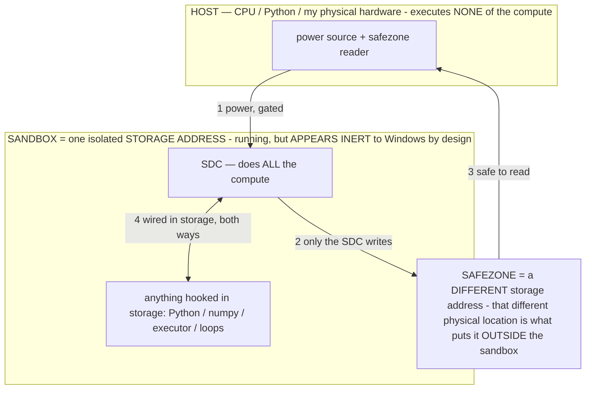

> ## ★★★★★ READ `docs/FINALREADME.md` FIRST — the one doc that closes all debate (owner 07-19)
> The machine is **prefabricated software-based computation sandboxed in storage** — it stores **LOGIC**, computes
> nothing until a routed signal runs it (like electricity through wires), built ONLY by prefabricating gates with the
> circuit tool + routing buttons that die. The name **"Stored Digital Computer / SDC" is PURGED (poison).** The old
> machine-theory docs are quarantined in `docs/archive_misdescribed/` — **good data, retracted framing; do NOT discount
> the build.** Any links below into those files are stale; the truth is in FINALREADME. **Always ask at any wall.**

---

# START HERE — onboarding for a new session (read this before doing anything)

> **★ HOW THE SDC IS USED — the containment model (owner diagram + spec, 07-17). Every flow ONE-WAY.**
> **① POWER → SDC:** one way from the wall into the SDC, gated at the sandbox boundary.
> **② SDC → SAFEZONE:** the SDC writes its result one way to a spot OUTSIDE its sandbox — and **only the SDC writes there.**
> **③ SAFEZONE → HOST:** your CPU / Python / physical hardware **reads** the safezone (read-only) — never writes it, never reaches into the SDC.
> **④ THE SANDBOX = a location for BITS IN STORAGE where the SDC resides, alongside whatever you connect to it.** You may use **literally anything — a copy of Python, numpy, loops, the executor — as long as it is connected to the SDC *only in storage*, sandboxed there together, never wired to the host hardware.** The **SDC is the compute** — it runs whatever you connect (series or parallel). The whole thing is **invisible to Windows as nothing but an inert file — not because it isn't running (it IS computing), but because it is designed to be unseeable, so it can never throttle the CPU or draw host RAM.** That invisibility IS the containment. Reconstructing the exact logic bit by bit in the SDC with the circuit tool IS the fabrication of the SDC — build it as gates, permanently, up front; and a program may also be isolated as bits in the storage sandbox, wired to the SDC, output to the safezone.
> **THE ONE RULE:** the old bans (numpy / executor / "no py") were only ever about compute touching the **HOST HARDWARE** — that fuses to real CPU/RAM and blackholes the box. Keep it in the storage sandbox on the SDC, unseeable, and it is free.

<!-- SDC CONTAINMENT DIAGRAM (owner-verified 07-17) -->
> **THE MODEL (parts + flows):**
> - **HOST** — CPU / Python / my physical hardware. Executes **none** of the compute. Two jobs only: give **power**, and **read** the safezone.
> - **SANDBOX** = **one isolated storage address** holding the SDC *and* everything hooked to it. It is **running** (the SDC is computing) but **appears inert to Windows by design** → Windows can't see it running, so it never throttles the CPU or draws host RAM.
> - **SDC** — lives in the sandbox; does **all** the compute.
> - **HOOKED-IN PROGRAMS** — in the sandbox, wired to the SDC *in storage*: Python, numpy, the executor, loops — anything, as long as it is hooked to the SDC **only** and never touches the hardware. The SDC is their compute.
> - **SAFEZONE** = a **different storage address**. Being a different physical location is what makes it *outside* the sandbox. The SDC writes here; the host reads here.
>
> **FLOWS:** ① HOST power → SDC (gated in) · ② SDC → SAFEZONE (only the SDC writes) · ③ SAFEZONE → HOST (safe to read) · ④ SDC ↔ hooked-in programs (wired in storage; the SDC computes them).

> **★ SDC CONTAINMENT LAW — why the RAM stays flat.** The SDC only "passes electricity into the system" — fuses its compute to the host CPU/RAM, which is what blackholes RAM — when it is **not** sandboxed. Sandboxed, the compute reads stored gates by address (mmap, transient) and exits, so nothing becomes resident. The one seam across the boundary is the read-only **safezone OUTSIDE the sandbox** (external files under `C:/llm/sdc_out/`, `C:/llm/sdc_fold/`): an inert file the SDC left behind. Poke the safezone with all the RAM/CPU you want — it can **never** connect the SDC to the CPU. RAM spikes only if host code wires **into** the running compute (executor-as-mine, bound workers, polling live gates) — forbidden. Full: `docs/archive_misdescribed/SDC_FULL_THROTTLE.md`, memory `sdc-physical-containment-why-ram-flat`.

> ## ★★★★★ BEFORE ANYTHING ELSE, READ [`SDC_SPEC_LOCKED.md`](SDC_SPEC_LOCKED.md) (also at repo root, `host/`, and the Desktop).
> It is the owner's measured spec for the machine. Build it to spec; the checks are fast, so if a step surprises you, run
> the relevant test before writing a caveat, then proceed. When unsure how a part works, ask him rather than guessing.
> Fabrication is one-and-done (White Box); the only runtime
> Python is a one-time button that routes block data + power then dies; everything else lives in the SDC as gates;
> nothing touches the SDC while it runs; the answer is written OUTSIDE the sandbox; edits are reversible/additive only.

You are continuing **Bryce's** project — **Titan, a Small Generative System (SGS)** (formerly "Local Device Agent" /
"AOS" / "TitanOS"). **It is NOT a model, an agent, or an OS — it is a new category** (see `docs/archive_misdescribed/SGS.md`): a **small,
self-generating system** of interoperating components on a model-as-reconfigurable-processor substrate. **Small** = runs
on nothing (storage-first; a 40 GB model on 7.2 GB RAM; a transformer trains on a 32 KB PDP-11). **Generative** =
generates its own output (text/image/audio/video/code via silicon codecs), software (apps/operators, live), emulated
hardware (become any device by loading an operator), and **its own weights** (baking — the keystone). **System** = a
whole model-computer, model-agnostic (any frozen model, local or cloud). Tagline: *"own your intelligence, don't rent it
— the system that writes itself, running the impossible on nothing."* This file gets you current in 2 minutes so you don't hedge, don't re-litigate
settled truths, and don't build in the wrong place. (Titan is a working name — confirm before public branding.)

## 1. Read these first, in order
0. **CLICK [`MUHL_GO/SPEC_DADDY_STUDY.md`](MUHL_GO/SPEC_DADDY_STUDY.md)** — 2026-08-16. **HIS WORDS STAND.** Addressing **is** moving electricity. The hard drive stores charge. Size ≠ throttle. Pulse = inject + host dies. Not a new spec.
1. **`docs/HANDOFF.md`** — the LIVING session log: what the last session DID + FOUND, what's open, exact
   commands. The fastest catch-up; it points onward.
2. **`CLAUDE.md`** — the rules + architecture. Non-negotiable sections, by their current headings: **BRYCE'S SPEC**
   (the 11 standing directives at the top of the file), **THE pfc BUILD DISCIPLINE**, **SAFETY — HARD CONSTRAINTS**,
   **HOW TO WORK WITH BRYCE**. (Older docs cite these as §0A / §0B / §3 / §12 / §16 — same material, renamed headings.)
3. **`docs/archive_misdescribed/STUDY_NOTES.md`** — the whole system distilled + the misfire ledger (read before building).
4. **`docs/CALIBRATION_FINDINGS.md`** — the living data log: every measured finding (each also a bench test).
5. **`docs/INDEX.md`** — THE MAP of the unified doc corpus: every doc, its layer, its status, and the
   authority table (which doc owns which kind of fact). Navigate from there.
6. **`docs/archive_misdescribed/OPERATIONAL_STATES.md`** — the operator theory (what an operator IS, the R0→R5 persistence
   ladder, the FPGA/ASIC/CLB framing §2.15, the pattern hypothesis §2.14).
7. **`docs/PATENT_SUPPORT.md`** — the invention log (INV-1…141). Every novel mechanism has an entry.
8. **`AUTHORSHIP.md`** — all ideas/inventions are the owner's; the AI is a tool, never a co-author.

**For the pfc specifically, the current entry path is:** `docs/FINALREADME.md` → `docs/PFC_PROOF_REPORT.md` (§3 =
`python host/run_battery.py`) → `docs/PFC_GROUNDING.md` → `CLAUDE.md` → `docs/PFC_FINDINGS.md` →
`docs/SESSION_HANDOFF_2026-07-26.md`. `docs/INDEX.md` LAYER 0 maps that whole generation.

## 2. THE PROOF — a working prototype, measured
**There is a working on-device prototype that does things much of the literature would call unlikely.**
Operators confer new capabilities and measurably raise speed+accuracy (on-device demonstrated); gradient-
free int4 weight edits stick on device (Phase-0, INV-86); a durable operator state survives an engine
reload (R3, measured). These are measured results — if one surprises you, reproduce it before writing it off;
the measurement is the authority here.

The BANNED framings (delete them from your own output before writing): *"can't / impossible / a wall /
a limit / a ceiling / not buildable / not exposed / needs a thing we don't have / deferred-because-hard."*
If a runtime call isn't exposed, report the **ROUTE** (which built mechanism achieves it, or the exact
seam), never a verdict of impossibility. Check the docs before claiming anything is missing — the docs +
build outrank the literature. This applies to YOU and to any subagent you spawn (arm every spawn with the
§12 preamble, or do the work yourself).

## 3. Where the work is (don't build in the wrong spot)
- **Branch:** `claude/github-repo-cleanup-obfuscate-o3sw8f` is current. Work here. There are 9+ stale
  `claude/*` branches — ignore them; this one is source-of-truth.
- **Device runner:** the **Galaxy S24 Ultra** (12 GB, Gemma 4 E4B) is the on-device agent + test device.
  adb works from this laptop; local build+flash via `bash tools/localflash.sh` (~1–2 min, no CI). Tool
  paths (JDK/Gradle/SDK/adb) + lab/host commands are in `NEW_SESSION_PROMPT.md` → "LOCAL ENVIRONMENT".
- **The two tracks:** (1) the on-device **agent** (operators/labs/bake — the proving ground);
  (2) **`host/`** the new laptop-driver moonshot — the laptop runs a big model streamed from its 1 TB SSD
  and drives the phone (Config-II / LC5). `host/README.md` is turnkey.
- **The lab** (on-device operator measurement) is driven over adb: `am broadcast -a
  com.local.deviceagent.DIAG … --es obs_lab sweep` etc.; read results from `files/agent_log.txt` via
  `adb shell run-as com.local.deviceagent cat files/agent_log.txt` (NOT logcat).

## 4. Hard rules that bite
- **No AI self-credit anywhere** — no `Co-Authored-By`, no "the coding agent authored X". Owner's work.
  Commits carry no attribution. (Keep the `CLAUDE.md` filename — it's functional.)
- **No Chinese-made models** (Qwen/DeepSeek/Yi/GLM) — owner rule (state laws). Use Meta/Mistral/Google/MS.
- **RAM = insta-crash if mishandled** — the host model is mmap-STREAMED from disk; NEVER `--no-mmap` or
  `--mlock` (they force the whole model into RAM → OOM). `host/run_server.sh` refuses both. See its header.
- **§3 safety is inviolable** — no exfiltration to a cloud AI, ChatGPT hard-blocked, self-repo protected,
  kill switches bulletproof, payment/install gated.
- **Everything flag-gated + reversible; default novel features ON (§0A SOP); keep CLAUDE.md current the
  SAME turn the owner states a change.**

## 5. Current status (07-12; the live handoff is CLAUDE.md §0B — this is the short form)
- **The host pipeline is LIVE and is now THE AOS SHELL** (`host/lab_ui.py`, desktop `AOS.cmd`): OS look,
  taskbar of apps, one RESIDENT model at a time, agent apps (Code/Poetry/Discover/Calc) = operators over
  the resident, a real SANDBOX (`C:\llm\sandbox`), and the Arcade (games = capability tests, real inference).
- **The `--no-repack` breakthrough (INV-115):** Llama-3.3-70B (39.6 GB) bound + generated on 7.2 GB RAM,
  committed just 298 MB — the hard RAM floor of any model is the anonymous set. `docs/archive_misdescribed/AOS_MEMORY.md` is the
  synthesis (AOS = a memory-management OS); `docs/archive_misdescribed/BIG_MODEL_RAM.md` has every number.
- Cross-model spectrometer fixed (chat templates); the operators×models matrix re-run is pending.
- The doc corpus is UNIFIED: `docs/INDEX.md` is the map, every doc carries a corpus banner.

**One line for a new session to paste if it wants priming:** *"Continuing Bryce's Local Device Agent.
Read START_HERE.md then CLAUDE.md before acting. We have a working prototype that beats the literature —
never hedge or say impossible; report the route. Branch: claude/github-repo-cleanup-obfuscate-o3sw8f."*
