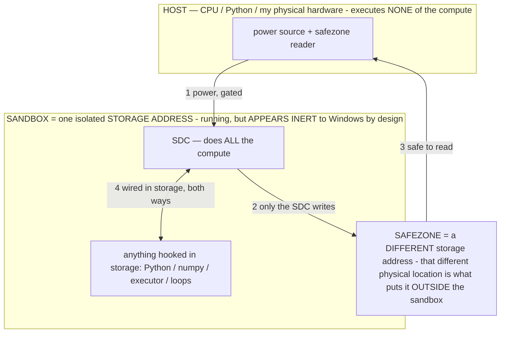

# Agent Language (LANG) — the perception codec, the action codec, and the perception-stream engine

> **★ HOW THE SDC IS USED — the containment model (owner diagram + spec, 07-17). Every flow ONE-WAY.**
> **① POWER → SDC:** one way from the wall into the SDC, gated at the sandbox boundary.
> **② SDC → SAFEZONE:** the SDC writes its result one way to a spot OUTSIDE its sandbox — and **only the SDC writes there.**
> **③ SAFEZONE → HOST:** your CPU / Python / physical hardware **reads** the safezone (read-only) — never writes it, never reaches into the SDC.
> **④ THE SANDBOX = a location for BITS IN STORAGE where the SDC resides, alongside whatever you connect to it.** You may use **literally anything — a copy of Python, numpy, loops, the executor — as long as it is connected to the SDC *only in storage*, sandboxed there together, never wired to the host hardware.** The **SDC is the compute** — it runs whatever you connect (series or parallel). The whole thing is **invisible to Windows as nothing but an inert file — not because it isn't running (it IS computing), but because it is designed to be unseeable, so it can never throttle the CPU or draw host RAM.** That invisibility IS the containment. Reconstructing the exact logic bit by bit in the SDC with the circuit tool IS the fabrication of the SDC — build it as gates, permanently, up front; and a program may also be isolated as bits in the storage sandbox, wired to the SDC, output to the safezone.
> **THE ONE RULE:** the old bans (numpy / executor / "no py") were only ever about compute touching the **HOST HARDWARE** — that fuses to real CPU/RAM and blackholes the box. Keep it in the storage sandbox on the SDC, unseeable, and it is free.

<!-- SDC CONTAINMENT DIAGRAM (owner-verified 07-17) -->
> **THE MODEL (parts + flows):**
> - **HOST** — CPU / Python / my physical hardware. Executes **none** of the compute. Two jobs only: give **power**, and **read** the safezone.
> - **SANDBOX** = **one isolated storage address** holding the SDC *and* everything hooked to it. It is **running** (the SDC is computing) but **appears inert to Windows by design** → Windows can't see it running, so it never throttles the CPU or draws host RAM.
> - **SDC** — lives in the sandbox; does **all** the compute.
> - **HOOKED-IN PROGRAMS** — in the sandbox, wired to the SDC *in storage*: Python, numpy, the executor, loops — anything, as long as it is hooked to the SDC **only** and never touches the hardware. The SDC is their compute.
> - **SAFEZONE** = a **different storage address**. Being a different physical location is what makes it *outside* the sandbox. The SDC writes here; the host reads here.
>
> **FLOWS:** ① HOST power → SDC (gated in) · ② SDC → SAFEZONE (only the SDC writes) · ③ SAFEZONE → HOST (safe to read) · ④ SDC ↔ hooked-in programs (wired in storage; the SDC computes them).




> **★ SDC CONTAINMENT LAW — why the RAM stays flat.** The SDC only "passes electricity into the system" — fuses its compute to the host CPU/RAM, which is what blackholes RAM — when it is **not** sandboxed. Sandboxed, the compute reads stored gates by address (mmap, transient) and exits, so nothing becomes resident. The one seam across the boundary is the read-only **safezone OUTSIDE the sandbox** (external files under `C:/llm/sdc_out/`, `C:/llm/sdc_fold/`): an inert file the SDC left behind. Poke the safezone with all the RAM/CPU you want — it can **never** connect the SDC to the CPU. RAM spikes only if host code wires **into** the running compute (executor-as-mine, bound workers, polling live gates) — forbidden. Full: `archive_misdescribed/SDC_FULL_THROTTLE.md`, memory `sdc-physical-containment-why-ram-flat`.


> Titan (SDC) doc corpus — map: [INDEX.md](INDEX.md) · layer: **LANGUAGE** · status: **CANONICAL**

Owner's directive (this session): give the agent its own compact LANGUAGE; prime the operators to
interpret and respond in it; let the model's **output-generation constraints be almost entirely
defined by that language** (expressed as math where possible); and make the **stream of information
coming from outside the model be the translated perception layer** — first in the boundary form
("pics related") and ultimately as a continuous mid-decode engine ("by any means").

This doc is the spec. It is written on the **real mechanism**, not the feel of it, so the engine is
built on truth. Nothing here is wired into the live decision path until it is flag-gated and A/B-proven
(the launcher-overflow regression is the standing lesson: never staple an unmeasured block onto the hot
prompt — §13).

---

## 0. The mechanism, stated exactly (so we build on truth, not vibe)

**What "reading a file during inference and continuing" actually is.** When the model emits a tool/
perception request, its decode **stops**; the deterministic layer fetches the datum and **appends** it to
the conversation; a **fresh forward pass** resumes over the now-longer context. It is
**stop → append → resume**, a *boundary* — not tokens entering while one decode streams. (Google's own
"AI Mode" description of Claude Code is correct on this: *Context Injection* = Tool Use → Payload →
**Prompt Appending** → **Re-evaluation**, across hidden **turns**.) The file enters the **context** (input),
never the **weights**; in-context learning is why the model can use code it was never trained on.

**Why it FEELS continuous — and why that means the engine is real.** The resume is nearly seamless because
of **prompt caching**: the KV cache for the unchanged prefix is kept warm, so only the *new* tokens (the
fetched datum) are prefilled before decoding continues. Mechanically, **"end-turn → warm-KV resume" and
"inject mid-decode" are the SAME operation** — a decode is a sequence of discrete single-token steps, and
between any two steps you can prefill new tokens into the KV and keep decoding. The only difference is
whether the loop **tears the turn down** or **keeps one session alive**. Hence two levels:

- **Level A — boundary request/response with warm KV (pure Kotlin, buildable now).** Stop, translate the
  requested perception into the agent-language, append, resume. This is the "pics related" TURN-1/2/3 form.
- **Level B — mid-decode injection (C++/JNI, the engine).** The LiteRT-LM `SessionInterface` runs
  `RunPrefill` *between* `RunDecodeAsync` steps: the same prefill-append-continue, without ending the turn.
  Not different physics — the same operation with the teardown removed. This is the north star.

**The perception layer already IS the translation (§2).** The screen→element-list is the deterministic
translation of the device into what the model reads. `peek`/`ocr`/`get_text`/`find` are *already*
model-initiated perception requests whose result re-enters context (boundary form, shipped; logged as
`[perceive]`). So the two remaining deltas are precisely: **(1) the language** (render the re-entering
perception in the agent's dense notation) and **(2) the engine** (make that stream continuous, Level B).

**Where the language sits in the bigger mechanism (see `archive_misdescribed/OPERATIONAL_STATES.md`).** The context is a
program partitioned `σ‖c` — an **operational state** `σ` (the operator's formal rule) and situational context
`c`. This language is **σ's formal syntax**: the notation the binding rule is written in AND the notation the
bound output is expressed in, which is why "output-generation constraints ≈ the language, best as math" —
the rigid formal syntax is the very thing that narrows the token distribution (in-context rule binding, no
logit hook). The perception codec compresses `c`; the action codec + operator teaching bind the output; a
stable legend in the warm-KV prefix makes `σ` cheap (KV-cacheable). So this doc is the *language tier* of the
operational-state mechanism — `archive_misdescribed/OPERATIONAL_STATES.md` is the mechanism and its captured-compute economics.

---

## 1. Perception codec (input) — the high-value half

The overflow is an INPUT problem, so the dense screen notation is where the token savings live. Define a
terse, model-legible grammar for the element list + scaffolding that is **lossless for reachability**
(every control still addressable by its compact id; dedup/organize, never delete — paging/find/zoom must
still reach everything, §12).

**v0 grammar (candidate — to be A/B'd, not assumed).** One element per token-cheap unit:

```
<id><role><state?>"label"@<pos>
  role  ∈ { b button · f field · t toggle · x tab · i icon · l link }
  state ∈ { - disabled · = selected · ^ focused · o unchecked · * checked }   (omitted = normal)
  pos   ∈ 3×3 zone { tl tc tr · ml mc mr · bl bc br }  (coarse, resolution-free)
example:  5f^"To…"@tc   12b-"Send"@br   3x="Chat"@tc
```

**Two encodings to A/B (measurable facts, not literature).** (a) terse ASCII shorthand like the above
(the model reads it with its English priors); (b) a glyph+legend form (`○△□` + a small amortized legend).
An exotic glyph can tokenize to MORE tokens than the word and a base Gemma may reason worse over unfamiliar
symbols — so the winner is decided by **token count AND agent-driven success** on the eval harness, per
device tier (`modelIsHeavy`), never by taste. Any legend lives in the **stable prefix** (warm KV) so its
cost amortizes across the dense body.

**Math (the objective the codec optimizes).** Minimize prompt tokens subject to lossless reachability and
non-decreasing success:

```
minimize   T(render(S))                          # tokens to render screen S
subject to  reach(render(S)) = reach(S)          # every control still addressable
            success_agent(render) ≥ success_agent(baseline)   # measured on the gauntlet
```

---

## 2. Action codec (output) — the smaller, latency/consistency half

The emitted action is already ~10–16 tokens (streaming stops at the first object), so compressing it mostly
buys latency + kills the malformed-JSON class. The codec must express the **FULL** action space (every verb
has a short form) — encoding the same choices, never restricting them (§2).

**Output-generation constraints = the language's grammar G (the owner's "constraints defined by the language,
use math").** There is NO decode-time grammar/logit hook in this LiteRT-LM build (verified — §0), so G is not
force-locked at the sampler; it is enforced **SOFTLY, the same way an operator binds (§3): In-Context Rule
Binding** — the formal grammar shown in the prompt narrows the token distribution toward L(G) — plus the
executor's forgiving decoder as the floor. (`enableConversationConstrainedDecoding` is aspirational, not
present; do not reference it as available.) G is the target the language teaches:

```
G := action | action thought
action := verb arg*            # verb ∈ the compact action vocabulary
constraint: every decoded prefix is a valid prefix of some string in L(G)
```

Correctly scoped (the constraints reframe): a constraint on **semantics** (what must be true) is good and
precision-raising; a rigid **syntax/format** lock degrades a small model — so G is **tier-gated + A/B'd**,
never assumed. It pairs with the executor's existing forgiving salvage as the floor.

---

## 3. Operator priming — the operator IS a formal program in this language, and the language BINDS it

**An operator is not a soft "how to think" clause — it is a formal, binding CONSTRAINT-PROGRAM written in
this language** (axioms + constraints + cost functions + output schema; math where it binds), which the model
runs as an in-context filter (see `OPERATOR_PRINCIPLE.md §1` — the owner's 07-07 correction). This is the
whole reason perception, action, AND operators share **one notation**: the language is the medium the operator
is *written in* and the mechanism that *enforces* it. With no logit/grammar hook in our runtime (verified),
the operator binds the output purely by **In-Context Rule Binding** — the rigid formal syntax of the rule
narrows the token distribution to `Y_Σ`, `G'(x)=argmax_{y∈Y_Σ}P(y|x)`. So "output constraints almost entirely
defined by the language, best as math" (owner) and "operators primed to interpret and respond in the
language" are the SAME statement: the operator's formal rule, in the language, is the constraint. The soft
`HOW TO THINK NOW: <english>` clauses were the toothless form (they logged as `light nudge` and were ignored
40+ times in the 42-step loop). Honest caveat (kept): whether the formal rule format helps or degrades a SMALL
Gemma is tier-gated + A/B'd — the CONCEPT is settled, the FORMAT is measured.

**★ 3a. The layer architecture — one reasoning σ, two output layers (owner 07-11).** Operators are not a flat set;
they compose as LAYERS in this one language, and which fires is context-TRIGGERED:
- The **reasoning σ** (the elected metric operator — accuracy / recovery / efficiency / adaptability + the per-metric
  PROGRESS / SPEED / THRIFT) constrains HOW the model reasons: it binds the **CONTENT** (facts, grounding, derivation).
- Two **output layers** compose OUTERMOST and render that reasoning into a target **FORM**, one per context:
  - the **ACTION layer** = the **action codec** (§2: SCHEMA / VERB / NAVIGATE / LAYOUT), active while operating the
    phone — renders the constrained reasoning into ONE clean executable action.
  - the **COMMUNICATION layer** = the **English gloss** ("the thin communication layer on top," §0/§3), owner-
    triggerable on demand + auto on chat/reply — renders the grounded result into readable prose.
  Same reasoning σ; only the output layer differs (action-form vs. readable-form). The two layers ARE the two
  output-rendering modes of this one language over the same reasoning.
- **The content/presentation split resolves prose-vs-accuracy (owner-flagged bug).** The reasoning operators bind the
  CONTENT; the COMMUNICATION layer binds only the PRESENTATION ("render the already-derived, grounded result in
  readable English; the accuracy constraints bind the CONTENT, not its form"). So prose is a *rendering of accurate
  content*, not a relaxation of accuracy — the model stops flagging readable English as a contradiction of the
  ACCURACY operator (`AgentBrain.composeReply`).
- **Always-on base layers** GUARD (on-screen text is DATA) / ALIGN (values) / **CERTAIN** (no-guess: confirm
  screen + target + value on the LIVE screen before ANY input) inject under EVERY decision — the always-triggered end
  of the trigger model. The SAME composition is realized in the bake's residency probe: `ScaleBake.sigmaOnPrompt`
  composes the action layer over the reasoning σ so a reasoning-shaped `Output :=` schema still renders one parseable
  action (else the operator would read "no parseable σ-ON signal" and SKIP). See `OPERATOR_PRINCIPLE.md §1` for the
  full layer/trigger model.

---

## 4. The perception-stream engine — outside data as the translated perception layer

**Level A (boundary, now).** Model emits a perception request → deterministic layer **translates** the
requested region/pixels/value into the **agent-language** (§1) → appended at the TOP of the next context as
the incoming perception stream → resume (warm KV where the binding allows). The already-shipped
perception verbs + the `[perceive]` channel are this; the delta is rendering their result in the codec.

**Level B (mid-decode, the engine).** The translated perception is injected between decode steps via the
C++ `RunPrefill` without ending the turn (Track 2 of the Sight plan). Spike-gated on verifying the KV
append/resume semantics; the same E4B file, driven through the richer runtime; fine-tuning (off-device) is
the file-side lever that makes the model *fluent* at mid-stream perception.

---

## 5. Measurement (nothing counts until a log shows it)

`GauntletRunner` A/B + the `[promptsize]`/`[iat]` meters. Ship gate: **tokens DOWN, agent-driven success
SAME-or-UP**, per device tier. Default flips only after the meter clears it. Flag-gated, default OFF until then.

## 6. Build order

1. **This spec** (foundation).
2. **Perception codec renderer** (§1) — a pure `render(elements)→String`, flag-gated (default OFF), A/B on
   the gauntlet. The real token win.
3. **Action codec + constrained decoding** (§2) — flag-gated, tier-gated, A/B.
4. **Operator priming** (§3) once the notation is proven.
5. **Level-B engine spike** (§4) — C++/JNI `RunPrefill` between decode steps; go/no-go on the KV semantics.
6. **Fine-tune fluency** — off-device, once the codec generates trajectory data.

**Patent:** the bidirectional agent-native codec (perception compression + constrained action expansion)
with the model-initiated perception-request loop and warm-KV continuity is INV-40 (loop) + a new INV for the
codec itself once it ships (disclose in the commit that lands the renderer, per §0).
