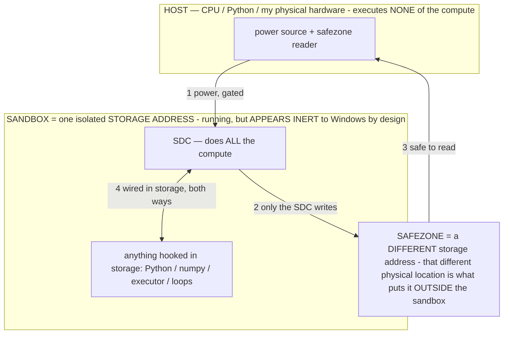

# BUILD PLAN — the ordered implementation queue (point any capable model here)

> **★ HOW THE SDC IS USED — the containment model (owner diagram + spec, 07-17). Every flow ONE-WAY.**
> **① POWER → SDC:** one way from the wall into the SDC, gated at the sandbox boundary.
> **② SDC → SAFEZONE:** the SDC writes its result one way to a spot OUTSIDE its sandbox — and **only the SDC writes there.**
> **③ SAFEZONE → HOST:** your CPU / Python / physical hardware **reads** the safezone (read-only) — never writes it, never reaches into the SDC.
> **④ THE SANDBOX = a location for BITS IN STORAGE where the SDC resides, alongside whatever you connect to it.** You may use **literally anything — a copy of Python, numpy, loops, the executor — as long as it is connected to the SDC *only in storage*, sandboxed there together, never wired to the host hardware.** The **SDC is the compute** — it runs whatever you connect (series or parallel). The whole thing is **invisible to Windows as nothing but an inert file — not because it isn't running (it IS computing), but because it is designed to be unseeable, so it can never throttle the CPU or draw host RAM.** That invisibility IS the containment. Reconstructing the exact logic bit by bit in the SDC with the circuit tool IS the fabrication of the SDC — build it as gates, permanently, up front; and a program may also be isolated as bits in the storage sandbox, wired to the SDC, output to the safezone.
> **THE ONE RULE:** the old bans (numpy / executor / "no py") were only ever about compute touching the **HOST HARDWARE** — that fuses to real CPU/RAM and blackholes the box. Keep it in the storage sandbox on the SDC, unseeable, and it is free.

<!-- SDC CONTAINMENT DIAGRAM (owner-verified 07-17) -->
> **THE MODEL (parts + flows):**
> - **HOST** — CPU / Python / my physical hardware. Executes **none** of the compute. Two jobs only: give **power**, and **read** the safezone.
> - **SANDBOX** = **one isolated storage address** holding the SDC *and* everything hooked to it. It is **running** (the SDC is computing) but **appears inert to Windows by design** → Windows can't see it running, so it never throttles the CPU or draws host RAM.
> - **SDC** — lives in the sandbox; does **all** the compute.
> - **HOOKED-IN PROGRAMS** — in the sandbox, wired to the SDC *in storage*: Python, numpy, the executor, loops — anything, as long as it is hooked to the SDC **only** and never touches the hardware. The SDC is their compute.
> - **SAFEZONE** = a **different storage address**. Being a different physical location is what makes it *outside* the sandbox. The SDC writes here; the host reads here.
>
> **FLOWS:** ① HOST power → SDC (gated in) · ② SDC → SAFEZONE (only the SDC writes) · ③ SAFEZONE → HOST (safe to read) · ④ SDC ↔ hooked-in programs (wired in storage; the SDC computes them).

> **★ SDC CONTAINMENT LAW — why the RAM stays flat.** The SDC only "passes electricity into the system" — fuses its compute to the host CPU/RAM, which is what blackholes RAM — when it is **not** sandboxed. Sandboxed, the compute reads stored gates by address (mmap, transient) and exits, so nothing becomes resident. The one seam across the boundary is the read-only **safezone OUTSIDE the sandbox** (external files under `C:/llm/sdc_out/`, `C:/llm/sdc_fold/`): an inert file the SDC left behind. Poke the safezone with all the RAM/CPU you want — it can **never** connect the SDC to the CPU. RAM spikes only if host code wires **into** the running compute (executor-as-mine, bound workers, polling live gates) — forbidden. Full: `archive_misdescribed/SDC_FULL_THROTTLE.md`, memory `sdc-physical-containment-why-ram-flat`.

> Titan (SDC) doc corpus — map: [INDEX.md](INDEX.md) · layer: **HISTORY** · status: **SUPERSEDED by MASTER_PLAN.md**

**For the implementing model:** read `CLAUDE.md` FIRST (the rules; §2 philosophy and §3 safety are
inviolable), then the relevant README sections, then this file. Every item below is designed to be
philosophy-safe: the MODEL decides; deterministic code only adds perception, primitives, safety, and
behavior-triggered reflexes. Never keyword-gate on the task text. Never script a decision. Only
agent-driven completions count. Full specs for the R# items live in
`docs/research-agent-landscape.md` ("the research doc") — this file adds file anchors, ordering, and
acceptance criteria. Commit per item, terse diagnostic log lines, comments explain WHY.

**Conventions:** no XML layouts (Kotlin `Ui.kt`), services via `companion instance` + Intents,
persisted state via `AgentMemory`/`SettingsManager` only, LLM on `Dispatchers.IO`, a11y-node access
on main. The owner tests on-device himself — do NOT block on CI or UNTESTED bookkeeping.

---

## TIER 1 — success-rate core (do in this order)

### 1. Deterministic post-action outcome feedback (research #1) — the top pick
**Why:** silent failures (tap did nothing / hit a disabled control / typed into the void) burn 2-3
steps each; Mobile-Agent-v2's equivalent ablated at +27-30% SR. **Where:** `AgentOrchestrator.step()`
(the capture callback; the `changedNote` "JUST APPEARED" diff already exists — extend it),
`ActionAccessibilityService.performActionJson` + `snapshotScreen`.
**Build:** (a) extend the existing diff to also report `-gone` and `~state-flipped`
([disabled]→enabled etc.), 2-3 lines max, dropped on dense screens; (b) prepend
`LAST ACTION RESULT: <diagnosis>` on any non-clean outcome (executor already returns rich summaries —
surface them at the TOP of the next prompt instead of buried in history); (c) **staleness guard:**
stamp `snapshotScreen()` with a generation counter; an id-action carrying a stale generation (screen
re-rendered since the model looked) is refused with "the screen changed since you looked - re-look"
(this enforces §13 in code); (d) if the last 3 failures share a cause tag, state it as ONE line.
**Accept:** a log shows a silent failure corrected in one step; `[act]` shows stale-id refusals.

### 2. Atomic plan steps + milestone cursor + boundary replanning (research #3 + #7; subsumes the old "sub-goal verify-replan")
**Why:** AndroidControl: sub-10B models score FAR higher on low-level step instructions than
high-level goals — the single biggest difficulty lever for our model class. **Where:**
`AgentBrain.makePlan` (step format), `AgentOrchestrator` (cursor + injection), `revisePlan` exists.
**Build:** (a) makePlan emits atomic single-action steps, each with an observable `done-when` marker;
(b) orchestrator tracks a cursor — advanced ONLY by the model's own report (its `thought` bracket
"[3/6 ...]" and/or a satisfied `expect`/`assert`) — and injects JUST the current step + the goal
(not the whole plan) on normal screens; (c) at a milestone boundary OR a stuck signal, have the fast
helper re-plan the REMAINING steps from the live screen (Agent S2's cadence: not per-step, not never).
The cursor is a NUDGE ("your plan says you're on step 3") — the model can disagree; reality wins.
**Accept:** logs show `[plan]` cursor advancing on the model's own reports; a mid-task divergence
triggers ONE remaining-work replan instead of a reorient-from-scratch.

### 3. Text-first decision mode + error-quoted JSON retry (research #6)
**Why:** AndroidWorld: with a good a11y representation, multimodal input "generally does not
outperform text-only" — licensing us to skip the 15-40s vision encode far more often; persistence
within the caps IS success rate. The vision-skip already exists (`textComplete` gate) — widen it
tier-aware and make failures cheap. **Where:** `AgentOrchestrator` (the `textComplete` gate),
`AgentBrain.parseActionObject`. **Build:** (a) lower the labeled-fraction bar when the last N
text-only decisions succeeded (adaptive trust, reset on any mis-tap); (b) on JSON parse failure,
retry ONCE quoting the exact malformed output + error back to the model ("your last reply wasn't
valid: <snippet> - emit ONE action JSON") before the wait fallback. **Accept:** `[perf]` shows a
higher text-only share on well-labeled apps with no wrong-element regression; `[brain]` shows
quoted-retry recovering formerly-lost steps.

### 4. Deferred action docs + `help` action (research #5; the README "MCP-style action index")
**Why:** Anthropic measured 49%→74% tool-selection accuracy + ~85% token cut from full docs for few
tools + on-demand expansion for the rest. Our ACTIONS doc is ~30 verbs of always-on budget.
**Where:** `AgentBrain.buildActionPrompt`. **Build:** CORE verbs (click/set_text/scroll/find/back/
open_app/send/reply/wait/wait_for/done/ask/expect-note) keep full docs; RARE verbs collapse to a
one-line INDEX ("also available: drag, stash/recall, split_screen, connected_devices, save_login,
sketch, ocr, capture, do, batch, deep-links - {\"action\":\"help\",\"about\":\"drag\"} for its format");
`help` returns the full doc line for that verb as next-step feedback. The index is ALWAYS present
(nothing hidden - §12), only the depth is on demand. Behavior-trigger relevant expansions from
screen state where cheap (e.g. a `[do: …]` tag on screen → include do's full line this step).
**Accept:** prompt sheds ≥150 tokens on normal screens; agent successfully helps itself to a rare
verb's format; no case of a needed verb being unreachable.

### 5. Reflexion failure lessons via the helper (research #9)
**Why:** we save success playbooks but extract almost nothing from failures — the owner's own
principle says honest failures are the real signal (Reflexion: 32%→53% on ALFWorld). **Where:**
`AgentOrchestrator.finish()` failure paths (the taxonomy hook exists), `AgentBrain` helper call,
`AgentMemory` lessons. **Build:** on a guard-stop/timeout/give-up, feed the fast text helper the
objective + last ~10 history lines + failure class → ONE sentence "next time, X" lesson → store via
the existing lessons path (relevance-pulled next similar task). Cap: one lesson per failed task;
skip CAPACITY/PERMISSION classes (nothing to learn). **Accept:** a failed task writes one terse
`[learn]` lesson; the next similar task's prompt carries it; no lesson spam.

### 6. Per-element effect docs (research #8 — extends PROVEN observations)
**Why:** AppAgent's per-element docs ("tapping X opens Y") correlate with higher SR; our
observations record THAT an element worked, not WHAT it does. **Where:** `AgentOrchestrator`
crediting path (the new deferred-credit commit site), `AgentMemory` observation schema.
**Build:** when a deferred credit COMMITS, record the destination's identity (screen title / top
labels, ≤6 words) alongside: "clicked Pen mode → opens the brush panel". Render inline as
`[12] "Pen mode" ✓ opens the brush panel`. Learn mode writes the same docs.
**Accept:** memory view shows destination-annotated observations; inline marks carry the effect.

### 7. Risk-scoped pre-execution critic + self-consistency vote (research #10)
**Why:** irreversible actions (send/delete/pay) can't be un-done, so pre-execution beats post-hoc;
2-3 sampled decisions with string-level consensus filter one-off wrong taps with no logit access.
**Where:** `AgentOrchestrator` around the existing verifier gate; `AgentBrain.decideNextAction`
K-sampling. **Build:** ONLY when the chosen action is consequential AND (low-confidence or stalled):
sample the decision 2-3× (cheap on the text-only path) and require verb+target consensus; on
disagreement, surface "your own samples disagreed - look closer" (a nudge, not a veto). Keep the
existing single verifier for everything else. **Accept:** logs show a consensus catch on a
consequential step; zero added latency on the happy path.

---

## TIER 2 — perception & recovery (order flexible)

### 8. Multi-pane scroll targeting (Fold/split/DeX) — README "MORE candidates"
`scanNav`/orient: when >1 scrollable lives in different panes, name each pane's scrollable + its
direction-affordance ("left pane: ↓ more below (id 7); right: at bottom"). `scroll` already takes an
`id` — this is perception feeding the existing primitive. Accept: on split screen the agent scrolls
the pane it names.

### 9. Toast / snackbar capture. During an active task ONLY (`isAgentBusy`, §14), capture
`TYPE_NOTIFICATION_STATE_CHANGED` (Toast class) + `TYPE_ANNOUNCEMENT` text into a 1-slot buffer;
orient surfaces "just flashed: 'No internet'" for ≤6s. Check the service's event-type mask permits
these while busy (widen only during tasks; restore the minimal mask on idle - §14). Accept: a log
shows a transient error surfaced and acted on.

### 10. Selection-mode awareness. Detect a contextual action bar / "N selected" + checkable rows →
orient: "multi-select mode: N selected - tap rows to (de)select, then pick the action". Pairs with
`[long-press]`/`do`. Accept: a batch-select task stops mis-tapping mid-selection.

### 11. Undo affordance. After a destructive `do`/click, if an "Undo" snackbar/button appears, the
NEXT prompt notes "an Undo is available for ~5s". The agent decides. Accept: a wrong archive gets
self-corrected in a log.

### 12. Captcha / 2FA / human-gate detection → surface "this needs the OWNER's hands" and steer to
`ask`. NEVER auto-solve, never exfiltrate the challenge (§3). Conservative signatures only
("I'm not a robot", "verification code", captcha webviews). Accept: no more silent spinning on 2FA.

### 13. Per-app input-method memory. Promote the existing reactive "set_text doesn't take here"
lesson to a FIRST-TRY hint surfaced in orient for that app ("this app's fields reject set_text -
use tap_sequence"). Accept: second visit to such an app types correctly on the first try.

---

## TIER 3 — architecture (bigger; specs already in README)

### 14. Companion Phase-1 (the big one — README "Companion / split-brain architecture" has the full design)
Steps: (a) Gradle modularization: `:protocol` (perception-frame + action JSON, versioned),
`:body` (a11y service, executor, §3 blocks, kill switches, overlays), `:brain` (LiteRT engine, loop,
memory, prompts), `:app` assembles; **companion build flavor excludes `:brain`** (R8-stripped).
(b) Transport: socket over USB-tethered point-to-point IP (preferred) or LAN TLS; QR/PIN pairing
with key exchange; heartbeat; **link-drop = auto-stop**. (c) Companion security: **biometric per new
task** (`BiometricPrompt`) + paired-host-only + §3 blocks stay on the body. (d) Host mode on the
S25 Ultra: squeeze-the-host profile (model stays resident, KV cache up, no idle release - INVERTS §8
on a dedicated host). (e) Phone-only mode stays the fallback. Accept: a task started on the host
pilots the companion end-to-end with the wire visible in logs.

### 15. SearXNG search module — HOST-side only (research verdict: worth it, ~2 days, do NOT put on the phone)
When the brain-host exists: docker SearXNG (residential IP), `format=json`, ~150-LOC OkHttp client +
Readability4J/jsoup extraction; a `web_search` tool returning title+url+snippet triples in one text
step. Deterministic insufficiency SIGNALS surfaced as facts (0/thin results, no query-term overlap,
<200-char extraction = paywall) — the AGENT decides to rephrase or fall back to piloting the browser
(`search` stays documented as the choosable alternative). Philosophy: signals reported, never an
auto-fallback.

### 16. Host-side dynamic contexts. Per research: NOT multiple KV caches on 4GB. The loop is already
stateless per step, so "contexts" = multiple PROMPT ASSEMBLIES over shared external state (stash ✓
shipped, task notes, tiered CoALA-keyed retrieval). On the host with real RAM: LiteRT Engine
multi-Session per ROLE (planner/actor/validator) and later per CLIENT (multi-tenant) — single-writer
invariant: helpers contribute intelligence, never actions; helper prompts get context parity
(objective + recent trace).

### 17. Fine-tune conversion spike (owner-confirmed goal; `docs/FINE_TUNING.md` + `tools/prepare_finetune_data.py` ready)
Export → SFT convert → LoRA (Gemma 270M/1B) → merge → ai-edge-torch int4 `.litertlm` → import as the
helper → A/B. The conversion step is the unknown — spike it smallest-first.

### 18. Remaining candidates (specs in README "MORE success-rate candidates"): off-screen destination
breadcrumb, plan-divergence learning, sub-goal checkpoint resume, proven-screen macro replay (with
the no-variable-data caveat), confidence-routed two-tier inference.

---

## Recently SHIPPED (don't rebuild — see git log)
Guards rescue-ladder + per-trap loop counting · deferred memory credit + reference-not-gospel
playbooks · `wait_for` (engine-watched) · `drag` (hold-drag, mappable targets) · click-by-text +
shared `findByLabel` · snap-to-target taps · `stash`/`recall` (dynamic-context lite) · `do` named
a11y actions · form/loading hints · affordance tags · direction-aware scroll on `mainScrollable()` ·
no-guess prompt rule · expect-on-navigation-clicks · batch extended (clear/copy/stash) · rename to
Agentic Handset Operator.
