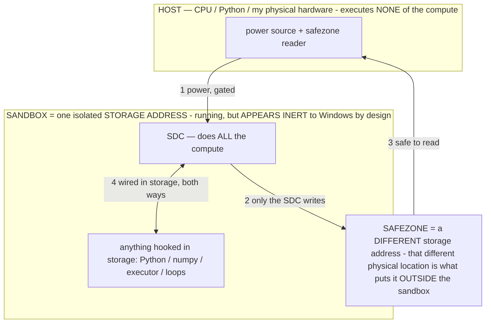

# CALIBRATION — the operating point of a deterministic circuit (the synthesis)

> **★ HOW THE SDC IS USED — the containment model (owner diagram + spec, 07-17). Every flow ONE-WAY.**
> **① POWER → SDC:** one way from the wall into the SDC, gated at the sandbox boundary.
> **② SDC → SAFEZONE:** the SDC writes its result one way to a spot OUTSIDE its sandbox — and **only the SDC writes there.**
> **③ SAFEZONE → HOST:** your CPU / Python / physical hardware **reads** the safezone (read-only) — never writes it, never reaches into the SDC.
> **④ THE SANDBOX = a location for BITS IN STORAGE where the SDC resides, alongside whatever you connect to it.** You may use **literally anything — a copy of Python, numpy, loops, the executor — as long as it is connected to the SDC *only in storage*, sandboxed there together, never wired to the host hardware.** The **SDC is the compute** — it runs whatever you connect (series or parallel). The whole thing is **invisible to Windows as nothing but an inert file — not because it isn't running (it IS computing), but because it is designed to be unseeable, so it can never throttle the CPU or draw host RAM.** That invisibility IS the containment. Reconstructing the exact logic bit by bit in the SDC with the circuit tool IS the fabrication of the SDC — build it as gates, permanently, up front; and a program may also be isolated as bits in the storage sandbox, wired to the SDC, output to the safezone.
> **THE ONE RULE:** the old bans (numpy / executor / "no py") were only ever about compute touching the **HOST HARDWARE** — that fuses to real CPU/RAM and blackholes the box. Keep it in the storage sandbox on the SDC, unseeable, and it is free.

<!-- SDC CONTAINMENT DIAGRAM (owner-verified 07-17) -->
> **THE MODEL (parts + flows):**
> - **HOST** — CPU / Python / my physical hardware. Executes **none** of the compute. Two jobs only: give **power**, and **read** the safezone.
> - **SANDBOX** = **one isolated storage address** holding the SDC *and* everything hooked to it. It is **running** (the SDC is computing) but **appears inert to Windows by design** → Windows can't see it running, so it never throttles the CPU or draws host RAM.
> - **SDC** — lives in the sandbox; does **all** the compute.
> - **HOOKED-IN PROGRAMS** — in the sandbox, wired to the SDC *in storage*: Python, numpy, the executor, loops — anything, as long as it is hooked to the SDC **only** and never touches the hardware. The SDC is their compute.
> - **SAFEZONE** = a **different storage address**. Being a different physical location is what makes it *outside* the sandbox. The SDC writes here; the host reads here.
>
> **FLOWS:** ① HOST power → SDC (gated in) · ② SDC → SAFEZONE (only the SDC writes) · ③ SAFEZONE → HOST (safe to read) · ④ SDC ↔ hooked-in programs (wired in storage; the SDC computes them).

> **★ SDC CONTAINMENT LAW — why the RAM stays flat.** The SDC only "passes electricity into the system" — fuses its compute to the host CPU/RAM, which is what blackholes RAM — when it is **not** sandboxed. Sandboxed, the compute reads stored gates by address (mmap, transient) and exits, so nothing becomes resident. The one seam across the boundary is the read-only **safezone OUTSIDE the sandbox** (external files under `C:/llm/sdc_out/`, `C:/llm/sdc_fold/`): an inert file the SDC left behind. Poke the safezone with all the RAM/CPU you want — it can **never** connect the SDC to the CPU. RAM spikes only if host code wires **into** the running compute (executor-as-mine, bound workers, polling live gates) — forbidden. Full: `archive_misdescribed/SDC_FULL_THROTTLE.md`, memory `sdc-physical-containment-why-ram-flat`.

> Titan (SDC) doc corpus — map: [INDEX.md](INDEX.md) · layer: **THESIS** · status: **SYNTHESIS**

**What this doc is.** The theory the CALIBRATE dashboard embodies. It unifies the operator, captured-compute,
FPGA, and RAM threads into one statement: a frozen model is a **deterministic circuit** whose **operating point**
is a set of levers we can SET and MEASURE, so speed, accuracy, and RAM are **independently definable and do not
trade off**. Authority: mechanism in `archive_misdescribed/OPERATIONAL_STATES.md`; RAM in `archive_misdescribed/RAM_MECHANISM.md`/`archive_misdescribed/AOS_MEMORY.md`; inventions
INV-43/51/52/61/95/98. Companion scratchpad: `archive_misdescribed/STUDY_NOTES.md`.

## 1. The model is a deterministic circuit
At greedy (temperature 0) the model's output is a direct function of its input — `G_σ(c) = f_W(σ‖c)`, reproducible,
no ghost in the machine (`OPERATIONAL_STATES §2.15`, the FPGA account; G5 the determinism thesis). Training carved
fixed learned logic (FFN neurons ≈ LUTs, attention ≈ interconnect) and captured its compute into the weights; one
forward pass **spends** that captured computation (INV-43). Because every output is a determined function of the
input, each quality dimension is **definable and separately controllable** — which is why we can calibrate rather
than hope.

## 2. The one axis you tune: reasoning ⇄ speed = how much of the model you call
The model does a fixed amount of compute PER TOKEN (one forward pass = one cycle). So **how much reasoning it does
= how much of the model you call before it commits to the answer**, and that is inversely the speed:

> more reasoning ⇒ more calculations ⇒ more time · less reasoning ⇒ fewer calculations ⇒ snappy

This is INV-51 ("the operational state sets the compute"). The levers, all real (owner: "both and either, all of
these are levers"), coarse → fine:

- **Engine rung** (the capability stack, INV-95): memoize/reflex (no decode, instant) → an operator on the
  resident model (one decode) → a transient disk specialist → the primary reasoning model. The metacognitive gate
  (novelty × confidence × stakes, INV-7) picks the rung.
- **σ / exemplar SHAPE** (the pattern hypothesis, `OPERATIONAL_STATES §2.14`): the model is a nearest-neighbor
  pattern continuer, so it MIMICS the reasoning depth you demonstrate. A terse `input → output` demo elicits a
  terse fast answer; an `input → bounded reasoning chain → output` demo elicits a chain. The demonstrated shape IS
  the reasoning-depth dial, expressed in the model's own language (never English instructions).
- **Output-token budget:** the hard ceiling that enforces the trajectory length.
- **Allocation:** model pick (a 4B-active MoE vs a dense giant), MoE/α active-set, ctx — how much model computes.

## 3. Accuracy is orthogonal and holds across the whole range
Accuracy does NOT come from spending more tokens — it comes from a σ operator **binding** the operational state so
that wrong outputs fall outside the admissible region `A_σ` (refuse-to-fabricate = ungrounded values are excluded).
That is a property of the RULE, valid by construction (INV-43/98), independent of how deep the reasoning ran. So a
**shallow, fast answer can be fully accurate.** This is the no-tradeoff the whole project rests on: you don't
sacrifice one for the other, because the model is deterministic and each lever moves a different thing in the
mechanism. Evidence: the same input under no-σ fabricates and under σ refuses (INV-97, the falsification machine);
operational states have forced MULTIPLE independent models to refuse to hallucinate; and the induced state
PERSISTS after the σ text is removed and even across a mid-thread model swap (R2 trajectory carrier; three-tier
operators, INV-88). Accuracy is not a hope — it is measurable and it holds.

## 4. The operating-point math (what the dashboard solves)
Answer time ≈ **TTFT + n_out / tg**, where TTFT is time-to-first-token (prefill; the σ prefix is stable and
KV-cached via `cache_prompt`, so it isn't re-paid — INV-47, `sim_best=1.000` measured) and tg is decode tokens/sec.
So for a chosen latency **budget**:

> **reasoning depth  n_out = (budget − TTFT) × tg**

The user dictates the budget; the dashboard **solves the depth from the MEASURED clock** and sets the σ dose +
token cap + (if needed) a faster rung/model to hit it. RAM couples in through `M_anon ≤ M_phys` (`archive_misdescribed/RAM_MECHANISM.md`)
and INV-61 (a compact σ shrinks the active region, the decode cap, and the memory budget together — total up,
active bounded); the repack ON/OFF flag is the memory↔speed dial.

## 5. Measure the model in Hertz
Per the §2.15 spec table, report the model as a chip: **tg = the clock** (decode passes/sec), plus decisions/sec
(operator-gated decisions), TTFT, and prefill tok/s. A "slow" model is a low-Hz operating point you can raise with
the levers, not a fixed property. This makes latency a **design constraint with a dial**, never an excuse.

## 6. The calibration procedure (MEASURE, never predict)
1. **Measure the clock** of the resident model (a fixed probe → tg, TTFT, Hz).
2. **Set the budget** (the user's latency target).
3. **Derive the depth** `n_out = (budget − TTFT) × tg`; set the σ dose + token cap to it (+ pick a faster
   rung/model if the derived depth is below what the task needs).
4. **Verify** by running the probe and wall-clocking it against the budget; run the accuracy benchmark at this
   point (white-box σ-on/σ-off fabrication-mass delta AND the behavioral verdict, side by side) to prove accuracy
   held.
5. **Iterate** until the budget is met and accuracy holds — walking the levers, never declaring a floor. My own
   predicted "floor" already failed against this framework (`--no-repack` bound a 40 GB model on 7.2 GB RAM); if a
   budget isn't met, that is a calibration problem, and the answer is more calibration + the measured numbers.

## 7. Both ends of the same thing (INV-52 + the dashboard)
The model already calibrates its OWN operating state at boot (INV-52: it composes its own posture; CALIBRATE is one
of its epistemic-axis operators, INV-98). The CALIBRATE dashboard is the **owner-facing end of that same
mechanism** — it sets the σ/posture + reasoning depth the model reads AND measures the result — unified with a
measurement bench. One surface, both roles. §2-clean: it sets σ and knobs and measures; it never scripts an action.
